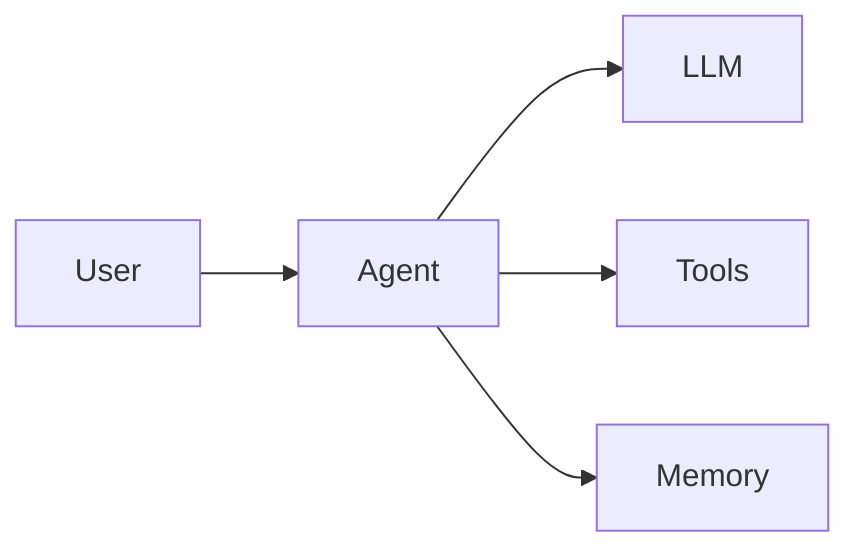

# Agent Architecture

用一个最小运行循环，理解 Agent 如何在任务、模型和工具之间协调执行。

## Agent 是什么

这里把 Agent 理解为围绕任务反复执行「观察 → 决策 → 行动」的程序。语言模型可以负责选择下一步，但状态保存、工具执行、次数限制和结束判断仍由运行时（Runtime）负责。

> 先明确任务完成的条件，再设计循环。一个能调用工具的模型，不等于一个可靠的执行系统。

## 核心组件

| 组件 | 负责什么 | 工程边界 |
| --- | --- | --- |
| Context | 提供当前任务、约束与观察结果 | 只保留决策需要的信息 |
| LLM / Policy | 选择下一步操作 | 输出结构化动作，不直接执行工具 |
| Tools | 执行检索、计算等具体操作 | 校验参数并返回明确结果 |
| Memory | 保存后续步骤需要的状态 | 区分本次任务状态与跨任务存储 |
| Runtime | 驱动循环并决定是否继续 | 设置步数上限、超时和错误处理 |

## Runtime Loop

1. 接收任务，创建初始状态。
2. 把任务与最新观察传给决策函数。
3. 若决策为结束，返回答案；否则检查工具名称和参数。
4. 执行工具，把结果写回状态。
5. 继续下一轮，直到完成或触发步数上限。

成本可以用简单预算表示：$C = \sum_{i=1}^{N} c_i$，其中 $N$ 是执行步数，$c_i$ 是第 $i$ 步的开销。步数限制不能代替真实的时间和费用预算，但能避免无界循环。

## Architecture



图中的 Agent 包含 Runtime：模型提出动作，运行时执行工具，工具结果再进入下一轮上下文。

## Minimal Example

将下面代码保存为 `minimal_agent.py`，使用 Python 3.10+ 运行 `python minimal_agent.py`。示例使用确定性决策函数模拟模型输出，无需 API Key 或第三方依赖。

```python title="minimal_agent.py"
from dataclasses import dataclass, field


@dataclass
class State:
    task: str
    observations: list[int] = field(default_factory=list)


def decide(state: State) -> dict:
    if state.observations:
        return {"type": "finish", "answer": str(state.observations[-1])}
    return {"type": "tool", "name": "add", "args": {"a": 2, "b": 3}}


def add(a: int, b: int) -> int:
    if type(a) is not int or type(b) is not int:
        raise ValueError("add only accepts integers")
    return a + b


def run(task: str, max_steps: int = 4) -> str:
    if task != "计算 2 + 3":
        raise ValueError("This demo only supports: 计算 2 + 3")
    state = State(task=task)
    tools = {"add": add}

    for _ in range(max_steps):
        action = decide(state)
        if action["type"] == "finish":
            return action["answer"]
        if action["type"] != "tool" or action["name"] not in tools:
            raise ValueError("Unsupported action")
        result = tools[action["name"]](**action["args"])
        state.observations.append(result)

    raise RuntimeError("Step limit reached")


if __name__ == "__main__":
    print(run("计算 2 + 3"))  # 5
```

第一轮调用 `add`，第二轮读到观察结果后结束。`decide` 只演示一个固定任务；接入真实模型时，应在这个边界解析并校验模型输出，同时保持工具执行逻辑独立。

## Next Steps

实际接入模型前，先为运行时补充超时、错误分类和执行记录；遇到不可重复的外部操作时，还需要考虑重试与幂等性。

继续浏览 [Agent Engineering](./index.md)，或到 [Engineering](../engineering/index.md) 查看运行环境与工程实践的分类范围。
