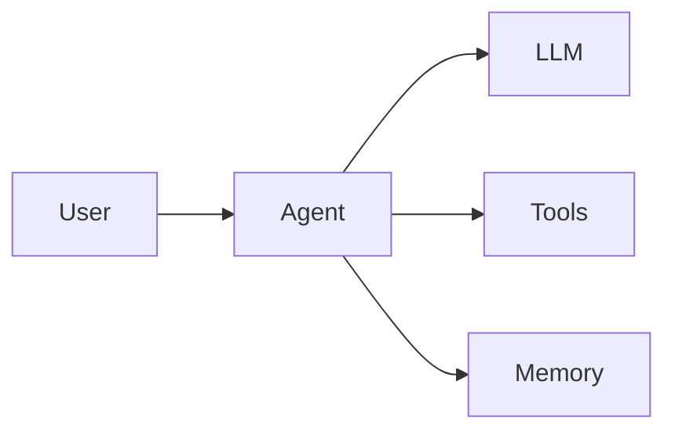

# Agent Architecture

Use a minimal runtime loop to understand how an agent coordinates a task, a model and tools.

## What an agent is

Here an agent is a program that repeatedly runs "observe → decide → act" around a task. A language model can choose the next step, but state, tool execution, step limits and termination are still the runtime's job.

> Define the completion condition before designing the loop. A model that can call tools is not the same as a reliable execution system.

## Core components

| Component | Responsibility | Engineering boundary |
| --- | --- | --- |
| Context | Provides the current task, constraints and observations | Keep only what a decision needs |
| LLM / Policy | Chooses the next action | Emits structured actions, never runs tools directly |
| Tools | Perform retrieval, computation, etc. | Validate arguments and return explicit results |
| Memory | Stores state needed by later steps | Separate per-task state from cross-task storage |
| Runtime | Drives the loop and decides whether to continue | Set step limits, timeouts and error handling |

## Runtime loop

1. Receive the task and create the initial state.
2. Pass the task and the latest observation to the decision function.
3. If the decision is to finish, return the answer; otherwise validate the tool name and arguments.
4. Run the tool and write the result back into the state.
5. Continue until done or the step limit is reached.

Cost can be expressed as a simple budget: $C = \sum_{i=1}^{N} c_i$, where $N$ is the number of steps and $c_i$ is the cost of step $i$. A step limit is no substitute for a real time and cost budget, but it prevents unbounded loops.

## Architecture



In this diagram the agent contains the runtime: the model proposes an action, the runtime runs the tool, and the tool result feeds the next round of context.

## Minimal example

Save the code below as `minimal_agent.py` and run `python minimal_agent.py` with Python 3.10+. The example uses a deterministic decision function to simulate model output, so it needs no API key or third-party dependency.

```python title="minimal_agent.py"
from dataclasses import dataclass, field


@dataclass
class State:
    task: str
    observations: list[int] = field(default_factory=list)


def decide(state: State) -> dict:
    if state.observations:
        return {"type": "finish", "answer": str(state.observations[-1])}
    return {"type": "tool", "name": "add", "args": {"a": 2, "b": 3}}


def add(a: int, b: int) -> int:
    if type(a) is not int or type(b) is not int:
        raise ValueError("add only accepts integers")
    return a + b


def run(task: str, max_steps: int = 4) -> str:
    if task != "计算 2 + 3":
        raise ValueError("This demo only supports: 计算 2 + 3")
    state = State(task=task)
    tools = {"add": add}

    for _ in range(max_steps):
        action = decide(state)
        if action["type"] == "finish":
            return action["answer"]
        if action["type"] != "tool" or action["name"] not in tools:
            raise ValueError("Unsupported action")
        result = tools[action["name"]](**action["args"])
        state.observations.append(result)

    raise RuntimeError("Step limit reached")


if __name__ == "__main__":
    print(run("计算 2 + 3"))  # 5
```

The first round calls `add`; the second reads the observation and finishes. `decide` only demonstrates one fixed task; when you connect a real model, parse and validate its output at this boundary while keeping tool execution separate.

## Next steps

Before connecting a real model, add timeouts, error classification and an execution trace to the runtime; for non-repeatable external actions, also consider retries and idempotency.

Continue with [Agent](./index.md), or see [Engineering](../engineering/index.md) for the runtime environment and engineering practices.
