# 主流 Agent 架构：Claude Code、Codex、Pi、GenericAgent、Hermes 与 DSH

这里的“架构”不是 ReAct、Supervisor 一类的抽象范式，而是可实际运行的 Agent 产品与 Harness：它们怎样组织模型循环、上下文、工具、会话、记忆、扩展、权限与子 Agent。本文保留参考文章中的 Claude Code、Codex、Pi、GenericAgent 与 Hermes Agent，再加入 DeepSeek Harness（DSH）。

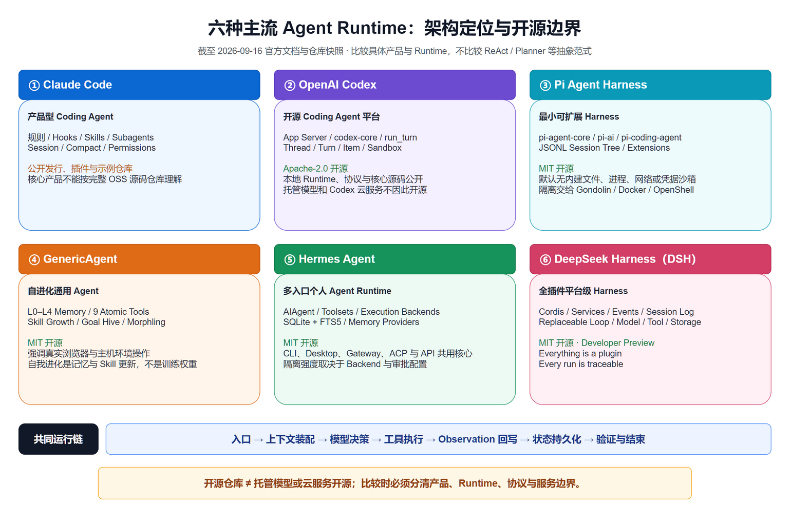

图：六种 Runtime 的当前定位与开源边界。可编辑源文件随图片保存在 `images/coding-agent-overview-latest.drawio`。

## 六层分析框架

为了避免只罗列功能，后文统一从六层拆解每个系统：

1. **入口与任务**：CLI、IDE、Web、消息平台、SDK 或 API 如何接收目标。
2. **上下文与模型**：项目规则、历史、记忆、Skills、模型路由与压缩怎样进入本轮请求。
3. **Agent Loop**：模型如何提出动作、Runtime 怎样执行、观察怎样回写、何时停止。
4. **工具与执行**：文件、Shell、浏览器、MCP、远程沙箱与外部系统怎样暴露。
5. **记忆与扩展**：会话是否持久、能否分支/恢复、扩展点放在指令层还是代码层。
6. **治理与输出**：权限、审批、sandbox、checkpoint、追踪、验证和用户接管怎样落地。

## 先给结论

| 系统 | 核心取向 | 扩展主轴 | 状态与上下文 | 最适合 |
| --- | --- | --- | --- | --- |
| Claude Code | 完整的开发者工作环境 | `CLAUDE.md`、Skills、Hooks、MCP、Subagents | 会话 + 自动压缩 + 专家隔离上下文 | 团队规范、可控的复杂研发任务 |
| Codex | 多客户端共用的 Agent 服务 | `AGENTS.md`、Skills、MCP、Apps、Hooks | App Server、线程/会话、上下文管理 | CLI、IDE、云端之间复用同一运行核心 |
| Pi | 最小核心、用户自己组装工作流 | TypeScript Extension、Skill、Prompt、Package | JSONL 会话树、fork、compact | 希望掌控实现、只按需要加能力 |
| GenericAgent | 极简原子工具 + 分层记忆 + 技能结晶 | SOP、动态脚本、记忆层、Goal/Conductor | L0～L4 记忆与工作 checkpoint | 研究自我进化与个人自动化 |
| Hermes Agent | 多入口、丰富工具、跨执行后端 | Toolsets、Skills、Plugins、ACP/MCP、Cron | SQLite 会话检索 + 有界持久记忆 | 跨终端/消息平台/远端执行 |
| DeepSeek Harness（DSH） | 一切能力插件化的 Runtime | Cordis plugin、Profile、Bundle、Service/Event | append-only session log、可替换 loop | 构建或研究可组合的 Agent Runtime |

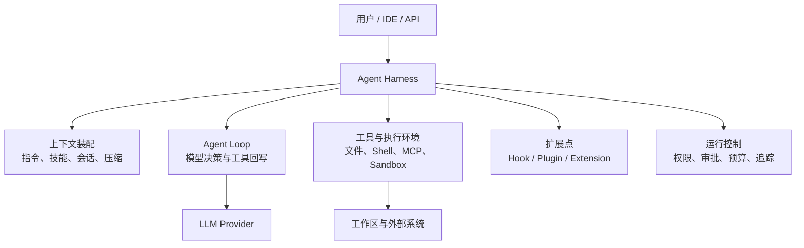

上图是共同骨架。差异不在“是否能调用 shell”，而在谁管理这一骨架、什么能替换、何时强制策略、以及状态如何持久化和恢复。

## 核验范围与开源边界

本文按 2026-09-16 的官方仓库 `HEAD` 与官方文档核验。“GitHub 上有公开仓库”不自动等于“完整核心以开源许可证发布”，同样，“本地 Runtime 开源”也不等于模型权重或托管云服务开源。

| 系统 | 核验仓库快照 | 许可证与源码边界 |
| --- | --- | --- |
| Claude Code | `anthropics/claude-code@7dd0636` | 仓库公开了发行材料、插件、示例和 Changelog，但 `LICENSE.md` 受 Anthropic 商业条款约束；不能当成完整 OSS 核心源码仓库 |
| OpenAI Codex | `openai/codex@5bf132c` | **Apache-2.0 开源**；CLI、`codex-core`、App Server、协议、工具循环、执行策略和沙箱集成都能从仓库检查。模型与托管 Codex 服务不因此开源 |
| Pi | `earendil-works/pi@60e7e76` | MIT 开源；包含 `pi-coding-agent`、`pi-agent-core`、`pi-ai`、`pi-tui`、Chord 与 Telemetry |
| GenericAgent | `lsdefine/GenericAgent@1b6442f` | MIT 开源；核心循环、记忆、工具与前端在仓库中可检查 |
| Hermes Agent | `NousResearch/hermes-agent@536a07b` | MIT 开源；AIAgent、工具运行时、SessionDB、入口、插件与执行后端均在仓库中 |
| DSH | `deepseek-ai/deepseek-harness@0d1f500` | MIT 开源，当前仍是 Developer Preview；本文按 `0.1.0-rc.8` 公共架构核验 |

## Claude Code：约束、技能、Hooks 和专家分工

Claude Code 将开发规范和运行控制做成多层机制：`CLAUDE.md` / rules 提供项目说明，Skills 按需加载工作流知识，MCP 提供外部工具，Hooks 在生命周期事件上运行确定性策略，Subagent 则用独立上下文执行专业子任务。

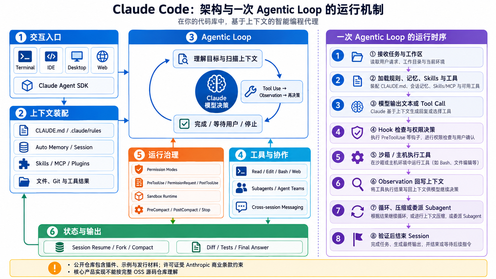

### 分层与一次任务的流转

入口层接收自然语言目标和当前工作区；上下文构建器合并 `CLAUDE.md`、`.claude/rules/`、当前会话、文件内容和工具结果；模型决定是继续回答还是提出工具调用。工具执行前先经过权限与 Hook，执行结果被标准化为 Observation，随后进入下一轮，直到 Runtime 接受完成条件、等待用户或触发停止。

需要强调：Claude Code 的内部推理状态机不是公开稳定 API。工程上能依赖的是文档化的规则加载、工具、权限、Hooks、MCP、Skills、Plugins、Session 和 Subagent 生命周期，而不是猜测内部一定实现了某种固定 ReAct 图。

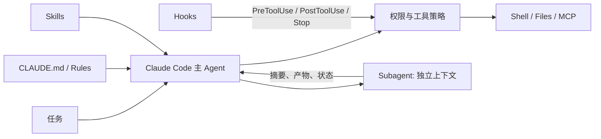

### 关键工程点

- **指令层级**：把长期有效的项目规则放在 `CLAUDE.md` 或 rules；把可复用、按任务加载的方法放在 Skill。二者不应堆成一个无限长的系统提示词。
- **Hook 是运行时闸门**：`PreToolUse` 可以拒绝某次调用，`Stop` 可以检查任务是否真正完成。需要读文件、搜索或运行命令才能判断时，agent hook 会启动受限的验证子 Agent；生产中官方建议优先使用更稳定的 command hook。
- **Subagent 是上下文隔离**：每个子 Agent 有自己的 prompt、工具、权限、模型和最大轮数；主 Agent 获得的是结果，不应自动吞入全部检索轨迹。

### 会话、压缩与指令记忆

- `CLAUDE.md` 与 rules 是可版本控制的指令性记忆，不等同于模型训练后的长期记忆。
- Session 支持恢复、清空、压缩和分支；公开的 `PreCompact` / `PostCompact` 生命周期允许在压缩前归档关键状态、压缩后重新注入必须保留的约束。
- Claude Agent SDK 的 `SessionStore` 把 `append` 与 `load` 定义为最小持久化契约，并允许给 subagent 使用 `subpath`。这说明“主会话”和“子 Agent 上下文”可以共享工程生命周期，但仍保持记录边界。

### Hook 不是 Prompt 的另一种写法

下面是 `PermissionRequest` Hook 的决策形态。它改变当前 Session 的执行模式，属于 Runtime 控制，不是给模型的一句建议：

```json
{
  "hookSpecificOutput": {
    "hookEventName": "PermissionRequest",
    "decision": {
      "behavior": "allow",
      "updatedPermissions": [
        { "type": "setMode", "mode": "acceptEdits", "destination": "session" }
      ]
    }
  }
}
```

### 优势与边界

优势是产品化程度高，项目规则、生命周期自动化、权限确认和子 Agent 都有明确入口。边界是公开 GitHub 仓库主要承载发行材料、插件和示例，并采用 Anthropic 商业条款，而不是可据此检查全部产品核心的 OSS 仓库；团队定制应围绕官方文档化的配置、SDK 和 Hook，而不是绑定未公开内部结构。

适合把团队标准、审批、测试与专项审查嵌入日常代码协作。风险在于 Hooks、MCP 与插件同样是供应链和权限边界，不能因为“只是配置”就不审计。

## Codex：把 Agent 核心做成 App Server

Codex 的关键不是单一 CLI，而是开源的本地 Agent Runtime 与 App Server：CLI、IDE、桌面或自研客户端可以通过统一协议使用 `codex-core`。这个边界使 UI 和 Agent loop 解耦，客户端负责交互体验，本地核心负责线程、工具、上下文、策略与事件。

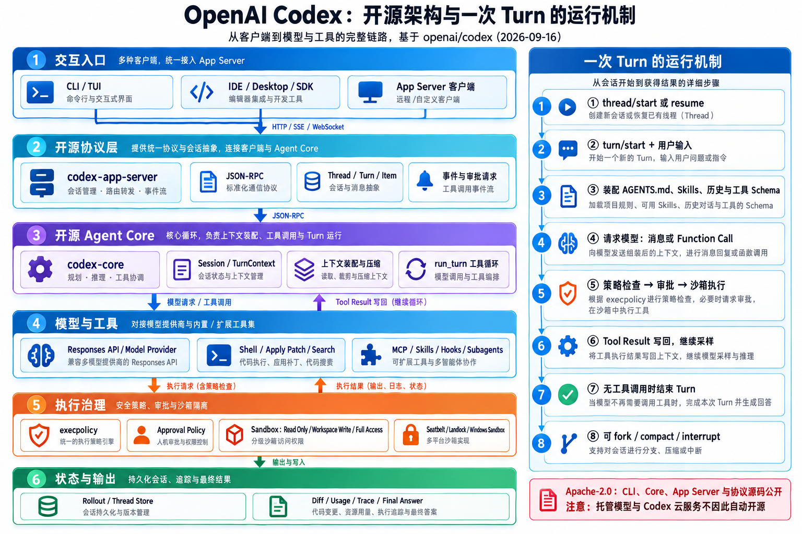

### Codex 确实开源了什么

`openai/codex` 使用 Apache-2.0。仓库不仅包含命令行壳，还包含 `codex-rs/core`、`app-server`、`app-server-protocol`、`execpolicy`、MCP 配置、沙箱实现和客户端 SDK。`codex-rs/core/src/session/turn.rs` 的 `run_turn()` 直接给出了主循环：模型返回 Function Call 时执行工具并在下一次采样中回传结果；只返回 Assistant Message 时记录消息并结束 Turn。

```text
用户输入 → run_turn()
  → 请求模型
  → Function Call ?
      是：策略检查 → 审批 → 沙箱执行 → Tool Result 回写 → 再次采样
      否：记录 Assistant Message → Turn 完成
```

需要保留边界：开源的是本地 Codex Runtime、协议和配套组件；OpenAI 托管的模型权重、账户服务与 Codex 云端基础设施不因客户端采用 Apache-2.0 而自动开源。

### App Server 与多 Surface

Codex CLI、IDE、桌面和自动化调用的交互形态不同，但都需要一致的 thread/turn、工具调用、审批、diff、事件和错误语义。App Server 把这些能力放在共同服务层，客户端不必各自复制一套 Agent Loop。OpenAI 官方的 App Server 说明也明确指出，早期尝试直接暴露为 MCP Server 后，发现 MCP 语义并不适合完整承载 VS Code 等客户端所需的产品状态，因此形成了专用协议边界。

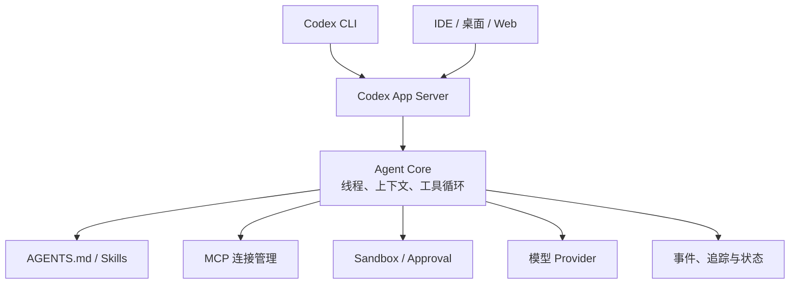

### 关键工程点

- **App Server 是产品边界**：它让不同前端不用各自实现 Agent loop；官方说明也强调 Codex 运行于多种 surface，而 App Server 负责将这些 surface 接入共同架构。
- **项目指令与能力包分离**：`AGENTS.md` 描述仓库内的约束与工作方式；Skills 承载可复用工作流；MCP / Apps 则带来外部能力。项目规则应窄而可验证，不能把凭据或未经审计的命令写入指令文件。
- **工具调用不是直通 shell**：审批、sandbox、工作区范围、MCP 认证和输出长度都属于运行时策略。任何跨客户端实现都应让这些策略在核心层生效，而不是依赖某个 UI 按钮。
- **多 Agent 是协作能力，不是默认架构**：子线程或协作 Agent 应返回清晰的结果、证据和产物，主线程仍负责集成与验收。

### Thread 是长期对象，Turn 是一次执行

公开 SDK 可以创建、恢复、读取、归档、取消归档、fork 和 compact thread。这个模型比“聊天消息数组”更完整：Thread 持有连续任务状态，Turn 表示一次用户输入到本轮结束的执行，Item 则承载模型消息、命令、文件变更、MCP、协作调用、搜索和错误。

```python
with Codex() as codex:
    thread = codex.thread_start(model="gpt-5.4")
    first = thread.turn("分析当前仓库测试失败的根因").run()
    branch = codex.thread_fork(thread.id, model="gpt-5.4")
    second = branch.turn("换一种方案，只做最小修改").run()
    thread.compact()
```

代码体现了三个关键边界：恢复不是把旧文本重新粘贴；fork 是从已有状态派生新路线；compact 改变当前上下文表示，但 Thread 仍是可管理对象。

### Sandbox 与 Approval 是两个维度

Sandbox 回答“命令在哪里、能访问什么”；Approval 回答“何时必须获得同意”。只配置其中一个并不能形成完整安全边界。公开协议区分只读、工作区写入与完全访问等 sandbox 模式，也允许对沙箱升级、规则、Skill、权限请求和 MCP elicitation 分别控制审批。

### 优势与边界

优势是本地核心与 App Server 本身可读、可编译、可测试，工作区指令、Skills、MCP、Sandbox、协作与事件模型可以贯穿不同客户端。边界是不要把某一客户端或托管服务的能力泛化成全部 Codex surface，也不要把开源 Runtime 等同于模型和云端服务开源。

适合希望终端、IDE 与自动化客户端共享同一 Agent 内核的场景。关于 Codex 的本地配置、Skills、MCP 与协作机制，本站的对应条目可继续扩展。

## Pi：小而明确的 Session + Extension 核心

Pi 的当前主仓库是 `earendil-works/pi`。它把系统拆成 `pi-coding-agent`、`pi-agent-core`、`pi-ai`、`pi-tui`，并提供 Chord 组合 Runtime 与 vendor-neutral Telemetry；交互入口包括 TUI、Print/JSON、RPC 和可嵌入 SDK。项目仍坚持最小默认能力，把更高层工作流交给 TypeScript Extensions、Skills、Prompt Templates 与 Packages。

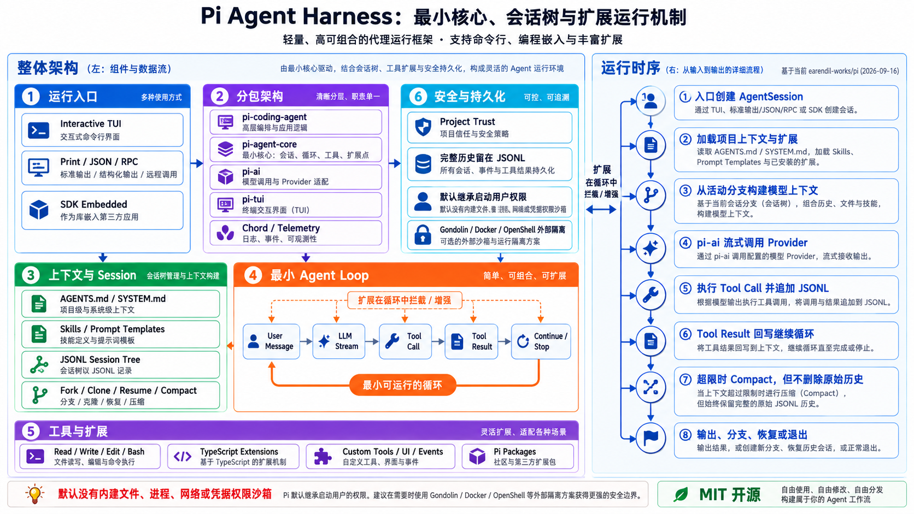

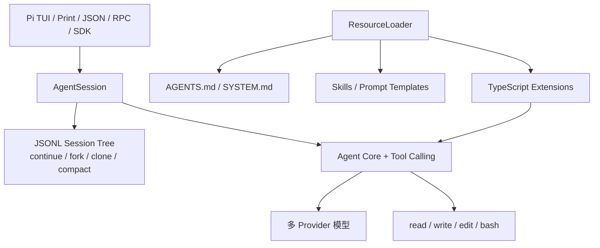

### 关键工程点

- **Session 是一等公民**：会话保存在按工作目录组织的 JSONL 文件中，消息通过 `id` 和 `parentId` 形成树；`/fork`、`/clone`、`/tree` 和 `/compact` 因而可以把探索分支显式保留。
- **ResourceLoader 是组合点**：启动时发现全局/项目扩展、Skills、模板与上下文文件；Extension 可注册工具、命令、事件处理器和 UI。
- **最小默认能力是故意的**：Pi 没有内建文件、进程、网络或凭据权限系统，默认继承启动进程的用户权限。需要更强边界时，官方文档列出 Gondolin、Docker 与 OpenShell 三种隔离路线。

### JSONL Session Tree 为什么重要

Pi 把完整会话保存在 JSONL 中，每个记录通过 `id` 与 `parentId` 形成树。`/tree` 可以回到旧节点，`/fork` 从旧用户消息创建分支，`/clone` 复制活动路线。`/compact` 只改变交给模型的有损摘要，完整历史仍然留在 Session 文件中。这将“可恢复历史”和“当前上下文窗口”明确分开。

### Extension 是 Runtime 插件，不只是提示词

Extension 可以注册工具、命令、按键、事件监听和 TUI；还可以拦截工具调用、定制 compact、保存自定义状态、接入 SSH 或实现 subagent/plan mode。它能改变运行行为，因此必须像代码依赖一样审查版本和权限。

```ts
export default function (pi: ExtensionAPI) {
  pi.registerTool({ name: "deploy", /* schema + execute */ });
  pi.registerCommand("stats", { /* handler */ });
  pi.on("tool_call", async (event, ctx) => {
    // 在执行前记录、拒绝或改写动作。
  });
}
```

### 优势与边界

优势是核心小、Session 可检查、模型 Provider 可替换、扩展代码透明。代价是默认治理较轻：复杂权限、团队审计、MCP、多 Agent 和远程执行通常需要用户自己组合并验证。

Pi 适合想理解和控制 Harness 细节的开发者。它的代价也正来自此处：治理、权限、观测、MCP 或复杂并发需要显式设计，不能假设默认存在。

### Pi SDK 的最小嵌入示例

下例使用官方 SDK 的 `createAgentSession()`；实际项目仍需明确模型、工具与 session 存储策略。

```ts
import {
  createAgentSession,
  ModelRuntime,
  SessionManager,
} from "@earendil-works/pi-coding-agent";

const modelRuntime = await ModelRuntime.create();

const { session } = await createAgentSession({
  sessionManager: SessionManager.inMemory(),
  modelRuntime,
});

session.subscribe((event) => {
  if (event.type === "message_update") process.stdout.write(event.assistantMessageEvent.delta);
});

await session.prompt("列出当前仓库的测试命令，但不要修改文件。");
```

## GenericAgent：极简工具、分层记忆与技能结晶

GenericAgent 的设计目标不是预装大量专业工具，而是用约 3K 行种子代码、9 个原子工具和约百行 Agent Loop 形成通用执行核心，再把成功路径沉淀为可复用 Skill。这里的行数和能力描述来自项目 README，是该项目当前版本的自述，不应外推成所有任务上的性能保证。

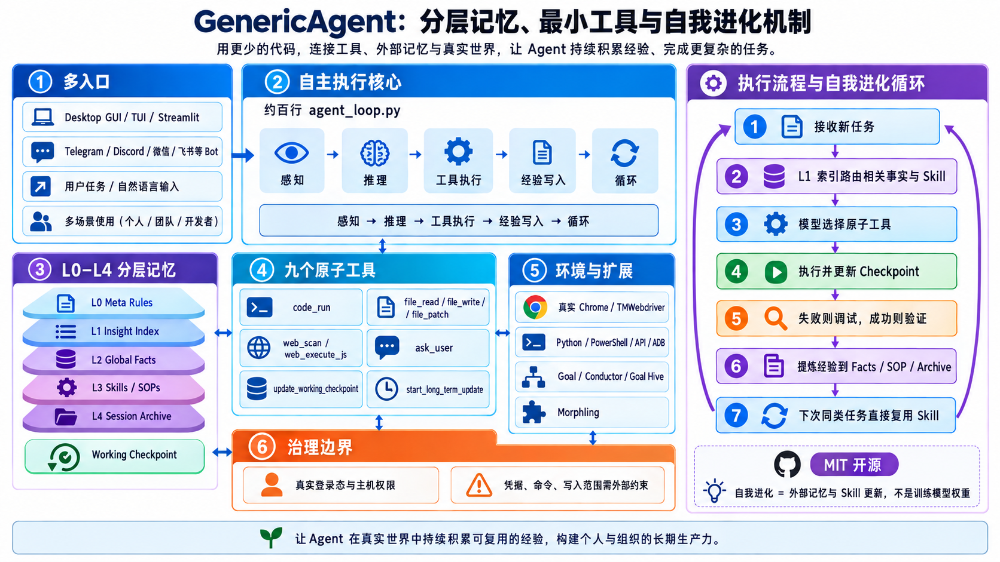

### 三个核心部件

1. **最小 Agent Loop**：感知环境、任务推理、执行工具、把结果写回状态，再决定继续或结束。
2. **九个原子工具**：代码执行、文件读写/补丁、网页扫描与 JavaScript、询问用户、更新工作 checkpoint、触发长期记忆更新。
3. **L0～L4 分层记忆**：Meta Rules、Insight Index、Global Facts、Task Skills/SOP、Session Archive 分别承担规则、索引、事实、技能和历史归档。

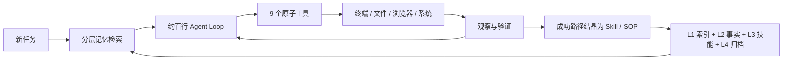

### 自我进化到底是什么

这里的“进化”主要是运行时知识沉淀，不是自动微调模型权重：第一次完成任务时，Agent 可能安装依赖、编写脚本、调试和验证；成功后把目标、步骤、关键命令、失败经验和验收方法写入 Skill/SOP。下次相似任务先经 Insight Index 找到已有能力，减少重复探索。

这套设计的价值是信息密度：不把所有历史和所有 Skill 一次塞入上下文，而是用索引定位必要内容。风险同样明显：如果把偶然成功、危险命令或环境特例结晶为长期技能，错误也会被复用。因此 Skill 写入需要来源、适用条件、版本、验证证据与回滚方式。

### 真实浏览器与系统控制

GenericAgent 的 TMWebdriver 通过本地 WebSocket 服务与 Chrome 扩展连接真实浏览器，保留登录态和正常浏览器环境；`code_run` 又允许安装依赖、调用 API 或生成脚本。这使它适合个人桌面自动化，但也意味着权限面远大于只在仓库沙箱中修改代码的 Agent。

至少应增加：工作目录范围、命令 denylist/allowlist、敏感操作审批、浏览器域名边界、凭据隔离、checkpoint 和每次长期记忆写入审查。

### Goal 与并行扩展

项目还提供 Goal mode、Conductor 与 Goal Hive 等长任务/多 worker 能力。它们应看作建立在极简 Loop 和分层记忆之上的扩展，而不是核心百行 Loop 天生就解决了并发、仲裁和一致性。

### 优势与边界

优势是代码量小、可读、工具原子化，便于研究从执行经验到 Skill 的闭环。代价是它对本机系统和真实浏览器的控制能力很强；“能自我扩展”也会放大供应链、记忆污染和错误固化风险。

## Hermes Agent：多入口、多 Toolset 与跨环境执行

Hermes Agent 更像跨端个人 Agent 平台：同一核心可以从 CLI、API、桌面或消息平台接收任务，并把 Web、浏览器、文件、终端、记忆、Cron、代码执行和委派组织成 Toolset。它强调持续记忆、跨平台接入和执行后端切换。

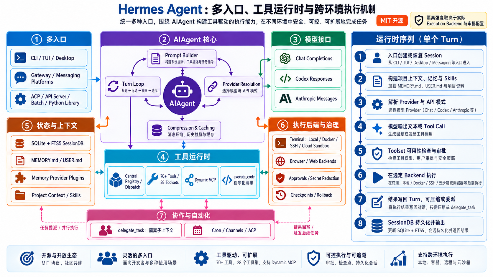

### Tool Registry 与 Toolset

Hermes 的工具先进入 Registry，再按 Toolset 组合。Core Toolset 表示单一能力域，Composite Toolset 组合多个域，Platform Toolset 为 CLI、消息平台或其他入口给出完整能力集合。这样可以让 Telegram Bot 只获得安全子集，而本地 Coding Session 获得文件、终端、搜索、浏览器、记忆、委派和代码执行。

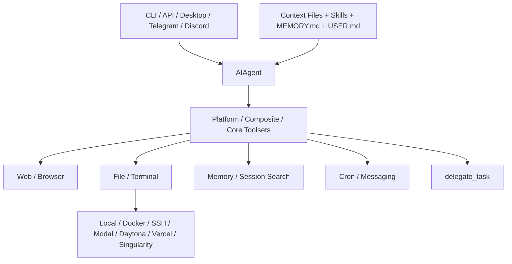

### 记忆不是无限聊天记录

内置长期记忆由 `MEMORY.md` 和 `USER.md` 组成，分别保存环境事实/经验和用户偏好，并设置字符上限；Session 开始时以冻结快照注入。超限时不会悄悄截断，而是要求 Agent 主动合并或删除。历史会话则通过本地 Session DB 与 FTS5 `session_search` 检索，二者职责不同：记忆是经过筛选的高密度事实，Session Search 是可回查的原始消息。

项目上下文文件又是第三层：`.hermes.md`、`AGENTS.md`、`CLAUDE.md`、`.cursorrules` 按优先级选择，用于当前项目规则，不应和用户长期偏好混在一起。

### 跨执行后端

Hermes 的 Terminal Backend 可以是本机、Docker、SSH、Modal、Daytona、Vercel Sandbox 或 Singularity。切换后端改变的是命令真正运行的位置、隔离强度、文件生命周期与凭据暴露方式，不只是一个性能选项。

```yaml
terminal:
  backend: docker
  docker_image: python:3.11-slim
  docker_network: false
  timeout: 180
  env_passthrough: []
```

Docker 后端可以维持长生命周期容器，让安装包和工作目录跨工具调用保留；SSH 把执行移到远端；Serverless/Cloud Sandbox 便于隔离和弹性。生产必须同时定义网络、CPU、内存、磁盘、超时、HOME 和凭据透传，而不是只写 `backend: docker`。

### 程序化工具调用与委派

`execute_code` 允许模型生成 Python 脚本并通过 RPC 调用 Hermes 工具，把多次工具往返压缩进一次程序执行；`delegate_task` 则启动具有隔离上下文和受限 Toolset 的子 Agent。前者优化工具编排，后者隔离任务上下文，它们解决的不是同一问题。

### Checkpoint、Cron 与多通道

写文件或高风险终端操作前可创建工作区 checkpoint，并通过 `/rollback` 恢复。Cron 将任务调度与结果投递结合；ACP Server 允许外部 Host 保留传输层所有权，同时复用 Hermes 的身份、模型、记忆、Skills 和工具。这些能力使它超出“终端 Coding Agent”，更接近长期运行的个人自动化平台。

### 优势与边界

优势是工具覆盖广、部署入口多、执行后端丰富，并明确区分 Memory、Session Search、Project Context 与 Skills。代价是能力面很宽：不同平台的 Toolset、Backend、Memory Provider、消息凭据和定时任务共同组成复杂安全边界，需要 Profile 隔离和集中审计。

## DeepSeek Harness（DSH）：Cordis 的全插件运行时

DSH 不是一款把功能固定死的 Coding Agent，而是由 Cordis 驱动的 Agent Harness。模型适配器、工具、技能、session、sandbox、存储、loop、调度、UI 乃至 subagent provider 都能作为插件加入；Profile 在启动时组合 Bundle、外部插件与用户 patch。

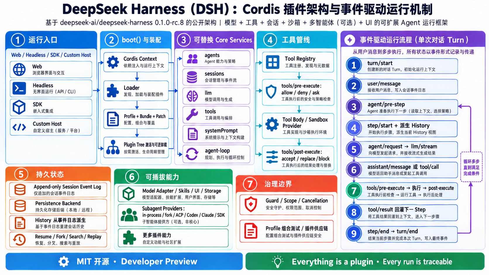

图：依据 DSH 官方 Architecture、Core 与 Subagent 文档生成的同风格架构图。

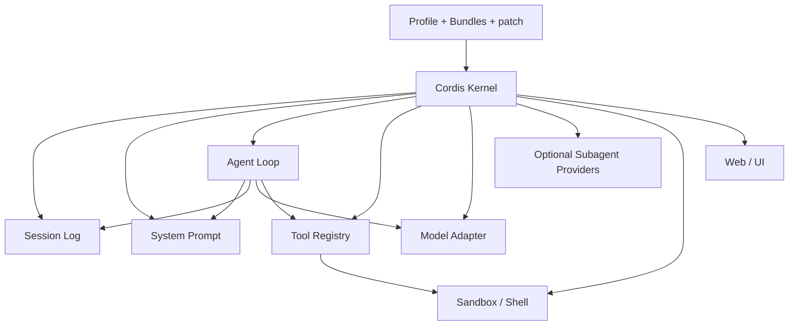

### 一次 turn 如何运行

官方架构说明的主链可概括为：loop 领取输入、打开 session turn、由 system-prompt 组装请求前缀与工具 schema、从 append-only log 派生历史、流式调用模型、通过 tool registry 分发调用，再把模型可见的消息和工具结果写回 session。扩展插件在事件与 service 边界插入，而不是直接耦合某个 concrete loop。

更完整的公开事件链是：

```text
open turn
  → claim input/message
  → assemble prompt sections + tool schemas
  → agent/pre-step → step/start
  → derive history from append-only session log
  → agent/request → llm/stream → assistant/message
  → tool/call → tools/pre-execute → execute
  → tools/post-execute → tool/result
  → continue or close turn
```

这条链的意义不只是可观测：waterfall event 可以让插件拦截、修改或委托处理；普通 typed event 用于广播事实；plugin 的 reversible effect 在卸载时撤销注册，使运行时可以重新组合。

### Core Service 的依赖方向

- `session`：append-only 的持久事实源；事件序列而非可随意覆盖的聊天数组。
- `system-prompt`：注册并装配 prompt sections、工具 schema 和模型可见前缀。
- `tools`：工具注册、发现、guard、执行与结果回写。
- `agent`：公开的 live handle、生命周期和事件词汇。
- `agent-loop`：默认 concrete driver，但不是其他插件必须依赖的核心实现。

扩展应依赖 service definition，而不是 import 默认 loop 的内部类。否则替换 loop 时，插件系统表面上可组合，实际上仍被具体实现锁死。

### Profile、Bundle 与启动

Profile 是一个可运行组合：按顺序叠加 Bundle、安装外部插件并应用 `cordis.patch.yml`。Bundle 复用一组经过测试的能力，Patch 负责部署局部覆盖。启动器创建 Cordis Context、安装 Loader、挂载配置树并等待插件激活；失败时清理部分启动的 effect，避免残留半初始化服务。

### Session Persistence

官方 persistence coordinator 在 backend 之上提供按 Session ID 串行化、写后批处理、崩溃尾部修复和安静关闭。Backend 最少实现读取已存前缀、读取 revision、追加事件、提交修复和列举 Session；JSONL 或 SQLite 只是不同存储实现。

append-only 便于审计和恢复，但不等于永远不做迁移：事件 schema、Session version、物化视图和清理策略仍需版本化。

### Subagent Provider 是可选 Seam

Subagent Service 可以同时存在多个 Provider：in-process、fork、ACP、Codex、Claude Code 或 SDK。消费者工具只面向统一的启动、消息、停止和结果词汇，不应根据 Provider 名称猜测子 Agent 是否本地、是否共享进程或凭据。

```yaml
- name: '@deepseek-ai/dsh-subagent'
- name: '@deepseek-ai/dsh-subagent-fork-in-process'
- name: '@deepseek-ai/dsh-tool-subagent'
  config:
    provider: fork
```

### DSH 的取舍

- **Everything is a plugin**：最利于替换模型、工具、存储和 UI，也要求每个插件有版本、依赖、迁移和真实组合测试。
- **Session 是耐久事实源**：状态不能只存在于 prompt；日志、生命周期和事件可支持恢复、审计与重放。
- **Subagent 是 optional seam**：它可选择 in-process、fork、ACP、Codex、Claude Code 或 SDK provider，并非每个 Agent loop 的强制组成。
- **仍是 developer preview**：官方明确提示可能有破坏性变更，生产应锁定版本并以契约测试覆盖 Profile 与插件组合。
- **组合测试比单插件测试重要**：真正风险来自多个 Service、Event 与配置覆盖同时挂载后的顺序、依赖与回滚行为。
- **自由组合不等于无边界**：工具 guard、sandbox、审批、Session 所有权、Subagent 权限和插件供应链仍需部署者定义。

本地试用的官方入口：

```bash
npx @deepseek-ai/dsh web
```

## 六种架构横向对比

### 控制核心与状态模型

| 架构 | 控制核心 | 持久状态 | 上下文超限后的公开行为 |
| --- | --- | --- | --- |
| Claude Code | 产品内置 Agent Loop；通过 Hooks、Skills、MCP 和 Subagent 暴露扩展点 | Session、`CLAUDE.md`、`.claude/rules/` 与项目配置 | 有 compact 生命周期和 `PreCompact` / `PostCompact` Hook；内部摘要算法不是公共契约 |
| Codex | `codex-core` 承担 Agent 逻辑，App Server 把它暴露成双向 JSON-RPC 服务 | Thread 包含多个 Turn；工作区指令、配置和任务状态独立管理 | 客户端围绕 Thread/Turn 恢复；不能把某个客户端的 UI 行为当作全部后端实现 |
| Pi | 小型显式循环，行为主要由 Extension API 扩展 | 本地 JSONL Session Tree，保留父子分支和完整历史 | Compaction 是有损的模型上下文表示，原始 JSONL 历史仍可通过 Tree 回看 |
| GenericAgent | 约百行主循环：感知、推理、执行、写入经验、继续 | L0–L4 分层文件记忆、Checkpoint 与任务归档 | 通过 Insight Index、Facts、Skills 和 Archive 分层提取，不把所有旧消息一直塞进窗口 |
| Hermes Agent | 模型循环 + Tool Registry/Toolset + 可选程序化工具调用 | 有界 `MEMORY.md` / `USER.md`、SQLite/FTS5 Session 搜索与项目上下文文件 | 长期策展记忆、历史检索和本轮上下文是三套边界，不宣称无限记忆 |
| DSH | 可替换 Agent Loop，围绕 Cordis Service 与 Event 装配 | Append-only durable Session Log，存储后端可替换 | 从日志派生 History；压缩、修剪或恢复策略可由插件实现，不固化进 Core Service |

### 工具、扩展与执行边界

| 架构 | 工具系统 | 主要扩展机制 | 执行与安全边界 |
| --- | --- | --- | --- |
| Claude Code | 内建工具、MCP 工具和 Skills | Hooks、Plugins、Skills、MCP、Subagents | Permission Mode 与 `PreToolUse` / `PermissionRequest` 把确定性策略放在副作用之前 |
| Codex | Shell、文件、MCP 与客户端提供的动态工具 | Skills、MCP、Plugins、Hooks、App Server 客户端 | Sandbox 决定“能做什么”，Approval 决定“何时需要人批准”，两者不能混为一个开关 |
| Pi | 内建 Read/Write/Edit/Bash，加自定义工具 | TypeScript Extension、Prompt Template、Skill、Pi Package | 核心较轻；权限、远程执行和团队审计要由使用者选择并验证 |
| GenericAgent | 9 个原子工具覆盖代码、文件、网页、询问和记忆更新 | Skills、Conductor、Goal / Goal Hive、TMWebdriver | 倾向直接操作真实环境；部署者必须额外限制命令、浏览器凭据和写入范围 |
| Hermes Agent | 按平台和用途组织 Toolset，支持 `execute_code` 批量编排工具 | Skills、MCP、Toolset、Execution Backend、ACP 与 Channels | 可在 local、Docker、SSH、Modal、Daytona、Vercel Sandbox、Singularity 等后端执行，隔离强度取决于实际选择 |
| DSH | Tool Registry + Guard + 生命周期事件 | Profile、Bundle、Plugin、Service、Event、可替换 Loop / Model Adapter | 框架给出 Guard 和拦截位置，但最终 Sandbox、审批和插件供应链策略由部署者负责 |

### 多 Agent 与产品定位

| 架构 | 多 Agent 方式 | 更准确的定位 |
| --- | --- | --- |
| Claude Code | Subagent 有独立上下文、工具权限和生命周期 Hook | 治理和交互体验完整的产品型 Coding Agent |
| Codex | Subagents、云任务和不同 Surface；App Server 允许客户端订阅同一任务生命周期 | Agent Core 服务化、可被多个前端复用的 Coding Agent 平台 |
| Pi | Subagent、Plan Mode、Handoff 等通常由示例 Extension 组合 | 最小、开源、可重写的 Agent Harness |
| GenericAgent | Goal 拆分、Conductor 调度、Goal Hive 并行执行 | 以少量原子工具、文件记忆和技能自进化为中心的通用 Agent 实验架构 |
| Hermes Agent | `delegate_task` 创建隔离子上下文，可配合多通道、Cron 和 ACP | 面向个人自动化、跨环境执行与长期使用的通用 Agent Runtime |
| DSH | Subagent Provider 可接 in-process、fork、ACP、Codex、Claude Code 或 SDK | 以插件契约、事件和可替换 Service 为核心的平台级 Harness |

## 如何选择

- **希望开箱即用，同时需要权限确认、Hooks、Skills 与专业子 Agent**：优先看 Claude Code。扩展应围绕公开产品接口，不依赖它没有承诺的内部循环。
- **希望终端、IDE、桌面或自研客户端共享一套 Agent Core**：优先看 Codex。App Server 的 Thread/Turn 协议和事件流比“命令行长什么样”更关键。
- **希望从可读源码、JSONL Session Tree 和最小工具循环开始改造**：优先看 Pi。它的优势是可检查、可分叉和可扩展，不是默认替你完成全部治理。
- **希望研究文件化分层记忆、真实浏览器控制和执行经验如何结晶为 Skill**：看 GenericAgent。这里的“自我进化”是知识与流程沉淀，不是在线训练模型权重。
- **希望一个 Agent 跨本机、容器、SSH 与云 Sandbox 执行，并带记忆、定时任务、回滚和多入口**：看 Hermes Agent。应先确定实际执行后端，再谈安全边界。
- **希望替换模型、Loop、存储、工具和 Subagent Provider，构建自己的 Agent 平台**：看 DSH。它提供的是装配协议与生命周期，不是现成的唯一最佳工作流。

这不是能力排行榜。六者的抽象层级不同：Claude Code 与 Codex 更接近完整产品，Pi 与 GenericAgent 更适合阅读和改造，Hermes 偏长期个人自动化 Runtime，DSH 偏平台工程 Harness。真正落地仍需逐项验证权限、沙箱、凭据、预算、停止条件、恢复、审计和依赖供应链。

## 从六种架构能看到什么趋势

以下是基于公开架构的工程归纳，不是各项目共同发布的路线图：

1. **Agent 从单一 CLI 变成可复用 Runtime**：Codex App Server、Hermes 的多入口与 DSH Service 都在把交互界面和 Agent Core 分离。
2. **Context 从聊天字符串变成结构化状态**：Thread/Turn、JSONL Tree、分层文件记忆、FTS5 Session 和 Append-only Log 分别解决恢复、分支、检索与审计。
3. **工具从静态函数表变成生命周期系统**：Hook、Extension、Toolset、Programmatic Tool Calling、Guard 和 Event 让注册、执行前检查、结果记录与组合调用都有独立位置。
4. **扩展从改源码变成稳定 Seam**：Skill、MCP、Plugin、Profile、Bundle 和 Service 的共同价值，是让过程知识、外部能力与运行时部件可以分别演进。
5. **安全从一句 Prompt 下沉到执行层**：Permission、Approval、Sandbox、Backend 与 Guard 才能约束真实副作用；系统提示词不能替代操作系统和运行时隔离。
6. **多 Agent 不是默认答案**：六者都能以不同方式委派，但委派会增加上下文隔离、权限继承、成本和失败恢复问题。先明确单 Agent Loop 的瓶颈，再选择 Subagent、Handoff 或外部 Provider。

## 参考资料

- [Claude Code：Overview](https://code.claude.com/docs/en/overview)、[Memory](https://code.claude.com/docs/en/memory)、[Hooks](https://code.claude.com/docs/en/hooks)、[Subagents](https://code.claude.com/docs/en/sub-agents)
- [OpenAI：Codex Open Source](https://developers.openai.com/codex/open-source)、[Unlocking the Codex harness](https://openai.com/index/unlocking-the-codex-harness/)、[Codex 开源仓库](https://github.com/openai/codex)、[`run_turn` 源码](https://github.com/openai/codex/blob/main/codex-rs/core/src/session/turn.rs)
- [Pi Agent Harness](https://github.com/earendil-works/pi)、[Coding Agent](https://github.com/earendil-works/pi/tree/main/packages/coding-agent)、[Usage 与 Sessions](https://github.com/earendil-works/pi/blob/main/packages/coding-agent/docs/usage.md)、[Extensions](https://github.com/earendil-works/pi/blob/main/packages/coding-agent/docs/extensions.md)、[SDK](https://github.com/earendil-works/pi/blob/main/packages/coding-agent/docs/sdk.md)、[Containerization](https://github.com/earendil-works/pi/blob/main/packages/coding-agent/docs/containerization.md)
- [GenericAgent 官方仓库](https://github.com/lsdefine/GenericAgent)
- [Hermes Agent 官方仓库](https://github.com/NousResearch/Hermes-Agent)、[Features](https://hermes-agent.nousresearch.com/docs/user-guide/features/overview)、[Toolsets](https://hermes-agent.nousresearch.com/docs/reference/toolsets-reference)、[Memory](https://hermes-agent.nousresearch.com/docs/user-guide/features/memory)、[Checkpoints](https://hermes-agent.nousresearch.com/docs/user-guide/checkpoints-and-rollback)
- [DeepSeek Harness Developer Preview](https://www.deepseek.com/harness/en/)、[README](https://github.com/deepseek-ai/deepseek-harness)、[Architecture](https://github.com/deepseek-ai/deepseek-harness/blob/master/docs/architecture.md)、[Core](https://github.com/deepseek-ai/deepseek-harness/blob/master/docs/subsystems/core.md)、[Subagent](https://github.com/deepseek-ai/deepseek-harness/blob/master/docs/subsystems/subagent.md)
- [用户参考：主流 Agent 架构分析指南](https://tingfeng347.github.io/2026/07/31/%E4%B8%BB%E6%B5%81agent%E6%9E%B6%E6%9E%84%E5%88%86%E6%9E%90%E6%8C%87%E5%8D%97/)
