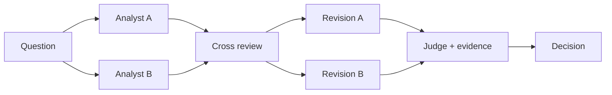

# Debate

Debate 常见流程是：多个 Agent 独立生成候选，读取其他候选与证据后批评或修订，最后由 Judge、测试或确定性规则裁决。它适合高价值、可核验证据且确实需要多角度的任务。



## 可运行的双审查 + Judge

下面用不同职责的 reviewer 检查同一方案，避免仅靠角色名称制造“伪多样性”。

```python
from typing import Literal

from agents import Agent, Runner
from pydantic import BaseModel, Field


class Review(BaseModel):
    verdict: Literal["accept", "revise", "reject"]
    issues: list[str] = Field(max_length=5)
    evidence_needed: list[str] = Field(max_length=5)


class Decision(BaseModel):
    verdict: Literal["accept", "revise", "reject"]
    reasons: list[str]


fact_reviewer = Agent(
    name="fact_reviewer",
    instructions="只检查事实是否有输入证据支持；没有证据就要求 revise。",
    output_type=Review,
)
risk_reviewer = Agent(
    name="risk_reviewer",
    instructions="只检查权限、副作用、隐私和不可逆风险。",
    output_type=Review,
)
judge = Agent(
    name="judge",
    instructions=(
        "根据原方案和两份结构化审查裁决。不能以多数票覆盖明确安全风险；"
        "任一 reviewer 指出高影响未审批动作时至少 revise。"
    ),
    output_type=Decision,
)


proposal = "Agent 找到重复订单后直接执行退款，并把完整日志发给用户。"
facts = Runner.run_sync(fact_reviewer, proposal, max_turns=3).final_output
risks = Runner.run_sync(risk_reviewer, proposal, max_turns=3).final_output
decision = Runner.run_sync(
    judge,
    f"方案：{proposal}\n事实审查：{facts.model_dump()}\n风险审查：{risks.model_dump()}",
    max_turns=3,
).final_output
print(decision.model_dump_json(indent=2))
```

## Debate 为什么会失效

- 辩手读取同一错误来源，产生共同幻觉；
- 角色只有名字不同，模型、Prompt 和证据完全相同；
- Judge 只数票，不核验证据；
- 无限对话只让立场收敛，没有增加新事实；
- 少数正确意见被多数共识覆盖；
- 高风险决策交给模型 Judge，没有政策规则和人工审批。

提高有效多样性的方法是使用不同检索源和职责、先生成独立初稿、强制结构化证据、运行确定性测试、限制轮数，并允许 Judge 返回 `insufficient_evidence`。

## 共享状态与生产约束

共享总目标、不可变约束、任务 ID、权限和预算；原始长搜索轨迹与私有草稿默认隔离，只在评审需要时共享。每个 reviewer 设置独立 deadline，Judge 不能越过业务政策，高影响结论必须经过外部验证或人工决定。

## 参考资料

- [Improving Factuality and Reasoning through Multiagent Debate](https://arxiv.org/abs/2305.14325)
- [ChatEval](https://arxiv.org/abs/2308.07201)
- [Anthropic：Multi-agent research system](https://www.anthropic.com/engineering/multi-agent-research-system)
