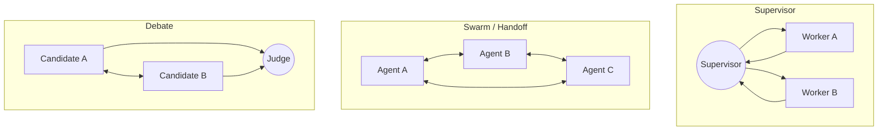

# 多 Agent 模式总览

多 Agent 的价值来自专业分工、上下文隔离和可控并行，而不是 Agent 数量本身。协调成本、token、延迟和失败面会随拓扑一起增长。

| 模式 | 控制权 | 适合场景 | 主要风险 |
| --- | --- | --- | --- |
| [Supervisor](./supervisor.md) | 中心 Agent 持续调度 | 多专业域、步骤依赖、统一输出 | 中心瓶颈、重复派单、上下文膨胀 |
| [Swarm](./swarm.md) | active agent 通过 handoff 转移 | 客服接管、局部自治、跨轮责任转移 | 循环交接、责任模糊、权限扩散 |
| [Debate](./debate.md) | 多候选与 Judge/规则共同决定 | 高价值、可核验、需要多角度的任务 | 伪多样性、共同幻觉、错误多数 |

## 共享与隔离

总目标、不可变约束、任务 ID、权限和预算应共享；原始长轨迹、私有草稿和无关数据默认隔离。跨 Agent 传递的应是结构化摘要、evidence ID、未决问题、产物地址与状态，而不是整段内部消息。

## 生产底线

- 每个 Agent 使用最小工具和数据权限；
- 消息带 sender、recipient、task_id、schema_version 与 trace_id；
- 明确定义超时、取消、部分失败、回滚和转人工；
- 限制 handoff、debate 和 supervisor 调度轮数；
- 并行结果使用稳定 reducer，正确处理重复与乱序；
- 高影响结果经过确定性规则或人工审批。
