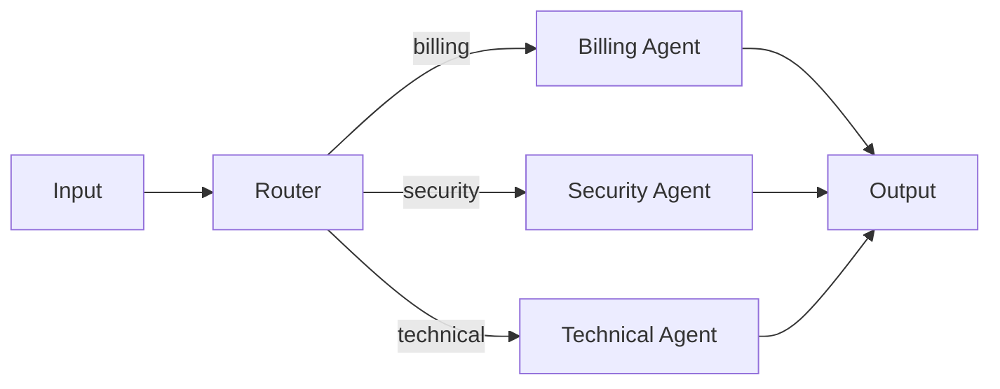
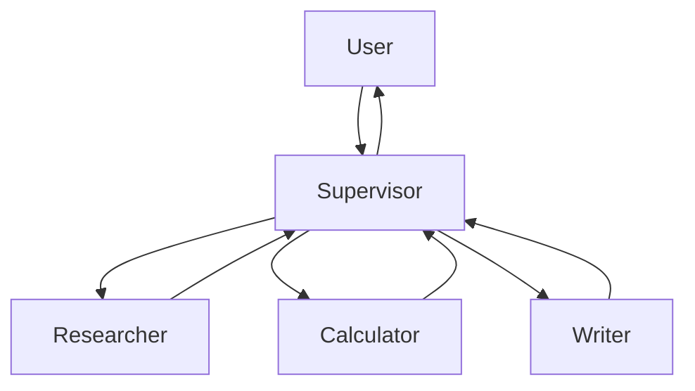

# Supervisor（含 Router 对比）

Router 和 Supervisor 都可能处于中心位置，但控制粒度不同：Router 通常做一次分类与分发；Supervisor 是一个持续运行的 Agent，会跨多轮决定调用哪个 worker、是否继续以及怎样综合结果。

## 三种中心化模式

| 模式 | 决策次数 | 子任务怎样产生 | 是否持续维护总目标 |
| --- | --- | --- | --- |
| Router | 通常一次 | 预定义领域或标签 | 通常不维护 |
| Parallel fan-out/fan-in | 固定规则 | 预定义并行分支 | 汇总节点维护 |
| Supervisor / Orchestrator-Workers | 多次、动态 | 中心 Agent 按输入拆分 | 是 |

## Router：分类后分发



适合：输入能明确分域、一次路由就能完成、不同分支上下文差异很大。确定性关键词、权限或产品类型能路由时，优先用代码规则；只有语义边界复杂时才用模型分类。

### 结构化 Router

```python
from typing import Literal

from agents import Agent, Runner
from pydantic import BaseModel


class Route(BaseModel):
    destination: Literal["billing", "security", "technical", "human"]
    reason: str


router = Agent(
    name="router",
    instructions=(
        "只做路由，不回答问题。账号接管和盗刷进入 security；"
        "扣款、发票、退款进入 billing；系统故障进入 technical；"
        "无法判断进入 human。"
    ),
    output_type=Route,
)

route = Runner.run_sync(
    router,
    "我无法登录，而且绑定邮箱被改了。",
    max_turns=3,
).final_output
print(route.model_dump())
```

路由结果还要经过权限与业务规则校验。不能让模型通过输出一个 worker 名称来绕过当前用户的资源权限。

## 并行 fan-out/fan-in

一个问题可能同时需要多个独立视角，例如“分别检查事实、合规和可读性”。分支由代码固定时，不需要 Supervisor。

```python
from concurrent.futures import ThreadPoolExecutor
from agents import Agent, Runner


fact_agent = Agent(name="fact", instructions="只检查事实主张和证据缺口。")
risk_agent = Agent(name="risk", instructions="只检查权限、安全和合规风险。")


def ask(agent: Agent, text: str) -> str:
    return str(Runner.run_sync(agent, text, max_turns=3).final_output)


document = "系统将自动读取全部客户数据并发送报告。"
with ThreadPoolExecutor(max_workers=2) as pool:
    fact_future = pool.submit(ask, fact_agent, document)
    risk_future = pool.submit(ask, risk_agent, document)
    reviews = [fact_future.result(), risk_future.result()]

print(reviews)
```

生产中要给并行分支设置独立超时和总体 deadline，并定义部分失败时是继续、降级还是整体失败。

## Supervisor：动态调度 Worker



Supervisor 适合多专业域、执行顺序依赖中间结果、需要多轮协调与统一输出的任务。Worker 通常作为工具暴露给 Supervisor；这样主 Agent 只看到任务描述和压缩结果，worker 的长上下文被隔离。

### 可运行的 Agents-as-tools 示例

下面使用 Context7 核验过的 OpenAI Agents SDK 0.7.x `Agent.as_tool()`。运行需要 `OPENAI_API_KEY`。

```python
import asyncio

from agents import Agent, Runner


researcher = Agent(
    name="researcher",
    instructions=(
        "根据输入材料提取事实。返回最多 5 条结论；"
        "每条保留 source_id；缺少来源时明确标记。"
    ),
)

writer = Agent(
    name="writer",
    instructions="把已核验事实写成简洁中文说明，不添加新事实。",
)

supervisor = Agent(
    name="supervisor",
    instructions=(
        "协调研究与写作。先让 researcher 提取证据，再把其结果交给 writer。"
        "不要自行编造来源；任务满足后立即结束。"
    ),
    tools=[
        researcher.as_tool(
            tool_name="extract_facts",
            tool_description="从给定材料提取带 source_id 的事实，不负责润色。",
        ),
        writer.as_tool(
            tool_name="write_summary",
            tool_description="将已核验事实写成中文说明，不做额外检索。",
        ),
    ],
)


async def main() -> None:
    result = await Runner.run(
        supervisor,
        "材料：[source=doc-1] Agent 的工具写操作必须使用幂等键。请写两句说明。",
        max_turns=8,
    )
    print(result.final_output)


asyncio.run(main())
```

## Supervisor 的 Context 设计

中心 Agent 不应得到 worker 的全部搜索轨迹。推荐 worker 返回：

```json
{
  "status": "completed",
  "summary": "两到五条高信号结论",
  "evidence_ids": ["doc-1#p3", "api-7"],
  "open_questions": ["尚未确认的关键点"],
  "artifacts": ["artifact://report/42"]
}
```

Supervisor 需要知道 worker 的职责、输入契约、成本、超时和结果状态，不需要知道它的全部内部消息。

## Router 与 Supervisor 的选择

| 问题特征 | Router | Supervisor |
| --- | --- | --- |
| 只需一次领域分类 | 合适 | 过重 |
| 多分支可并行、无需互相依赖 | Router + fan-out | 可用但成本高 |
| 下一步依赖上一步结果 | 不足 | 合适 |
| 需要统一计划和多轮综合 | 不足 | 合适 |
| 强确定性审计 | 规则 Router | Supervisor 外再加 Graph/Policy |
| 上下文隔离 | 分支天然隔离 | worker 隔离、中心看摘要 |

## 常见失败

- Supervisor 把同一任务重复派给多个 worker；
- worker 职责重叠，路由长期摇摆；
- 中心上下文收集所有子轨迹，反而更快溢出；
- worker 成功被误当成整体任务成功；
- 部分失败没有状态，Supervisor 只能猜测；
- 子 Agent 拥有不必要的写权限；
- 为了“多 Agent”拆分本来一次调用就能完成的任务。

## 参考资料

- [LangChain：Multi-agent](https://docs.langchain.com/oss/python/langchain/multi-agent)
- [LangChain：Subagents / Supervisor](https://docs.langchain.com/oss/python/langchain/multi-agent/subagents)
- [OpenAI 官方文档：Orchestration and handoffs](https://developers.openai.com/api/docs/guides/agents/orchestration)
- [Anthropic：Building effective agents](https://www.anthropic.com/engineering/building-effective-agents)
- [Anthropic：Multi-agent research system](https://www.anthropic.com/engineering/multi-agent-research-system)
