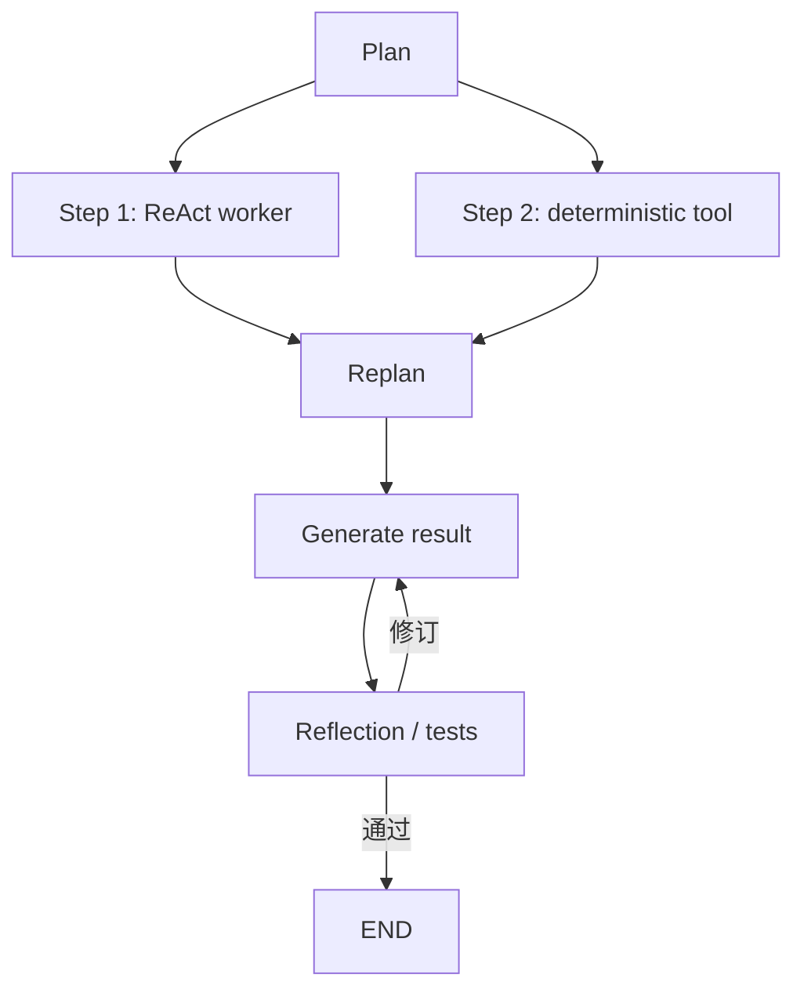

# 单 Agent 模式总览

单 Agent 不等于一次模型调用。它可以在一个身份和一份主状态下反复调用模型、工具与评审器。Reflection、ReAct 与 Plan-and-Execute 分别解决质量迭代、环境交互和长任务规划问题。

| 模式 | 核心循环 | 主要反馈 | 优势 | 主要代价 |
| --- | --- | --- | --- | --- |
| [Reflection](./reflection.md) | Generate → Evaluate → Revise | 规则、测试、模型或人工评审 | 提升可验证产物质量 | 延迟增加，自评可能共错 |
| [ReAct](./react.md) | Decision → Action → Observation | 工具与环境 | 根据新证据动态纠错 | 路径漂移、工具循环、上下文增长 |
| [Plan-and-Execute](./plan-and-execute.md) | Plan → Execute → Replan | 步骤结果与计划状态 | 长任务结构清楚、进度可审计 | 更多模型调用与状态管理 |

图：Hello-Agents 对 ReAct、Plan-and-Solve、Reflection 的教学选型总结。

## 怎样组合

不要一开始把所有模式叠满。路径必须根据实时环境调整时用 ReAct；步骤依赖强、进度需要审计时用 Plan-and-Execute；产物有测试或明确 rubric 且质量不足时用 Reflection。

## 图片来源与许可

本目录图片来自 Datawhale [Hello-Agents 第四章：智能体经典范式构建](https://github.com/datawhalechina/hello-agents/blob/main/docs/chapter4/%E7%AC%AC%E5%9B%9B%E7%AB%A0%20%E6%99%BA%E8%83%BD%E4%BD%93%E7%BB%8F%E5%85%B8%E8%8C%83%E5%BC%8F%E6%9E%84%E5%BB%BA.md)，原项目内容采用 [CC BY-NC-SA 4.0](https://creativecommons.org/licenses/by-nc-sa/4.0/)。原章没有 GIF，因此没有虚构或生成动图。
