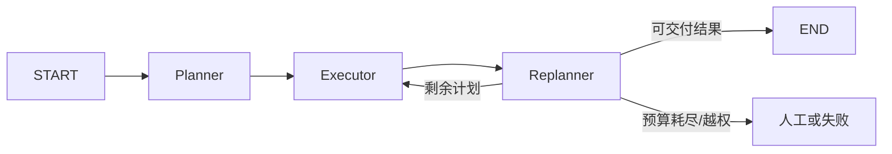

# Plan-and-Execute

Planning 模式先建立全局结构，再逐步执行。它适合依赖明确、任务较长、进度需要审计的工作，但计划不是事实：环境变化后必须允许重规划或终止。

## 不要混淆两个名称

- **Plan-and-Solve** 是 Zero-shot Chain-of-Thought 提示策略：先列解题计划，再按计划求解，不要求工具、持久化状态或独立 executor。
- **Plan-and-Execute** 是工程控制模式：planner 产出步骤，executor 逐步执行，显式 state 保存 `plan`、`past_steps`、证据和预算，必要时由 replanner 修改剩余计划。


图：Planning、任务执行与重规划。工程实现应把计划、已完成步骤和最终响应写入类型化状态。



## 可运行的 Planner + Executor

下面示例基于 OpenAI Agents SDK 0.7.x。运行需要 Python 3.10+、`OPENAI_API_KEY` 和账户可访问的模型。

```bash
pip install "openai-agents>=0.7,<0.8" "pydantic>=2,<3"
```

```python
from agents import Agent, Runner
from pydantic import BaseModel, Field


class Plan(BaseModel):
    steps: list[str] = Field(min_length=1, max_length=5)


planner = Agent(
    name="planner",
    instructions=(
        "把目标拆成最多 5 个可独立验收的步骤。不要执行；"
        "每一步写清输入、动作和完成条件。"
    ),
    output_type=Plan,
)

executor = Agent(
    name="executor",
    instructions=(
        "只执行当前步骤。使用给定的先前结果，不重新规划；"
        "若缺少关键数据，明确返回 BLOCKED 和缺少内容。"
    ),
)


def plan_and_execute(objective: str) -> list[str]:
    plan = Runner.run_sync(planner, objective, max_turns=3).final_output
    results: list[str] = []
    for index, step in enumerate(plan.steps, start=1):
        prompt = (
            f"总目标：{objective}\n"
            f"当前步骤 {index}/{len(plan.steps)}：{step}\n"
            f"先前结果：{results or '无'}"
        )
        result = Runner.run_sync(executor, prompt, max_turns=4).final_output
        results.append(str(result))
        if str(result).startswith("BLOCKED"):
            break
    return results


for item in plan_and_execute("为一个 Python CLI 设计发布前检查清单"):
    print(item)
```

真实长任务应持久化 `plan`、`past_steps`、evidence ID、deadline、费用和 stop reason，并在每一步后由规则或 replanner 决定继续、修改、回滚还是转人工。状态图实现见[图工程](../../design-surfaces/graph-engineering.md#计划执行图)。

## 什么时候不该用

- 单步问答或一次结构化调用就能完成；
- 初始信息极少、环境高度变化，长计划会迅速失效；
- 步骤没有独立完成条件，planner 只是把同一句话换了几种说法；
- 执行器没有真实工具和反馈，所谓“执行”仍只是生成文本。

初始路径未知时，可以让每个步骤内部使用 ReAct；步骤结果改变全局约束时，再加入受限 replanning。

## 参考资料

- [Plan-and-Solve Prompting](https://arxiv.org/abs/2305.04091)
- [LangGraph：Plan-and-Execute 教程](https://langchain-ai.github.io/langgraph/tutorials/plan-and-execute/plan-and-execute/)
