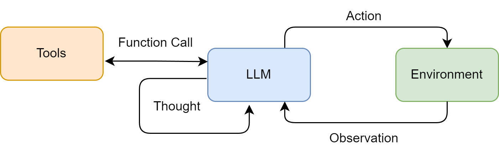

# ReAct

ReAct（Reasoning and Acting）让模型的决策与外部行动交错：模型根据当前目标和观察选择动作，工具返回新的 Observation，下一轮再据此修正路线。

$$
(r_t,a_t)=\pi(q,a_1,o_1,\ldots,a_{t-1},o_{t-1})
$$

$$
o_t=T(a_t)
$$

工程系统不需要向用户暴露模型的私有推理全文。真正应该持久化的是目标、工具调用、参数摘要、Observation、证据、状态变化和停止原因。



图：ReAct 中模型、工具与环境形成“决策—行动—观察”循环。

## 适用场景

- 下一步依赖搜索、API 或环境返回，无法预先写死路径；
- 故障排查、交互式研究、浏览器操作；
- 工具数量有限、执行链中短；
- 允许根据新证据调整原路线。

## 最小可运行循环

下面用类型化工具模拟一个无需 API Key 的 ReAct 控制器。`decide` 在真实系统中由支持 function calling 的模型提供；循环、预算、重复检测与工具执行仍由确定性代码控制。

```python
from dataclasses import dataclass
from typing import Literal


@dataclass
class Action:
    kind: Literal["lookup", "finish"]
    argument: str


KNOWLEDGE = {"invoice-42": "status=paid; amount=99"}


def decide(goal: str, observations: list[str]) -> Action:
    if not observations:
        return Action("lookup", "invoice-42")
    return Action("finish", f"根据证据回答：{observations[-1]}")


def run(goal: str, max_steps: int = 4) -> str:
    observations: list[str] = []
    seen_calls: set[tuple[str, str]] = set()
    for _ in range(max_steps):
        action = decide(goal, observations)
        if action.kind == "finish":
            return action.argument
        call = (action.kind, action.argument)
        if call in seen_calls:
            raise RuntimeError("repeated_tool_call")
        seen_calls.add(call)
        result = KNOWLEDGE.get(action.argument, "NOT_FOUND")
        observations.append(f"source=ledger; result={result}")
    raise RuntimeError("step_budget_exhausted")


print(run("查询 invoice-42 的状态"))
```

接入真实模型时，优先使用 provider-native function calling 或类型化工具，不要依赖正则解析 `Action: Search[...]`。完整的 Agents SDK 工具循环见[循环工程](../../design-surfaces/loop-engineering.md#使用-agents-sdk-运行有界工具循环)。

## 常见失败

- 工具描述重叠，模型长期选错工具；
- 工具空结果被解释成“事实不存在”；
- 同一调用不断重复，或在两个工具间来回切换；
- 网页或文档中的不可信文字劫持后续指令；
- 模型自行声称完成，但没有通过业务验收；
- 写操作在重试时重复执行，产生多次退款、发信或提交。

## 生产约束

- 设置最大轮数、deadline、token 与费用上限；
- 工具使用 allowlist、参数 Schema、权限校验和超时；
- Observation 做长度限制、来源标记和敏感信息过滤；
- 写操作使用幂等键，重试前查询操作状态；
- 检测相同参数重复调用和无进展循环；
- 高影响动作转人工审批；
- 最终结果交给独立规则、测试或验收器判断。

## 参考资料

- [ReAct 论文](https://arxiv.org/abs/2210.03629)
- [Hello-Agents 第四章](https://github.com/datawhalechina/hello-agents/blob/main/docs/chapter4/%E7%AC%AC%E5%9B%9B%E7%AB%A0%20%E6%99%BA%E8%83%BD%E4%BD%93%E7%BB%8F%E5%85%B8%E8%8C%83%E5%BC%8F%E6%9E%84%E5%BB%BA.md)
