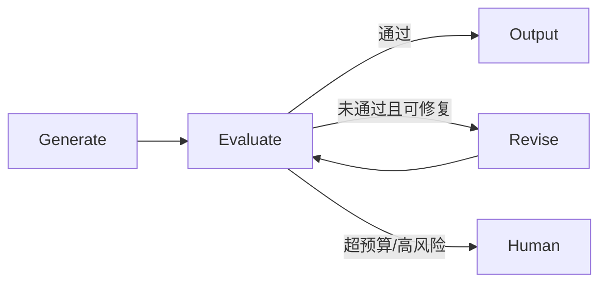

# Reflection 与 Reflexion

Reflection 是“生成—评审—修订”的通用模式；Reflexion 是把失败反思写入情景记忆、影响下一次完整尝试的特定框架。两者都不等于训练模型，也不会更新模型权重。


图：Actor、Evaluator、Self-reflection 与记忆组成反馈闭环。

## Reflection：生成—评审—修订



Evaluator 可以是同一模型的另一个 Prompt、独立模型、业务规则、测试或人工。外部可验证反馈通常比一句“请自我反思”可靠。评审结果应结构化：

```python
from pydantic import BaseModel, Field


class Review(BaseModel):
    passed: bool
    issues: list[str] = Field(max_length=5)
    revision_instructions: list[str] = Field(max_length=5)
```

完整的 Agents SDK 示例：

```python
from agents import Agent, Runner


writer = Agent(
    name="writer",
    instructions="根据要求写一段不超过 150 字、包含可验证验收标准的技术说明。",
)
reviewer = Agent(
    name="reviewer",
    instructions=(
        "按准确性、完整性、可验证性审查草稿。"
        "只有不存在事实错误且至少有一个明确验收标准时 passed=true。"
    ),
    output_type=Review,
)


def write_with_reflection(task: str, max_revisions: int = 2) -> str:
    draft = str(Runner.run_sync(writer, task, max_turns=3).final_output)
    for _ in range(max_revisions + 1):
        review = Runner.run_sync(
            reviewer,
            f"任务：{task}\n草稿：{draft}",
            max_turns=3,
        ).final_output
        if review.passed:
            return draft
        draft = str(Runner.run_sync(
            writer,
            f"任务：{task}\n原稿：{draft}\n修改要求：{review.revision_instructions}",
            max_turns=3,
        ).final_output)
    raise RuntimeError("quality_gate_failed")


print(write_with_reflection("解释为什么 Agent 工具写操作需要幂等键"))
```

代码限制了修订次数，但 writer 与 reviewer 仍可能共享同一偏差。事实任务要核对检索证据，代码任务要运行测试，结构化数据要通过 Schema 和业务规则。

## Reflexion：带情景记忆的再次尝试

Reflexion 的 Actor 执行任务，Evaluator 提供环境反馈，Self-Reflection 把失败原因整理成语言经验，下一次尝试从 episodic memory 读取。它可以叠加在 ReAct 轨迹之上。

| Reflection | Reflexion |
| --- | --- |
| 通用生成—评审—修订 | Shinn 等人提出的特定框架 |
| 不要求跨尝试记忆 | 使用情景记忆保存反思 |
| 可只优化一个产物 | 常对完整轨迹重新尝试 |
| 反馈可来自自评 | 强调环境反馈、评估与语言反思 |

写入长期记忆前必须验证失败是否真实、归因是否正确、经验适用范围和过期条件。否则错误反思会持续污染后续任务。

## 适用边界

适合：产物能被测试、rubric 或人工明确验收，并且允许有限次数修订。不要用无限自评替代缺失的事实来源；高风险动作的“反思后通过”也不能替代权限规则和人工审批。

## 参考资料

- [Reflexion](https://arxiv.org/abs/2303.11366)
- [Self-Refine](https://arxiv.org/abs/2303.17651)
- [Hello-Agents 第四章](https://github.com/datawhalechina/hello-agents/blob/main/docs/chapter4/%E7%AC%AC%E5%9B%9B%E7%AB%A0%20%E6%99%BA%E8%83%BD%E4%BD%93%E7%BB%8F%E5%85%B8%E8%8C%83%E5%BC%8F%E6%9E%84%E5%BB%BA.md)
