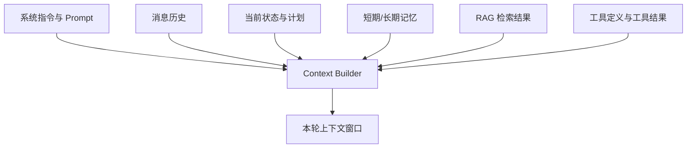

# 上下文工程（Context Engineering）

上下文工程是在每次推理前选择并维护“最值得进入上下文窗口的 token”。它不是把资料塞得越多越好，而是让模型在当前步骤看到足够、相关、可信且可区分来源的信息。

## Context 由什么组成



Prompt Engineering 主要优化指令；Context Engineering 还负责消息、检索、记忆、状态和工具信息的生命周期。Prompt 是 Context 的子集，而不是被 Context 取代。

## 四个核心动作

### 1. 选择（Select）

只选择当前步骤需要的材料。规划阶段需要目标与约束，不一定需要几十页原文；生成最终答案时需要高质量证据，不一定需要所有搜索日志。

选择通常同时考虑：

- 与当前子任务的相关性；
- 来源可信度与时间；
- 是否已经被更新信息取代；
- 信息密度与 token 成本；
- 权限和隐私范围；
- 是否能通过 ID 回到原始证据。

### 2. 按需加载（Just-in-time loading）

先把路径、文档 ID、数据库主键或 URL 放进状态，需要时再调用工具读取具体内容。这样可以避免每一轮重复携带全部材料。

### 3. 压缩（Compress）

压缩不是简单截断。可靠的阶段摘要应保存：

- 已完成动作及结果；
- 关键证据和来源 ID；
- 已确认约束和假设；
- 未解决问题与下一步；
- 不能重复执行的副作用操作 ID。

原始工具输出放外部存储，摘要保留指针。需要核实时可以回读，而不是让摘要成为唯一事实来源。

### 4. 隔离（Isolate）

子 Agent 使用干净的独立上下文完成窄任务，只向主 Agent 返回结构化结论和证据。隔离能减少不同任务之间的提示冲突，也是一种并行的上下文压缩方式。

## Token 预算

可以把窗口预算近似写成：

$$B_{available}=B_{window}-B_{output}-B_{safety}$$

输入部分再拆分为：

$$B_{input}=B_{instructions}+B_{tools}+B_{state}+B_{history}+B_{evidence}$$

必须预留输出与安全余量。工具定义多、Schema 大时，模型还没看到用户材料就可能消耗大量输入预算。

## 可运行的 Context Builder

下面是纯 Python 教学实现，无第三方依赖。它用字符数近似 token，只用于展示优先级、截断和可观测性；生产中应替换为目标模型 tokenizer，并把来源、权限与相关性评分纳入排序。

```python
from dataclasses import dataclass


@dataclass(frozen=True)
class ContextItem:
    kind: str
    text: str
    priority: int
    source_id: str


def estimate_tokens(text: str) -> int:
    # 教学近似：中英文混合文本不能用固定比例精确估算。
    return max(1, len(text) // 3)


def build_context(
    instructions: str,
    items: list[ContextItem],
    *,
    input_budget: int = 800,
) -> tuple[str, list[str]]:
    used = estimate_tokens(instructions)
    selected = [f"[instructions]\n{instructions}"]
    dropped: list[str] = []

    # 优先级高的先放；相同优先级下，短而密的信息先放。
    ranked = sorted(items, key=lambda x: (-x.priority, estimate_tokens(x.text)))
    for item in ranked:
        block = f"[{item.kind} source={item.source_id}]\n{item.text}"
        cost = estimate_tokens(block)
        if used + cost <= input_budget:
            selected.append(block)
            used += cost
        else:
            dropped.append(item.source_id)

    header = f"[budget used={used}/{input_budget}]"
    return "\n\n".join([header, *selected]), dropped


items = [
    ContextItem("state", "用户已完成身份校验；ticket_id=T-1024", 100, "state:T-1024"),
    ContextItem("policy", "退款必须在支付后 30 天内申请。", 90, "policy:refund-v3"),
    ContextItem("history", "用户上月询问过发票开具方式。", 20, "message:88"),
    ContextItem("tool", "订单 O-7 支付于 5 天前，状态=paid。", 80, "tool:orders/O-7"),
]

context, dropped = build_context(
    "判断当前退款申请是否满足时间条件；只引用带 source 的材料。",
    items,
    input_budget=120,
)
print(context)
print("dropped:", dropped)
```

## 长任务为什么会退化

长上下文常见问题不是“装不下”，而是：

- 旧计划与新计划同时存在，模型引用过期版本；
- 大段工具日志掩盖真正结论；
- 一条错误观察被反复复制，逐轮放大；
- 文档内的恶意指令混入系统目标；
- 不同来源没有标记，事实和模型推断混在一起；
- 完成的子任务仍占据每一轮窗口。

解决顺序通常是：清除无用工具输出 → 给证据加来源 → 总结已完成阶段 → 按需回读 → 必要时拆分子 Agent。不要先把窗口从 128K 换成更大窗口，然后继续无差别堆料。

## Context、Memory 与 RAG

| 概念 | 主要解决什么 | 是否一定进入当前窗口 |
| --- | --- | --- |
| Context | 当前这一次推理能看到什么 | 是 |
| Memory | 跨步骤或跨会话保存什么 | 否，需要检索和选择 |
| RAG | 从外部知识语料找什么证据 | 否，只有入选片段进入 |
| State | 当前任务执行到了哪里 | 不一定，可能只注入摘要 |

Memory 和 RAG 都是 Context 的候选来源。把数据存下来不等于模型会正确“想起”；仍需要写入、检索、排序、权限过滤和注入策略。详见[Memory、RAG 与外部知识](./memory-and-rag.md)。

## Context 可观测性

每次模型调用建议记录：

- 各类 context 的 token 占比；
- 选中与舍弃的 source ID；
- 压缩前后大小；
- 检索分数与最终排序；
- 工具 Schema 的 token 开销；
- 上下文版本、权限范围和敏感字段脱敏结果。

记录源 ID 和摘要即可，敏感原文不应无条件进入 trace。

## 参考资料

- [Anthropic：Effective context engineering for AI agents](https://www.anthropic.com/engineering/effective-context-engineering-for-ai-agents)
- [Anthropic：How we built our multi-agent research system](https://www.anthropic.com/engineering/multi-agent-research-system)
- [LangGraph：Memory](https://docs.langchain.com/oss/python/langgraph/add-memory)
- [OpenAI 官方模型指南：context、compaction 与 tool design](https://developers.openai.com/api/docs/guides/latest-model)

