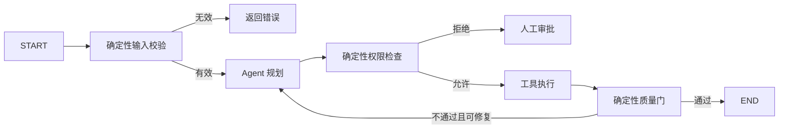

# 图工程（Graph / Workflow Engineering）

Graph Engineering 把控制流从冗长 Prompt 移到可检查的状态图：节点完成有边界的工作，边表达固定、条件、循环、错误或人工路由。

“Graph Engineering”仍是新兴归纳，不是统一标准术语。成熟的工程对象是状态机、工作流、DAG、有向循环图、检查点和事件驱动运行时。图也不只属于多 Agent：单 Agent 的“生成 → 测试 → 修复”同样可以是一张图。

## 核心对象

| 对象 | 作用 | 设计要点 |
| --- | --- | --- |
| State | 保存任务事实和运行进度 | 类型化、最小化、可序列化、有版本 |
| Node | 执行一个模型、工具、规则或子 Agent | 输入输出明确、幂等、可单测 |
| Edge | 连接节点 | 固定、条件、循环、错误、人工 |
| Reducer | 合并并行节点对同一字段的更新 | 避免覆盖、顺序不确定和重复 |
| Checkpoint | 保存可恢复状态 | `thread_id`、一致性、迁移与保留期 |
| Interrupt | 暂停并等待外部输入 | 审批、补充材料、人工判断 |

## 确定性与 Agentic 节点混合



把稳定业务规则写成代码，把难以预先枚举的判断交给模型。这样既保留模型的适应性，又能审计高风险路径。

## 可运行的 LangGraph 状态图

下面示例基于 Context7 核验的 LangGraph 1.0.8 API。它不调用模型：用确定性函数模拟“生成 → 测试 → 修复”，用于证明条件边、循环、检查点和停止逻辑可以独立测试。

```bash
pip install "langgraph==1.0.8"
```

```python
from typing import Literal, TypedDict

from langgraph.checkpoint.memory import InMemorySaver
from langgraph.graph import END, START, StateGraph


class CodeState(TypedDict):
    requirement: str
    code: str
    test_error: str
    attempts: int
    passed: bool


def generate(state: CodeState) -> dict:
    # 教学模拟：第一次故意生成错误结果，第二次修复。
    if state["attempts"] == 0:
        code = "def add(a, b): return a - b"
    else:
        code = "def add(a, b): return a + b"
    return {"code": code, "attempts": state["attempts"] + 1}


def run_test(state: CodeState) -> dict:
    namespace: dict = {}
    exec(state["code"], {"__builtins__": {}}, namespace)
    passed = namespace["add"](2, 3) == 5
    return {
        "passed": passed,
        "test_error": "" if passed else "expected add(2, 3) == 5",
    }


def route(state: CodeState) -> Literal["done", "retry"]:
    return "done" if state["passed"] or state["attempts"] >= 3 else "retry"


builder = StateGraph(CodeState)
builder.add_node("generate", generate)
builder.add_node("test", run_test)
builder.add_edge(START, "generate")
builder.add_edge("generate", "test")
builder.add_conditional_edges(
    "test",
    route,
    {"done": END, "retry": "generate"},
)

graph = builder.compile(checkpointer=InMemorySaver())
result = graph.invoke(
    {
        "requirement": "实现整数加法",
        "code": "",
        "test_error": "",
        "attempts": 0,
        "passed": False,
    },
    {"configurable": {"thread_id": "code-demo-1"}},
)
print(result)
```

`exec` 这里只执行示例内固定字符串。真实系统必须在隔离容器或沙箱中运行不可信代码，限制文件、网络、进程、CPU、内存和时间。

## 计划执行图

Plan-and-Execute 通常显式保存计划和过去步骤：


推荐 State 字段：

```python
class PlanState(TypedDict):
    objective: str
    plan: list[str]
    past_steps: list[tuple[str, str]]
    evidence_ids: list[str]
    response: str | None
    step_count: int
```

Planner 和 Replanner 应使用结构化输出；不要用 `ast.literal_eval` 或正则把任意模型文本直接变成控制流。

## Checkpoint 与 Interrupt

Checkpoint 用于：进程重启后恢复、重放失败步骤、跨轮会话、人工介入和 time travel。持久化图一般以 `thread_id` 标识一条执行线程。

LangGraph 的 `interrupt(value)` 会暂停图并向调用方返回待处理信息；恢复时使用 `Command(resume=...)`。启用 interrupt 必须配置 checkpointer。节点会从开头重新执行，因此在 interrupt 前做外部写入时必须幂等。

```python
from langgraph.types import Command, interrupt


def approve_refund(state: dict) -> dict:
    approved = interrupt({
        "question": "是否批准退款？",
        "order_id": state["order_id"],
        "amount_cents": state["amount_cents"],
    })
    return {"approved": bool(approved)}


# 首次运行会暂停；外部审批后恢复：
# graph.invoke(Command(resume=True), config)
```

## 并行与 Reducer

并行 fan-out 可以降低总延迟，但多个节点同时写 `results` 时需要 reducer。合并函数必须处理重复、顺序不确定和部分失败。对外部写操作，除非能证明互不冲突，否则不要盲目并行。

## 图的版本与恢复

生产图需要像数据库 Schema 一样版本化：

- State 新增/重命名字段要有迁移；
- 运行中的旧 checkpoint 由哪个图版本恢复；
- 节点是否可以安全重放；
- 外部副作用如何通过幂等键去重；
- 删除或替换节点后，旧路由如何处理；
- trace 中记录 graph、node 和 prompt 版本。

## 什么时候不需要图

- 单次结构化生成；
- 只有一个工具调用且没有恢复要求；
- 固定的两三步纯函数流水线；
- 没有分支、循环、并行或人工介入。

图会引入状态设计、持久化和调试成本。先用最小流程，只有复杂度真实出现时再升级。

## 参考资料

- [LangGraph：Overview](https://docs.langchain.com/oss/python/langgraph/overview)
- [LangGraph：Graph API](https://docs.langchain.com/oss/python/langgraph/graph-api)
- [LangGraph：Persistence](https://docs.langchain.com/oss/python/langgraph/persistence)
- [LangGraph：Interrupts](https://docs.langchain.com/oss/python/langgraph/interrupts)
- [Microsoft Agent Framework](https://github.com/microsoft/agent-framework)

