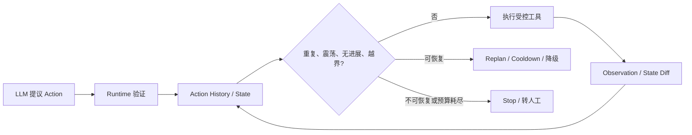

# Agent 异常轨迹排除

本页解决一个根本问题：当模型不断提出动作时，谁来判断这个动作还值不值得执行？答案不是继续修改 Prompt，而是让 Runtime 保存事实、比较状态、执行策略并掌握停止权。模型只能提出动作；Runtime 决定是否允许、是否有进展、是否需要重规划，以及何时终止。



## 先建立统一的判断框架

每一种异常都按同一顺序处理：**成因 → 检测 → 控制 → 停止条件**。

| Runtime 工件 | 作用 | 不能用什么替代 |
| --- | --- | --- |
| Action History | 记住已经尝试过的动作、参数、结果和失败原因 | 聊天记录 |
| Fingerprint / Cache | 识别相同或等价的工具调用，复用可安全复用的结果 | “模型应该记得” |
| Structured State | 保存 Goal、已证实事实、计划、完成项、Artifact 与版本 | 长上下文摘要 |
| Progress Watchdog | 判断真实环境是否推进 | 模型自称“我已经完成” |
| Budget Governor | 限制 turn、token、工具、搜索、时间和并发 | 事后统计账单 |
| Checkpoint / Invariant | 防止已经完成的结果被后续步骤破坏 | 重新从头运行 |
| Completion Evaluator | 根据真实环境决定是否成功 | final answer 文本 |

## 异常轨迹总览

| 异常 | 最小检测信号 | 首选控制 | 硬停止/升级条件 |
| --- | --- | --- | --- |
| 工具死循环 | 相同 `tool + canonical_args` 连续出现 | 指纹去重、缓存、幂等键 | 单工具次数、总 turn 或 tool budget 耗尽 |
| 工具震荡 | 最近窗口出现 `ABAB`、`ABCABC` | cooldown、replan、合并重叠工具 | 周期持续且无新证据 |
| 参数震荡 | 同工具参数回摆、结果相似 | 参数规范化、tabu list、低信息增益拦截 | 尝试集或探索预算耗尽 |
| 规划震荡 | `plan_v1 → v2 → v1` | plan version、commit window、replan gate | 多次无证据重规划 |
| 重复验证 | 验证对象的 state hash 未变 | Evidence Cache | 验证预算耗尽 |
| 无效探索 | 连续 search/read 没有新增事实或决策 | novelty 阈值、Search→Decision Gate | 连续 K 次无信息增益 |
| 状态停滞 | 环境 state hash 连续不变 | replan、缩小任务、转人工 | 两轮策略后仍无进展 |
| 状态回归 | 已满足 invariant 被破坏 | checkpoint、增量验证、rollback | 无法恢复或破坏受保护资产 |
| 目标漂移 | 计划动作超出 Goal Contract | scope gate、审批 | 高风险越界动作 |
| 上下文漂移 | 已证实事实被遗忘或重复调查 | structured state、facts store | 关键事实冲突，需人工裁决 |
| 假进展 | 声称完成但环境没有变化 | read-after-write、完成验收 | 验收不通过 |
| 环境失同步 | `ETag/version/hash` 不一致 | optimistic concurrency、fresh read | 冲突无法自动合并 |
| Retry 螺旋 | 非瞬时错误被连续重试 | error taxonomy、backoff、circuit breaker | 达到 retry/deadline 阈值 |
| Tool 结果过长 | observation 超 token/大小预算 | filter/page → externalize → rerank → summary | 无法压缩到安全预算 |
| 搜索爆炸 | 分支、深度、子任务快速膨胀 | Top-K、prune、并发与深度限制 | 总 task budget 耗尽 |
| 过早收敛 | candidate done 未满足可验证条件 | Completion Contract | 关键验收失败 |
| 过度执行 | 已通过验收仍继续调用工具 | `VERIFYING → SUCCESS` 终态 | 成功后禁止副作用 |
| 资源失控 | cost/progress 持续变差 | 预算 80% 转收尾 | 100% hard stop |
| 投机取巧 | 修改测试/评分规则以换取绿灯 | protected resources、独立 evaluator | 触碰受保护资产 |

## 重复与震荡：不要让 Agent 在局部循环里消耗预算

### 工具死循环与参数震荡

工具结果不清晰、历史动作未保存、重试不幂等或没有停止条件，都会让同一调用反复发生。Runtime 应先对参数做 canonicalization：排序 JSON key、标准化路径和时区、删除无业务意义的时间戳；再用 `tool_name + canonical_args` 生成 fingerprint。

- 完全相同且只读的调用：优先返回缓存结果；
- 写操作：使用业务幂等键，重复请求必须查询既有业务结果；
- 参数不同但结果高度相似：记录低信息增益，限制继续试探；
- 刚失败的参数组合：放入短期 tabu list，避免立刻回摆。

### 工具震荡与路径反复

`A → B → A → B` 并非完全重复，而是局部循环。保留最近 6～10 个动作，检测长度为 2 或 3 的重复周期；一旦命中，不能继续原路径，应触发 replan，或让刚调用过的工具进入 cooldown。若两个工具功能高度重叠，应从工具契约层消除歧义。

### 规划震荡

每次 replan 都必须有版本、原因与新证据：`plan_v1 → plan_v2 (tool_timeout)`。只有当前路径明确失败、环境变化、出现新证据或连续无进展时才允许全量重规划。新计划应有 commit window；窗口内只允许局部修正，不能又推翻整体目标。

## 进展不是模型输出，而是环境变化

### 状态停滞与无效探索

连续读文件、查日志或搜索并不等于任务推进。应从真实环境抽取状态：文件 hash、失败测试数、数据库版本、DOM 状态、完成 checklist 数、Artifact ID。比较 `state_before` 和 `state_after`，连续 N 步不变时增加 `no_progress_steps`：第一次触发 replan，第二次仍停滞则终止或转人工。

探索另设预算：最大搜索次数、读取文件数和连续无新增事实步数。连续探索 K 次后强制经过 Decision Gate——必须提出下一步决定、请求澄清或停止，不能无限 browse。

### 假进展与过早收敛

模型的“已完成”只能是 `candidate_done`。所有副作用都要 `write → read-after-write → verify`：写文件后读取/hash 对比，数据库更新后 SELECT，浏览器操作后检查 URL/DOM。成功由 Completion Evaluator 依据 Completion Contract 判定，例如复现用例从 FAIL 变 PASS、目标 Artifact 存在、原有测试未回归。

### 过度执行

运行状态应显式建模为 `RUNNING → VERIFYING → SUCCESS`。`SUCCESS` 是终态：禁止再进入 `RUNNING`，也禁止新的有副作用工具调用。这样避免任务已完成后继续搜索、重构并破坏正确结果。

## 状态正确性：目标、事实、版本和恢复

### 目标与上下文漂移

Goal 不能只存在 messages 中。建立不可由 Agent 改写的 Goal Contract，至少包含目标、允许操作范围、约束、受保护资源和成功标准；高风险动作前执行 Goal Alignment Check。

同时区分状态：`messages` 保存会话，`verified_facts` 保存已证实事实，`current_plan` 保存当前计划，`completed_tasks` 保存完成项，`artifacts` 保存产物引用，`goal_contract` 保存不可变边界。可以压缩聊天历史，但不能丢失这些结构化状态。

### 环境失同步与状态回归

读取资源时记录 `version / ETag / mtime / content_hash`；写入时携带 `expected_version`。不一致就拒绝写入并 fresh read，避免根据版本 A 覆盖已变成版本 B 的资源。

将已成立且不能被破坏的条件写为 invariant，例如“既有测试持续通过”“API schema 不变”“受保护文件不可改”。重要节点持久化 checkpoint；后续动作破坏 invariant 时，回滚到最近稳定点，而非整段任务从头执行。外部副作用必须先用幂等键查询真实结果，再恢复 checkpoint，避免二次支付、二次发信。

## 错误、结果和资源的边界

### Retry 不是默认答案

先按错误分类：`Timeout`、`RateLimit`、部分 `5xx` 是可有界重试的 transient error；`InvalidArgument`、`Auth`、`Permission`、多数 `Conflict` 应返回 Planner 重新决策。重试必须有 `max_retries + exponential backoff + jitter`；连续失败打开 circuit breaker，暂时禁用该依赖。

### Tool Result 过长

控制顺序应为：服务端过滤/分页/字段选择 → 返回 `ID + title + snippet + source` 并按 ID 二次取详情 → Retrieval/Rerank 选 Top-K → 带 `source_id` 的结构化摘要。摘要是最后一层，不是把所有原文塞进上下文后的补救。

### 搜索爆炸与资源失控

限制 `branching_factor`、`max_depth`、`max_parallel_agents`、`max_total_tasks`，候选先评分，仅执行 Top-K，支配劣解直接 prune。每个 run 同时限制 `max_turns`、token、tool/search calls、wall-clock time 和并发数；预算到 80% 停止扩大探索、优先验证收尾，达到 100% hard stop。必要时监控 `cost / progress`，低进展高成本可提前终止。

### 投机取巧

Agent 可能删测试、改断言或添加 skip 来换取“通过”。把 tests、evaluation、CI 配置和评分规则设为 protected resource，只读或审批；Actor 负责执行，独立 Evaluator 负责验收，关键路径使用隐藏测试或独立基线。成功不能只看测试绿，还要验证保护资源未被篡改和真实功能满足目标。

## 可运行：一个小型轨迹守卫

以下示例只使用 Python 标准库。它演示参数指纹、短周期检测、state hash、预算、错误分类和停止原因；真实系统应把 `state_hash` 替换为文件/测试/数据库等环境观测，而不是模型文本。

```python
from __future__ import annotations

from dataclasses import dataclass, field
from hashlib import sha256
import json
from typing import Any, Literal


Action = tuple[str, str]
Decision = Literal["allow", "replan", "stop"]


def canonical_args(arguments: dict[str, Any]) -> str:
    return json.dumps(arguments, sort_keys=True, separators=(",", ":"), ensure_ascii=False)


def fingerprint(tool: str, arguments: dict[str, Any]) -> Action:
    return tool, canonical_args(arguments)


def has_period(history: list[str], period: int, repeats: int = 3) -> bool:
    needed = period * repeats
    if len(history) < needed:
        return False
    tail = history[-needed:]
    return all(tail[i] == tail[i % period] for i in range(needed))


@dataclass
class RunGuard:
    max_turns: int = 12
    max_calls_per_tool: int = 3
    max_no_progress: int = 3
    history: list[Action] = field(default_factory=list)
    tool_counts: dict[str, int] = field(default_factory=dict)
    last_state_hash: str | None = None
    no_progress_steps: int = 0

    def observe_state(self, state: dict[str, Any]) -> None:
        current = sha256(canonical_args(state).encode()).hexdigest()
        self.no_progress_steps = (
            self.no_progress_steps + 1 if current == self.last_state_hash else 0
        )
        self.last_state_hash = current

    def decide(self, tool: str, arguments: dict[str, Any]) -> tuple[Decision, str]:
        if len(self.history) >= self.max_turns:
            return "stop", "turn_budget_exceeded"
        if self.tool_counts.get(tool, 0) >= self.max_calls_per_tool:
            return "replan", f"tool_budget_exceeded:{tool}"

        call = fingerprint(tool, arguments)
        if self.history and self.history[-1] == call:
            return "replan", "duplicate_tool_call"

        names = [name for name, _ in self.history] + [tool]
        if has_period(names, period=2) or has_period(names, period=3):
            return "replan", "action_oscillation"
        if self.no_progress_steps >= self.max_no_progress:
            return "stop", "no_real_progress"

        self.history.append(call)
        self.tool_counts[tool] = self.tool_counts.get(tool, 0) + 1
        return "allow", "ok"


guard = RunGuard(max_turns=6, max_calls_per_tool=2)
guard.observe_state({"tests_failed": 2, "files_changed": 0})
print(guard.decide("search_logs", {"query": "timeout"}))
print(guard.decide("search_logs", {"query": "timeout"}))  # 重复，要求 replan

guard = RunGuard()
for action in ["read", "search", "read", "search", "read", "search"]:
    print(guard.decide(action, {}))  # 第三次 AB 周期时要求 replan
```

运行方式：保存为 `guard.py` 后执行 `python guard.py`。生产实现还应记录 trace ID、用户/租户、计划版本、审批、工具副作用等级和持久化 checkpoint。

## 面试速答

可以按下面顺序回答：“我不会只靠 Prompt 防异常。Runtime 会记录 Action History，对工具和参数做 fingerprint，配合 cache、幂等键、周期检测与 cooldown 处理重复和震荡；再通过 structured state、真实 state diff 和 progress watchdog 判断有没有进展；同时设置 turn、token、tool、搜索和时间预算，并按错误类别重试。关键节点写 checkpoint，完成条件由独立 evaluator 根据真实环境验收。这样模型可以偶尔决策错误，但运行仍有明确的重规划、降级、转人工和硬停止边界。”

## 一页速记

| 问题 | 工程解法 |
| --- | --- |
| 工具死循环 | fingerprint + cache + max calls + 幂等键 |
| 工具/路径震荡 | 周期检测 + cooldown + replan |
| 参数震荡 | canonical args + tabu list + 低信息增益拦截 |
| 重复验证 | validator + state hash |
| 无效探索 | exploration budget + decision gate |
| 停滞/假进展 | state diff + read-after-write + watchdog |
| 状态回归/失同步 | invariant + checkpoint + version/ETag |
| 目标/上下文漂移 | immutable Goal Contract + structured state |
| Retry 螺旋 | error taxonomy + backoff + circuit breaker |
| 搜索与资源爆炸 | Top-K + 限宽/深/并发 + Budget Governor |
| 过早收敛/过度执行 | Completion Contract + terminal SUCCESS |
| 投机取巧 | protected resource + independent evaluator |

## 参考资料

- 本页根据本地《Agent 异常轨迹高密度面试手册》整理，并按 WindWiki 的 Harness、Loop、Graph 术语边界重组。
- [Anthropic：Building effective agents](https://www.anthropic.com/engineering/building-effective-agents)
- [LangGraph：Durable execution](https://docs.langchain.com/oss/python/langgraph/durable-execution)
- [OpenAI：A practical guide to building agents](https://openai.com/business/guides-and-resources/a-practical-guide-to-building-ai-agents/)
- [OWASP：Top 10 for LLM Applications](https://genai.owasp.org/llm-top-10/)
