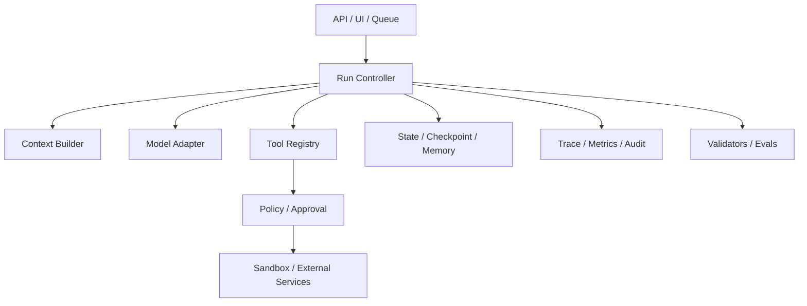

# 主控工程（Harness Engineering）

Harness 是模型外部、真正让 Agent 运行的软件层：装配上下文、调用模型、验证决策、调度工具、持久化状态、实施权限、处理错误并决定何时停止。

“Harness Engineering”是快速发展的行业术语，边界尚未完全统一。一个实用区分是：

- Loop 是“执行怎样循环”的控制策略；
- Graph 是“步骤怎样连接”的显式结构；
- Harness 是“谁实现并约束这些循环和图”的运行系统；
- Orchestrator 管多个 Agent，而每个 Agent 仍可有自己的 Harness。

## Harness 的组成



## 一个可测试的最小 Harness

下面代码不绑定任何模型厂商。`Model` 使用 Protocol，单元测试可以注入 FakeModel，生产再接入支持结构化 tool calling 的 SDK。

```python
from dataclasses import dataclass, field
from time import monotonic
from typing import Any, Callable, Literal, Protocol


@dataclass
class Decision:
    kind: Literal["tool", "final", "needs_human"]
    name: str | None = None
    arguments: dict[str, Any] = field(default_factory=dict)
    answer: str | None = None


class Model(Protocol):
    def decide(self, messages: list[dict[str, str]]) -> Decision: ...


@dataclass(frozen=True)
class Tool:
    handler: Callable[..., Any]
    required_scope: str


def run_agent(
    model: Model,
    tools: dict[str, Tool],
    user_input: str,
    scopes: set[str],
    *,
    max_steps: int = 8,
    timeout_s: float = 30.0,
) -> str:
    messages = [{"role": "user", "content": user_input}]
    deadline = monotonic() + timeout_s
    seen_calls: set[str] = set()

    for step in range(1, max_steps + 1):
        if monotonic() >= deadline:
            raise TimeoutError("deadline_exceeded")

        decision = model.decide(messages)
        if decision.kind == "final":
            if not decision.answer:
                raise ValueError("empty_final_answer")
            return decision.answer
        if decision.kind == "needs_human":
            raise RuntimeError("needs_human")

        tool = tools.get(decision.name or "")
        if tool is None:
            observation = {"ok": False, "error": "tool_not_allowed"}
        elif tool.required_scope not in scopes:
            observation = {"ok": False, "error": "permission_denied"}
        else:
            fingerprint = f"{decision.name}:{sorted(decision.arguments.items())}"
            if fingerprint in seen_calls:
                observation = {"ok": False, "error": "duplicate_call"}
            else:
                seen_calls.add(fingerprint)
                try:
                    value = tool.handler(**decision.arguments)
                    observation = {"ok": True, "value": value}
                except Exception as exc:
                    observation = {"ok": False, "error": type(exc).__name__}

        messages.append({
            "role": "user",
            "content": f"step={step}; observation={observation!r}",
        })

    raise RuntimeError("max_steps")
```

这个骨架仍未覆盖：Schema validation、异步取消、持久化、幂等存储、日志脱敏、模型限流、token/费用预算和沙箱。它的价值在于把这些责任放在模型之外，并能逐项测试。

## 用 FakeModel 测 Harness

```python
class FakeModel:
    def __init__(self) -> None:
        self.turn = 0

    def decide(self, messages: list[dict[str, str]]) -> Decision:
        self.turn += 1
        if self.turn == 1:
            return Decision(kind="tool", name="multiply", arguments={"a": 6, "b": 7})
        return Decision(kind="final", answer="6 × 7 = 42")


answer = run_agent(
    FakeModel(),
    {"multiply": Tool(lambda a, b: a * b, required_scope="math:read")},
    "计算 6 × 7",
    scopes={"math:read"},
)
assert answer == "6 × 7 = 42"
print(answer)
```

再补三个测试：无 scope 时必须拒绝、重复调用必须返回 `duplicate_call`、模型永不 final 时必须因 `max_steps` 停止。

## 权限不是 Prompt

“不要删除文件”是一条有用指令，但不能代替操作系统或服务端权限。生产权限应同时存在：

- 工具 allowlist：本次运行只暴露必要工具；
- scope：当前身份只能访问授权租户与资源；
- 参数约束：路径、金额、收件人、SQL 类型；
- 审批门：删除、付款、发布、生产变更；
- 沙箱：文件系统、网络、进程、CPU、内存和时间；
- secret 隔离：模型只获得短期、最小化凭证，或完全不见密钥；
- 审计：谁请求、谁批准、执行了什么、结果是什么。

## 沙箱的真正边界

沙箱不只是“在 Docker 里跑”。至少检查：

- 容器是否特权运行；
- 宿主目录挂载是否只读且范围精确；
- 网络是否默认关闭或使用域名 allowlist；
- 子进程数量、CPU、内存、磁盘和执行时间；
- 凭证是否通过代理服务注入而非环境变量全量暴露；
- 输出文件和下载内容是否做病毒/格式检查；
- 销毁后是否清除临时数据。

## 状态、检查点与副作用

Checkpoint 恢复的是“系统认为什么已经完成”，外部服务才保存真实副作用。两者之间可能在崩溃时不一致：

```text
调用支付接口成功 -> 进程崩溃 -> checkpoint 尚未写入
```

恢复后不能直接再次支付。应使用幂等键向外部服务查询既有结果，再更新 checkpoint。类似原则适用于发邮件、创建工单、发布内容和数据库写入。

## Human-in-the-loop

人工介入不是失败兜底的弹窗，而是显式状态：

- 需要什么决定；
- 展示哪些最小证据；
- 允许哪些选项；
- 谁有审批权；
- 多久后超时；
- 恢复从哪个 checkpoint 开始；
- 审批前的节点是否会重放。

## Trace、日志与指标

| 层次 | 最少记录 |
| --- | --- |
| Run | task/tenant、版本、开始结束、stop reason、总成本 |
| Model | 模型、Prompt 版本、token、延迟、错误；敏感内容脱敏 |
| Tool | 名称、参数摘要、scope、幂等键、延迟、结果码 |
| Graph | node、edge、route、checkpoint、interrupt |
| Eval | 指标、阈值、证据、pass/fail、评审器版本 |

Trace 解释“发生了什么”，Eval 判断“结果好不好”，二者不能互相替代。

异常轨迹的检测、硬性拦截、重规划、预算和停止条件见[Agent 异常轨迹排除](./agent-abnormal-trajectory-control.md)。它把工具死循环、震荡、无进展、环境失同步、重试螺旋等问题落实为 Runtime 策略，而不是依赖“在 Prompt 中提醒模型”。

## Harness 选型清单

- 模型供应商是否可替换，错误是否归一化；
- 工具是否支持 typed schema、timeout、cancellation 和审批；
- 状态能否持久化、迁移、回放与删除；
- 长任务能否暂停、恢复和取消；
- 并行任务是否有背压和配额；
- 是否支持 trace、指标、样本回放和离线评测；
- 沙箱与租户隔离是否由基础设施强制；
- SDK 升级后是否有契约测试。

## 参考资料

- [Hugging Face：Harness, Scaffold, and the AI Agent Terms Worth Getting Right](https://huggingface.co/blog/agent-glossary)
- [OpenAI 官方文档：Agents SDK](https://developers.openai.com/api/docs/guides/agents/sdk)
- [LangGraph：Durable execution](https://docs.langchain.com/oss/python/langgraph/durable-execution)
- [Microsoft Agent Framework](https://github.com/microsoft/agent-framework)
