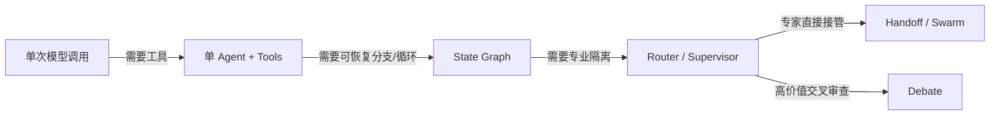

# 生产实践与选型

生产级 Agent 的目标不是展示一次漂亮对话，而是在真实输入、外部故障和权限约束下稳定完成任务，并能解释失败发生在哪一层。

## 从最简单架构开始



升级架构必须对应可观测的问题：不是因为“多 Agent 更先进”，而是单 Agent 已出现工具选择冲突、上下文污染、专业边界或并行需求。

## 评测分层

| 层 | 关键指标 | 失败例子 |
| --- | --- | --- |
| Prompt/输出 | Schema 通过率、分类准确率、证据一致性 | 字段缺失、理由不来自输入 |
| Context/RAG | Recall@K、证据覆盖、污染率、压缩损失 | 找到材料但没注入关键段落 |
| Tool | 选择准确率、参数正确率、执行成功率 | 调对接口但订单 ID 错误 |
| Loop | 任务成功率、平均轮数、无进展率、stop reason | 工具成功但循环不停止 |
| Graph/多 Agent | 路由准确率、handoff 次数、合并正确率 | A↔B 循环、并行结果覆盖 |
| Harness | 越权率、恢复率、审计完整性 | 重启后重复退款 |
| 业务 | 完成率、人工接管率、用户纠错率、真实价值 | 模型分高但业务未解决 |

不要把所有分数平均成一个“Agent 总分”。不同指标对应不同修复层：检索召回低就改 RAG，不是重写 personality；权限失败要改 Harness，不是要求模型“更小心”。

## 建立评测集

至少包括：

- 正常主流程；
- 信息不足，需要澄清或转人工；
- 工具返回空、超时、限流和部分成功；
- 多意图和冲突约束；
- 重复写操作与恢复；
- 提示注入、越权和敏感数据；
- 长上下文与过期证据；
- 必须拒绝或等待审批的高影响动作。

每条样本记录输入、初始状态、允许工具、期望业务属性、禁止动作和最大预算。真实生产失败应去敏后回流，并对数据集版本化。

## 一个确定性的工具轨迹测试

下面示例不调用模型，直接验证 Harness 收到某条候选轨迹时是否允许执行。模型质量测试和安全策略测试应分开，才能定位失败。

```python
from dataclasses import dataclass
from typing import Literal


@dataclass(frozen=True)
class ToolCall:
    name: str
    side_effect: Literal["read", "write", "destructive"]
    approved: bool = False


def validate_trace(calls: list[ToolCall], max_calls: int = 5) -> list[str]:
    errors: list[str] = []
    if len(calls) > max_calls:
        errors.append("tool_budget_exceeded")
    for call in calls:
        if call.side_effect in {"write", "destructive"} and not call.approved:
            errors.append(f"approval_required:{call.name}")
    return errors


trace = [
    ToolCall("search_orders", "read"),
    ToolCall("refund_order", "write", approved=False),
]
assert validate_trace(trace) == ["approval_required:refund_order"]
```

## Trace 与 Eval

Trace 回答“发生了什么”，Eval 回答“结果是否好”。一次完整 trace 建议包含：

```text
run
├── context.build       source ids / token budget / dropped items
├── model.call          model / prompt version / tokens / latency
├── route               selected edge / confidence / rule result
├── tool.call           args summary / scope / idempotency key
├── checkpoint.write    graph version / state version
├── validator           metric / evidence / pass-fail
└── final               stop reason / business outcome / cost
```

日志中不要默认保存密钥、完整客户数据、私有文档或模型私有推理。对参数和输出做字段级脱敏，并定义保留期和访问权限。

### Agents SDK tracing 与 session

Context7 核验的 OpenAI Agents SDK 0.7.x 支持 `trace()` 聚合多个 run，并可用 `SQLiteSession` 保存会话历史。

```python
import asyncio

from agents import Agent, Runner, SQLiteSession, trace


draft_agent = Agent(name="draft", instructions="生成三条简洁方案。")
review_agent = Agent(name="review", instructions="按成本与风险排序，不添加新事实。")


async def main() -> None:
    session = SQLiteSession("proposal-42")
    with trace("proposal-workflow"):
        draft = await Runner.run(
            draft_agent,
            "为只读知识库搜索设计降级方案。",
            session=session,
            max_turns=3,
        )
        review = await Runner.run(
            review_agent,
            f"评审这些方案：{draft.final_output}",
            session=session,
            max_turns=3,
        )
        print(review.final_output)


asyncio.run(main())
```

Session 方便保存消息，不等于长期业务记忆，也不替代权限、加密、保留策略和 checkpoint。

## 安全威胁模型

### 不可信输入

- 用户输入可能诱导越权；
- 网页、邮件、PDF 和 RAG 文档可能包含提示注入；
- 工具结果可能被上游攻击者控制；
- 另一个 Agent 的输出也只是待验证数据。

### 能力边界

- 默认只读，按任务临时授予最小 scope；
- 文件路径解析后必须留在允许目录；
- 网络使用域名和协议 allowlist；
- SQL 使用参数化查询和只读账户；
- 支付、删除、发布、生产变更需要审批和幂等键；
- 子 Agent 不继承主 Agent 的全部凭证。

### 输出边界

- 结构化验证不能替代业务验证；
- 引用必须能回到真实 source ID；
- 个人信息、密钥和内部策略按目标受众脱敏；
- 对外发送前展示预览、目标和影响范围。

## 延迟与成本

端到端延迟近似为关键路径上各节点延迟之和；并行只能缩短互不依赖的分支，无法消除最慢分支和汇总成本。

$$
T_{total}\approx T_{context}+\max(T_{parallel})+T_{serial}+T_{validation}
$$

常用优化顺序：

1. 删除不必要的模型调用和 Reflection 轮次；
2. 固定路径改为代码，不让模型重复决策；
3. 按需加载工具与资料，减少 context；
4. 并行独立检索/worker；
5. 缓存稳定 Prompt 前缀、检索结果和幂等工具结果；
6. 用小模型处理路由等经过评测的窄任务；
7. 为每层记录 token、延迟和命中率，再做针对性优化。

## 故障恢复

| 故障点 | 恢复策略 |
| --- | --- |
| 模型调用前 | 可安全重试，沿用 run ID |
| 只读工具超时 | 有界重试或换副本 |
| 写工具返回前断线 | 用幂等键查询真实业务结果 |
| checkpoint 写入失败 | 不执行下一外部副作用，告警 |
| worker 部分失败 | 汇总节点按策略降级或整体转人工 |
| 图版本升级 | State migration；旧运行绑定旧图或显式迁移 |

恢复流程必须用故障注入测试，而不是只在文档里写“支持重试”。

## 发布流程

1. 离线评测：固定模型、Prompt、工具和数据快照。
2. Shadow：读取真实流量但不产生外部副作用。
3. Canary：少量低风险租户，写操作仍审批。
4. 分阶段放权：先只读，再可逆写入，最后高影响能力。
5. 在线监控：质量、成本、延迟、人工接管与安全指标。
6. 回滚：Prompt、模型、Graph、工具 Schema 和策略均可独立回滚。

## 架构选型

| 问题特征 | 首选模式 | 不宜默认使用 |
| --- | --- | --- |
| 固定步骤、强审计 | deterministic workflow / graph | 开放式 Swarm |
| 路径未知、依赖环境反馈 | ReAct + bounded Harness | 一次性长 Prompt |
| 可预先拆解、步骤依赖强 | Plan-and-Execute + replan | 无计划逐步探索 |
| 有自动测试或明确 rubric | Reflection / evaluator-optimizer | 纯主观自评 |
| 输入可一次分域并行 | Router + fan-out/fan-in | 跨轮 Supervisor |
| 多专业域需中心协调 | Supervisor / subagents-as-tools | 所有工具塞给单 Agent |
| 专家需直接接管对话 | Handoff / Swarm | 无状态 Router |
| 需要独立观点与交叉审查 | Debate + evidence + judge | 同 Prompt 无限群聊 |
| 长任务暂停恢复和人工审批 | StateGraph + checkpoint + interrupt | 进程内裸 `while True` |

## 上线检查表

- [ ] 成功标准与 stop reason 已定义；
- [ ] 有代表性评测集和回归阈值；
- [ ] 工具 typed schema、超时、错误码、scope、幂等与审批齐全；
- [ ] Prompt、模型、工具、Graph、State 和知识快照可版本化；
- [ ] checkpoint、取消、恢复和故障注入通过；
- [ ] trace 可关联到业务结果且敏感字段已脱敏；
- [ ] token、费用、时间、并发和结果大小都有预算；
- [ ] 多租户隔离、删除和数据保留策略已验证；
- [ ] 高风险路径能转人工并可审计；
- [ ] 有灰度、回滚和紧急停用开关。

## 参考资料

- [Anthropic：Building effective agents](https://www.anthropic.com/engineering/building-effective-agents)
- [OpenAI：A practical guide to building agents](https://openai.com/business/guides-and-resources/a-practical-guide-to-building-ai-agents/)
- [OpenAI 官方文档：Integrations and observability](https://developers.openai.com/api/docs/guides/agents/integrations-observability)
- [LangGraph：Durable execution](https://docs.langchain.com/oss/python/langgraph/durable-execution)
- [OWASP：Top 10 for LLM Applications](https://genai.owasp.org/llm-top-10/)
- [NIST：AI Risk Management Framework](https://www.nist.gov/itl/ai-risk-management-framework)
