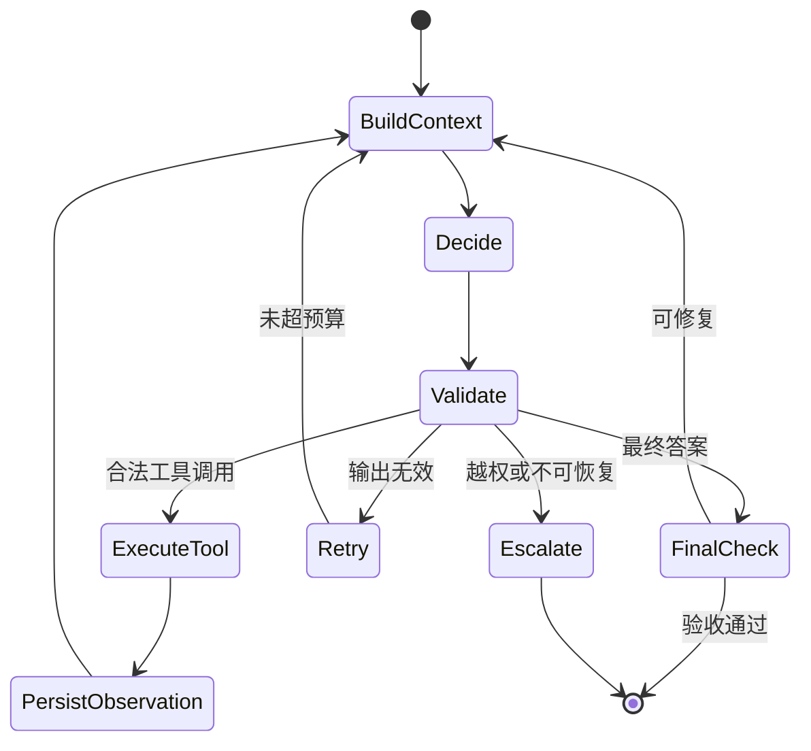

# 循环工程（Loop Engineering）

Loop Engineering 设计一个 Agent 如何反复“读取状态 → 决策 → 行动 → 观察 → 更新状态”，以及如何可靠停止。

“Loop Engineering”是新兴工程术语；循环本身则是工具调用 Agent 的成熟结构。Anthropic 将 Agent 简化为“LLM 自主地在循环中使用工具”，OpenAI 的 Agent 指南也把 run 描述为持续到退出条件的循环。

## Workflow 与 Agent

| 系统 | 路径由谁决定 | 适合场景 |
| --- | --- | --- |
| Workflow | 预定义代码、规则或状态图 | 固定审批、ETL、合规流程、强审计任务 |
| Agent | 模型根据当前状态与环境反馈动态决定 | 步骤难预测、开放式搜索、复杂故障定位 |
| Hybrid | 确定性骨架 + 局部 Agent 节点 | 大多数生产系统 |

固定的“查库存 → 判断 → 下单 → 通知”不需要开放式 Agent；而“调查线上故障并选择下一条诊断命令”更适合有边界的 Loop。

## 最小状态机



每轮都要产生可持久化的状态，而不是只向一段巨大字符串追加聊天记录。

```python
from dataclasses import dataclass, field
from typing import Any, Literal


@dataclass
class RunState:
    goal: str
    step: int = 0
    observations: list[dict[str, Any]] = field(default_factory=list)
    status: Literal["running", "succeeded", "failed", "needs_human"] = "running"
    stop_reason: str | None = None
```

## 一次 Loop 必须有的边界

### 轮数、时间、token、费用和并发

只设 `max_steps` 不够。工具可能一次运行十分钟，模型也可能在单轮消耗大量 token。至少需要：

- `max_steps`：最多模型决策次数；
- `deadline`：端到端墙钟时间；
- `max_input_tokens` / `max_output_tokens`；
- `max_cost`：按租户或任务限制；
- `max_parallel_tools`：防止扇出失控；
- `max_tool_result_bytes`：防止 Observation 淹没上下文。

### 停止原因

```text
completed           已通过验收
max_steps           达到轮数上限
deadline_exceeded   超时
budget_exhausted    token 或费用耗尽
no_progress         连续多轮没有新信息
permission_denied   请求越权
tool_unavailable    关键依赖不可用
cancelled           用户或上游取消
needs_human         需要审批或判断
```

不要只记录 `failed=true`，否则无法评估和恢复。

## 使用 Agents SDK 运行有界工具循环

下面代码基于 Context7 核验的 OpenAI Agents SDK 0.7.x。工具数据是明确标注的本地模拟值；Agent 的模型调用需要配置 `OPENAI_API_KEY`。

```bash
pip install "openai-agents>=0.7,<0.8"
```

```python
from agents import Agent, Runner, function_tool
from agents.exceptions import MaxTurnsExceeded


@function_tool
def get_order_status(order_id: str) -> str:
    """只读查询订单状态。order_id 必须类似 O-100；找不到时返回 not_found。"""
    # 教学模拟数据；生产中替换为有超时、鉴权和审计的服务调用。
    rows = {"O-100": "paid", "O-101": "shipped"}
    return rows.get(order_id, "not_found")


agent = Agent(
    name="order_assistant",
    instructions=(
        "回答订单状态问题。只有用户提供明确订单号时才能调用工具；"
        "not_found 时不要猜测；查询一次已经得到结果就应结束。"
    ),
    tools=[get_order_status],
)

try:
    result = Runner.run_sync(
        agent,
        "请查询 O-101 的状态。",
        max_turns=4,
    )
    print(result.final_output)
except MaxTurnsExceeded:
    print("停止：Agent 超过最大轮数，转人工处理。")
```

SDK 管理模型调用与工具结果回传，但业务系统仍要在工具内部实施权限、幂等、超时与审计。

## 重试要分层

| 失败 | 应在何处处理 | 策略 |
| --- | --- | --- |
| 网络抖动、限流 | 工具/模型客户端 | 指数退避、抖动、最大次数 |
| 参数不合法 | Tool validation | 返回结构化字段错误，让 Agent 修正一次 |
| 内容质量未通过 | 显式 Graph/Reflection 边 | 带新反馈重做，不使用基础设施盲重试 |
| 权限拒绝 | Policy layer | 不重试；转审批或终止 |
| 副作用结果未知 | 业务服务 | 用幂等键查询结果，不能直接再执行 |

重试必须增加新信息或等待瞬时故障恢复。相同输入、相同状态、相同错误的无限重试只会增加成本。

## 无进展检测

可以组合确定性信号：

- 连续调用相同工具与相同参数；
- 状态摘要的哈希多轮不变；
- 验收失败原因没有变化；
- 新 Observation 与已有内容完全重复；
- 剩余计划没有缩短；
- 同一解析错误超过阈值。

```python
import json


def call_fingerprint(tool_name: str, arguments: dict) -> str:
    return f"{tool_name}:{json.dumps(arguments, sort_keys=True, ensure_ascii=False)}"


recent = ["search:{\"q\": \"退款政策\"}"] * 3
if len(recent) >= 3 and len(set(recent[-3:])) == 1:
    raise RuntimeError("no_progress: repeated identical tool call")
```

## Loop 可观测性

一次 trace 应能重建：每轮输入摘要、模型/Prompt 版本、工具选择、参数摘要、Observation ID、状态变更、token、延迟、重试、停止原因和最终验收结果。私有推理全文既不是必要的审计字段，也可能包含敏感信息；记录可解释的决策摘要和外部动作即可。

## 参考资料

- [Anthropic：Building effective agents](https://www.anthropic.com/engineering/building-effective-agents)
- [OpenAI：A practical guide to building agents](https://openai.com/business/guides-and-resources/a-practical-guide-to-building-ai-agents/)
- [IBM：What is loop engineering?](https://www.ibm.com/think/topics/loop-engineering)
- [OpenAI 官方文档：Running agents](https://developers.openai.com/api/docs/guides/agents/running-agents)
