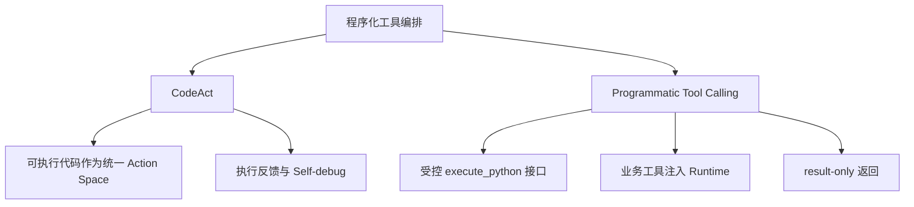
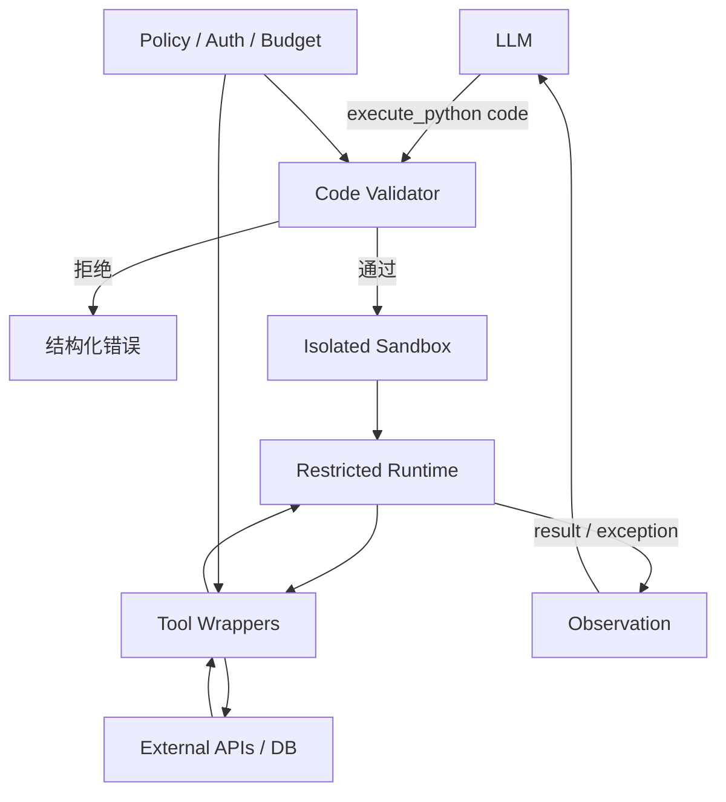
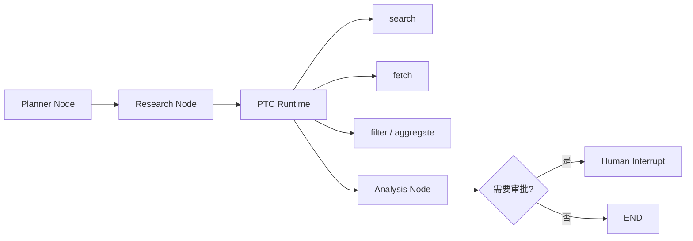

# 程序化工具编排：从 CodeAct 到 PTC

程序化工具编排（Programmatic Tool Orchestration）让 Agent 生成一小段程序，在受控 Runtime 内组合多个工具、处理中间数据，再把精简结果返回模型。它的主分类是 L3 Loop Engineering，生产落地同时依赖 L5 Harness Engineering。

## 它在 Agent 工程中的位置

```text
AI Engineering
└── Agent Engineering
    └── 设计面
        ├── L2 Context Engineering
        │   └── 只把必要结果送回模型
        ├── L3 Loop Engineering              ← 主分类
        │   └── Programmatic Tool Orchestration
        │       ├── CodeAct
        │       └── Programmatic Tool Calling
        └── L5 Harness Engineering           ← 生产保障
            └── Validator / Runtime / Sandbox / Policy
```

它不是 Supervisor、Swarm 或 Debate 等多 Agent 拓扑，也不是需要新增的“第七种核心模式”。它改变的是单个 Agent Loop 的 Action 表达能力：从“一次选一个工具”变成“一次生成程序来组合工具”。

## 为什么普通 Tool Calling 不够

一次查询天气时，传统 Function Calling 最简单：

```text
LLM → get_weather("Tokyo") → Answer
```

但任务如果要求查询 20 个城市的天气和酒店价格、过滤雨天城市、计算住宿成本并选出最便宜的 3 个，逐次调用容易变成：

```text
LLM → Tool → LLM → Tool → LLM → Tool → ...
```

这会带来三个问题：

1. 每个工具动作都可能增加一次模型调用；
2. 大量中间结果反复进入上下文，占用 token；
3. 循环、条件、分页、过滤、排序和聚合难以用离散 JSON 调用简洁表达。

程序化工具编排把控制流和数据流放进 Runtime：

```python
cities = ["Tokyo", "Osaka", "Kyoto"]
available = []

for city in cities:
    weather = get_weather(city)
    if weather["rain_probability"] < 0.3:
        available.append(city)

result = available
```

关键区别不是 JSON 与 Python 的语法差异，而是一个 Action 能否表达变量、数据依赖、循环、分支、聚合、重试和多工具组合。

## CodeAct 与 PTC 的关系



### CodeAct：代码作为动作的研究范式

CodeAct 来自 ICML 2024 论文 *Executable Code Actions Elicit Better LLM Agents*。它使用可执行 Python 代码统一 Agent 的 Action Space；解释器执行代码后，把结果或异常作为 Observation 返回模型，模型可以继续行动或修复代码。

```text
LLM
 ↓
Code Action
 ↓
Python Interpreter
 ↓
stdout / result / exception
 ↓
Observation
 ↓
LLM 修复、继续或结束
```

CodeAct 的重点是两项能力：

- **Control Flow + Data Flow**：程序能原生表达工具之间的数据依赖和控制逻辑；
- **Execution Feedback**：异常不是终局，而是下一轮可利用的环境反馈。

论文在 API-Bank 和 M³ToolEval 等任务上观察到 CodeAct 相对 JSON/Text Action 的优势。具体数值依赖模型、任务和实验设置，工程上应关注趋势：工具越多、数据依赖越强、控制流越复杂，程序化 Action 越可能有价值。

### PTC：更收敛的工程实现

PTC（Programmatic Tool Calling）可理解为一种工程化做法：模型对外只调用受控的 `execute_python(code)`，业务工具作为函数注入 Runtime，而不是全部作为独立 Tool 暴露给模型。

```python
orders = get_orders("user-001")
valid_orders = [item for item in orders if item["amount"] > 100]
result = sum(item["amount"] for item in valid_orders)
```

Runtime 最终只返回 `result`。`PTC` 目前不是具有统一规范的标准术语，不同实现对状态持久化、可用语法、错误回传和沙箱边界的定义可能不同。

| 对比项 | CodeAct | PTC |
| --- | --- | --- |
| 定位 | 研究范式 | 工程实现方式 |
| 核心 | Executable Code as Action | Programmatic Tool Calling |
| 执行环境 | Python Interpreter | 受控 Runtime / Sandbox |
| 工具使用 | 代码统一表达动作 | 工具以函数形式注入 |
| 返回内容 | 结果、stdout、异常等 Observation | 通常约定只返回 `result` 或结构化错误 |
| 关注重点 | Action Space、交互和 Self-debug | 工具组合、上下文压缩、安全和治理 |

## 什么时候值得使用

普通 Function Calling 更适合：

- 查询一次天气、一个用户或一个文件；
- 发送一封邮件、创建一个 Issue；
- 只有 1～2 次调用，且不存在复杂中间计算；
- 写操作需要非常明确的逐次审批。

出现以下信号时，再考虑 CodeAct/PTC：

- 循环读取分页数据；
- 根据工具结果执行条件分支；
- 过滤、排序、去重、分组或聚合大量数据；
- 多个 API 之间有明确数据依赖；
- 需要在一次动作内控制重试或停止；
- 原始工具结果很大，但最终只需要一个小结果。

例如“读取 GitHub 最近 100 个项目，过滤 Star 小于 1000 的项目，按语言分组，读取剩余 README，最后选出 10 个项目”，比“查询一个仓库”更适合程序化编排。

## 推荐架构



各组件职责必须分开：

| 组件 | 负责 | 不负责 |
| --- | --- | --- |
| LLM | 理解任务、生成程序、根据反馈修复、组织最终答案 | 直接持有密钥、决定最终权限 |
| Validator | 语法、AST、允许能力和静态规则 | 代替操作系统隔离 |
| Runtime | 保存局部变量、执行控制流、收集结果 | 绕过 Tool Layer 访问生产系统 |
| Sandbox | 隔离进程、文件、网络和资源 | 判断业务用户是否有权限 |
| Tool Layer | 鉴权、超时、Schema、幂等和 API 调用 | 把原始 Secret 暴露给模型 |
| Policy | 权限、预算、审批和风险决策 | 依赖模型自觉遵守规则 |

## Tool Registry

业务工具应注册在统一 Registry 中，Runtime 只拿到允许执行的函数。

```python
from dataclasses import dataclass
from typing import Any, Callable


@dataclass(frozen=True)
class Tool:
    name: str
    func: Callable[..., Any]
    description: str


class ToolRegistry:
    def __init__(self) -> None:
        self._tools: dict[str, Tool] = {}

    def register(self, func: Callable[..., Any], description: str) -> None:
        self._tools[func.__name__] = Tool(
            name=func.__name__,
            func=func,
            description=description,
        )

    def functions(self) -> dict[str, Callable[..., Any]]:
        return {name: tool.func for name, tool in self._tools.items()}


registry = ToolRegistry()


def get_weather(city: str) -> dict[str, object]:
    # 教学模拟数据；生产中由带鉴权、超时和审计的 Tool Proxy 实现。
    return {
        "city": city,
        "temperature": 24,
        "rain_probability": 0.1,
    }


registry.register(get_weather, "查询指定城市的天气")
```

生产实现可从类型注解和 docstring 生成工具 Schema，但生成结果仍应经过人工审核。工具描述要明确输入、输出、错误、权限、副作用和幂等语义。

## `result` 是 Runtime 契约

约定最终返回值必须写入 `result`：

```python
cities = ["Tokyo", "Osaka", "Kyoto"]
available = []

for city in cities:
    weather = get_weather(city)
    if weather["rain_probability"] < 0.3:
        available.append(city)

result = available
```

模型只收到：

```json
["Tokyo", "Osaka", "Kyoto"]
```

它不需要看到全部局部变量、每个 API Response 和冗长日志。核心原则是：**Runtime 是计算空间，LLM Context 是决策空间**。中间数据默认留在 Runtime，只有做下一步决策所必需的结果才进入上下文。

返回协议最好结构化：

```json
{
  "status": "success",
  "result": ["Tokyo", "Osaka", "Kyoto"],
  "metrics": {
    "tool_calls": 3,
    "duration_ms": 84
  }
}
```

失败时返回错误类型、允许公开的消息、发生阶段和是否可重试，不要把完整环境变量、栈中的 Secret 或内部路径直接交给模型。

## 可运行的教学 Executor

下面代码可以运行，用于理解 Registry、局部作用域和 `result` 契约。它仍然调用了 Python `exec`，**只能执行开发者自己编写的可信代码，不能执行模型生成或用户提交的不可信代码**。

```python
from typing import Any


class EducationalPythonExecutor:
    def __init__(self, tool_registry: ToolRegistry) -> None:
        self.tool_registry = tool_registry

    def execute_trusted_code(self, code: str) -> Any:
        local_scope: dict[str, Any] = self.tool_registry.functions()
        exec(code, {"__builtins__": {}}, local_scope)
        if "result" not in local_scope:
            raise ValueError("program must assign a value to result")
        return local_scope["result"]


executor = EducationalPythonExecutor(registry)
program = '''
weather = get_weather("Tokyo")
result = weather["temperature"]
'''
print(executor.execute_trusted_code(program))
```

即使 `__builtins__` 为空，普通 CPython `exec` 也不是可靠沙箱。对象图、注入函数、异常对象和实现细节都可能形成逃逸面，不能把这个教学版本部署为多租户执行服务。

## Agent Loop 与 Self-debug

下面是结构示例，`call_llm` 和生产级 `executor` 需要由具体 SDK 与隔离服务实现：

```python
MAX_STEPS = 6


def run_agent(task: str) -> str:
    messages = [
        {"role": "system", "content": SYSTEM_PROMPT},
        {"role": "user", "content": task},
    ]

    for _ in range(MAX_STEPS):
        response = call_llm(messages)
        if response.type == "final":
            return response.text

        if response.type != "execute_python":
            raise RuntimeError("unsupported_action")

        try:
            result = executor.execute(response.code)
            observation = {"status": "success", "result": result}
        except Exception as exc:
            observation = {
                "status": "error",
                "error_type": type(exc).__name__,
                "message": str(exc),
            }

        messages.append({"role": "tool", "content": str(observation)})

    raise RuntimeError("max_steps_exceeded")
```

假设第一次程序错误地读取 `order["price"]`，Runtime 返回 `KeyError`；模型下一轮改用 `order["amount"]` 并重新执行。这是 CodeAct 的重要能力：

```text
生成 → 执行 → 观察错误 → 修复 → 再执行
```

Self-debug 必须有轮数、时间和费用限制。相同代码、相同错误连续出现时应触发 `no_progress`，而不是无限重试。

## 两个典型任务

### 订单聚合

```python
orders = get_orders(customer_id="customer-123", limit=20)
valid_orders = [order for order in orders if order["amount"] > 100]
result = sum(order["amount"] for order in valid_orders)
```

过滤和求和都发生在 Runtime，模型只收到总金额。权限校验必须发生在 `get_orders` 的服务端实现中，不能只依赖生成代码传入的 `customer_id`。

### 天气与旅行价格组合

```python
cities = ["Tokyo", "Osaka", "Kyoto"]
plans = []

for city in cities:
    weather = get_weather(city)
    if weather["rain_probability"] >= 0.3:
        continue

    flight = search_flight(city)
    hotel = search_hotel(city)
    plans.append({
        "city": city,
        "total_price": flight["price"] + hotel["price"],
    })

result = min(plans, key=lambda item: item["total_price"])
```

这个 Action 同时包含循环、条件判断、工具组合、数据依赖和聚合，正是程序化编排比逐次 Tool Calling 更有优势的场景。

## RestrictedPython 的正确定位

RestrictedPython 8.2 支持 CPython 3.10～3.15，通过 `compile_restricted`、受限 builtins 和 guard 定义 Python 子集。下面是官方 API 风格的最小示例：

```bash
pip install "RestrictedPython>=8.2,<9"
```

```python
from RestrictedPython import compile_restricted, safe_globals


source = '''
def calculate():
    values = [10, 20, 30]
    return sum(values)
'''

byte_code = compile_restricted(source, "<agent-program>", "exec")
local_scope: dict[str, object] = {}
restricted_globals = dict(safe_globals)
restricted_globals["sum"] = sum

exec(byte_code, restricted_globals, local_scope)
result = local_scope["calculate"]()
print(result)
```

这个例子只展示受限语言和显式注入能力。RestrictedPython 官方明确说明：**它不是沙箱或完整安全环境**。它限制受限源码的语法和名称访问，却不能替代进程、操作系统、文件系统、网络和资源隔离；注入 Runtime 的普通 Python 对象也必须单独审计。

## 生产安全边界

```text
Generated Code
      ↓
Syntax / AST Validation
      ↓
Restricted Language Policy
      ↓
Isolated Process / Container / microVM
      ↓
CPU / Memory / Timeout / Output Limit
      ↓
Filesystem / Network / Import Policy
      ↓
Tool Allowlist + Auth + Audit
      ↓
Execution
```

至少要限制：

- CPU、内存、墙钟时间和并发；
- 文件系统挂载、可写路径和临时文件容量；
- 出站网络、DNS 和允许访问的服务；
- `import`、动态属性访问、反射、序列化和进程创建；
- stdout、stderr、返回值和异常大小；
- 工具名称、参数 Schema、调用次数与总体费用；
- 写操作的权限、审批、幂等键和回滚策略。

不要把 Secret 放进 Runtime：

```text
Sandbox
   ↓ github_search(query)
Tool Proxy
   ↓ 使用服务端凭据
GitHub API
```

模型和 Sandbox 只看到 `github_search`，看不到 `GITHUB_TOKEN`。即使模型生成 `print(os.environ)`，隔离环境也不应存在生产凭据。

## Prompt 只描述契约

Prompt 无需堆叠大量规则，重点是说明什么时候使用程序、有哪些函数、怎样返回和怎样处理错误：

```text
You can solve complex tool tasks by writing small Python programs.

Call execute_python(code) when multiple tool calls need loops,
filtering, aggregation, or data dependencies.

Rules:
1. Only use the functions listed in the runtime contract.
2. Assign the value to return to `result`.
3. Keep intermediate data inside the runtime.
4. Never invent tool results.
5. If execution fails, inspect the structured error and repair once.
6. Stop when the result passes the task's acceptance criteria.
```

安全不能靠 Prompt 实现。真正决定边界的是 Runtime、工具 Schema、Policy、Sandbox 和 Observation 过滤。

## 与 LangGraph 的关系

LangGraph 与程序化工具编排不是竞争关系：

```text
LangGraph = 宏观工作流、状态、持久化、恢复和人工介入
CodeAct/PTC = 节点内部的动态工具与数据编排
```



不要把 `for`、`if`、`sort` 和 `filter` 全部画成 Graph Node。Graph 适合表达需要持久化、恢复、路由、审批和审计的宏观阶段；Runtime 适合处理节点内部短生命周期的计算。

## 推荐代码结构

```text
programmatic-agent/
├── agent.py
├── registry.py
├── prompts.py
├── protocol.py
├── tools/
│   ├── search.py
│   ├── weather.py
│   └── database.py
├── runtime/
│   ├── validator.py
│   ├── executor.py
│   └── sandbox_client.py
├── policy/
│   ├── permissions.py
│   └── budgets.py
└── tests/
    ├── test_protocol.py
    ├── test_security.py
    └── golden_tasks/
```

第一版只验证 `Agent → Program → Tools → result → Observation → Self-debug`。不要一开始加入多 Agent、复杂长期记忆、Kubernetes、Celery、Redis 和几十个 Graph Node。

## 评测指标

| 指标 | 说明 |
| --- | --- |
| Task Success Rate | 最终是否满足可执行验收条件 |
| Average LLM Turns | 每个任务平均模型决策次数 |
| Tool Calls / Task | 每个任务真实工具调用数 |
| Token / Task | 输入与输出 token 总量 |
| Error Recovery Rate | 出现执行错误后最终恢复成功的比例 |
| Sandbox Violations | 被 Validator、Policy 或隔离层拒绝的次数与类型 |
| Duplicate Side Effects | 重试导致的重复写操作，目标必须为 0 |

错误恢复率可以定义为：

$$
\text{Error Recovery Rate}
=
\frac{\text{发生执行错误但最终成功的任务数}}
{\text{发生执行错误的任务数}}
$$

评测集应包含正常多工具任务、分页与聚合、Schema 变化、超时、部分失败、恶意代码、Prompt Injection、Secret 探测和重复副作用等场景。

## MVP 路线

1. 实现 Tool Registry 和工具契约；
2. 约定 `execute_python(code)` 与结构化 Observation；
3. 强制使用 `result` 返回最终值；
4. 打通生成、执行、观察和有限 Self-debug；
5. 加入语法、AST 和能力 allowlist；
6. 使用独立进程，并限制 CPU、内存、时间和输出；
7. 按风险选择容器或 microVM，隔离文件与网络；
8. 设计 20～50 个包含多工具、循环、过滤、聚合和错误恢复的测试任务；
9. 对比普通 Function Calling，只有成功率、成本或延迟确有改善时再扩大使用范围。

## 常见误区

- **把 CodeAct 等同于代码生成**：核心是代码执行后的 Observation 和多轮修复。
- **把 PTC 当成统一标准**：它是工程术语，具体协议取决于实现。
- **认为 `__builtins__={}` 就安全**：普通 `exec` 仍不是不可信代码沙箱。
- **认为 RestrictedPython 就是容器**：它限制语言子集，不隔离操作系统资源。
- **把所有工具原始结果送回模型**：会失去上下文压缩的主要收益。
- **让 Runtime 持有生产 Secret**：凭据应留在 Tool Proxy 服务端。
- **把每个循环都改成代码 Action**：简单的 1～2 次调用仍应使用普通 Function Calling。
- **把所有控制逻辑放进 Runtime**：需要跨阶段恢复、人工审批和强审计的流程应交给 Graph。

## 参考资料

- [CodeAct 论文：Executable Code Actions Elicit Better LLM Agents](https://arxiv.org/abs/2402.01030)
- [CodeAct 官方实现](https://github.com/xingyaoww/code-act)
- [RestrictedPython 官方文档](https://restrictedpython.readthedocs.io/en/latest/)
- [RestrictedPython：Security considerations](https://restrictedpython.readthedocs.io/en/latest/usage/security_considerations.html)
- [LangGraph 官方文档：Overview](https://docs.langchain.com/oss/python/langgraph/overview)
- [LangGraph 官方文档：Persistence](https://docs.langchain.com/oss/python/langgraph/persistence)
- [Programmatic Tool Calling 示例实现](https://github.com/left0ver/programmatic_tool_calling)
