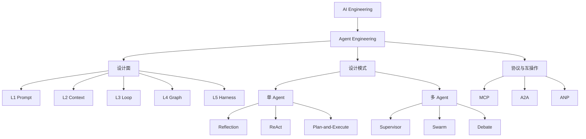

# Agent 工程概览

Agent Engineering 关注如何把模型、工具、状态和环境组织成一个能围绕目标持续行动的软件系统。它属于 AI Engineering，但比普通生成式应用多了循环、状态变化、外部副作用和运行治理。

## 三条学习主线

- [设计面（L1～L5）](./design-surfaces/index.md)回答系统由哪些工程问题组成：目标怎样表达、信息怎样选择、循环怎样推进、节点怎样连接、运行边界怎样治理。
- [设计模式](./design-patterns/index.md)回答控制流怎样复用：单 Agent 在 Loop 层迭代，多 Agent 在 Graph 层分工协作。
- [协议与互操作](./protocols-and-interoperability/index.md)回答跨进程、跨框架或跨组织时怎样发现能力、交换消息和跟踪任务：MCP 连接 Host 与工具/数据，A2A 连接独立 Agent，ANP 探索开放网络身份与发现。

设计面不是互斥模块，设计模式也不是产品名称。协议同样不是额外的 L2 或 L4：它横跨 Context、Loop、Graph 与 Harness 的系统边界。一个 Supervisor 的 worker 可以运行 ReAct；Plan-and-Execute 可以由 Graph 持久化；所有模式和协议最终都由 Harness 提供权限、预算、检查点和追踪。

## 最小可靠闭环

一次可上线的 Agent 运行至少要明确目标、输入上下文、允许调用的工具、状态变化、停止条件、失败策略和验收结果。模型负责提出下一步，确定性代码负责权限判断、副作用执行和状态提交。
