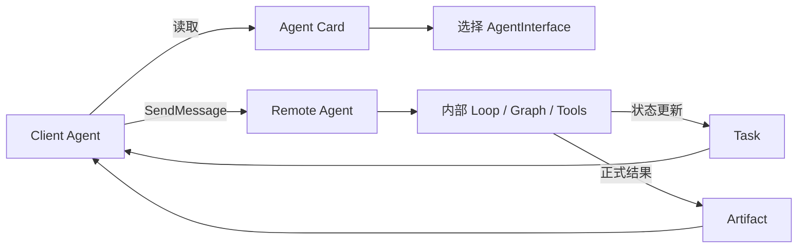
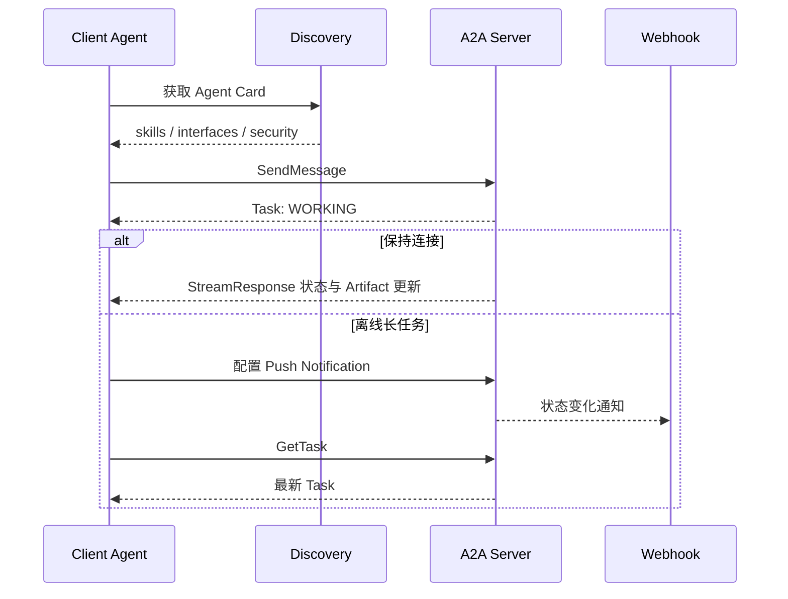

# A2A：独立 Agent 之间的任务协议

A2A（Agent2Agent Protocol）让不同框架、语言或组织中的 Agent 以稳定的任务接口协作。调用方只依赖对方公开的能力和协议对象，不需要知道对方内部使用哪个模型、Prompt、工具或 Graph。

## 为什么不能只把另一个 Agent 当工具

短小、无状态、立即返回的能力可以包装成普通 Tool。远端 Agent 往往还有自己的计划、记忆和审批流程，并可能运行数分钟或数小时，需要暂停、恢复、流式更新、异步通知和正式产物。A2A 用 Task 把这些语义显式化。



## A2A 1.0 的核心对象

| 对象 | 作用 | 关键边界 |
| --- | --- | --- |
| AgentCard | 自描述清单，声明名称、技能、能力、安全方案和接口 | 是能力声明，不是信任证明 |
| AgentInterface | URL、协议绑定、协议版本及可选 tenant 的组合 | 生产 HTTP URL 应使用 HTTPS |
| Message | 一轮交流内容，包含角色、Message ID 和 Part | 交流内容不等于正式任务产物 |
| Part | 文本、二进制、URL 或结构化数据 | 必须限制媒体类型、大小和 URL |
| Task | 服务端生成的长任务资源 | 保存状态、Artifact 和可选历史 |
| TaskStatus | 当前状态及可选说明消息 | 状态机必须由服务端持久化 |
| Artifact | Task 产生的正式输出 | 应有来源、访问控制和完整性校验 |

A2A 1.0 的 `AgentCard.supportedInterfaces` 可以同时声明 `JSONRPC`、`HTTP+JSON` 和 `GRPC` 等绑定。协议版本归属于每个接口，使服务端可以并行暴露 0.3 与 1.0，支持渐进迁移。

## 标准交互流程



常用操作包括：

- `SendMessage`：发送消息，返回 Message 或 Task；
- `SendStreamingMessage`：以流的方式返回状态、消息和 Artifact 更新；
- `GetTask`、`ListTasks`：查询调用方有权查看的任务；
- `CancelTask`：请求取消未进入终态的任务；
- `SubscribeToTask`：重新订阅未结束任务的更新；
- Push Notification 配置操作：让服务端在长连接不可用时通知回调端点。

## 最小 HTTP 交互

下面使用 A2A 1.0 的 HTTP+JSON 风格。服务端可以直接完成，也可以返回一个需要后续查询的 Task。

```http
POST /message:send HTTP/1.1
Content-Type: application/a2a+json
Authorization: Bearer <token>

{
  "message": {
    "messageId": "018f-example",
    "role": "ROLE_USER",
    "parts": [
      { "text": "分析这份故障报告并给出证据引用" }
    ]
  },
  "configuration": {
    "acceptedOutputModes": ["text/markdown"]
  }
}
```

```json
{
  "task": {
    "id": "task-018f-example",
    "contextId": "context-018f-example",
    "status": {
      "state": "TASK_STATE_WORKING"
    },
    "artifacts": []
  }
}
```

这些枚举与对象结构属于 1.0。旧教程中的小写 `user`、`agent`、`working`，以及旧版 `TextPart`/`FilePart` 判别结构，不能直接复制到 1.0 实现。

## Task 状态与恢复

常见状态包括 `SUBMITTED`、`WORKING`、`INPUT_REQUIRED`、`AUTH_REQUIRED`、`COMPLETED`、`FAILED`、`CANCELED` 和 `REJECTED`。工程上应按状态类别处理：

```text
非终态：SUBMITTED / WORKING / INPUT_REQUIRED / AUTH_REQUIRED
终态：  COMPLETED / FAILED / CANCELED / REJECTED
```

`INPUT_REQUIRED` 表示需要业务输入，`AUTH_REQUIRED` 表示需要补充认证或授权；它们不应被统一当作失败重试。Task ID、Context ID、客户端 Message ID 和业务幂等键也不能混用：分别承担资源定位、交互分组、消息去重和副作用去重。

## 鉴权与安全

A2A 把 Agent 视为普通企业应用。Agent Card 声明支持的安全方案，但凭据通过带外流程获得，并放在 HTTP header 等传输层位置，绝不能发布在 Agent Card 中。

生产实现需要额外约束：

1. 对 Agent Card 的来源、签名或组织身份独立验证，不能“能发现即可信”。
2. 每次请求都按调用方身份、tenant、Task 和动作授权；`GetTask`/`ListTasks` 不能泄露其他租户任务。
3. Push Notification URL 必须防 SSRF，并验证回调所有权、签名、重放和重定向。
4. URL Part 和 Artifact 下载必须限制域名、大小、媒体类型和有效期。
5. 敏感副作用采用预览、审批、幂等键和完成前再校验，取消也要有确定语义。
6. Trace 关联 Client、Server、Task、Message 和 Artifact，但不得记录 token 或未经脱敏的正文。

## 与其他协议的关系

- A2A 与 [MCP](./mcp.md) 互补：A2A 委派给远端 Agent，远端 Agent 可再用 MCP 调用工具。
- BeeAI 的 Agent Communication Protocol 已并入 A2A，新项目优先采用 A2A，详见 [ACP 迁移](./acp.md)。
- [ANP](./anp.md) 更强调开放网络中的去中心化身份、发现和安全消息；需求只在已知端点之间委派任务时，A2A 通常更直接。
- A2A 不规定 Supervisor、Swarm 或 Debate。它可以承载这些拓扑，但拓扑和路由仍由 Graph/Loop 决定。

## 参考资料

- [A2A 1.0 Specification](https://a2a-protocol.org/latest/specification/)
- [A2A 1.0 Protocol Definition](https://a2a-protocol.org/latest/definitions)
- [What's New in v1.0](https://a2a-protocol.org/latest/whats-new-v1)
- [A2A 1.0 发布说明](https://a2a-protocol.org/latest/blog/2026/03/12/a2a-protocol-ships-v10-production-ready-standard-for-agent-to-agent-communication)
- [A2A 官方 GitHub 组织](https://github.com/a2aproject)
