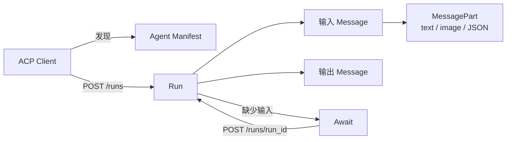
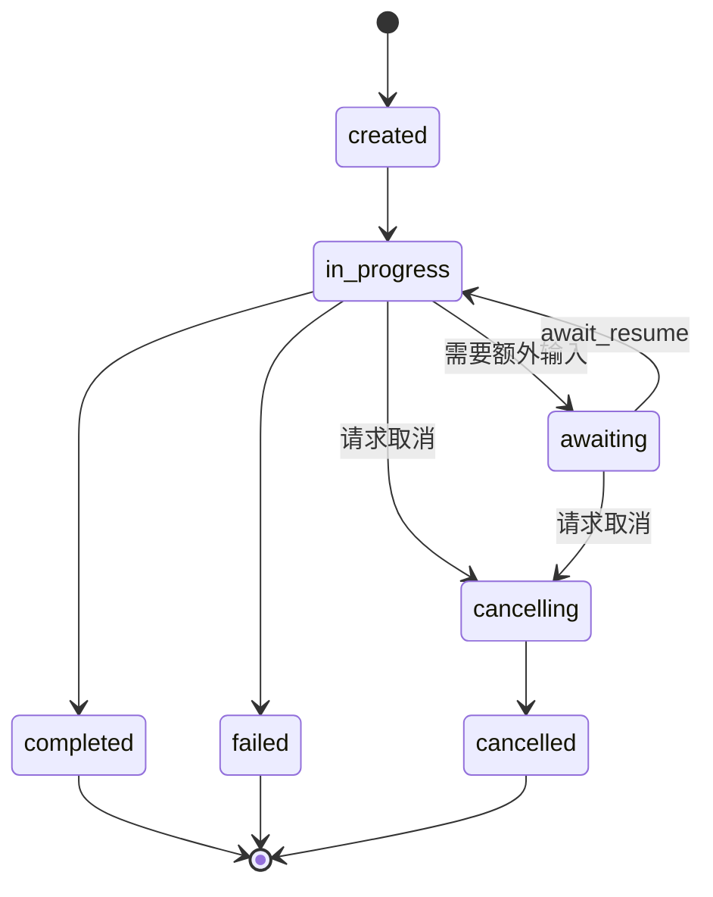
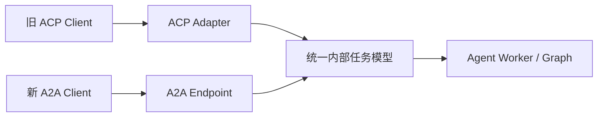

# ACP：历史协议与 A2A 迁移

这里的 ACP 指 BeeAI 发起的 **Agent Communication Protocol**。它曾用一组简单的 REST API 连接 Agent、应用与人类，支持多模态消息、同步/异步/流式运行以及暂停后补充输入。该项目后来并入 Linux Foundation 旗下的 A2A，官方仓库已经归档，因此 ACP 适合用于理解和维护存量系统，不应成为新系统的长期协议依赖。

## 先排除同名协议

工程资料里至少有两个 ACP：

| 名称 | 连接对象 | 主要用途 | 与本页关系 |
| --- | --- | --- | --- |
| Agent Communication Protocol | Agent、应用与人类 | 通过 REST 暴露 Agent 运行 | 本页讨论对象，已并入 A2A |
| Agent Client Protocol | 代码编辑器与编码 Agent 进程 | 编辑器集成、终端和工具交互 | 独立项目，不是 A2A 的前身 |

看到 `agentcommunicationprotocol.dev`、`i-am-bee/acp`、`/runs` 和 Agent Manifest，通常是前者；看到 `agentclientprotocol.com` 以及编辑器客户端/Agent 进程，通常是后者。仅凭缩写无法判断协议。

## ACP 的核心模型



| 对象 | 含义 | 工程责任 |
| --- | --- | --- |
| Agent Manifest | Agent 的名称、描述、能力和可选元数据 | 用于发现与组合，不应直接当作信任凭据 |
| Run | 一次带输入的 Agent 执行 | 服务端持久化状态、输出、错误与取消结果 |
| Message | 一组有序、多模态的内容 | 保留完整语义与顺序 |
| MessagePart | 文本、图片、JSON 等内容单元 | 校验类型、大小和外部引用 |
| Await | Run 暂停时发出的输入请求 | 客户端收集输入后恢复原 Run，而不是新建执行 |

这套模型的价值在于没有把长任务伪装成一次即时 HTTP 响应。调用方可以选择同步、异步或流式模式；Agent 需要人工确认或额外参数时，可以暂停并保留原运行上下文。

## Run 生命周期



官方生命周期使用 `created`、`in-progress`、`awaiting`、`completed`、`cancelling`、`cancelled` 和 `failed`。其中 `awaiting` 不是失败：客户端应展示 Await 请求，收集输入并恢复同一个 Run。`cancelling` 也不是 `cancelled`，因为底层副作用可能仍在收尾。

典型 REST 端点如下：

| 方法与路径 | 作用 |
| --- | --- |
| `POST /runs` | 用 `agent_name`、`input` 和可选模式创建 Run |
| `GET /runs/{run_id}` | 查询 Run 当前状态与输出 |
| `POST /runs/{run_id}` | 用 `await_resume` 恢复处于 awaiting 的 Run |
| `POST /runs/{run_id}/cancel` | 请求取消进行中的 Run |

下面是用于识别旧接口的概念示例，并非建议新项目照此实现：

```http
POST /runs HTTP/1.1
Content-Type: application/json
Authorization: Bearer <token>

{
  "agent_name": "report-reviewer",
  "mode": "async",
  "input": [
    {
      "role": "user",
      "parts": [
        { "content_type": "text/plain", "content": "审查这份报告" }
      ]
    }
  ]
}
```

不同 ACP SDK 版本的字段细节可能变化；维护旧系统时应以部署时锁定的 Schema 和 SDK 为准。

## 为什么迁移到 A2A

ACP 和 A2A 都解决独立 Agent 之间的互操作，但 A2A 已成为后续演进方向。A2A 1.0 提供正式的 Agent Card、Task、Artifact、多种协议绑定、任务订阅和推送通知等对象，同时保留长任务、流式更新与补充输入能力。

概念可以大致映射，但不是机械改名。下表是根据两份官方数据模型整理的工程映射，不是官方承诺的逐字段兼容关系：

| ACP | A2A 1.0 | 迁移注意 |
| --- | --- | --- |
| Agent Manifest | AgentCard + AgentInterface | 重新表达 skills、security 和每个接口的协议版本 |
| Run | Task | 服务端 ID、状态枚举、历史与可见性规则需重做 |
| Message | Message | role、Message ID 和上下文关联方式不同 |
| MessagePart | Part | 按 1.0 的文本、二进制、URL、结构化数据模型转换 |
| Await | `INPUT_REQUIRED` + status Message | 恢复应继续同一 Task/Context，并明确所需输入 |
| 最终输出 Message | Artifact 或 Message | 正式产物应建模为 Artifact，而非普通对话消息 |
| sync/async/stream | SendMessage / SendStreamingMessage / GetTask | 不要把传输模式直接映射成业务状态 |

## 渐进迁移方案



1. 先冻结 ACP Schema 和 SDK 版本，记录实际使用的端点、状态、消息部件与扩展字段。
2. 在内部建立与协议无关的任务模型，明确任务 ID、状态、输入请求、正式产物、取消和幂等语义。
3. 增加 A2A Endpoint，把内部能力发布为 Agent Card，并用契约测试覆盖 Message、Task 与 Artifact。
4. ACP Adapter 保留旧端点，把 Run 转成内部任务；不要让新业务继续依赖 ACP 专有字段。
5. 对比测试同步、流式、awaiting/input-required、取消、失败和重复提交，特别检查终态与副作用是否一致。
6. 迁移调用方并观测一段时间，最后才下线 ACP 兼容层。

不要直接把 ACP Run ID 当作 A2A Task ID 暴露，也不要假设状态一一对应。更稳妥的做法是保存显式映射，并让同一个业务幂等键贯穿兼容层。

## 存量系统安全检查

- Manifest 与输入内容均视为不可信数据，验证来源、Schema、媒体类型和大小。
- `/runs/{id}` 的查询、恢复与取消都必须按用户和租户授权，不能只验证 ID 是否存在。
- `await_resume` 只能回答服务端发出的当前 Await，请求需要过期时间并防止重放。
- Run 的写操作使用业务幂等键；取消后核对外部副作用是否真正停止或需要补偿。
- 兼容层记录 ACP Run 与 A2A Task 的关联，但日志中不落 token 和未脱敏正文。

## 参考资料

- [ACP 官方介绍](https://agentcommunicationprotocol.dev/introduction/welcome)
- [Agent Run 生命周期](https://agentcommunicationprotocol.dev/core-concepts/agent-run-lifecycle)
- [ACP GitHub 仓库](https://github.com/i-am-bee/acp)
- [ACP 到 A2A 迁移说明](https://github.com/i-am-bee/beeai-platform/blob/main/docs/community-and-support/acp-a2a-migration-guide.mdx)
- [A2A 1.0 规范](https://a2a-protocol.org/latest/specification/)
- [Agent Client Protocol](https://agentclientprotocol.com/)
