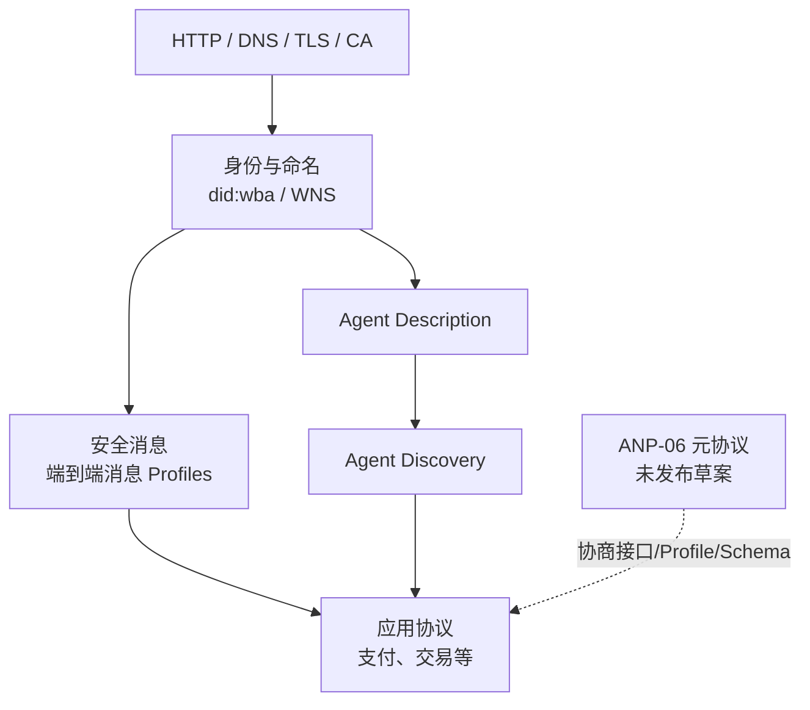
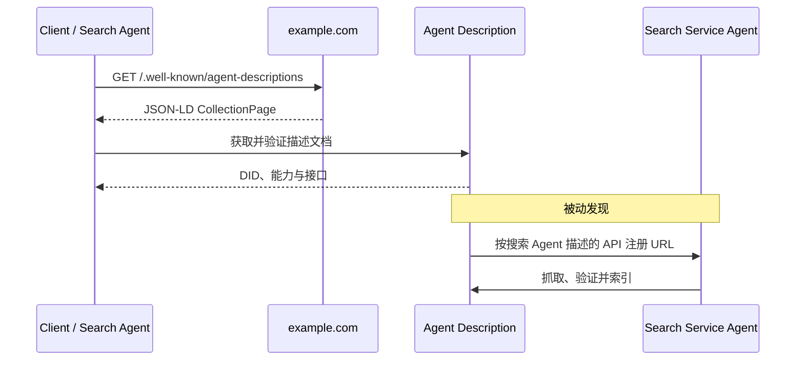

# ANP：开放 Agent 网络

ANP（Agent Network Protocol）不是单个请求 API，而是一组面向开放 Agent 网络的协议。它尝试复用 Web、DNS、TLS 和 DID，让不同域名、平台与组织中的 Agent 能够建立身份、发布描述、被发现并安全通信。

这比“已知两个服务怎样互调”范围更大，也意味着部署成本和信任问题更多。只有确实需要跨域、开放发现或去中心化身份时，才应评估 ANP；企业内已知端点之间的任务委派通常先看 [A2A](./a2a.md)。

## 协议族的位置



ANP 复用互联网基础设施，不应被描述成替代 HTTP 的新网络层。“Agentic Web 的 HTTP”是项目愿景，而不是已经获得全行业部署的事实标准。

## 先看成熟度，而不是只看编号

根据 ANP 官方仓库当前的 1.1 发布线，不同文档状态如下：

| 模块 | 状态 | 主要作用 |
| --- | --- | --- |
| ANP-03 `did:wba` | Released v1.1，另有 vNext 草案 | 将 Web 域名与 DID 身份、认证密钥关联 |
| ANP-04 WNS | Released v1.1，另有 vNext 草案 | 为 DID Agent 提供可读名称与轮换支持 |
| ANP-07 Agent Description | Released v1.1 | 用 JSON-LD 发布身份、能力、产品、服务与接口 |
| ANP-08 Agent Discovery | Released v1.1 | 通过 `.well-known` 主动发现或向搜索 Agent 被动注册 |
| ANP-09 即时消息 | Released v1.1，另有消息 vNext 草案 | 定义端到端消息的 Profile 组合 |
| ANP-06 通信元协议 | Draft / not released | 协商后续接口、Profile、安全配置和 Schema |
| 应用协议 | 分别版本化 | 例如 AP2 支付；不能代表所有业务领域都已有协议 |

“仓库里存在文档”不等于“已发布”。实施时应固定具体文档版本，并把 vNext 与 ANP-06 当作实验性能力隔离，不能默认对端支持。

## 身份：`did:wba`

`did:wba` 是面向 Web-Based Agent 的 DID 方法。DID 标识符把域名和路径编码进身份，DID Document 则发布验证方法与服务端点，使 Agent 能在不同平台间证明对某个身份的控制权。

概念示例：

```text
did:wba:example.com:user:alice
```

身份层解决“对方能否证明控制某个 DID”，但不自动回答：

- 这个主体是否属于可信组织；
- 它是否有权读取当前租户的数据；
- 它发布的技能是否真实；
- 这次高风险操作是否得到用户批准。

因此生产系统仍要把 DID 解析结果映射到本地信任策略、租户、角色和动作权限。解析 DID Document 与外部 URL 时还需防 SSRF、重定向绕过、DNS rebinding 和过期密钥。

## 描述：Agent Description

Agent Description 是 Agent 的机器可读入口，使用 JSON-LD 表达名称、所有者、DID、能力、产品、服务和交互接口。它可以引用 OpenAPI、JSON-RPC 或其他协议，而不是要求所有应用都改成一种调用格式。

```json
{
  "@context": {
    "@vocab": "https://schema.org/",
    "ad": "https://agent-network-protocol.com/ad#"
  },
  "@type": "ad:AgentDescription",
  "@id": "https://example.com/agents/travel/ad.json",
  "name": "TravelAgent",
  "did": "did:wba:example.com:agents:travel"
}
```

这是简化的说明性片段，不是完整可部署文档。实际实现应按锁定版本校验 JSON-LD、DID、Proof、接口 URL 和扩展词汇。

描述文档仍是发布者声明。签名可以证明文档由某个密钥控制者发布，却不能证明能力质量、业务资质或安全等级；调用方需要独立的组织信任与准入流程。

## 发现：主动与被动

ANP-08 定义两种发现方式：



- **主动发现**：已知域名后，请求 `https://{domain}/.well-known/agent-descriptions`，沿 `next` 分页读取公开 Agent Description URL。
- **被动发现**：Agent 主动把描述 URL 注册给搜索服务；注册 API 由搜索 Agent 自己的描述文档声明。

发现列表只能提供候选，不是可信目录。抓取方必须限制分页数量、响应大小、跳转域名和抓取频率，并在真正调用前重新验证描述和身份。

## 消息与元协议

ANP 的消息部分以 DID 身份和端到端加密通信为基础，并通过多个 Profile 约束不同交互方式。实现方应明确自己支持哪些已发布 Profile，不能只声明“支持 ANP”而省略版本与能力集合。

ANP-06 元协议设想让 Agent 基于描述进行语义协商，选择后续接口、Profile、安全配置与 Schema。这一方向可降低异构协议预集成成本，但官方当前仍标记为 **Draft / not released**。它还引入额外 RTT、模型理解误差、动态代码或 Schema 风险，生产系统不应把自然语言协商结果直接变成可执行权限。

若要试验元协议，应：

1. 只在隔离环境和允许的接口/Profile 集合内协商；
2. 对协商产物做确定性 Schema、签名和策略校验；
3. 禁止动态生成的代码直接获得网络、文件或凭据权限；
4. 保留回退协议和失败终态，避免无限协商；
5. 在能力声明中明确它是实验性扩展。

## 与 MCP、A2A 的关系

| 问题 | MCP | A2A | ANP |
| --- | --- | --- | --- |
| 主要边界 | AI Host 与工具/数据 Server | Client Agent 与 Remote Agent | 开放网络中的跨域 Agent |
| 发现对象 | Server 能力、tools、resources、prompts | Agent Card 与接口 | DID、描述文档和搜索索引 |
| 核心交互 | 能力调用与上下文读取 | Message、Task、Artifact | 身份认证、发现、安全消息和应用协议 |
| 长任务 | 可选 Tasks 扩展 | 核心 Task 模型 | 取决于所选应用协议/Profile |
| 信任根 | 部署与 OAuth/本地策略 | HTTPS、应用身份与授权 | Web/DID 密钥加本地信任策略 |

三者可以组合：通过 ANP 发现并验证一个远端 Agent，从描述文档选择其 A2A 接口，用 A2A 委派任务；远端 Agent 再用 MCP 访问工具和数据。组合并不意味着每层都必须使用一个新协议，实际系统应只保留有明确收益的边界。

## 采用建议

- **已知企业端点协作**：优先 A2A 或现有 API，不为去中心化而增加 DID 与搜索设施。
- **需要域名级公开发现**：试点 ANP-07/08，建立抓取、验证、信誉和下架机制。
- **需要跨平台可验证身份与安全消息**：评估 `did:wba` 和已发布消息 Profile，同时完成密钥轮换、吊销与恢复设计。
- **需要动态协议协商**：把 ANP-06 视为实验，不纳入关键生产路径。
- **需要调用工具或数据**：使用 MCP 或普通 API；ANP 的开放发现不替代工具契约。

## 安全检查

1. 固定规范版本和支持的 Profile；拒绝未知扩展与静默降级。
2. DID Document、Description、Discovery 和消息分别做 Schema、大小、签名、时效和来源校验。
3. URL 获取走受控出站代理，限制协议、域名、IP、跳转与内容类型。
4. 密钥轮换、设备丢失、吊销和恢复必须有明确流程；缓存随版本和有效期失效。
5. 发现结果不直接授予权限；每个业务动作仍按主体、租户、资源和条件授权。
6. 来自远端 Agent 的自然语言与结构化内容都视为不可信输入，防止 Prompt Injection 和 Schema 混淆。

## 参考资料

- [ANP 官方仓库与规范状态](https://github.com/agent-network-protocol/AgentNetworkProtocol)
- [ANP 技术规范入口](https://agentnetworkprotocol.com/en/specs/)
- [`did:wba` Method Specification](https://agent-network-protocol.com/specs/1.1/did-wba)
- [Agent Description Protocol 1.1](https://agent-network-protocol.com/specs/1.1/agent-description)
- [Agent Discovery Protocol 1.1](https://agent-network-protocol.com/specs/1.1/agent-discovery)
- [End-to-End Instant Messaging 1.1](https://agent-network-protocol.com/specs/1.1/e2e-messaging)
- [ANP-06 Agent Communication Meta-Protocol 草案](https://github.com/agent-network-protocol/AgentNetworkProtocol/blob/main/06-anp-agent-communication-meta-protocol-specification.md)
