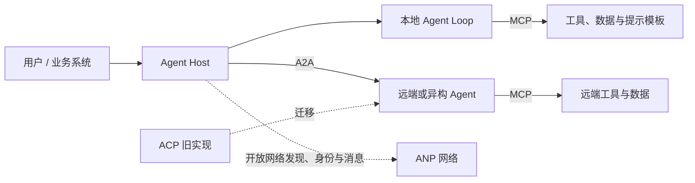
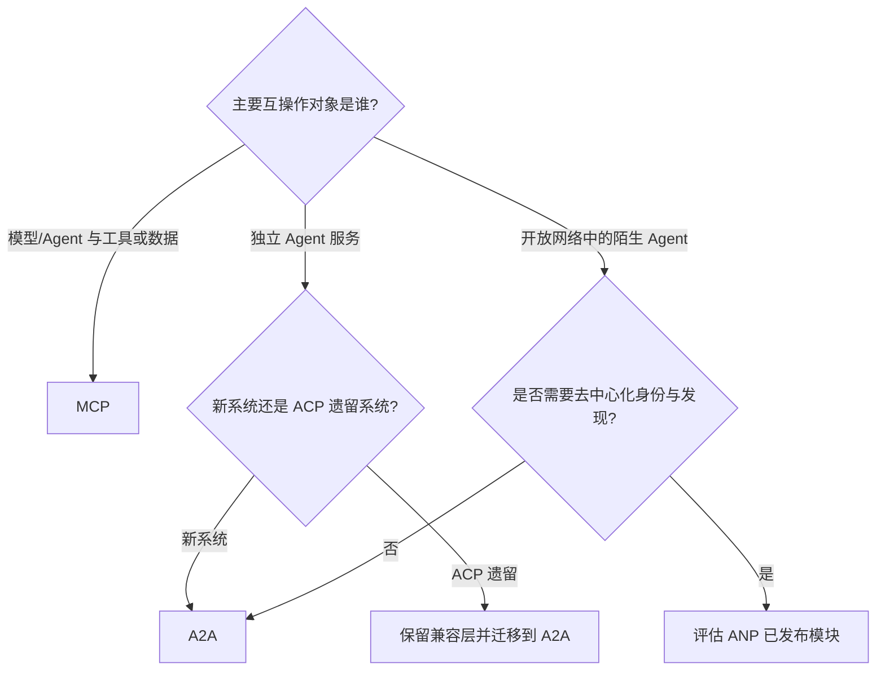

# Agent 协议层总览

协议解决的是不同组件能否用共同语言发现能力、交换消息和完成任务。它不是 Prompt、Context、Loop、Graph 或 Harness 中的某一层，也不是 ReAct、Supervisor 一类控制流模式；更准确地说，它是横跨系统边界的互操作契约。

## 四个缩写并不处在同一位置

| 协议 | 连接谁 | 核心抽象 | 当前定位 | 适合解决 |
| --- | --- | --- | --- | --- |
| [MCP](./mcp.md) | AI 应用与上下文/能力提供者 | tools、resources、prompts | 活跃规范 | 让 Host 统一发现并调用工具、读取资源 |
| [A2A](./a2a.md) | 独立、可能不透明的 Agent | Agent Card、Message、Task、Artifact | 活跃规范，最新发布版 1.0.0 | 跨框架、跨组织委派任务并跟踪长任务 |
| [ACP](./acp.md) | Agent 与 Agent | agent manifest、run、message、await | Agent Communication Protocol 已归档并并入 A2A | 维护旧系统、理解迁移来源 |
| [ANP](./anp.md) | 开放互联网中的 Agent | 去中心化身份、描述、发现、消息及应用协议 | 活跃但成熟度不均的协议族 | 无中心目录的跨域身份、发现和通信 |

这里的 ACP 指 BeeAI 发起的 **Agent Communication Protocol**。另有同名的 **Agent Client Protocol**，用于代码编辑器与编码 Agent 进程通信，不应混为一谈。

## 最容易混淆的边界

### MCP 与 A2A 是互补关系

MCP 更像“Agent 如何使用能力”：Host 连接多个专注的 MCP Server，调用工具、读取资源。A2A 更像“一个 Agent 如何把目标交给另一个 Agent”：对方保留自己的模型、记忆、工具和内部计划，只通过任务接口暴露能力与进度。

同一个系统通常会同时使用两者：旅行规划 Agent 通过 A2A 委派给订票 Agent；订票 Agent 再通过 MCP 调用航班搜索和支付工具。

### A2A 与 ANP 的重叠不等于替代

A2A 已定义 Agent Card、任务生命周期、多种协议绑定以及企业级鉴权，适合已知服务端点之间的任务协作。ANP 的目标更广，进一步研究开放网络中的去中心化身份、跨域发现、端到端消息和应用协议协商。若只需要企业内两个 Agent 协作，优先评估 A2A；只有确实需要开放网络身份与发现时，再引入 ANP 相应模块。

### 协议不替你完成编排

协议规定“怎样交换”，设计模式规定“谁在何时做决定”。A2A 不等于 Supervisor，MCP 也不等于 ReAct：

- Supervisor 可以用 A2A 调用远端 worker，也可以直接调用进程内函数；
- ReAct 可以经 MCP 调用工具，也可以使用厂商自己的 function calling；
- Graph 决定路由、并行、重试与汇合，协议只承载跨边界消息；
- Harness 仍需负责凭据、授权、审批、隔离、审计、预算和恢复。

## 按问题选协议

不要为了“协议齐全”同时部署四套。先确认互操作边界、信任域、长任务需求和发现方式，再选最小组合。具体的威胁模型、组合架构和验收清单见[选型、组合与安全](./security-and-selection.md)。

## 版本快照

本文按 2026-09-15 可访问的官方资料核对：MCP 规范版本为 `2026-07-28`；A2A 最新发布版为 `1.0.0`；Agent Communication Protocol 仓库已于 2025-08 归档并转向 A2A；ANP 规范站包含 1.1 已发布模块，也包含仍在演进的提案。协议变化较快，落地前应固定规范与 SDK 版本。

## 官方入口

- [MCP 规范](https://modelcontextprotocol.io/specification/2026-07-28/)
- [A2A 1.0 规范](https://a2a-protocol.org/latest/specification/)
- [ACP 官方说明](https://agentcommunicationprotocol.dev/introduction/welcome)
- [ANP 技术规范](https://agentnetworkprotocol.com/en/specs/)
