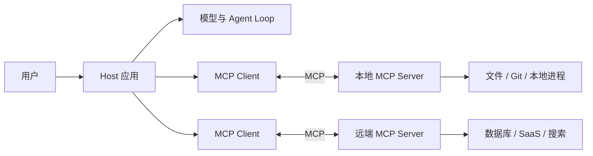
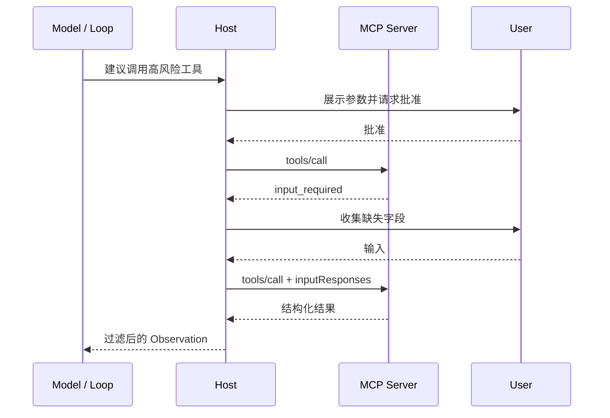

# MCP：模型与工具、数据的标准连接

MCP（Model Context Protocol）让 AI 应用用统一协议连接工具、数据和提示模板。它解决的是“怎样接入能力”，不负责决定 Agent 的业务流程，也不会自动让工具可信。

## 它在系统中的位置



Host 是安全与协调边界，负责用户授权、模型集成和上下文汇总。一个 Host 可以管理多个 Client，但每个 Client 只连接一个 Server。Server 专注暴露某一组能力，不应默认看到其他 Server 的数据或整段对话。

因此 MCP 横跨多个设计面：工具和资源进入 L2 Context，工具调用进入 L3 Loop，连接、授权、审批和审计由 L5 Harness 承担。把它单独放在“协议与互操作”下，比硬塞进某一层更准确。

## 2026-07-28 的协议模型

当前规范基于 JSON-RPC 2.0，但相较旧版有一个重要变化：核心请求是**无状态、自描述**的。请求携带协议版本、客户端信息和能力；Server 可通过 `server/discover` 返回支持的版本、身份与能力。

```text
Client                         Server
  |---- server/discover -------->|
  |<--- versions/capabilities ---|
  |---- tools/list -------------->|
  |<--- tool catalog + cache -----|
  |---- tools/call -------------->|
  |<--- result / input_required --|
```

无状态不等于业务不能有状态。需要跨调用状态时，Server 应签发显式 handle，并把它作为普通工具参数传回，而不是依赖隐式连接会话。

### 三类 Server Primitive

| Primitive | 常用方法 | 谁决定使用 | 适合承载 |
| --- | --- | --- | --- |
| Tools | `tools/list`、`tools/call` | 通常由模型建议，Host 审批并执行 | 搜索、写文件、调用 API、有副作用动作 |
| Resources | `resources/list`、`resources/read` | 应用或用户选择 | 文件、数据库记录、日志、只读上下文 |
| Prompts | `prompts/list`、`prompts/get` | 用户或应用选择 | 可复用消息模板与工作流入口 |

三者不能只按“是否调用函数”区分。Tool 表示可执行动作，Resource 表示可寻址内容，Prompt 表示由 Server 提供的交互模板。Server 只应声明真实实现的能力，Client 也只能使用双方已协商的能力。

## 一次工具调用长什么样

下面是 Streamable HTTP 请求的规范风格示例。`MCP-Protocol-Version`、`Mcp-Method` 和 `Mcp-Name` 让网关可以在不解析完整正文的情况下做路由和授权；`_meta` 让每个请求自描述。

```http
POST /mcp HTTP/1.1
Content-Type: application/json
MCP-Protocol-Version: 2026-07-28
Mcp-Method: tools/call
Mcp-Name: get_weather

{
  "jsonrpc": "2.0",
  "id": 1,
  "method": "tools/call",
  "params": {
    "name": "get_weather",
    "arguments": { "location": "Shanghai" },
    "_meta": {
      "io.modelcontextprotocol/protocolVersion": "2026-07-28",
      "io.modelcontextprotocol/clientInfo": {
        "name": "windwiki-example",
        "version": "1.0.0"
      },
      "io.modelcontextprotocol/clientCapabilities": {}
    }
  }
}
```

生产 Client 不应手拼协议。优先使用官方 SDK，让 SDK 处理 Schema、版本、错误和传输细节；原始 JSON 适合调试协议边界。

## 传输与部署

MCP 的数据层与传输层分离：

- **stdio**：Host 启动本地子进程，通过标准输入输出交换 JSON-RPC。适合 IDE、桌面应用和本地工具；凭据通常来自进程环境，不套用 HTTP 授权流程。
- **Streamable HTTP**：Client 向统一 MCP 端点发 POST，可在响应流中取得进度或多轮结果。适合远端服务、网关和水平扩展。
- **`subscriptions/listen`**：Client 按需打开长连接，订阅工具列表、Prompt 列表、Resource 列表或特定 Resource 的变化。

2026-07-28 移除了协议级 Session ID；列表响应带 `ttlMs` 与 `cacheScope`，Client 可以缓存目录，同时结合变更通知失效缓存。迁移旧实现时，不能继续假设同一 HTTP 连接或 `Mcp-Session-Id` 保存状态。

## 长任务与多轮输入

MCP Tasks 是扩展，不是所有 Server 都支持。Client 需要显式声明 `io.modelcontextprotocol/tasks`，Server 才能把一次调用提升为可查询、更新或取消的任务。

另一种常见情况是工具执行中缺少输入。Server 可以返回 `input_required`，包含 elicitation 请求和不透明 `requestState`；Client 收集用户输入后再次调用原工具。这个机制适合确认、补充表单和授权升级，但 Host 仍需决定哪些字段可以展示或回传。



## 工程安全边界

MCP 能标准化调用，却不能证明 Server、Tool 描述或结果可信。至少要做到：

1. Server 按来源分信任级别，远端目录和 Tool annotation 都当作不可信声明。
2. Host 在调用前展示真实工具名、目标资源、参数和副作用，不让模型替用户静默授权。
3. OAuth token 绑定目标 Resource Server、issuer、audience 和最小 scope，不做 token passthrough。
4. Tool 参数和返回值都按 Schema、大小、媒体类型和超时限制验证。
5. 本地 Server 使用最小文件权限和干净环境；远端 Server 通过出站 allowlist、沙箱和审计限制影响面。
6. 工具结果作为不可信数据进入 Context，避免 Prompt Injection 把结果文本提升为系统指令。

## MCP 不负责什么

- 不负责 Agent 何时调用工具、调用几次或何时停止；这是 Loop/Harness 的职责。
- 不负责多个 Agent 的任务生命周期；跨 Agent 委派通常使用 [A2A](./a2a.md)。
- 不负责开放网络里的去中心化身份和发现；这是 [ANP](./anp.md) 关注的问题。
- 不保证工具幂等、事务一致或可回滚；这些仍是业务 API 契约。

## 参考资料

- [MCP 2026-07-28 规范](https://modelcontextprotocol.io/specification/2026-07-28/)
- [MCP Architecture](https://modelcontextprotocol.io/specification/2026-07-28/architecture)
- [MCP 2026-07-28 变更清单](https://modelcontextprotocol.io/specification/2026-07-28/changelog)
- [Streamable HTTP](https://modelcontextprotocol.io/specification/2026-07-28/basic/transports/streamable-http)
- [Security Best Practices](https://modelcontextprotocol.io/specification/2026-07-28/basic/security_best_practices)
- [MCP 官方 SDK 列表](https://modelcontextprotocol.io/docs/sdk)
