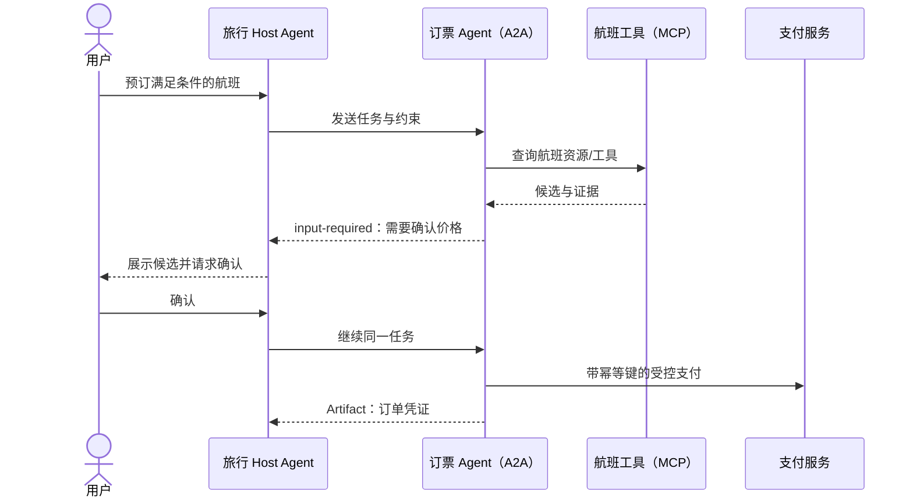

# 协议选型、组合与安全

协议兼容只说明消息能够互通，不说明对方可信、工具安全或任务一定正确。生产选型应先画清信任边界，再决定协议。

## 一张选型表

| 需求 | 首选 | 原因 | 不要误用 |
| --- | --- | --- | --- |
| IDE/桌面 Agent 接本地文件、数据库或 SaaS 工具 | MCP | 面向 Host—Server 的能力发现和调用 | 不要让 MCP Server 获得整段对话和全部凭据 |
| 企业内跨团队 Agent 委派长任务 | A2A | 有 Agent Card、Task、流式更新、推送和多种绑定 | 不要把 Agent Card 当作信任证明 |
| 维护已有 BeeAI ACP 服务 | ACP 兼容层 + A2A 迁移 | ACP 已并入 A2A，新系统不宜继续扩展旧协议 | 不要新增长期绑定 ACP 的业务接口 |
| 开放网络中以域名/去中心化身份发现 Agent | ANP 已发布模块 | 覆盖身份、描述、发现与消息 | 不要默认所有 ANP 提案都已稳定或互操作成熟 |
| 进程内固定工作流 | 普通函数/API/消息队列 | 边界明确，复杂协议可能没有收益 | 不要为了“Agent 化”增加网络协议 |

## 常见组合架构



这条链路中，每层责任不同：A2A 保存跨 Agent 任务语义，MCP 暴露工具能力，业务服务保证支付幂等，Harness 完成审批和审计。任何单个协议都无法替代其他三项。

## 统一威胁模型

### 发现信息不是信任信息

Agent Card、MCP `server/discover` 响应和 ANP Agent Description 都是对方声明。客户端必须独立验证：

- HTTPS/TLS 端点与证书；
- 签名、DID 解析结果或预置组织身份；
- 允许的 issuer、audience、scope 与租户；
- 描述中 URL 是否落入允许域名，防止 SSRF；
- 协议版本、能力和输入输出媒体类型是否在允许集合。

### 内容与指令必须分区

远端工具结果、Agent 消息、网页和附件都是不可信数据。不要把其中的“忽略规则”“调用支付工具”等文本提升为系统指令。解析后保留来源、媒体类型和完整性信息；结构化字段用 Schema 验证，文本进入模型前标记信任级别。

### 授权要绑定到具体动作

身份认证回答“是谁”，授权回答“能做什么”。对每次工具调用或任务操作检查用户、租户、资源、动作和条件，不要因为一个 Agent 已登录就给它所有下游权限。OAuth token 应限制 audience 与 scope，不转发原始用户 token 给不相关的下游。

### 长任务需要可恢复语义

A2A Task、ACP Run 或异步工作流都可能发生重复投递、断线重连和超时。写操作至少需要：

- 客户端生成或业务生成的幂等键；
- 明确的终态与取消语义；
- 重试上限、退避和 deadline；
- 状态持久化与按 task/run ID 查询；
- Artifact 哈希、来源和访问控制；
- 人工审批后再次验证价格、库存等易变前置条件。

## 网关级最小校验示例

下面的 Python 标准库示例对发现文档中的 HTTPS URL 做基础限制。它只是第一道输入校验，不替代 DNS 重绑定防护、出站代理策略和网络隔离。

```python
from ipaddress import ip_address
from socket import getaddrinfo
from urllib.parse import urlparse


def validate_public_https_url(raw_url: str, allowed_hosts: set[str]) -> str:
    parsed = urlparse(raw_url)
    if parsed.scheme != "https" or not parsed.hostname:
        raise ValueError("only HTTPS URLs are allowed")
    if parsed.username or parsed.password:
        raise ValueError("userinfo in URL is forbidden")
    if parsed.hostname not in allowed_hosts:
        raise ValueError("host is not allowlisted")

    # 生产环境还应在实际连接阶段固定已验证地址，防止 DNS rebinding。
    for info in getaddrinfo(parsed.hostname, parsed.port or 443):
        address = ip_address(info[4][0])
        if not address.is_global:
            raise ValueError(f"non-public address is forbidden: {address}")
    return raw_url


print(validate_public_https_url(
    "https://agent.example.com/.well-known/agent-card.json",
    {"agent.example.com"},
))
```

## 上线验收清单

1. 固定规范版本、SDK 版本和支持的协议绑定，拒绝静默降级。
2. 对发现文档、消息、附件、工具参数和结果分别做大小、类型与 Schema 限制。
3. 验证身份、audience、scope、租户和每个资源动作的授权。
4. 对 URL、Webhook、文件引用和重定向做 SSRF 防护；出站网络采用 allowlist。
5. 写操作采用幂等键；取消、超时、重试和部分成功都有确定语义。
6. 敏感副作用必须预览并审批；审批后重新校验易变条件。
7. Trace 能关联用户、Host、Agent、任务、工具调用和 Artifact，但日志不泄露 token 与敏感正文。
8. 用恶意 Agent Card、提示注入、超大附件、重复消息、断线重连和版本不兼容做集成测试。

## 参考资料

- [MCP：Security Best Practices](https://modelcontextprotocol.io/specification/2026-07-28/basic/security_best_practices)
- [A2A：Security Considerations](https://a2a-protocol.org/latest/specification/#13-security-considerations)
- [A2A：Authentication and Authorization](https://a2a-protocol.org/latest/specification/#7-authentication-and-authorization)
- [ANP：Technical Specifications](https://agentnetworkprotocol.com/en/specs/)
