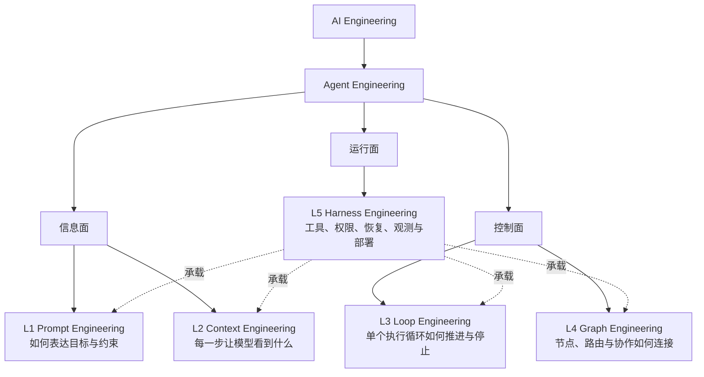
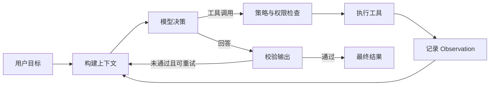

# AI 工程概览

AI 工程关注的不是“让模型偶尔答对”，而是把模型能力变成可验证、可控制、可演进的软件系统。

## 先分清三个术语

| 术语 | 工程对象 | 典型产物 |
| --- | --- | --- |
| AI Engineering | 使用基础模型构建、评估和运行 AI 应用 | RAG、分类器、生成式应用、Agent、评测与部署平台 |
| Agent Engineering | 构建能围绕目标选择工具、观察环境并持续行动的 Agent | Agent loop、工具协议、状态、记忆、工作流、护栏 |
| Agentic Engineering | 使用 Agent 辅助软件工程活动 | 代码生成、测试、审查、迁移和自动化交付流程 |

“AI 工程 → Agent 工程”是范围关系；“Agentic Engineering”描述的是用 Agent 工作，不等于 Agent 内部架构。

## 五个设计面

下面的 L1～L5 是一张实用的排障与学习地图，不是标准组织发布的正式分层协议。实际系统里这些边界会交叠，尤其是 Harness 往往包住其他各层，而不是最后串行执行的一步。

| 设计面 | 核心问题 | 主要工件 | 常见失败 |
| --- | --- | --- | --- |
| [Prompt](./prompt-engineering.md) | 模型应完成什么、遵守什么、输出什么 | 指令、示例、工具描述、输出 Schema | 目标含糊、规则冲突、提示注入 |
| [Context](./context-engineering.md) | 当前这一步需要哪些信息 | 会话、检索结果、记忆、状态、工具结果 | 上下文污染、缺证据、超预算 |
| [Loop](./loop-engineering.md) | 下一步做什么，何时重试或停止 | observe-decide-act 循环、预算、终止条件 | 死循环、重复副作用、错误累积 |
| [Graph](./graph-engineering.md) | 哪些节点以何种条件连接 | 状态图、边、路由器、并行与汇合 | 路由错误、状态竞争、恢复困难 |
| [Harness](./harness-engineering.md) | Agent 在什么边界内安全运行 | 工具注册、权限、沙箱、检查点、追踪 | 越权、不可审计、失败不可恢复 |

## 从一次调用到生产系统

一次可靠运行至少要回答六个问题：

1. 成功是什么，如何自动判断？
2. 模型当前能看到哪些可信信息？
3. 可以调用哪些工具，哪些操作有副作用？
4. 最大轮数、时间和费用是多少？
5. 失败后重试、回滚、转人工还是终止？
6. 是否留下可定位问题的 trace、状态和评测记录？

## 模式落在哪一层

| 模式 | 主要落点 | 反馈来源 | 适合的问题 |
| --- | --- | --- | --- |
| Reflection | Loop | 自评或独立评审器 | 允许多轮改稿、可定义质量标准 |
| ReAct | Loop | 工具与环境 Observation | 步骤无法预先确定的探索任务 |
| Plan-and-Execute | Loop，可扩展到 Graph | 显式计划与逐步执行结果 | 长任务、依赖清楚的多步骤任务 |
| Supervisor | Graph | 中心调度器与 worker 结果 | 多专业协作且需要统一控制 |
| Swarm / Handoff | Graph | 当前 Agent 将控制权转交下一个 Agent | 对话式分工、局部自治 |
| Debate | Graph | 多个候选、批评与裁决 | 高价值决策、需要观点多样性 |

模式可以组合：Supervisor 的 worker 内部可以运行 ReAct；Plan-and-Execute 的每一步可以调用专门 Agent；最终结果可以再进入 Reflection。详见[单 Agent 经典范式](./single-agent-patterns.md)、[Router 与 Supervisor](./routing-and-supervisor.md)以及[Swarm、Debate 与多 Agent 协作](./swarm-debate-and-collaboration.md)。

## 最小架构原则

- 能用一次模型调用解决，就不要增加循环。
- 能用确定性代码表达的流程，就不要把每个路由都交给模型。
- 单 Agent 工具过多、提示词开始充满条件分支时，再拆成多 Agent。
- 先定义评测、停止条件和权限，再提高自主性。
- 模型输出是“不可信提议”；工具执行、状态变更和权限判断必须由确定性代码接管。

## 学习顺序

1. 先掌握 Prompt 与结构化输出，建立可测试的单次调用。
2. 再学习 Context，解决检索、记忆和长对话的信息选择问题。
3. 用 Loop 理解工具调用、反馈、预算和终止。
4. 用 Graph 表达分支、循环、人工介入与多 Agent 协作。
5. 最后用 Harness 补齐权限、沙箱、恢复、追踪、评测和部署。

## 参考资料

- [Anthropic：Building effective agents](https://www.anthropic.com/engineering/building-effective-agents)
- [Anthropic：Effective context engineering for AI agents](https://www.anthropic.com/engineering/effective-context-engineering-for-ai-agents)
- [OpenAI：A practical guide to building agents](https://openai.com/business/guides-and-resources/a-practical-guide-to-building-ai-agents/)
- [LangGraph 文档](https://docs.langchain.com/oss/python/langgraph/overview)
- [Microsoft Agent Framework](https://github.com/microsoft/agent-framework)
