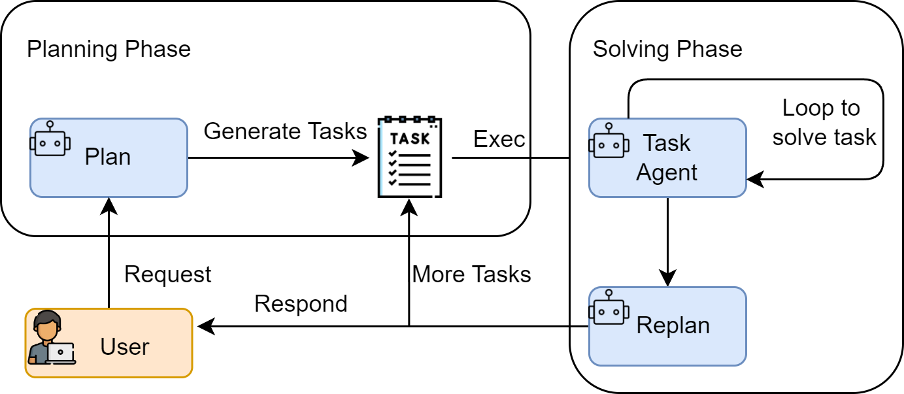
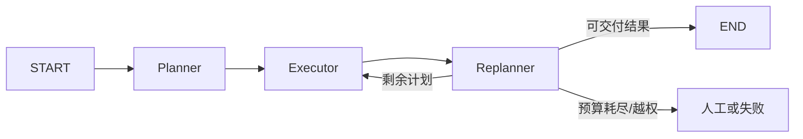
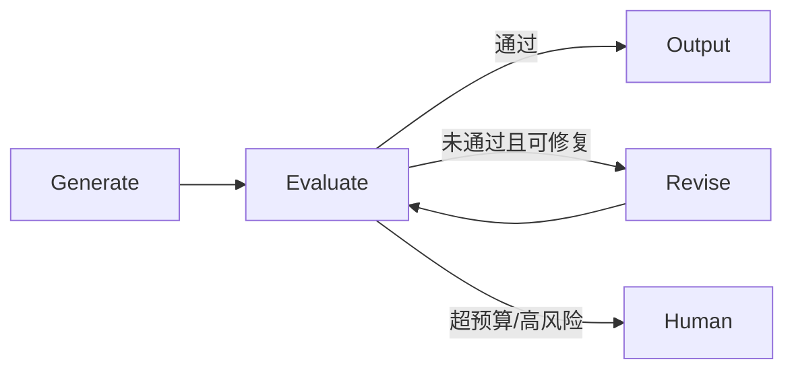
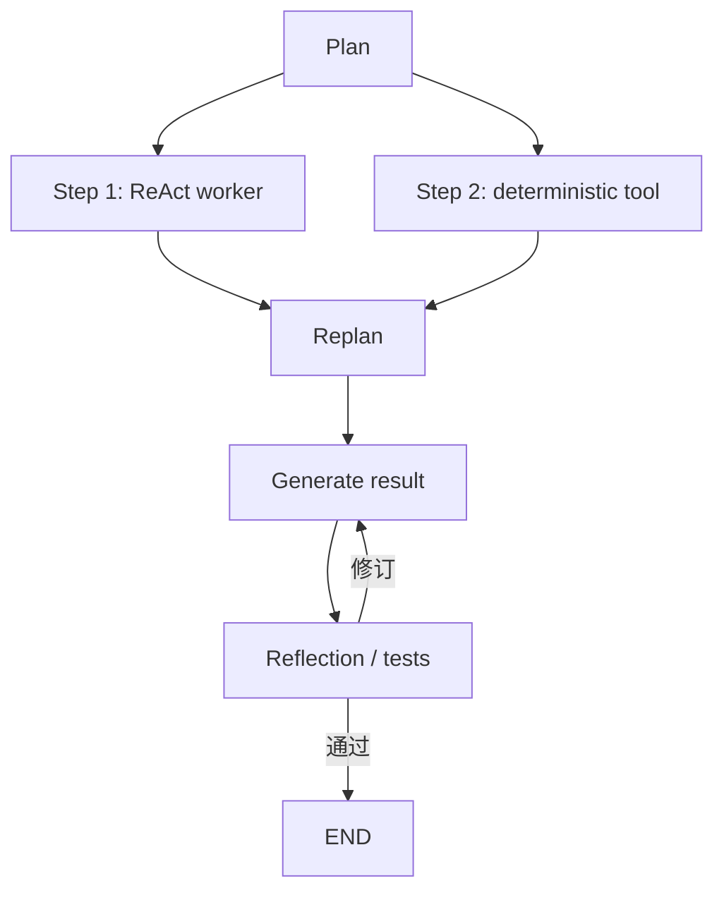

# 单 Agent 经典范式

ReAct、Planning 与 Reflection 解决的是不同控制问题：下一步如何利用环境反馈、长任务如何保持全局结构、结果如何用反馈迭代改进。它们都是 Agent 范式或设计模式，可以嵌套，不是互斥产品。

## 范式总览

| 范式 | 核心循环 | 主要反馈 | 优势 | 主要代价 |
| --- | --- | --- | --- | --- |
| ReAct | Reason/Decision → Action → Observation | 环境与工具 | 灵活、能动态纠错 | 路径漂移、工具循环、上下文增长 |
| Plan-and-Solve | Plan → Solve | 初始计划 | 结构清楚、降低漏步 | 环境变化时计划容易失效 |
| Plan-and-Execute | Plan → Execute → Replan | 步骤结果与计划 | 适合长任务、状态可审计 | 更多模型调用与状态管理 |
| Reflection | Generate → Evaluate → Revise | 评审反馈 | 提升可验证产物质量 | 延迟和成本增加，自评可能共错 |
| Reflexion | Act → Evaluate → Reflect → Memory → Retry | 环境反馈与情景记忆 | 从失败轨迹形成语言经验 | 记忆污染、尝试成本更高 |


图：Hello-Agents 对 ReAct、Plan-and-Solve、Reflection 的教学选型总结。图片来源与许可见文末。

## ReAct：推理与行动交错

ReAct 原论文把语言推理轨迹与任务动作交错：行动获得外部 Observation，新的观察再改变下一步行动。

$$
(r_t,a_t)=\pi(q,a_1,o_1,\ldots,a_{t-1},o_{t-1})
$$

$$
o_t=T(a_t)
$$

工程上不需要向用户展示模型的私有推理全文。需要持久化的是目标、工具调用、参数摘要、Observation、状态变化、证据和停止原因。


图：ReAct 中模型、工具与环境形成的“决策—行动—观察”循环。

### 适用场景

- 下一步依赖搜索、API 或环境返回，路径不能完全预先确定；
- 故障排查、交互式研究、浏览器操作；
- 少量工具和中短执行链；
- 允许根据新证据修正计划。

### 失败模式

- 工具描述相似，选错工具；
- 自由文本解析失败；
- 工具空结果被解释成“不存在”；
- 重复同一调用或在工具间来回切换；
- 不可信网页内容劫持后续指令；
- 模型认为“已完成”，实际未通过业务验收。

### 工程实现

现代实现优先使用 provider-native function calling 或类型化工具，而不是正则解析 `Action: Search[...]`。一个可运行的 Agents SDK 示例见[循环工程](./loop-engineering.md#使用-agents-sdk-运行有界工具循环)。无论框架是否自动运行 ReAct loop，都要额外设置：

- 最大轮数、时间和费用；
- tool allowlist 与参数 Schema；
- Observation 截断、分页和来源标记；
- 重复调用检测；
- 高影响动作审批；
- 最终结果的独立验收。

## Plan-and-Solve 与 Plan-and-Execute

这两个名字不应混用。

### Plan-and-Solve

原始 Plan-and-Solve 是一种 Zero-shot Chain-of-Thought 提示策略：先列出解题计划，再按计划逐步求解，重点是减少漏步、计算错误和语义理解错误。它不要求工具、状态存储或独立 executor。

### Plan-and-Execute

工程型 Plan-and-Execute 通常包含 planner、executor、显式 state 和可选 replanner。每个步骤可以调用工具或子 Agent，执行后再决定保留、修改或终止计划。



图：Planning、任务执行与重规划。工程实现应把 plan、past steps 和最终 response 写入类型化状态。



### 可运行的 Planner + Executor

下面示例基于 Context7 核验的 OpenAI Agents SDK 0.7.x。运行需要 Python 3.10+、`OPENAI_API_KEY` 和账户可访问的模型。

```bash
pip install "openai-agents>=0.7,<0.8" "pydantic>=2,<3"
```

```python
from agents import Agent, Runner
from pydantic import BaseModel, Field


class Plan(BaseModel):
    steps: list[str] = Field(min_length=1, max_length=5)


planner = Agent(
    name="planner",
    instructions=(
        "把目标拆成最多 5 个可独立验收的步骤。不要执行；"
        "每一步写清输入、动作和完成条件。"
    ),
    output_type=Plan,
)

executor = Agent(
    name="executor",
    instructions=(
        "只执行当前步骤。使用给定的先前结果，不重新规划；"
        "若缺少关键数据，明确返回 BLOCKED 和缺少内容。"
    ),
)


def plan_and_execute(objective: str) -> list[str]:
    plan = Runner.run_sync(planner, objective, max_turns=3).final_output
    results: list[str] = []

    for index, step in enumerate(plan.steps, start=1):
        prompt = (
            f"总目标：{objective}\n"
            f"当前步骤 {index}/{len(plan.steps)}：{step}\n"
            f"先前结果：{results or '无'}"
        )
        result = Runner.run_sync(executor, prompt, max_turns=4).final_output
        results.append(str(result))
        if str(result).startswith("BLOCKED"):
            break
    return results


for item in plan_and_execute("为一个 Python CLI 设计发布前检查清单"):
    print(item)
```

这是顺序执行版本。真实长任务应把 plan、`past_steps`、证据 ID、预算和 stop reason 持久化，并在每步后由规则或 replanner 决定下一步。状态图实现见[图工程](./graph-engineering.md#计划执行图)。

### 什么时候用 Planning

适合：步骤依赖明确、需要审计进度、任务很长、可以并行拆分。不要用于单步问答；初始信息很少且环境变化快时，纯计划容易制造“看起来完整但很快失效”的路线，应加入 ReAct 或 replanning。

## Reflection 与 Reflexion

### Reflection：生成—评审—修订

Reflection 是通用模式。Evaluator 可以是同一模型的不同 Prompt、独立模型、规则、测试或人工。外部可验证反馈通常比“请自我反思”更可靠。


图：Actor、Evaluator、Self-reflection 与记忆构成的反馈闭环。



Evaluator 最好返回结构化字段：

```python
from pydantic import BaseModel, Field


class Review(BaseModel):
    passed: bool
    issues: list[str] = Field(max_length=5)
    revision_instructions: list[str] = Field(max_length=5)
```

完整运行示例：

```python
from agents import Agent, Runner


writer = Agent(
    name="writer",
    instructions="根据要求写一段不超过 150 字、包含可验证验收标准的技术说明。",
)
reviewer = Agent(
    name="reviewer",
    instructions=(
        "按准确性、完整性、可验证性审查草稿。"
        "只有不存在事实错误且至少有一个明确验收标准时 passed=true。"
    ),
    output_type=Review,
)


def write_with_reflection(task: str, max_revisions: int = 2) -> str:
    draft = str(Runner.run_sync(writer, task, max_turns=3).final_output)
    for _ in range(max_revisions + 1):
        review = Runner.run_sync(
            reviewer,
            f"任务：{task}\n草稿：{draft}",
            max_turns=3,
        ).final_output
        if review.passed:
            return draft
        draft = str(Runner.run_sync(
            writer,
            f"任务：{task}\n原稿：{draft}\n修改要求：{review.revision_instructions}",
            max_turns=3,
        ).final_output)
    raise RuntimeError("quality_gate_failed")


print(write_with_reflection("解释为什么 Agent 工具写操作需要幂等键"))
```

代码有明确轮数上限，但 reviewer 仍可能与 writer 产生共同偏差。事实任务应加入检索证据，代码任务应运行测试，结构化数据应使用 Schema 和业务规则。

### Reflexion：带情景记忆的特定框架

Reflexion 不更新模型权重。Actor 执行任务，Evaluator 产生外部反馈，Self-Reflection 把失败原因写成语言经验，下一次尝试从 episodic memory 读取。它可以叠加在 ReAct 之上，而不是替代 ReAct。

| Reflection | Reflexion |
| --- | --- |
| 通用生成—评审—修订 | Shinn 等人的特定框架 |
| 不要求跨尝试记忆 | 使用情景记忆保存反思 |
| 可只优化一个产物 | 常对完整轨迹重新尝试 |
| 反馈可来自自评 | 强调环境反馈、评估与语言反思 |

写入 Reflexion memory 前要验证：失败是否真实、归因是否正确、经验是否只适用于当前环境、何时过期。否则错误反思会持续污染后续任务。

## 组合方式



不要一开始把所有模式叠满。先用评测定位问题：路径不稳定才加 Planning，缺外部反馈才加 ReAct，产物可验证且质量不足才加 Reflection。

## 选型速查

| 任务特征 | 首选 | 原因 |
| --- | --- | --- |
| 1～2 步、无需工具 | 单次结构化调用 | 最低成本、最易测试 |
| 路径未知、依赖实时反馈 | ReAct | 每步根据 Observation 调整 |
| 步骤可拆且依赖强 | Plan-and-Execute | 显式进度和可重规划 |
| 有测试或明确 rubric | Reflection | 反馈可以驱动修订 |
| 失败经验要影响下一次完整尝试 | Reflexion | 情景记忆保存反思 |

## 图片来源与许可

本页 4 张图片来自 Datawhale [Hello-Agents 第四章：智能体经典范式构建](https://github.com/datawhalechina/hello-agents/blob/main/docs/chapter4/%E7%AC%AC%E5%9B%9B%E7%AB%A0%20%E6%99%BA%E8%83%BD%E4%BD%93%E7%BB%8F%E5%85%B8%E8%8C%83%E5%BC%8F%E6%9E%84%E5%BB%BA.md)，原项目内容采用 [CC BY-NC-SA 4.0](https://creativecommons.org/licenses/by-nc-sa/4.0/)。本章没有 GIF，因此没有虚构或额外生成动图。

## 参考资料

- [ReAct 论文](https://arxiv.org/abs/2210.03629)
- [Plan-and-Solve Prompting](https://arxiv.org/abs/2305.04091)
- [Reflexion](https://arxiv.org/abs/2303.11366)
- [Self-Refine](https://arxiv.org/abs/2303.17651)
- [Hello-Agents 第四章](https://github.com/datawhalechina/hello-agents/blob/main/docs/chapter4/%E7%AC%AC%E5%9B%9B%E7%AB%A0%20%E6%99%BA%E8%83%BD%E4%BD%93%E7%BB%8F%E5%85%B8%E8%8C%83%E5%BC%8F%E6%9E%84%E5%BB%BA.md)

