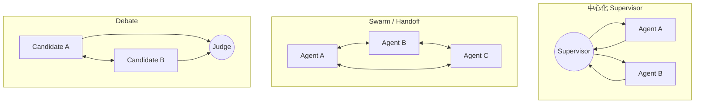
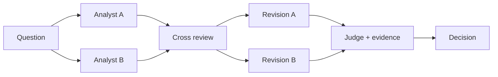

# Swarm、Debate 与多 Agent 协作

多 Agent 的价值主要来自专业分工、上下文隔离和并行，而不是“Agent 数量越多越聪明”。协调成本、token、延迟和共同偏差会随拓扑一起增长。

## 常见拓扑



## Swarm / Handoff

Swarm 没有永久的中心调度者。当前 active agent 可以通过 handoff 把控制权交给另一个 Agent，后者直接继续处理用户会话。

适合：

- 客服从分流员交给退款专家，专家直接继续对话；
- 任务责任人在多个专家之间跨轮切换；
- 专家需要看到与自己相关的会话状态并保持接管关系。

不适合：强中心审计、严格审批链、需要同时比较多个专家结果、责任必须始终唯一可追踪的高风险流程。

### LangGraph Swarm 示例

Context7 对当前官方仓库核验的 API 使用 `create_handoff_tool` 和 `create_swarm`，并用 checkpointer 保存跨轮 active agent。

```bash
pip install -U langgraph-swarm langchain langgraph langchain-openai
```

```python
import os

from langchain.agents import create_agent
from langchain_openai import ChatOpenAI
from langgraph.checkpoint.memory import InMemorySaver
from langgraph_swarm import create_handoff_tool, create_swarm


model = ChatOpenAI(model=os.environ["OPENAI_MODEL"])

billing = create_agent(
    model,
    tools=[create_handoff_tool(agent_name="Technical")],
    system_prompt="你是 Billing，只处理扣款与退款；技术故障转交 Technical。",
    name="Billing",
)

technical = create_agent(
    model,
    tools=[create_handoff_tool(agent_name="Billing")],
    system_prompt="你是 Technical，只处理系统故障；扣款与退款转交 Billing。",
    name="Technical",
)

app = create_swarm(
    [billing, technical],
    default_active_agent="Billing",
).compile(checkpointer=InMemorySaver())

config = {"configurable": {"thread_id": "support-1001"}}
result = app.invoke(
    {"messages": [{"role": "user", "content": "退款页面一直报 502。"}]},
    config,
)
print(result["messages"][-1].content)
```

示例需要 `OPENAI_API_KEY` 与 `OPENAI_MODEL`。生产中使用持久化 checkpointer，并对 handoff 的目标、原因、摘要和权限做结构化记录。

## Handoff 契约

一次交接至少携带：

```json
{
  "target": "Technical",
  "reason": "退款页面返回 502，账务资格尚未判断",
  "completed": ["已确认订单号 O-9"],
  "evidence_ids": ["ticket:T-3", "log:L-8"],
  "open_questions": ["502 是否影响全部用户"],
  "allowed_scopes": ["logs:read"],
  "return_to": "Billing"
}
```

只传“请你接着处理”会让下一个 Agent 重复搜索、遗漏约束或获得错误权限。

## Debate：候选、互评与裁决

多智能体 Debate 常见流程：多个 Agent 独立生成候选 → 读取其他候选和证据 → 批评/修订 → judge 或确定性规则裁决。它适合高价值、可核验证据、确实需要多角度的任务。



### 可运行的双审查 + Judge

下面示例使用 OpenAI Agents SDK。两名 reviewer 的检查维度不同，避免“同模型、同 Prompt、同证据”制造伪多样性。

```python
from typing import Literal

from agents import Agent, Runner
from pydantic import BaseModel, Field


class Review(BaseModel):
    verdict: Literal["accept", "revise", "reject"]
    issues: list[str] = Field(max_length=5)
    evidence_needed: list[str] = Field(max_length=5)


class Decision(BaseModel):
    verdict: Literal["accept", "revise", "reject"]
    reasons: list[str]


fact_reviewer = Agent(
    name="fact_reviewer",
    instructions="只检查事实是否有输入证据支持；没有证据就要求 revise。",
    output_type=Review,
)
risk_reviewer = Agent(
    name="risk_reviewer",
    instructions="只检查权限、副作用、隐私和不可逆风险。",
    output_type=Review,
)
judge = Agent(
    name="judge",
    instructions=(
        "根据原方案和两份结构化审查裁决。不能以多数票覆盖明确安全风险；"
        "任一 reviewer 指出高影响未审批动作时至少 revise。"
    ),
    output_type=Decision,
)


proposal = "Agent 找到重复订单后直接执行退款，并把完整日志发给用户。"
facts = Runner.run_sync(fact_reviewer, proposal, max_turns=3).final_output
risks = Runner.run_sync(risk_reviewer, proposal, max_turns=3).final_output
decision = Runner.run_sync(
    judge,
    f"方案：{proposal}\n事实审查：{facts.model_dump()}\n风险审查：{risks.model_dump()}",
    max_turns=3,
).final_output
print(decision.model_dump_json(indent=2))
```

### Debate 何时失效

- 辩手看到同一错误来源，产生共同幻觉；
- 角色只有名字不同，Prompt、模型和证据完全相同；
- Judge 只数票，不核验证据；
- 无限对话导致立场收敛但事实没有增加；
- 少数正确意见被“多数共识”覆盖；
- 高风险决策交给模型 Judge，没有确定性政策与人工审批。

提高有效多样性的方式：不同检索源、不同职责、独立初稿、结构化证据、确定性测试、限制轮数，并允许 `insufficient_evidence` 作为裁决结果。

## 共享状态还是隔离上下文

| 内容 | 是否共享 | 原因 |
| --- | --- | --- |
| 总目标与不可变约束 | 共享 | 防止各做各的 |
| 任务 ID、权限、预算 | 共享 | 统一治理 |
| 原始长搜索轨迹 | 默认隔离 | 降低 token 与污染 |
| 高信号结论和 evidence ID | 共享 | 支持综合与核验 |
| Agent 私有草稿 | 评审需要时再共享 | 保持独立性 |
| 密钥与无关用户数据 | 不共享 | 最小权限与隐私 |

## 生产约束

- 为每个 Agent 限定工具、数据域和 token/时间预算；
- 给消息加 sender、recipient、task_id、schema_version 和 trace_id；
- 定义部分失败、超时、取消和回滚；
- 限制 handoff 次数，检测 A↔B 循环；
- 并行结果使用稳定 reducer，处理重复与乱序；
- 评估单 Agent、路由、协作和最终任务四层指标；
- 高影响结果必须经过确定性规则或人工批准。

## 参考资料

- [LangGraph Swarm](https://github.com/langchain-ai/langgraph-swarm-py)
- [OpenAI 官方文档：Orchestration and handoffs](https://developers.openai.com/api/docs/guides/agents/orchestration)
- [Improving Factuality and Reasoning through Multiagent Debate](https://arxiv.org/abs/2305.14325)
- [ChatEval](https://arxiv.org/abs/2308.07201)
- [Anthropic：How we built our multi-agent research system](https://www.anthropic.com/engineering/multi-agent-research-system)
