# 第2章 常见的数据结构

抽象数据类型（Abstract Data Type，简称 ADT）是计算机科学中一个重要的概念，它是对数据的一种抽象描述，关注数据的逻辑特性和操作，而不涉及具体的实现细节。

> 抽象数据类型通常由以下两部分组成：

- 数据对象：描述了该数据类型所包含的数据元素以及它们之间的逻辑关系。例如，在一个栈的抽象数据类型中，数据对象是一系列按后进先出（LIFO）或先进后出（FILO）原则组织的元素。

- 操作集合：定义了对数据对象可以执行的操作。对于栈来说，常见的操作包括入栈（push）、出栈（pop）、查看栈顶元素（peek）等。

> 抽象数据类型与数据结构的关系

- 抽象数据类型：强调的是数据的逻辑特性和操作的功能，是一种抽象的概念，不涉及具体的实现细节。它是从用户的角度来描述数据和操作的。
-  数据结构：是抽象数据类型的具体实现，它关注的是数据在计算机内存中的存储方式和操作的具体实现算法。例如，栈这种抽象数据类型可以用数组或链表等数据结构来实现。

## 2.1 数组

### 2.1.1 数组的概述

数组是一种线性数据结构，将相同类型的元素顺序地存储在连续的内存空间中，每个元素都有一个索引。

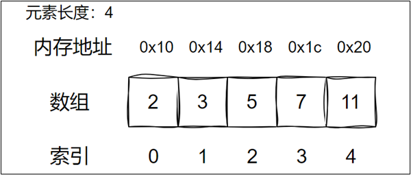

由于数组元素在内存中是连续存储的，所以只要知道数组的起始位置，以及数组元素的类型（单个元素的长度），就可以根据索引计算出任意元素的位置。

数组在创建时需要指定长度，并且数组一旦创建，长度就无法改变，如果需要扩容，只能创建一个更大的数组，再将原数据拷贝到新数组。并且由于数组的连续性，插入和删除数据可能需要移动其他元素。

在 Python 中，并没有像其他一些编程语言（如 C、Java）那样严格意义上的 “数组” 概念，但有多种数据结构可以用来模拟数组的功能，最常用的是列表（list），另外还有 array 模块的数组和 numpy 库的 ndarray。

通过Python 的list列表实现一个动态数组，它内部存储的实际上是对象的引用（指针），而不是对象本身。每个引用指向内存中存储实际对象的位置。

### 2.1.2 数组的功能定义

| **方法**                 | **说明**                         |
| ------------------------ | -------------------------------- |
| **size()**               | 返回数组中元素个数               |
| **is_empty()**           | 判断数组是否为空                 |
| **insert(index,  item)** | 在指定位置插入元素               |
| **append(item)**         | 在末尾插入元素                   |
| **remove(index)**        | 删除指定位置的元素               |
| **set(index, item)**     | 修改指定位置的元素               |
| **get(index)**           | 获取指定位置的元素               |
| **find(item)**           | 查找数组中某个元素首次出现的位置 |
| `__str__()`              | 返回字符串 [元素1, 元素2, 元素3] |
| `__iter__()`             | 返回迭代器对象                   |

### 2.1.3 数组的创建

> 实现一个动态数组。

```python
"""
    动态数组
"""
class Array:
    def __init__(self):
        """初始化数组"""
        self.__capacity = 10
        self.__size = 0
        self.__items = [None] * 10

    def __str__(self):
        """打印数组"""
        arr_str = "["
        for i in range(self.__size):
            arr_str += str(self.__items[i])
            if i < self.__size - 1:
                arr_str += ", "
        arr_str += "]"
        return arr_str

    @property
    def size(self):
        """获取数组元素个数"""
        return self.__size

    def is_empty(self):
        """判断数组是否为空"""
        return self.__size == 0

```

### 2.1.4 数组的扩容

当数组容量占满后，我们可以创建一个新的数组，容量为之前数组的2倍，并将之前数组的元素拷贝到新数组中。

```python
    def __grow(self):
        """扩容"""
        self.__capacity *= 2
        new_items = [0] * self.__capacity
        for i in range(self.__size):
            new_items[i] = self.__items[i]
        self.__items = new_items
```

> grow 方法私有化的好处：
>
> 内部实现隐藏：grow 是数组扩容的内部机制，不应该被外部直接调用
> 防止误用：避免用户在不恰当的时机手动触发扩容操作
>
> 实现可变性：可以随时修改扩容策略（如从2倍改为1.5倍）而不影响外部调用
> 状态一致性：确保扩容操作只在必要时由内部逻辑触发，维护数组状态的正确性

### 2.1.5 数组元素插入和追加

在中间插入元素时，将指定位置及其之后的元素全部向后移动一个位置，并将指定位置改为新的元素。

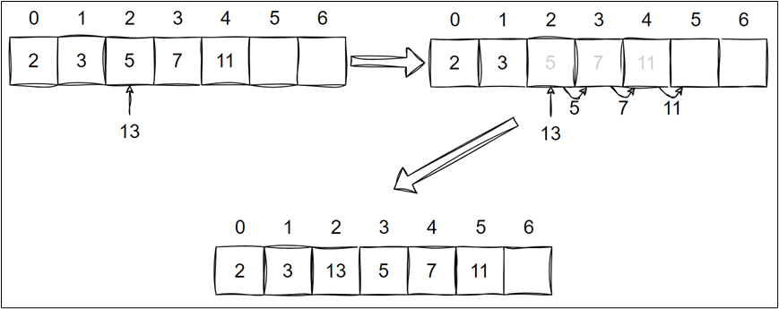

```python
    def insert(self, index, item):
        """在指定位置插入元素"""
        if index < 0 or index > self.__size:
            raise IndexError
        if self.__size == self.__capacity:
            self.__grow()
        self.__items[index + 1: self.__size + 1] = self.__items[index: self.__size]
        self.__items[index] = item
        self.__size += 1
```

在末尾插入元素时，使用insert()并将index设置为数组长度。

```python
    def append(self, item):
        """添加元素"""
        self.insert(self.__size, item)
```

### 2.1.6 数组元素的删除

删除数组中指定位置的元素时，将该位置之后的所有元素向前移动一个位置。

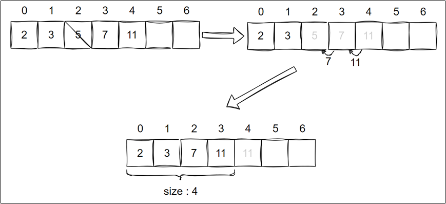

```py
    def remove(self, index):
        """删除元素"""
        if index < 0 or index >= self.__size:
            raise IndexError
        for i in range(index + 1, self.__size):
            self.__items[i - 1] = self.__items[i]
        self.__size -= 1
```

### 2.1.7 数组元素的修改

```python
    def set(self, index, item):
        """修改元素"""
        if index < 0 or index >= self.__size:
            raise IndexError
        self.__items[index] = item
```

### 2.1.8 数组元素的获取

```python
    def get(self, index):
        """获取元素"""
        if index < 0 or index >= self.__size:
            raise IndexError
        return self.__items[index]
```

### 2.1.9 数组元素的查找

```python
    def find(self, target):
        """查找元素"""
        for i in range(self.__size):
            if self.__items[i] == target:
                return i
        return -1
```

### 2.1.10 数组元素的遍历

```python
    def __iter__(self):
        """返回生成器用于遍历数组"""
        return self.__generator()

    def __generator(self):
        cursor = 0
        while cursor < self.__size:
            yield self.__items[cursor]
            cursor += 1
```

### 2.1.11 完整代码

> 动态数组完整代码

```python
"""
    动态数组
"""
class Array:
    def __init__(self):
        """初始化数组"""
        self.__capacity = 10
        self.__size = 0
        self.__items = [None] * 10

    def __str__(self):
        """打印数组"""
        arr_str = "["
        for i in range(self.__size):
            arr_str += str(self.__items[i])
            if i < self.__size - 1:
                arr_str += ", "
        arr_str += "]"
        return arr_str

    @property
    def size(self):
        """获取数组元素个数"""
        return self.__size

    def is_empty(self):
        """判断数组是否为空"""
        return self.__size == 0

    def __grow(self):
        """扩容"""
        self.__capacity *= 2
        new_items = [0] * self.__capacity
        for i in range(self.__size):
            new_items[i] = self.__items[i]
        self.__items = new_items

    def insert(self, index, item):
        """在指定位置插入元素"""
        if index < 0 or index > self.__size:
            raise IndexError
        if self.__size == self.__capacity:
            self.__grow()
        self.__items[index + 1: self.__size + 1] = self.__items[index: self.__size]
        self.__items[index] = item
        self.__size += 1

    def append(self, item):
        """添加元素"""
        self.insert(self.__size, item)

    def remove(self, index):
        """删除元素"""
        if index < 0 or index >= self.__size:
            raise IndexError
        for i in range(index + 1, self.__size):
            self.__items[i - 1] = self.__items[i]
        self.__size -= 1

    def set(self, index, item):
        """修改元素"""
        if index < 0 or index >= self.__size:
            raise IndexError
        self.__items[index] = item

    def get(self, index):
        """获取元素"""
        if index < 0 or index >= self.__size:
            raise IndexError
        return self.__items[index]

    def find(self, target):
        """查找元素"""
        for i in range(self.__size):
            if self.__items[i] == target:
                return i
        return -1

    def __iter__(self):
        """返回生成器用于遍历数组"""
        return self.__generator()

    def __generator(self):
        cursor = 0
        while cursor < self.__size:
            yield self.__items[cursor]
            cursor += 1
```

> 测试代码

```python
# 测试
if __name__ == "__main__":
    print("创建一个动态数组...")
    array = Array()
    print("数组初始状态：", array)
    print("数组实际元素个数：", array.size)
    print("数组是否为空：", array.is_empty())

    print("开始添加15个元素...")
    for i in range(1, 16):
        array.append(i)
    print("数组当前状态：", array)
    print("数组实际元素个数：", array.size)
    print("在[5]插入100...")
    array.insert(5, 100)
    print("数组当前状态：", array)
    print("数组实际元素个数：", array.size)

    print("删除[5]...")
    array.remove(5)
    print("数组当前状态：", array)
    print("数组实际元素个数：", array.size)

    print("修改[5]为200...")
    array.set(5, 200)
    print("数组当前状态：", array)
    print("数组实际元素个数：", array.size)

    print("获取[5]...")
    print("数组[5]的值为：", array.get(5))

    print("查找100...")
    index = array.find(100)
    if index != -1:
        print("100在数组中的索引为：", index)
    else:
        print("100在数组中未找到")

    print("遍历数组...")
    for e in array:
        print(e,end=" ")
    print("\n结束")

```


## 2.2 链表

### 2.2.1 单向链表

#### 1、链表的概述

链表（Linked List）是一个线性结构，由一系列结点（Node）组成，每个结点包含2个部分：数据元素和指向上/下结点的指针（Pointer）。

所有结点通过指针相连，形成一个链式结构。通常我们将链表中的第一个结点称为头结点，并将头结点的位置作为整个链表的位置标识。与数组不同，链表中每个结点分散的存储在内存中，每个结点都保存了当前结点的数据和上/下一结点的地址（指针）。

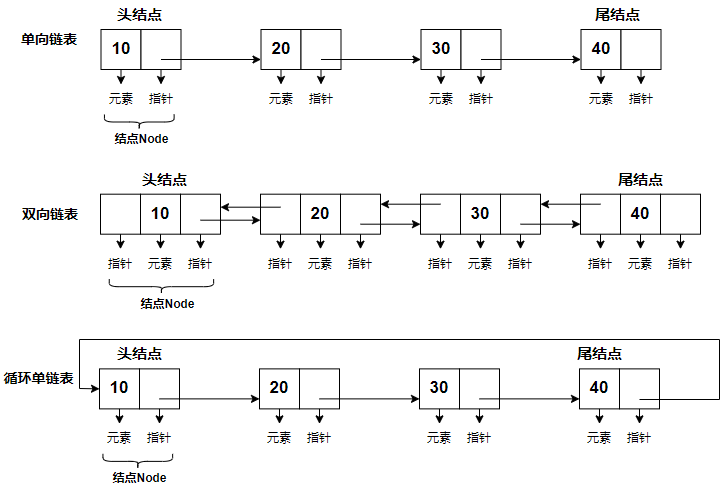

由于链表中结点通过指针相连，插入和删除结点只需要修改指针的指向即可，而不需要像数组那样移动数据。且链表不需要像数组那样预先指定大小，而是可以随时动态的增长或缩小。由于链表使用分散存储的方式，因而无需使用大段连续的内存空间。

由于链表中的结点不是连续存储的，无法像数组一样根据索引直接计算出每个结点的地址。必须从头结点开始遍历链表，直到找到目标结点，这导致了链表的随机访问效率较低。链表的每个结点都需要存储指向下一个结点的指针，这会占用额外的存储空间。相比于数组，链表需要更多的内存空间来存储相同数量的数据元素。

常见的链表包括三种：

- 单向链表：单向链表的结点包含值和指向下一结点的引用。我们将首个结点称为头结点，将最后一个结点称为尾结点，尾结点指向空 None 。
- 双向链表：双向链表记录了两个方向的引用，同时包含指向后继结点（下一个结点）和前驱结点（上一个结点）的引用。
- 环形链表：将单向链表的尾结点指向头结点（首尾相接），则得到一个环形链表。在环形链表中，任意结点都可以视作头结点。

#### 2、链表的功能定义

| **方法**                 | **说明**                         |
| ------------------------ | -------------------------------- |
| **size()**               | 返回链表中元素个数               |
| **is_empty()**           | 判断链表是否为空                 |
| **insert(index,  item)** | 在指定位置插入元素               |
| **append(item)**         | 在末尾插入元素                   |
| **remove(index)**        | 删除指定位置的元素               |
| **set(index, item)**     | 修改指定位置的元素               |
| **get(index)**           | 获取指定位置的元素               |
| **find(item)**           | 查找链表中某个元素的位置         |
| `__str__()`              | 返回字符串 [元素1, 元素2, 元素3] |
| `__iter__()`             | 返回迭代器对象                   |

#### 3、创建单链表

> 实现一个单向链表。

```python
"""
    单链表
"""
class Node:
    """
    单链表的结点
    """
    def __init__(self, data, next=None):
        self.data = data
        self.next = next

class SinglyLinkedList:
    """
    单链表
    """
    def __init__(self):
        """
        初始化单链表
        """
        self.__head = None
        self.__size = 0

    def __str__(self):
        """打印链表"""
        result = []
        current = self.__head
        while current:
            result.append(str(current.data))
            current = current.next
        return " -> ".join(result)

    @property
    def size(self):
        """获取链表元素个数"""
        return self.__size

    def is_empty(self):
        """判断链表是否为空"""
        return self.__size == 0
```

#### 4、单链表元素插入和追加

- 插入[0]位置

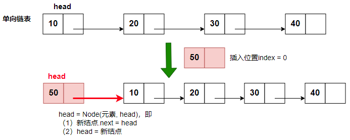

- 插入非[0]位置

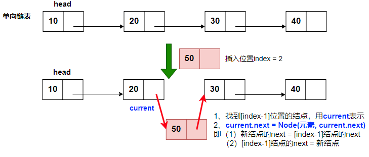

- 在末尾插入元素时，使用insert()并将index设置为链表长度。

```python
    def insert(self, index, item):
        """在指定位置插入元素"""
        if index < 0 or index > self.__size:
            raise IndexError
        if index == 0:
            self.__head = Node(item, self.__head)
        else:
            current = self.__head
            for i in range(index - 1):
                current = current.next
            # current是index-1位置的结点
            current.next = Node(item, current.next)
        self.__size += 1

    def append(self, item):
        """末尾位置添加元素"""
        self.insert(self.__size, item)
```

#### 5、单链表元素删除

- 删除[0]位置的元素

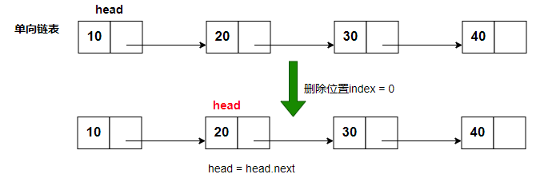

- 删除非[0]位置的元素

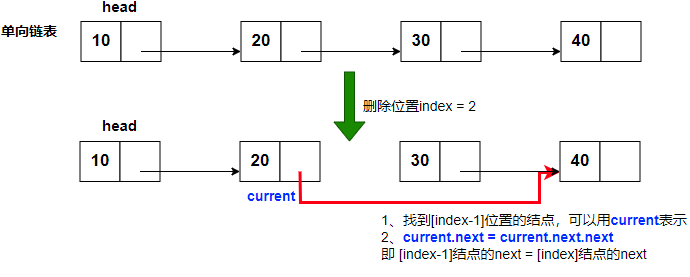

```python
    def remove(self, index):
        """删除指定位置的元素"""
        if index < 0 or index >= self.__size:
            raise IndexError
        if index == 0:
            self.__head = self.__head.next
        else:
            current = self.__head
            for i in range(index - 1):
                current = current.next
            # current是index-1位置的结点
            current.next = current.next.next
        self.__size -= 1
```

#### 6、单链表元素修改

```python
    def set(self, index, item):
        """修改指定位置的元素"""
        if index < 0 or index >= self.__size:
            raise IndexError
        current = self.__head
        for i in range(index):
            current = current.next
        # current是index位置的结点
        current.data = item
```

#### 7、单链表元素的获取

```python
    def get(self, index):
        """获取指定位置的元素"""
        if index < 0 or index >= self.__size:
            raise IndexError
        current = self.__head
        for i in range(index):
            current = current.next
        # current是index位置的结点
        return current.data
```

#### 8、单链表元素的查找

```python
    def find(self, target):
        """查找元素"""
        current = self.__head
        while current:
            if current.data == target:
                return True
            current = current.next
        return False
```

#### 9、单链表元素的遍历

```python
    def __iter__(self):
        """返回生成器对象，它是一种特殊的迭代器，用于遍历当前单链表"""
        return self.__generator()

    def __generator(self):
        """生成器函数"""
        current = self.__head
        while current:
            yield current.data
            current = current.next
```

#### 10、单链表完整代码

> 单链表示例代码

```python
"""
    单链表
"""
class Node:
    """
    单链表的结点
    """
    def __init__(self, data, next=None):
        self.data = data
        self.next = next

class SinglyLinkedList:
    """
    单链表
    """
    def __init__(self):
        """
        初始化单链表
        """
        self.__head = None
        self.__size = 0

    def __str__(self):
        """打印链表"""
        result = []
        current = self.__head
        while current:
            result.append(str(current.data))
            current = current.next
        return " -> ".join(result)

    @property
    def size(self):
        """获取链表元素个数"""
        return self.__size

    def is_empty(self):
        """判断链表是否为空"""
        return self.__size == 0

    def insert(self, index, item):
        """在指定位置插入元素"""
        if index < 0 or index > self.__size:
            raise IndexError
        if index == 0:
            self.__head = Node(item, self.__head)
        else:
            current = self.__head
            for i in range(index - 1):
                current = current.next
            # current是index-1位置的结点
            current.next = Node(item, current.next)
        self.__size += 1

    def append(self, item):
        """末尾位置添加元素"""
        self.insert(self.__size, item)

    def remove(self, index):
        """删除指定位置的元素"""
        if index < 0 or index >= self.__size:
            raise IndexError
        if index == 0:
            self.__head = self.__head.next
        else:
            current = self.__head
            for i in range(index - 1):
                current = current.next
            # current是index-1位置的结点
            current.next = current.next.next
        self.__size -= 1

    def set(self, index, item):
        """修改指定位置的元素"""
        if index < 0 or index >= self.__size:
            raise IndexError
        current = self.__head
        for i in range(index):
            current = current.next
        # current是index位置的结点
        current.data = item

    def get(self, index):
        """获取指定位置的元素"""
        if index < 0 or index >= self.__size:
            raise IndexError
        current = self.__head
        for i in range(index):
            current = current.next
        # current是index位置的结点
        return current.data

    def find(self, target):
        """查找元素"""
        current = self.__head
        while current:
            if current.data == target:
                return True
            current = current.next
        return False

    def __iter__(self):
        """返回生成器对象，它是一种特殊的迭代器，用于遍历当前单链表"""
        return self.__generator()

    def __generator(self):
        """生成器函数"""
        current = self.__head
        while current:
            yield current.data
            current = current.next
```

> 测试代码

```python
# 测试
if __name__ == "__main__":
    print("创建单链表。。。")
    linked = SinglyLinkedList()
    print("单链表初始状态：", linked)
    print("单链表元素个数：", linked.size)
    print("单链表是否为空：", linked.is_empty())

    print("开始添加5个元素...")
    linked.insert(0, 1)
    linked.insert(0, 2)
    linked.insert(1, 3)
    linked.insert(2, 4)
    linked.insert(3, 5)
    print("单链表当前状态：", linked)
    print("单链表元素个数：", linked.size)
    print("单链表是否为空：", linked.is_empty())

    print("删除[2]...")
    linked.remove(2)
    print("单链表当前状态：", linked)
    print("单链表元素个数：", linked.size)

    print("删除[0]...")
    linked.remove(0)
    print("单链表当前状态：", linked)
    print("单链表元素个数：", linked.size)

    print("删除[1]...")
    linked.remove(2)
    print("单链表当前状态：", linked)
    print("单链表元素个数：", linked.size)

    print("修改[0]为100...")
    linked.set(0, 100)
    print("单链表当前状态：", linked)
    print("单链表元素个数：", linked.size)

    print("获取[0]...")
    print("单链表[0]的元素为：", linked.get(0))

    print("查找100...")
    if linked.find(100):
        print("100在单链表中")
    else:
        print("100在单链表中未找到")

    print("遍历单链表...")
    for e in linked:
        print(e)

```

### 2.2.2 双向链表

#### 1、双向链表功能的定义

| **方法**                 | **说明**                 |
| ------------------------ | ------------------------ |
| **size()**               | 返回链表中元素个数       |
| **is_empty()**           | 判断链表是否为空         |
| **insert(index,  item)** | 在指定位置插入元素       |
| **append(item)**         | 在末尾插入元素           |
| **remove(index)**        | 删除指定位置的元素       |
| **set(index, item)**     | 修改指定位置的元素       |
| **get(index)**           | 获取指定位置的元素       |
| **find(item)**           | 查找链表中某个元素的位置 |
| **for_each(func)**       | 遍历链表                 |

#### 2、双向链表的创建

```python
"""
    双向链表的实现
"""
class Node:
    """
        双向链表的结点
    """
    def __init__(self, data, prev=None, next=None):
        self.prev = prev
        self.data = data
        self.next = next

class DoubleLinkedList:
    """
        双向链表
    """
    def __init__(self):
        """
        初始化双向链表
        """
        self.__head = None
        self.__tail = None
        self.__size = 0

    def __str__(self):
        """
        打印链表
        """
        result = []
        current = self.__head
        while current:
            result.append(str(current.data))
            current = current.next
        return " -> ".join(result)

    def size(self):
        """
        获取链表元素个数
        """
        return self.__size

    def is_empty(self):
        """
        判断链表是否为空
        """
        return self.__size == 0
```

#### 3、双向链表元素的插入和追加

- 空链表插入第一个元素

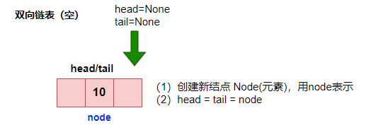

- 非空链表在[0]位置插入新元素

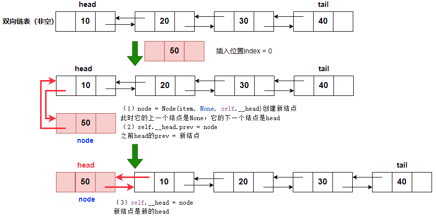

- 非空链表在[size]位置插入新元素

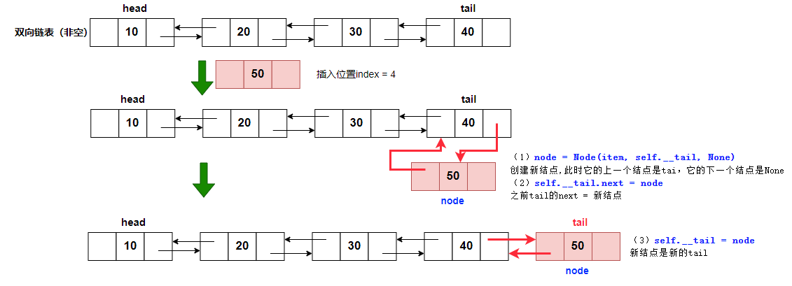

- 非空链表在其他位置插入新元素

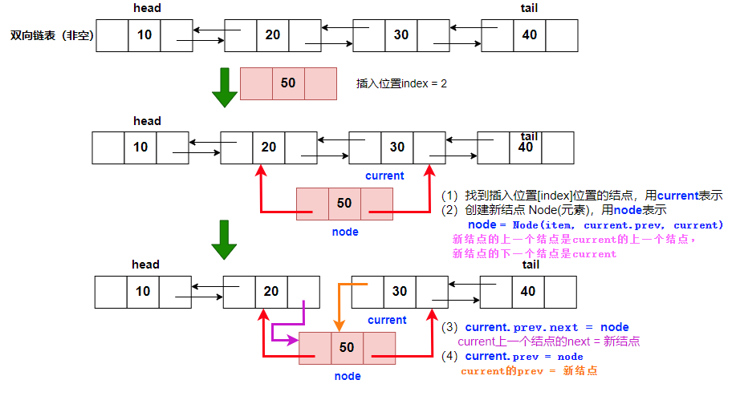

- 在末尾插入元素时，使用insert()并将index设置为链表长度。

- 

```python
    def insert(self, index, item):
        """
        在指定位置添加元素
        """
        if index < 0 or index > self.__size:
            raise IndexError
        if self.is_empty():
            node = Node(item)
            self.__head = self.__tail = node
        elif index == 0:
            node = Node(item, None, self.__head)
            self.__head.prev = node
            self.__head = node
        elif index == self.__size:
            node = Node(item, self.__tail, None)
            self.__tail.next = node
            self.__tail = node
        else :
            if index <= self.__size >> 1:
                current = self.__head
                for i in range(index):
                    current = current.next
            else :
                current = self.__tail
                for i in range(self.__size - index -1):
                    current = current.prev
            # current是index位置的结点
            node = Node(item, current.prev, current)
            current.prev.next = node
            current.prev = node
        self.__size += 1

    def append(self, item):
        """
        末尾位置添加元素
        """
        self.insert(self.__size, item)
```

#### 4、双向链表元素的删除

- 删除唯一结点

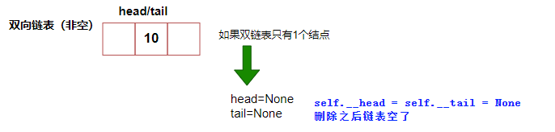

- 删除头结点

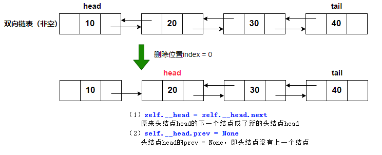

- 删除尾结点

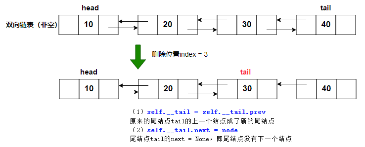

- 删除其他结点

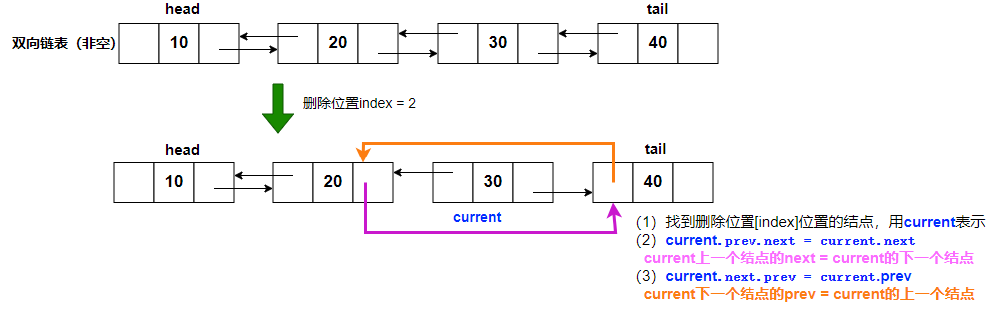


```python
    def remove(self, index):
        """
        删除指定位置的元素
        """
        if index < 0 or index >= self.__size:
            raise IndexError
        if self.__size == 1:
            self.__head = self.__tail = None
        elif index == 0:
            self.__head = self.__head.next
            self.__head.prev = None
        elif index == self.__size - 1:
            self.__tail = self.__tail.prev
            self.__tail.next = None
        else:
            if index <= self.__size >> 1:
                current = self.__head
                for i in range(index):
                    current = current.next
            else:
                current = self.__tail
                for i in range(self.__size - index -1):
                    current = current.prev
            # current是index位置的结点
            current.prev.next = current.next
            current.next.prev = current.prev
        self.__size -= 1

```

#### 5、双向链表元素的修改

```python
    def set(self, index, item):
        """
        修改指定位置的元素
        """
        if index < 0 or index >= self.__size:
            raise IndexError
        if index <= self.__size >> 1:
            current = self.__head
            for i in range(index):
                current = current.next
        else:
            current = self.__tail
            for i in range(self.__size - index -1):
                current = current.prev
        # current是index位置的结点
        current.data = item
```

#### 6、双向链表元素的获取

```python
    def get(self, index):
        """
        获取指定位置的元素
        """
        if index < 0 or index >= self.__size:
            raise IndexError
        if index <= self.__size >> 1:
            current = self.__head
            for i in range(index):
                current = current.next
        else:
            current = self.__tail
            for i in range(self.__size - index -1):
                current = current.prev
        return current.data
```

#### 7、双向链表元素的查找

```python
    def find(self, target):
        """
        查找元素
        """
        current = self.__head
        while current:
            if current.data == target:
                return True
            current = current.next
        return False
```

#### 8、双向链表元素的遍历

```python
    def for_each(self, callback):
        """
        遍历链表
        """
        current = self.__head
        while current:
            callback(current.data)
            current = current.next
```

#### 9、完整代码

> 双向链表的实现代码

```python
"""
    双向链表的实现
"""
class Node:
    """
        双向链表的结点
    """
    def __init__(self, data, prev=None, next=None):
        self.prev = prev
        self.data = data
        self.next = next

class DoubleLinkedList:
    """
        双向链表
    """
    def __init__(self):
        """
        初始化双向链表
        """
        self.__head = None
        self.__tail = None
        self.__size = 0

    def __str__(self):
        """
        打印链表
        """
        result = []
        current = self.__head
        while current:
            result.append(str(current.data))
            current = current.next
        return " -> ".join(result)

    def size(self):
        """
        获取链表元素个数
        """
        return self.__size

    def is_empty(self):
        """
        判断链表是否为空
        """
        return self.__size == 0

    def insert(self, index, item):
        """
        在指定位置添加元素
        """
        if index < 0 or index > self.__size:
            raise IndexError
        if self.is_empty():
            node = Node(item)
            self.__head = self.__tail = node
        elif index == 0:
            node = Node(item, None, self.__head)
            self.__head.prev = node
            self.__head = node
        elif index == self.__size:
            node = Node(item, self.__tail, None)
            self.__tail.next = node
            self.__tail = node
        else :
            if index <= self.__size >> 1:
                current = self.__head
                for i in range(index):
                    current = current.next
            else :
                current = self.__tail
                for i in range(self.__size - index -1):
                    current = current.prev
            # current是index位置的结点
            node = Node(item, current.prev, current)
            current.prev.next = node
            current.prev = node
        self.__size += 1

    def append(self, item):
        """
        末尾位置添加元素
        """
        self.insert(self.__size, item)

    def remove(self, index):
        """
        删除指定位置的元素
        """
        if index < 0 or index >= self.__size:
            raise IndexError
        if self.__size == 1:
            self.__head = self.__tail = None
        elif index == 0:
            self.__head = self.__head.next
            self.__head.prev = None
        elif index == self.__size - 1:
            self.__tail = self.__tail.prev
            self.__tail.next = None
        else:
            if index <= self.__size >> 1:
                current = self.__head
                for i in range(index):
                    current = current.next
            else:
                current = self.__tail
                for i in range(self.__size - index -1):
                    current = current.prev
            # current是index位置的结点
            current.prev.next = current.next
            current.next.prev = current.prev
        self.__size -= 1

    def set(self, index, item):
        """
        修改指定位置的元素
        """
        if index < 0 or index >= self.__size:
            raise IndexError
        if index <= self.__size >> 1:
            current = self.__head
            for i in range(index):
                current = current.next
        else:
            current = self.__tail
            for i in range(self.__size - index -1):
                current = current.prev
        # current是index位置的结点
        current.data = item

    def get(self, index):
        """
        获取指定位置的元素
        """
        if index < 0 or index >= self.__size:
            raise IndexError
        if index <= self.__size >> 1:
            current = self.__head
            for i in range(index):
                current = current.next
        else:
            current = self.__tail
            for i in range(self.__size - index -1):
                current = current.prev
        return current.data

    def find(self, target):
        """
        查找元素
        """
        current = self.__head
        while current:
            if current.data == target:
                return True
            current = current.next
        return False

    def for_each(self, callback):
        """
        遍历链表
        """
        current = self.__head
        while current:
            callback(current.data)
            current = current.next

```

> 测试代码

```python
# 测试
if __name__ == "__main__":
    print("创建双向链表...")
    linked = DoubleLinkedList()
    print("双向链表初始状态：", linked)
    print("双向链表元素个数：", linked.size())
    print("双向链表是否为空：", linked.is_empty())

    print("开始添加元素...")
    print("在[0]添加元素1...")
    linked.insert(0, 1)
    print("双向链表当前状态：", linked)
    print("在[0]添加元素2...")
    linked.insert(0, 2)
    print("双向链表当前状态：", linked)
    print("在[1]添加元素3...")
    linked.insert(1, 3)
    print("双向链表当前状态：", linked)
    print("在[3]添加元素4...")
    linked.insert(3, 4)
    print("双向链表当前状态：", linked)
    print("在末尾追加元素5...")
    linked.append( 5)
    print("双向链表当前状态：", linked)

    print("修改[0]为100...")
    linked.set(0, 100)
    print("双向链表当前状态：", linked)

    print("获取[0]...")
    print("双向链表[0]的元素为：", linked.get(0))
    print("查找100...")
    if linked.find(100):
        print("100在双向链表中")
    else:
        print("100在双向链表中未找到")

    print("遍历双向链表...")
    linked.for_each(lambda x: print(x, end=" "))
    print()

    print("删除[0]...")
    linked.remove(0)
    print("双向链表当前状态：", linked)
    print("删除[2]...")
    linked.remove(2)
    print("双向链表当前状态：", linked)
    print("删除[2]...")
    linked.remove(2)
    print("双向链表当前状态：", linked)
    print("删除[0]...")
    linked.remove(0)
    print("双向链表当前状态：", linked)
    print("删除[0]...")
    linked.remove(0)
    print("双向链表当前状态：", linked)
```


## 2.3 栈

## 2.3 栈

### 2.3.1 栈的概述

栈（Stack）是一个线性结构，其维护了一个有序的数据列表，列表的一端称为栈顶（top），另一端称为栈底（bottom）。栈对数据的操作有明确限定，插入元素只能从栈顶进行，删除元素也只能栈顶开始逐个进行，通常将插入元素称为入栈（push），删除元素称为出栈（pop）。正是由于上述规定，栈保证了后进先出（LIFO，Last-In-First-Out）或先进后出（FILO，First-In-Last-Out）的原则。

栈的底层实现既可以选择数组也可以选择链表，只要能保证后进先出的原则即可。

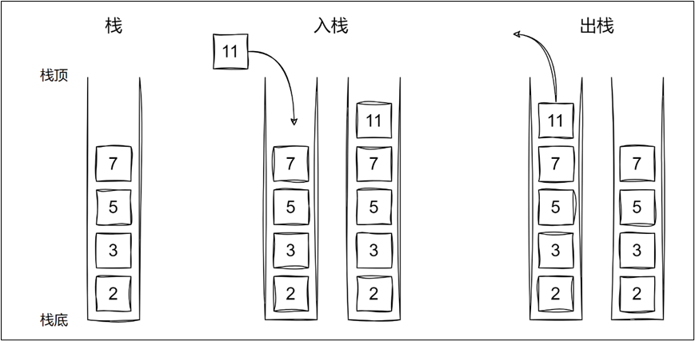

### 2.3.2 栈功能的定义

| **方法**       | **说明**                         |
| -------------- | -------------------------------- |
| **size()**     | 返回栈中元素个数                 |
| **is_empty()** | 判断栈是否为空                   |
| **push(item)** | 将新元素压入栈中                 |
| **pop()**      | 获取栈顶元素，并将栈顶元素弹出栈 |
| **peek()**     | 获取栈顶元素，但不弹出栈         |

### 2.3.3 栈的实现

#### 1、基于列表包装的栈结构

> 基于列表包装的栈结构

```python
"""
    基于列表的栈结构
"""
class Stack:
    """
        栈结构
    """
    def __init__(self):
        self.__size = 0
        self.__items = []

    def __str__(self):
        """打印栈"""
        result = []
        for i in range(self.__size):
            result.append(str(self.__items[i]))
        return " <- ".join(result)

    @property
    def size(self):
        """获取栈元素个数"""
        return self.__size

    def is_empty(self):
        """判断栈是否为空"""
        return self.__size == 0

    def push(self, item):
        """入栈"""
        self.__items.append(item)
        self.__size += 1

    def pop(self):
        """出栈"""
        if self.is_empty():
            raise Exception("栈为空")
        item = self.__items.pop()
        self.__size -= 1
        return item

    def peek(self):
        """获取栈顶元素"""
        if self.is_empty():
            raise Exception("栈为空")
        return self.__items[-1]
```

#### 2、基于单链表的栈结构

```python
"""
    基于单链表的栈结构
"""
class Node:
    """
    单链表的结点
    """
    def __init__(self, data, next=None):
        self.data = data
        self.next = next

class Stack:
    """
        栈结构
    """
    def __init__(self):
        self.__size = 0
        self.__head = None

    def __str__(self):
        """打印栈"""
        result = []
        current = self.__head
        while current:
            result.append(str(current.data))
            current = current.next
        return " -> ".join(result)

    @property
    def size(self):
        """获取栈元素个数"""
        return self.__size

    def is_empty(self):
        """判断栈是否为空"""
        return self.__size == 0

    def push(self, item):
        """入栈"""
        self.__head = Node(item, self.__head)
        self.__size += 1

    def pop(self):
        """出栈"""
        if self.is_empty():
            raise Exception("栈为空")
        item = self.__head.data
        self.__head = self.__head.next
        self.__size -= 1
        return item

    def peek(self):
        """获取栈顶元素"""
        if self.is_empty():
            raise Exception("栈为空")
        return self.__head.data
```

#### 3、测试代码

> 测试代码

```python
# 测试
if __name__ == "__main__":
    print("创建一个栈...")
    stack = Stack()
    print("栈初始状态：", stack)
    print("栈元素个数：", stack.size)
    print("栈是否为空：", stack.is_empty())
    print("开始入栈...")
    stack.push(1)
    stack.push(2)
    stack.push(3)
    print("栈当前状态：", stack)
    print("栈元素个数：", stack.size)
    print("栈是否为空：", stack.is_empty())
    print("栈顶元素为：", stack.peek())
    print("开始出栈...")
    print("出栈元素为：", stack.pop())
    print("栈当前状态：", stack)
    print("栈元素个数：", stack.size)
```

### 2.3.4 直接使用原生列表方法实现栈结构效果

```python
"""
    直接使用原生列表方法，实现栈的效果
"""
if __name__ == "__main__":
    print("创建一个栈...")
    stack = []
    print("入栈顺序1,2,3...")
    stack.append(1)
    stack.append(2)
    stack.append(3)
    print("栈当前状态：", stack)
    print("栈顶元素为：", stack[-1])
    print("出栈...")
    while len(stack) != 0:
        print("出栈元素为：", stack.pop())
    else:
        print("栈已空")
```

> 思考：定义Stack类与直接使用list的区别
>
> Stack类：使用Stack类更适合面向对象编程，提供更好的封装性、安全性和可维护性。例如：通过私有属性`__size和__items`隐藏内部实现细节，只暴露必要的接口（push、pop、peek等）。内部实现可以改变（如使用链表实现），而接口保持不变。
> 直接使用list：虽然简单快速，但缺乏抽象和保护机制，没有封装，直接暴露所有列表方法，可能误用其他列表功能

### 2.3.5 栈的应用

力扣20题https://leetcode.cn/problems/valid-parentheses/description/

> 给定一个只包括 `'('`，`')'`，`'{'`，`'}'`，`'['`，`']'` 的字符串 `s` ，判断字符串是否有效。
>
> 有效字符串需满足：
>
> 1. 左括号必须用相同类型的右括号闭合。
> 2. 左括号必须以正确的顺序闭合。
> 3. 每个右括号都有一个对应的相同类型的左括号。

```
示例 1：
    输入：s = "()"
    输出：true

示例 2：
    输入：s = "()[]{}"
    输出：true

示例 3：
    输入：s = "(]"
    输出：false

示例 4：
    输入：s = "([])"
    输出：true

示例 5：
    输入：s = "([)]"
    输出：false
```

> 实现思路：

遇到左括号则入栈，遇到右括号则出栈一个左括号与之匹配，如果能够匹配则继续，如果匹配失败或者栈为空则返回False。

> 示例代码

```python
"""
    使用栈结构解决问题
"""
class Solution:
    def isValid(self, s):
        stack = []
        for i in range(len(s)):
            if s[i] in ['(', '[', '{']:
                stack.append(s[i])
            elif len(stack) == 0:
                return False
            elif s[i] == ')' and stack.pop() != '(':
                return False
            elif s[i] == ']' and stack.pop() != '[':
                return False
            elif s[i] == '}' and stack.pop() != '{':
                return  False
        return len(stack) == 0

if __name__ == "__main__":
    solution = Solution()
    s = "()[]{}"
    print(s, solution.isValid(s))
    s = "(]"
    print(s, solution.isValid(s))
    s = "([)]"
    print(s, solution.isValid(s))
    s = "{[]}"
    print(s, solution.isValid(s))

```

## 2.4 队列

### 2.4.1 队列的概述

队列（Queue）也是一个线性结构，其同样维护了一个有序的数据列表，队列的一端称为队首，另一端称为队尾。队列也对数据操作做出了明确限定，插入元素只能从队尾进行，删除元素只能从队首进行，通常将插入操作称为入队（enqueue），将删除操作称为出队（dequeue）。也正是由于上述限制，队列保证了先进先出（FIFO，First-In-First-Out）的原则。

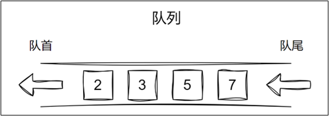

队列的底层实现既可以选择数组也可以选择链表，只要能保证先进先出的原则即可。

常见的队列包括两种：

- 单向队列：只能从一端插入数据，从另一端删除数据，遵循先进先出。
- 双向队列：在队列的两端都可以进行插入和删除操作。

### 2.4.2 单向队列功能的定义

| **方法**       | **说明**           |
| -------------- | ------------------ |
| **size()**     | 返回队列中元素个数 |
| **is_empty()** | 判断队列是否为空   |
| **push(item)** | 向队尾添加元素     |
| **pop()**      | 从队首取出元素     |
| **peek()**     | 访问队首元素       |


### 2.4.3 单向队列的实现

#### 1、基于列表的单向队列

> 基于列表的单向队列的实现

```python
"""
    基于列表的单向队列的实现
"""
class Queue:
    """
        单向队列的实现
    """
    def __init__(self):
        self.__size = 0
        self.__items = []

    def __str__(self):
        """打印队列"""
        result = []
        for i in range(self.__size):
            result.append(str(self.__items[i]))
        return " <- ".join(result)

    def size(self):
        """获取队列元素个数"""
        return self.__size

    def is_empty(self):
        """判断队列是否为空"""
        return self.__size == 0

    def enqueue(self, item):
        """入队"""
        self.__items.append(item)
        self.__size += 1

    def dequeue(self):
        """出队"""
        if self.is_empty():
            raise Exception("队列为空")
        item = self.__items[0]
        del self.__items[0]
        self.__size -= 1
        return item

    def peek(self):
        """获取队首元素"""
        if self.is_empty():
            raise Exception("队列为空")
        return self.__items[0]
```

#### 2、基于单链表的单向队列

> 基于单链表的单向队列的实现

```python
"""
    基于单向链表的单向队列的实现
"""
class Node:
    """
    单链表的结点
    """
    def __init__(self, data, next=None):
        self.data = data
        self.next = next

class Queue:
    """
        单向队列的实现
    """
    def __init__(self):
        self.__size = 0
        self.__head = None

    def __str__(self):
        """打印队列"""
        result = []
        current = self.__head
        while current:
            result.append(str(current.data))
            current = current.next
        return " -> ".join(result)

    def size(self):
        """获取队列元素个数"""
        return self.__size

    def is_empty(self):
        """判断队列是否为空"""
        return self.__size == 0

    def enqueue(self, item):
        """入队"""
        if self.is_empty():
            self.__head = Node(item)
        else:
            current = self.__head
            while current.next:
                current = current.next
            current.next = Node(item)
        self.__size += 1

    def dequeue(self):
        """出队"""
        if self.is_empty():
            raise Exception("队列为空")
        item = self.__head.data
        self.__head = self.__head.next
        self.__size -= 1
        return item

    def peek(self):
        """获取队首元素"""
        if self.is_empty():
            raise Exception("队列为空")
        return self.__head.data
```


#### 3、测试类

> 测试类

```python
# 测试
if __name__ == "__main__":
    print("创建一个队列...")
    queue = Queue()
    print("队列初始状态：", queue)
    print("队列元素个数：", queue.size())
    print("队列是否为空：", queue.is_empty())

    print("开始入队1,2,3...")
    queue.enqueue(1)
    queue.enqueue(2)
    queue.enqueue(3)
    print("队列当前状态：", queue)
    print("队列元素个数：", queue.size())
    print("队列是否为空：", queue.is_empty())

    print("队列首元素为：", queue.peek())

    print("开始出队...")
    while not queue.is_empty():
        print("出队元素为：", queue.dequeue())
    else:
        print("队列已空")
```


## 2.5 哈希表

### 2.5.1 哈希表的概述

哈希表（Hash Table，也叫散列表），由一系列键值对（key-value pairs）组成，并且可以通过键（key）查找对应的值（value）。哈希表通过建立key与value之间的映射，实现高效的查询，我们向哈希表中输入一个key，可以在O(1)的时间内获取对应的value。

例如通过客户id获取客户姓名：

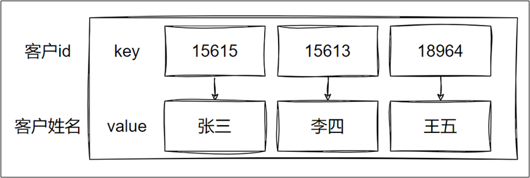

哈希表常见的一个操作是根据key来查找value，考虑到数组查询效率最高，选择基于数组实现哈希表。利用哈希函数计算key的哈希值，然后将哈希值映射到数组索引。在实现过程中我们可能会遇到如下问题：

- 如何将一个个key映射到数组的索引？
- 如果多个key映射到数组同一个索引怎么办？
- 数组长度是固定的，如果后续元素过多，大于数组长度怎么办？


### 2.5.2 哈希函数与哈希冲突

#### 1、哈希函数

哈希表的核心组件是哈希函数。该函数将key转换为一个数组索引。哈希函数的目标是尽量均匀地将所有可能的key分布到表的不同位置，以减少冲突的发生。

哈希函数的执行步骤分为两步：

- 通过某种哈希算法计算出key的哈希值。
- 哈希值对数组长度取余，获取key对应的数组索引。

```python
 index = hash(key) % capacity
```

例如我们使用一个简单的哈希算法 hash(key)  将客户(id,name)（id作为key）映射到一个长度为8的数组的索引，即 index = hash(id) % 8 。

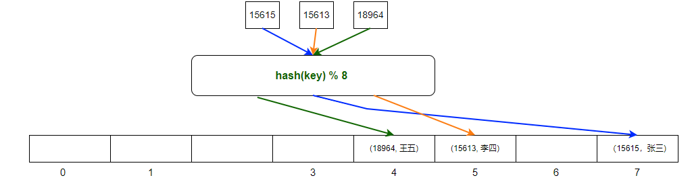

常见的哈希算法：

- 通用哈希算法：除法哈希、乘法哈希、MurmurHash、CityHash。
- 加密哈希算法：MD5（已被成功攻击）、SHA-1（已被成功攻击）、SHA-2、SHA-3。
- 文件完整性检查算法：Adler-32、CRC32。

#### 2、哈希冲突

哈希函数可能会将不同的键值映射到同一个索引位置，这就是所谓的哈希冲突。处理冲突的方式有多种，最常见的两种是链式法（Chaining）和开放寻址法（Open Addressing）。

（1）链式法

将发生碰撞的每个键值对作为一个结点（Node）组成一个链表（Linked List），然后将链表的头结点保存在数组的目标位置中。这样一来，向哈希表中写入数据时，若发现数组的目标位置已有数据，那么就将当前的键值对作为一个结点插入链表；从哈希表中读取数据时，则从数组的目标位置获取链表，并进行遍历，直到找到目标数据。

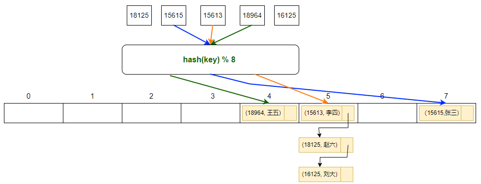

（22）开放寻址法

当发生冲突时根据某种探查策略寻找下一个空槽位。常见的探查策略包括：

- 线性探查（Linear Probing）：如果当前位置已经被占用，就探查下一个位置。
- 二次探查（Quadratic Probing）：以平方的步长进行探查。
- 双重哈希（Double Hashing）：使用另一个哈希函数来计算新的索引。

#### 3、负载因子

负载因子（Load Factor）是哈希表中元素个数与表的大小的比率。当负载因子过高时，可能需要进行扩容操作，以保持操作的效率。

较小的负载因子可以减少冲突的可能性，较大的负载因子可以提高哈希表的内存利用率。通常情况下负载因子在0.7~0.8是一个比较好的选择。


### 2.5.3 哈希表功能的定义

| **方法**            | **说明**                   |
| ------------------- | -------------------------- |
| **size()**          | 返回哈希表中键值对个数     |
| **is_empty()**      | 判断哈希表是否为空         |
| **put(key, value)** | 向哈希表插入键值对         |
| **remove(key)**     | 从哈希表中根据键删除键值对 |
| **get(key)**        | 从哈希表中根据键获取值     |
| **for_each(func)**  | 遍历哈希表中的键值对       |

### 2.5.4 哈希表的创建

```python
"""
    哈希表的实现
"""
class Node:
    """
    哈希表的结点
    """
    def __init__(self, key, value, next=None):
        self.key = key
        self.value = value
        self.next = next

    def __str__(self):
        """
        打印结点
        """
        return f"({self.key} -> {self.value})"

class HashTable:
    """
    哈希表
    """
    def __init__(self, capacity=10):
        """
        初始化哈希表
        """
        self.__capacity = capacity  # 数组长度
        self.__size = 0            # 键值对个数
        self.__load_factor = 0.75  # 负载因子
        self.__table = [None] * self.__capacity


    def __str__(self):
        """
        打印哈希表
        """
        result = []
        for i in range(self.__capacity):
            node = self.__table[i]
            while node:
                result.append(f"{node}")
                node = node.next
        return " -> ".join(result)

    def size(self):
        """
        获取哈希表元素个数
        """
        return self.__size

    def isEmpty(self):
        """
        判断哈希表是否为空
        """
        return self.__size == 0

    def __hash(self, key):
        """
        哈希函数计算(key,value)在table中的索引位置
        """
        return hash(key) % self.__capacity
```

### 2.5.5 添加键值对

```python
    def put(self, key, value):
        """
        添加键值对
        """
        index = self.__hash(key)
        node = self.__table[index]
        while node:
            if node.key == key: # 键值对已存在，新value覆盖旧value
                node.value = value
                return
            node = node.next
        # 添加新键值对，头插法
        self.__table[index] = Node(key, value, self.__table[index])
        self.__size += 1
        if self.__size > self.__load_factor * self.__capacity:
            self.__resize() # 扩容

    def __resize(self):
        """
        扩容
        """
        old_table = self.__table
        self.__capacity *= 2
        self.__size = 0
        self.__table = [None] * self.__capacity
        for node in old_table:
            while node:
                self.put(node.key, node.value)
                node = node.next
```

### 2.5.6 根据key删除键值对

```python
    def remove(self, key):
        """
        删除键值对
        """
        index = self.__hash(key)
        node = self.__table[index]
        pre = None
        while node:
            if node.key == key:
                if pre:
                    pre.next = node.next
                else:
                    self.__table[index] = node.next
                self.__size -= 1
                return node.value
            pre = node
            node = node.next
        return None
```

### 2.5.7 根据key获取value

```python
    def get(self, key):
        """
        获取key对应的value
        """
        index = self.__hash(key)
        node = self.__table[index]
        while node:
            if node.key == key:
                return node.value
            node = node.next
        return None
```

### 2.5.8 哈希表的遍历

```python
    def for_each(self, callback):
        """
        遍历哈希表
        """
        for node in self.__table:
            while node:
                callback(node.key, node.value)
                node = node.next
```

### 2.5.9 完整代码

> 哈希表的实现代码

```python
"""
    哈希表的实现
"""
class Node:
    """
    哈希表的结点
    """
    def __init__(self, key, value, next=None):
        self.key = key
        self.value = value
        self.next = next

    def __str__(self):
        """
        打印结点
        """
        return f"({self.key} -> {self.value})"

class HashTable:
    """
    哈希表
    """
    def __init__(self, capacity=10):
        """
        初始化哈希表
        """
        self.__capacity = capacity  # 数组长度
        self.__size = 0            # 键值对个数
        self.__load_factor = 0.75  # 负载因子
        self.__table = [None] * self.__capacity


    def __str__(self):
        """
        打印哈希表
        """
        result = []
        for i in range(self.__capacity):
            node = self.__table[i]
            while node:
                result.append(f"{node}")
                node = node.next
        return " -> ".join(result)

    def size(self):
        """
        获取哈希表元素个数
        """
        return self.__size

    def isEmpty(self):
        """
        判断哈希表是否为空
        """
        return self.__size == 0

    def __hash(self, key):
        """
        哈希函数计算(key,value)在table中的索引位置
        """
        return hash(key) % self.__capacity

    def put(self, key, value):
        """
        添加键值对
        """
        index = self.__hash(key)
        node = self.__table[index]
        while node:
            if node.key == key: # 键值对已存在，新value覆盖旧value
                node.value = value
                return
            node = node.next
        # 添加新键值对，头插法
        self.__table[index] = Node(key, value, self.__table[index])
        self.__size += 1
        if self.__size > self.__load_factor * self.__capacity:
            self.__resize() # 扩容

    def __resize(self):
        """
        扩容
        """
        old_table = self.__table
        self.__capacity *= 2
        self.__size = 0
        self.__table = [None] * self.__capacity
        for node in old_table:
            while node:
                self.put(node.key, node.value)
                node = node.next


    def remove(self, key):
        """
        删除键值对
        """
        index = self.__hash(key)
        node = self.__table[index]
        pre = None
        while node:
            if node.key == key:
                if pre:
                    pre.next = node.next
                else:
                    self.__table[index] = node.next
                self.__size -= 1
                return node.value
            pre = node
            node = node.next
        return None

    def get(self, key):
        """
        获取key对应的value
        """
        index = self.__hash(key)
        node = self.__table[index]
        while node:
            if node.key == key:
                return node.value
            node = node.next
        return None

    def for_each(self, callback):
        """
        遍历哈希表
        """
        for node in self.__table:
            while node:
                callback(node.key, node.value)
                node = node.next


```

> 测试代码

```python
# 测试
if __name__ == "__main__":
    print("创建哈希表...")
    table = HashTable()
    print("哈希表初始状态：", table)
    print("哈希表元素个数：", table.size())
    print("哈希表是否为空：", table.isEmpty())

    print("开始添加键值对...")
    table.put(1, "张三")
    table.put(2, "李四")
    table.put(3, "王五")
    table.put(13, "赵六")
    print("哈希表当前状态：", table)

    print("获取[1]的元素：", table.get(1))

    print("遍历哈希表...")
    table.for_each(lambda key, value: print(f"{key} -> {value}"))

    print("删除[1]...")
    table.remove(1)
    print("哈希表当前状态：", table)
```

## 2.6 树

### 2.6.1 树的概述

树（Tree）由一系列具有层次关系的结点（Node）组成。

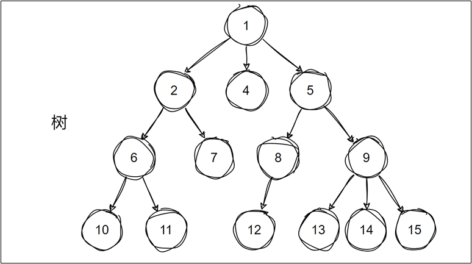

树的常见术语：

- 父结点：结点的上层结点。
- 子结点：结点的下层结点。
- 根结点：位于树的顶端，没有父结点的结点。
- 叶结点：位于树的底端，没有子结点的结点。
- 边：连接两个结点的线段。
- 结点的度：结点的子结点数量。例如：普通二叉树的度是2，而5阶B+的度是5。
- 结点的层：从根开始定义起，根为第1层，根的子结点为第2层，以此类推。
- 结点的深度：从根结点到该结点所经过的边的数量，根的深度为0。
- 结点的高度：从距离该结点最远的叶结点到该结点所经过的边的数量，所有叶结点的高度为0。
- 树的深度（高度）：从根结点到最远叶结点所经过的边的数量。

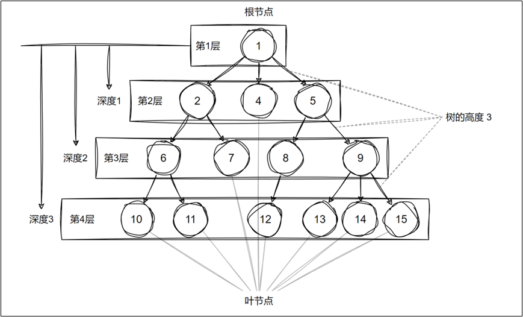

### 2.6.2 二叉树简介

树形结构中最具代表性的一种就是二叉树（Binary Tree）。二叉树规定，每个结点最多只能有两个子结点，两个子结点分别被称为左子结点和右子结点。以左子结点为根结点的子树被称为左子树，以右子结点为根结点的子树被称为右子树。

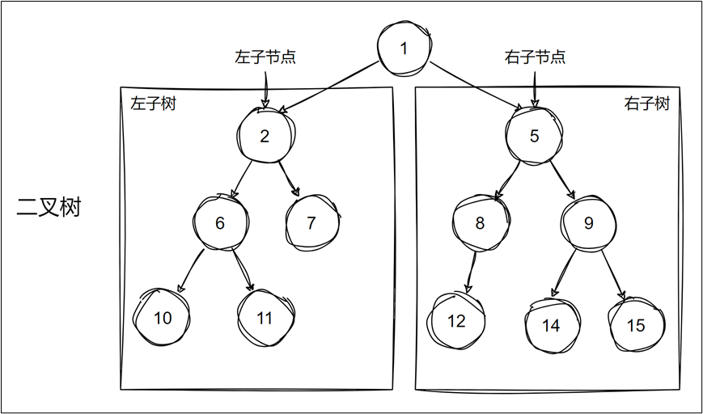

### 2.6.3 二叉树的存储结构

#### 1、数组结构

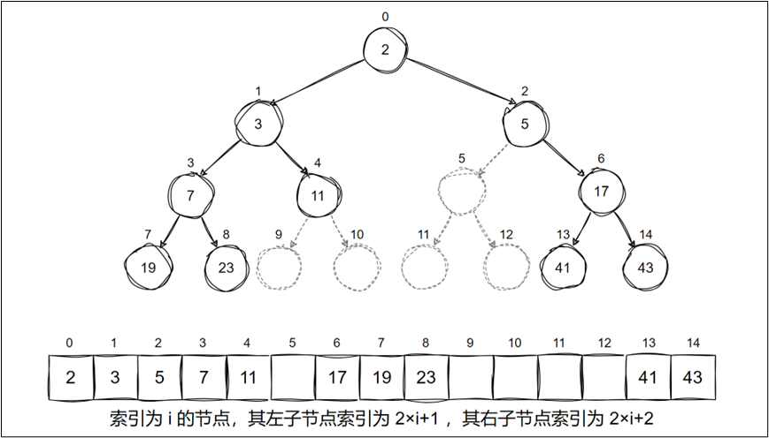

采用数组结构存储二叉树，访问与遍历速度较快。但不适合存储数据量过大的树，且增删效率较低，而且树中存在大量None的情况下空间利用率较低，因此不是主流方式。

#### 2、链式结构

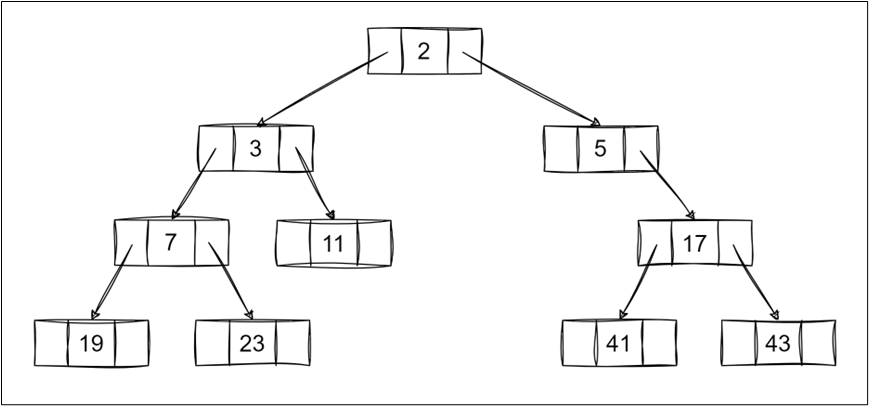

### 2.6.4 常见的二叉树

#### 1、满二叉树

满二叉树所有层的结点都被完全填满，满二叉树也是一种完全二叉树。

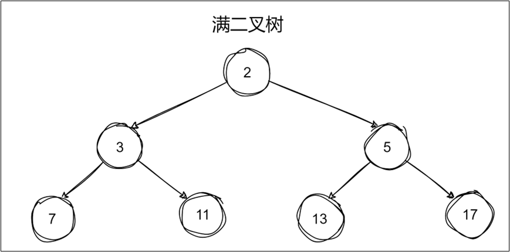

> 常见面试题：
>
> （1）n层的满二叉树的总结点数量是多少？
>
> （2）n层的满二叉树的叶子结点数量是多少？

#### 2、完全二叉树

完全二叉树只有最下面一层的结点未被填满，且靠左填充。叶子结点只能出现在最下面的2层，最下面一层的叶子结点靠左。

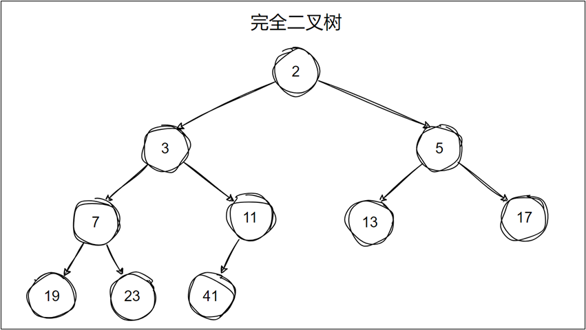

#### 3、堆（完全二叉树之一）

堆（Heap）是一种满足特定条件的完全二叉树，主要可分为两种类型：

- 大顶堆：每个父结点的值都大于等于其子结点的值。根结点为树中的最大值。
- 小顶堆：每个父结点的值都小于等于其子结点的值。根结点为树中的最小值。

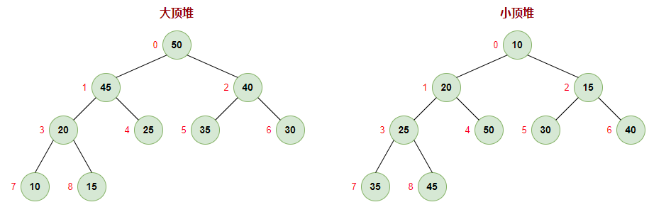

数组是实现堆的最优选择，堆的本质是完全二叉树，而完全二叉树的节点序号可以和数组的索引一一对应，这种映射关系不需要额外存储指针，空间效率和操作效率都很高。节点索引的计算规则（假设数组索引从 0 开始）

- 索引为 `i` 的节点，左孩子索引 = `2i+1`
- 索引为 `i` 的节点，右孩子索引 = `2i+2`
- 索引为 `i` 的节点，父节点索引 = `(i-1)//2`

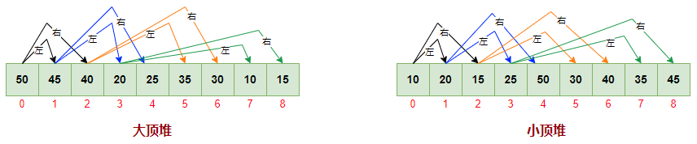

#### 4、霍夫曼树（带权路径长度最短的二叉树）

霍夫曼树又称最优二叉树，是一种带权路径长度最短的二叉树，通常用于数据压缩，它的构建基于字符出现频率的概率。

> 概念分析

设二叉树具有n个带权值的叶子结点，那么从根结点到各个叶子结点的路径长度与相应结点权值的乘积的和，叫做二叉树的带权路径长度WPL（Weighted Path Length）。

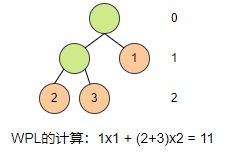

相同的叶子结点构造出不同的二叉树，它们的WPL也不相同，例如：

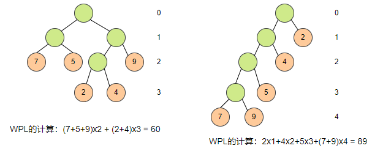

<font color='red'>具有最小带权路径长度的二叉树称为哈夫曼树（也称为最优树）。</font>

> 如何构建一个哈夫曼树？

⭐构建哈夫曼树的原则：

- 权值越大的叶子结点越靠近根结点。
- 权值越小的叶子结点越远离根结点。

> 示例：例如 W = {5, 29, 7, 8, 14, 23, 3, 11} 

（1）取权值最小的2个结点，构建二叉树，父结点为它俩的和N1。

（2）如果N1值与W剩下的某结点相同，那么再从W剩下的结点中取权值最小的2个结点，构建二叉树，父结点为它俩的和N2。

（3）从W剩下的结点中找权值最小的结点与Min(N1，N2)构建二叉树，父结点为它俩的和N1或N2代替刚刚的N1或N2。

（4）重复（3），直到W中所有结点都取完，此时构建的二叉树就是一个哈夫曼树

结果：哈夫曼树的叶子结点就是W中各个权值。

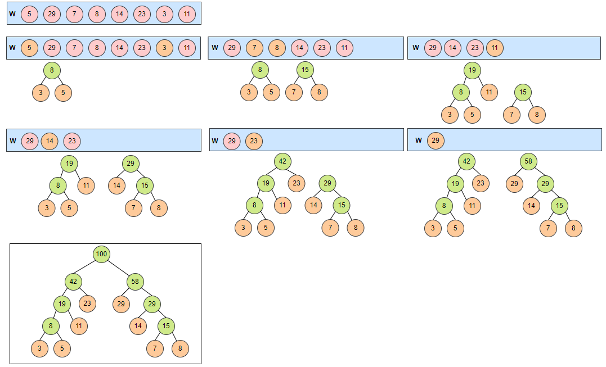

> 哈夫曼树的应用：哈夫曼编码

规定哈夫曼树中的左分支的边为0，右分支的边为1，则从根结点到每一个叶子结点所有经过的边对应的0和1组成的序列便为该叶子结点对应的编码。这样的编码称为哈夫曼编码。

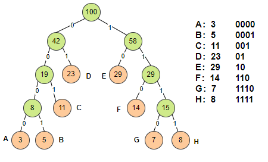

在一组字符的哈夫曼编码中，不可能出现一个字符的哈夫曼编码是另一个字符哈夫曼编码的前缀。所以`哈夫曼编码也称为前缀编码`。只有这样一串字符经过哈夫曼编码后，能重新解码回来。

```
ACDAB...的编码：01100001,01100011,01100100,01100001,01100010（未压缩）
                   97      99        100       97       98
               0110000101100011011001000110000101100010（8位一组）
```

```
ACDAB...的编码：0000,001,01,0000,0001,...（压缩）
               00000010100000001...（不可能出现一个字符的哈夫曼编码是另一个字符哈夫曼编码的前缀）
```


#### 5、二叉搜索树

二叉搜索树中的每个结点的值，大于其左子树中的所有结点的值，并且小于右子树中的所有结点的值。

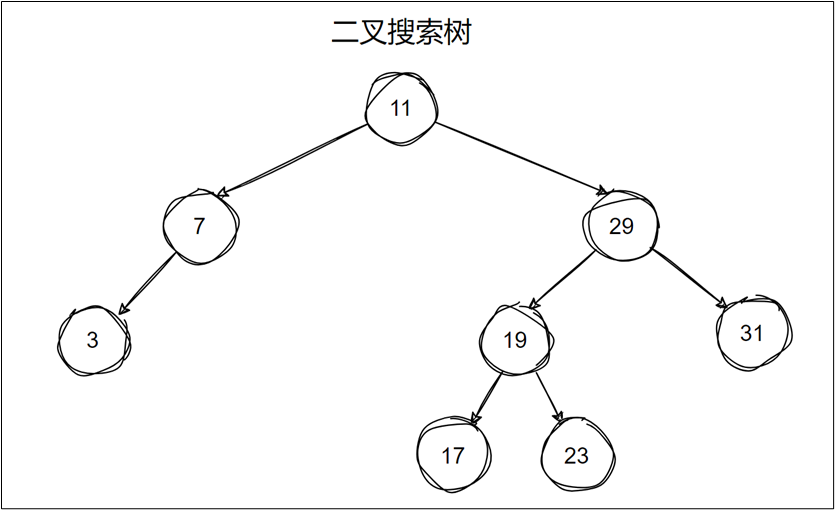

#### 6、平衡二叉树

平衡二叉树中任意结点的左右子树高度之差不超过1。

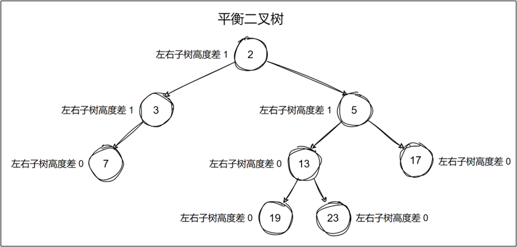

#### 7、AVL（自平衡二叉搜索树之一）

AVL 树的全称是**Adelson-Velsky and Landis Tree**。它是以两位发明者 **G. M. Adelson-Velsky** 和 **E. M. Landis** 的名字命名的，是最早被发明的**自平衡二叉搜索树**，插入和删除时会进行旋转操作来保证树的平衡性。

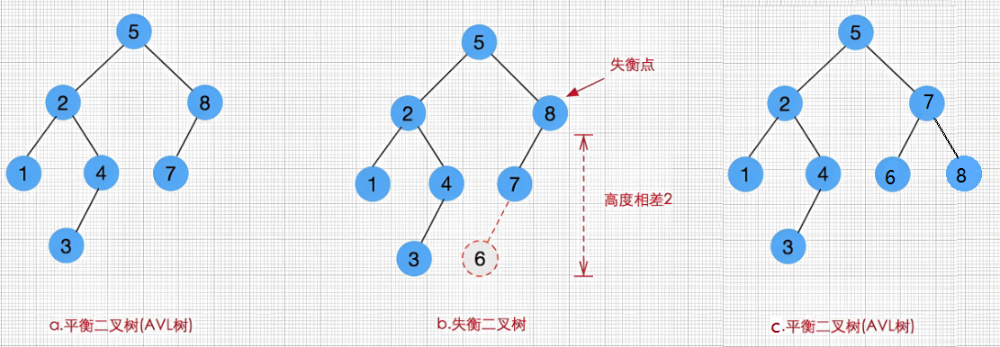

#### 8、红黑树（特殊的二叉搜索树）

红黑树是一种特殊的二叉搜索树，除了二叉搜索树的要求外，它还具有以下特性：

- 每个结点或者是黑色，或者是红色。
- 根结点是黑色。
- 每个叶结点都是黑色。这里叶结点是指为空（None）的结点。
- 红色结点的两个子结点必须是黑色的。即从每个叶到根的所有路径上不能有两个连续的红色结点。
- 从任一个结点到其每个叶的所有路径上包含相同数目的黑色结点。

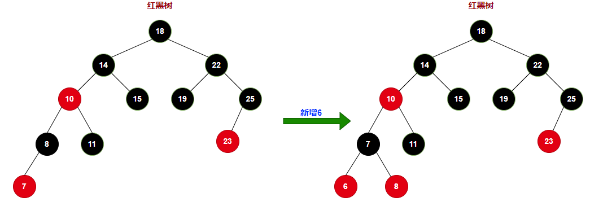

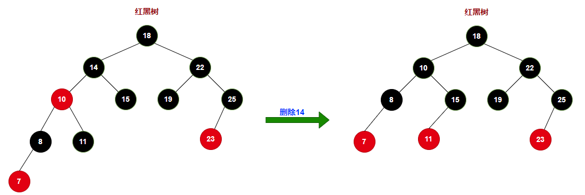


#### 9、B树（自平衡的多路查找树）

B树是一种自平衡的多路查找树。虽然它不是严格意义上的二叉树，但与二叉树的结构类似。经常用于数据库、文件系统等需要磁盘访问的应用。

> B树的引入

二叉搜索树、AVL、红黑树等都是将所有结点数据先加载到内存，然后构建树。如果数据量很大，那么内存压力就很大，所以数据只能存储在硬盘中。例如：这是一个二叉搜索树，

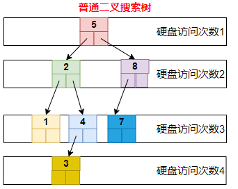

我们发现查找目标元素，访问硬盘的次数与树高成正比，例如查找3需要访问4次硬盘。而硬盘的访问速度远远低于内存的，那么在不得不使用硬盘存储树的数据，而又能降低硬盘的访问次数，就成了新问题方向。其中一个思路就是在数据量不变的情况下，降低树的高度，此时B树就应运而生了。例如：这是一个5阶B树的样例：

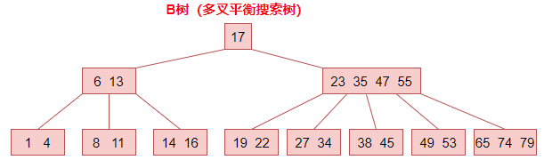

⭐B树需要满足如下3个特征：

- 平衡性：所有的叶子结点都在同一层
- 有序性：结点内有序，且任意一个元素的左子树都小于它，右子树都大于它
- 多路：对于m阶B树
  - 最多：一个结点最多有m个分支，且结点本身最多有m-1个元素。
  - 最少：根结点如果不是叶子结点，那么根结点至少有2个分支，1个元素。其他结点至少要有m/2个分支，m/2 - 1个元素。
  - 必须满足每一个结点的分支数量 = 元素数量 + 1。 
  - 即根结点分支数范围[2, m]，元素个数范围[1, m-1]；其他结点分支数范围[⌈m/2⌉, m] ，元素个数范围[⌈m/2⌉ − 1, m − 1]。
  - 此处m/2**向上取整**。
  - 例如5阶B树，根结点分支数范围[2, 5]，元素个数范围[1, 4]；其他结点分支数范围[3, 5] ，元素个数范围[2, 4]。

> B树的查找

🔔注意B树访问结点是在硬盘上进行的，而结点内的查找是在内存中进行的。结点内查找可以使用顺序查找和二分查找（因为结点内也是有序的）。

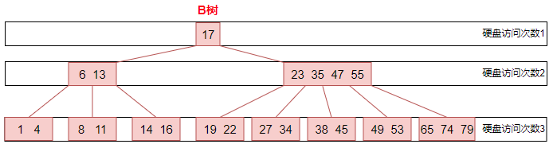

以查找16为例，需要访问硬盘3次。由此可见使用B树，可以降低树的高度，从而减少硬盘访问次数。

> B树插入元素

- 先查找到插入的位置进行插入。
- 如果插入元素后，当前结点元素个数没有超过上限，称为没有上溢出，无需调整。
- 如果插入元素后导致当前结点元素个数超过上限，称为上溢（overflew），则中间元素(m/2)上移（索引0开始的话，m/2向下取整），它两边元素分裂为2个分支，直到没有需要上溢的为止。

以3阶B树为例：根结点分支数范围[2,3]，元素个数范围[1,2]；其他结点分支数范围[2,3]，元素个数范围[1,2]，且每一个结点的分支数量 = 元素数量+1.。

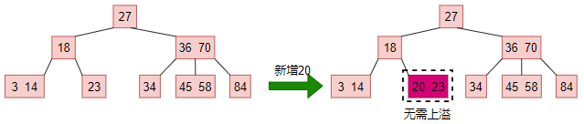

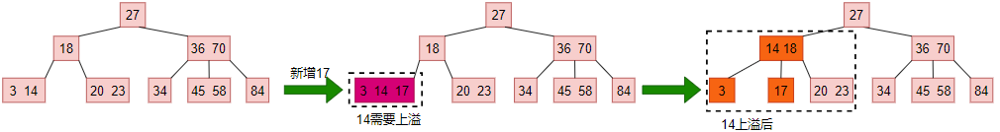

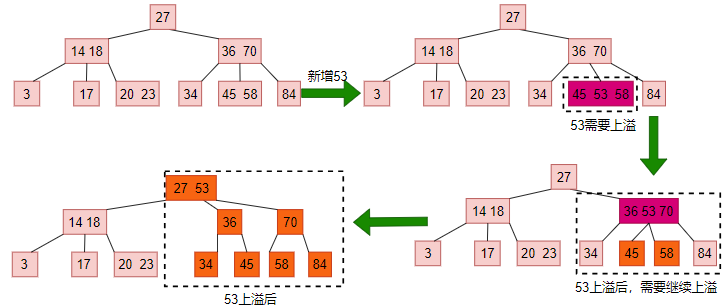

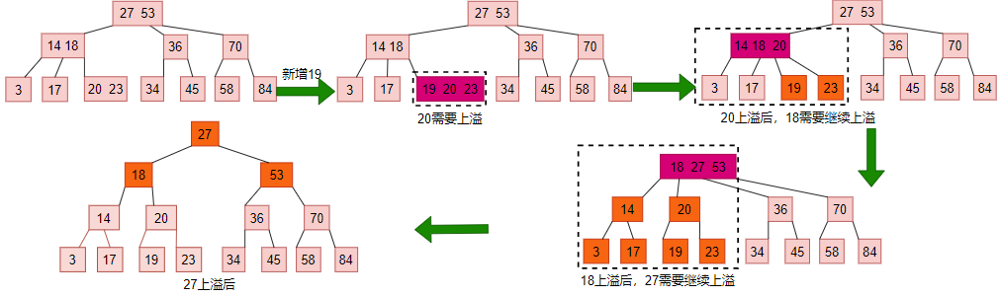

> B树删除元素

- 先查找到删除的位置进行元素删除。
- 如果删除元素后，当前结点元素个数没有低于下限，称为没有下溢出，无需调整。
- 如果删除元素后导致当前结点元素个数低于下限，称为下溢（underflew），需要通过**旋转（向兄弟借一个关键字）**或**合并结点**解决。
  - 如果左兄弟结点的元素个数够，优先向左兄弟借。
  - 如果左兄弟结点的元素个数不够，向右兄弟借。
  - 如果左右兄弟结点的元素个数都不够，向父结点借，并且与左兄弟结点合并。

以3阶B树为例：根结点分支数范围[2,3]，元素个数范围[1,2]；其他结点分支数范围[2,3]，元素个数范围[1,2]，且每一个结点的分支数量 = 元素数量+1。

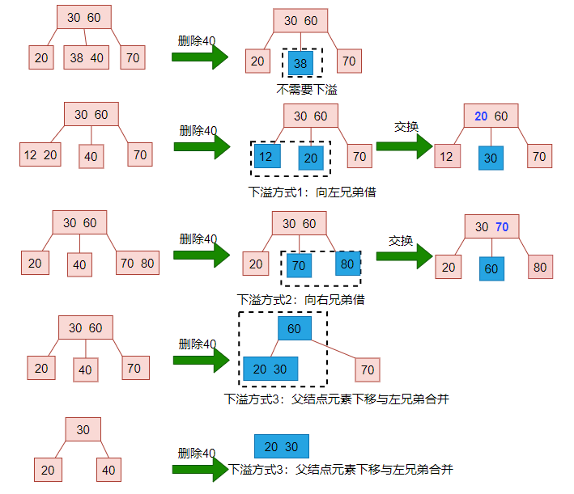

#### 10、B+树（通过链表优化的B树）

B+树是B树的优化版本。它通过将数据集中存储在叶子结点并通过链表连接来实现高效的范围查询，并且非叶子结点仅存储索引，提高了磁盘利用率。

> B+树的引入

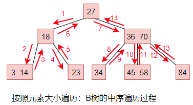

当一颗B树需要按照元素大小顺序遍历时，可以采用中序遍历，则遍历过程需要在结点之间来回移动，效率比较低。因此引入了B+树来解决这个问题。

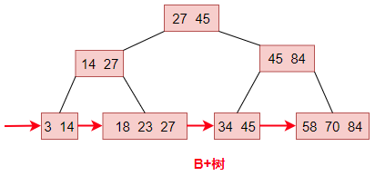

> B+树的应用：被广泛作为数据库的索引结构

如果以B树来构建数据库记录的索引结构，例如：以学生表的id为索引

| id   | name | score | tel         | card_id            |
| ---- | ---- | ----- | ----------- | ------------------ |
| 3    | 张三 | 86    | 13785695326 | 110536200205092356 |
| 18   | 李四 | 89    | 18285695321 | 110536200211022587 |
| 14   | 王五 | 96    | 13685695322 | 110536200212081234 |
| 23   | 赵六 | 75    | 13585695323 | 110536200201285563 |
| 27   | 钱七 | 68    | 13285695324 | 110536200202078526 |
| 34   | 刘大 | 93    | 13885695325 | 110536200203157548 |
| 45   | 宋玉 | 75    | 13985695326 | 110536200204243692 |
| 36   | 王凯 | 77    | 13185695327 | 110536200205168752 |
| 70   | 马上 | 88    | 15485695328 | 110536200205122251 |
| 58   | 佟刚 | 89    | 18385695329 | 110536200205263692 |
| 84   | 大海 | 93    | 18585695320 | 110536200202182683 |

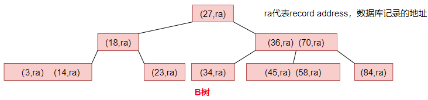

如果以单个id值（例如：id=34）查询，那么效率正常。但是如果要按照id从小到大排序输出学生信息，或查询id在[20, 50]范围的学生信息，基于上述B树的查询效率比较低。

而如果以B+树构建索引结构：

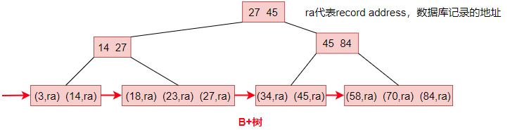

无论以单个id值（例如：id=34）查询，还是按照id从小到大排序输出学生信息，或查询id在[20, 50]范围的学生信息，效率都比较高。

> ⭐对比
>
> B树所有结点的关键字都有直接指向对应记录的指针，B树支持随机查找，但不支持顺序查找。
>
> B+树的叶子结点包含全部关键字及其指向相应记录的指针，而非叶子结点只作索引。B+树兼顾顺序查找和随机查找。B+树内部节点的关键字，必须是其对应子树中叶子节点的**最大 / 最小边界值**


### 2.6.5 二叉搜索树的实现

#### 1、二叉搜索树的功能定义

| **方法**                   | **说明**               |
| -------------------------- | ---------------------- |
| **size()**                 | 返回树中结点个数       |
| **is_empty()**             | 判断树是否为空         |
| **search(item)**           | 查找结点是否存在       |
| **add(item)**              | 向二叉搜索树中插入结点 |
| **remove(item)**           | 从二叉搜索树中删除结点 |
| **for_each(func,  order)** | 按指定方式遍历二叉树   |

#### 2、二叉搜索树的创建

```python
"""
    二叉搜索树
"""
from collections import deque

class Node:
    """
        二叉搜索树的结点
    """
    def __init__(self, data, left=None, right=None):
        self.data = data
        self.left = left
        self.right = right


class BinarySearchTree:
    """
        二叉搜索树
    """
    def __init__(self):
        """
        初始化二叉搜索树
        """
        self.__root = None
        self.__size = 0

    @property
    def size(self):
        """返回树中结点的个数"""
        return self.__size

    def is_empty(self):
        """判断树是否为空"""
        return self.__size == 0
```

#### 3、二叉搜索树的查询

查找时先与当前结点比较大小，等于则找到了目标结点，小于则向左子结点查找，大于则向右子结点查找。如果查找到None仍未找到则说明该结点不在树中。

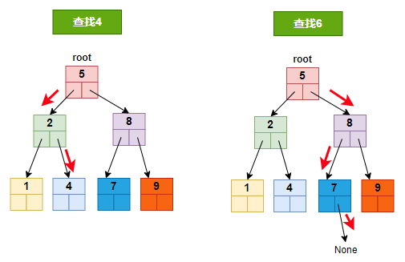

后续插入与删除操作也会用到查找，所以此处提供一个__search_pos()方法，返回查找到的结点和其父结点供后续使用。

```python
    def search(self, item):
        """查找结点是否存在"""
        return self.__search_pos(item)[0] is not None

    def __search_pos(self, item):
        """查找结点，返回(结点,父结点)。如果结点不存在则为None，此时父结点为一个叶结点"""
        parent = None
        current = self.__root
        while current:
            if item == current.data:
                break
            parent = current
            current = current.left if item < current.data else current.right
        return current, parent
```

#### 4、二叉搜索树的插入

插入时先执行查找操作，查找时保存当前结点的父结点。如果找到了结点则说明树中已有此元素，退出。如果找到了None，此时None的父结点为叶结点，应将该元素插入该叶结点的子结点。

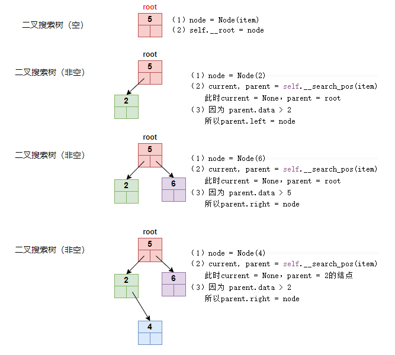

```python
    def add(self, item):
        """插入结点"""
        node = Node(item)
        if self.is_empty():
            self.__root = node
        else:
            current, parent = self.__search_pos(item)
            # 如果结点之前已存在则返回
            if current:
                return
            # 如果结点之前不存在，则插入父结点的左结点或右结点
            if parent.data > item:
                parent.left = node
            else:
                parent.right = node
        self.__size += 1
```

#### 5、二叉搜索树的删除

需要保证删除结点后仍然保证二叉搜索树的性质。删除操作需要根据目标结点的子结点数量为0、1、2分三种情况。

1）目标结点的子结点数量为0：直接删除目标结点。

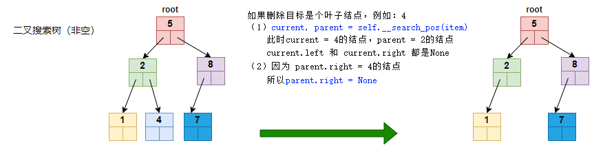

2）目标结点的子结点数量为1：将目标结点替换为其子结点。

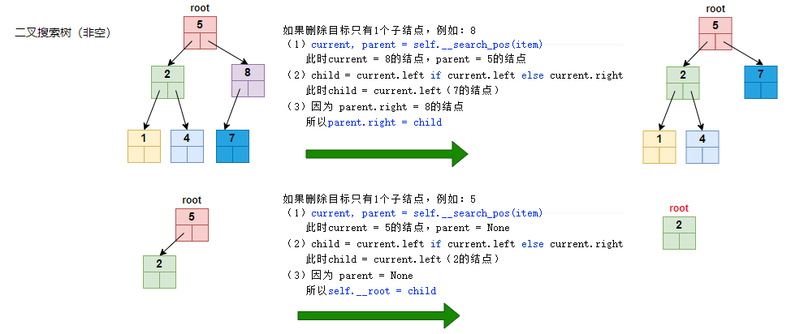

3）目标结点的子结点数量为2：使用目标结点的右子树最小结点、或左子树最大结点替换目标结点。

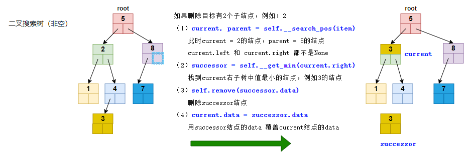

```python
    def remove(self, item):
        """删除结点"""
        current, parent = self.__search_pos(item)
        if not current:
            return

        # 如果删除的是叶结点（没有子结点）
        if not current.left and not current.right:
            if parent:
                if parent.left == current:
                    parent.left = None
                else:
                    parent.right = None
            else:
                # 如果没有父结点，说明是根结点
                self.__root = None

        # 如果删除的结点只有一个子结点
        elif not current.left or not current.right:
            child = current.left if current.left else current.right
            if parent:
                if parent.left == current:
                    parent.left = child
                else:
                    parent.right = child
            else:
                # 如果没有父结点，说明是根结点
                self.__root = child

        # 如果删除的结点有两个子结点
        else:
            # 找到中序后继（右子树中最小的结点）
            successor = self.__get_min(current.right)
            # 删除中序后继结点
            self.remove(successor.data)
            # 因为current只是把值替换，没有删除
            self.__size += 1
            # 用中序后继的值替代当前结点
            current.data = successor.data

        self.__size -= 1

    def __get_min(self, node):
        """找到当前子树的最小结点"""
        current = node
        while current.left:
            current = current.left
        return current

```

#### 6、二叉搜索树的遍历

##### 1、深度优先遍历

深度优先搜索（DFS，Depth First Search）尽可能地深入每一个分支，直到不能再深入为止，然后回溯到上一个结点，继续尝试其他的分支。

深度优先遍历又分为：

- 前序遍历：根左右
- 中序遍历：左根右
- 后序遍历：左右根

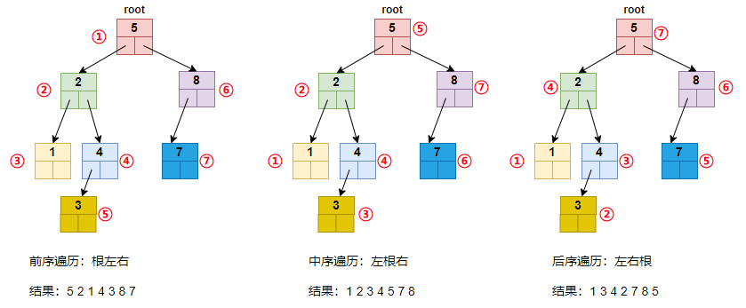

```python
    def __inorder_traversal(self, func):
        """深度优先搜索：中序遍历"""
        def inorder(node):
            if node:
                inorder(node.left)
                func(node.data)
                inorder(node.right)
        inorder(self.__root)

    def __preorder_traversal(self, func):
        """深度优先搜索：前序遍历"""
        def preorder(node):
            if node:
                func(node.data)
                preorder(node.left)
                preorder(node.right)
        preorder(self.__root)

    def __postorder_traversal(self, func):
        """深度优先搜索：后序遍历"""
        def postorder(node):
            if node:
                postorder(node.left)
                postorder(node.right)
                func(node.data)
        postorder(self.__root)
```

##### 2、广度优先遍历

（1）层序遍历

广度优先搜索（BFS，Breadth First Search）从起始结点开始，首先访问该结点的所有子结点，然后再访问子结点的子结点，依此类推，逐层访问结点。

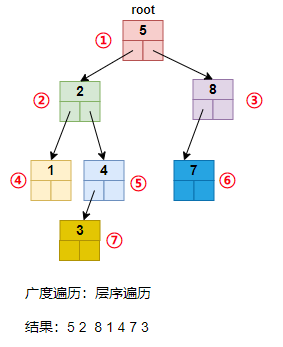

广度优先搜索一般使用队列实现，每访问一个结点，就将该结点的子结点添加进队列中。

```python
    def __levelorder_traversal(self, func):
        """广度优先搜索：层序遍历"""
        queue = deque()
        queue.append(self.__root)
        while queue:
            node = queue.popleft()
            func(node.data)
            if node.left:
                queue.append(node.left)
            if node.right:
                queue.append(node.right)
```

##### 3、二叉搜索树的遍历

```python
    def for_each(self, func, order="inorder"):
        """遍历树，默认中序遍历"""
        match order:
            case "inorder":
                self.__inorder_traversal(func)
            case "preorder":
                self.__preorder_traversal(func)
            case "postorder":
                self.__postorder_traversal(func)
            case "levelorder":
                self.__levelorder_traversal(func)
```

#### 7、完整代码

> 二叉搜索树

```py
"""
    二叉搜索树
"""
from collections import deque

class Node:
    """
        二叉搜索树的结点
    """
    def __init__(self, data, left=None, right=None):
        self.data = data
        self.left = left
        self.right = right


class BinarySearchTree:
    """
        二叉搜索树
    """
    def __init__(self):
        """
        初始化二叉搜索树
        """
        self.__root = None
        self.__size = 0

    @property
    def size(self):
        """返回树中结点的个数"""
        return self.__size

    def is_empty(self):
        """判断树是否为空"""
        return self.__size == 0

    def search(self, item):
        """查找结点是否存在"""
        return self.__search_pos(item)[0] is not None

    def __search_pos(self, item):
        """查找结点，返回(结点,父结点)。如果结点不存在则为None，此时父结点为一个叶结点"""
        parent = None
        current = self.__root
        while current:
            if item == current.data:
                break
            parent = current
            current = current.left if item < current.data else current.right
        return current, parent

    def add(self, item):
        """插入结点"""
        node = Node(item)
        if self.is_empty():
            self.__root = node
        else:
            current, parent = self.__search_pos(item)
            # 如果结点之前已存在则返回
            if current:
                return
            # 如果结点之前不存在，则插入父结点的左结点或右结点
            if parent.data > item:
                parent.left = node
            else:
                parent.right = node
        self.__size += 1

    def remove(self, item):
        """删除结点"""
        current, parent = self.__search_pos(item)
        if not current:
            return

        # 如果删除的是叶结点（没有子结点）
        if not current.left and not current.right:
            if parent:
                if parent.left == current:
                    parent.left = None
                else:
                    parent.right = None
            else:
                # 如果没有父结点，说明是根结点
                self.__root = None

        # 如果删除的结点只有一个子结点
        elif not current.left or not current.right:
            child = current.left if current.left else current.right
            if parent:
                if parent.left == current:
                    parent.left = child
                else:
                    parent.right = child
            else:
                # 如果没有父结点，说明是根结点
                self.__root = child

        # 如果删除的结点有两个子结点
        else:
            # 找到中序后继（右子树中最小的结点）
            successor = self.__get_min(current.right)
            # 删除中序后继结点
            self.remove(successor.data)
            # 因为current只是把值替换，没有删除
            self.__size += 1
            # 用中序后继的值替代当前结点
            current.data = successor.data

        self.__size -= 1

    def __get_min(self, node):
        """找到当前子树的最小结点"""
        current = node
        while current.left:
            current = current.left
        return current

    def for_each(self, func, order="inorder"):
        """遍历树，默认中序遍历"""
        match order:
            case "inorder":
                self.__inorder_traversal(func)
            case "preorder":
                self.__preorder_traversal(func)
            case "postorder":
                self.__postorder_traversal(func)
            case "levelorder":
                self.__levelorder_traversal(func)

    def __inorder_traversal(self, func):
        """深度优先搜索：中序遍历"""
        def inorder(node):
            if node:
                inorder(node.left)
                func(node.data)
                inorder(node.right)
        inorder(self.__root)

    def __preorder_traversal(self, func):
        """深度优先搜索：前序遍历"""
        def preorder(node):
            if node:
                func(node.data)
                preorder(node.left)
                preorder(node.right)
        preorder(self.__root)

    def __postorder_traversal(self, func):
        """深度优先搜索：后序遍历"""
        def postorder(node):
            if node:
                postorder(node.left)
                postorder(node.right)
                func(node.data)
        postorder(self.__root)

    def __levelorder_traversal(self, func):
        """广度优先搜索：层序遍历"""
        queue = deque()
        queue.append(self.__root)
        while queue:
            node = queue.popleft()
            func(node.data)
            if node.left:
                queue.append(node.left)
            if node.right:
                queue.append(node.right)
```

> 测试代码

```python
# 测试
if __name__ == "__main__":
    print("创建一个二叉树...")
    tree = BinarySearchTree()

    print("开始添加元素...")
    tree.add(5)
    tree.add(2)
    tree.add(1)
    tree.add(4)
    tree.add(8)
    tree.add(7)
    tree.add(3)
    print("二叉树当前状态：",end = "")
    tree.for_each(lambda x: print(x, end=" "))
    print()

    print("查找元素5...")
    if tree.search(4):
        print("4在二叉树中")
    else:
        print("4在二叉树中未找到")

    print("前序遍历二叉树...")
    tree.for_each(lambda x: print(x, end=" "), order="preorder")
    print()

    print("中序遍历二叉树...")
    tree.for_each(lambda x: print(x, end=" "))
    print()

    print("后序遍历二叉树...")
    tree.for_each(lambda x: print(x, end=" "), order="postorder")
    print()

    print("层序遍历二叉树...")
    tree.for_each(lambda x: print(x, end=" "), order="levelorder")
    print()
    print()

    print("删除元素2...")
    tree.remove(2)
    print("二叉树当前状态：", end="")
    tree.for_each(lambda x: print(x, end=" "))
    print()

    print("删除元素8...")
    tree.remove(8)
    print("二叉树当前状态：", end="")
    tree.for_each(lambda x: print(x, end=" "))
    print()

    print("删除元素4...")
    tree.remove(4)
    print("二叉树当前状态：", end="")
    tree.for_each(lambda x: print(x, end=" "))
    print()
```


## 2.7 图

### 2.7.1 图的概述

前面我们学习了线性结构和树，线性结构局限于只有一个直接前驱和一个直接后继的关系，树也只能有一个直接前驱，也就是父结点，当我们需要表示多对多的关系时，就需要用到图了，图是比树更普遍的结构，可以认为树是一种特殊的图。图由结点和边组成。

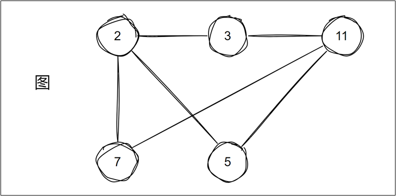

图的常见术语：

- 结点：也称为顶点，是图的基础部分。
- 边：连接两个结点，也是图的基础部分。可以是单向的，也可以是双向的。
- 权重：边可以添加“权重”变量。
- 邻接：两结点之间存在边，则称这两个结点邻接。
- 度：一个结点的边的数量。入度为指向该结点的边的数量，出度为该结点指向其他结点的边的数量。
- 路径：从一结点到另一结点所经过的边的序列。
- 环：首尾结点相同的路径。

### 2.7.2 图的分类

#### 1、有向图和无向图

- 有向图：边是单向的。
- 无向图：边是双向的。

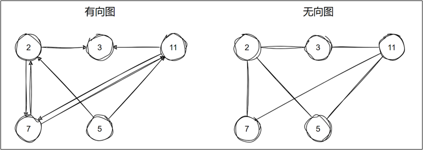

#### 2、连通图和非连通图

- 连通图：从某个结点出发，可以到达其余任意结点。
- 非连通图：从某个结点出发，有结点不可达。

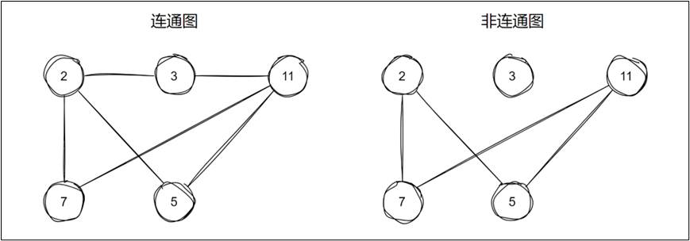

### 2.7.3 图的表示法

#### 1、邻接矩阵表示法

邻接矩阵用一个n×n的矩阵来表示有n个结点之间的关系，矩阵的每一行（列）代表一个结点，矩阵m行n列的值代表是否存在由m指向n的边。邻接矩阵适合存储稠密图。

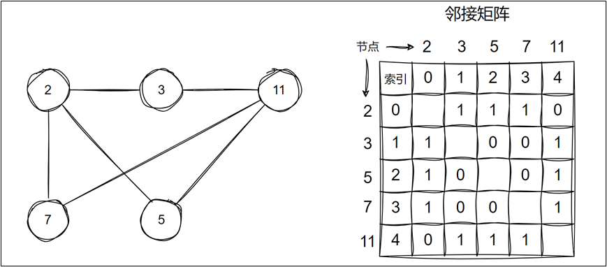

#### 2、邻接表表示法

邻接表存储n个链表、列表或其他容器，每个容器存储该结点的所有邻接结点。邻接表适合存储稀疏图，空间效率高，尤其在处理边远少于结点的图时表现优越，但在进行边查找时不如邻接矩阵高效。

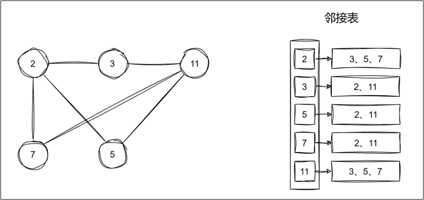

### 2.7.4 图的遍历

1）广度优先搜索

广度优先搜索（BFS，Breadth First Search）从起始结点开始，首先访问该结点的所有邻接结点，然后再访问邻接结点的邻接结点，依此类推，逐层访问结点。

- 从图的起始结点开始，首先访问该结点，并标记为已访问。
- 然后依次访问所有未被访问的邻接结点，并将它们加入到队列中。
- 当队列中的结点被访问时，继续访问它的邻接结点，并将新的结点加入队列。
- 直到队列为空，表示所有结点都已被访问。

```
例如：无向图
     A
    / \
   B   C
  / \   \
 D   E - F
 
 从顶点 A 开始的 BFS 遍历结果：
A -> B -> C -> D -> E -> F
（解释：第一层：A；第二层：B, C；第三层：D, E, F）
```

2）深度优先搜索

深度优先搜索（DFS，Depth First Search）尽可能地深入到图的每一个分支，直到不能再深入为止，然后回溯到上一个结点，继续尝试其他的分支。

- 从图的一个起始结点开始，访问这个结点并标记为已访问。
- 对于每个未访问的邻接结点，递归地执行 DFS，直到没有未访问的邻接结点。
- 当回溯到一个结点时，继续访问它的其他邻接结点。

```
例如：无向图
     A
    / \
   B   C
  / \   \
 D   E - F
 
 从顶点 A 开始的 DFS 遍历结果：
一种可能路径：A -> B -> D -> E -> F -> C
（解释：A出发，到B，到D（尽头），回溯到B，再到E，E到F，F到C）
```
