# 第3章 算法

## 3.1 查找算法

### 3.1.1 二分查找

二分查找又称折半查找，适用于有序列表。其利用数据的有序性，每轮缩小一半搜索范围，直至找到目标元素或搜索区间为空为止。

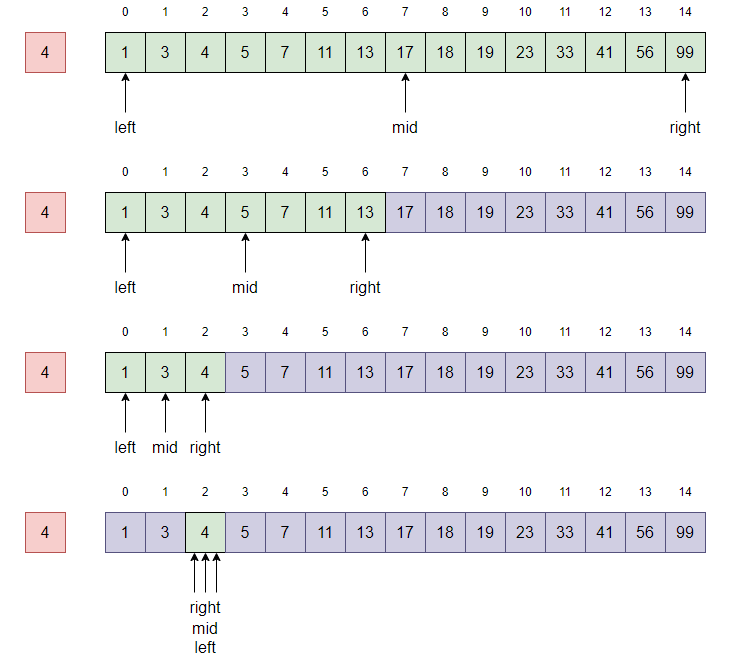

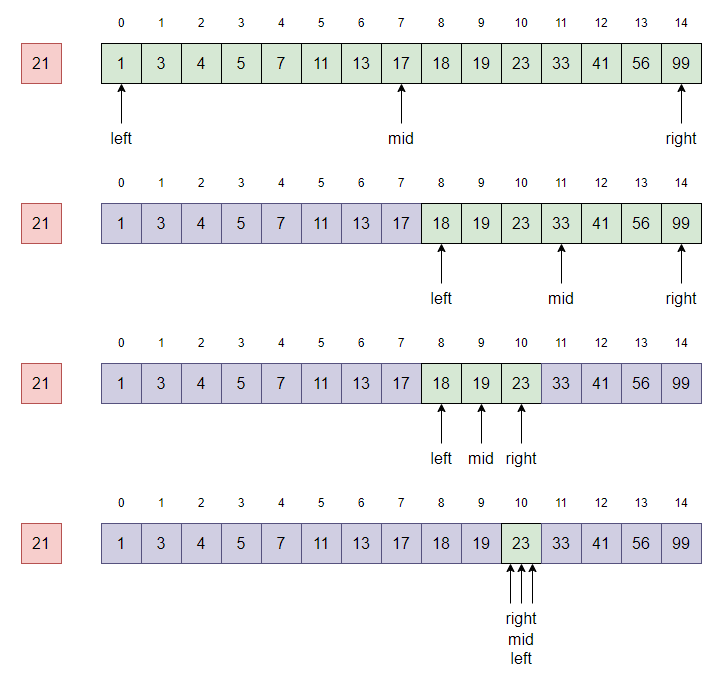

> 基本步骤


（1）初始化边界：设置左边界 left = 0，右边界 right = len(array) - 1

（2）循环条件：当 left <= right 时继续查找

（3）计算中点：mid = left + (right - left) // 2（避免整数溢出）

（4）比较判断：

- 如果 array[mid] == target，找到目标，返回索引
- 如果 array[mid] < target，目标在右半部分，更新 left = mid + 1
- 如果 array[mid] > target，目标在左半部分，更新 right = mid - 1

（5）未找到：循环结束后仍未找到，返回 -1 或其他标识

> 实现代码

```python
"""
    二分查找
"""
def binary_search(arr, target):
    """二分查找，arr序列必须是从小到大排序的"""
    left, right = 0, len(arr) - 1
    while left <= right:
        mid = left + (right - left) // 2
        if arr[mid] == target:
            return mid
        elif arr[mid] < target:
            left = mid + 1
        else:
            right = mid - 1
    return -1

# 测试
if __name__ == '__main__':
    print(binary_search([1, 12, 13, 24, 35, 46, 57, 68, 79], 5))
    print(binary_search([1, 12, 13, 24, 35, 46, 57, 68, 79], 68))
```

> 复杂度分析

（1）时间复杂度：在循环中，区间每轮缩小一半，因此时间复杂度为O(logn)。

（2）空间复杂度：使用常数大小的额外空间，空间复杂度为O(1)。

（3）前提条件：数组必须是有序的（升序或降序）

> 思考题：如果元素有重复的，需要找出目标值的区间，怎么做？
>
> 例如：[1, 3, 3, 3, 3, 3, 3,  8, 9, 12, 15]，查找目标值3的区间

```python
def binary_search(arr, target):
    """二分查找，arr序列必须是从小到大排序的"""
    left, right = 0, len(arr) - 1
    while left <= right:
        mid = left + (right - left) // 2
        if arr[mid] == target:
            start = mid - 1
            end = mid + 1
            while arr[start] == target and start >= 0:
                start -=1
            while arr[end] == target and end < len(arr):
                end +=1
            return (start+1,end-1)
        elif arr[mid] < target:
            left = mid + 1
        else:
            right = mid - 1
    return -1

# 测试
if __name__ == '__main__':
    print(binary_search([1, 3, 3, 3, 3, 3, 3,  8, 9, 12, 15], 3))
    print(binary_search([1, 3, 3, 3, 3, 3, 3,  8, 9, 12, 15], 15))
    print(binary_search([1, 3, 3, 3, 3, 3, 3,  8, 9, 12, 15], 2))
```

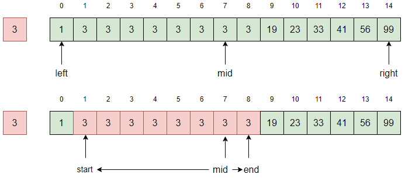

或

```python
def binary_search(arr, target):
    start = -1
    end = len(arr)-1

    # 查找target的左边界
    left,right = 0,len(arr)-1
    while left <= right:
        mid = left + (right - left) // 2
        if arr[mid] == target:
            start = mid
            right = mid - 1
        elif arr[mid] < target:
            left = mid + 1
        else:
            right = mid - 1
            end = right

    if start == -1:
        return (-1,)

    # 在[start, end]范围内继续二分查找target的右边界
    left = start
    right = end
    while left <= right:
        mid = left + (right - left) // 2
        if arr[mid] == target:
            end = mid
            left = mid + 1
        elif arr[mid] < target:
            left = mid + 1
        else:
            right = mid - 1
    return (start,end) if start != end else (start,)

# 测试
if __name__ == '__main__':
    print(binary_search([1, 3, 3, 3, 3, 3, 3,  8, 9, 12, 15,20,25,26,29,30,35,38,40], 3))
    print(binary_search([1, 3, 3, 3, 3, 3, 3,  8, 9, 12, 15], 15))
    print(binary_search([1, 3, 3, 3, 3, 3, 3,  8, 9, 12, 15], 2))
```

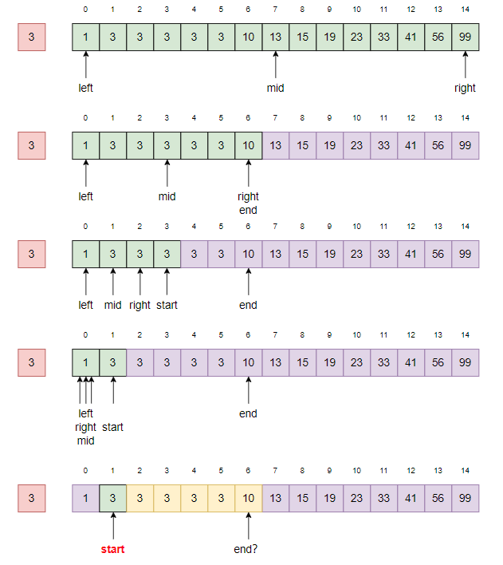

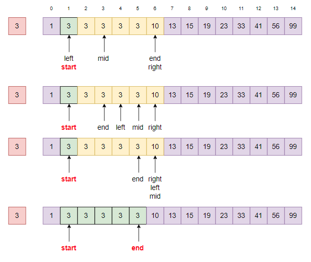

### 3.1.2 查找多数元素

> 力扣169题https://leetcode.cn/problems/majority-element/description/
>
> 返回数组中数量`超过半数`的元素，要求时间复杂度O(n)、空间复杂度O(1)。

示例：

- 输入：nums = [2,2,1,1,1,2,2]
- 输出：2

> 思路分析

为了严格符合复杂度要求，可以使用多数投票算法，多数投票算法也叫摩尔投票算法。摩尔投票算法的核心思想是对立性和抵消，它基于这样一个事实：如果一个元素在数组中出现的次数超过数组长度的一半，那么在不断消除不同元素对的过程中，这个多数元素最终会留下来。

具体来说，算法维护两个变量：一个是候选元素 candidate，另一个是该候选元素的计数 count。在遍历数组的过程中，遇到与候选元素相同的元素时，计数加 1；遇到不同的元素时，计数减 1。当计数减为 0 时，说明当前候选元素被抵消完，需要更换候选元素为当前遍历到的元素，并将计数重置为 1。

> 算法步骤

（1）初始化：

- 将计数 count 初始化为 0。
- 将候选元素candidate初始化为None。

（2）遍历数组：

- 当 count 变为 0 时，将当前元素设为新的候选元素。
- 若当前元素与候选元素相同，count 加 1。
- 若当前元素与候选元素不同，count 减 1。

（3）返回结果：

- 遍历结束后，candidate 即为多数元素。

> 代码实现

```python
"""
    摩尔投票法
"""
def majorityElement(nums):
    """
    找出数量超过半数的元素
    """
    count = 0
    candidate = None

    for num in nums:
        if count == 0:
            candidate = num
        count += (1 if num == candidate else -1)
    return candidate

# 测试
if __name__ == '__main__':
    print(majorityElement([3,2,3]))
    print(majorityElement([2,2,2,1,1,1,2,4]))
```

## 3.2 排序算法

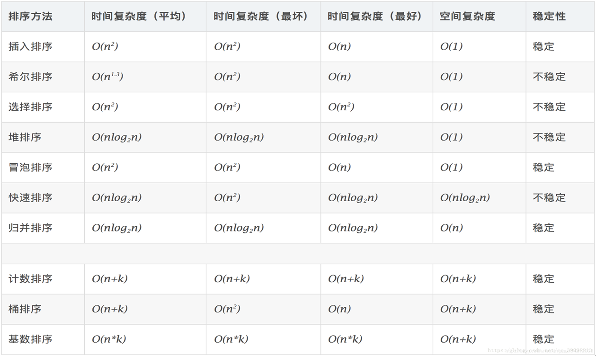

1.**从平均时间而言**：快速排序最佳。但在最坏情况下时间性能不如堆排序和归并排序。

2.**从算法简单性看**：由于直接选择排序、直接插入排序和冒泡排序的算法比较简单，将其认为是简单算法。对于Shell排序、堆排序、快速排序和归并排序算法，其算法比较复杂，认为是复杂排序。

3.**从稳定性看**：直接插入排序、冒泡排序和归并排序时稳定的；而直接选择排序、快速排序、 Shell排序和堆排序是不稳定排序

4.**从待排序的记录数****n****的大小看**，n较小时，宜采用简单排序；而n较大时宜采用改进排序。

### 3.2.1 冒泡排序

> 算法原理

将待排序数组分为无序区间和有序区间两部分，无序空间在前，有序空间在后。起初，数组中的所有元素均位于无序区间。冒泡排序算法的宏观思路是，逐个将无序区间中的最大值冒出到末尾（最大值到末尾之后就相当于进入了有序区间）。直到无序区间的所有元素都冒出到有序区间。

冒出最大值的微观逻辑是两两比较并交换，从无序区间的第一个元素开始，将其与后一个相邻元素行进比较，若当前元素较大，则交换到下一个元素的位置。然后继续比较第二个元素和下一个相邻元素，直至无序区间末尾。这样一来，每经历一轮冒泡操作，都会将现有无序区间中的最大值冒出到有序区间。

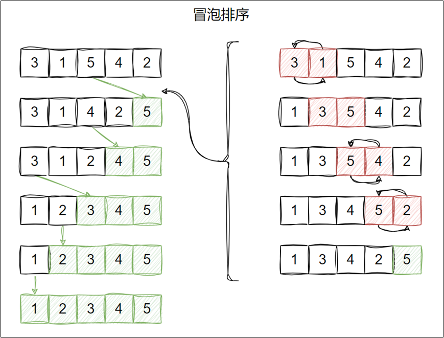


> 代码实现

```python
"""
    冒泡排序
"""
def bubble_sort(arr):
    """冒泡排序"""
    for i in range(len(arr)):
        for j in range(0, len(arr) - i - 1):
            if arr[j] > arr[j + 1]:
                arr[j], arr[j + 1] = arr[j + 1], arr[j]
    # return arr

# 测试
if __name__ == '__main__':
    nums = [3, 1, 5, 4, 2]
    bubble_sort(nums)
    print(nums)
```

> 复杂度分析

（1）时间复杂度：上述算法共执行 (n-1) + (n-2) + (n-3) + … + 3 + 2 + 1 =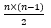 轮循环，每轮循环都执行常量个基本指令，时间复杂度为O(n^2^)。

（2）空间复杂度：就地排序，使用常数大小的额外空间，空间复杂度为O(1)。

（3）一般的情况，n个元素需要比较n-1轮。但是针对元素较多且基本有序的数组，可以优化排序过程，如果中途检测到数组已经排好序，可以提前结束排序过程，最优情况，可以优化为1轮。

> 针对基本有序的数组，可以优化排序过程

```python
def bubble_sort_better(arr):
    """冒泡排序"""
    for i in range(len(arr)):
        flag = True
        for j in range(0, len(arr) - i - 1):
            if arr[j] > arr[j + 1]:
                arr[j], arr[j + 1] = arr[j + 1], arr[j]
                flag = False
        if flag:
            break

# 测试
if __name__ == '__main__':
    nums = [1,2,3,4,5]
    bubble_sort_better(nums)
    print(nums)
```


### 3.2.2 选择排序

> 算法原理

将待排序数组分为无序区间和有序区间两部分，有序空间在前，无序空间在后。起初，所有元素均位于无序区间。选择排序算法的思路是依次在无序区间中遍历找到最小元素，然后将最小元素与无序区间中的第一位进行交换，使最小元素并入有序区间。

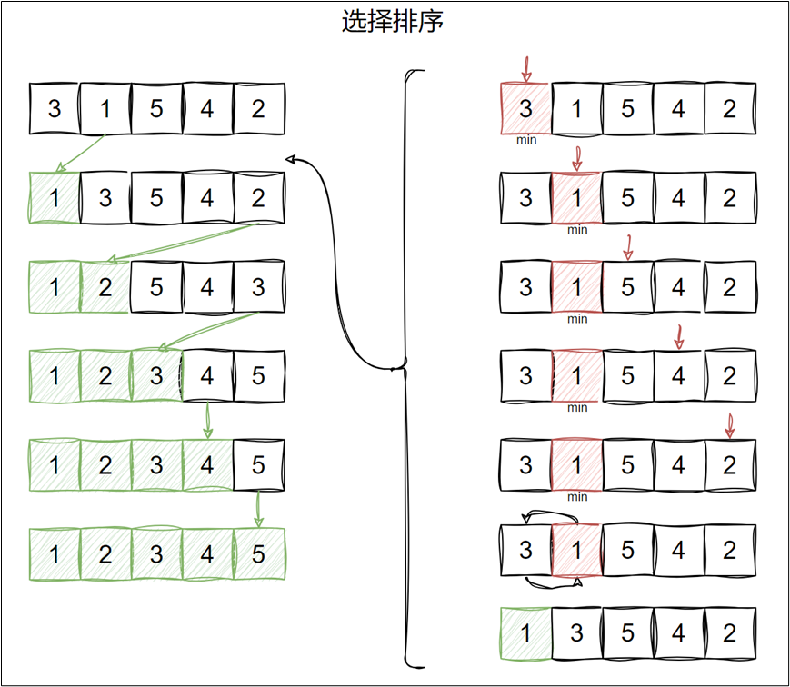

> 代码实现

```python
"""
    选择排序
"""
def select_sort(arr):
    """选择排序"""
    for i in range(len(arr)):
        min_index = i
        for j in range(i + 1, len(arr)):
            if arr[j] < arr[min_index]:
                min_index = j
        arr[i], arr[min_index] = arr[min_index], arr[i]

# 测试
if __name__ == '__main__':
    arr = [1, 5, 3, 2, 4]
    select_sort(arr)
    print(arr)
```

> 复杂度分析

（1）时间复杂度：上述算法共执行 (n-1) + (n-2) + (n-3) + … + 3 + 2 + 1 = 轮循环，每轮循环都执行常量个基本指令，时间复杂度为O(n^2^)。

（2）空间复杂度：就地排序，使用常数大小的额外空间，空间复杂度为O(1)。

### 3.2.3 插入排序

> 算法原理

将待排序的数组分为无序区间和有序区间两部分，有序空间在前，无序空间在后。起初，可以认为第一个元素位于有序区间（只有一个元素，一定是有序的），后边所有元素位于无序区间。插入排序的宏观思路是依次从无序区间选择一个元素，插入到有序区间的正确位置，直到无序区间的所有元素都被插入到有序区间。

插入操作的微观逻辑是，选择无序区间的第一个元素作为待插入元素，将其保存到临时变量，然后从有序区间的最后一个元素开始比较，若大于待插入元素，则将其向后移动一位，然后继续和前一位进行比较，直到找到正确的位置，将元素插入即可。

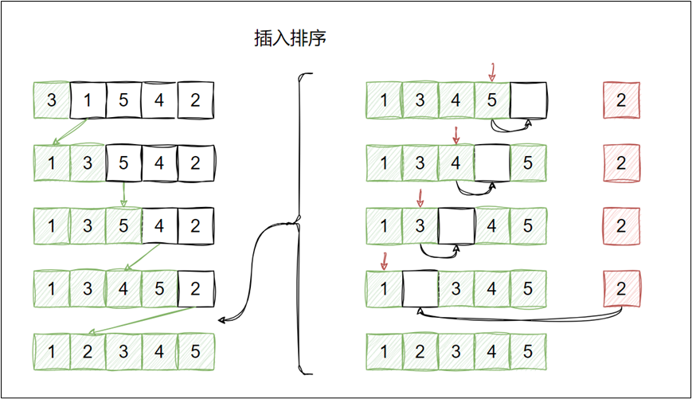

> 基本步骤

1. 外层循环控制
从索引 1 开始遍历数组（i 从 1 到 len(arr)-1）
将当前元素 arr[i] 作为待插入的 key
2. 内层比较移动
设置指针 j = i，从当前位置向前比较
当 j > 0 且 arr[j-1] > key 时：
将较大的元素向后移动：arr[j] = arr[j-1]
指针前移：j -= 1
3. 插入操作
找到正确位置后，将 key 插入：arr[j] = key

```python
def insert_sort_one(arr):
    """插入排序"""
    for i in range(1, len(arr)):
        key = arr[i]
        j = i
        while j > 0 and arr[j-1] > key:
            arr[j] = arr[j-1]
            j -= 1
        arr[j] = key

# 测试
if __name__ == '__main__':
    arr = [1, 5, 3, 2, 4]
    insert_sort_one(arr)
    print(arr)
```

> 基本步骤

1. 外层循环
从索引 1 开始遍历数组（for i in range(1, len(arr))）
将 arr[i] 作为当前待插入的元素
2. 内层比较与移动
设置指针 j = i，从当前位置向前比较
当 j > 0 且 arr[j] < arr[j - 1] 时继续循环
通过交换操作 arr[j], arr[j - 1] = arr[j - 1], arr[j] 将较小元素前移
指针前移 j -= 1
3. 循环终止
当找到正确位置或到达数组开头时停止
当前元素已插入到正确位置

```python
def insert_sort_two(arr):
    """插入排序"""
    for i in range(1, len(arr)):
        j = i
        while j > 0 and arr[j] < arr[j - 1]:
            arr[j], arr[j - 1] = arr[j - 1], arr[j]
            j -= 1

# 测试
if __name__ == '__main__':
    arr = [1, 5, 3, 2, 4]
    insert_sort_two(arr)
    print(arr)
```

> 复杂度分析

（1）时间复杂度：上述算法共执行 (n-1) + (n-2) + (n-3) + … + 3 + 2 + 1 = 轮循环，每轮循环都执行常量个基本指令，时间复杂度为O(n^2^)。

（2）空间复杂度：就地排序，使用常数大小的额外空间，空间复杂度为O(1)。

### 3.2.4 归并排序

> 算法原理

归并排序（Merge Sort）算法的核心是归并操作（Merge）。归并操作指的是将两个已经排好序的列表合并成一个有序列表的操作。

归并操作的核心逻辑十分简单：循环选取两个有序列表各自最小的元素（因为列表本身有序，所以直接取排在最前的元素即可）进行比较，每次都将两者中最小的一个移到临时数组，直到其中一个有序列表被拿空，然后将另一列表中的剩余元素，顺次放入临时数组即可。这样就能将两个有序列表合并为一个有序列表了。

归并排序算法的执行过程分为两个阶段：分解、合并。

- 分解阶段：不断将数组的排序问题分解为对两个子数组的排序问题，直到子数组中只包含一个元素。
- 合并阶段：从最小的有序数组（只包含一个数组）开始，逐层进行归并（merge）操作，将两个有序小数组合并为一个有序大数组。

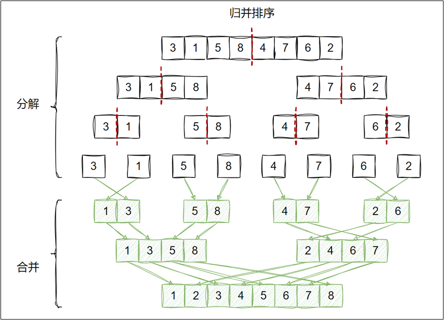

> 代码实现

```python
"""
    归并排序
"""
def merge(left,right):
    """合并两个有序的子序列"""
    i, j = 0, 0
    result = []
    # 比较两个子数组的元素，按升序放入 result 数组
    while i < len(left) and j < len(right):
        if left[i] <= right[j]:
            result.append(left[i])
            i += 1
        else:
            result.append(right[j])
            j += 1

    # 将数组中剩余元素加入 result
    result.extend(left[i:])
    result.extend(right[j:])
    return result

def merge_sort(arr):
    """归并排序"""
    if len(arr) <= 1:
        return arr
    mid = len(arr) // 2
    left = merge_sort(arr[:mid])
    right = merge_sort(arr[mid:])
    return merge(left, right)

# 测试
if __name__ == '__main__':
	print(merge_sort([3,1,5,8,4,7,6,2]))

```

> 复杂度分析

（1）时间复杂度

该算法的时间复杂度，主要取决于合并操作的循环次数，由于该算法用到了递归，故计算循环次数时，还需要考虑递归调用的总次数。由于每次递归调用都是将数组一分为二，故递归过程可用一个二叉树进行可视化。

例如对一个长度为8的数组进行排序，递归调用层级如下图所示：

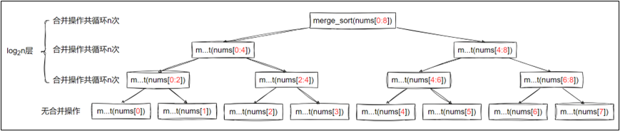

- 分解层数：数组每次对半分割，共需要 log₂n 层分解

- 单次合并：merge 函数处理两个有序子数组。最多进行 n 次元素比较（n 为当前合并数组长度）。将剩余元素复制到结果数组，最多 n 次操作

  - 第0层：O(n) - 最顶层合并

  - 第1层：2 × O(n/2) = O(n) - 两个子数组合并

  - 第2层：4 × O(n/4) = O(n) - 四个子数组合并

  - ...

  - 第log n层：2^log n × O(1) = O(n)

- 最终结果
  - 总时间：log n 层，每层 O(n) 操作
  - 时间复杂度：O(n log n)

（2）空间复杂度

由于每次合并操作都需需要创建一个数组来临时存放合并结果，所以空间复杂度主要考虑临时数组占用的空间。虽然每次合并操作都会创建临时数组，但是，这些合并操作并不是同时运行的，每次合并操作结束后，临时数组的空间就会释放。也就是说，该算法在运行时，同一时刻只会有一个临时数组，所有只需考虑最大的临时数组占用的空间即可，显然临时数组的最大长度等于输入数组的长度。因此该算法的空间复杂度为O(n)。


### 3.2.5 快速排序

> 算法原理

快速排序算法每次从数组中挑一个元素，作为基准（pivot），然后将所有小于基准元素的元素放置于其左边，将所有大于基准元素的元素放置于其右边，完成后，就相当于完成了按基准元素的划分。同时，原来乱序的数组就也被基准点一分为二，成为两个乱序子数组。之后对两个子数组采用同样的操作划分，直到子数组只包含一个元素。

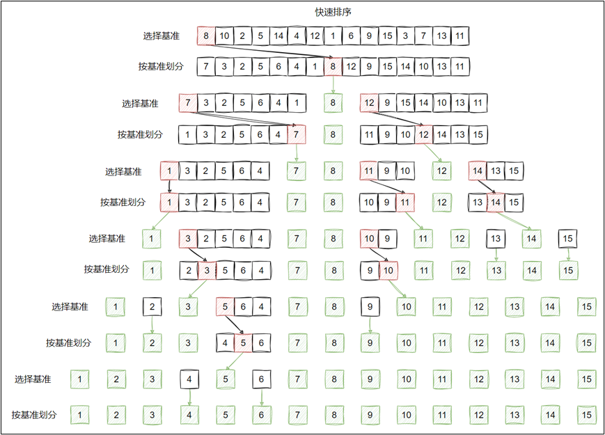

在按基准划分时：

方式一：先从右到左寻找小于基准的元素，并与基准交换位置；再从左到右寻找大于基准的元素，并与基准交换位置。两者依次交替直到左右指针重合，此时将基准值放在重合处。

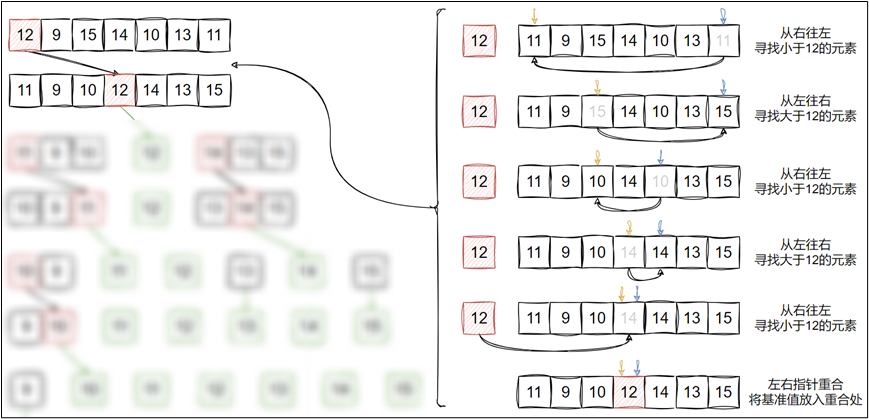

方式二：

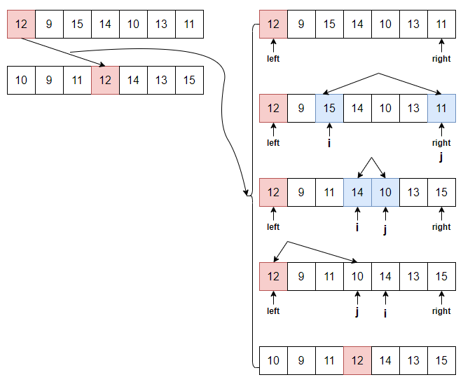

> 代码实现

```python
"""
    快速排序
"""
def partition(nums, left, right):
    """选择基准并按基准划分"""
    pivot = nums[left] # 选择第一个数为基准，nums[left]位置可以被覆盖
    while left < right:
        # 从右向左找第一个比 pivot 小的数
        while left < right and nums[right] >= pivot:
            right -= 1
        nums[left] = nums[right] # 把比pivot小的数放到左边[left]位置，空出nums[right]位置
        # 从左向右找第一个比 pivot 大的数
        while left < right and nums[left] <= pivot:
            left += 1
        nums[right] = nums[left] # 把比pivot大的数放到右边[right]位置，空出nums[left]位置
    # while循环结束，left = right，[left]左边的数都比pivot小，[right]右边的数都比pivot大
    nums[left] = pivot # 把pivot放到中间位置
    return left # 返回中间值下标

def quick_sort(nums, left, right):
    """快速排序"""
    if left < right:
        # 划分，nums[mid]为中间值, 左边的数都比它小，右边的数都比它大
        mid = partition(nums, left, right)
        # 继续对左右两边进行排序
        quick_sort(nums, left, mid - 1)
        quick_sort(nums, mid + 1, right)

# 测试
if __name__ == '__main__':
    # nums = [3,1,5,8,4,7,6,2]
    nums = [8,10,2,5,14,4,12,1,6,9,15,3,7,13,11]
    quick_sort(nums, 0, len(nums) - 1)
    print(nums)
```

或

```python
def partition(nums,left,right):
    key = nums[left] #选择基准值
    i = left
    j = right
    while i < j:
        while i<right and nums[i]<=key:#在左边找比key大的元素位置
            i += 1
        while j>left and nums[j]>=key:#在右边找比key小的元素位置
            j -= 1
        if i < j:#把 左边比key大的元素 与 右边找比key小的元素 交换
            nums[i],nums[j] = nums[j],nums[i]
    #上面的循环实现了[left+1,j]范围的元素 < key < [j+1, right]范围的元素
    #把基准值，换到中间
    nums[left],nums[j] = nums[j],nums[left]
    return j

def quick_sort(nums, left,right):
    if left < right:
        mid = partition(nums,left,right)
        quick_sort(nums, left,mid-1)
        quick_sort(nums, mid+1,right)

# 测试
if __name__ == '__main__':
    # nums = [3,1,5,8,4,7,6,2]
    nums = [8,10,2,5,14,4,12,1,6,9,15,3,7,13,11]
    # nums = [3,1,5,8,7]
    quick_sort(nums, 0, len(nums) - 1)
    print(nums)
```


> 复杂度分析

（1）时间复杂度

由于每次递归调用时，pivot的选择会影响到递归调用的总次数，所以该算法的时间复杂度是不固定的。下面分别分析一下最佳和最差两种情况下的时间复杂度。

最佳情况：若每次递归调用时，选择的pivot恰好都是所有数据的中位数，也就是恰好能将数组均匀的一分为二。这种情况下递归调用总次数最少，时间复杂度最低。这种情况下循环总次数约为nlog2n，每次循环都执行常量个基本指令，故时间复杂度为O(nlogn)。

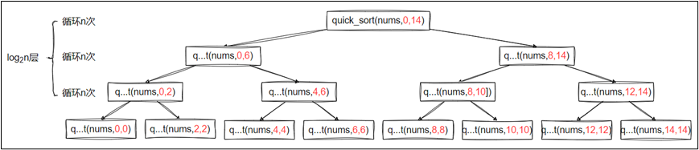

最差情况：若每次递归调用时，选择的pivot都是所有数据的最大值或者最小值，也就是将长度为n的数组分为长度为0和长度为n-1的两个数组。这种情况下递归调用的次数最多，时间复杂度最高。这种情况下循环的总次数为(n-1) + (n-2) + (n-3) +…+ 3 + 2 + 1 =  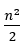，每次循环执行常量个基本指令，故时间复杂度为O(n^2^)。

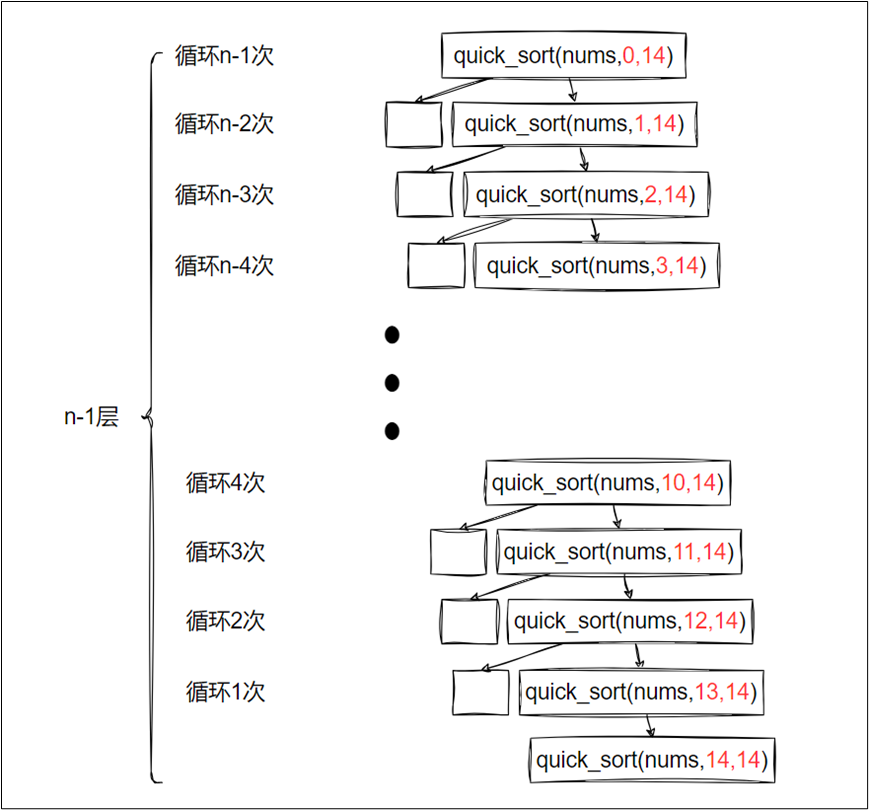

虽然快速排序算法的最差时间复杂度是O(n^2^)，但是这种情况出现的概率很低，除此之外，我们还可以通过某些手段（尽量选取接近中值的pivot），进一步降低最差情况出现的概率，总之我们几乎可以完全避免最差情况的出现。

实际上，更为细致的分析推导与实验统计都一致地显示，在大多数情况下，快速排序算法的平均时间复杂度依然可以达到O(nlogn)。并且由于其真实的T(n)时间函数中，常数系数较小，所以一般情况下，其表现要优于其他算法。

（1）空间复杂度

和时间复杂度相同，空间复杂度也不是固定的。

-  最佳情况：同时存在的最多的未返回的方法栈数量等于递归树的深度，每个方法栈都只保存常量个变量，所以空间复杂度为O(logn)。
- 最差情况：同时存在的最多的未返回的方法栈的数量等于n-1，所以空间复杂度为O(n)。

同样，大多数情况下，快速排序法的平均空间复杂度可以达到O(logn)。

### 3.2.6 堆排序

> 算法原理

堆排序的基本思想是先将输入的数据构建成一个大顶堆，然后将堆顶的元素（即最大元素）与堆末尾元素交换，并将堆的元素个数减1。

之后重新调整堆的结构，重复这一过程，直到所有元素都被排好序。

堆排序的步骤：

①  构建大顶堆

首先将待排序的序列构建成一个大顶堆。

大顶堆的特点是，堆中每个父节点的值都大于或等于其子节点的值，因此根节点是整个堆中的最大值。构建大顶堆时从最后一个非叶节点`自底向上`依次堆化（非叶节点的计算：数组长度为 n，最后一个非叶节点的索引为 (n // 2) -1）。

②  交换堆顶和堆底元素

将堆顶元素（即最大元素）与当前堆的最后一个元素交换，堆的大小减1。此时，根节点被替换为堆的最后一个元素，堆的结构被破坏，需要调整堆。

③  重新调整堆

对堆重新进行堆化，使其满足大顶堆的性质。这样，新的堆顶元素将成为剩余元素中的最大值。此时`自顶向下堆化`。

④  重复

重复②③，直到堆的大小为 1。

> 示意图

①构建大顶堆（自底向上）

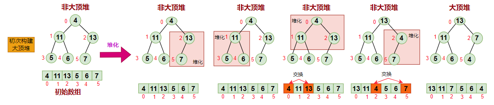

②交换堆顶和堆底元素，并重新调整堆（自顶向下）：这是一个重复过程，直到堆的大小为 1

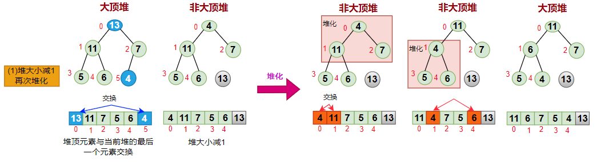

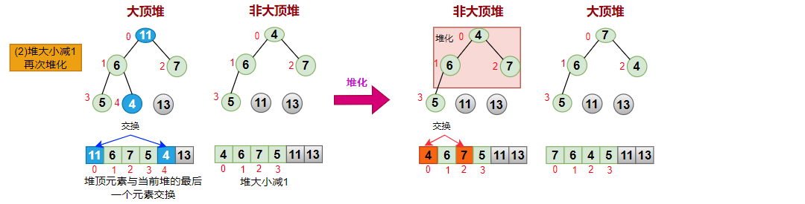

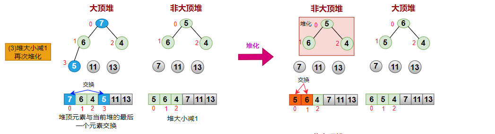

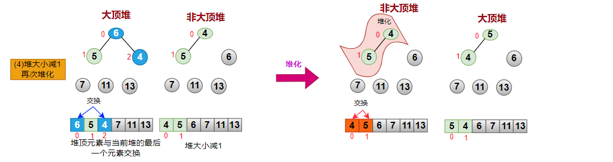

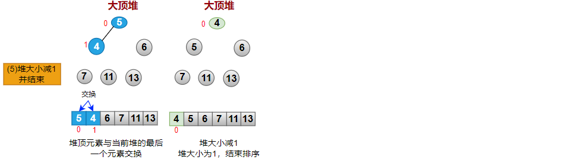

> 代码实现

```python
"""
    堆排序
"""
def heapify(arr, len, parent):
    """
    堆化操作
    :param arr: 需要进行堆化操作的序列
    :param len: 序列中元素的个数
    :param parent: 当前需要进行堆化操作的子树的根结点索引
    :return:
    """
    largest = parent  # 最大结点指向父结点
    left = 2 * parent + 1  # 左子结点
    right = 2 * parent + 2  # 右子结点

    # 如果左子结点大于父结点,最大结点指向左子结点
    if left < len and arr[left] > arr[largest]:
        largest = left

    # 如果右子结点大于当前最大结点，最大结点指向右子结点
    if right < len and arr[right] > arr[largest]:
        largest = right

    # 如果最大结点不是父结点，则交换并递归堆化
    if largest != parent:
        arr[parent], arr[largest] = arr[largest], arr[parent]
        heapify(arr, len, largest)

def heap_sort(arr):
    """堆排序"""
    n = len(arr)
    # 自底向上开始堆化
    for i in range(n // 2 - 1, -1, -1):
        heapify(arr, n, i)

    # 依次将堆顶元素放在末尾，并重新堆化
    for i in range(n - 1, 0, -1): # 堆大小递减
        arr[i], arr[0] = arr[0], arr[i]
        # 自顶向下开始堆化
        heapify(arr, i, 0)

# 测试
if __name__ == '__main__':
    arr = [12, 11, 13, 5, 6, 7]
    heap_sort(arr)
    print("排序后的数组:", arr)

```

> 复杂度分析

（1）时间复杂度

其初始构建堆时间复杂度为O(n)。正式排序时，重建堆的时间复杂度为O(nlogn)。所以堆排序的总体时间复杂度为O(nlogn)。

堆排序对原始记录的排序状态不敏感，因此它无论最好、最坏和平均时间复杂度都是O(nlogn)。但是与其他O(nlogn) 的排序算法（如归并排序、快速排序）相比，堆排序的常数因子较大，因此在某些情况下效率较低。

（2）空间复杂度

就地排序，空间复杂度是O(1)。

## 3.3 分治算法

### 3.3.1 分治算法的概述

分治算法的基本思想为：将原问题递归的分解为若干个（通常是两个以上）规模较小、相互独立且性质相同的子问题，直到子问题足够简单，简单到可以直接求解。然后再返回结果，逐个解决上层问题。

实际上，前文提到的归并排序算法和快速排序算法都是分治思想的典型应用。

能使用分治算法解决的问题通常需要具备以下特点：

- 可分解：问题可以被划分为多个规模较小的子问题。这些子问题通常具有相同的性质，并且可以独立地解决。
- 存在基本情况：问题分解的小到一定程度后，就变得非常简单，简单到可以直接求解。
- 可合并：可以通过合并多个子问题的解，得到原问题的解。


### 3.3.2 案例一：汉诺塔问题

> 力扣面试题08.06https://leetcode.cn/problems/hanota-lcci/description/

现有三根柱子A、B 和 C 。起始状态下，柱子A上套着圆盘，它们从上到下按照从小到大的顺序排列。要将所有圆盘移到柱子C上，并保持它们的原有顺序不变。在移动圆盘的过程中，需要遵守以下规则：

- 圆盘只能从一根柱子顶部拿出，从另一根柱子顶部放入。
- 每次只能移动一个圆盘。
- 小圆盘必须时刻位于大圆盘之上。

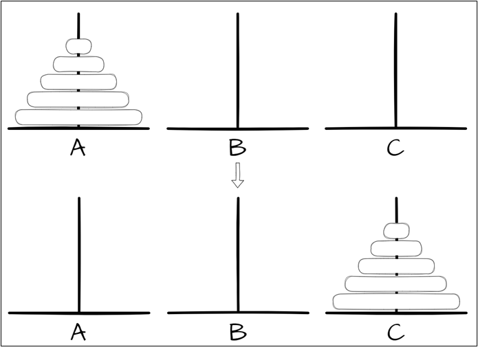

> 思路分析：
>

将规模为n的汉诺塔问题记作f(n)。

（1）只有1个圆盘，将圆盘从A移动至C，记为f(1)

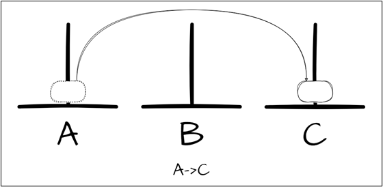

（2）只有2个圆盘，将圆盘从A移动至C，记为f(2)。借助B，分为3步：

- 使用f(1)的方法将一个圆盘从A移动至B。
- 使用f(1)的方法将一个圆盘从A移动至C。
- 使用f(1)的方法将一个圆盘从B移动至C。

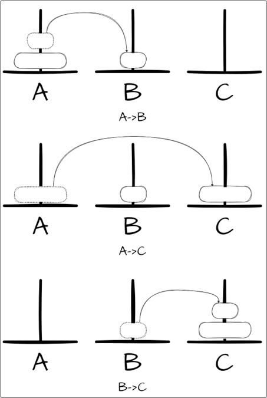

（3）有3个圆盘，将圆盘从A移动至C，记为f(3)。分为3步：

- 使用f(2)的方法借助C将2个圆盘从A移动至B。
- 使用f(1)的方法将1个圆盘从A移动至C。
- 使用f(2)的方法借助A将2个圆盘从B移动至C。

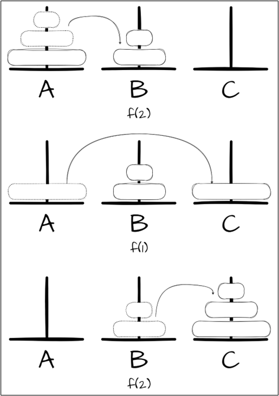

（4）有n个圆盘，将圆盘从A移动至C，记为f(n)。分为3步：

- 使用f(n-1)的方法借助C将n-1个圆盘从A移动至B。
- 使用f(1)的方法将1个圆盘从A移动至C。
- 使用f(n-1)的方法借助A将n-1个圆盘从B移动至C。

> 实现代码

```python
"""
    汉诺塔问题
"""
def print_abc():
    """打印3个柱子"""
    print("a:", a)
    print("b:", b)
    print("c:", c)
    print()

def hanota(n, source, target, buffer):
    # 只有一个盘子时，直接从源柱子移动到目标柱子
    if n == 1:
        target.append(source.pop())
        return

    # 1. 将 n-1 个盘子从源柱子移动到缓冲柱子
    hanota(n - 1, source, buffer, target)
    print_abc()

    # 2. 将第 n 个盘子从源柱子移动到目标柱子
    hanota(1, source, target, buffer)
    print_abc()

    # 3. 将 n-1 个盘子从缓冲柱子移动到目标柱子
    hanota(n - 1, buffer, target, source)
    print_abc()

if __name__ == "__main__":
    n = 3
    a = list(range(n, 0, -1))
    b = []
    c = []
    print("初始状态：")
    print_abc()

    print("开始移动...")
    hanota(n, a, c, b)

```

### 3.3.3 案例二：Karatsuba大整数乘法算法

Karatsuba（卡拉楚巴，苏联 - 俄罗斯数学家，以提出**Karatsuba 快速乘法算法**闻名，该算法是首个时间复杂度低于 O (n²) 的大数乘法算法，开创了快速乘法研究的新纪元）算法是一种高效的大整数乘法算法，关键思想是通过分治法减少了传统乘法的计算量，从而降低了乘法的时间复杂度。

> 传统的朴素乘法算法：C=A×B

在传统的朴素乘法算法中，两个n位数的乘积需要进行O(n^2^)次基本操作。因为每一位数字都需要与另一个数字的每一位相乘，然后再加上进位。

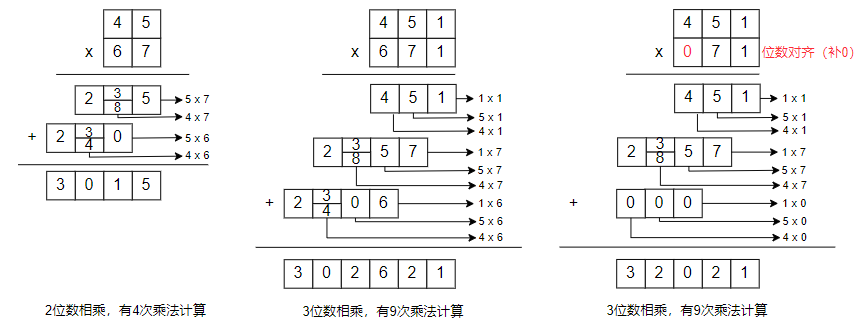

> Karatsuba大整数乘法：C=A×B

我们将A、B的高位部分和低位部分拆开，取数字长度的一半为m，分别表示为：

- A=10^m^×A~1~+A~0~ ，A = 1234 = 10^2^×12 + 34 ，即m = 2，A~1~ = 12 ，A~0~ = 34
- B=10^m^×B~1~+B~0~，B = 6785 = 10^2^×67 + 85 ，即m = 2，B~1~ = 67，B~0~ = 85

此时可以得到：C=A×B=(10^m^×A~1~+A~0~)×(10^m^×B~1~+B~0~) =10^2m^×A~1~×B~1~ + 10^m^×(A~1~×B~0~+A~0~×B~1~) + A~0~×B~0~

这个表达式由三项组成：

- A~0~×B~0~：低位部分的乘积，令z~0~= A~0~×B~0~
- A~1~×B~0~+A~0~×B~1~：混合部分，涉及到高位与低位的交叉乘积，这个部分继续换算为(A~1~+A~0~)×(B~1~+B~0~)- A~0~×B~0~-A~1~×B~1~，即(A~1~+A~0~)×(B~1~+B~0~) -低位部分的乘积 - 高位部分的乘积，低位部分乘积和高位部分乘积可以复用，我们只需计算(A~1~+A~0~)×(B~1~+B~0~)，相较于计算A~1~×B~0~+A~0~×B~1~，减少了1次乘法计算。令z~1~=(A~1~+A~0~)×(B~1~+B~0~)，则A~1~×B~0~+A~0~×B~1~ = z~1~ - z~0~ - z~2~
- A~1~×B~1~：高位部分的乘积，令z~2~= A~1~×B~1~

由此可以得出 C= A × B = 10^2m^ × z~2~ + 10^m^ × (z~1~ - z~0~ - z~2~) + z~0~ 

这样，Karatsuba通过减少了1个乘法操作，将原本的4次乘法运算变成了3次乘法运算，时间复杂度：T(n)=3T(n^2^)+O(n)，得出O(n^log3^)≈O(n^1.585^)。

> Karatsuba大整数乘法示例分析

- 例如：A = 12 = 10^1^ x 1 + 2，即m = 1, A~1~ = 1 ，A~0~ = 2。B = 34 = 10^1^ x 3 + 4，即 m = 1，B~1~ = 3，B~0~ = 4。那么 C = A × B = 12 x 34 = 10^2^ x 1 x 3 + 10^1^ x((1+2) x (3 + 4) - 1 x 3 - 2 x 4) + 2 x 4 = 408
- 例如：A = 1234 = 10^2^×12 + 34 ，即m = 2，A~1~ = 12 ，A~0~ = 34。B = 6785 = 10^2^×67 + 85 ，即m = 2，B~1~ = 67，B~0~ = 85。那么C =  A × B = 1234 x 6785 = 10^4^ x 12 x 67  + 10^2^ x ((12 + 34) x (67 + 85) - 34 x 85 - 12 x 67 ) + 34 x 85 ，然后所有非1位数相乘的乘法继续使用Karatsuba乘法分解，直到1位数相乘为止。

> Karatsuba大整数乘法代码实现

```python
"""
    卡拉楚巴算法
"""
def karatsuba(x, y):
    """
    karatsuba 乘法算法
    """
    if x == 0 or y == 0: # 递归结束条件，0乘以任何数都等于0
        return 0

    if abs(x) < 10 and abs(y) < 10: # 递归结束条件，1位数相乘直接返回结果
        return x * y

    # 处理负数，转为正数相乘
    if x < 0 and y < 0:
        return karatsuba(-x, -y)
    elif x < 0:
        return -karatsuba(-x, y)
    elif y < 0:
        return -karatsuba(x, -y)

    # 将 x 和 y 转换为字符串
    x_str, y_str = str(x), str(y)
    n = max(len(x_str), len(y_str))
    m = int(n / 2)

     # 补齐较短的数字，使其长度相同
    x_str = x_str.zfill(n)
    y_str = y_str.zfill(n)

    # 将数字划分为高位部分和低位部分
    high1, low1 = int(x_str[:-m]), int(x_str[-m:])
    high2, low2 = int(y_str[:-m]), int(y_str[-m:])

    # 递归调用 karatsuba
    z0 = karatsuba(low1, low2)
    z1 = karatsuba(low1 + high1, low2 + high2)
    z2 = karatsuba(high1, high2)

    return pow(10, 2 * m) * z2 + pow(10, m) * (z1 - z2 - z0) + z0

if __name__ == "__main__":
    print(karatsuba(1234, 6785 ))
    print(karatsuba(-1234, 6785 ))
    print(karatsuba(-1234, -6785 ))
    print(karatsuba(0, -6785 ))
```


## 3.4 动态规划算法

### 3.4.1 概述

动态规划算法与分治法类似，也是通过将原问题拆分为若干子问题，然后递归求解子问题，最后再组合子问题的解进而得到原问题的解。不同的是，分治算法解决的问题，子问题通常相互独立。而动态规划解决的问题，子问题具有重叠现象，所谓的重叠现象，是指不同的子问题会有相同的子子问题。

对于这些重复的子问题，若不加干预，会进行多次的重复计算，效率低下。动态规划意义就是，能够保证每个重复的子问题只计算一次，其解决问题的思路就是将计算过的子问题保存起来，后续计算相同子问题时，便可直接获取结果。

动态规划算法的实现方式分为自上而下的记忆化递归和自下而上的迭代。自上而下的递归方式只需考虑原问题到子问题的递归公式，而无序考虑子问题的执行顺序；而自下而上的迭代方式，除了需要考虑递推关系，还需要确保子问题从小到大依次执行。

### 3.4.2 案例一：爬楼梯

> 力扣70题https://leetcode.cn/problems/climbing-stairs/description/
>
> 爬有n个台阶的楼梯，每次可以爬1或2个台阶。有多少种不同的方法可以爬到楼顶？

由于每次只能爬1个或2个台阶，所以第n个台阶可能是从第n-1个台阶爬1阶上来的，也可能是从第n-2个台阶爬2阶上来的，所以爬到第n阶的方法数就等于爬到第n-1阶的方法数加上爬到第n-2阶的方法数。故可以得到状态转移方程：f(n) = f(n-2) + f(n-1) 。

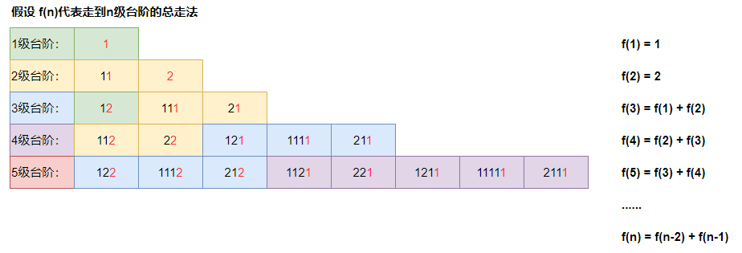

> 代码实现

（1）递归写法

```python
"""
    爬楼梯
"""
def climb_recursive(n):
    """使用递归的方式计算爬楼梯问题"""
    if n <= 0:
        return 0
    if n == 1:
        return 1
    if n == 2:
        return 2
    return climb_recursive(n - 2) + climb_recursive(n - 1)
```

（2）循环写法

```python
def climb_loop_one(n):
    """使用循环的方式计算爬楼梯问题"""
    if n <= 0:
        return 0
    if n == 1:
        return 1
    if n == 2:
        return 2

    # 计算3级（含）台阶以上
    last_step_one = 2 # 最后一步爬1级台阶的初始值
    last_step_two = 1 # 最后一步爬2级台阶的初始值
    current = 0
    for _ in range(3, n + 1):
        current = last_step_one + last_step_two #走到第n级台阶的方法数
        last_step_two = last_step_one # 缓存，这次爬1级台阶到第n级台阶的方法数，就是下次爬2级台阶到第n+1级台阶的方法数
        last_step_one = current # 缓存，这次走到第n级台阶的方法数，就是下次爬1级台阶到第n+1级台阶的方法数
    return current

def climb_loop_two(n):
    """使用循环的方式计算爬楼梯问题"""
    if n <= 0:
        return 0
    previous = 1
    current = 1
    """
    n = 1 ,for循环不执行， current = 1
    n = 2 ,for循环执行1次， previous = 1, current = 1+1 = 2
    n = 3 ,for循环执行2次， 
                        previous = 1, current = 1+1 = 2
                        previous = 2, current = 1+2 = 3
    n = 4 ,for循环执行1次， 
                        previous = 1, current = 1+1 = 2
                        previous = 2, current = 1+2 = 3
                        previous = 3, current = 2+3 = 5
    """
    for _ in range(1, n):
        previous, current = current, previous + current
    return current
```

测试代码：

```python
if __name__ == "__main__":
    for step in range(1, 10):
        print("爬 %d 阶楼梯的方法数：" % step)
        print("递归：%d" % climb_recursive(step))
        print("循环1：%d" % climb_loop_one(step))
        print("循环2：%d" % climb_loop_two(step))
        print()
```

### 3.4.3 案例二：最大的连续子数组之和

> 力扣53题https://leetcode.cn/problems/maximum-subarray/description/
>
> 找出整数数组nums中数组之和最大的连续子数组（子数组最少包含一个元素），返回其最大和。

示例：

- 输入：nums = [-2,1,-3,4,-1,2,1,-5,4]
- 输出：6

解释：连续子数组 [4,-1,2,1] 的和最大，为 6 。

> 分析

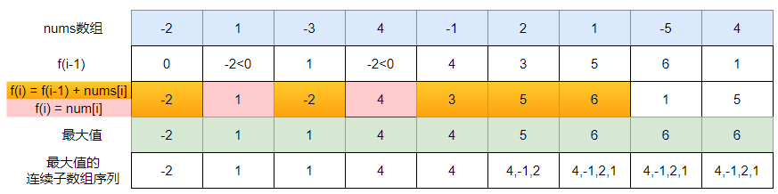

用f(i)表示以[i]位置的元素结尾的最大子数组之和，考虑处于位置[i]时，有两种选择：

- 与之前的子数组组成连续子数组，此时子数组之和f(i) =  nums[i] + f(i-1)。
- 中断连续，从头开始一个新的连续子数组，此时f(i) = nums[i]。

持续组成连续子数组，除非连续子数组之和已经<0，此时中断连续。因为如果f(i-1)是负数不中断，那么就会导致与f(i) =  nums[i] + f(i-1) < nums[i]。所以等连续子数组之和<0时，就要中断连续。

> 实现代码

```python
def max_subarray_sum(nums):
    """最大的连续子数组之和"""
    max_result = f = nums[0]
    for i in range(1, len(nums)):
        # 连续子数组之和若小于0，则中断连续
        f = max(nums[i], f + nums[i])
        max_result = max(max_result, f)
    return max_result

if __name__ == "__main__":
    print(max_subarray_sum([-2, 1, -3, 4, -1, 2, 1, -5, 4]))
    print(max_subarray_sum([-2, 1, -3, 4, -1, 2, 1, -5, 4,2]))
```

> 思考：如何同时返回最大的连续子数组之和及其子数组

```python
def max_subarray(nums):
    """最大的连续子数组之和及其子数组"""
    max_result = f = nums[0]
    index_start = 0
    index_end = 0
    for i in range(1, len(nums)):
        # 连续子数组之和若小于0，则中断连续
        if f<0:
            f = nums[i]
            index_start = i
        else:
            f = f + nums[i]
        if f > max_result:
            index_end = i
            max_result = f
    return max_result,nums[index_start:index_end+1]

if __name__ == "__main__":
    print(max_subarray([-2, 1, -3, 4, -1, 2, 1, -5, 4]))
    print(max_subarray([-2, 1, -3, 4, -1, 2, 1, -5, 4,2]))

```

### 3.4.4 案例三：0-1背包

> 0-1背包问题是一个经典的动态规划问题。其基本描述是：给定一组物品，每个物品都有一个重量和一个价值，在背包容量有限的情况下，如何选择物品放入背包，使得背包中物品的总价值最大化，且总重量不超过背包的容量。

- 物品：有n个物品，每个物品i的重量为weight[i]和价值value[i]。
- 背包容量：背包可以承载的最大重量为W。
- 目标：选择若干物品放入背包，使得总重量不超过W，且总价值最大。

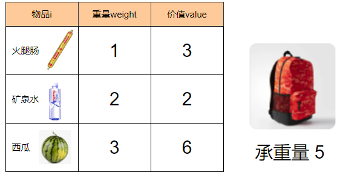

#### 方法一：使用二维数组

（1）定义状态

定义一个二维数组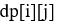，表示前i个物品中，总重量不超过j 的情况下，能够取得的最大总价值。

- i：表示考虑第i个物品。
- j：表示背包当前容量为j。

（2）状态转移

对于每个物品i，有两个选择：

- 不选第i个物品：此时最大价值就是前`i−1`个物品在容量w下的最大价值，即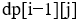。
- 选第i个物品：此时背包剩余容量为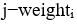，如果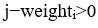，即有剩余容量，那么选择第i个物品后最大价值为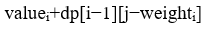。

- 两个选择最终取值 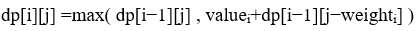

（3）最终结果：最大价值在dp的最后一个元素值中

> 分析过程

（1）只有1个物品

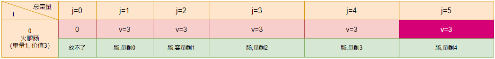

（2）2个物品

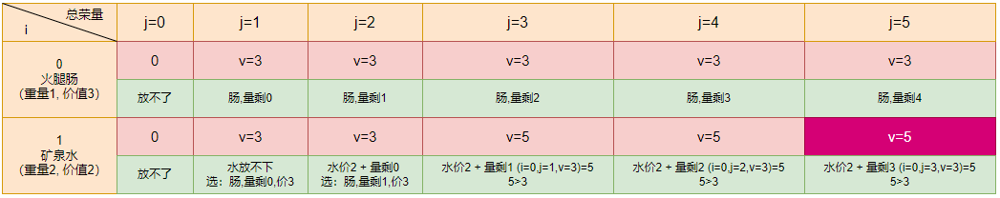

（3）3个物品

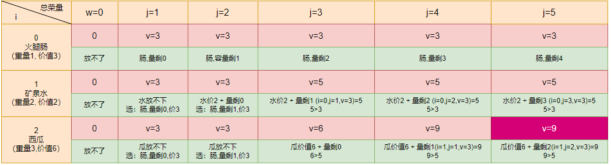

> 实现代码

```python
"""
 0-1背包问题
"""
def knapsack(weights, values, W):
    n = len(weights)
    # 创建n 行 W + 1 列的二维数组 ，用于保存中间结果
    # 初始化二维数组dp，dp[i][j]表示前i个物品中，背包容量为j时的最大价值
    dp = [[0] * (W + 1) for _ in range(n)]

    # 创建一个列表，用于保存不同总容量的列表
    w_list = list(range(W + 1))

    # 每次增加一个可选物品，增加物品后遍历一次背包重量
    for i in range(n):
        for j in w_list:
            # 如果当前物品放的进背包，进行比较
            if weights[i] <= j: # 选择当前物品[i]后还有剩余容量
                dp[i][j] = max(dp[i - 1][j], values[i] + dp[i - 1][j - weights[i]])
            # 如果当前物品放不进背包，使用上轮相同j的状态
            else: # 当前物品[i]放不进背包
                dp[i][j] = dp[i - 1][j]

        # print(f"前{i + 1}个物品")
        # print("重量：",w_list)
        # for row in range(0,i+1):
        #     print("价值：",dp[row])

    return dp[n - 1][W]

if __name__ == "__main__":
    weights = [1, 2, 3]  # 物品的重量
    values = [3, 2, 6]  # 物品的价值
    W = 5  # 背包的最大容量
    print(knapsack(weights, values, W))

```

#### 方法二：使用一维数组

可以看到在方法一中，我们每轮遍历时只用到上1轮的结果，与这一轮的结果无关，因此我们只用一维数组存储上1轮的结果即可。

并且遍历时需要从后往前遍历，防止这轮结果将还需要用到的上轮结果覆盖。

并且不用全部遍历，遍历到背包当前重量刚好等于当前物品重量即可。

```python
"""
 0-1背包问题
"""
def knapsack(weights, values, W):
    n = len(weights)
    dp = [0] * (W + 1)
    for i in range(n):
        for j in range(W, weights[i] - 1, -1):  # 从后往前遍历，j>=weights[i]
            dp[j] = max(dp[j], values[i] + dp[j - weights[i]])
    return dp[W]

if __name__ == "__main__":
    weights = [1, 2, 3]  # 物品的重量
    values = [3, 2, 6]  # 物品的价值
    W = 5  # 背包的最大容量
    print(knapsack(weights, values, W))
```

### 3.4.5 完全背包

完全背包问题是0-1背包问题的一种扩展。与0-1背包不同，完全背包问题允许每个物品可以被选取多次，也就是说，物品的数量没有限制。

#### 方法一：使用二维数组

（1）定义状态

定义一个二维数组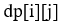表示前i个物品中，总重量不超过 j 的情况下，能够取得的最大价值。

-  i：表示考虑第i个物品。
- j：表示背包当前容量为j。

（1）状态转移

相较于0-1背包，仅有选择放入第i个物品时发生了变化。

对于每个物品i，有两个选择：

- 不选第i个物品：与0-1背包相同，此时最大价值就是前i−1个物品在容量j下的最大价值，即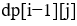。

- 选第i个物品：此时背包剩余容量为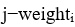，如果，即有剩余容量，那么选择第i个物品后最大价值为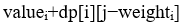。

- 两种选择的结果取：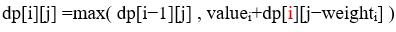，`注意：相较于0-1背包问题仅有一处 i-1 变为了 i`

> 分析过程

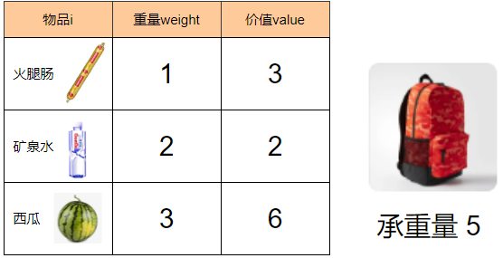

（1）只有1种物品

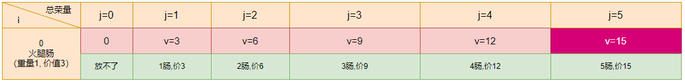

（2）有2种物品

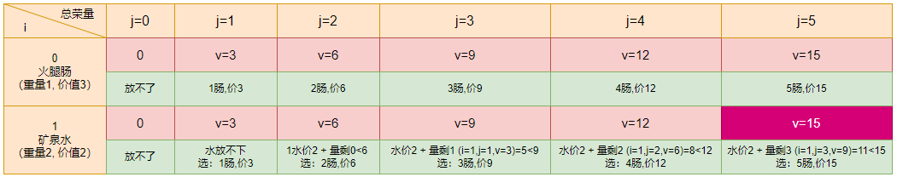

（3）有3种物品

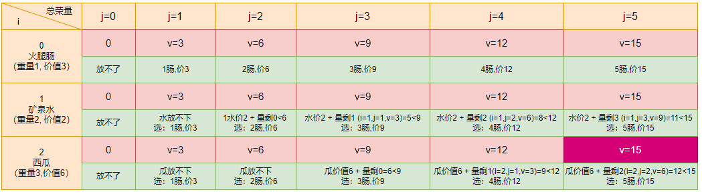

> 实现代码

```python
"""
    完全背包问题
"""
def knapsack(weights, values, W):
    n = len(weights)
    # 初始化二维数组dp，dp[i][j]表示前i个物品中，背包容量为j时的最大价值
    dp = [[0] * (W + 1) for _ in range(n)]

    # 创建一个列表，用于保存不同总容量的列表
    w_list = list(range(W + 1))

    # 每次增加一个可选物品，增加物品后遍历一次背包重量
    for i in range(n):
        for j in w_list:
            # 如果当前物品放的进背包，进行比较
            if weights[i] <= j:
                dp[i][j] = max(dp[i - 1][j], values[i] + dp[i][j - weights[i]])
            # 如果当前物品放不进背包，使用上轮相同j的状态
            else:
                dp[i][j] = dp[i - 1][j]

        print(f"前{i + 1}个物品")
        print("重量：",w_list)
        for row in range(0,i+1):
            print("价值：",dp[row])

    return dp[n - 1][W]

if __name__ == "__main__":
    weights = [1, 2, 3]  # 物品的重量
    values = [3, 2, 6]  # 物品的价值
    W = 5  # 背包的最大容量
    print(knapsack(weights, values, W))

    weights = [1, 2, 3]  # 物品的重量
    values = [3, 7, 11]  # 物品的价值
    W = 5  # 背包的最大容量
    print(knapsack(weights, values, W))

```

#### 方法二：使用一维数组

方法一同样可以优化为一维数组。可以看到在方法一中我们既使用了上1轮结果，也使用了本轮i之前的结果，但是两者上下没有重叠。

这时我们遍历时需要从前向后遍历，因为可能会用到本轮i之前的结果。

```python
"""
    完全背包问题
"""
def knapsack(weights, values, W):
    n = len(weights)
    dp = [0] * (W + 1)
    for i in range(n):
        for j in range(weights[i], W + 1):  # 从前往后遍历， 要求j>=weights[i]
            dp[j] = max(dp[j], values[i] + dp[j - weights[i]])
    return dp[W]

if __name__ == "__main__":
    weights = [1, 2, 3]  # 物品的重量
    values = [3, 2, 6]  # 物品的价值
    W = 5  # 背包的最大容量
    print(knapsack(weights, values, W))

    weights = [1, 2, 3]  # 物品的重量
    values = [3, 7, 11]  # 物品的价值
    W = 5  # 背包的最大容量
    print(knapsack(weights, values, W))

```

## 3.5 回溯算法

### 3.5.1 回溯算法概述

回溯算法是一种通过探索所有可能的解来解决问题的算法。回溯法采用试错的思想，它尝试分步的去解决一个问题。在分步解决问题的过程中，当它通过尝试发现，现有的分步答案不能得到有效的正确的解答的时候，它将取消上一步甚至是上几步的计算，再通过其它的可能的分步解答再次尝试寻找问题的答案。回溯法通常用递归方法来实现。

回溯算法的基本步骤可以总结为：

- 选择：在每个决策点选择一个候选解。
- 探索：递归地继续在下一个决策点上做选择。
- 验证：在每次选择之后，检查当前路径是否满足条件。
- 回溯：当某条路径不满足条件或无法继续时，回到上一步，尝试其他可能的选择。

### 3.5.2 案例一：全排列

> 力扣46题https://leetcode.cn/problems/permutations/description/
>
> 现有一个不含重复数字的数组nums ，返回其所有可能的全排列。

示例：

- 输入：nums = [1,2,3]
- 输出：[[1,2,3],[1,3,2],[2,1,3],[2,3,1],[3,1,2],[3,2,1]]

> 思路分析

- 选择：从待排列的元素中选择一个元素作为当前位置的元素。
- 递归：将该元素固定在当前位置后，递归排列下一个元素。
- 终止条件：所有位置的元素都已确定，添加到结果中并终止递归。
- 回溯：回到上一步，撤销当前的选择，尝试下一个可能的元素。

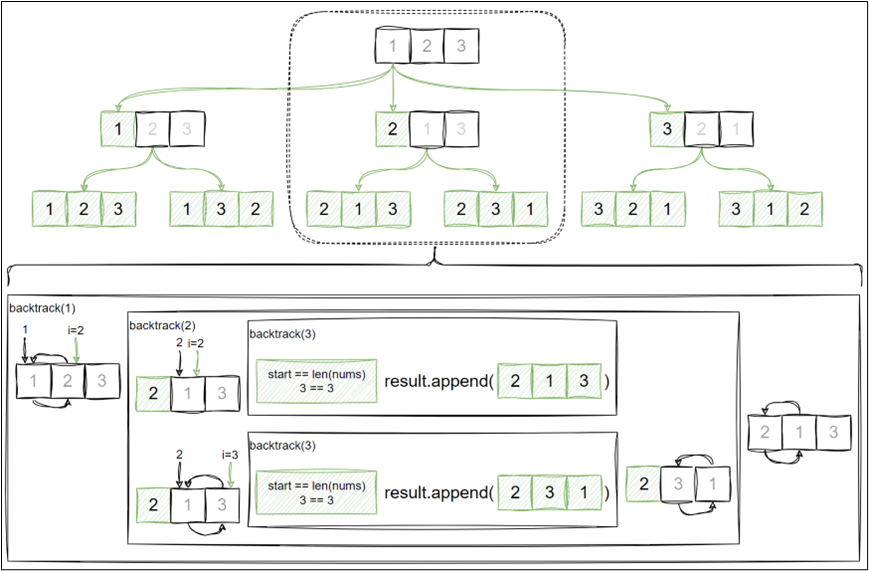


> 代码实现

```python
def permute(nums):
    result = []

    def backtrack(start):
        # 到达末尾，将此时排列结果添加到最终结果中
        if start == len(nums):
            result.append(nums[:])
            return

        # 从当前位置i开始，依次选取元素进行排列
        for i in range(start, len(nums)):
            # 选取当前位置的元素：将要选取的元素与此位置的元素互换
            if start != i:
                nums[start], nums[i] = nums[i], nums[start]
            # 递归处理下一个位置的元素
            backtrack(start + 1)
            # 回溯，恢复原始数组
            if start != i:
                nums[start], nums[i] = nums[i], nums[start]

    backtrack(0)
    return result

# 测试
if __name__ == "__main__":
    print(permute([1, 2, 3]))

```

> 代码执行过程分析

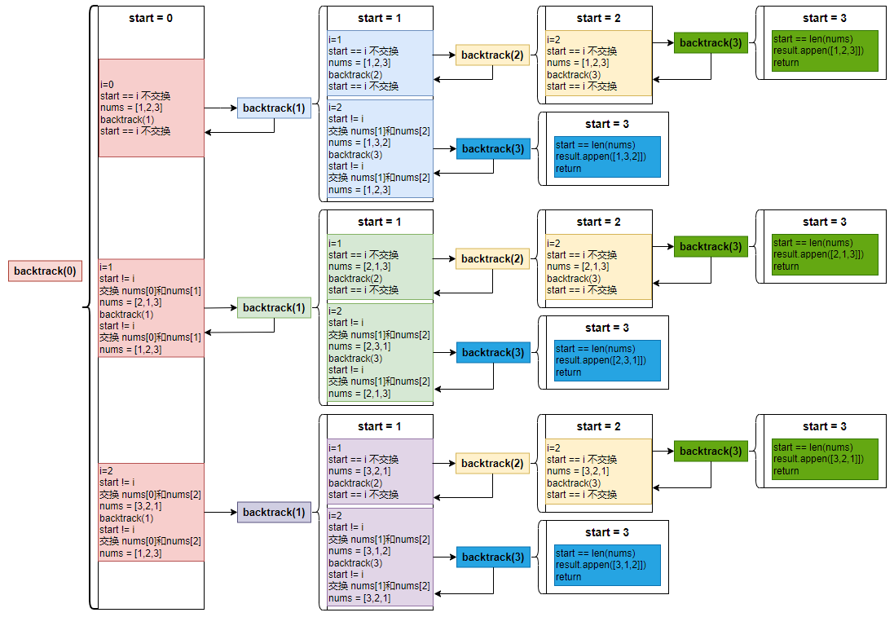

### 3.5.3 案例二：N皇后

> 力扣51题https://leetcode.cn/problems/n-queens/description/
>
> 按照国际象棋的规则，皇后可以攻击与之处在同一行或同一列或同一斜线上的棋子。
>
> n皇后问题研究的是如何将n个皇后放置在n×n的棋盘上，并且使皇后彼此之间不能相互攻击。给一个整数n，返回所有的解决方案。每一个方案中 'Q' 和 '.' 分别代表了皇后和空位。

- 输入：n = 4
- 输出：[[".Q..","...Q","Q...","..Q."],["..Q.","Q...","...Q",".Q.."]]

解释：如图所示，4皇后问题存在两个不同的解法。

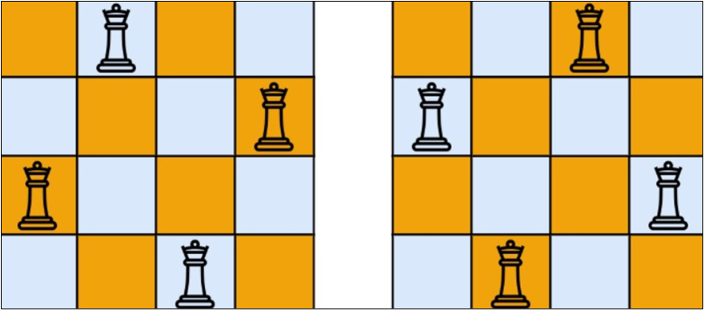

> 思路分析：

实现步骤：

- 选择：从棋盘每行中选择一个列放置棋子。
- 验证合法性：每次放置一个皇后时，检查该位置是否与其他已经放置的皇后在列或对角线上发生冲突。
- 递归：棋子放置位置合法则递归放置下一个棋子。
-  终止条件：若所有棋子都放置完则终止递归。
- 回溯：回到上一步，尝试下一个位置。

> N=3

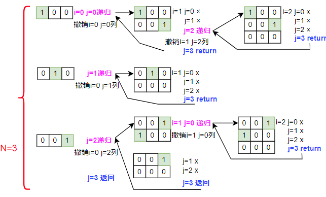

> N=4

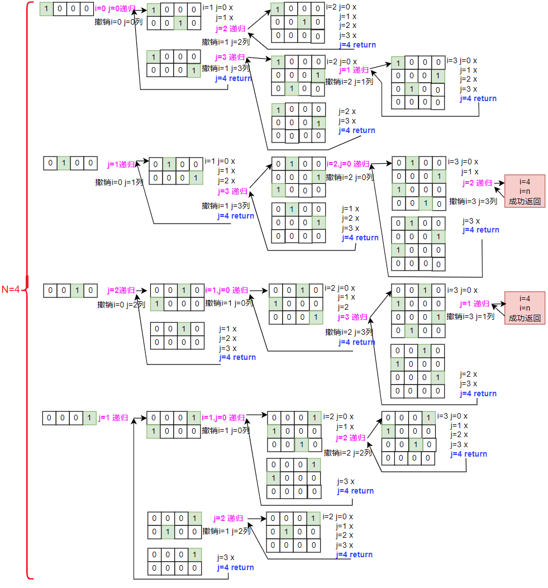

> 代码实现

```py
"""
    N皇后问题
"""
def n_queens(n):
    result = []
    cols = set()  # 记录哪些列有皇后
    diag1 = set()  # 记录哪些主对角线上有皇后
    diag2 = set()  # 记录哪些副对角线上有皇后

    # 初始化棋盘
    board = [["." for _ in range(n)] for _ in range(n)]

    def backtrack(row):
        # 如果已经放置了n个皇后，说明找到一个解
        if row == n:
            result.append(["".join(row) for row in board])
            return

        for col in range(n):
            # 检查当前列和对角线是否有皇后
            if col in cols or (row - col) in diag1 or (row + col) in diag2:
                continue  # 如果有冲突，跳过当前列

            # 放置皇后
            board[row][col] = "Q"
            # 标记当前列和对角线
            cols.add(col)
            diag1.add(row - col) # 主对角线（左上到右下）同一条主对角线上的所有位置，其 row - col 的值相同
            diag2.add(row + col) # 副对角线（右上到左下）同一条副对角线上的所有位置，其 row + col 的值相同

            # 递归处理下一行
            backtrack(row + 1)

            # 回溯，删除当前位置的皇后，并清理列和对角线的标记
            board[row][col] = "."
            cols.remove(col)
            diag1.remove(row - col)
            diag2.remove(row + col)

    backtrack(0)
    return result

# 测试
if __name__ == "__main__":
    print(n_queens(4))

```

## 3.6 贪心算法

### 3.6.1 贪心算法概述

贪心算法在解决问题时，采取的是逐步选择当前状态下最优的选项（即局部最优解），并期望通过这些局部最优解得到全局最优解。在每一步中，贪心算法都会选择当前看起来最优的选择，不考虑未来的选择。并通过一系列局部最优的选择，最终达到全局最优解（虽然并非总是能得到最优解，贪心算法的有效性依赖于问题的特性）。

贪心算法的特点：

- 选择性：在每一步选择中，贪心算法根据某种启发式策略选择局部最优解。
- 不可回溯：一旦做出了选择，就不能回退或重新考虑。
- 局部最优：每一步的选择都依赖于局部最优，但并不保证整个问题能得到全局最优解。

贪心算法能够得到全局最优解的条件是问题需要满足贪心选择性质和最优子结构：

- 贪心选择性质：通过局部最优的选择可以导出全局最优解。也就是说，每一步的局部选择都不会影响后续的选择，最终可以得到全局最优。
- 最优子结构：问题的最优解包含子问题的最优解，即可以通过解决子问题来构建问题的最终解。

### 3.6.2 案例一：最大交换

> 力扣670题https://leetcode.cn/problems/maximum-swap/description/
>
> 现有一个非负整数，至多可以交换一次数字中的任意两位。返回能得到的最大值。

示例：

- 输入：2736
- 输出：7236

解释：交换数字2和数字7。

> 思路分析

从右向左遍历，同时维护一个最大数的索引。

- 如果当前位置的数大于最大数，则更新最大数索引。
- 否则将当前位置的数与最大数进行交换，交换后的数更新到result中，再将两个位置的数交换回来将数组恢复原样。

遍历结束后，result中的数就是能得到的最大值。

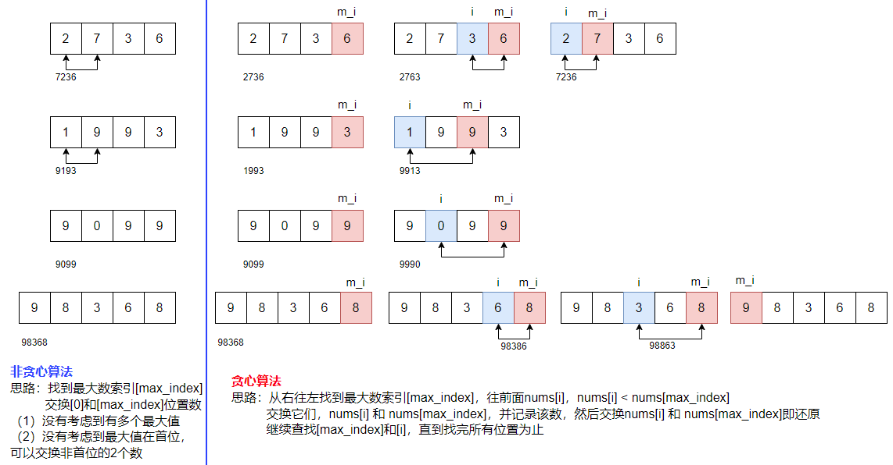

> 代码实现

```python
"""
    最大交换
"""
def maximumSwap(num):
    result = num
    num_list = list(str(num))
    max_index = -1  # 最大值的索引
    for i in range(len(num_list) - 2, -1, -1):
        # 当前值大于最大值时，更新最大值的索引
        if num_list[i] > num_list[max_index]:
            max_index = i
        # 当前值小于最大值时，交换，更新result，再交换回来
    	elif num_list[i] < num_list[max_index]:
            num_list[i], num_list[max_index] = num_list[max_index], num_list[i]
            result = int("".join(num_list))
            num_list[i], num_list[max_index] = num_list[max_index], num_list[i]
    return result

# 测试
if __name__ == '__main__':
    print(maximumSwap(2736))
    print(maximumSwap(1993))
    print(maximumSwap(9099))
    print(maximumSwap(98368))
    print(maximumSwap(79831265))
    print(maximumSwap(9831265))
```

或

```python
"""
    最大交换
"""
def maximumSwap(num):
    result = num
    num_list = list(str(num))
    max_index = -1  # 最大值的索引
    for i in range(len(num_list) - 2, -1, -1):
        # 当前值大于最大值时，更新最大值的索引
        if num_list[i] > num_list[max_index]:
            max_index = i
        # 当前值小于最大值时，交换，更新result，再交换回来
        else:
            num_list[i], num_list[max_index] = num_list[max_index], num_list[i]
            result = max(result, int("".join(num_list)))
            num_list[i], num_list[max_index] = num_list[max_index], num_list[i]
    return result

# 测试
if __name__ == '__main__':
    print(maximumSwap(2736))
    print(maximumSwap(1993))
    print(maximumSwap(9099))
    print(maximumSwap(98368))
    print(maximumSwap(79831265))
    print(maximumSwap(9831265))
```


### 3.6.2 案例二：分发糖果

> 力扣135题https://leetcode.cn/problems/candy/description/
>
> n个孩子站成一排。用一个整数数组ratings表示每个孩子的评分。按照以下要求，给这些孩子分发糖果：
>
> - 每个孩子至少分配到1个糖果。
> - 相邻两个孩子评分更高的孩子会获得更多的糖果。
>
> 给每个孩子分发糖果，计算并返回需要准备的最少糖果数目。

#### 方法一：来回走分糖果

（1）每个孩子先分发1个糖果。

（2）从左向右遍历，如果右边孩子比左边孩子评分高，则右边孩子糖果数量应该>左边孩子糖果数量，这时令右边孩子糖果数量为左边孩子糖果数量+1。

（3）再从右向左遍历，如果左边孩子比右边孩子评分高，则左边孩子糖果数量应该为max(右边孩子糖果数量+1, 自己糖果数量)。

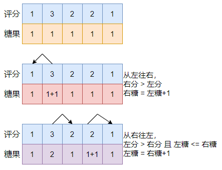

> 实现代码

```python
"""
    分糖果1
"""
def candy(ratings):
    n = len(ratings)

    # 每个孩子先分发1个糖果
    candy_num = [1] * len(ratings)

    # 从左向右遍历，如果右边评分更高，则右边孩子的糖果数改为左边孩子的糖果数+1
    for pos in range(n - 1):
        if ratings[pos] < ratings[pos + 1]:
            candy_num[pos + 1] = candy_num[pos] + 1

    # 从右向左遍历，如果左边评分更高，则左边孩子的糖果数改为右边孩子的糖果数+1
    total_candies = candy_num[-1]
    for pos in range(n - 2, -1, -1):
        if ratings[pos] > ratings[pos + 1] and candy_num[pos] <= candy_num[pos + 1]:
                candy_num[pos] = candy_num[pos + 1] + 1
        total_candies += candy_num[pos]
    print("糖果数为：", candy_num)
    return total_candies

# 测试
if __name__ == '__main__':
    score = [1,3,2,2,1]
    print("评分数组：", score)
    print(candy(score))
```

#### 方法二：上升区下降区平缓区

每个孩子先分发1个糖果。            

按孩子评分相较于前一个孩子评分的增加、减少、不变分成3个区域，分别是上升区、下降区、平缓区。

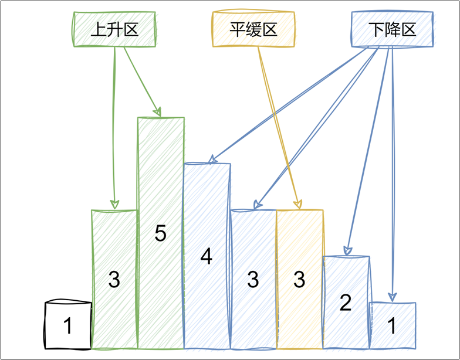

在进入不同区域时，执行不同的操作：

（1）上升区

上升区长度+1，并清空之前的下降区长度。同时在result中累加糖果数。上升区或下降区长度每增加1，result中都需要增加与上升区或下降区长度相同数量的糖果。

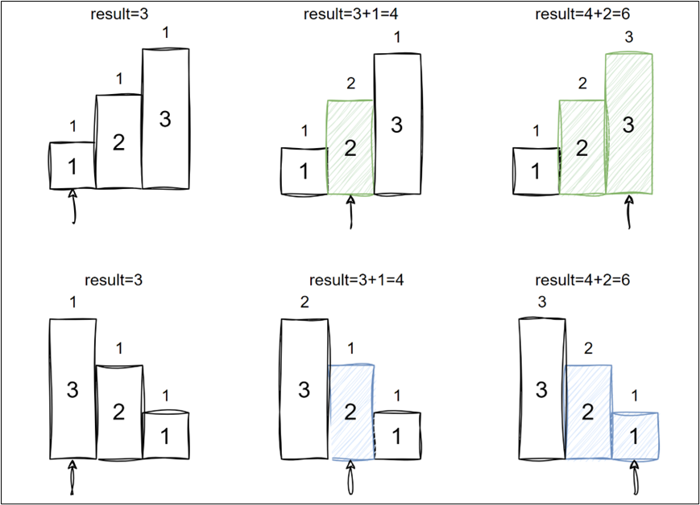

（2）下降区

下降区存在一个特殊的准下降区。当从上升区进入下降区后，第一个进入的为准下降区。

准下降区不计入下降区长度。

当下降区长度等于上升区长度时，准下降区转变为真下降区并计入下降区长度。

下降区内清空之前的上升区长度，同时在result中累加糖果数。

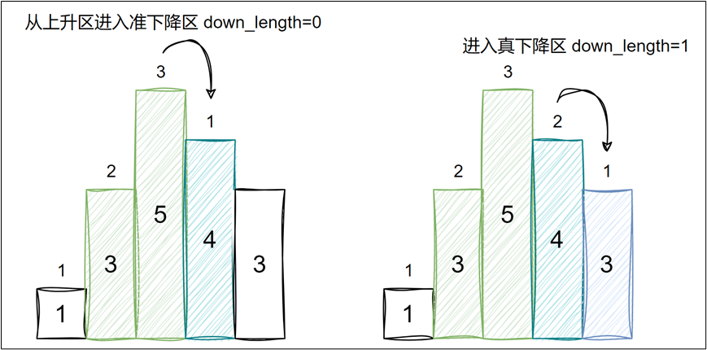

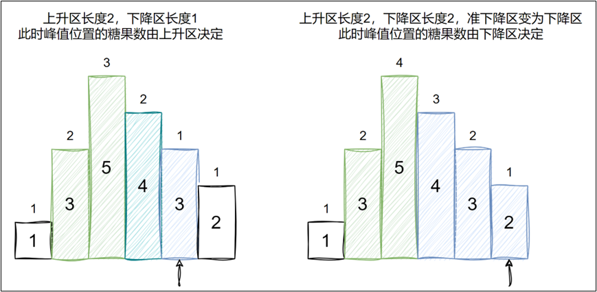

（3）平缓区

清空所有记录，没有其他操作。

> 举例说明过程分析

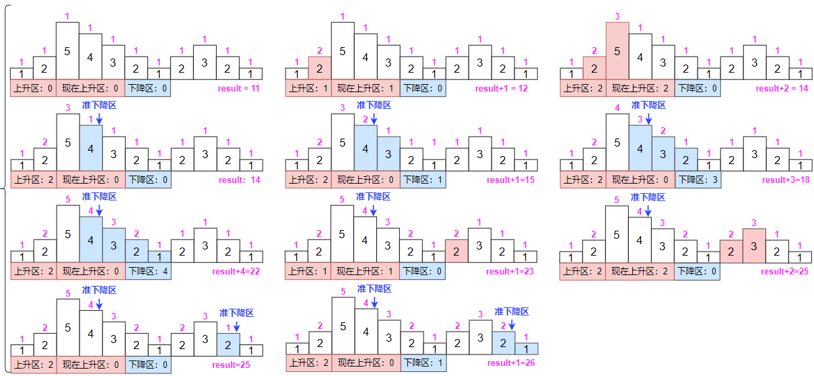

> 示例代码

```python
"""
    分糖果2
"""
def candy(ratings):
    # 每个孩子分发一个糖果
    result = len(ratings)
    # 上升区长度
    up_length = 0
    # 上升区长度的记录
    up_num = 0
    # 下降区长度
    down_length = 0
    for i in range(1, len(ratings)):
        # 如果处于上升区
        if ratings[i] > ratings[i - 1]:
            # 上升区长度+1，清空下降区长度，并在result中累加糖果数
            up_length += 1
            up_num = up_length
            down_length = 0
            result += up_length
        # 如果处于下降区
        elif ratings[i] < ratings[i - 1]:
            # 如果上升区长度为0，说明前一个位置已经不在上升区内，下降区长度+1
            if up_length == 0:
                down_length += 1
            # 如果下降区长度已经等于之前上升区长度，说明峰值的糖果数由下降区决定，下降区长度+1
            if down_length == up_num:
                down_length += 1
            # 清空上升区长度
            up_length = 0
            result += down_length
        # 如果处于平缓区
        else:
            # 清空所有记录
            up_length = 0
            down_length = 0
            up_num = 0
    return result


# 测试
if __name__ == '__main__':
    print(candy([1,3,2,2,1]))
    print(candy([1,2,5,4,3,2,1]))
    print(candy([1,2,5,4,3,2,1,2,3,2,1]))
```
