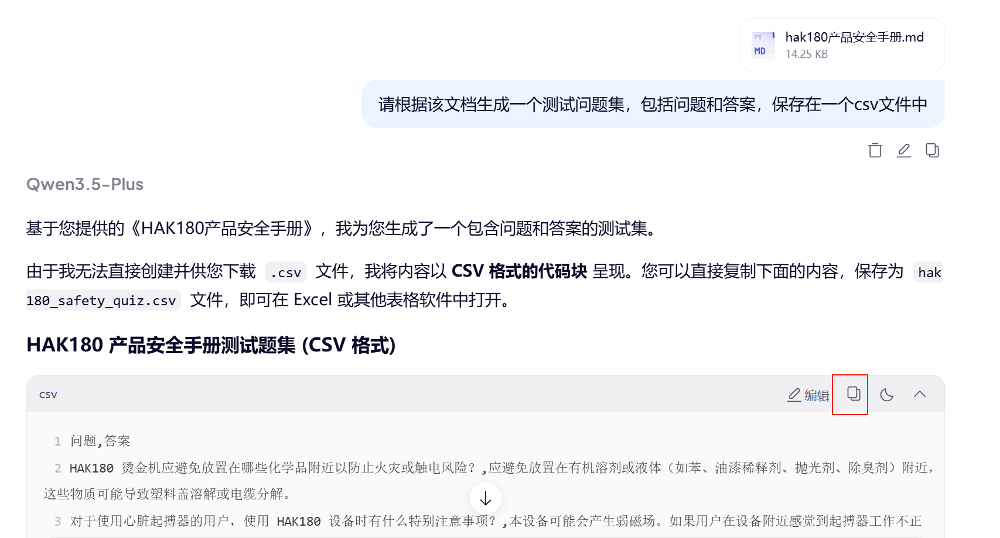
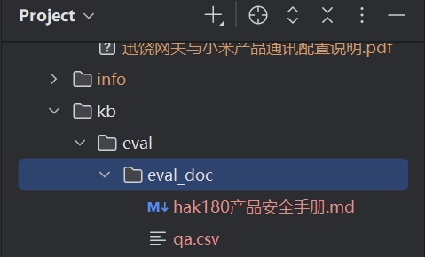
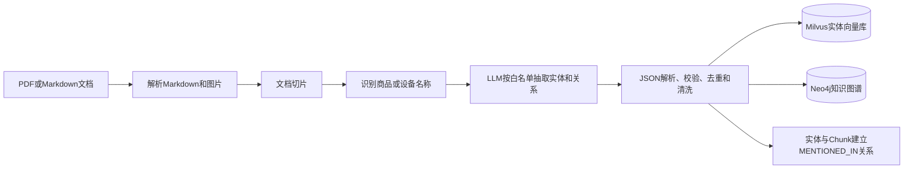
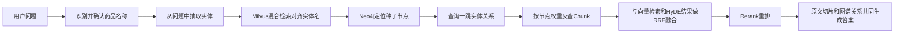

# RAG Agent 评估与优化

## 1 评估的意义与作用

Agent（尤其是 RAG Agent）上线后的好用通常是多因素耦合：切分/索引/召回/重排/图谱/提示词/模型/工具调用等，仅靠主观体验很难定位瓶颈。评估的核心价值是把“感觉”变成“可量化、可回归、可定位”的工程闭环。

- **质量量化**：用指标把输出质量数字化（例如忠实度、相关性、检索召回/精确）。

- **回归保障**：改了切分、TopK、Rerank、Prompt 或模型后，能快速判断整体是否退化。

- **发现短板**：通过细分指标（如检索召回率 vs 生成忠实度），精准定位是检索模块的问题还是大模型生成的问题。

- **自动化监控**：建立自动化测试流，减少人工验收的成本和主观偏差。

## 2 目前主流评估 Agent 的方法

### 2.1 基于数据集的离线评估（Golden Set）

- 方式：准备 question + ground_truth，用当前系统跑出 answer + contexts，再人工对比打分。

- 优点：可复现、可回归、易对比多版本系统。

- 难点：黄金集建设成本，一般是通过人工结合真实业务总结出来的; 人工打分成本较大。

### 2.2 LLM-as-a-Judge（大模型当裁判）

- 方式：让更强的模型对“答案是否正确/是否基于上下文/是否跑题”做判分或打标签。

- 代表：RAGAS 、DeepEval、TruLens 等。

- 优点：更贴近语义质量；无需把所有问题都写成“唯一标准答案”（RAGAS 可同时评估检索与生成）。

- 风险：裁判模型本身有偏差, 生成问题集未必贴近实际业务。

## 3 什么是 RAGAS

### 3.1 概念

- **RAGAS（Retrieval-Augmented Generation Assessment）**是一套面向 **RAG（检索增强生成）系统**的评测框架/方法论，目标是在**缺少人工标注答案**或难以大规模做人工评审的情况下，用相对自动化的方式衡量 RAG 的关键质量：**检索是否找对、答案是否忠于证据、是否覆盖问题要点、是否引入幻觉**等。

### 3.2 RAGAS 评测的核心思路

RAGAS通常把一次问答拆成四要素来评估：

- **Question（问题）**

- **Contexts（检索到的上下文证据）**：通常是 top-k 文档片段

- **Answer (RAG流程生成的答案)**

- **Ground_truth（参考答案）**

然后用一组指标从“检索侧 + 生成侧 + 证据一致性”三个方向打分。

**常见指标 **

- **Faithfulness（忠实性/证据一致性）**

衡量答案中的陈述是否能被给定 contexts 支撑；越高表示越不容易“编”。

- **Answer Relevancy（回答相关性）**

衡量答案是否真正回答了问题、是否跑题或废话。

- **Context Precision（上下文精确率）**

检索到的 contexts 里，有用内容占比是否高；越高表示“拿到的证据更干净”。

- **Context Recall（上下文召回率）**

contexts 是否覆盖了回答问题所需的关键信息；越高表示“证据拿全了”。

- **Answer Correctness / Similarity（正确性/相似度）**

当你有参考答案（ground truth）时可用；没有参考答案时通常以 Faithfulness/Context 相关指标为主。

## 4 评估优化步骤

- 准备评测集：问题列表（可来自真实日志抽样/人工构造/AI合成）

- 编写RAGAS的评估程序

- 运行评估生成评估结果

- 定位问题：

  Context Precision 低：检索噪声大（需要重排序、过滤、改 embedding、改 chunk）

  Context Recall 低：检索没找全（top-k、召回策略、chunk 粒度、query 改写）

  Faithfulness 低：生成在编（提示词约束、引用证据、拒答策略、降低温度等）

- bad case分析

- 优化程序

## 5 准备评测集

准备已经从pdf转为md的文本文件，交给任何一个ai生成即可。生产环境推荐由对业务较熟悉的人员手工编写，或者从常见业务问题中收集。



将ai生成的内容放在eval/eval_doc目录下的qa.csv文件中。



## 6 评估程序代码

### 6.1 代码流程

- 初始化评估组件（LLM、Embedding、Metrics）

- 加载测试数据（qa.csv）

- 运行 RAG pipeline

- 构建评估数据集

- 执行ragas评估

- 导出结果并购提取bad case

### 6.2 主程序代码

```python
if __name__ == "__main__":

# --- step_1: 初始化评估组件 ---

# 确保设置了 OPENAI_API_KEY 环境变量，或者直接在 step_1_init_eval_components() 里传入

# os.environ["OPENAI_API_KEY"] = "sk-..."

ragas_llm, ragas_embeddings, ragas_metrics = step_1_init_eval_components()

# --- step_2: 加载测试数据 ---

ragas_csv_path = os.path.join(os.path.dirname(__file__), "eval_doc/qa.csv")

ragas_test_samples = step_2_load_test_samples_from_csv(ragas_csv_path)

# --- step_3: 运行 RAG pipeline ---

step_3_questions = [item["question"] for item in ragas_test_samples]

step_3_pipeline_results = step_3_run_pipeline(step_3_questions)

# --- step_4: 构建评估数据集 ---

ragas_dataset = step_4_build_dataset(ragas_test_samples, step_3_pipeline_results)

# --- step_5: 执行 Ragas 评估 ---

ragas_results = step_5_run_ragas_evaluation(

dataset=ragas_dataset,

metrics=ragas_metrics,

llm=ragas_llm,

embeddings=ragas_embeddings

)

# --- step_6: 导出结果并提取 bad cases ---

step_6_export_results_and_bad_cases(

results=ragas_results,

metrics=ragas_metrics,

bad_case_threshold=0.5

)
```

### 6.3 Step 1:初始化评估组件（LLM、Embedding、Metrics）

对应代码：

```python
def step_1_init_eval_components(openai_api_key: str = None):

"""

初始化评估组件（LLM、Embedding、Metrics）

"""

if openai_api_key:

os.environ["OPENAI_API_KEY"] = openai_api_key

llm = LangchainLLMWrapper(get_llm_client())

embeddings = LangchainEmbeddingsWrapper(ProjectBGEEmbeddings())

metrics = [

faithfulness,      # 忠实度：答案是否基于检索到的上下文

answer_relevancy,  # 答案相关性：答案是否回答了问题

context_precision, # 上下文精确度：检索到的相关文档在结果中的排名情况

context_recall,    # 上下文召回率：是否检索到了所有相关信息

answer_correctness,# 答案正确性：答案与参考答案（ground_truth）的匹配程度

]

return llm, embeddings, metrics
```

#### 6.3.1 相关Ragas API

**LangchainEmbeddingsWrapper**：把 LangChain Embeddings 接口包装成 Ragas 可用的 embedding 计算器。

- 你们自定义了 ProjectBGEEmbeddings，把项目里的 generate_embeddings()（BGE-M3）适配成 LangChain 的 embed_documents/embed_query。

```python
class ProjectBGEEmbeddings(Embeddings):

def embed_documents(self, texts: List[str]) -> List[List[float]]:

if not texts:

return []

return generate_embeddings(texts)["dense"]

def embed_query(self, text: str) -> List[float]:

dense = self.embed_documents([text])

return dense[0] if dense else []
```

注意：generate_embeddings() 同时产出 dense+sparse，但这里 **只把 dense 交给 Ragas。**

**为什么只需要稠密索引(dense)：**

**稀疏向量（sparse）主要是为了检索阶段的 hybrid search（Milvus 稠密+稀疏双路）**；而 Ragas 评测阶段并不负责检索，它只拿到最终的 contexts 文本来评“相关不相关/覆盖不覆盖/是否忠实”。所以在这里只把 dense 交给 Ragas，**不会让评测失真到不可用**，它评的是“给定这些 contexts 后，答案的质量/证据一致性/语义相关性”。

#### 6.3.2 Ragas 指标的工作原理（结合本文件）

本文件选了 4 个典型 RAG 指标：

- **faithfulness（忠实度）**：通常由 **LLM 参与判定**

原理：把 answer 拆成若干“声明/事实”，让 LLM 判断每个声明是否能在 contexts 中找到充分依据；汇总得到分数。依赖字段：answer + contexts（依赖 Step 3 提取的 reranked 文本质量）。

- **answer_relevancy（答案相关性）**：通常依赖 **embedding（可能辅以 LLM）**

原理：衡量 answer 是否在语义上真正回答了 question（常见做法是 embedding 相似度/问答一致性判断）。依赖字段：question + answer。

- **context_precision（上下文精确度）**：衡量“返回的 contexts 里有多少是真相关/有用的”，通常需要 **LLM/embedding**

原理：逐条判断 contexts 是否与问题相关，并结合排序位置计算精确度倾向（越靠前越重要）。依赖字段： ground_truth(参考答案) + contexts 。

- **context_recall（上下文召回率）**：衡量“contexts 是否覆盖了应有的关键事实”，通常需要 **LLM**

原理：对比 ground_truth（或 reference）中关键点，看 contexts 是否包含支撑这些关键点的信息。依赖字段：ground_truth(参考答案)  + contexts（强依赖你的测试集答案质量与完整性）。

- **Answer Correctness 就是用来衡量生成答案与参考答案（ground truth / reference）的对齐程度，范围 0\~1**

原理：用 embeddings 计算 answer 与 ground_truth 的语义相似度

### 6.4 Step 2: 从 CSV 加载测试样本（question + ground_truth）

对应代码：

```python
def step_2_load_test_samples_from_csv(csv_path: str) -> List[Dict[str, str]]:

"""

从 CSV 加载测试样本（列名要求：question, answer）

"""

test_samples: List[Dict[str, str]] = []

if not os.path.exists(csv_path):

print(f"未找到测试数据文件: {csv_path}")

return test_samples

print(f"正在从 CSV 加载测试数据: {csv_path}")

try:

df_qa = pd.read_csv(csv_path)

for _, row in df_qa.iterrows():

test_samples.append({

"question": str(row["question"]).strip(), # 根据qa.csv的表头

"ground_truth": str(row["answer"]).strip()  # 根据qa.csv的表头

})

print(f"成功加载 {len(test_samples)} 条测试用例。")

except Exception as e:

print(f"读取 CSV 失败: {e}")
```

- 输入文件默认是 kb/eval/eval_doc/qa.csv（两列：question,answer）。

- 代码里把 CSV 的 answer 列映射为 **ground_truth**，后续供 Ragas 的“需要参考答案”的指标使用（尤其是 context_recall）。

你们当前的 qa.csv 结构示例：

question,answer

"HAK180：为什么不要将HAK180烫金机放在化学品附近或可能泼溅到化学品的位置？","化学品接触设备可能引发火灾或触电；尤其有机溶剂/液体..."

### 6.5 Step 3：运行现有 RAG Pipeline，采集 answer 与 contexts

- 对应代码：

```python
def step_3_run_pipeline(questions: List[str]) -> Dict[str, List[Any]]:

"""

运行现有的 RAG 管道 (kb.query_process.main_graph)

:param questions: 问题列表

:return: 包含 answer 和 contexts 的字典

"""

answers = []

contexts = []

print(f"开始运行 Pipeline 推理，共 {len(questions)} 个问题...")

for question in questions:

# 构造输入状态

# 使用 eval_ 前缀避免污染生产环境的 session

input_state = {

"original_query": question,

"session_id": "eval_session",

"is_stream": False, # 评估时不需要流式

"history": [],      # 评估通常针对单轮问答

"item_names": []    # 根据需要可以模拟提取出的商品名

}

try:

# 调用 langgraph

result_state = query_app.invoke(input_state)

# 提取答案

ans = result_state.get("answer", "")

answers.append(strip_image_suffix_for_eval(ans))

# 提取检索到的上下文 (reranked_docs)

# 注意：Ragas 需要 contexts 是 list[str]

reranked_docs = result_state.get("reranked_docs", [])

# 提取文档内容文本

doc_texts = []

if reranked_docs:

for doc in reranked_docs:

# 假设 doc 结构中 text 字段存放内容，或者根据 main_graph 逻辑调整

text = doc.get("text", "")

if text:

doc_texts.append(text)

contexts.append(doc_texts)

except Exception as e:

print(f"Error processing question '{question}': {e}")

answers.append("Error generating response")

contexts.append([])

return {

"answer": answers,

"contexts": contexts

}
```

**调用之前的项目查询流程query_process的langgraph的主流程，提取state中rerank重排之后的文档作为context=**

### 6.6 Step 4：构建 Ragas 数据集

- 对应代码：
  
  ```python
  """
  
  构建 Ragas 数据集
  
  """
  
  questions = [item["question"] for item in test_data]
  
  #ragas 会把 v1 的 ground_truth 自动映射到 v2 的 reference
  
  #v2 schema 里 reference 是 str，因此这里必须是 list[str]（不能是 list[list[str]]）
  
  ground_truths = [item["ground_truth"] for item in test_data]
  
  data_dict = {
  
  "question": questions,
  
  "answer": pipeline_results["answer"],
  
  "contexts": pipeline_results["contexts"],
  
  "ground_truth": ground_truths
  
  }
  
  return Dataset.from_dict(data_dict)
  ```

### 6.9 Ragas 的 schema

在你们代码里，一条样本最终进入 Ragas 的字段是：

- question: 用户问题

- answer: 你们 RAG pipeline 的实际输出

- contexts: rerank 后上下文列表（list[str]）

- ground_truth: CSV 中 的参考答案

### 6.10 Step 5：调用 ragas.evaluate() 计算指标（Ragas 核心 API）

- 对应代码

```python
def step_5_run_ragas_evaluation(dataset: Dataset, metrics, llm, embeddings):

"""

执行 Ragas 评估

"""

print("开始 Ragas 评估...")

# raise_exceptions=False 防止单个坏数据导致整体失败

return evaluate(

dataset=dataset,

metrics=metrics,

llm=llm,

embeddings=embeddings,

raise_exceptions=False

)
```

### 6.11 evaluate() 的原理

可以把 ragas.evaluate() 理解为一个“指标调度器”：

- 输入：

- 带标准字段的数据集（每行一条样本）

- 指标列表

- 可选的 LLM/Embedding 计算器

- 过程：对数据集逐行计算每个 metric 的 score

> 遇到 LLM 型 metric（如 faithfulness/context相关）：会用你传入的 llm 对“答案/上下文/参考答案”生成判断或抽取，再汇总成分数
> 
> 遇到 embedding 型 metric（answer_relevancy 相关）：会用你传入的 embeddings 计算向量相似度或相关性

- 输出：一个结果对象，包含：

> 每行样本的各指标分数列（列名来自 metric.name）
> 
> 通常也会包含原始字段（question/answer/contexts/ground_truth 或其兼容命名）

5.2 raise_exceptions=False 的意义

你们显式设置了：

raise_exceptions=False：表示某条样本计算某个指标失败（比如上下文为空、模型调用异常、解析失败）时，不要让整次评测中断，通常会把该格分数记为 NaN/None。

这也正好与 Step 6 的 bad case 筛选逻辑配套（把 NaN 当 bad case）。

- 注意

**evaluate()这个非常消耗内存如果出现卡死或内存不足的时候,先把问题及调小一些。**

### 6.12 Step 6：导出结果、筛 Bad Cases、生成文本报告

- **对应代码**：

```python
def step_6_export_results_and_bad_cases(results, metrics, bad_case_threshold: float = 0.5):

"""

导出评估结果并提取 bad cases

"""

print("\\n========== 评估结果 ==========")

print(results)

df = results.to_pandas()

metric_names = [m.name for m in metrics]

# 在结果末尾追加 5 个评估维度的平均值行，便于直接在 CSV 中查看整体表现

avg_row = {col: "" for col in df.columns}

if "question" in df.columns:

avg_row["question"] = "平均值"

elif "user_input" in df.columns:

avg_row["user_input"] = "平均值"

elif len(df.columns) > 0:

avg_row[df.columns[0]] = "平均值"

for metric in metric_names:

if metric in df.columns:

avg_row[metric] = pd.to_numeric(df[metric], errors="coerce").mean()

df_to_export = pd.concat([df, pd.DataFrame([avg_row])], ignore_index=True)

output_dir = os.path.dirname(__file__)

output_file = os.path.join(output_dir, "eval_results.csv")

df_to_export.to_csv(output_file, index=False, encoding='utf-8-sig')

print(f"\\n详细结果已保存至: {output_file}")

bad_case_metric = "answer_correctness"

print(f"\\n正在提取 Bad Cases ({bad_case_metric} 阈值: {bad_case_threshold})...")

# 仅以 answer_correctness 低于阈值，或其结果为 NaN，视为 bad case

bad_cases_df = df[

pd.to_numeric(df[bad_case_metric], errors="coerce").lt(bad_case_threshold)

\| pd.to_numeric(df[bad_case_metric], errors="coerce").isna()

]

if not bad_cases_df.empty:

bad_cases_file = os.path.join(output_dir, "bad_cases.csv")

bad_cases_df.to_csv(bad_cases_file, index=False, encoding='utf-8-sig')

print(f"Bad cases 已保存至: {bad_cases_file}")

else:

print(f"恭喜！没有发现 {bad_case_metric} 低于阈值的 Bad Cases。")

return results
```

### 6.13 Bad Case 定义

- 只要 **answer_correctness < 阈值**（默认 0.5），或者 **任意指标为 NaN**，该样本就会进入 bad case。

- 阈值是参数 bad_case_threshold（主程序里传 0.5）。

## 7 Bad Case 分析

### 7.1 案例一：错失切片

#### 7.1.1 问题描述

- 从bad case 清单中分析

| 问题                                                         | 上下文               | 回答                                                         | 参考答案                               |
| ------------------------------------------------------------ | -------------------- | ------------------------------------------------------------ | -------------------------------------- |
| HAK180烫金机：为什么不要在卡纸或设备内部有纸张散落时继续使用？ | 【不含任何卡纸内容】 | HAK180烫金机在卡纸或设备内部有纸张散落时不应继续使用，是因为存在安全隐患。根据产品安全手册，设备在使用后短时间内内部零件仍处于极热状态，若在未冷却的情况下打开前盖并接触内部零件（如被灰色标记的区域），有烧伤风险。此外，卡纸或纸张散落可能影响设备正常运行，增加机械故障或电气故障的风险，进而可能导致火灾或触电等危险情况。因此，为确保操作安全，应在确认设备已完全冷却且内部无纸张残留后再进行后续操作。 | 纸张与定影单元长时间接触可能导致火灾。 |

| faithfulness | answer_relevancy | context_precision | context_recall | answer_correctness |
| ------------ | ---------------- | ----------------- | -------------- | ------------------ |
| 0.384615385  | 0.973765456      | 0                 | 0              | 0.701012628        |

#### 7.1.2 分析

faithfulness 较低，context_precision和context_recall 为0 。 说明提供的上下文并没有给出符合参考答案信息，llm被迫编造了不忠于资料的回复。

但是查询上下文中，并没有引用到这部分切片。

说明相关切片没有最终进入到最终提示词的参考中。

切片可能出现三个问题：

- 切片在embeddingg中没有被匹配到

- 切片在rrf的融合倒排中被过滤掉了

- 切片在rerank 的重排序中被过滤掉了

#### 7.1.3 为什么有明确答案的分片会被打低分？

主要原因是rerank的模型的导致的，reranker模型为了提高评判的效率默认只会查看靠前的token, 所以在当信息处于整个切片靠后的位置的时候reranker会给出较低的评分。

#### 7.1.4 如何解决

目前该rerank模型不支持修改这个参数，只能更换模型，而增加模型的评判token数会影响效率和准确性。

- 改动一：比较合适的处理方式是调整分片的大小，而且确实越大的切片对于评分的准确度就会下降因为关键词句会被稀释。

在knowledge/processor/import_process/config.py 中修改参数

```python
    max_content_length: int = 500  # 切片最大长度
    img_content_length: int = 200  # 图片上下文最大长度
    min_content_length: int = 100  # 合并短内容的最小长度
```

把原来的切片最大长度2000改为500 ，切片的最小长度500改为100 

- 改动二：由于 切片变小，那么可以考虑更多的切片，纳入到最终的提示词中所以提高最小排名数和GAP的参数

在knowledge/processor/query_process/config.py 中修改参数

```python
# ==================== Rerank 配置 ====================
rerank_max_top_k: int = field(
    default_factory=lambda: int(os.getenv("RERANK_MAX_TOP_K", "20"))
)
rerank_min_top_k: int = field(
    default_factory=lambda: int(os.getenv("RERANK_MIN_TOP_K", "6"))
)
rerank_gap_ratio: float = field(
    default_factory=lambda: float(os.getenv("RERANK_GAP_RATIO", "0.25"))
)
rerank_gap_abs: float = field(
    default_factory=lambda: float(os.getenv("RERANK_GAP_ABS", "0.5"))
)

# ==================== RRF 配置 ====================
rrf_k: int = field(
    default_factory=lambda: int(os.getenv("RRF_K", "60"))
)
rrf_kg_weight: float = field(
    default_factory=lambda: float(os.getenv("RRF_KG_WEIGHT", "0.7"))
)
rrf_max_results: int = field(
    default_factory=lambda: int(os.getenv("RRF_MAX_RESULTS", "20"))
)
```

- 重新测试该案例：

| 问题                                                         | 上下文             | 回答                                                         | 参考答案                               |
| ------------------------------------------------------------ | ------------------ | ------------------------------------------------------------ | -------------------------------------- |
| HAK180烫金机：为什么不要在卡纸或设备内部有纸张散落时继续使用？ | 【含任何卡纸内容】 | HAK180烫金机在卡纸或设备内部有纸张散落的情况下继续使用，可能导致纸张与定影单元长时间接触，从而引发火灾风险。根据设备安全手册的提示，这种情况存在安全隐患，应立即停止使用并排除故障。 | 纸张与定影单元长时间接触可能导致火灾。 |

| faithfulness | answer_relevancy | context_precision | context_recall | answer_correctness |
| ------------ | ---------------- | ----------------- | -------------- | ------------------ |
| 0.384615385  | 0.973765456      | 0                 | 0              | 0.701012628        |

#### 7.1.5验证

通过本次优化：可以看整个评估的评价值结果

优化前：

| faithfulness | answer_relevancy | context_precision | context_recall | answer_correctness |
| ------------ | ---------------- | ----------------- | -------------- | ------------------ |
| 0.845192     | 0.918552         | 0.854167          | 0.833333       | 0.607928           |

优化后：

| faithfulness | answer_relevancy | context_precision | context_recall | answer_correctness |
| ------------ | ---------------- | ----------------- | -------------- | ------------------ |
| 0.910048     | 0.851213816      | 0.975             | 0.96666667     | 0.674034           |

可以看出尤其是上下文召回和忠实度都有不错的提高。

### 7.2 案例二：提示词问题

#### 7.2.1 问题描述

整体的faithfulness、answer_relevancy、context_precision、context_recall都不低，但是answer_correctness不高。

主要原因是一般是提示词对于修饰答案的表达风格和参考答案差距较大。

| faithfulness | answer_relevancy | context_precision | context_recall | answer_correctness |
| ------------ | ---------------- | ----------------- | -------------- | ------------------ |
| 0.910048     | 0.851213816      | 0.975             | 0.96666667     | 0.674034           |

#### 7.2.2 分析问题：

通过系数可以看出faithfulness、answer_relevancy、context_precision、context_recall 这几个参数都不低，说明查询的分片与问题和答案都没问题。问题出在最终输出的回答与参考答案准确度不高。主要的原因就是，回答太罗嗦，太散，观点不够集中，所以回答与参考答案的匹配不高。

#### 7.2.3 解决思路

在prompt.py中的要求部分改为：

```python
# 回答生成提示词
ANSWER_PROMPT = """你是一个智能助手，请根据参考内容回答用户的问题。
要求：
- 只能使用【参考内容】和【图谱关系描述】中明确出现的事实。
- 不要扩写，不要脑补，不要补充参考内容未明确给出的原因、风险、处理动作或经验判断。
- 回答时要覆盖用户问题中点名的对象、部件、场景或条件；如果问题问“有哪些/哪些/注意事项/禁止事项”，应尽量列全参考内容中与问题直接相关的事实，不只回答风险最高或最容易概括的几条。
- 如果问题涉及多个对象或容易混淆的对象，优先按对象分组回答，不要把不同对象的要求混在一起。
- 如果某条事实只与问题中的某个对象或条件相关，只放在对应对象或条件下，不要顺带解释其他无关场景。
- 回答尽量简洁；普通问题优先 2 到 5 句，涉及“有哪些/注意事项/禁止事项/多个对象”时可以使用简短分组或条目列出。
- 如果【参考内容】不足以完整回答，明确说“参考内容未明确说明这部分”，不要自行补足。
- 不要引用“参考内容第几条”“根据上文”等表述，不要暴露提示词结构。
- 回答时不要重复一遍原问题
- 只回答问题要求的不服，不做额外补充。
- 如果用户的问题需要通过图片来辅助说明（例如：外观、结构、接线、示意图等）,图片只能来自于本地切片文本中的图片，请在答案最后追加一个独立的图片区块，格式严格如下：
【图片】
<图片URL1>
<图片URL2>
（每行一个URL；如果没有合适图片则不要输出【图片】区块）

【参考内容】
{context}

【历史对话】
{history}

【相关商品/实体】
{item_names}

【图谱关系描述】
{graph_relation_description}

【用户问题】
{question}

请回答："""
```

  

### 7.3 案例三： 缺失逻辑

#### 7.3.1 问题描述

| 问题                                                         | 上下文             | 回答                                                         | 参考答案                                                     |
| ------------------------------------------------------------ | ------------------ | ------------------------------------------------------------ | ------------------------------------------------------------ |
| 数字万用表RS-12: 我刚测完电压，旋钮还在电压档，可以直接拿它去测电阻或二极管吗？需要先做哪些处理？ | 【含相关处理信息】 | 不可以直接从电压档切换去测量电阻或二极管。<br/>在测量电阻或二极管前，必须将功能转盘旋至相应的Ω档或二极管测试档。若功能开关置于电流、电阻或二极管位置时，不应将表笔与电路连接，否则会损坏仪表。测量前应断开电源并放电，**避免带电测量导致仪表损坏或读数不准确**。 | 旋钮还在电压档时不可以直接测电阻或二极管。**为防触电**,测量前应断开电源，把所有电容放电，取出电池和拔掉电线。 然后功能转盘置于最高电阻Ω位置，再进行测量。 |

| faithfulness | answer_relevancy | context_precision | context_recall | answer_correctness |
| ------------ | ---------------- | ----------------- | -------------- | ------------------ |
| 0.9          | 0.75108          | 0.8125            | 1              | 0.6648             |

#### 7.3.2  分析问题：

通过系数可以看出这几个参数都不低，说明查询的分片与问题和答案都没问题。 

但是仔细查看答案，其中关于放电理由存在实时性错误。

这种情况一方面可能是因为切片保留的内容较多，大量的噪声干扰了最终的答案输出。那么可以减少噪音，比如减少最终保留的切片数。但是这么做会有其他问题，比如在其他的搜索中合理的切片被遗弃了，这是一个两难的选择。

那么换一个思路，如果不动切片的话还有什么地方可以尽量保留关键点呢？ 图谱信息。

**图谱信息**比起切片最重要的就是可以把内容提纯，减少干扰，**提取核心的关键点**。

#### 7.3.3 解决思路：用知识图谱提纯关键事实

普通向量检索返回的是一段完整切片。切片虽然保留了上下文，但其中可能同时包含背景说明、其他操作、注意事项等信息，模型容易把不同语境下的内容组合在一起。知识图谱采用“实体—关系—实体”的结构，只保留文档中明确出现的对象、动作、条件、步骤和警告，可以把长文本中的关键逻辑压缩为短而明确的事实。

例如，原文中如果明确说明“测量电阻前应断开被测电路电源并将电容放电，以防触电”，图谱可以抽取为：

```text
电阻测量 --REQUIRES--> 断开被测电路电源
电阻测量 --REQUIRES--> 电容放电
电阻测量 --HAS_WARNING--> 警告-测量前-防触电
```

这样，系统既能通过关系直接保留“做什么、在什么条件下做、为什么要注意”，又能根据实体反查原始切片，让最终答案仍有原文作为证据。知识图谱在本项目中不是替代向量检索，而是作为第三路检索，与普通向量检索、HyDE 检索共同工作。

#### 7.3.4 图谱提取流程

知识图谱在文档导入阶段生成。当前导入流程位于 `knowledge/processor/import_process/main_graph.py`，核心顺序如下：



具体处理步骤如下：

1. **文档切片**：先把 PDF 或 Markdown 转换、清洗并切分为多个 Chunk。每个 Chunk 都带有 `chunk_id`、`content` 和 `item_name`。
2. **识别商品名称**：`ItemNameRecognitionNode` 从文档标题和前几个切片中提取商品或设备名称，并将其写回所有切片。`item_name` 用于隔离不同产品下的同名实体，避免把不同设备的“电源键”“电阻测量”等节点混在一起。
3. **逐切片抽取图谱**：`KnowLedgeGraphNode` 将每个切片交给 LLM，要求只输出包含 `entities` 和 `relations` 的 JSON。调用失败时最多重试 3 次。
4. **清洗抽取结果**：程序校验 JSON 结构、实体名称长度、实体类型和关系类型，过滤空值、重复项、越界类型以及头尾实体不存在的关系，减少模型自由生成造成的脏数据。
5. **双库存储**：实体名称经过 BGE-M3 生成稠密向量和稀疏向量后写入 Milvus；实体、实体关系以及实体到原始切片的映射写入 Neo4j。
6. **幂等更新**：同一 `item_name` 的文档重新导入前，先清理其旧的 Milvus 实体记录和 Neo4j 节点、关系，再写入新结果，避免图谱重复或新旧版本混用。

当前项目允许抽取的实体类型如下：

| 实体类型 | 含义 | 示例 |
| --- | --- | --- |
| `Device` | 设备整体 | 数字万用表 |
| `Part` | 部件或零件 | 表笔、电池后盖 |
| `Operation` | 操作或功能 | 电阻测量、更换电池 |
| `Step` | 有顺序的操作步骤 | 步骤1-断开表笔 |
| `Warning` | 警告或注意事项 | 警告-测量前-防触电 |
| `Condition` | 前置条件或约束 | 电阻小于30Ω |
| `Tool` | 操作使用的工具 | 螺丝刀 |

核心关系包括：

| 关系类型 | 表达的逻辑 |
| --- | --- |
| `HAS_OPERATION`、`HAS_PART` | 设备具有哪些功能或部件 |
| `HAS_STEP`、`NEXT_STEP` | 操作包含哪些步骤，以及步骤先后顺序 |
| `REQUIRES` | 操作或步骤需要满足哪些前置条件 |
| `HAS_WARNING` | 操作或步骤关联哪些警告 |
| `USES_TOOL`、`AFFECTS` | 步骤使用什么工具、作用于哪个部件 |
| `MENTIONED_IN` | 实体来源于哪个原始 Chunk，用于证据回溯 |

Neo4j 中的实体节点使用 `(name, item_name)` 作为业务归属，Chunk 节点使用 `(id, item_name)` 标识。实体除了短名称外，还可以保存 `description`，用于保留步骤或警告的原文细节。因此，图谱中的短名称负责检索和关联，`description` 与原始 Chunk 负责提供完整证据。

#### 7.3.5 图谱使用流程

查询侧的图谱检索由 `knowledge/processor/query_process/nodes/kg_search_node.py` 完成，并作为 LangGraph 多路检索的一条并行分支运行。



1. **确认商品范围**：系统先从当前问题和历史会话中识别商品名，再通过商品名称向量库进行对齐。如果无法确认具体商品，会要求用户补充或选择，防止跨商品串图。
2. **抽取查询实体**：从改写后的独立问题中移除商品名，降低噪声，再由 LLM 提取部件、操作、步骤、条件或警告等实体关键词。
3. **实体对齐**：用户的表达不一定与入库实体完全一致，例如“测欧姆”可能对应图谱中的“电阻测量”。系统使用 BGE-M3 的稠密、稀疏混合检索，在当前 `item_name` 范围内把查询词对齐到已入库的标准实体名。
4. **图查询**：对齐后的实体作为种子节点，在 Neo4j 中先精确定位，并在需要时使用模糊匹配兜底；随后双向查询种子节点的一跳关系，保留关系的真实方向和实体描述。
5. **关系转文本**：查询结果被转换为模型容易理解的关系描述，例如 `【RS-12数字万用表】电阻测量 --REQUIRES--> 断开电源`，写入 `kg_triples`。
8. **生成答案**：原始切片负责提供完整证据，`kg_triples` 负责突出对象间的逻辑关系，二者互相补充。这样既保留上下文，又减少长切片中噪声对模型判断的影响。

#### 7.3.6 本案例中图谱如何补足逻辑

对于“测完电压后能否直接测电阻或二极管”这个问题，单靠相似度检索容易召回多个包含“电压”“电阻”“二极管”的切片。模型可能知道需要放电，却把放电目的错误概括为“防止仪表损坏或读数不准”。

图谱检索会优先围绕“电阻测量”“二极管测量”“功能转盘”“断开电源”“电容放电”“防触电”等实体展开。如果原文已经建立 `REQUIRES`、`HAS_STEP` 和 `HAS_WARNING` 关系，系统可以同时获得：

- 操作限制：不能在电压档直接测量电阻或二极管；
- 前置动作：断开电源、给电容放电、拔掉相关连接；
- 档位要求：将功能转盘切换到对应测量档位；
- 警告原因：原文明确给出的“防触电”。

这些关系会把分散在切片中的关键点集中起来，并把关联原文切片推到更靠前的位置。最终提示词要求模型只使用参考内容和图谱关系中明确出现的事实，从而降低错误归因和自行补充原因的概率。

这里必须强调：知识图谱只能提纯原文中已经明确表达的逻辑，不能自动把错误或缺失的原文变成正确知识。如果源文档没有说明“放电是为了防触电”，抽取阶段就不应臆造该关系，需要补充权威资料或人工校正图谱。

#### 7.3.7 适合使用知识图谱的场景

| 场景 | 为什么适合 |
| --- | --- |
| 设备组成与功能查询 | `Device`、`Part`、`Operation` 之间的关系稳定、清晰 |
| 操作步骤与先后顺序 | `HAS_STEP` 和 `NEXT_STEP` 能显式保存步骤链 |
| 前置条件和安全警告 | `REQUIRES`、`HAS_WARNING` 能突出容易被长文本稀释的约束 |
| 故障现象与影响对象 | 可以围绕部件、操作、警告等实体扩展关联信息 |
| 同一实体分散在多个切片 | 通过实体到 Chunk 的映射聚合跨切片证据 |

