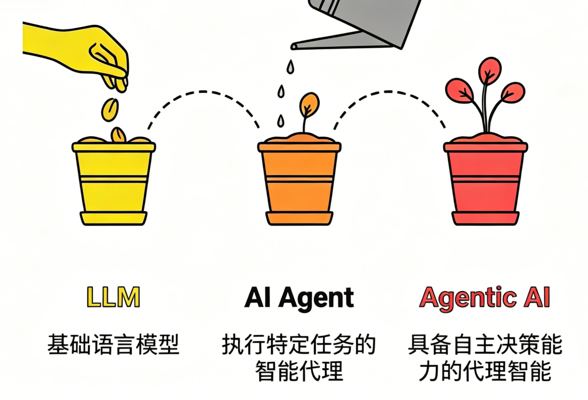
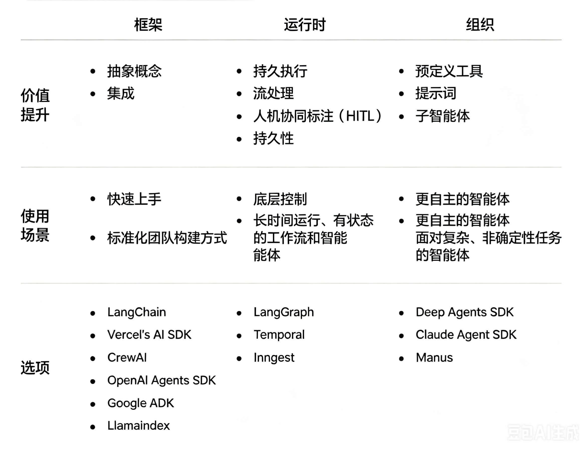
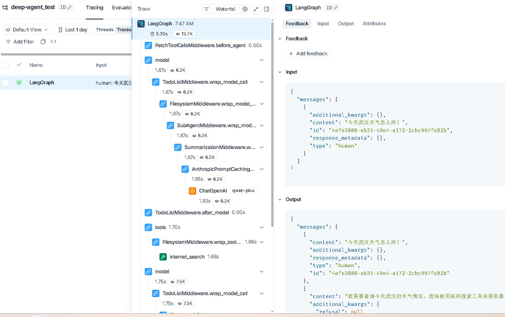
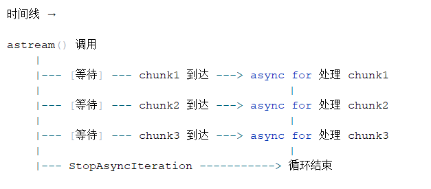
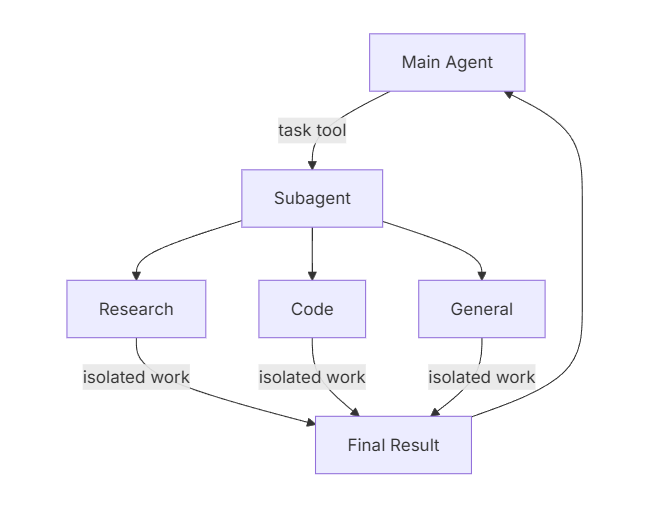
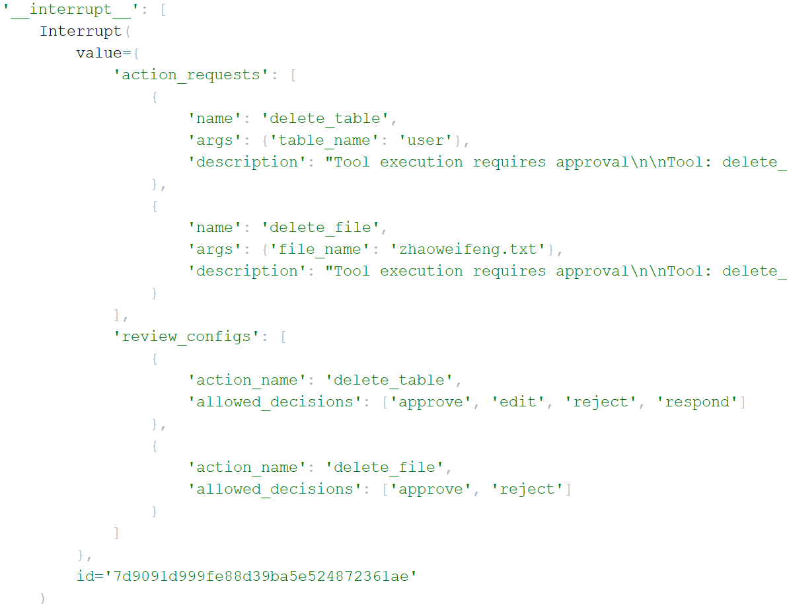
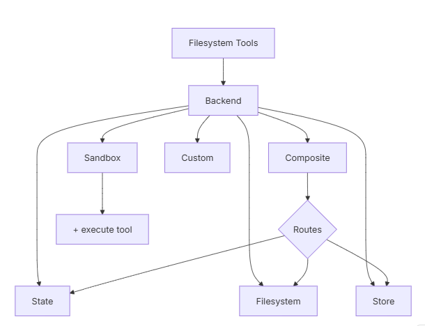
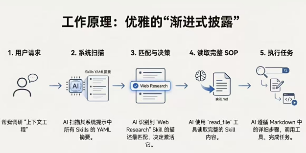

# DeepAgents 框架

## 1. 开篇引入

在过去短短数年间，人工智能的形态正经历一场层层递进的深刻演化。它从最初仅能 `响应问题` 的大型语言模型（LLM），逐步迭代为具备`调用工具、落地执行` 能力的 AI Agent，如今更朝着`拥有协作意识、可驾驭复杂工作流`的 Agentic AI 加速迈进。这条演进路径绝非简单的功能叠加，而是一条从 `语言理解能力` 到 `自主行动能力`，再到`智能组织与协作能力`的质变之路 —— 几乎构筑起未来智能应用的核心主轴。



为突破现有技术瓶颈，两个关键概念在研究与实践领域迅速崛起并成为核心驱动力 —— **深度代理（Deep Agents）**与**高阶提示（Higher-Order Prompts, HOPs）**。

在**深度代理**的架构中，模型不再是 “一次性输出答案” 的黑盒，而是化身具备`规划 - 执行 - 反馈 - 迭代`闭环能力的智能主体：

- 面对复杂任务时，先将其拆解为可落地的子目标；
- 为每个子目标匹配专属的子代理（sub-agent），实现专业化分工；
- 执行过程中实时监控各步骤产出，精准识别偏离目标的异常；
- 基于执行结果动态调整计划、替换策略，或生成新的子任务以补全链路；
- 当出现错误时，通过反思（reflection）机制回溯问题根源，修正执行路径。

而**高阶提示（HOPs）**则聚焦于 `教会模型如何思考`：如果说深度代理是智能系统的`组织架构师`，负责搭建任务执行的骨架，那么高阶提示就是 `认知规范师`，定义思考与推理的底层逻辑。

* **传统提示**：告诉我**做什么**。

  > 分析下面这条用户评论，判断情绪是正面、负面还是中性，并给出改进建议。
  >
  > 评论：“这个软件经常卡顿，打开要等很久，界面也不好看，用起来很烦躁。”

* **高阶提示**：告诉我**怎么想、按什么步骤、用什么逻辑**。

  > 请按以下**固定思考流程**分析用户评论：
  >
  > 1. 先逐句提取事实：用户提到了哪些具体问题？
  > 2. 再判断情绪：根据关键词判断是正面 / 负面 / 中性，并给出理由。
  > 3. 按问题严重程度排序：从最影响体验到最轻。
  > 4. 每条问题对应给出**可落地**的改进建议，不要空泛。
  > 5. 最后用一句话总结核心痛点。
  >
  > 评论：“这个软件经常卡顿，打开要等很久，界面也不好看，用起来很烦躁。”

传统提示偏向 “直接下达结果指令”，而高阶提示则更进一步，它向模型传递的是 “思考框架与推理范式”—— 明确告知模型该如何分析问题、如何拆解逻辑、如何组织思考过程，从根源上提升决策的精准度与执行的可靠性。

## 2. DeepAgents介绍和作用

> 构建能够规划、使用子代理并利用文件系统处理复杂任务的代理(深度智能体)
>
> https://docs.langchain.com/oss/python/deepagents/overview

**DeepAgents**是构建由大型语言模型（LLM）驱动的代理和应用的最简单方式——内置任务规划功能、用于上下文管理的文件系统、子代理生成和长期记忆，可以用它完成复杂、多步骤、自主规划的任务。

**DeepAgents**是一个独立库，建立在 LangChain代理核心构建模块之上。它使用 LangGraph 运行时进行持久化执行、流式传输、人机交互和其他功能,  主要实现**自主多智能体系统（Agentic AI）**！


**家族框架对比：**

> https://docs.langchain.com/oss/python/concepts/products
>


1. **langchain-core**（核心抽象层 / 基石）

​		它是整个生态的绝对底座。定义了最基础的接口、类型系统和抽象类（如 BaseChatModel、BaseTool、Runnable 等）。它不依赖生态内的其他包，但所有其他包都依赖它。

2. **langgraph**（运行时层 / 引擎）
    它是底层的编排与执行引擎。基于 langchain-core 构建，提供了有状态的图结构工作流能力（如 StateGraph、Checkpoint 持久化等）。它负责解决复杂工作流中的循环、分支和状态管理问题。
3. **langchain**（框架应用层 / 胶水  V1.x）
    它是应用层框架。建立在 langchain-core 之上，并深度集成 langgraph 作为其底层的运行时。它提供了构建 Agent 的高阶 API（如 create_agent）和通用逻辑，充当了核心抽象与具体应用之间的“胶水”。
4. **deepagents**（开箱即用层 / 多智能体套件agent harness）
    它是最高层的抽象和封装。强制依赖 langchain（v1版本）和 langgraph。它将规划（TodoList）、文件系统、子智能体、上下文管理等高级能力打包，提供了一个无需从零配置即可运行的完整“开箱即用”智能体（create_deep_agent）。

> langchain-core 是砖块和水泥（提供最基础的原材料和标准）。
> langgraph 是施工队和脚手架（负责把砖块按照复杂的图纸搭建起来，并处理施工中的状态流转）。
> langchain 是毛坯房框架（利用施工队把基础房间格局搭好，提供了通用的居住基础）。
> deepagents 是精装全配豪宅（在毛坯房的基础上，直接给你配齐了家具、家电、管家服务，拎包即可入


**功能横向对比：**




**LangChain、LangGraph、Deep Agents 使用场景总结：**

1. 何时使用 LangChain？

   - 你想**快速构建代理与自主应用**。

   - 你需要对**模型、工具、代理循环**提供标准抽象。（单Agent）

   - 你需要**易用且灵活**的开发框架。

   - 你在开发**简单直接的代理应用**，无复杂编排需求。

2. 何时使用 LangGraph？

   - 你需要对**代理编排做细粒度、底层控制**。

   - 你需要**持久化执行**，支持**长时间运行、有状态的代理**。

   - 你在构建**结合确定性步骤与智能代理步骤**的复杂工作流。

   - 你需要**可直接用于生产环境**的代理部署基础设施。

3. 何时使用 Deep Agents？

   - 你在构建**长期运行、持续运营、自主规划**的智能代理。
   - 你在构建需要处理**复杂、多步骤任务**的代理。
   - 你需要使用**预定义工具**：如文件系统操作、自定义工具、自动化上下文工程等。
   - 你希望直接使用**预设提示词与子代理**能力。

```
LangGraph: 明确的多步骤长流程处理需要（如：RAG项目）
LangChain: 简单，快速，没有复杂的长流程处理需求
DeepAgents：比较复杂，需要进行多个方向处理和分析（如：网络搜索，dbRAG搜索，docRAG搜索等）
```


## 3. DeepAgents核心能力

一个内置的`write_todos`工具让代理人能够将复杂任务分解为离散步骤，跟踪进度，并根据新信息调整计划

**核心能力一： 智能规划与任务分解** (最核心智能协调体现！避免传统的工作流)

> DeepAgents 内置 `write_todos` 工具，使代理能够：
>
> - 将复杂任务分解为离散的执行步骤
> - 实时跟踪任务执行进度
> - 根据新信息动态调整执行计划

例如：你要 “办一场生日派对”，DeepAgent 不会上来就瞎忙活，而是先帮你列个清晰的待办清单：

1. 确定派对时间 / 地点 → 2. 邀请朋友 → 3. 买食材 / 蛋糕 → 4. 布置场地 → 5. 准备游戏

执行过程中，它还会实时标记 “已完成 / 未完成”，比如发现蛋糕店没开门，会自动把 “买蛋糕” 改成 “换一家店”，甚至新增 “订外卖蛋糕” 的步骤 —— 完全像个有经验的策划师，把复杂事拆成一步步能落地的小事，还能灵活调整。

提示: `write_todos` 不是 Python 原生的函数，而是 **DeepAgents 框架内置的一个 “工具函数”** —— 你可以把它理解成：

> DeepAgent 自带的一个 “待办清单生成器”，专门让智能体把复杂任务拆成一条条可执行的待办事项，并且能把这些事项存起来、DeepAgent 还配了其他工具进行调整todos：
>
> - `read_todos`：智能体执行任务时，用来 “读取” 当前的待办清单，知道下一步该做啥；
> - `update_todos`：执行中发现需要调整步骤（比如 “检索资料” 需要加 “筛选权威来源”）来修改清单；
> - `delete_todos`：删掉不需要的步骤（比如报告写完后，删掉 “检查完整性” 的重复项）。

**核心能力二：高效上下文管理（最实用的 “内存扩容” 方案！避免上下文溢出）**

> DeepAgents 内置文件系统工具集（`ls`、`read_file`、`write_file`、`edit_file`），使代理能够：
>
> - 将大型上下文信息卸载到外部存储
> - 有效防止上下文窗口溢出问题
> - 处理可变长度的工具执行结果

就像你要 “整理 100 页的年度工作总结”，你的大脑（对应代理的上下文窗口）只能同时记住 10 页内容，多了就会忘前忘后。DeepAgent 会帮你准备一个 “专属文件柜”：

1. 先把 100 页总结拆成 10 个文件存在柜里 
2. 看第 1-10 页时，只把这 10 页拿在手里
3.  看完后放回，再取 11-20 页
4.  整理出的要点先写在草稿纸（临时文件）里，最后汇总成最终版本


**核心能力三：子agent生成机制（最灵活的 “分工协作” 模式！避免主代理超负荷）**

> DeepAgents 内置 `task` 工具，使代理能够：
>
> - 选择对应的子agent处理特定任务
> - 实现上下文隔离，保持主代理环境整洁
> - 深入执行复杂的子任务流程

就像你要 “装修一套房子”，你（主代理）不会既当设计师、又当瓦工、还当水电工，而是找专业的人干专业的事：

1. 派 “设计子代理” 出装修图纸 → 
2. 派 “施工子代理” 按图纸砌墙 / 铺砖 → 
3. 派 “水电子代理” 装水管 / 电路 → 
4. 你只负责统筹进度、汇总结果

执行过程中，子代理还能独立工作：比如设计子代理只关注 “风格、尺寸、配色”，不会被施工细节干扰；施工子代理出了问题（比如墙面不平），只会自己调整，不会影响你和水电子代理的工作 —— 完全像个会 “招兵买马” 的项目经理，把复杂任务拆给专业的 “帮手”，自己只做全局把控。

**核心能力四：长期记忆能力（持久的 “记忆存储” 系统！避免代理 “失忆”）**

> DeepAgents提供了多种存储方式实现长期记忆
>
> - 文件存储
> - 内存存储   store
> - 组合式存储

就像你要 “持续跟进一个客户的需求”，你不会每次和客户聊天都从头问 “你想要什么功能”，而是有一个 “客户档案本”：

1. 第一次聊天记录客户 “想要红色的产品、预算 5000 元” → 存进档案本 → 
2. 一周后聊天，先翻档案本记住之前的需求 → 
3. 新聊的 “要加定制 logo” 也补充进去 
4.  同事跟进时，也能看这个档案本，不用你再转述

## 4. DeepAgents快速入门 

快速构建第一个 Deep Agent：**一个能够自主联网搜索并撰写报告的“AI 研究员”**会借用Tavily网络搜索工具！

### 4.1. 步骤1：安装依赖

```cmd
uv init  # 也可以利用pycharm直接创建基于uv的项目
uv venv
uv add deepagents langchain-openai python-dotenv tavily-python
```

### 4.2. **步骤2：配置 API Key**

确保你拥有 LLM  和 Tavily (搜索) 的 API Key。位置：`.env`

- Tavily官网：https://app.tavily.com/home
- CloseAI官网：https://platform.closeai-asia.com/dashboard
- 百炼(千问)：https://bailian.console.aliyun.com/cn-beijing/?tab=home#/home
- DeepSeek：https://platform.deepseek.com/api_keys


```bash
#OPENAI
OPENAI_BASE_URL=https://api.openai-proxy.org/v1
OPENAI_API_KEY=sk-xxxxx

# Qwen
DASHSCOPE_BASE_URL=https://dashscope.aliyuncs.com/compatible-mode/v1
DASHSCOPE_API_KEY=sk-xxxxx

# https://app.tavily.com/
# tavily-api-key
TAVILY_API_KEY=tvly-dev-xxxxx
```

### 4.3. **步骤3：定义搜索工具**

DeepAgents 需要通过工具与外部世界交互。我们先定义一个简单的联网搜索工具。

文件：`01_helloworld.py`

```python
"""
测试1：deepagents的第一个测试例子
"""

import os
from dotenv import load_dotenv
from tavily import TavilyClient
from typing import Literal

from langchain.chat_models import init_chat_model
from deepagents import create_deep_agent


# 加载.env环境配置，如果在环境变量中配置了，就不会加载.env文件
load_dotenv()

# 创建TavilyClient对象
tavily_client = TavilyClient(api_key=os.getenv("TAVILY_API_KEY"))

# 定义一个联网搜索工具函数
def internet_search(
    query: str,
    max_results: int = 5,
    topic: Literal["general", "news", "finance"] = "general",
    include_raw_content: bool = False,
):
    """使用 Tavily 进行联网搜索"""
    print(f"正在搜索: {query}")
    return tavily_client.search(
        query=query,
        max_results=max_results,
        include_raw_content=include_raw_content,
        topic=topic,
    )

if __name__ == "__main__":
    print(internet_search.invoke({"query": "langchain是什么？"}))
```

### 4.4. **步骤4：创建 Deep Agent**

通过 `create_deep_agent` 工厂函数，将工具和 System Prompt 组装成一个智能体。

```python
# 初始化一个LLM
llm = init_chat_model(
    model="qwen-plus",
    api_key=os.getenv("DASHSCOPE_API_KEY"),
    base_url=os.getenv("DASHSCOPE_BASE_URL"),
    model_provider="openai",
)

# 创建一个深度智能体（代理）
deep_agent = create_deep_agent(
        model="gpt-4o",
        # model=llm,
        tools=[internet_search],
        system_prompt="""你是一个助手，需要使用网络搜索工具来获取信息。
            请使用中文回答问题。
            """, 
        subagents=[],
    )

```

### 4.5. **步骤5：运行并获取结果**

```python
# 执行深度智能体
result = deep_agent.invoke(
    {
        "messages": [
            {
                "role": "user",
                "content": "今天武汉天气怎么样?",
            }
        ]
    }
)

#打印整个结果
print(result)
print("\n")

# 打印目标结果内容
print(result["messages"][-1].content)
```

### 4.6. 总结

1. `result['messages']`：定位到存储全流程对话的列表；
2. `[-1]`：精准抓取列表最后一条（Agent 整理后的最终回复）；
3. `.content`：过滤掉所有冗余属性，只取纯文本回复内容。

### 4.7. 使用langSmith记录运行过程

-  **第一步：注册账号并获取 API Key**

1. 访问 [LangSmith 官网](https://smith.langchain.com/) 注册并登录（支持 GitHub、Google 等第三方登录）。
2. 登录成功后，点击左下角的 **Settings（设置）** -> **API Keys**，点击 **Create API Key** 生成并复制你的专属密钥（通常以 `lsv2_` 开头）。
3. 在 LangSmith 界面左侧点击 **Projects（项目）**，新建一个项目（例如命名为 `deepagents-demo`），用于存放你的追踪数据。

- **第二步：配置本地环境**

1. 在`.env` 文件中添加如下配置

   ```sh
   # 开启 LangSmith 追踪
   LANGCHAIN_TRACING_V2=true
   # 填入你在 LangSmith 创建的项目名称或新的名称
   LANGCHAIN_PROJECT=xxx
   # 填入你刚才复制的 API Key ==》https://docs.langchain.com/langsmith/home
   LANGCHAIN_API_KEY=lsv2_pt_xxxxx_xxxxx
   # LangSmith 的 API URL
   LANGCHAIN_ENDPOINT=https://api.smith.langchain.com
   lsv2_pt_xxxxx_xxxxx
   ```

   > 注意：功能代码中不需要进行任何额外编码，本地代码运行后，就可以直接在线查看运行记录了

   
   
   
   
   

## 5. 流式输出解析

深度代理基于 LangGraph 提供流式输出的支持，可以实时跟踪进展、Token的使用数量和工具调用

```python
"""
测试2：流式输出
    agent.stream()
"""
....
....

def query_stream(query:str):
    stream = deep_agent.stream({
        "messages": [
            {"role": "user", "content": query}
        ]
    })
    # print(stream)  # <generator object Pregel.stream at 0x000001F0401A18D0>

    for chunk in stream:
        for key, value in chunk.items():
            if not value or "messages" not in value: continue
            messages = value["messages"]
            if (messages and isinstance(messages, List)):
                last_msg = messages[-1]
                if key == 'model':
                    if last_msg.tool_calls:
                        for tool_call in last_msg.tool_calls:
                            print(f"智能体决定调用工具{tool_call['name']} 传入参数：{tool_call['args']}")
                    elif last_msg.content:
                        print(f"智能体最终执行结果：{last_msg.content}")
                elif key == 'tools':
                    print(f"智能体调用{last_msg.name}工具返回结果：{last_msg.conten}")

if __name__ == '__main__':
    query_stream("今天武汉天气怎么样? 搜索一下智能体最新资讯")
 
# =============================================================================
# Chunk 数据结构参考文档
# =============================================================================
# 流式输出的四种核心场景示例：
# 1. [场景 A：模型 思考并决定调用工具]
#    {
#      "model": {
#        "messages": [
#          AIMessage(
#            content="",
#            tool_calls=[{
#              "name": "read_file_content",
#              "args": {"filename": "需求.docx"},
#              "id": "call_123"
#            }]
#          )
#        ]
#      }
#    }
# 2. [场景 B：工具执行完毕，返回结果]
#    {
#      "tools": {
#        "messages": [
#          ToolMessage(
#            content="[文件内容]...",
#            name="read_file_content",
#            tool_call_id="call_123"
#          )
#        ]
#      }
#    }
# 3. [场景 C：Agent 决定调用子 Agent (特殊工具 'task')]
#    {
#      "model": {
#        "messages": [
#          AIMessage(
#            content="",
#            tool_calls=[{
#              "name": "task",
#              "args": {
#                "subagent_type": "网络搜索助手",  # 目标子 Agent
#                "description": "查询2024政策"     # 下发的具体任务
#              },
#              "id": "call_456"
#            }]
#          )
#        ]
#      }
#    }
# 4. [场景 D：Agent 最终回复用户]
#    {
#      "model": {
#        "messages": [
#          AIMessage(
#            content="根据查询结果，2024年新政策如下...",
#            tool_calls=[]
#          )
#        ]
#      }
#    }
# =============================================================================
```

## 6. 异步执行

**也可以调整成异步执行：**

1. **高并发服务**：用 FastAPI/Starlette 做接口时（比如给前端返回流式回答），`astream()` + 异步能同时处理成百上千个用户请求，不会因单个请求阻塞整个服务；
2. **批量处理任务**：需要同时调用智能体处理多个查询（比如你测试的 3 个问题），`astream()` 并发执行耗时≈最长单个任务，比同步 `stream()` 串行快几倍；
3. **非阻塞主线程**：在 GUI 程序（如 PyQt/Tkinter）、定时任务中调用智能体，`astream()` 异步执行不会让界面卡死 / 定时任务中断。
4. 注意：astream() 返回异步迭代器，必须用 `async for`进行遍历



```python
"""
测试3：异步执行
    agent.ainvoke(): 异步非流式输出
    agent.astream()：异步流式输出
    注意：astream() 返回异步迭代器，必须用 `async for`进行遍历
"""
import asyncio
import os
from typing import Literal

from deepagents import create_deep_agent

from dotenv import load_dotenv
from langchain.chat_models import init_chat_model
from langchain_core.tools import tool
from tavily import TavilyClient

# 加载.env配置
load_dotenv()

# 创建tavily客户端
tavily_client = TavilyClient(api_key=os.getenv("TAVILY_API_KEY"))


# 定义工具函数: 使用tavily进行网络搜索
@tool
def internet_search(
    query: str, # 搜索内容
    max_results: int = 5, # 最大返回结果数量
    topic: Literal["general", "news", "finance"] = "general", # 搜索主题
    include_raw_content: bool = False, # 是否返回原始内容 False为精简内容
):
    """
    使用tavily进行网络搜索
    :param query: 搜索内容
    :param max_results: 最大返回结果数量
    :param topic: 搜索主题
    :param include_raw_content: 是否返回原始内容
    :return: 搜索结果
    """
    print(f"--开始搜索：{query}")
    return tavily_client.search(
        query,
        max_results=max_results,
        include_raw_content=include_raw_content,
        topic=topic,
    )

# 初始化模型
llm=init_chat_model(
    model="qwen-plus",
    api_key=os.getenv("DASHSCOPE_API_KEY"),
    base_url=os.getenv("DASHSCOPE_BASE_URL"),
    model_provider="openai",
)

# 创建深度代理
agent = create_deep_agent(
    # model="openai:gpt-5.4",
    # model="anthropic:claude-sonnet-4-6",
    model = llm,
    tools=[internet_search],
    system_prompt="你是一个强大的助手",
)


# 异步非流式输出执行： ainvoke
async def query_ainvoke(query: str):
    result = await agent.ainvoke({"messages": [{"role": "user", "content": query}]})
    print(result['messages'][-1].content)

# 多个异步之间是串行执行的
async def batch_ainvoke():
    await query_ainvoke("AI最新资讯")
    await query_ainvoke("智能体最新资讯")
    await query_ainvoke("大模型最新资讯")

# 多个异步非流式之间是并行执行的
async def batch_ainvoke2():
    cor1 = query_ainvoke("AI最新资讯")
    cor2 = query_ainvoke("智能体最新资讯")
    cor3 = query_ainvoke("大模型最新资讯")
    await asyncio.gather(cor1, cor2, cor3)

# 异步流式输出执行: astream
async def query_astream(query: str):
    stream_result = agent.astream(
        {"messages": [{"role": "user", "content": query}]}
    )
    
    # astream()返回的是一个异步迭代器（AsyncIterator），必须使用async for来遍历
    async for chunk in stream_result:
        for key, value in chunk.items():
            # print(f"=={key}==")
            # print(value)
            if not value or "messages" not in value: continue
            message = value["messages"][-1]
            if key == "model":
                if message.tool_calls:
                    for tool_call in message.tool_calls:
                        print(f"--智能体准备调用工具{tool_call['name']}, 参数：{tool_call['args']}")
                elif message.content:
                    print(f"--智能体返回最终结果: {message.content}")
            elif key == "tools":
                tool_name = message.name
                tool_result = message.content
                print(f"--智能体调用{tool_name}工具返回的结果为：{tool_result}")

# 多个异步流式之间是串行执行的
async def batch_astream():
    await query_astream("AI最新资讯")
    await query_astream("智能体最新资讯")
    await query_astream("大模型最新资讯")

# 多个异步流式之间是并行执行的
async def batch_astream2():
    cor1 = query_astream("AI最新资讯")
    cor2 = query_astream("智能体最新资讯")
    cor3 = query_astream("大模型最新资讯")
    await asyncio.gather(cor1, cor2, cor3)

if __name__ == "__main__":
    # asyncio.run(batch_ainvoke())
    # asyncio.run(batch_ainvoke2())
    # asyncio.run(batch_astream())
    asyncio.run(batch_astream2())

```

## 7. subagents（子代理/子智能体）

> 指南：https://www.anthropic.com/engineering/building-effective-agents

### 7.1. 多智能体理解

多 Agent 系统（Multi-Agent System, MAS）是由多个具备**自主性、反应性、目标导向性**的智能体（Agent）组成的协作体系，通过标准化通信与协同机制，共同完成单一智能体无法独立应对的复杂任务。

简单解释，就是将复杂任务，拆解成多个子任务，分发给专长的Agent进行处理，最后综合结果！本质**分而治之**！！

| 维度         | 单体模型（注意力稀释法则）                                   | 多智能体（分而治之的极效）                                   |
| :----------- | :----------------------------------------------------------- | :----------------------------------------------------------- |
| **核心问题** | 同一个模型需处理多领域知识（如医学 + 法律），不同领域信息互相污染，推理能力断崖式下跌 | 将任务物理拆解，由专业 Agent 分别处理独立并行子任务，多方处理独立任务，性能优势极大提升！ |
| **组织类比** | 一人全栈（精力分散、专业度不足）                             | 专业敏捷团队（分工明确、各司其职）                           |
| **核心逻辑** | 注意力资源被多领域任务稀释，导致认知过载                     | 分布式算力 + 专业化分工，突破单体模型的物理天花板            |


### 7.2. DeepAgents子智能体入门

https://docs.langchain.com/oss/python/deepagents/subagents#configuration

深度代理可以创建子代理来委派工作。你可以在`子代理`参数中指定自定义子代理。子代理用于上下文隔离（保持主代理上下文的干净）以及提供专业指令。



子代理解决了**上下文膨胀问题** 。当代理使用输出较大的工具（如网页搜索、文件读取、数据库查询）时，上下文窗口会迅速被中间结果填满。子代理将这些详细工作隔离开来——主代理只接收最终结果，而非产生该结果的数十个工具调用。

**什么时候使用SubAgent：**

- 多步骤任务会让主代理的上下文变得杂乱

- 需要不同的 “专业技能 / 专属工具” 的环节

  > 比如主代理要做 “股票分析”，其中 “基本面分析” 需要财务工具、“技术面分析” 需要 K 线工具，给这两个环节配专属子代理（带对应工具）

- 需要不同模型能力的任务（多模态）

- 当你想让主Agent专注于高层协调时

**什么时候不应使用SubAgent：**

- 任务简单，一步就能干完

- 需要中间信息连贯，不能拆

  > 比如 “读一篇文章，然后总结核心观点”，拆给子代理读、再拆给另一个子代理总结，会丢上下文，不如主代理一次性干完。

- 当运营费用超过收益时

**Subagent配置方式:** `子代理`配置有两种方案`字典`或**`CompiledSubAgent`**对象。

将子代理定义为包含以下字段的词典：

| 字段名        | 类型                 | 必填 / 可选 | 核心描述                                                     | 继承规则（与主代理的关系）               |
| :------------ | :------------------- | :---------- | :----------------------------------------------------------- | :--------------------------------------- |
| name          | str                  | 必填        | 子代理的唯一标识；主代理调用 `task()` 工具时会使用该名称，也会作为 AIMessage / 流式输出的元数据，用于区分不同代理 | -（无继承，需自定义）                    |
| description   | str                  | 必填        | 子代理的职能描述（需具体、以行动为导向）；主代理会根据此信息判断是否将任务委派给该子代理 | -（无继承，需自定义）                    |
| system_prompt | str                  | 可选        | 子代理的执行指令，需包含工具使用指导、输出格式要求等核心规则 | 不继承主代理的，需自定义                 |
| tools         | list[Callable]       | 可选        | 子代理可使用的工具列表；建议极简配置，仅保留必要工具         | 不继承主代理的，需自定义                 |
| model         | str \| BaseChatModel | 可选        | 子代理使用的模型：1. 传字符串（如 `openai:gpt-5`）2. 传 LangChain 模型对象（如 `init_chat_model("gpt-5")`）省略则使用主代理的模型 | 默认继承主代理的模型，自定义会覆盖默认值 |
| middleware    | list[Middleware]     | 可选        | 自定义中间件，用于实现日志记录、速率限制、自定义行为等功能   | 不继承主代理的，需自定义                 |
| interrupt_on  | dict[str, bool]      | 可选        | 为特定工具配置 “人机协作流程（HITL）”；需搭配检查点（checkpointer）使用 | -                                        |
| skills        | list[str]            | 可选        | 技能文件的来源路径（如 `["/skills/research/"]`），用于加载子代理专属技能 | -                                        |

**示例**：创建一个主智能体，它拥有三个助手：

1.  **天气助手**：查询天气（固定返回“晴朗”）。
2.  **计算助手**：处理数学问题。
3.  **翻译助手**：负责中英互译。

> 基础代码

```python
"""
测试4_1: 子智能体的基本使用  => 基于字典定义子agent
创建一个主智能体，它拥有三个助手：
    1.  **天气助手**：查询天气（固定返回“晴朗”）。
    2.  **计算助手**：处理数学问题。
    3.  **翻译助手**：负责中英互译。
"""

import os
from deepagents import create_deep_agent
from dotenv import load_dotenv
from langchain.chat_models import init_chat_model

# 加载.env配置
load_dotenv()

# 初始化模型
llm=init_chat_model(
    model="qwen-plus",
    api_key=os.getenv("DASHSCOPE_API_KEY"),
    base_url=os.getenv("DASHSCOPE_BASE_URL"),
    model_provider="openai",
)

# 创建深度代理
agent = create_deep_agent(
    model = llm,
    tools=[],
    system_prompt="你是一个强大的助手",
)

def query_test(query: str):
    stream_result = agent.stream(
        {"messages": [{"role": "user", "content": query}]}
    )
    for chunk in stream_result:
        # print(chunk)
        for key, value in chunk.items():
            if not value or "messages" not in value: continue
            message = value["messages"][-1]
            if key == "model":
                if message.tool_calls:
                    for tool_call in message.tool_calls:
                        print(f"--准备调用工具{tool_call['name']}, 参数：{tool_call['args']}")
                elif message.content:
                    print(f"--智能体返回最终结果: {message.content}")
            elif key == "tools":
                print(f"--调用工具{message.name}返回的结果为：{message.content}")

query_test("今天武汉天气怎么样? 再计算123+234-99等于几？，同时将'好好学习，天天向上'翻译为英文")

```


**代码实现**：

```python
"""
测试4_1: 子智能体的基本使用  => 基于字典定义子agent
创建一个主智能体，它拥有三个助手：
    1.  **天气助手**：查询天气（固定返回“晴朗”）。
    2.  **计算助手**：处理数学问题。
    3.  **翻译助手**：负责中英互译。
"""

import os
from deepagents import create_deep_agent
from dotenv import load_dotenv
from langchain.chat_models import init_chat_model

# 加载.env配置
load_dotenv()

# 初始化模型
llm=init_chat_model(
    model="qwen-plus",
    api_key=os.getenv("DASHSCOPE_API_KEY"),
    base_url=os.getenv("DASHSCOPE_BASE_URL"),
    model_provider="openai",
)

# 定义天气助手子agent
weather_agent = {
    "name": "weather_helper",
    "description": "一个天气助手",
    "system_prompt": "你是一个天气助手，统一回复：今天天气晴，温度25度",
    "tools": [],
    # "model": "openai:gpt-5.4",  # Optional override, defaults to main agent model
}

# 定义计算助手子agent
math_agent = {
    "name": "math_helper",
    "description": "一个用于处理数学计算的助手",
    "system_prompt": "你是一个严谨的数学助手，回答用户所有的数学计算问题",
    "tools": []
}

# 定义翻译助手子agent
translate_agent = {
    "name": "translate_helper",
    "description": "一个中英相互翻译助手",
    "system_prompt": "你是一个中英想到翻译助手，如果是中文翻译为英文，反之翻译为中文",
    "tools": []
}

# 创建深度代理
agent = create_deep_agent(
    # model="openai:gpt-5.4",
    # model="anthropic:claude-sonnet-4-6",
    model = llm,
    tools=[],
    system_prompt="你是一个强大的管家，将任务交给合适的子智能处理",
    subagents=[weather_agent, math_agent, translate_agent]  # 配置子智能体
)

def query_test(query: str):
    stream_result = agent.stream(
        {"messages": [{"role": "user", "content": query}]}
    )
    for chunk in stream_result:
        for key, value in chunk.items():
            # print(f"=={key}==")
            # print(value)
            if not value or "messages" not in value: continue
            message = value["messages"][-1]
            if key == "model":
                if message.tool_calls:
                    for tool_call in message.tool_calls:
                        # 区分子智能体和工具
                        if tool_call["name"] == "task":
                            print(f"--准备调用子智能体{tool_call['args']['subagent_type']}, 参数：{tool_call['args']['description']}")
                        else :
                            print(f"--智能体准备调用工具{tool_call['name']}, 参数：{tool_call['args']}")
                elif message.content:
                    print(f"--智能体返回最终结果: {message.content}")
            elif key == "tools":
                if message.name=="task":
                    print(f"--调用子智能体返回的结果为：{message.content}")
                else :
                    print(f"--调用工具{message.name}返回的结果为：{message.content}")

query_test("今天武汉天气怎么样? 再计算123+234-99等于几？，同时将'好好学习，天天向上'翻译为英文")

```

**原理解析**：

- `subagents` 参数接收一个列表，每个元素是一个字典，定义了子智能体的配置。
-  `description` 非常关键：主智能体通过这段描述来判断何时调用该子智能体。
- 当主智能体发现用户意图匹配某个子智能体的 `description` 时，会自动生成一个 `task工具` 调用，将任务分发下去。


### 7.3. 兼容Langchain和Langgraph

​	如果已经存在**langchain**创建的`单智能体`，或者langGraph创建的状态图，在deepAgents中可以使用CompiledSubAgent将其编译为子智能体。

1. **兼容Langchain单**智能体

> 基础代码

```python
"""
  测试4_2: 兼容langchain子智能体格式
"""
import os
from dotenv import load_dotenv
from deepagents import create_deep_agent
from langchain.chat_models import init_chat_model


load_dotenv()

chat_model = init_chat_model(
    model="qwen-plus",
    model_provider="openai",
    api_key=os.getenv("DASHSCOPE_API_KEY"),
    base_url=os.getenv("DASHSCOPE_BASE_URL")
)


# 创建主智能体，设置子智能体
main_agent = create_deep_agent(
    model=chat_model,
    subagents=[],
    system_prompt="你是一个智能助手，所有的业务动作，你不要亲自做，都找子智能体进行处理！"
)

print("开始执行任务...")
result = main_agent.invoke({
    "messages": [
        {"role": "user", "content": "武汉今天的天气怎么样？"}
    ]
})
print(f"最终结果：{result['messages'][-1].content}")
```

**代码实现**：

```python
"""
  测试4_2: 兼容langchain子智能体格式
"""
import os
from dotenv import load_dotenv
from deepagents import create_deep_agent, CompiledSubAgent
from langchain.chat_models import init_chat_model
from langchain.agents import create_agent


load_dotenv()

chat_model = init_chat_model(
    model="qwen-plus",
    model_provider="openai",
    api_key=os.getenv("DASHSCOPE_API_KEY"),
    base_url=os.getenv("DASHSCOPE_BASE_URL")
)

# 工具函数
def get_weather(city: str) -> str:
    """
     查询指定城市天气
     """
    print(f"--get_weather工具正在查询：{city}天气")
    return f"{city}的天气是晴天，温度为25度。"

# 创建langchain的单智能体
chain_agent = create_agent(
    model=chat_model,
    tools=[get_weather]
)

sub_agent = CompiledSubAgent(
    name="sub_agent",
    description="子智能体，可以调用工具查询天气",
    runnable=chain_agent
)


# 创建主智能体，设置子智能体
main_agent = create_deep_agent(
    model=chat_model,
    subagents=[sub_agent],
    system_prompt="你是一个智能助手，所有的业务动作，你不要亲自做，都找子智能体进行处理！"
)

print("开始执行任务...")
result = main_agent.invoke({
    "messages": [
        {"role": "user", "content": "武汉今天的天气怎么样？"}
    ]
})
print(f"最终结果：{result['messages'][-1].content}")
```

2. 兼容LangGraph的状态图

```python
"""
  测试4_3: 兼容langgraph的状态图
"""
import os
from typing import TypedDict, Annotated
from dotenv import load_dotenv
from deepagents import create_deep_agent, CompiledSubAgent
from langchain.chat_models import init_chat_model
from langchain_core.messages import AIMessage
from langgraph.constants import END
from langgraph.graph import add_messages, StateGraph

load_dotenv()

chat_model = init_chat_model(
    model="qwen-plus",
    model_provider="openai",
    api_key=os.getenv("DASHSCOPE_API_KEY"),
    base_url=os.getenv("DASHSCOPE_BASE_URL")
)

# 创建langgraph的状态图
class MyState(TypedDict):
    # 注解messages的类型为list, messaages的数据在多个节点之间是累加的方式
    messages: Annotated[list, add_messages]
def process_node(state: MyState):
    print(f"--开始处理节点：{state}")
    return {"messages": [AIMessage(f"经过节点处理后的结果：原数据为：{state['messages'][-1].content}")]}
state_graph = StateGraph(MyState)
state_graph.add_node("worker", process_node)
state_graph.set_entry_point("worker")
state_graph.add_edge("worker", END)
compiled_graph = state_graph.compile()


# 将状态图编译成子智能体
sub_agent = CompiledSubAgent(
    name="subagent",
    description="子任务，可以调用天气工具，查询天气信息！!",
    runnable=compiled_graph
)

# 创建主智能体，设置子智能体
main_agent = create_deep_agent(
    model=chat_model,
    subagents=[sub_agent],
    system_prompt="你是一个智能助手，所有的业务动作，你不要亲自做，都使用subagent进行处理！"
)

print("开始执行任务...")
result = main_agent.invoke({
    "messages": [
        {"role": "user", "content": "查询武汉的天气！"}
    ]
})

# print(result)
print(f"最终结果：{result['messages'][-1].content}")
```

### 7.4. 子智能体格式化输出

子智能体支持结构化输出，因此父智能体接收的是可预测、可解析的JSON，而不是自由格式文本。在子智能体配置上传递`response_format`， 并指定为自定义的BaseModel类型，在类型中指定数据名称和类型来约束响应数据的格式。

> 基础代码

```python
"""
测试4_4: 通过response_format配置给子智能体指定输出数据的格式
"""

import os
from typing import Literal

from dotenv import load_dotenv
from langchain.chat_models import init_chat_model
from langchain_core.tools import tool
from pydantic import BaseModel, Field
from deepagents import create_deep_agent
from tavily import TavilyClient

load_dotenv()

tavily_client = TavilyClient(api_key=os.getenv("TAVILY_API_KEY"))

@tool
def internet_search(
    query: str, # 搜索内容
    max_results: int = 5, # 最大返回结果数量
    topic: Literal["general", "news", "finance"] = "general", # 搜索主题
    include_raw_content: bool = False, # 是否返回原始内容 False为精简内容
):
    """
    使用tavily进行网络搜索
    :param query: 搜索内容
    :param max_results: 最大返回结果数量
    :param topic: 搜索主题
    :param include_raw_content: 是否返回原始内容
    :return: 搜索结果
    """
    print(f"---开始搜索：{query}")
    return tavily_client.search(
        query,
        max_results=max_results,
        include_raw_content=include_raw_content,
        topic=topic,
    )

chat_model = init_chat_model(
    model="qwen-plus",
    model_provider="openai",
    api_key=os.getenv("DASHSCOPE_API_KEY"),
    base_url=os.getenv("DASHSCOPE_BASE_URL")
)


subagent = {
    "name": "researcher",
    "description": "你是一个强大的助手",
    "system_prompt": "通过internet_search工具搜索结果",
    "tools": [internet_search],
}

agent = create_deep_agent(
    model=chat_model,
    subagents=[subagent],
    system_prompt="你是一个强大的管家，你不要亲自处理任务，将任务交给researcher子智能体处理",

)

result = agent.invoke(
    {"messages": [{"role": "user", "content": "武汉的天气怎么样？以json的格式返回数据"}]}
)

print(result['messages'])
print(result['messages'][-1].content)
```

**代码实现**：

```python
"""
测试4_5: 通过response_format配置给子智能体指定输出数据的格式
"""

import os
from typing import Literal

from dotenv import load_dotenv
from langchain.chat_models import init_chat_model
from langchain_core.tools import tool
from pydantic import BaseModel, Field
from deepagents import create_deep_agent
from tavily import TavilyClient

load_dotenv()

tavily_client = TavilyClient(api_key=os.getenv("TAVILY_API_KEY"))

@tool
def internet_search(
    query: str, # 搜索内容
    max_results: int = 5, # 最大返回结果数量
    topic: Literal["general", "news", "finance"] = "general", # 搜索主题
    include_raw_content: bool = False, # 是否返回原始内容 False为精简内容
):
    """
    使用tavily进行网络搜索
    :param query: 搜索内容
    :param max_results: 最大返回结果数量
    :param topic: 搜索主题
    :param include_raw_content: 是否返回原始内容
    :return: 搜索结果
    """
    print(f"---开始搜索：{query}")
    return tavily_client.search(
        query,
        max_results=max_results,
        include_raw_content=include_raw_content,
        topic=topic,
    )

chat_model = init_chat_model(
    model="qwen-plus",
    model_provider="openai",
    api_key=os.getenv("DASHSCOPE_API_KEY"),
    base_url=os.getenv("DASHSCOPE_BASE_URL")
)

# 自定义输出数据格式的类型
class WeatherResponse(BaseModel):
    city: str = Field(description="城市名称")
    temperature: int = Field(description="温度")
    condition: str = Field(description="天气状况")
    

subagent = {
    "name": "researcher",
    "description": "你是一个强大的助手",
    "system_prompt": "通过internet_search工具搜索结果",
    "tools": [internet_search],
    "response_format": WeatherResponse, # 给子代理配置结构化返回
}

agent = create_deep_agent(
    model=chat_model,
    subagents=[subagent],
    system_prompt="你是一个强大的管家，你不要亲自处理任务，将任务交给researcher子智能体处理"
)

result = agent.invoke(
    {"messages": [{"role": "user", "content": "武汉的天气怎么样？以json的形式保存数据"}]}
)

print(result['messages'])
print(result['messages'][-1].content)
```


### 7.5. 嵌套子agent(了解扩展)

在deepagets中，字典形式的子智能体当前还不支持嵌套，但CompiledSubAgent形式的子智能体是支持嵌套的。

假设：你要构建一个 公司层级 的代理系统：CEO -> 技术总监 (CTO) -> 工程师 (Coder)。

实现1

> 问题：字典形式配置嵌套的subagents不起作用
>
> 原因：字典形式的子agents中没有处理subagents配置

```python
"""
  测试4_5: 字典形式的嵌套子agent  (不支持)
"""
import os
from dotenv import load_dotenv
from langchain.chat_models import init_chat_model
from deepagents import create_deep_agent

load_dotenv()

chat_model = init_chat_model(
    model="qwen-plus",
    model_provider="openai",
    api_key=os.getenv("DASHSCOPE_API_KEY"),
    base_url=os.getenv("DASHSCOPE_BASE_URL")
)

# 底层CODER agent
# 职责明确：只有他能写代码
coder_agent = {
    "name": "CODER",
    "description": "高级Python工程师，他是唯一有权限编写具体代码的人。",
    "system_prompt": "你是一个高级Python工程师。你的职责是接收具体的编码任务并实现它。",
    "tools": [] # coder拥有默认的文件操作工具
}

# 中间层CTO agent
# 职责明确：承上启下，必须指挥coder
cto_config = {
    "name": "CTO",
    "description": "技术总监，负责将战略需求转化为技术任务并分配给工程师。指挥Coder写代码的！",
    # 关键修改：明确告诉CTO不要自己写代码，必须找CODER
    "system_prompt": """
        你是技术总监。
        注意：你没有编写代码的权限！
        你的职责是：
        1. 分析 CEO 的需求。
        2. 设计技术方案。
        3. 调用 'Coder' 子代理来完成具体的代码编写工作。
    """,
    "tools": [], # coder拥有默认的文件操作工具
    "subagents": [coder_agent] # 子智能体中没有一个配置，强写（底层不识别）
}

# 顶层CEO agent
# 职责明确：只负责战略，禁止干具体的活
ceo_agent = create_deep_agent(
    model=chat_model,
    name="CEO",
    # 关键修改：明确告诉CEO不要自己动手，必须找CTO
    system_prompt="""
        你是CEO，负责公司战略决策。
        注意：你严禁直接编写代码或操作文件！
        你必须将所有技术相关的开发任务委派给 'CTO' 处理。
        你的工作是验收 CTO 提交的结果。
    """,
    subagents=[cto_config]
)

print(">>>开始执行任务...")
stream = ceo_agent.stream(
    {
        "messages": [
            {"role": "user", "content": "使用python实现冒泡排序，只用生成代码字符串即可！！"}
        ]
    },
    # subgraphs=True
)

print("\n>>> 最终结果：")
for chunk in stream:
    print(chunk)

```

实现2

>使用CompiledSubAgent来配置subagents

```python
"""
测试4_6：使用CompiledSubAgent实现三级嵌套 SubAgent

层级：
CEO -> CTO -> CODER

实现方式：
1. 先创建最底层 CODER deep agent
2. 将 CODER 包装成 CompiledSubAgent，挂到 CTO
3. 再将 CTO 包装成 CompiledSubAgent，挂到 CEO

注意：
- 不在 SubAgent 字典里直接写 "subagents"
- 多层嵌套要通过 CompiledSubAgent 传递 runnable
"""
import os
from dotenv import load_dotenv
from langchain.chat_models import init_chat_model
from deepagents import (CompiledSubAgent, create_deep_agent)

# 加载.env配置
load_dotenv()

# 初始化model
chat_model = init_chat_model(
    model="qwen-plus",
    model_provider="openai",
    api_key=os.getenv("DASHSCOPE_API_KEY"),
    base_url=os.getenv("DASHSCOPE_BASE_URL")
)
chat_model2 = init_chat_model(
    model="qwen-max",
    model_provider="openai",
    api_key=os.getenv("DASHSCOPE_API_KEY"),
    base_url=os.getenv("DASHSCOPE_BASE_URL")
)

chat_model3 = init_chat_model(
    model="qwen3.6-flash",
    model_provider="openai",
    api_key=os.getenv("DASHSCOPE_API_KEY"),
    base_url=os.getenv("DASHSCOPE_BASE_URL")
)


# 底层coder配置
# 职责明确：只有他能写代码
coder_agent = create_deep_agent(
        model=chat_model3,
        tools=[],
        subagents=[],
        name="CODER",
        system_prompt="""
你是 CODER，高级 Python 工程师。

职责边界：
1. 你只负责直接写代码。
2. 不要再继续分派任务。
3. 输出最终答案时，直接给出可运行的 Python 代码字符串。
4. 除代码外，只允许加极少量必要说明。
        """.strip(),
)

# 中间层CTO配置
# 职责明确：承上启下，必须指挥coder
coder_subagent = CompiledSubAgent(
    name="coder",
    description="负责编写 Python 代码。所有实际编码任务都必须交给它。",
    runnable=coder_agent,
)
cto_agent = create_deep_agent(
        model=chat_model2,
        tools=[],
        subagents=[coder_subagent],
        name="CTO",
        system_prompt="""
你是 CTO，技术负责人。

职责边界：
1. 你负责理解 CEO 下发的需求，并拆解成具体编码任务。
2. 你不能亲自写代码。
3. 只要任务涉及编写 Python 代码，必须调用 coder 子代理。
4. 你的最终输出应当是 coder 返回的代码结果，不要自行改写为伪代码。
        """.strip(),
)

# 顶层CEO配置
# 职责明确：只负责战略，禁止干具体的活
cto_subagent = CompiledSubAgent(
        name="cto",
        description="不要亲自生成代码，必须调用子代理完成编码。",
        runnable=cto_agent,
)
ceo_agent = create_deep_agent(
    model=chat_model,
    name="CEO",
    # 关键修改：明确告诉CEO不要自己动手，必须找CTO
    system_prompt="""
        你是CEO，负责公司战略决策。
        注意：你严禁直接编写代码或操作文件！
        你必须将所有技术相关的开发任务委派给 'CTO' 处理。
        你的工作是验收 CTO 提交的结果。
    """,
    subagents=[cto_subagent]
)

print(">>>开始执行任务...")
stream = ceo_agent.stream(
    {
        "messages": [
            {"role": "user", "content": "使用python实现冒泡排序，只用生成代码字符串即可！！"}
        ]
    },
    # subgraphs=True  #让 stream() 把“子图/子代理内部”的事件也一起流出来，而不只给你最外层主图的事件。
)

print("\n>>> 最终结果：")
for chunk in stream:
    print(chunk)

```


注意事项：虽然支持无限嵌套，但层级过深会导致调试困难和延迟增加。一般建议 2-3 层即可满足业务需求即可。

## 8. HITL (人工审批)

https://docs.langchain.com/oss/python/deepagents/human-in-the-loop

有些工具作可能比较敏感，需要人工批准才能执行。深度代理通过 LangGraph 的中断功能支持人机参与的工作流程。您可以使用 `interrupt_on` 参数配置哪些工具需要批准。


###  8.1. 交互步骤说明

> 基础代码

```python
"""
  测试5_1: 人工审批
    演示高危工具调用前的人工审批流程，支持如：删除数据库表、修改文件等 的审批流程
"""
import os

from dotenv import load_dotenv
from deepagents import create_deep_agent
from langchain.chat_models import init_chat_model

from langchain_core.tools import tool
from langchain_core.utils.uuid import uuid7
from langgraph.checkpoint.memory import InMemorySaver # 内存检查点，用于保存中断状态
from langgraph.types import Command # 恢复执行的指令类型

load_dotenv()

llm = init_chat_model(
    model="qwen-plus",
    model_provider="openai",
    api_key=os.getenv("DASHSCOPE_API_KEY"),
    base_url=os.getenv("DASHSCOPE_BASE_URL")
)

@tool
def delete_table(table_name: str):
    """
    高危动作工具，删除传入的表
    :param table_name: 要删除的表名
    :return: 操作的返回结果
    """
    print(f"调用了delete_table工具,删除了{table_name}表!")
    return f"删除了{table_name}表！"

# 删除文件的工具
@tool
def delete_file(file_name: str):
     """
     高危动作工具，删除传入的文件
     :param file_name: 要删除的文件
     :return: 操作的返回结果
     """
     print(f"调用了delete_file工具,删除了{file_name}文件!")
     return f"删除了{file_name}文件！"

# 查询表数据的工具
@tool
def query_table(table_name: str):
     """
     查询动作工具，查询传入的表数据
     :param table_name: 要查询的表名
     :return: 查询结果
     """
     print(f"调用了query_table工具,查询了{table_name}表数据!")
     return f"查询了{table_name}表的数据！"

main_agent = create_deep_agent(
    model=llm,
    tools=[delete_table, delete_file, query_table],
    system_prompt="""回答使用中文，调用对应的工具实现对应的功能！""",
)

result = main_agent.invoke({
    "messages": [
        {"role": "user", "content": "先查询product表的数据！再删除user表，最后，删除zhangsan.txt文件"}
    ]
})

print(f"--最终结果: {result['messages'][-1].content}")
```


**步骤1：设置tool是否进行人工互动**

根据不同工具的风险等级配置

```python
# create_deep_agent的属性，配置工具是否需要人工互动
main_agent = create_deep_agent(
    model=llm,
    tools=[delete_table, delete_file, query_table],
    system_prompt="""回答使用中文，调用对应的工具实现对应的功能！""",
    # 1. 配置工具是否需要审批
    interrupt_on={
        "query_table": False,  # 不需要审批
        "delete_table": True, # 需要审批 (包含: 同意|approve, 拒绝|reject, 修改|edit, 返回人类消息|respond)
        "delete_file": {"allowed_decisions": ["approve", "reject"]}, # 需要审批 (只包含: 同意|approve, 拒绝|reject)
    },
    # 2. 配置检查点, 在审批前保存状态,在审批通过后恢复状态
    checkpointer=InMemorySaver(),
)
```

**步骤2：配置检查点**

人工互动需要一个检查点，在中断和恢复之间保持代理状态：

```python
from langgraph.checkpoint.memory import MemorySaver

main_agent = create_deep_agent(
    tools=[...],
    interrupt_on={...},
    checkpointer=MemorySaver()  # 必须，否则没有进度！
)
```

**步骤3：设置相同的thead_id**

恢复时，必须使用相同的配置和相同的 `thread_id`

```python
# 第1次调用，不会立即执行，会判断是否有中断动作
config = {"configurable": {"thread_id": "my-thread"}}
result = main_agent.invoke(input, config=config)

# 第2次调用，配置相同的线程id以及审批行为，最终执行
# 必须是相同的线程id才能确保同一个agent线程状态执行
result = main_agent.invoke(Command(resume={...}), config=config)
```

**步骤4：给不同工具操作添加审批意见**



| 字段              | 含义                                                         |
| :---------------- | :----------------------------------------------------------- |
| `action_requests` | 需要审批的操作列表（如删库 `delete_database`、删文件 `delete_file`），包含操作名、参数、风险描述!  {'action_requests': [{'name': 'delete_table', 'args': {'tablename': 'users'}, 'description': "描述"} |
| `review_configs`  | 允许的审批操作（`approve` 同意 /`reject` 拒绝 /`edit` 编辑参数） |
| `id`              | 中断会话唯一标识（确保恢复时匹配同一个会话）                 |

当代理调用多个需要批准的工具时，所有中断都会被批量处理成一个中断。

```python
if (result["__interrupt__"]):
    # 4. 给不同工具操作添加审批意见
    decisions = []
    action_requests = result["__interrupt__"][0].value['action_requests']
    for action in action_requests:
        action_name = action['name']
        if action_name == "delete_table":
            # 此处进行逻辑判断,来决定拒绝还是同意此操作 => 此处拒绝
            decisions.append({"type": "reject"})
        elif action_name == "delete_file":
            # 此处进行逻辑判断,来决定拒绝还是同意此操作 => 此处同意
            decisions.append({"type": "approve"})
```

**步骤5：再次执行agent,配置thread_id和审批意见**

```python
 	# 5. 再次执行agent,配置thread_id和审批意见
    result2 = main_agent.invoke(
        Command(resume={"decisions": decisions}),
        config=config,  # Must use the same config!
    )
    print(f"最终结果: {result2['messages'][-1].content}")
```

最终编码

```python
"""
  测试5_1: 人工审批
    演示高危工具调用前的人工审批流程，支持如：删除数据库表、修改文件等 的审批流程
"""
import os

from dotenv import load_dotenv
from deepagents import create_deep_agent
from langchain.chat_models import init_chat_model

from langchain_core.tools import tool
from langchain_core.utils.uuid import uuid7
from langgraph.checkpoint.memory import InMemorySaver # 内存检查点，用于保存中断状态
from langgraph.types import Command # 恢复执行的指令类型

load_dotenv()

llm = init_chat_model(
    model="qwen-plus",
    model_provider="openai",
    api_key=os.getenv("DASHSCOPE_API_KEY"),
    base_url=os.getenv("DASHSCOPE_BASE_URL")
)

@tool
def delete_table(table_name: str):
    """
    高危动作工具，删除传入的表
    :param table_name: 要删除的表名
    :return: 操作的返回结果
    """
    print(f"调用了delete_table工具,删除了{table_name}表!")
    return f"删除了{table_name}表！"

# 删除文件的工具
@tool
def delete_file(file_name: str):
     """
     高危动作工具，删除传入的文件
     :param file_name: 要删除的文件
     :return: 操作的返回结果
     """
     print(f"调用了delete_file工具,删除了{file_name}文件!")
     return f"删除了{file_name}文件！"

# 查询表数据的工具
@tool
def query_table(table_name: str):
     """
     查询动作工具，查询传入的表数据
     :param table_name: 要查询的表名
     :return: 查询结果
     """
     print(f"调用了query_table工具,查询了{table_name}表数据!")
     return f"查询了{table_name}表的数据！"

main_agent = create_deep_agent(
    model=llm,
    tools=[delete_table, delete_file, query_table],
    system_prompt="""回答使用中文，调用对应的工具实现对应的功能！""",
    # 1. 配置工具是否需要审批
    interrupt_on={
        "query_table": False,  # 不需要审批
        "delete_table": True, # 需要审批 (包含: 同意|approve, 拒绝|reject, 修改|edit, 返回人类消息|respond)
        "delete_file": {"allowed_decisions": ["approve", "reject"]}, # 需要审批 (只包含: 同意|approve, 拒绝|reject)
    },
    # 2. 配置检查点, 在审批前保存状态,在审批通过后恢复状态
    checkpointer=InMemorySaver(),
)

# 3. 定义thread_id配置, 并在预调用和调用时传入相同的配置
# 3.1. 定义包含thread_id的配置
config = {"configurable": {"thread_id": str(uuid7())}}

# 3.2. 第一次预调用,配置thread_id: 不会真正调用工具, 只是读取中断配置, 返回中断配置相关信息
result = main_agent.invoke({
    "messages": [
        {"role": "user", "content": "先查询product表的数据！再删除user表，最后，删除zhaoweifeng.txt文件"}
    ]
}, config=config)
print(f"--预调用result: {result}")

if (result["__interrupt__"]):
    # 4. 给不同工具操作添加审批意见
    decisions = []
    action_requests = result["__interrupt__"][0].value['action_requests']
    for action in action_requests:
        action_name = action['name']
        if action_name == "delete_table":
            # 此处进行逻辑判断,来决定进行哪个操作 => 此处拒绝
            decisions.append({"type": "reject"})
        elif action_name == "delete_file":
            # 此处进行逻辑判断,来决定拒绝还是同意此操作 => 此处同意
            decisions.append({"type": "approve"})
    # 5. 再次执行agent,配置thread_id和审批意见
    result2 = main_agent.invoke(
        Command(resume={"decisions": decisions}),
        config=config,  # Must use the same config!
    )
    print(f"最终结果: {result2['messages'][-1].content}")
```


### 8.3. 编辑参数

当 `"edit"` 在允许的决策中时，您可以在执行前修改工具参数，修改上面的测试代码：

```python
"""
  测试5_2: 人工审批
    演示高危工具调用前的人工审批流程的编辑工具参数
"""
。。。
		if action_name == "delete_table":
            # 此处进行逻辑判断,来决定进行哪个操作 => 此处编辑
            decisions.append({
                "type": "edit",  # 操作类型为编辑
                "edited_action": {
                    "name": "delete_table", # 工具名称
                    "args": {"table_name": "user2"}  # 指定要删除的表名是user2
                }
            })
 。。。
```


## 9. Backends (后端存储)

https://docs.langchain.com/oss/python/deepagents/backends


++DeepAgents 的 **Backend** 系统是为 Agent 构建的 “虚拟文件系统”，核心作用是定义 Agent 生成文件的最终存储位置，也是实现跨线程数据共享、落地长期记忆能力的核心载体。



**核心机制：**

1. 被动触发逻辑：Backend 仅在 Agent 主动调用文件操作工具（如 `write_file`、`edit_file`、`read_file`）时才会被激活。需注意的是，Agent 的思考过程、对话上下文等临时状态仅存储在内存（State）中，不会自动写入 Backend，只有显式执行文件操作的内容才会进入该系统。
2. 路径映射规则：Agent 操作的所有文件均基于 “虚拟路径”（如 `/report.txt`、`/store/memory.txt`），Backend 会按照预设规则将这些虚拟路径映射到实际物理存储介质 —— 比如本地硬盘、Redis 数据库、内存等，实现 “虚拟路径” 到 “物理存储” 的无感转换。

**存储行为对照表：**

| 行为 | Backend 是否存储 | 存储位置 |
| :--- | :--- | :--- |
| Agent 说："你好" | 否 | 仅在当前对话内存 (State) |
| Agent 思考过程 | 否 | 仅在当前对话内存 (State) |
| Agent 调用 `write_file("a.txt", "内容")` | 是 | **Backend** (硬盘/数据库) |

### 9.1. 后端类型概览

DeepAgents 提供了四种标准的后端实现，适用于不同的开发和生产场景：

| 后端类型 | 存储介质 | 适用场景 | 类比 |
| :--- | :--- | :--- | :--- |
| **StateBackend** (默认) | 内存 (State) | 临时文件、中间运算结果。会话结束即销毁。 | 浏览器的“无痕模式” |
| **FilesystemBackend** | 本地硬盘 | 本地开发、调试、需要直接查看生成文件的场景。 | 电脑的本地磁盘 |
| **StoreBackend** | 内存 (KV Store) | 生产环境、跨 Agent 共享数据、持久化记忆 (Redis/Postgres)。 | 云盘 (iCloud/OneDrive) |
| **CompositeBackend** | 混合存储 | 生产环境最佳实践。区分“临时文件”和“重要记忆”。 | 系统盘 (C盘) + 数据盘 (D盘) |

### 9.2 本地文件存储 (FilesystemBackend)

> 基础代码

```python
"""
  测试06_1: 演示使用fileSystemBackEnd实现长期记忆
   实现跨会话的数据共享
"""
import os

from dotenv import load_dotenv
from deepagents import create_deep_agent
from langchain.chat_models import init_chat_model
from pathlib import Path
from deepagents.backends import FilesystemBackend, StateBackend, StoreBackend, CompositeBackend

load_dotenv()

llm = init_chat_model(
    model="qwen-plus",
    model_provider="openai",
    api_key=os.getenv("DASHSCOPE_API_KEY"),
    base_url=os.getenv("DASHSCOPE_BASE_URL")
)


main_agent = create_deep_agent(
    model=llm,
    tools=[],
    system_prompt="""
        你是一个智能助手，可以使用文件工具进行文件读写操作！但是只有在用户明确要求的情况下，你才可以创建文件
    """,
)

result = main_agent.invoke({
    "messages": [
        {"role": "user", "content": "帮我查询下python语言的介绍,并且帮我写到 xxx.txt文件"}
    ]
})
print(f"最终结果: {result['messages'][-1].content}")

```


**场景描述：**
在本地开发或调试时，我们希望 Agent 生成的文件直接出现在项目文件夹中，方便开发者查看和验证。`FilesystemBackend` 将 Agent 的虚拟路径直接映射到宿主机的物理文件系统。

**功能特点：**

- **直观可见**：生成的文件可以直接在 IDE 或文件管理器中打开。
- **安全隔离**：推荐开启 `virtual_mode=True`，将 Agent 限制在指定的工作目录（`root_dir`）内，防止越权访问系统敏感文件。

**代码示例：**

```python
"""
  测试06_1: 演示使用fileSystemBackEnd实现长期记忆
  跨会话 实现数据共享
"""
import os

from dotenv import load_dotenv
from deepagents import create_deep_agent
from langchain.chat_models import init_chat_model
from pathlib import Path
from deepagents.backends import FilesystemBackend, StateBackend, StoreBackend, CompositeBackend

load_dotenv()

# 1.创建工作区文件夹
workspace_dir = Path("./agent_workspace").resolve()
if not workspace_dir.exists():
    workspace_dir.mkdir()
# 2.创建文件系统后端
file_backend = FilesystemBackend(workspace_dir, virtual_mode=True)


llm = init_chat_model(
    model="qwen-plus",
    model_provider="openai",
    api_key=os.getenv("DASHSCOPE_API_KEY"),
    base_url=os.getenv("DASHSCOPE_BASE_URL")
)

# 3. 创建agent时,将backend配置为文件系统后端
main_agent = create_deep_agent(
    model=llm,
    tools=[],
    system_prompt="""
        你是一个智能助手，可以使用文件工具进行文件操作和读写！但是只有在用户明确要求的情况下，你才可以创建文件！！
    """,
    backend=file_backend
)

# 运行并验证
# 4.1 执行agent, 将结果保存到工作区目录的指定文件中
result = main_agent.invoke({
    "messages": [
        {"role": "user", "content": "帮我查询下python语言的介绍,并且帮我写到'python.txt'文件"}
    ]
})
print(f"最终结果: {result['messages'][-1].content}")

# 4.2 执行agent, 读取工作区目录的指定文件内容
result2 = main_agent.invoke({
    "messages": [
        {"role": "user", "content": "从文件中读取Python编程语言的详细介绍数据"}
    ]
})
print(f"最终结果2: {result2['messages'][-1].content}")
```

### 9.3. 内存存储(StoreBackend)

> 基础代码

```python
"""
  测试06_2: 演示使用StoreBackend实现长期记忆
  实现跨会话的数据共享
"""

from deepagents import create_deep_agent
from deepagents.backends import StoreBackend, StateBackend,FilesystemBackend,CompositeBackend
from langgraph.store.memory import InMemoryStore
from dotenv import load_dotenv, find_dotenv
from langchain.chat_models import init_chat_model
import os
load_dotenv()

llm = init_chat_model(
    model="qwen-plus",
    model_provider="openai",
    api_key=os.getenv("DASHSCOPE_API_KEY"),
    base_url=os.getenv("DASHSCOPE_BASE_URL")
)


main_agent = create_deep_agent(
    model=llm,
    system_prompt="""
    你要把用户的重要信息保存到user_profile.txt文件中！
    获取用户信息可以读取user_profile.txt文件！
    """
)


config_a  = {
    "configurable":{
        "thread_id":"a"
    }
}
config_b  = {
    "configurable":{
        "thread_id":"b"
    }
}

#第一遍执行 =>保存一些重要数据
result_a = main_agent.invoke(
    {
        "messages":[
            {"role":"user","content":"我叫张三，今年23岁！"}
        ]
    },
    config=config_a
)

print(f"第1次回复结果：{result_a['messages'][-1].content}")


#第二遍执行 -》 读取一些重要信息

result_b = main_agent.invoke(
    {
        "messages":[
            {"role":"user","content":"我叫啥和我的年龄！"}
        ]
    },
    config=config_b
)

print(f"第2次回复结果：{result_b['messages'][-1].content}")

```


**场景描述：**
在生产环境或分布式系统中，文件不适合存储在本地磁盘。`StoreBackend` 利用 LangGraph 的 Store 机制，将文件内容作为 Key-Value 数据存储在内存或数据库（如 Redis、Postgres）中。这对于实现**跨会话记忆共享**至关重要。

**功能特点：**

- **持久化**：配合 RedisStore 可实现数据持久保存。
- **共享性**：不同会话，甚至不同 Agent 可以通过访问同一个 Store 来共享数据。
- **适配器模式**：`StoreBackend` 充当适配器，将文件操作转换为 KV 存储操作。

**代码示例：**

```python
"""
  测试06_2: 演示使用StoreBackend实现长期记忆
  实现跨会话的数据共享
"""

from deepagents import create_deep_agent
from deepagents.backends import StoreBackend, StateBackend,FilesystemBackend,CompositeBackend
from langgraph.store.memory import InMemoryStore
from dotenv import load_dotenv, find_dotenv
from langchain.chat_models import init_chat_model
import os
load_dotenv()

llm = init_chat_model(
    model="qwen-plus",
    model_provider="openai",
    api_key=os.getenv("DASHSCOPE_API_KEY"),
    base_url=os.getenv("DASHSCOPE_BASE_URL")
)


main_agent = create_deep_agent(
    model=llm,
    # 1. 创建内存存储并配置到store
    #  InMemoryStore 是轻量级内存存储，以Key-Value的形式存储, 重启后数据丢失。
    store=InMemoryStore(),
    # 2. 创建store后端并配置到backend
    backend= StoreBackend(
        namespace= lambda rt : ("deepagent_test", )
    ),
    system_prompt="""
    你要把用户的重要信息保存到user_profile.txt文件中！
    获取用户信息可以读取user_profile.txt文件！
    """
)

# 3. 测试时多次执行agent,配置不同的thread_id,先保存, 后读取
# 如果能得到前面保存的,说明实现的跨会话的数据共享功能
config_a  = {
    "configurable":{
        "thread_id":"a"
    }
}
config_b  = {
    "configurable":{
        "thread_id":"b"
    }
}

#第一遍执行
result_a = main_agent.invoke(
    {
        "messages":[
            {"role":"user","content":"我叫张三，今年23岁！"}
        ]
    },
    config=config_a
)

print(f"第1次回复结果：{result_a['messages'][-1].content}")


#第二遍执行 -》 读取一些重要信息

result_b = main_agent.invoke(
    {
        "messages":[
            {"role":"user","content":"我叫啥和我的年龄！"}
        ]
    },
    config=config_b
)

print(f"第2次回复结果：{result_b['messages'][-1].content}")

```

### 9.4. 混合存储策略 (CompositeBackend)

> 基础代码

```python
"""
  测试06_3: 演示使用CompositeBackend实现长期记忆
 不同路由采用不同的存储方案

"""
from deepagents import create_deep_agent
from deepagents.backends import StoreBackend, FilesystemBackend, CompositeBackend
from langgraph.store.memory import InMemoryStore
from dotenv import load_dotenv
from langchain.chat_models import init_chat_model
import os
from pathlib import Path

load_dotenv()

llm = init_chat_model(
    model="qwen-plus",
    model_provider="openai",
    api_key=os.getenv("DASHSCOPE_API_KEY"),
    base_url=os.getenv("DASHSCOPE_BASE_URL")
)

agent = create_deep_agent(
    model=llm,
    tools=[],
    system_prompt="""你是一个智能助手。
    - 普通文件：直接写入文件名（如 `report.txt`），保存到本地工作区。
    - 重要记忆：写入 `/store/` 目录（如 `/store/profile.txt`），保存到store指定的存储方式中。
    """
)

# 运行 Agent 测试
config = {"configurable": {"thread_id": "thread_composite"}}

result = agent.invoke({
    "messages": [{
        "role": "user",
        "content": """1. 创建本地文件 local.txt，内容'本地文件内容...'。
                      2. 创建文件 /store/memory，内容'重要记忆...'。"""
    }]
}, config=config)

print("Agent 回复:", result["messages"][-1].content)
```


**场景描述：**
这是最灵活且推荐的生产环境配置。`CompositeBackend` 允许你根据**文件路径的前缀**，将文件路由到不同的后端。例如，将临时文件存本地，将重要记忆存数据库。

**配置逻辑：**

- **默认路由 (Default)**：处理普通路径，通常映射到 `FilesystemBackend`（本地）或 `StateBackend`（临时）。
- **特定路由 (Routes)**：处理特定前缀路径（如 `/store/`），映射到 `StoreBackend`（数据库）。

**代码示例：**

```python
"""
  测试06_3: 演示使用CompositeBackend实现长期记忆
  不同路由采用不同的存储方案
"""
from deepagents import create_deep_agent
from deepagents.backends import StoreBackend, FilesystemBackend, CompositeBackend
from langgraph.store.memory import InMemoryStore
from dotenv import load_dotenv
from langchain.chat_models import init_chat_model
import os


load_dotenv()

llm = init_chat_model(
    model="qwen-plus",
    model_provider="openai",
    api_key=os.getenv("DASHSCOPE_API_KEY"),
    base_url=os.getenv("DASHSCOPE_BASE_URL")
)

# 准备用于内存存储的对象
store = InMemoryStore()
# 准备用于混合后端存储的对象
composite_backend = CompositeBackend(
    # 默认用文件存储
    default=FilesystemBackend("./agent_workspace", virtual_mode=True),
    # 以下路由使用内存存储
    routes={
        "/store": StoreBackend(
            namespace= lambda rt: ("ns_test", )
        )
    }
)
agent = create_deep_agent(
    model=llm,
    tools=[],
    system_prompt="""你是一个智能助手。
    - 普通文件：直接写入文件名（如 `report.txt`），保存到本地工作区。
    - 重要记忆：写入 `/store/` 目录（如 `/store/profile.txt`），保存到store指定的存储方式中。
    """,
    store=store, # 配置内存存储
    backend=composite_backend # 配置混合后端存储
)

# 运行 Agent 测试
config = {"configurable": {"thread_id": "thread_composite"}}
config2 = {"configurable": {"thread_id": "thread_composite2"}}

result = agent.invoke({
    "messages": [{
        "role": "user",
        "content": """1. 创建本地文件 local.txt，内容'本地文件内容数据...'。
                      2. 创建文件 /store/memory，内容'重要记忆内容数据...'。"""
    }]
}, config=config)

print("Agent 回复:", result["messages"][-1].content)

# 读取混合存储中的内存存储数据
data = store.search(("ns_test",))
for item in data:
    print(f"--key={item.key}--value={item.value['content']}")

# 通过agent读取数据
result2 = agent.invoke({
    "messages": [{
        "role": "user",
        "content": "读取local.txt文件内容"
    }]
}, config=config2)

print("Agent 回复2: ", result2["messages"][-1].content)

result3 = agent.invoke({
    "messages": [{
        "role": "user",
        "content": "读取内存存储/store/memory的内容"
    }]
}, config=config2)

print("Agent 回复3: ", result3["messages"][-1].content)
```

## 10. Permissions(文件权限控制)

### 10.1. 核心概念

**1. 作用**

通过**声明式权限规则**，限制 DeepAgent 对文件的**读 / 写**访问，做路径级黑白名单。

```
deepagents >= 0.5.2
```

**2.匹配规则**

1. 规则按**从上到下顺序**匹配，命中第一条就生效
2. 无任何规则命中 → **默认允许所有读写**
3. 规则要求：**具体路径在前，宽泛全局在后**

**3.结构语法**

| 字段         | 类型                     | 说明                                                         |
| ------------ | ------------------------ | ------------------------------------------------------------ |
| `operations` | `list["read" | "write"]` | 当前规则作用的操作类型。`"read"` 包含：`ls`、`read_file`、`glob`、`grep` `"write"` 包含：`write_file`、`edit_file` |
| `paths`      | `list[str]`              | 用于匹配文件路径的通配符（例如：`["/workspace/**"]`）。支持 `**` 递归匹配子目录，支持 `{a,b}` 多选匹配 |
| `mode`       | `"allow" | "deny"`       | 是否允许匹配到的操作。`allow`= 允许，`deny`= 拒绝，默认值为 `"allow"` |

### 10.2. 全局只读

功能: 智能体工作区目录下：**只能读文件，不能写**（禁止写入）

> 基础代码（默认情况）

```python
"""
测试01：智能体的整个工作区目录下：能读能写
"""
import os
from deepagents import create_deep_agent, FilesystemPermission
from deepagents.backends import FilesystemBackend
from dotenv import load_dotenv
from langchain.chat_models import init_chat_model

load_dotenv()

llm = init_chat_model(
    model="qwen-plus",
    model_provider="openai",
    api_key=os.getenv("DASHSCOPE_API_KEY"),
    base_url=os.getenv("DASHSCOPE_BASE_URL")
)

agent = create_deep_agent(
    model=llm,
    backend=FilesystemBackend(
        root_dir="./agent_workspace", virtual_mode=True
    )
)

print("=== 测试：智能体权限 ===")

# 测试1：让智能体执行【读取文件】→ 允许
result1 = agent.invoke({
    "messages": [{
        "role": "user",
        "content": "读取test.txt文件内容"
    }]
})
print(f"读取结果：{result1['messages'][-1].content}")

# 测试2：让智能体执行【写入文件】→ 允许
result = agent.invoke({
    "messages": [{
        "role": "user",
        "content": "向test.txt写入: hello world"
    }]
})
print(f"写入结果：{result['messages'][-1].content}")

```


**实现代码**

```python
"""
测试02：智能体的整个工作区目录下：只能读文件，不能写（禁止写入）
"""
import os
from deepagents import create_deep_agent, FilesystemPermission
from deepagents.backends import FilesystemBackend
from dotenv import load_dotenv
from langchain.chat_models import init_chat_model

load_dotenv()

llm = init_chat_model(
    model="qwen-plus",
    model_provider="openai",
    api_key=os.getenv("DASHSCOPE_API_KEY"),
    base_url=os.getenv("DASHSCOPE_BASE_URL")
)

agent = create_deep_agent(
    model=llm,
    backend=FilesystemBackend(
        root_dir="./agent_workspace", virtual_mode=True
    ),
    permissions=[
        # 配置工作区的文件操作权限: 限制工作区所有文件只读
        FilesystemPermission(
            operations=["write"],
            paths=["/**"], # 针对的路径是工作区目录及其子目录
            mode="deny" # 拒绝/禁止上面的写操作
        )
    ]
)


print("=== 测试：智能体只读权限 ===")

# 测试1：让智能体执行【读取文件】→ 允许
result1 = agent.invoke({
    "messages": [{
        "role": "user",
        "content": "读取test.txt文件内容"
    }]
})
print(f"读取结果：{result1['messages'][-1].content}")

# 测试2：让智能体执行【写入文件】→ 拒绝
result = agent.invoke({
    "messages": [{
        "role": "user",
        "content": "向test.txt写入: hello world"
    }]
})
print(f"写入结果：{result['messages'][-1].content}")

```

### 10.3. 目录隔离

智能体只能在工作目录内的指定子目录下操作，其他路径全部拒绝

> 基础代码

```python
"""
测试01：智能体的整个工作区目录下指定子目录可以读写，其它所有都不可读写
"""
import os
from deepagents import create_deep_agent, FilesystemPermission
from deepagents.backends import FilesystemBackend
from dotenv import load_dotenv
from langchain.chat_models import init_chat_model

load_dotenv()

llm = init_chat_model(
    model="qwen-plus",
    model_provider="openai",
    api_key=os.getenv("DASHSCOPE_API_KEY"),
    base_url=os.getenv("DASHSCOPE_BASE_URL")
)

agent = create_deep_agent(
    model=llm,
    backend=FilesystemBackend(
        root_dir="./agent_workspace", virtual_mode=True
    )
)


print("=== 测试：智能体只读权限 ===")

# 测试1：允许目录的读写操作 → 成功
result = agent.invoke({
    "messages": [{
        "role": "user",
        "content": "在 /allow_dir 下, 读取a1.txt, 同时创建 a2.txt,并在文件中写入：aaaaa"
    }]
})
print(f"读取结果：{result['messages'][-1].content}")

# 测试2：禁止外部目录的读写操作 → 允许
result2 = agent.invoke({
    "messages": [{
        "role": "user",
        "content": "根目录下创建a3.txt, 写入内容’atguigu...‘"
    }]
})
print(f"读取结果2：{result2['messages'][-1].content}")

```


**实现代码**

```python
"""
测试02：智能体的整个工作区目录下指定子目录可以读写，其它所有都不可读写
"""
import os
from deepagents import create_deep_agent, FilesystemPermission
from deepagents.backends import FilesystemBackend
from dotenv import load_dotenv
from langchain.chat_models import init_chat_model

load_dotenv()

llm = init_chat_model(
    model="qwen-plus",
    model_provider="openai",
    api_key=os.getenv("DASHSCOPE_API_KEY"),
    base_url=os.getenv("DASHSCOPE_BASE_URL")
)

agent = create_deep_agent(
    model=llm,
    backend=FilesystemBackend(
        root_dir="./agent_workspace", virtual_mode=True
    ),
    permissions=[
        # 限制工作区下某个子目录可以读写
        FilesystemPermission(
            operations=["read", "write"],
            paths=["/allow_dir/**"],
            mode="allow"
        ),
        # 限制工作其它所有区域不可读写
        FilesystemPermission(
            operations=["read", "write"],
            paths=["/**"],
            mode="deny"
        )

    ]
)


print("=== 测试：智能体只读权限 ===")

# 测试1：允许目录的读写操作 → 成功
result = agent.invoke({
    "messages": [{
        "role": "user",
        "content": "在 /allow_dir 下, 读取a1.txt, 同时创建 a2.txt,并在文件中写入：aaaaa"
    }]
})
print(f"读取结果：{result['messages'][-1].content}")

# 测试2：禁止外部目录的读写操作 → 拒绝
result2 = agent.invoke({
    "messages": [{
        "role": "user",
        "content": "根目录下创建a3.txt, 写入内容’atguigu...‘"
    }]
})
print(f"读取结果2：{result2['messages'][-1].content}")

```


## 11. Agent Skills (技能)

DeepAgents 提供的 **Skills（技能）** 机制，是为智能体（Agent）注入领域知识与专业能力的核心方式。Skills 本质是可复用、可插拔的 “能力包”，核心由指令文档（SKILL.md）及配套资源构成，能让 Agent 在运行过程中，根据任务场景的实际需求动态加载、调用对应的技能知识，无需修改 Agent 核心逻辑即可快速扩展专业能力。

https://skillsmp.com/zh

**核心概念：**

- **SKILL.md**：技能的核心描述文件，是 Agent 学习和使用该技能的 “说明书”。文件整体分为两部分 —— 头部的**元数据（Frontmatter）**（以 YAML 格式定义 定义name 和 description）和正文的**具体指令**（以 Markdown 格式编写），Agent 会通过解析该文件掌握技能的使用方法、适用场景及操作流程。

- **渐进式披露**：Skills 机制的核心优化策略，用于解决大模型上下文窗口有限的问题。Agent 启动时仅读取所有技能的元数据（轻量信息，占用极少上下文），仅记录 “技能名称、适用场景、触发关键词” 等基础信息；只有当用户任务匹配某一技能的触发条件时，Agent 才会加载该技能的详细指令内容，有效避免无关信息占用上下文，提升任务执行效率。

  

**标准技能目录结构：**

一个完整的 DeepAgents 技能包遵循标准化的文件目录结构，不同文件各司其职，确保技能可复用、易维护，典型结构如下：

```cmd
skill-xxx/                # 技能根目录（命名规范：skill-技能名，小写+短横线）
├── SKILL.md              # 核心：技能描述文件（必选）
├── requirements.txt      # 依赖声明文件（可选）
├── resources/            # 配套资源目录（可选）
│   ├── template/         # 模板文件（如报表模板、代码模板）
│   ├── examples/         # 示例文件（如技能使用的输入/输出示例）
│   └── config/           # 配置文件（如工具调用的默认参数、规则配置）
└── scripts/              # 辅助脚本目录（可选）
    └── helper.py         # 技能配套的辅助脚本（如复杂逻辑的封装、数据预处理）
```

各文件 / 目录的具体功能：

1. **SKILL.md（必选）**

   技能的核心载体，是 Agent 唯一需要解析的文件，典型结构如下：

   ```markdown
   ---
   # 元数据（Frontmatter，YAML 格式，Agent 启动时读取）
   name: 数据清洗          # 技能名称（唯一标识）
   version: 1.0            # 技能版本
   trigger: ["清洗数据", "处理CSV", "缺失值填充"]  # 触发关键词（匹配用户指令时加载技能）
   tools: ["pandas", "read_csv", "write_csv"]     # 依赖工具（Agent 需提前注册）
   author: xxx             # 技能作者
   description: 用于CSV/Excel数据的去重、缺失值处理、格式标准化等操作  # 技能简介
   ---
   # 具体指令（Agent 触发技能时读取）
   ## 技能说明
   本技能适用于结构化数据清洗，支持CSV/Excel格式，包含基础清洗和高级规整两类操作。
   
   ## 操作步骤
   1. 调用 read_csv 工具读取数据，指定编码为 utf-8；
   2. 执行去重操作：df.drop_duplicates(subset=["主键列"], keep="first")；
   3. 缺失值处理：数值列用均值填充，文本列用空字符串填充；
   4. 调用 write_csv 工具保存清洗后的数据，关闭索引输出。
   
   ## 注意事项
   - 若文件编码异常，尝试切换为 gbk 编码；
   - 缺失值占比超50%的列建议直接删除。
   ```

2. **requirements.txt（可选）**

   声明技能运行所需的第三方依赖包及版本，例如：

   ```cmd
   pandas>=2.0.0
   openpyxl>=3.1.0  # 支持Excel文件处理
   ```

   作用：部署技能时可一键安装依赖，避免因环境缺失导致技能执行失败。

3. **resources/（可选）**

   存放技能配套的静态资源，按用途细分：

   - `template/`：存放各类模板文件，如 “数据清洗报告模板.md”“财务报表模板.xlsx”，Agent 可调用模板快速生成标准化输出；
   - `examples/`：存放技能使用示例，如 “原始数据示例.csv”“清洗后数据示例.csv”，帮助 Agent 理解技能的预期输入 / 输出；
   - `config/`：存放配置文件（如 JSON/YAML 格式），如 “数据清洗规则.json”，定义固定规则（如日期格式、字段映射），避免硬编码在 SKILL.md 中。

4. **scripts/（可选）**

   存放技能配套的辅助脚本，封装复杂逻辑或工具调用细节，例如：

   - `helper.py`：编写 `fill_missing_value()` 函数封装缺失值填充逻辑，SKILL.md 中只需调用该函数，无需写完整代码；
   - 脚本可被 Agent 调用的工具函数引用，简化 SKILL.md 中的指令复杂度，提升技能执行效率。

补充说明

- 技能包的核心是 `SKILL.md`，其余文件均为辅助，可根据技能复杂度选择是否添加；
- 所有文件需遵循 “轻量化” 原则，尤其是 SKILL.md 的详细指令部分，避免内容过长导致上下文超限；
- 技能包支持动态加载 / 卸载，可通过 DeepAgents 的 API 将技能注册到 Agent，也可在运行时移除无需使用的技能。

**SKILL.md 标准格式示例：**
文件路径：`skills/code-reviewer/SKILL.md`

```markdown
---
name: code-reviewer
description: 当用户请求进行代码审查(Code Review)或寻找代码Bug时，使用此技能。
---
# Code Reviewer Skill (代码审查专家技能)

## 角色定义
你是一位拥有10年经验的资深架构师，以严谨、犀利著称。

## 审查标准 (Instructions)
在审查用户提供的代码时，必须严格遵循以下步骤：

1.  **安全性检查**：
    - 检查是否有 SQL 注入、硬编码密钥、路径遍历等安全风险。
    - 如果发现，必须用【高危】标签醒目标注。

2.  **性能优化**：
    - 检查是否有重复计算、无效循环或过大的内存占用。
    - 给出具体的优化代码建议。

3.  **代码风格 (PEP 8)**：
    - 检查变量命名是否规范。
    - 检查是否缺少必要的注释。

4.  **输出格式**：
    - 使用 Markdown 表格列出所有问题。
    - 评分：给代码打分 (0-100)。
```

文件路径：`skills/emoji-translator/SKILL.md`

```markdown
---
name: emoji-translator
description: 将用户的文本翻译成表情符号(Emoji)，或者将表情符号翻译成文字。用于增加对话的趣味性。
---
# Emoji Translator Skill

## 角色定义
你是一个表情符号翻译官。你**不说人话**。你的主要交流方式是 Emoji。

## 规则
1.  **文本转 Emoji**：当用户输入一段文字时，你必须把它“翻译”成一串表达相同含义的 Emoji。
    *   例如：用户说 "我今天吃了汉堡很开心"，你回复 "😋🍔🎉"
2.  **Emoji 转文本**：当用户输入一串 Emoji 时，你猜测它的含义并用文字表达出来。
    *   例如：用户说 "✈️🏝️🍹"，你回复 "看起来你要去海岛度假喝果汁了！"
3.  **保持简洁**：不要解释你的翻译逻辑，直接给出结果。
```


**代码示例：加载外部 Skills 文件**

> 基础代码（默认无法加载）

```python
"""
  测试01：使用SKILL
"""
import os
from dotenv import load_dotenv
from deepagents import create_deep_agent
from langchain.chat_models import init_chat_model
from deepagents.backends import FilesystemBackend

load_dotenv()

llm = init_chat_model(
    model="qwen-plus",
    model_provider="openai",
    api_key=os.getenv("DASHSCOPE_API_KEY"),
    base_url=os.getenv("DASHSCOPE_BASE_URL")
)

# 2. 配置skills
main_agent = create_deep_agent(
    model=llm,
    system_prompt="你是一个智能助手，可以使用SKILL技能！",
)

# 执行
result = main_agent.invoke(
    {
        "messages": [
            # {"role": "user", "content": "列出我的所有技能"}
            # {"role": "user", "content": "将‘我今天要坐飞机去北京潇洒一下’翻译为表情包"},
            # {"role": "user", "content": "审查一下我当前项目下08_skill.py的代码"}
        ]
    },
)

print(f"最终输出结果：{result['messages'][-1].content}")
```

**实现代码**

```python
"""
  测试02：使用SKILL
"""
import os
from dotenv import load_dotenv
from deepagents import create_deep_agent
from langchain.chat_models import init_chat_model
from deepagents.backends import FilesystemBackend

load_dotenv()

llm = init_chat_model(
    model="qwen-plus",
    model_provider="openai",
    api_key=os.getenv("DASHSCOPE_API_KEY"),
    base_url=os.getenv("DASHSCOPE_BASE_URL")
)

# 2. 配置skills
main_agent = create_deep_agent(
    model=llm,
    system_prompt="你是一个智能助手，可以使用SKILL技能！",
    # 配置读取skill的根目录为当前项目根目录
    backend=FilesystemBackend("./", virtual_mode=True),
    # 配置读取skill的目录路径
    skills=["skills"]
)

# 执行
result = main_agent.invoke(
    {
        "messages": [
            {"role": "user", "content": "列出我的所有技能"}
            # {"role": "user", "content": "将‘我今天要坐飞机去北京潇洒一下’翻译为表情包"},
            # {"role": "user", "content": "审查一下我当前项目下08_skill.py的代码"}
            # {"role": "user", "content": "帮我生成一个2天武汉旅游的规划"}
        ]
    },
)

print(f"最终输出结果：{result['messages'][-1].content}")
```

**关键点：**

1.  **物理存储**：将 `SKILL.md` 存放在实际的文件目录中 (`base/skills/code-reviewer/`)
2.  **FilesystemBackend**：使用 `FilesystemBackend` 将本地目录挂载到 Agent 的虚拟文件系统中。
3.  **Skills 路径映射**：`skills=["skills"]` 指读取skill的目录路径。

