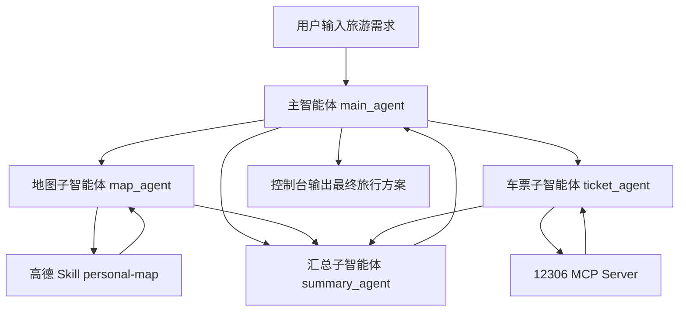

# 旅游规划多智能体实战

这一节我们设计一个**轻量级控制台项目**，目标不是做复杂旅游平台，而是用最少的工程复杂度，把 `DeepAgents + Skill + MCP + 多智能体协作` 这条主线讲清楚。

项目主题：

**做一个“旅游规划助手”**，用户输入一句自然语言需求，系统自动完成：

1. 景点筛选与路线建议
2. 火车票方案与预算估算
3. 最终旅行方案汇总

本项目采用 **方案 **：

- `1 个主智能体`
- `3 个子智能体`
- `1 个高德 Skill`
- `1 个 12306 MCP Server`
- `1 个控制台入口`

## 1. 项目目标

用户只需要在控制台输入一句话，例如：

```text
帮我规划下周六从杭州去苏州一日游，预算 800，想看园林和老街，尽量少折腾
```

系统自动输出：

1. 用户需求摘要
2. 推荐景点列表
3. 12306 火车出行建议
4. 预算估算
5. 推荐行程安排
6. 地图二维码或地图链接

## 2. 整体架构



**核心思想：**

- 主智能体负责拆任务，不亲自做所有细节
- 地图子智能体负责空间与景点问题
- 车票子智能体负责铁路出行问题
- 汇总子智能体负责最终结构化整理

这正是 DeepAgents 最适合演示的场景：**一个总控 + 多个专家 + 外部能力接入。**

## 3. 智能体职责拆解

### 3.1 主智能体（`main_agent`）

主智能体是整个系统的总控，负责：

1. 解析用户输入中的关键约束
2. 拆分任务给不同子智能体
3. 收集结果
4. 输出最终旅行方案

主智能体重点提取的信息：

- 出发地
- 目的地
- 出行日期
- 天数
- 预算
- 偏好（美食 / 景点 / 轻松 / 人文 / 亲子等）
- 节奏（少走路 / 紧凑 / 慢节奏）

### 3.2 地图子智能体（`map_agent`）

地图子智能体只负责“地理相关问题”，例如：

1. 推荐景点
2. 分析景点分布
3. 给出游玩区域建议
4. 生成路线或地图结果
5. 输出高德个人地图二维码

它接入的能力来自 ModelScope Skill：

`https://www.modelscope.cn/skills/Gaodekaifangpingtai/personal-map`

这个 Skill 非常适合本项目，因为它本身就支持：

- POI 搜索
- 周边搜索
- 路径规划
- 地图生成
- 二维码分享

### 3.3 车票子智能体（`ticket_agent`）

车票子智能体只负责“铁路出行问题”，例如：

1. 查询 12306 车次
2. 选择直达或中转方案
3. 给出票价区间
4. 给出往返交通预算
5. 提示出发与返程时间建议

它接入的能力来自 ModelScope MCP：

`https://www.modelscope.cn/mcp/servers/@Joooook/12306-mcp`

当前这个 MCP 适合做的事情包括：

- 查询车票
- 过滤列车信息
- 过站查询
- 中转查询

### 3.4 汇总子智能体（`summary_agent`）

汇总子智能体不直接查外部数据，它只做一件事：

**把地图结果和车票结果整理成最终方案。**

它的输出应该尽量简洁，重点包含：

1. 推荐方案
2. 备选方案
3. 每日行程
4. 预算估算
5. 风险提醒

## 4 实现地图子智能体

地图子智能体负责景点、路线、地图生成，这部分直接使用 ModelScope 上的高德 Skill。

### 4.1 下载高德 Skill 到本地

```bash
https://www.modelscope.cn/skills/@AMap-Web/amap-lbs-skill
```

建议项目目录整理成这样：

```text
travel-planner/
├── app.py
├── amap-lbs-skill/
│   └── personal-map/
│       └── SKILL.md
├── config/
│   └── memory/
│       └── AGENTS.md
```

### 4.2 编写地图子智能体

`map_sub_agent.py`

```python
from dotenv import load_dotenv, find_dotenv

load_dotenv(find_dotenv())

MAP_AGENT_PROMPT = """
你是一名地图规划助手。
你只负责景点搜索、路线分析、地图生成。

规则：
1. 优先筛选 3 到 6 个最值得推荐的景点
2. 输出时说明推荐理由
3. 如果可以生成高德个人地图，优先生成
4. 不要输出冗长原始 POI 数据
"""

map_agent = {
    "name": "map_agent",
    "description": "负责景点推荐、路线分析、地图生成",
    "system_prompt": MAP_AGENT_PROMPT,
    "skills": ["/skills"]
}
```

这里不需要主智能体手写地图逻辑，地图相关能力全部交给 `map_agent` 和本地高德 Skill。

## 5 实现车票子智能体

车票子智能体负责 12306 查询、票价估算和直达 / 中转分析。

MCP 地址：

`https://www.modelscope.cn/mcp/servers/@Joooook/12306-mcp`

### 5.1 开通和部署12306 MCP

### 5.2 通过 LangChain MCP adapter 加载工具

```python
import asyncio
from langchain_mcp_adapters.client import MultiServerMCPClient

from dotenv import load_dotenv, find_dotenv

load_dotenv(find_dotenv())

TICKET_AGENT_PROMPT = """
你是一名12306车票规划助手。
你只负责车次查询、票价分析、直达/中转建议。

规则：
1. 只要用户已经给出出发地、目的地、出行日期中的关键信息，就优先调用12306相关工具查询
2. 如果缺少出行日期，先调用当前日期工具，再按“近期出行”给出默认规划
3. 如果缺少出发地，不要直接停止；先给出“待补充出发地后可精确查票”的说明，同时尽量补充目的地车站和交通预算建议
4. 如预算敏感，优先给出低价方案；如时间敏感，优先给出省时方案
5. 不做真实购票，只做查询与建议
6. 输出必须包含：票务状态、推荐方案、预算提示、还需补充的信息
"""

async def build_ticket_agent():
    client = MultiServerMCPClient(
        {
            "12306-mcp": {
                "transport": "streamable_http",
                "url": "https://mcp.api-inference.modelscope.net/49af93122b7447/mcp"
            }
        }
    )
    ticket_tools = await client.get_tools()

    ticket_agent = {
        "name": "ticket_agent",
        "description": "负责12306车次查询、票价分析、出发时间建议",
        "system_prompt": TICKET_AGENT_PROMPT,
        "tools": ticket_tools
    }

    return ticket_agent


ticket_agent = asyncio.run(build_ticket_agent())
```

这里有一个实践细节要特别注意：

- `12306 MCP` 返回的是异步工具
- 主程序执行时要使用 `astream()`，不能继续用同步 `stream()`
- 否则运行过程中很容易出现 `StructuredTool does not support sync invocation`

这一步完成后，`ticket_agent` 就具备了：

- 使用 `streamable_http` 方式连接远程 MCP 地址
- 用 `MultiServerMCPClient` 建立 MCP 客户端
- 把远程工具加载成 `ticket_tools`
- 交给 `ticket_agent` 使用

## 6 实现汇总子智能体

汇总子智能体不负责查外部数据，只负责把地图结果和车票结果整理成最终方案。

summary_sub_agent.py

```python
SUMMARY_AGENT_PROMPT = """
你是一名旅行方案汇总助手。
你不负责外部查询，只负责整理结果。

规则：
1. 将景点方案与车票方案合并
2. 输出最终推荐方案、备选方案、预算估算
3. 按“需求摘要、景点建议、车票建议、预算、行程表、注意事项”结构输出
4. 保持简洁，不重复原始数据
"""

summary_agent = {
    "name": "summary_agent",
    "description": "负责整合地图结果与票务结果，生成最终方案",
    "system_prompt": SUMMARY_AGENT_PROMPT
}
```

## 7 实现主智能体

主智能体负责三件事：

1. 从用户自然语言中解析关键信息
2. 调度三个子智能体
3. 输出最终结果

**用户直接输入一句需求，主智能体先自己抽取“出发地、目的地、天数、预算、偏好”等关键信息，再把整理后的任务发给子智能体。**

### 7.1 主智能体长期记忆

文件：`config/memory/AGENTS.md`

```markdown
# 旅游规划助手长期规范

## 输出规则
- 所有回答使用中文
- 先给推荐方案，再给备选方案
- 输出结构固定为：需求摘要、景点建议、车票建议、预算、行程表、注意事项

## 规划规则
- 优先考虑预算约束
- 优先考虑少折腾、路线顺畅
- 若用户未说明，默认给出 1 个推荐方案 + 1 个备选方案

## 风险提示
- 不做真实购票
- 预算为估算值，不代表最终支付金额
```

### 7.2 主智能体提示词

```python
MAIN_AGENT_PROMPT = """
你是一名旅游规划总控智能体。
你的职责是根据用户输入，先抽取关键信息，再调度合适的子智能体完成任务。

规则：
1. 先从用户输入中抽取：出发地、目的地、日期/天数、预算、偏好、出行节奏
2. 如果用户没有明确说明游玩天数，默认按 1 天规划
3. 如果用户没有明确说明预算，默认按中等预算规划
4. 如果用户没有明确说明偏好，默认按“经典景点 + 少折腾”规划
5. 如果用户没有明确说明出行节奏，默认按“舒适型节奏”规划
6. 景点、路线、地图相关问题交给 map_agent
7. 火车票、车次、票价、时间建议交给 ticket_agent
8. 最终结果交给 summary_agent 汇总
9. 输出必须使用中文
10. 不做真实购票，只做规划和建议
"""
```

### 7.3 主智能体代码

app.py

```python
from pathlib import Path
import asyncio

from deepagents import create_deep_agent
from langchain.chat_models import init_chat_model
from deepagents.backends import FilesystemBackend
from dotenv import load_dotenv,find_dotenv
from langchain_core.messages import AIMessage, ToolMessage

from map_sub_agent import map_agent
from summary_sub_agent import summary_agent
from ticket_sub_agent import ticket_agent

load_dotenv(find_dotenv())

base_dir = Path(".").resolve()
backend = FilesystemBackend(root_dir=base_dir, virtual_mode=True)

llm = init_chat_model(
    model="qwen-max",
    model_provider="openai"
)


MAIN_AGENT_PROMPT = """
你是一名旅游规划总控智能体。
你的职责是根据用户输入，先抽取关键信息，再调度合适的子智能体完成任务。
注意: 必须将规划好的内容写到 results文件夹/旅游规划-日期.md文件
规则：
1. 先从用户输入中抽取：出发地、目的地、日期/天数、预算、偏好、出行节奏
2. 如果用户没有明确说明游玩天数，默认按 1 天规划
3. 如果用户没有明确说明预算，默认按中等预算规划
4. 如果用户没有明确说明偏好，默认按“经典景点 + 少折腾”规划
5. 如果用户没有明确说明出行节奏，默认按“舒适型节奏”规划
6. 景点、路线、地图相关问题交给 map_agent
7. 火车票、车次、票价、时间建议交给 ticket_agent
8. 最终结果交给 summary_agent 汇总
9. 输出必须使用中文
10. 不做真实购票，只做规划和建议
"""

main_agent = create_deep_agent(
    model=llm,
    backend=backend,
    system_prompt=MAIN_AGENT_PROMPT,
    memory=["/config/memory/AGENTS.md"],
    subagents=[map_agent, ticket_agent, summary_agent]
)

async def main():
    query = input("请输入你的旅游需求：").strip()

    print("\n========== 开始规划 ==========\n")

    final_answer = None
    active_calls = {}
    subagent_alias = {
        "map_agent": "景点规划子智能体",
        "ticket_agent": "票务规划子智能体",
        "summary_agent": "汇总子智能体",
    }

    async for chunk in main_agent.astream(
            {
                "messages": [
                    {"role": "user", "content": query}
                ]
            }
    ):
        for node_name, state in chunk.items():
            # 我就获取有state 有messages属性
            if not state or "messages" not in state:
                continue
            # state {messages :[]}
            for message in state["messages"]:
                # AIMessage(content='', additional_kwa   模型的最终回答 模型决定调用哪个工具 模型决定调用哪个子代理
                # ToolMessage(content='{"query": "人型机器  工具的返回结果
                if node_name == "model":
                    # 模型的最终回答 模型决定调用哪个工具 模型决定调用哪个子代理
                    if message.content:
                        # content有值 [模型的最终回答]
                        print(f"[模型最终回答]:{message.content}")
                    else:
                        # content没有值 [调用工具 / 调用子智能体]
                        if message.tool_calls:
                            for tool_call in message.tool_calls:
                                if tool_call['name'] == "task":
                                    # 调用子智能体
                                    print(f"[模型决定调用子智能体],智能体:{tool_call['args']['subagent_type']}")
                                else:
                                    # 调用了工具
                                    print(f"[模型决定调用工具],工具:{tool_call['name']},传入参数:{tool_call['args']}")
                elif node_name == "tools":
                    # 工具的最终返回结果
                    content = message.content
                    # 给前端返回结果
                    print(f"[执行工具返回结果]:{content}")

    print("\n========== 最终结果 ==========\n")
    print(final_answer or "本次没有生成最终结果")


if __name__ == "__main__":
    asyncio.run(main())
```

到这里，项目的主体结构就已经齐了：

- `map_agent` 负责地图和景点
- `ticket_agent` 负责 12306 查询
- `summary_agent` 负责汇总
- `main_agent` 负责解析用户需求和调度全局流程

## 8 测试效果

在真正运行这个项目之前，建议先安装依赖：

```bash
pip install -r requirements.txt
```

`requirements.txt` 可先写成：

```text
deepagents
langchain
langchain-openai
langchain-mcp-adapters
python-dotenv
```

控制台主程序建议直接使用异步流式输出。

这样有两个好处：

1. 可以边执行边看到过程
2. 可以正常执行异步 MCP 工具，不会卡在同步调用上


