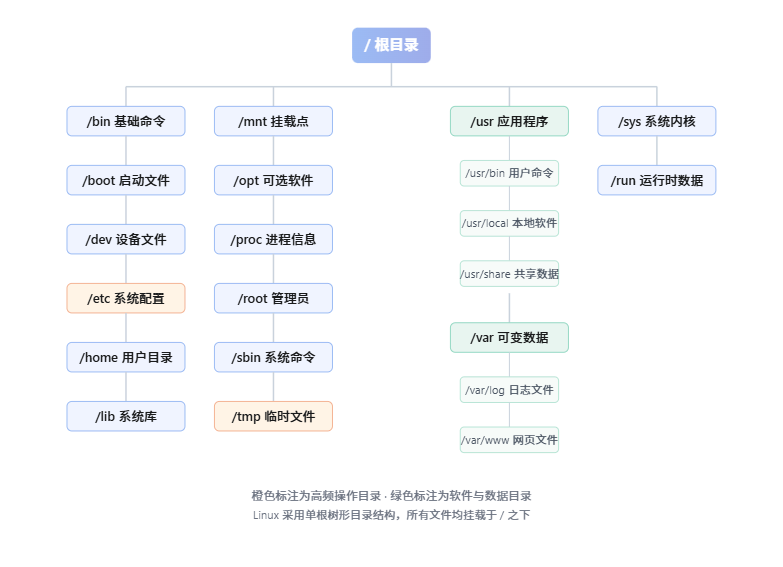
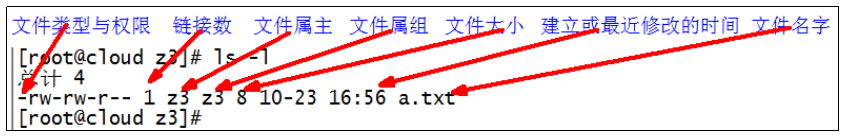

# Linux（Ubuntu）

## 1.Linux入门

### 概述

Linux 是一款开源类 Unix 操作系统，内核由芬兰学生林纳斯・托瓦兹于 1991 年首次发布，后经全球开发者社区协作迭代完善。它支持多用户、多任务与跨平台运行，内核免费开放，广泛应用于服务器、嵌入式设备与桌面端等场景。

目前市面上比较知名的发行版有：**<font color='red'>Ubuntu</font>**、Redhat、CentOS、Debain等

### Linux和Windows区别

| 对比维度       | Windows                                          | Linux                                                        |
| -------------- | ------------------------------------------------ | ------------------------------------------------------------ |
| **是否收费**   | 商业闭源系统，主流版本需购买授权，正版收费       | 内核开源免费，多数发行版免费，仅企业版可选付费技术服务       |
| **软件与支持** | 桌面软件生态丰富，官方提供技术支持，游戏适配完善 | 开源软件为主，社区生态庞大，普通版靠社区支持，企业版有商业服务 |
| **安全性**     | 用户基数大，是病毒主要攻击目标，依赖杀毒软件防护 | 权限机制严格，恶意软件少，漏洞响应快，整体安全性更高         |
| **使用习惯**   | 图形化界面为主，操作直观统一，上手门槛低         | 命令行功能强大，桌面环境多样，入门有一定学习成本             |
| **可定制性**   | 系统封闭，界面与功能修改权限有限，定制程度低     | 高度开放，内核、桌面、组件均可自由裁剪修改，定制自由度极高   |
| **应用场景**   | 家用办公、桌面娱乐、游戏、日常消费级场景         | 服务器、嵌入式、开发运维、超级计算机、工控等专业领域         |

## 2.Linux文件与目录结构

### Linux文件

Linux系统中一切皆文件。

### Linux目录结构



## 3.远程登录

通常在工作过程中，公司中使用的真实服务器或者是云服务器，都不允许除运维人员之外的员工直接接触，因此就需要通过远程登录的方式来操作。所以，远程登录工具就是必不可缺的，目前，比较主流的有**<font color='red'>Xshell</font>**，SSH Secure Shell**，**SecureCRT，FinalShell等……

## 4.APT软件包管理器

APT（Advanced Packaging Tools）是Debian及其派生Linux的软件包管理器，可以自动下载，配置，安装二进制或者源代码格式的软件包，因此简化了Unix系统上管理软件的过程。

APT常用命令：

用法： apt [选项] 命令

常用命令：

**<font color='red'>list - 根据名称列出软件包</font>**

search - 搜索软件包描述

show - 显示软件包细节

**<font color='red'>install - 安装软件包</font>**

reinstall - 重新安装软件包

**<font color='red'>remove - 移除软件包</font>**

autoremove - 卸载所有自动安装且不再使用的软件包

**<font color='red'>update - 更新可用软件包列表,安装之前先更新软件源</font>**

upgrade - 通过 安装/升级 软件来更新系统

full-upgrade - 通过 卸载/安装/升级 来更新系统

edit-sources - 编辑软件源信息文件

satisfy - 使系统满足依赖关系字符串

### net-tools

net-tools是一个网络相关的工具包，比如提供ifconfig命令查看ip

sudo apt install net-tools

常用参数：-y 不确认直接安装

##### 使用APT卸载软件包

sudo apt remove net-tools

常用参数：-y 不确认直接卸载

##### 使用APT搜索软件包

sudo apt search net-tools

## 5.常用基本命令

### 5.1帮助命令

#### Manual Packages

**作用**：Linux 官方帮助文档，用于查询命令用法、系统调用、配置文件格式、库函数等。

**核心手册章节**

- **<font color='red'>1：用户级日常命令（如 ls、cp）</font>**
- 2：系统调用（内核提供的函数接口）
- 3：程序库函数（如 C 标准库函数）
- 5：文件格式规范（如 /etc/passwd 结构）
- 8：系统管理员命令（root 权限，如 fdisk）

**高频用法**

- `man 命令名`：查看帮助（默认优先匹配第 1 章）
- `man 章节号 名称`：指定章节查询，例：`man 2 write` 查系统调用版 write
- `man -f 名称`：查询该名称对应哪些章节的手册
- `man -k 关键词`：按关键词全局搜索相关手册

**补充**：Ubuntu 默认缺少部分章节手册，执行 `sudo apt install manpages manpages-dev` 即可补全。

##### 案例实操

查看ls命令的帮助信息

man ls

查看用户命令write的帮助信息

man write

查看系统调用write的帮助信息

man 2 write

在第 2 节中没有关于 write 的手册条目

默认的手册页不完整，需要下载最新的手册页包

sudo apt install manpages manpages-dev

#### help获取shell内建命令的帮助信息

##### shell内建命令

shell内建命令是shell的一部分，他们没有单独的可执行文件或手册页，这类命令的文档通过help命令访问。

##### 查看所有内建命令

help

##### 查看内建命令的帮助信息

help 命令	（功能描述：获得shell内建命令的帮助信息）

##### 案例实操

help cd

#### 常用快捷键

| 常用快捷键 | 功能 |
| --- | --- |
| Ctrl + L | 清屏 |
| Ctrl + C 或 Q | 停止进程 / 退出 |
| TAB键(一次或二次) | 提示 |
| 上下键 | 查找执行过的命令 |
| Ctrl + U | 清除当前敲的命令 |

### 5.2文件目录类

#### pwd 显示当前工作目录的绝对路径

pwd: 打印工作目录（print work directory）

##### 基本语法

pwd		（功能描述：显示当前工作目录的绝对路径）

#### ls 列出目录的内容

ls: 列出目录内容（list）

##### 基本语法

ls  选项 目录或是文件

##### 选项说明

| 选项 | 功能 |
| --- | --- |
| -a | 全部的文件，连同隐藏档（开头为 . 的文件） 一起列出来（常用） |
| -l | 长数据串列出，包含文件的属性与权限等等数据；（常用） |
| -R | 递归（recursion）列出目录下所有子目录及文件 |

##### 显示说明

每行列出的信息依次是：文件类型与权限 链接数 文件属主 文件属组 文件大小(字节) 建立或最近修改的时间（月、日、时分） 名称

##### 案例实操

查看当前目录的所有内容信息

 ls -al

ubuntu中ll是ls -al的别名，我们可以使用ll查看目录下的所有文件

#### cd 切换目录

cd: 切换路径（Change Directory）

##### 基本语法

cd  [参数]

##### 参数说明

| 参数 | 功能 |
| --- | --- |
| cd 绝对路径 | 切换路径 |
| cd 相对路径 | 切换路径 |
| cd ~或者cd | 回到自己的家目录 |
| cd - | 回到上一次所在目录 |
| cd .. | 回到当前目录的上一级目录 |
| cd -P | 跳转到实际物理路径，而非快捷方式路径 |

##### 案例实操

使用绝对路径切换到根目录下的bin目录

cd /bin/

使用相对路径切换到“公共的”目录

 cd 公共的/

表示回到自己的家目录，亦即是/home/zxf这个目录

cd

cd- 回到上一次所在目录

表示回到当前目录的上一级目录，亦即是 “/root/公共的”的上一级目录的意思；

cd ..

mkdir 创建一个新的目录

mkdir: 创建目录（Make directory）

基本语法

mkdir [选项] 要创建的目录

##### 选项说明

| 选项 | 功能 |
| --- | --- |
| -p | 创建多层目录 (目标目录及其父目录) |

##### 案例实操

###### 创建一个目录

mkdir test

mkdir test/a

###### 创建一个多级目录

mkdir -p test/b/bb/bbb

touch 创建空文件

##### 基本语法

touch 文件名称

##### 案例实操

 touch test/a/note.txt

#### cp复制文件或目录

cp: 复制文件或目录（copy）

##### 基本语法

cp [选项] source dest 				（功能描述：复制source文件到dest）

##### 选项说明

| 选项 | 功能 |
| --- | --- |
| -r | 递归复制整个文件夹 |

##### 参数说明

| 参数 | 功能 |
| --- | --- |
| source | 源文件 |
| dest | 目标文件 |

##### 案例实操

###### 复制文件

cp test/a/note.txt test/b/

###### 递归复制整个文件夹

cp -r test/b/ ./

#### rm 删除文件或目录

rm: 删除文件或目录（remove）

##### 基本语法

rm [选项] deleteFile			（功能描述：删除指定目录或文件）

##### 选项说明

| 选项 | 功能 |
| --- | --- |
| -r | 递归删除目录及其中所有内容   （默认只能删除文件） |
| -f | 强制执行删除操作，而不提示用于进行提示确认。 |
| -v | 显示指令的详细执行过程 |

##### 案例实操

###### 删除目录中的内容

rm b/note.txt

###### 递归删除目录中所有内容

 rm -r b/

#### mv 移动文件与目录或重命名

mv: 移动文件或目录（move）

##### 基本语法

###### mv oldNameFile newNameFile	（功能描述：重命名）

###### mv /xxx/movefile /targetFolder	（功能描述：移动文件）

##### 案例实操

###### 重命名

mv test/a/note.txt test/a/note2.txt

###### 移动文件

mv test/a/note2.txt ./

#### cat查看文件内容

cat: 查看文件内容（catenate 连接）

##### 基本语法

cat  [选项] 要查看的文件

##### 选项说明

| 选项 | 功能描述 |
| --- | --- |
| -n | 显示所有行的行号，包括空行。 |

##### 经验技巧

一般查看比较小的文件，一屏幕能显示全的。

##### 案例实操

查看文件内容并显示行号

cat -n /etc/passwd

#### tail 输出文件尾部内容

tail用于输出文件中尾部的内容，默认情况下tail指令显示文件的后10行内容。

##### 基本语法

###### tail  文件 			（功能描述：查看文件尾部10行内容）

###### tail  -n  5 文件 	（功能描述：查看文件尾部5行内容，5可以是任意行数）

###### tail  -F  文件		（功能描述：实时追踪该文档的所有更新）

##### 选项说明

| 选项 | 功能 |
| --- | --- |
| -n<行数> | 输出文件尾部n行内容 |
| -F | 显示文件最新追加的内容，监视文件变化 |

##### 案例实操

###### 查看文件尾2行内容（默认10）

tail -n 2 /etc/password

###### 实时追踪该档的所有更新

touch note.txt

tail -F note.txt     // 修改note.txt实时显示

#### echo 输出内容

echo：输出内容到控制台

##### 基本语法

echo [选项] [输出内容]

选项：

- -e：支持反斜线控制的字符转换

| 控制字符 | 作用 |
| --- | --- |
| \\ | 输出\本身 |
| \n | 换行符 |
| \t | 制表符，也就是Tab键 |

##### 案例实操

桌面$ echo helloworld

helloworld

桌面$ echo "hello world"

hello world

桌面$ echo "hello\nworld"

hello\tworld

桌面$ echo -e  "hello\nworld"

hello

world

#### >和>> 输出重定向

##### 基本语法

###### ls -a  > 文件		（功能描述：列表的内容覆盖写入文件a.txt中）

###### ls -al  >> 文件		（功能描述：列表的内容追加到文件aa.txt的末尾）

###### cat 文件1 > 文件2	（功能描述：将文件1的内容覆盖到文件2）

###### echo “内容” >> 文件

##### 案例实操

###### 将ls查看信息覆盖写入到文件中

ls -l>note.txt

###### 将ls查看信息追加到文件中

ls -l>>note.txt

###### 采用echo将hello单词追加到文件中

echo hello>>note.txt

#### ln 软链接

软链接也成为符号链接，类似于windows里的快捷方式，有自己的数据块，主要存放了链接其他文件的路径。

ln: 创建软链接（Link）

##### 基本语法

ln -s [原文件或目录][软链接名]		（功能描述：给原文件创建一个软链接）

##### 经验技巧

删除软链接： rm 软链接名，或者：unlink 软链接名

查询：通过ll就可以查看，列表属性第1位是l，尾部会有位置指向。

##### 案例实操

###### 创建软连接

桌面$  mv note.txt test/a/

桌面$  ln -s test/a/note.txt ./

桌面$  ln -s test/b ./

桌面$  ll

###### 删除软连接

桌面$  rm note.txt

桌面$  rm b

###### 进入文件夹软连接的实际物理路径

桌面$  ln -s test/a ./

桌面$  cd -P a

桌面/test/a$

#### history 查看已经执行过历史命令

##### 基本语法

history （功能描述：查看已经执行过历史命令）

### 5.3VI/VIM编辑器

#### vi/vim是什么

VI是Unix操作系统和类Unix操作系统中最通用的文本编辑器。

VIM编辑器是从VI发展出来的一个性能更强大的文本编辑器。可以主动的以字体颜色辨别语法的正确性，方便程序设计。VIM与VI编辑器完全兼容。

在终端中执行以下命令安装vim

sudo apt install vim

#### 测试数据准备

###### 拷贝/etc/profile 数据到当前目录下

cp /etc/profile ./

#### 一般模式

以vim打开一个档案就直接进入一般模式了（这是默认的模式）。在这个模式中， 你可以使用『上下左右』按键来移动光标，你可以使用『删除字符』或『删除整行』来处理档案内容， 也可以使用『复制、贴上』来处理你的文件数据。

##### 常用语法

| 语法 | 功能描述 |
| --- | --- |
| yy | 复制光标当前一行 |
| y数字y | 复制一段（从光标当前行到后n行） |
| p | 箭头移动到目的行粘贴 |
| u | 撤销上一步 |
| dd | 删除光标当前行 |
| d数字d | 删除光标（含）后多少行 |
| x | 剪切一个字母(当前光标)，相当于del |
| X | 剪切一个字母(当前光标的前一个)，相当于Backspace |
| yw | 复制一个词 |
| dw | 删除一个词 |
| shift+6(^) | 移动到行头 |
| shift+4($) | 移动到行尾 |
| 1+shift+g | 移动到页头，数字 |
| shift+g | 移动到页尾 |
| 数字N+shift+g | 移动到目标行 |

##### vi/vim键盘图

#### 编辑模式

在一般模式中可以进行删除、复制、粘贴等的动作，但是却无法编辑文件内容的！要等到你按下『i, I, o, O, a, A』等任何一个字母之后才会进入编辑模式。

注意了！通常在Linux中，按下这些按键时，在画面的左下方会出现『INSERT或 REPLACE』的字样，此时才可以进行编辑。而如果要回到一般模式时， 则必须要按下『Esc』这个按键即可退出编辑模式。

##### 进入编辑模式

常用语法

| 按键 | 功能 |
| --- | --- |
| i | 当前光标前 |
| a | 当前光标后 |
| o | 当前光标行的下一行 |
| I | 光标所在行最前 |
| A | 光标所在行最后 |
| O | 当前光标行的上一行 |

##### 退出编辑模式

按『Esc』键

#### 命令模式

在一般模式当中，输入『 : / ?』3个中的任何一个按钮，就可以将光标移动到最底下那一行。

在这个模式当中， 可以提供你『搜寻资料』的动作，而读取、存盘、大量取代字符、离开 vi 、显示行号等动作是在此模式中达成的！

##### 基本语法

| 命令 | 功能 |
| --- | --- |
| **<font color='red'>:w</font>** | **<font color='red'>保存</font>** |
| **<font color='red'>:q</font>** | **<font color='red'>退出</font>** |
| **<font color='red'>:!</font>** | **<font color='red'>强制执行</font>** |
| /要查找的词 | n 查找下一个，N 往上查找 |
| :noh | 取消高亮显示 |
| :set nu | 显示行号 |
| :set nonu | 关闭行号 |
| :%s/old/new/g | 替换内容   /g global替换匹配到的所有内容 |

##### 案例实操

###### 保存退出

对于有写权限的文件，修改后，保存并退出。

:wq

###### 直接退出

没有修改文件内容，直接退出。

:q

###### 强制退出

修改了文件内容，但是不想保存，此时需要强制退出。

:q!

###### 强制保存退出

对于没有写权限的文件，修改后，必须强制保存退出方可保留更改。

:wq!

### 5.4用户管理命令

#### root用户

root 用户是具有最高权限的超级用户

##### root 用户特点

root 用户拥有系统的所有权限，可以对系统进行任何操作，包括修改系统关键配置文件、安装和卸载系统级软件、管理用户账户等。但由于其权限过大，不当操作可能会导致系统出现严重问题，甚至无法正常运行。

##### 默认情况

Ubuntu 默认情况下，root 用户是被锁定的，没有设置默认密码。这是为了提高系统的安全性，鼓励用户使用普通用户账户，并通过 sudo 命令来临时获取 root 权限执行需要高权限的操作。

##### 为 root 用户设置密码

如果确实需要使用root用户登录或执行操作，可以通过以下步骤为root用户设置密码。

- 以普通用户身份登录到 Ubuntu 系统。
- 打开终端，输入以下命令：----这里设置密码为atguigu123
```bash
atguigu@ubuntu-1:~$ sudo passwd root
新的密码：
重新输入新的密码：
passwd：已成功更新密码
atguigu@ubuntu-1:~$
```

- 系统会提示你输入当前普通用户的密码，输入正确后按回车键。
- 接着会要求你设置 root 用户的新密码，输入两次相同的新密码后，root 用户的密码就设置完成了。

##### 切换root用户

  - su 用户名称   （功能描述：切换用户，只能获得用户的执行权限，不能获得环境变量）
  - su - 用户名称		（功能描述：切换到用户并获得该用户的环境变量及执行权限）
  - 如果需要一个完整的 root 用户环境，例如执行需要特定环境变量支持的脚本，或者进行系统管理操作时依赖 root 用户的环境配置，建议使用 su -。而如果只是临时需要以 root 身份执行一两个命令，并且希望保持当前的工作环境，那么使用 su root 更合适。

##### 退出root用户

```bash
exit
```

##### 使用sudo替代root用户操作

虽然可以使用root用户登录并操作，但更推荐使用sudo命令。sudo 允许普通用户在需要时以 root 权限执行特定的命令，而不需要一直以 root 用户身份登录。

在需要执行的命令前加上 sudo，例如要安装软件包：

```bash
sudo apt install package_name
```

系统会提示你输入当前普通用户的密码，输入正确后命令将以 root 权限执行。

##### 锁定和解锁 root 用户

- 锁定 root 用户：如果你想再次锁定 root 用户，使其无法登录，可以使用以下命令：
```bash
sudo passwd -l root
```

- 解锁 root 用户：若要解锁 root 用户，可以使用以下命令：
```bash
sudo passwd -u root
```

#### useradd 添加新用户

##### 基本语法

- useradd -m 用户名			（功能描述：添加新用户）
- useradd -g 组名 用户名		（功能描述：添加新用户到某个组）
- 可以在useradd后面加-m指定是否创建用户目录

##### 案例实操

切换root用户，添加一个用户

```bash
atguigu@ubuntu-1:~$ su –
root@ubuntu-1:~# ll /home/
总计 12
drwxr-xr-x  3 root    root    4096  2月 17 23:20 ./
drwxr-xr-x 20 root    root    4096  2月 17 23:19 ../
drwxr-x--- 17 atguigu atguigu 4096  3月  3 10:53 atguigu/
root@ubuntu-1:~# useradd -m tangseng
root@ubuntu-1:~# ll /home/
总计 16
drwxr-xr-x  4 root     root     4096  3月  3 11:08 ./
drwxr-xr-x 20 root     root     4096  2月 17 23:19 ../
drwxr-x--- 17 atguigu  atguigu  4096  3月  3 10:53 atguigu/
drwxr-x---  2 tangseng tangseng 4096  3月  3 11:08 tangseng/
```

#### passwd设置用户密码

##### 基本语法

passwd 用户名	（功能描述：设置用户密码）

##### 案例实操

设置用户的密码

```bash
root@ubuntu-1:~# passwd tangseng
```

#### id查看用户是否存在

##### 基本语法

id 用户名

##### 案例实操

查看用户是否存在

```bash
root@ubuntu-1:~# id tangseng
uid=1001(tangseng) gid=1001(tangseng) 组=1001(tangseng)
```

#### cat  /etc/passwd 查看创建了哪些用户

##### 基本语法

```bash
root@ubuntu-1:~# cat /etc/passwd
```

#### userdel 删除用户

##### 基本语法

- userdel  用户名		（功能描述：删除用户但保存用户主目录）
- userdel -r 用户名		（功能描述：用户和用户主目录，都删除）

##### 选项说明

| 选项 | 功能 |
| --- | --- |
| -r | 删除用户的同时，删除与用户相关的所有文件。 |

##### 案例实操

```bash
root@ubuntu-1:~# ll /home/
总计 16
drwxr-xr-x  4 root     root     4096  3月  3 11:08 ./
drwxr-xr-x 20 root     root     4096  2月 17 23:19 ../
drwxr-x--- 17 atguigu  atguigu  4096  3月  3 10:53 atguigu/
drwxr-x---  2 tangseng tangseng 4096  3月  3 11:08 tangseng/
root@ubuntu-1:~# userdel -r tangseng
root@ubuntu-1:~# ll /home/
总计 12
drwxr-xr-x  3 root    root    4096  3月  3 11:27 ./
drwxr-xr-x 20 root    root    4096  2月 17 23:19 ../
drwxr-x--- 17 atguigu atguigu 4096  3月  3 10:53 atguigu/
```

#### usermod 修改用户

##### 基本语法

- usermod -l 新用户名 老用户名
- usermod -d /home/新目录名 -m新用户名

##### 选项说明

| 选项 | 功能 |
| --- | --- |
| -l | 改变用户名 |
| -d | 修改家目录 |

##### 案例实操

改变用户名

```bash
root@ubuntu-1:~# usermod -l pengyuyan huge
root@ubuntu-1:~# usermod -d /home/huge -m huge
```

### 5.5用户组管理命令

每个用户都有一个用户组，系统可以对一个用户组中的所有用户进行集中管理。不同Linux 系统对用户组的规定有所不同。

如Linux下的用户属于与它同名的用户组，这个用户组在创建用户时同时创建。

用户组的管理涉及用户组的添加、删除和修改。组的增加、删除和修改实际上就是对/etc/group文件的更新。

#### groupadd 新增组

##### 基本语法

groupadd 组名

##### 案例实操

添加一个xitianqujing组

```bash
root@ubuntu-1:~# groupadd xitianqujing
```

#### groupdel 删除组

##### 基本语法

groupdel 组名

##### 案例实操

删除xitianqujing组

```bash
root@ubuntu-1:~# groupdel xitianqujing
```

#### groupmod 修改组

##### 基本语法

groupmod -n 新组名 老组名

##### 选项说明

| 选项 | 功能描述 |
| --- | --- |
| -n<新组名> | 指定工作组的新组名 |

##### 案例实操

修改xitianqujing组名称为xitian。

```bash
root@ubuntu-1:~# groupadd xitianqujing
root@ubuntu-1:~# groupmod -n xitian xitianqujing
```

#### usermod 修改用户所属组

##### 基本语法

usermod -g 组名 用户名

##### 选项说明

| 选项 | 功能描述 |
| --- | --- |
| -g | 指定用户需要加入的用户组 得写id |

##### 案例实操

将用户切换一个组。

```bash
root@ubuntu-1:~# useradd zhubajie
root@ubuntu-1:~# id zhubajie
uid=1002(zhubajie) gid=1003(zhubajie) 组=1003(zhubajie)
root@ubuntu-1:~# usermod -g xitian zhubajie
root@ubuntu-1:~# id zhubajie
uid=1002(zhubajie) gid=1002(xitian) 组=1002(xitian)
```

#### cat /etc/group 查看创建了哪些组

##### 基本操作

```bash
root@ubuntu-1:~# cat  /etc/group
```

### 5.6文件权限类

#### 文件属性

能力越大，责任越大。权限越小，责任越小。

Linux系统是一种典型的多用户系统，不同的用户处于不同的地位，拥有不同的权限。为了保护系统的安全性，Linux系统对不同的用户访问同一文件（包括目录文件）的权限做了不同的规定。在Linux中我们可以使用ll或者ls -l命令来显示一个文件的属性以及文件所属的用户和组。

##### 文件属性：从左到右的10个字符表示

如果没有权限，就会出现减号[ - ]而已。从左至右用0-9这些数字来表示:

###### 0首位表示类型

在Linux中第一个字符代表这个文件是目录、文件或链接文件等等

-代表文件

d 代表目录

l 链接文档(link file)；

###### 第1-3位确定属主（该文件的所有者）拥有该文件的权限。---User

###### 第4-6位确定属组（所有者的同组用户）拥有该文件的权限，---Group

###### 第7-9位确定其他用户拥有该文件的权限 ---Other

##### rwx作用文件和目录的不同解释

###### 作用到文件：

- [ r ]代表可读（read）: 可以读取，查看
- [ w ]代表可写（write）: 可以修改，但是不代表可以删除该文件，
  - 删除一个文件的前提条件是对该文件所在的目录有写权限，才能删除该文件.
- [ x ]代表可执行（execute）:可以被系统执行

###### 作用到目录：0

- [ r ]代表可读（read）: 可以读取，ls查看目录内容
- [ w ]代表可写（write）: 可以修改，目录内创建+删除+重命名目录
- [ x ]代表可执行（execute）:可以进入该目录

##### 案例实操

ll

###### 文件基本属性介绍



#### chmod 改变权限


##### 基本语法

###### 第一种方式变更权限

chmod  [{ugoa}{+-=}{rwx}] 文件或目录

###### 第二种方式变更权限

chmod  [mode=421 ][文件或目录]

##### 经验技巧

**<font color='red'>u：所有者  g：所有组  o：其他人  a：所有人（u、g、o的总和）</font>**

**<font color='red'>r=4      w=2      x=1          rwx=4+2+1=7</font>**

##### 案例实操

###### 修改文件使其所属主用户具有执行权限

 chmod u+x passwd

###### 修改文件使其所属组用户具有执行权限

 chmod g+x passwd

###### 修改文件所属主用户执行权限,并使其他用户具有执行权限

 chmod u-x,o+x passwd

###### 采用数字的方式，设置文件所有者、所属组、其他用户都具有可读可写可执行权限。

 chmod 765 passwd

###### 修改整个文件夹里面的所有文件的所有者、所属组、其他用户都具有可读可写可执行权限。

 chmod -R 777 test

#### chown改变所有者

chown: 改变所有者（change owner）

##### 基本语法

chown [选项] [最终用户] [文件或目录]		（功能描述：改变文件或者目录的所有者）

##### 选项说明

| 选项 | 功能 |
| --- | --- |
| -R | 递归操作 |

##### 案例实操

###### 修改文件所有者

桌面$ sudo chown root note.txt

桌面$  ll

###### 递归改变文件所有者和所有组

桌面$ sudo chown -R root:root test/

桌面$ ll -R test/

#### chgrp 改所属组

chgrp: 改变所属组（change group）

##### 基本语法

chgrp [最终用户组] [文件或目录]	（功能描述：改变文件或者目录的所属组）

##### 案例实操

###### 修改文件的所属组

桌面$ ll

桌面$ sudo chgrp zxf tt.txt

桌面$ ll

### 5.7搜索查找类

#### find查找文件或者目录

###### find指令将从指定目录向下递归地遍历其各个子目录，将满足条件的文件显示在终端。

##### 基本语法

find [搜索范围] [选项]

##### 选项说明

| 选项 | 功能 |
| --- | --- |
| -name <文件名> | 按照指定的文件名查找模式查找文件（模式必须用引号包含） |
| -user <用户名> | 查找属于指定用户名所有文件 |
| -size <文件大小> | 按照指定的文件大小查找文件，单位为:  b —— 块（512字节） c —— 字节 w —— 字（2字节） k —— 千字节 M —— 兆字节 G —— 吉字节 |

##### 案例实操

###### 按文件名：根据名称查找当前目录下所有以.txt结尾的文件。

桌面$ find ./ -name "*.txt"

###### 按拥有者：查找当前目录下，用户名称的文件

桌面$ find ./ -user "zxf"

###### 按文件大小：在当前目录下查找大于200字节的文件（+n 大于  -n小于   n等于）

桌面$ find ./ -size "+200c"

#### grep与“|”管道符的过滤查找

管道符，“|”，表示将前一个命令的处理结果输出传递给后面的命令处理。

Grep（Global Regular Expression Print），用于对指定文本根据正则表达式（特定规则）搜索匹配并输出到终端。一般与管道符进行配合使用。

##### 基本语法

grep 选项 查找内容 源文件

##### 选项说明

| 选项 | 功能 |
| --- | --- |
| -n | 显示匹配行及行号。 |

##### 案例实操

###### 查找某文件在第几行

桌面$ find ./ -size "-200c" |grep a

桌面$ ll |grep -n zx

桌面$ cat passwd |grep -n wu

### 5.8压缩和解压类

#### tar 打包

##### 基本语法

tar  [选项]  XXX.tar.gz  将要打包进去的内容（功能描述：打包目录，压缩后的文件格式.tar.gz）

##### 选项说明

| 选项 | 功能 |
| --- | --- |
| -c | 产生.tar打包文件 |
| -v | 显示详细信息 |
| -f | 指定压缩后的文件名 |
| -z | 打包同时压缩 |
| -x | 解包.tar文件 |

##### 案例实操

###### 压缩多个文件

桌面$ touch tt2.txt

桌面$ **<font color='red'>tar -zcvf</font>** tt.tar.gz tt.txt tt2.txt

桌面$ ll

###### 压缩目录

桌面$ tar -zcvf b.tar.gz test/

桌面$ ll

###### 解压到当前目录

桌面$ rm -r test

桌面$ **<font color='red'>tar -zxvf</font>** test.tar.gz

桌面$ ll

###### 解压到指定目录

桌面$ mkdir work

桌面$ tar -zxvf test.tar.gz -C ./work

桌面$ ls work/

### 5.9磁盘类

#### df 查看磁盘空间使用情况

df: disk free 空余硬盘

##### 基本语法

df  选项	（功能描述：列出文件系统的整体磁盘使用量，检查文件系统的磁盘空间占用情况）

##### 选项说明

| 选项 | 功能 |
| --- | --- |
| -h | 以人们较易阅读的 GBytes, MBytes, KBytes 等格式自行显示； |

##### 案例实操

查看磁盘使用情况。

```bash
atguigu@ubuntu-1:~$ df -h
文件系统        大小  已用  可用 已用% 挂载点
tmpfs           790M  2.0M  788M    1% /run
/dev/sda3        49G   21G   26G   44% /
tmpfs           3.9G     0  3.9G    0% /dev/shm
tmpfs           5.0M  4.0K  5.0M    1% /run/lock
/dev/sda2       512M  6.1M  506M    2% /boot/efi
tmpfs           790M  104K  790M    1% /run/user/1000
```

#### du 文件和目录的磁盘使用空间

##### 基本语法

du	目录/文件（功能描述：显示每个文件和目录的磁盘使用空间）

##### 选项说明

| 选项 | 功能 |
| --- | --- |
| -a | 显示当前目录下所有的文件目录及子目录大小 |

### 5.10网络类

#### ifconfig

##### 基本语法

ifconfig		（功能描述：显示所有网络接口的配置信息）

##### 案例实操

查看当前网络IP

```bash
atguigu@ubuntu-1:~$ ifconfig
```

#### ping 测试主机之间网络连通性

##### 基本语法

ping 目的主机	（功能描述：测试当前服务器是否可以连接目的主机）

##### 案例实操

测试当前服务器是否可以连接百度

```bash
atguigu@ubuntu-1:~$ ping www.baidu.com
```

##### 基本语法

hostname		（功能描述：查看当前服务器的主机名称）

```bash
atguigu@ubuntu-1:~$ hostname
```

### 5.11进程线程类

进程是正在执行的一个程序或命令，每一个进程都是一个运行的实体，都有自己的地址空间，并占用一定的系统资源。

#### ps 查看当前系统进程状态

ps: 进程状态（process status）

##### 基本语法

ps -aux		（功能描述：查看系统中所有进程）

ps -ef		（功能描述：可以查看子父进程之间的关系）

##### 选项说明

| 选项 | 功能 |
| --- | --- |
| -a | 选择所有进程 |
| -u | 显示所有用户的所有进程 |
| -x | 显示没有终端的进程 |

##### 功能说明

###### ps -aux显示信息说明

- USER：该进程是由哪个用户产生的
- PID：进程的ID号
- %CPU：该进程占用CPU资源的百分比，占用越高，进程越耗费资源；
- %MEM：该进程占用物理内存的百分比，占用越高，进程越耗费资源；
- VSZ：该进程占用虚拟内存的大小，单位KB；
- RSS：该进程占用实际物理内存的大小，单位KB；
- TTY：该进程是在哪个终端中运行的。其中tty1-tty6代表系统的虚拟控制台。pts/0-255代表伪终端,通常用于 SSH 会话、telnet 会话以及其他远程登录会话。
- STAT：进程状态。常见的状态有：R：运行、S：睡眠、T：停止状态、s：包含子进程、+：位于后台、I<：几乎没有使用CPU时间
- START：该进程的启动时间
- TIME：该进程占用CPU的运算时间，注意不是系统时间
- COMMAND：产生此进程的命令名

###### ps -ef显示信息说明

- UID：用户名
- PID：进程ID
- PPID：父进程ID
- C：CPU用于计算执行优先级的因子。数值越大，表明进程是CPU密集型运算，执行优先级会降低；数值越小，表明进程是I/O密集型运算，执行优先级会提高
- STIME：进程启动的时间
- TTY：该进程是在哪个终端中运行的。
- TIME：CPU时间
- CMD：启动进程所用的命令和参数

##### 经验技巧

如果想查看进程的CPU占用率和内存占用率，可以使用 -aux;

如果想查看进程的父进程ID可以使用 -ef;

##### 案例实操

###### 查看进程的CPU占用率和内存占用率

桌面$ ps -aux

###### 查看进程的父进程ID

桌面$ ps -ef

#### kill 终止进程

##### 基本语法

kill  [选项] 进程号		（功能描述：通过进程号杀死进程）

killall 进程名称   （功能描述：通过进程名称杀死进程，也支持通配符，这在系统因负载过大而变得很慢时很有用） 

##### 选项说明

| 选项 | 功能 |
| --- | --- |
| -9 | 表示强迫进程立即停止 |

##### 案例实操

###### 开启多个终端

在XShell中双击开启的标签，即可打开新的终端。

准备两个终端。

###### 监控houge.txt

在其中一个终端中执行以下命令。

桌面$ tail -F houge.txt

###### 查看tail进程号

在另一个终端中查看进程号。

桌面$ ps -ef | grep tail

zxf         3976    3660  0 00:56 pts/2    00:00:00 tail -F houge.txt

###### 杀死tail进程

桌面$ kill -9 3976

此时，另一个终端可以看到提示，进程已被杀死，如下图所示。

###### 通过名称杀死进程

killall命令可以根据名称杀死进程，此处的进程名称是精确匹配。通常进程名称为启动命令中可执行文件的名称。对于tail -F houge.txt启动的进程，其进程名称为tail。

再开启一个终端，在其中两个终端中执行以下命令。

桌面$ tail -F houge.txt

在最后一个终端中执行以下命令。

桌面$ killall tail

可以看到另外两个终端的tail进程均被杀死。

#### free查看服务器总体内存

##### 基本语法

free -m （功能描述：查看服务器总体内存）

##### 案例实操

桌面$ free -m

total        used        free      shared  buff/cache   available

Mem: 3934         543        2879          12         511        3093

Swap:4095           0        4095

#### top查看系统健康状态

##### 基本命令

top [选项]

##### 选项说明

| 选项 | 功能 |
| --- | --- |
| -d 秒数 | 指定top命令每隔几秒更新。 |
| -i | 使top不显示任何闲置或者僵死进程。 |
| -p | 通过指定监控进程ID来仅仅监控某个进程的状态。 |

##### 操作说明

| 操作 | 功能 |
| --- | --- |
| P | 以CPU使用率排序，默认就是此项 |
| M | 以内存的使用率排序 |
| N | 以PID排序 |
| q | 退出top |

##### 查询结果字段解释

###### 第一行信息为任务队列信息

| 内容 | 说明 |
| --- | --- |
| 12:26:46 | 系统当前时间 |
| up 1 day, 13:32 | 系统的运行时间，本机已经运行1天 13小时32分钟 |
| 2 users | 当前登录了两个用户 |
| load  average:  0.00, 0.00, 0.00 | 系统在之前1分钟，5分钟，15分钟的平均负载。一般认为小于1时，负载较小。如果大于1，系统已经超出负荷。 |

###### 第二行为进程信息

| Tasks:  95 total | 系统中的进程总数 |
| --- | --- |
| 1 running | 正在运行的进程数 |
| 94 sleeping | 睡眠的进程 |
| 0 stopped | 正在停止的进程 |
| 0 zombie | 僵尸进程。如果不是0，需要手工检查僵尸进程 |

###### 第三行为CPU信息

| Cpu(s):  0.1%us | 用户模式占用的CPU百分比 |
| --- | --- |
| 0.1%sy | 系统模式占用的CPU百分比 |
| 0.0%ni | 改变过优先级的用户进程占用的CPU百分比 |
| 99.7%id | 空闲CPU的CPU百分比 |
| 0.1%wa | 等待输入/输出的进程的占用CPU百分比 |
| 0.0%hi | 硬中断请求服务占用的CPU百分比 |
| 0.1%si | 软中断请求服务占用的CPU百分比 |
| 0.0%st | st（Steal  time）虚拟时间百分比。就是当有虚拟机时，虚拟CPU等待实际CPU的时间百分比。 |

###### 第四行为物理内存信息

| Mem:    625344k total | 物理内存的总量，单位KB |
| --- | --- |
| 571504k used | 已经使用的物理内存数量 |
| 53840k free | 空闲的物理内存数量，我们使用的是虚拟机，总共只分配了628MB内存，所以只有53MB的空闲内存了 |
| 65800k buffers | 作为缓冲的内存数量 |

###### 第五行为交换分区（swap）信息

| Swap:   524280k total | 交换分区（虚拟内存）的总大小 |
| --- | --- |
| 0k used | 已经使用的交互分区的大小 |
| 524280k free | 空闲交换分区的大小 |
| 409280k cached | 作为缓存的交互分区的大小 |

##### 案例实操

桌面$ top -d 1

桌面$ top -p 3933

#### netstat显示网络统计信息和端口占用情况

##### 基本语法

- netstat -anp |grep 进程号	（功能描述：查看该进程网络信息）
- netstat -nlp  |grep 端口号	（功能描述：查看网络端口号占用情况）

##### 选项说明

| 选项 | 功能 |
| --- | --- |
| -n | 拒绝显示别名，能显示数字的全部转化成数字 |
| -l | 仅列出有在listen（监听）的服务状态 |
| -p | 表示显示哪个进程在调用 |

##### 案例实操

###### 查看某端口号是否被占用。

```bash
atguigu@ubuntu-1:~$ sudo netstat -nlp | grep 1234
```

###### 通过进程号查看该进程的网络信息。

```bash
atguigu@ubuntu-1:~$ netstat -anp | grep 进程号
```

### 5.12路径类

#### basename

##### 基本语法

basename [string / pathname] [suffix]  	（功能描述：basename命令会删掉所有的前缀包括最后一个（‘/’）字符，然后将字符串显示出来。

basename可以理解为取路径里的文件名称。

选项：

suffix为后缀，如果suffix被指定了，basename会将pathname或string中的suffix去掉。

##### 案例实操

截取该/home/zxf/banzhang.txt路径的文件名称。

basename /home/zxf/note.txt

note.txt

basename /home/zxf/tt.txt .txt

tt

#### dirname

##### 基本语法

dirname 文件绝对路径		（功能描述：从给定的包含绝对路径的文件名中去除文件名（非目录的部分），然后返回剩下的路径（目录的部分）。）

dirname 可以理解为取文件路径的绝对路径名称。

##### 案例实操

获取banzhang.txt文件的路径。

dirname /home/zxf/banzhang.txt

/home/zxf

### 5.13crontab系统定时任务

#### crontab服务管理

重新启动crontab服务

```bash
atguigu@ubuntu-1:~$ sudo systemctl restart cron
atguigu@ubuntu-1:~$ systemctl status cron
```

#### crontab 定时任务设置

##### 基本语法

crontab [选项]

##### 选项说明

| 选项 | 功能 |
| --- | --- |
| -e | 编辑crontab定时任务 |
| -l | 查询crontab任务 |
| -r | 删除当前用户所有的crontab任务 |

##### 参数说明

进入crontab编辑界面。会打开vim编辑你的工作。首次使用该命令时，系统会提示你选择一个文本编辑器，选择你熟悉的编辑器即可。

```bash
atguigu@ubuntu-1:~$ crontab -e
```

###### * * * * * 执行的任务，*的含义

| 项目 | 含义 | 范围 |
| --- | --- | --- |
| 第一个“*” | 一小时当中的第几分钟 | 0-59 |
| 第二个“*” | 一天当中的第几小时 | 0-23 |
| 第三个“*” | 一个月当中的第几天 | 1-31 |
| 第四个“*” | 一年当中的第几月 | 1-12 |
| 第五个“*” | 一周当中的星期几 | 0-7（0和7都代表星期日） |

###### 特殊符号

| 特殊符号 | 含义 |
| --- | --- |
| * | 代表任何时间。比如第一个“*”就代表一小时中每分钟都执行一次的意思。 |
| ， | 代表不连续的时间。比如“0 8,12,16 * * * 命令”，就代表在每天的8点0分，12点0分，16点0分都执行一次命令 |
| - | 代表连续的时间范围。比如“0 5  *  *  1-6命令”，代表在周一到周六的凌晨5点0分执行命令 |
| */n | 代表每隔多久执行一次。比如“*/10  *  *  *  *  命令”，代表每隔10分钟就执行一遍命令 |

###### 特定时间执行命令

| 时间 | 含义 |
| --- | --- |
| 45 22 * * * 命令 | 在22点45分执行命令 |
| 0 17 * * 1 命令 | 每周1 的17点0分执行命令 |
| 0 5 1,15 * * 命令 | 每月1号和15号的凌晨5点0分执行命令 |
| 40 4 * * 1-5 命令 | 每周一到周五的凌晨4点40分执行命令 |
| */10 4 * * * 命令 | 每天的凌晨4点，每隔10分钟执行一次命令 |
| 0 0 1,15 * 1 命令 | 每月1号和15号，每周1的0点0分都会执行命令。注意：星期几和几号最好不要同时出现，因为他们定义的都是天。非常容易让管理员混乱。 |

##### 案例实操

每隔1分钟，向/opt/module/bailongma.txt文件中添加一个11的数字

*/1 * * * * /bin/echo ”11” >> /opt/module/bailongma.txt
