# Shell

## 第一章 Shell概述

shell，读作[ʃel]，翻译为壳;

### 1.1 Shell的作用

> Shell 的本质：是「用户」和「Linux/Unix 内核」之间的「翻译官 / 中间程序」

计算机的「硬件」（CPU、内存、硬盘、网卡等），**只能被内核（Kernel）直接管理和调用**，内核是操作系统的核心，是硬件和软件的桥梁；

内核非常「底层」，只认识二进制指令，**普通用户无法直接和内核打交道**；

Shell 就充当了「中间人」：接收你输入的**命令（比如 `ls`、`cd`、`mkdir`）**，把人类能看懂的「命令语言」翻译成内核能执行的「机器指令」；内核执行完后，再把结果通过 Shell 翻译回人类能看懂的文字，展示给你。

一句话总结：用户` → 输入命令 → `Shell`（翻译 / 解释） → `内核`（执行硬件操作） → 返回结果 → `Shell`（翻译） → `用户

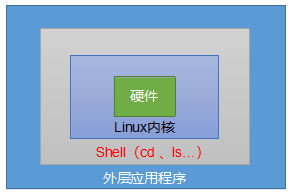

### 1.2 Shell是什么

> Shell 不只是「命令翻译官」，它本身就是一套**完整的编程语言**，同时它也是对应的**脚本解释器**。

#### 1. 什么是 Shell 编程？

基于 Shell 的语法规则，把**多条 Linux 命令**、**判断逻辑（if）**、**循环逻辑（for/while）**、**变量**、**函数** 等组合在一起，写成一个**文本文件**（后缀一般是 `.sh`），这个文件就叫做 **Shell 脚本（Shell Script）**。

#### 2. 解释器的作用

Shell 程序（例如bash）本身就是「解释器」，它可以**逐行解释执行** Shell 脚本里的代码，不需要像 C/C++ 那样编译成二进制文件，直接运行即可。

### 1.3 Shell的2种交换模式

我们日常使用 Shell，本质上是用它的两种交互方式：

✅ 模式 1：交互式（Interactive Shell）—— 最常用，「人机对话」模式

**特点**：**输入一条命令，立刻执行一条命令，执行完返回结果，等待你输入下一条**，是「一问一答」的交互形式。

- 你在 Linux 终端 / SSH 工具里敲的所有命令（`cd /usr`、`mkdir test`、`ps -ef`），都是这种模式；
- 这种模式下，Shell 会实时响应你的输入，执行后立即输出结果，非常适合「临时执行少量命令」「查看系统状态」「文件操作」等场景。

✅ 模式 2：非交互式（Non-interactive Shell）—— 执行脚本专用，「静默运行」模式

**特点**：**不会和用户交互，一次性读取并执行脚本文件中的所有命令**，执行过程中不需要人工输入，执行完自动退出。

- 核心使用场景：运行我们写好的 **Shell 脚本**（`.sh` 文件）；
- 比如执行 `bash test.sh` 时，Shell 会从头到尾执行脚本里的所有代码，中间不会停，也不会问你问题，执行完成后返回最终结果，适合「批量执行命令」「自动化运维」「定时任务」等场景。

### 1.4 如何查看「当前系统的 Shell」

查看「系统中安装的所有 Shell 版本」

```bash
cat /etc/shells
```

查看「当前终端正在使用的 Shell」：Ubuntu默认的解析器是bash

```bash
echo $SHELL
```

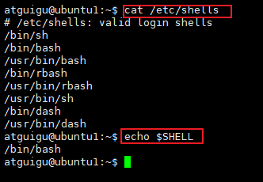


### 1.5 第一个Shell脚本：helloworld.sh

1、步骤

（1）使用vim命令编辑脚本文件

```bash
vim helloworld.sh
```

代码：

```shell
#!/bin/bash #脚本以#!/bin/bash开头（指定解析器）
echo "hello shell!"
```

（2）使用bash命令运行shell脚本文件

```bash
bash helloworld.sh
```

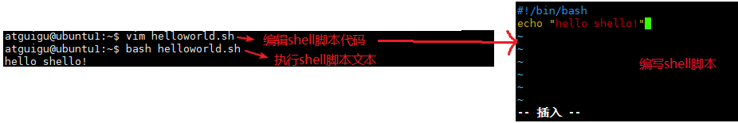

### 1.6 脚本的2种执行方式

#### 1.6.1 bash或sh命令方式

> 命令格式

```bash
bash 脚本文件
sh 脚本文件
```

- 支持相对路径和绝对路径
- 此时脚本文件可以没有`x`可执行权限

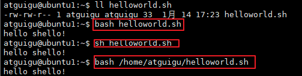

#### 1.6.2 直接运行脚本文件方式

- 此时脚本必须有`x`可执行权限

```bash
chmod a+x helloworld.sh    #给所属用户，所属组，其他人都加x权限

./helloworld.sh 			#相对路径方式（需要加./）
/home/atguigu/helloworld.sh #绝对路径方式
```

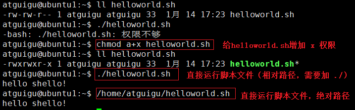

## 第二章 变量

### 2.1 Shell 预定义系统环境变量

这类变量是系统 / Shell 初始化时自动定义的**全局环境变量**，作用于整个系统的所有 Shell 会话，通常为全大写英文，可直接调用。

| 变量  | 说明                                                         |
| ----- | ------------------------------------------------------------ |
| PATH  | 系统命令搜索路径                                             |
| HOME  | 当前登录用户的主目录                                         |
| USER  | 当前登录的用户名                                             |
| PWD   | 当前工作目录（绝对路径）                                     |
| SHELL | 当前正在使用的 Shell 解释器路径                              |
| LANG  | 当前系统的语言编码，中文系统输出 `zh_CN.UTF-8`，英文系统输出 `en_US.UTF-8` |

### 2.2 获取变量的值

> 语法格式：

```shell
$变量名   # 基础语法
${变量名} # 规范语法
```

🔴$和变量名之间不能有空格

✅**`${变量名}`**可以避免变量名和后面的字符拼接导致的识别错误

> 示例

```bash
echo $PATH  # 回显PATH变量的值

echo $LANG  # 回显 LANG变量的值

echo ${LANG}country #回显 LANG变量的值与country一起的结果
```

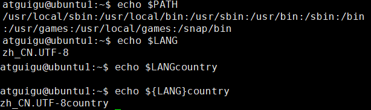


### 2.3 内置特殊系统变量

#### 1、$n

- `n`为数字，`$0`代表该脚本名称，`$1-$n`代表第1到第n个参数
- `$n`，当n在[0,9]范围时，可以`$n`或`${n}`，但是n>=10时必须用大括号包含，如`${10}`

> 示例

（1）编辑test_special_var.sh脚本文件

```bash
vi test_special_var.sh
```

代码：

```shell
#!/bin/bash
echo '==========$n=========='
echo 脚本文件名称：${0}
echo 第1个参数：${1} 
echo 第2个参数：${2}
echo 第3个参数：${3}
```

（2）运行Shell脚本

```bash
bash test_special_var.sh AI Python Shell
```

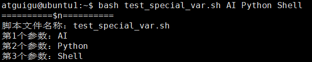

#### 2、$#

- `$# 或 ${#}`：获取所有输入参数个数，常用于循环，判断参数的个数是否正确以及加强脚本的健壮性。

（1）编辑test_special_var.sh脚本文件

```bash
vi test_special_var.sh
```

追加代码：

```shell
echo '==========$#=========='
echo 输入参数总个数：${#}
```

（2）运行Shell脚本

```bash
bash test_special_var.sh AI Python Shell
```

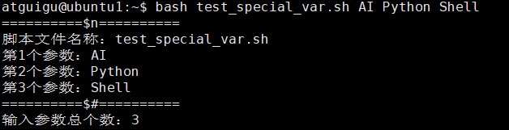

#### 3、$*和$@

- `$*`、`$@`  `${*}` 和 `${@}`用来获取传递给脚本 / 函数的「所有位置参数」。
- `$*` 和 `$@` 的唯一区别，只在被「双引号」包裹时体现，无引号时完全相同。

（1）编辑test_special_var.sh脚本文件

```bash
vi test_special_var.sh
```

追加代码：

```shell
echo '==========$*=========='
echo 所有输入参数：$*
echo '==========$@=========='
echo 所有输入参数：$@
```

（2）运行Shell脚本

```bash
bash test_special_var.sh AI Python Shell
```

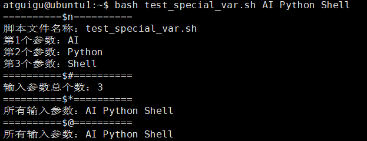

> `"$*"` 和 `"$@"`区别：（下面代码涉及到循环，可以学完循环再回来看）
>
> - `"$*"` → **将所有的位置参数，拼接成【一个完整的字符串】**
> - `"$@"` → **将所有的位置参数，保留为【多个独立的字符串】**

（1）编辑test_special_var.sh脚本文件

```bash
vi test_special_var.sh
```

追加代码：

```shell
echo '========双引号包裹$*======='
for i in "$*"  
do 
    echo "${i}"
done 

echo '========双引号包裹$@======='
for j in "$@" 
do 
    echo "${j}" 
done
```

（2）运行Shell脚本

```bash
bash test_special_var.sh AI Python Shell
```

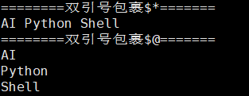

#### 4、$?

- `$?`或`${?}`：表示上一条命令 / 脚本的**执行返回状态码**

  ✔️ `$? = 0` → 上一条命令**执行成功**（正常结束）

  ✔️ `$? ≠ 0` → 上一条命令**执行失败 / 异常结束**（非 0 数字是错误码，不同错误对应不同数字）

（1）编辑test_special_var.sh脚本文件

```bash
vi test_special_var.sh
```

追加代码：

```shell
echo '========$?======='
ls /root
echo 'ls /root执行结果：'${?}
ls ./
echo 'ls ./执行结果：'${?}
```

（2）运行Shell脚本

```bash
bash test_special_var.sh AI Python Shell
```

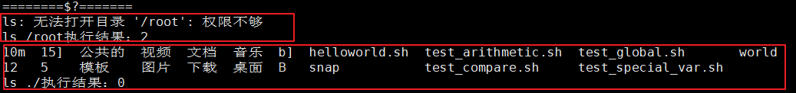

#### 5、$$和$!

`$$`或`${$}` → 当前 Shell 进程的PID ，常用于脚本中生成唯一临时文件

`$!`或`${!}` → 上一个**后台运行进程**的PID

- 执行 `命令 &` 后台运行后，用`$!`获取该后台进程的 PID

（1）编辑test_special_var.sh脚本文件

```bash
vi test_special_var.sh
```

追加代码：

```shell
echo '========$$======='
echo '当前 Shell 进程的：'${$}

echo '========$!======='
sleep 10 & echo '上一个sleep进程的PID：'${!}
```

（2）运行Shell脚本

```bash
bash test_special_var.sh
```

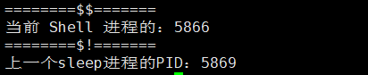

### 2.4 自定义变量

#### 2.4.1 定义变量

> 变量定义 / 赋值语法

```bash
变量名=变量值
```

❌ 绝对禁止：**等号 `=` 两边不能有任何空格**！比如 `NAME = zhangsan`、`NAME= zhangsan`、`NAME =zhangsan` 全是错误写法，Shell 会直接报错。

✔️ 正确写法：`NAME=zhangsan`、`	AGE=20`、`ADDRESS=北京市朝阳区`

📌变量名规范

-  变量名称可以由字母、数字和下划线组成，但是不能以数字开头
- 严格区分大小写
- 建议：变量名尽量**见名知意、全大写**

📌变量值 包含空格 / 特殊符号，必须用 引号 包裹

📌在bash中，变量默认类型都是字符串类型，无法直接进行数值运算（关于数值运算请看下一章）

> 示例

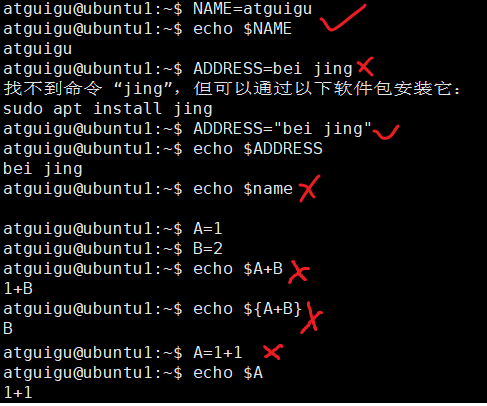


#### 2.4.2 单引号和双引号

- 单引号是「强引用」，里面的内容是什么样，输出就是什么样，**不会解析变量、不会解析命令、不会解析转义符**，只认纯文本。
- 双引号是「弱引用」，里面的内容会正常解析：能识别 `${变量名}` 并替换为变量值、能识别命令并执行、能识别转义符，**日常赋值优先用双引号**。

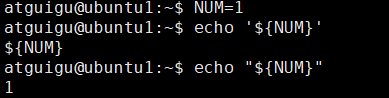


#### 2.4.3 变量值=命令的执行结果

Shell 中经常需要「把某个命令的运行结果，赋值给变量」，比如获取当前日期、获取当前目录、获取进程号等，有两种标准语法，都非常常用：

```shell
# 语法1：反引号 包裹命令
变量名=`命令`

# 语法2：() 包裹命令
变量名=$(命令)
```

> 示例

```bash
# 获取当前系统时间，赋值给变量
TODAY=`date`

# 获取当前工作目录，赋值给变量
MYPATH=$(pwd)
```

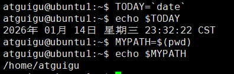

#### 2.4.4 删除变量

📌撤销删除变量：unset 变量名

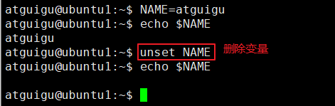

#### 2.4.5 只读变量

📌只读变量：用readonly声明的变量是只读变量，即不能重新赋值，不能unset，又称为静态变量。

脚本中如果有一些**固定不变的核心值**（比如常量、固定路径、版本号、配置项），用`readonly`声明后，可以避免后续代码不小心修改 / 删除这个变量导致的程序异常，**保证变量值的绝对安全**。

> 语法格式

```bash
readonly 变量名=变量值

变量名1=变量值
变量名2=变量值
readonly 变量名1 变量名2
```

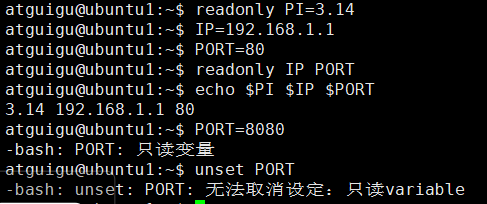

#### 2.4.6 全局变量

Shell 的自定义变量，默认是「局部变量」。

如果需要让自定义变量「全局生效」，需要用 `export` 命令。

语法格式：

```bash
export 变量名=变量值

或
变量名=变量值
export 变量名
```

##### 1、当前会话全局变量

> 示例

（1）定义变量NUM=1

（2）编写脚本：vi test_global.sh

```shell
echo 全局变量：${NUM}
```

（3）运行test_global.sh脚本

```bash
bash test_global.sh
```

（4）使用export命令使得NUM成为全局变量

```shell
export NUM
```

（5）再次运行test_global.sh脚本

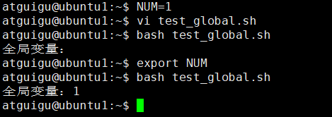

上面的 `export` 声明的全局变量，**仅当前 Shell 会话进程及其子进程生效**，关闭终端 / 重启服务器后就会消失。

##### 2、永久生效全局变量

如果需要让变量「永久生效」，需要写入系统配置文件（需谨慎，非必要不要这么做）。

- 当前用户永久生效：编辑用户家目录的配置文件：`~/.bashrc`，追加export 自定义全局变量
- 系统全局永久生效：编辑系统全局配置文件：`/etc/profile`，追加export 自定义全局变量

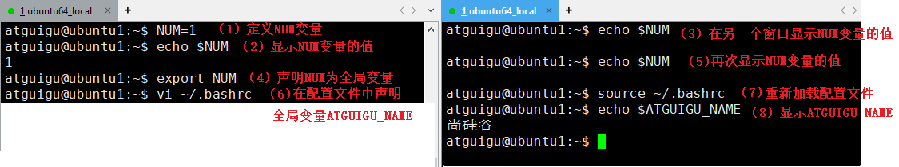

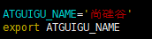

## 第三章 算术运算和条件判断

### 3.1 算术运算符

Shell 中默认的变量值都是「字符串类型」，哪怕你赋值的是数字，比如 `NUM=10`，Shell 也会把它当成字符串，**直接用 `+ - \* / %` 无法做数值运算**，必须用专用的运算语法。

❌Shell 所有原生运算语法（`$[]` / `$(( ))`/`let`）**只支持整数运算**，如果直接运算小数，会直接报错。如果要进行小数计算需要借助`bc` （ Linux 内置的计算器工具）。

> 语法格式：

```bash
# 语法1： # 推荐
$((运算式)) 

# 语法2： #【和 $(()) 完全等价，兼容老脚本】
$[运算式]

#语法3：let命令  #【适合简单的自增 / 自减 / 累加运算】
let 运算式
```

#### 3.1.1 $((整数运算式))（推荐）

> 示例：test_arithmetic.sh

```bash
#!/bin/bash
echo '============算术运算============='
echo '========$((整式表达式))=========='
echo '1+1='$((1+1))

A=9
B=6
echo 'A='${A}
echo 'B='${B}
echo 'A+B='$((A+B))
echo 'A-B='$((A-B))
echo 'A*B='$((A*B))
echo 'A/B='$((A/B))
echo 'A%B='$((A%B))
echo 'A++显示结果：'$((A++))
echo 'A='$((A))
echo '++A显示结果：'$((++A))
echo 'A='$((A))
echo 'A+=1'显示结果：$((A+=1))
echo 'A='$((A))
```

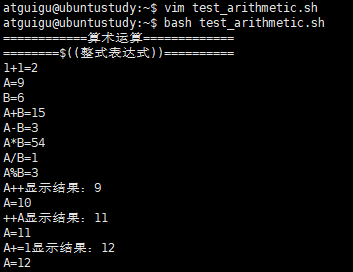

#### 3.1.2 $[整数运算式]（了解）

> 示例：test_arithmetic.sh

```bash
#!/bin/bash
echo '========$[整式表达式]=========='
echo '1+1='$[1+1]

A=9
B=6
echo 'A='${A}
echo 'B='${B}
echo 'A+B='$[A+B]
echo 'A-B='$[A-B]
echo 'A*B='$[A*B]
echo 'A/B='$[A/B]
echo 'A%B='$[A%B]
echo 'A++显示结果：'$[A++]
echo 'A='$[A]
echo '++A显示结果：'$[++A]
echo 'A='$[A]
echo 'A+=1'显示结果：$[A+=1]
echo 'A='$[A]
```

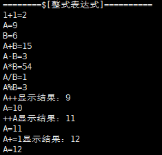

#### 3.1.3 let命令（了解）

> 示例：test_arithmetic.sh

```bash
#!/bin/bash
echo '==========let命令=========='
A=9
B=6

echo 'A='${A}
echo 'B='${B}
let A++
echo 'A++之后A的值：'$[A]
let A+=1
echo 'A+=1之后A的值：'$[A]
let ++A
echo '++A之后A的值：'$[A]

let SUM=A+B,SUB=A-B
echo 'A+B='${SUM}
echo 'A-B='${SUB}

#let A+B #没有意义
```

- let后面的运算式只能是自增自减运算式和含赋值操作的运算符，否则没有意义。

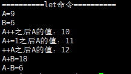


### 3.2 比较判断运算符

🔴Shell 中默认的变量值都是「字符串类型」，哪怕你赋值的是数字，比如 `NUM=10`，Shell 也会把它当成字符串，在 `if 条件判断` 和 `while 循环判断`时无法**直接用 `> < >= <= == !=` 做比较运算**，必须用专用的运算语法。

#### 3.2.1 整数比较

> 语法格式：

```bash
# 语法1：
test 数值1 比较符 数值2
test ${变量1} 比较符 ${变量2}

# 语法2：
[ 数值1 比较符 数值2 ]
[ ${变量1} 比较符 ${变量2} ]
```

🔴`[ 条件 ]` 中，**左括号`[`右侧必须有空格**、**右括号`]`左侧必须有空格**。

🔴 结果0代表真/True，非0代表假/False（这一点与大多数编程语言相反）。因为成功只有1种，失败有很多种情况。

✅数值比较符

| 比较符 |   含义   |   英文全称    |    test 写法     |   [] 等价写法   |
| :----: | :------: | :-----------: | :--------------: | :-------------: |
| `-eq`  |   等于   |     equal     | `test 10 -eq 10` | `[ 10 -eq 10 ]` |
| `-ne`  |  不等于  |   not equal   | `test 10 -ne 5`  | `[ 10 -ne 5 ]`  |
| `-gt`  |   大于   | greater than  | `test 10 -gt 5`  | `[ 10 -gt 5 ]`  |
| `-lt`  |   小于   |   less than   | `test 10 -lt 5`  | `[ 10 -lt 5 ]`  |
| `-ge`  | 大于等于 | greater equal | `test 10 -ge 5`  | `[ 10 -ge 5 ]`  |
| `-le`  | 小于等于 |  less equal   | `test 10 -le 5`  | `[ 10 -le 5 ]`  |


##### 1、test命令比较整数值

> 示例：test_compare.sh

```shell
#!/bin/bash
echo '==========test命令比较整数值=========='

A=12
B=5
echo 'A='$A
echo 'B='$B

echo 'test ${A} -gt ${B}的结果：'
test ${A} -gt ${B}
echo $? # 表示返回上一条命令 / 脚本的执行状态码，所以要注意顺序

echo 'test ${A} -lt ${B}的结果：'
test ${A} -lt ${B}
echo $?

echo 'test ${A} -eq ${B}的结果：'
test ${A} -eq ${B}
echo $?
```

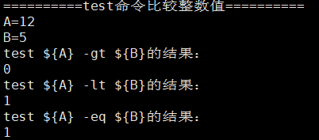

##### 2、[ 条件表达式 ]比较整数值

> 示例：test_compare.sh

```shell
#!/bin/bash
echo '==========[ 条件表达式 ]比较整数值=========='

A=12
B=5
echo 'A='$A
echo 'B='$B

echo '[ ${A} -gt ${B} ]的结果：'
[ ${A} -gt ${B} ] 
echo $? # 表示返回上一条命令 / 脚本的执行状态码，所以要注意顺序

echo '[ ${A} -lt ${B} ]的结果：'
[ ${A} -lt ${B} ]
echo $?

echo '[ ${A} -eq ${B} ]的结果：'
[ ${A} -eq ${B} ]
echo $?
```

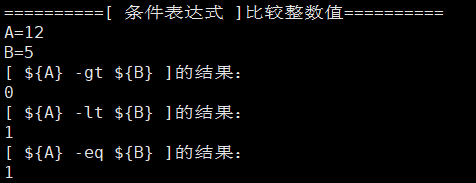


#### 3.2.2 字符串比较（了解）

> 语法格式：

```bash
# 语法1：
test "字符串1" 比较符 "字符串2"
test "${变量}" 比较符 "${变量}"

# 语法2：
[ "字符串1" 比较符 "字符串2" ]
[ "${变量}" 比较符 "${变量}" ]
```

🔴`[ 条件 ]` 中，**左括号`[`右侧必须有空格**、**右括号`]`左侧必须有空格**

🔴字符串必须加""（为了避免空字符串问题，不加""可能出现  = "hello"，加""后出现"" = "hello"）

✅字符串比较符

| 比较符  |  含义  |     适用场景     |       test 写法       |         [] 等价写法          |
| :-----: | :----: | :--------------: | :-------------------: | :--------------------------: |
|   `=`   |  相等  | 两字符串内容一致 | `test "abc" = "abc"`  | `[ "${str1}" = "${str2}" ]`  |
|  `!=`   |  不等  | 两字符串内容不同 | `test "abc" != "def"` | `[ "${str1}" != "${str2}" ]` |
|  `-z`   |  为空  |  字符串长度为 0  |  `test -z "${str}"`   |      `[ -z "${str}" ]`       |
|  `-n`   |  非空  |  字符串长度 > 0  |  `test -n "${str}"`   |      `[ -n "${str}" ]`       |
| `>`/`<` | 字典序 |  按字母顺序比较  |   `test "a" \< "b"`   |       `[ "a" \> "b" ]`       |

🔴`>`/`<` 在字符串比较时，需要加**反斜杠转义** `\<`/`\>`，避免被 Shell 解析为重定向符号

🔴不支持 `>=`、`<=`符号

##### 1、test命令比较字符串

> 示例：test_compare.sh

```shell
#!/bin/bash
echo '==========test命令比较字符串=========='

A="hello"
B="world"
echo 'A='$A
echo 'B='$B

echo 'test "${A}" \> "${B}"的结果：'
test "${A}" \> "${B}"
echo $?

echo 'test "${A}" = "${B}"的结果'
test "${A}" = "${B}"
echo $?

echo 'test -n "${A}"的结果'
test -n "${A}"
echo $?
```

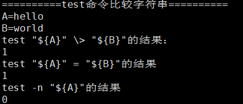

##### 2、[ 条件表达式 ]比较字符串

> 示例：test_compare.sh

```shell
#!/bin/bash
echo '==========[ 条件表达式 ]比较字符串=========='

A="hello"
B="world"
echo 'A='$A
echo 'B='$B

echo '[ "${A}" \> "${B} ]"的结果：'
[ "${A}" \> "${B}" ]
echo $?

echo '[ "${A}" = "${B}"的结果'
[ "${A}" = "${B}" ]
echo $?

echo '[ -n "${A}"的结果'
[ -n "${A}" ]
echo $?
```

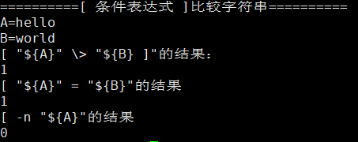

### 3.3 逻辑运算符

#### 3.3.1 实现二选一

> 语法格式

```bash
条件判断 && 结果1 || 结果2
```

- 条件成立走结果1，不成立走结果2

> 示例：test_eithor_or.sh

```shell
#!/bin/bash
echo '===2选1==='
A=12
B=5
echo 'A='$A
echo 'B='$B
test ${A} -gt ${B} && echo 最大值是${A} || echo 最大值是${B}
[ ${A} -lt ${B} ] && echo 最小值是${A} || echo 最小值是${B}
```

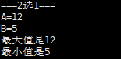

#### 3.3.2 多个条件组合

脚本中一定会遇到「同时判断多个条件」的场景，比如：**判断数值大于 5 或 小于 0**。

✔️ 方式 1：`test/[]` 内部 用关键字组合

- **且关系**：`-a` → and或all，两个条件**必须同时成立**，整体才为真
- **或关系**：`-o` → or，两个条件**只要有一个成立**，整体就为真

✔️ 方式 2：用 Shell 逻辑运算符 组合 

- **且关系**：`&&` → 两个条件必须同时成立
- **或关系**：`||` → 两个条件只要有一个成立

> 语法格式

```bash
test 条件1 -a 条件2
[ 条件1 -a 条件2 ]

test 条件1 -o 条件2
[ 条件1 -o 条件2 ]

test 条件1 && test 条件2
[ 条件1 ] && [ 条件2 ]

test 条件1 || test 条件2
[ 条件1 ] || [ 条件2 ]
```

> 示例：test_logic.sh

```shell
#!/bin/bash
echo '==========多个条件组合=========='
A=12
echo 'A='$A

test ${A} -gt 0 && test ${A} -lt 100 && echo ${A}满足大于0且小于100 || echo ${A}不满足大于0且小于100
test ${A} -gt 0 -a ${A} -lt 100 && echo ${A}满足大于0且小于100 || echo ${A}不满足大于0且小于100

test ${A} -lt 0 || test ${A} -gt 100 && echo ${A}满足小于0或大于100 || echo ${A}不满足小于0或大于100
test ${A} -lt 0 -o ${A} -gt 100 && echo ${A}满足小于0或大于100 || echo ${A}不满足小于0或大于100 
```

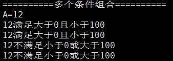


## 第四章 流程控制

### 4.1 if语句

> 语法格式

```shell
#（1）单分支
if [ 条件判断式 ]; then  #注意  需要加;
    程序 
fi

#或
if  [ 条件判断式 ] # 不需要加;
then 
    程序 
fi

#（2）双分支
if [ 条件判断式 ]; then  #注意  需要加;
    程序 
else
	程序
fi

#（3）多分支
if [ 条件判断式 ] 
then 
    程序 
elif [ 条件判断式 ]
then
	程序
else
	程序
fi
```

🔴注意if后面有空格

🔴if语句最后有fi结尾（if反过来写）

🔴if后面的条件也可以用test命令

> 示例1：test_if1.sh：判断变量A的值是否是正数。

```shell
#!/bin/bash
echo '==========if语句 + test=========='
A=12
echo 'A='${A}
if test ${A} -gt 0
then
	echo 'A大于0'
fi

echo '==========if语句 + [ ]=========='
A=12
echo 'A='${A}
if [ ${A} -gt 0 ] #更简洁
then
	echo 'A大于0'
fi
```

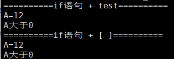

> 示例2：test_if2.sh。判断A变量的数值是奇数还是偶数

```shell
#!/bin/bash
echo '==========if-else语句========='
A=12
echo 'A='${A}
if [ $((A%2)) -eq 0 ]   #A%2是运算式，所以加%(())
then
	echo 'A是偶数'
else
	echo 'A是奇数'
fi
```

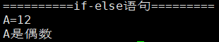

> 示例3：test_if3.sh。

需求：输入一个年龄数字，如果小于18，则输出“未成年”，如果小于60，则输出“成年人”，否则输出“老年人”，如果没有指定年龄，提示“请输入年龄”。

```shell
#!/bin/bash
echo '==========if-else-if语句========='
AGE=25
echo 'AGE='${AGE}
if [ $AGE -lt 18 ]
then
  echo '未成年人'
elif [ $AGE -lt 60 ]
then
  echo '成年人'
else
  echo '老年人'
fi
```

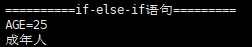

> 示例4：test_if_file.sh

需求：输入文件名或目录名，判断文件或目录是否存在，如果文件或目录存在显示其大小，如果不存在提示不存在。

```bash
#!/bin/bash
echo '==========if-else-if语句========='
if [ $# -eq 0 ]
then
  echo '请输入文件或目录名'
elif [ -f $1 ]
then
  echo '文件存在'
  du -hs $1
elif [ -d $1 ]
then
  echo '目录存在'
  du -hs $1
else
	echo '文件或目录不存在'
fi
```

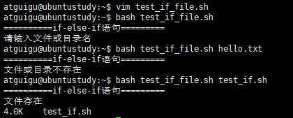

> 拓展：文件判断符

| 比较符 |                含义                 |          案例           |
| :----: | :---------------------------------: | :---------------------: |
|  `-e`  | 文件 / 目录**存在**即可（无论类型） | `[ -e /root/test.sh ]`  |
|  `-f`  |  是**普通文件**（非目录、非链接）   | `[ -f /root/test.sh ]`  |
|  `-d`  |             是**目录**              |   `[ -d /root/work ]`   |
|  `-r`  |         文件 / 目录**可读**         | `[ -r /root/test.sh ]`  |
|  `-w`  |         文件 / 目录**可写**         | `[ -w /root/test.sh ]`  |
|  `-x`  |        文件 / 目录**可执行**        | `[ -x /root/test.sh ]`  |
|  `-s`  |    文件**非空**（文件大小 > 0）     | `[ -s /root/test.log ]` |
|  `-L`  |          是**软链接文件**           | `[ -L /usr/bin/java ]`  |
|  `-b`  |   是**块设备文件**（硬盘、U 盘）    |    `[ -b /dev/sda ]`    |
|  `-c`  |  是**字符设备文件**（串口、终端）   |    `[ -c /dev/tty ]`    |

### 4.2 case语句

> 语法格式：

```shell
case $变量名 in 
值1)
    如果变量的值等于值1，则执行程序1 
;; 
值2)
    如果变量的值等于值2，则执行程序2 
;; 
    …省略其他分支… 
*)
    如果变量的值都不是以上的值，则执行此程序 
;; 
esac

#紧凑型写法
case $匹配变量 in
    匹配值1) 命令1 ;;
    匹配值2) 命令1;命令2 ;;
    匹配值3|匹配值4) 命令 ;;
    *) 兜底命令 ;;
esac
```

注意事项：

（1）case行尾必须为单词`in`，每一个模式匹配必须以右括号`)`结束。

（2）双分号`;;`表示命令序列结束，相当于C语言中的break。

（3）最后的`*)`表示默认模式，相当于C语言中的default。

（4）所有 case 语句必须以 esac 结束（case反过来写）

（5）如果匹配的是字符串变量，建议写成 `case "$变量名" in`，"值1"等，避免变量为空值 / 包含空格时，出现语法解析错误。

> 示例代码：test_case1.sh

需求：输入一个数字，输出对应的星期单词，如果没有输入数字，提示“请输入星期的数字”。

```shell
#!/bin/bash
echo '==========case语句========='
case $1 in 
    1) echo 'Monday';; 
    2) echo 'Tuesday';;
    3) echo 'Wednesday';;
    4) echo 'Thursday';;
    5) echo 'Friday';;
    6) cho 'Saturday';;
    7) echo 'Sunday';;
    *)echo '星期数字[1,7]';; 
esac
```

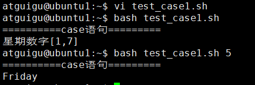

> 示例代码：test_case2.sh

需求：需求：判断输入的内容类型，演示 `*`、`?`、`[]` 通配符的用法，这是 `if` 很难实现的场景。

```shell
#!/bin/bash
content=$1
case "$content" in
    [0-9])echo "你输入了【单个数字】";;
    [a-z]|[A-Z])echo "你输入了【单个字母】";;
    ?)echo "你输入了【单个特殊字符】";;
    *@*)echo "你输入的内容包含@，疑似邮箱地址";;
    *.sh)echo "你输入的是【shell脚本文件名】";;
    *)echo "你输入的是【其他内容】";;
esac
```

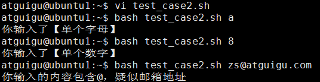

### 4.3 for循环

> 语法格式

```shell
# 语法一：固定次数循环、指定区间的循环
for ((初始值;循环控制条件;变量变化)) 
do 
    程序 
done

# 语法二：遍历列表、遍历字符串集合、遍历文件、遍历数组、遍历命令执行结果
for 变量 in 值1 值2 值3… 
do 
    程序 
done
```

- 所有的循环以done结尾

> 示例：test_for.sh

需求：（1）输出[1,10]，（2）用for循环挨个输出输入参数

```shell
#!/bin/bash
echo '==========for语句1========='
for ((i=1; i<=10; i++))
do
	echo ${i}
done

echo '==========for语句2========='
for param in "$@"  #必须加""
do
	echo ${param}
done
```

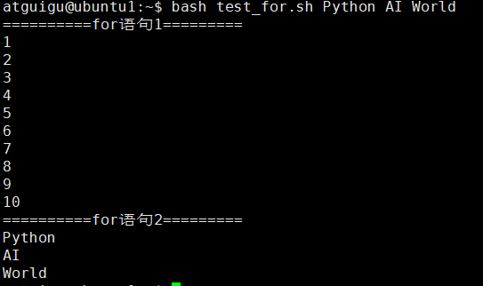

### 4.4 while循环

> 语法格式

```shell
while [ 条件判断式 ] 
do 
    程序
done
```

🔴while后面的条件也可以用test命令

> 示例：test_while.sh

需求：从1加到100

```shell
#!/bin/bash
echo '==========while语句========='
i=1
sum=0
while [ ${i} -le 100 ]
do
	let sum+=i
	let i++
done
echo ${sum}
```

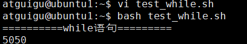

## 第五章 read命令

`read` 是 Shell 中用于从标准输入或文件描述符读取数据的内置命令，它将读取的数据分割成字段并赋值给变量。

> 命令格式

```shell
read [选项] [变量名...]
```

| 选项            | 描述                   |
| :-------------- | :--------------------- |
| `-p "提示信息"` | 显示提示信息，等待输入 |
| `-t 秒数`       | 设置超时时间           |

> 示例1：test_read1.sh

```shell
#!/bin/bash
echo '==========read命令========='
# 读取三个变量（以空格分隔）
if read -t 10 -p "请在10秒内输入姓名、年龄、城市: " name age city
then
	echo "$name 今年 $age 岁，来自 $city"
else
	echo "超时未输入"
fi
```

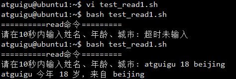

> 示例2：test_read2.sh

```shell
#!/bin/bash
echo '==========read命令========='
while read line
do
    echo "行内容: $line"
done < "$1"
```

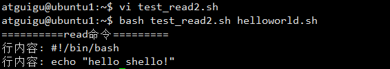


## 第六章 函数

Shell 函数和其他编程语言（Java/Python/C）的函数**作用完全一致**：将一段**重复执行的代码块**封装起来，起一个名字（函数名），后续需要执行这段代码时，**直接调用函数名即可**，无需重复编写代码。

### 6.1 Shell函数与Shell命令区别

- Shell命令是构成Shell脚本的基础单位，包括预定义的操作系统命令和外部工具。
- Shell函数是用户自定义的代码块，用于封装复杂操作，提高代码的模块化和复用性。
- 命令直接作用于Shell环境，而函数则是在Shell环境中定义并调用的，提供了更灵活的编程能力。

### 6.2 自定义函数

> 定义函数语法格式：

```shell
# 格式1：完整版
function 函数名() {
    # 函数体
    程序
    程序
    ...
}

# 格式2：标准写法
函数名() {  # 小括号()内必须为空，不能写形参，这与其他语言不同
    # 函数体：封装的代码逻辑
    程序
    程序
    ...
}


# 格式3：不能同时省略function和()
function 函数名 {
    # 函数体
    程序
    程序
    ...
}
```

- Shell 函数的 **小括号内不能定义形参**（比如`func(a,b)`这种写法是错误的）；
- Shell 函数的 可以省略function或()，但是不能同时省略function和()

> 调用函数的语法格式：

```shell
函数名 [参数1 参数2]
```

- Shell 调用函数，只需要写「函数名」，函数名后不需要加括号
- 给 Shell 函数传参，必须在**调用函数时**，在函数名后面用**空格分隔参数**；
- 函数内部，通过 **内置位置参数变量$n** 获取传递的参数，这些变量是 Shell 预定义的，固定写法，不能修改。

> 示例：test_fun1.sh

需求：定义求几个整数的和

```shell
#!/bin/bash
echo '==========自定义函数========='
sum()
{
	SUM=$[$1+$2]
    echo $SUM
}

read -p "请输入第一个数值: " a
read -p "请输入第二个数值: " b
sum $a $b
```

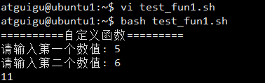

### 6.3 函数返回值

#### 1、使用return返回结果

- Shell 中 **`return` 关键字只能返回【整数】**，且范围只能是 `0~255`，超出这个范围会报错。**返回值的含义约定**：和 Shell 命令的执行状态一致 → `return 0` 表示函数执行成功，`return 非0` 表示函数执行失败；
- 函数调用后，通过内置变量 **`$?`** 获取上一个函数的 return 返回值。

> 示例：test_fun2.sh

```shell
#!/bin/bash
echo '==========自定义函数========='
check_age()
{
	if (($1 >= 0 && $1 <= 150))
	then
        echo '年龄在[0,150]，校验成功'
        return 0  # 0 = 成功
    else
        echo "年龄不合法，校验失败"
        return 1  # 非0 = 失败
    fi
}

read -p "请输入年龄: " age
check_age $age

echo '函数结果：'$?
```

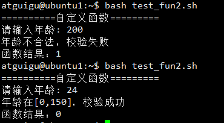


#### 2、使用echo返回结果

`echo`返回 **任意类型的数据**：整数、字符串、浮点数、多行内容、复杂计算结果，这是 Shell 函数**最常用的返回值写法**，**解决了 return 只能返回 0~255 整数的限制**。

- 函数内部用 `echo` 输出需要返回的内容（任意内容都可以）；
- 调用函数时，用 **反引号  或 `$()`** 包裹函数名，捕获函数的 echo 输出内容；
- 把捕获的内容赋值给变量，后续即可通过变量使用返回值。

> 示例：test_fun3.sh

```shell
#!/bin/bash
echo '==========自定义函数========='
sum()
{
	SUM=$[$1+$2]
    echo $SUM
}

read -p "请输入第一个数值: " a
read -p "请输入第二个数值: " b

res=$(sum $a $b)
if (($res >0))
then
	echo '和是正数'
fi
```

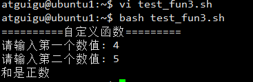


## 第七章  Shell工具

### 7.1 cut命令

`cut`和 `grep`（过滤）、`sed`（编辑）并称 Shell 文本处理三剑客的「基础剑客」。

`cut` = **切割 / 截取**，用于从**文本文件**或**标准输入**中，**按指定规则截取部分内容**并输出，核心是「按列处理」，完美解决**结构化文本**（如以逗号、冒号、空格分隔的表格 / 日志）的列提取需求。

> 命令格式

```bash
# 语法1：处理文件
cut [选项] 文件名

# 语法2：处理管道符的标准输入
命令 | cut [选项]
```

✅格式说明

- `[选项]` 是 `cut` 的核心，决定**截取模式**和**截取规则**，必须指定；
- 支持处理多个文件：`cut [选项] 文件1 文件2`；
- 输出结果：默认将截取的内容打印到**标准输出**（终端），可通过 `>` 重定向到文件。

✅`cut` 提供**3 种根本不同的截取模式**，分别对应不同的文本格式，这是使用 `cut` 的基础，**必须先明确文本的分隔规则，再选择对应的模式**。

✅ 黄金原则：**固定长度用 `-c`/`-b`，分隔符分隔用 `-f`**（工作中 `-f` 最常用）。

|    截取模式    | 核心参数 |                   适用场景                    |              截取单位              |
| :------------: | :------: | :-------------------------------------------: | :--------------------------------: |
| 按**字符**截取 |   `-c`   |    固定字符长度的文本（如固定列宽的报表）     |              单个字符              |
| 按**字节**截取 |   `-b`   |          二进制 / 编码相关的文本处理          |                字节                |
| 按**字段**截取 |   `-f`   | 分隔符分隔的结构化文本（如 CSV、/etc/passwd） | 字段（列），需配合 `-d` 指定分隔符 |

#### 7.1.1 按字符/字节截取

> 命令格式

```bash
#按字符截取
cut -c 字符范围 文件名
命令 | cut -c 字符范围

#按字节截取
cut -b 字节范围 文件名
命令 | cut -b 字节范围
```

✅字节和字符范围的写法：

| 写法  |                 含义                  |               示例                |
| :---: | :-----------------------------------: | :-------------------------------: |
|  `n`  |            截取第 n 个字符            |     `-c 5` → 截取第 5 个字符      |
| `n-m` | 截取第 n 到第 m 个字符（包含 n 和 m） |    `-c 1-5` → 截取 1-5 个字符     |
| `n-`  |         截取第 n 个字符到末尾         |  `-c 3-` → 截取第 3 个字符到最后  |
| `-m`  |         截取开头到第 m 个字符         |     `-c -5` → 截取前 5 个字符     |
| `n,m` |   截取第 n 和第 m 个字符（不连续）    | `-c 1,5` → 截取第 1 和第 5 个字符 |

> 准备测试文本 test_char_chinese.txt

```txt
01 北京
02 上海
03 广州
04 深圳
```

> 准备测试文本 test_char_english.txt

```txt
01 beijing
02 shanghai
03 guangzhou
04 shenzhen
```

> 示例

```bash
# 1. 截取每一行第4-6个字符
cut -c 4-6 test_char_chinese.txt
cut -c 4-6 test_char_english.txt

# 2. 截取每一行第4个字节
cut -b 4 test_char_chinese.txt
cut -b 4 test_char_english.txt
```

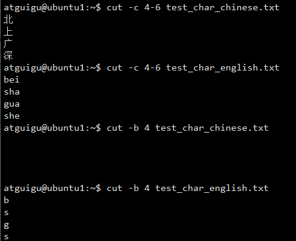

🔴**不要再用 cut 处理包含中文的文本**，`cut` 不支持多字节字符，这是缺陷！参数 `-c` 的全称是 **`characters`(字符)**，但这个「字符」的定义是 **【ASCII 字符】**，不是我们理解的「中文汉字字符」

#### 7.1.2 按「字段」截取

- 用于处理**以分隔符分隔的结构化文本**（如 CSV 文件、`/etc/passwd`、日志文件等），必须配合 `-d` 参数指定分隔符。

> 命令格式

```bash
cut -d "分隔符" -f 字段范围 文件名
命令 | cut -d "分隔符" -f 字段范围
```

- 字段范围的写法同之前字符/字节范围写法
- `-d` 参数**只能指定单个字符**作为分隔符，无法识别多个字符（如 `--`、`||`）。`cut` 默认识别**制表符（Tab）** 为分隔符，**不识别空格**，且无法处理「多个空格」分隔的场景。可以先用 `tr -s " "` 压缩多个空格为单个空格，再截取。
- `--complement`**反向截取**：不截取指定字段，而是截取**除了指定字段之外的所有字段**

> 准备测试文件：`test_csv.csv`，内容为学生成绩表（逗号分隔）

```txt
姓名,语文,数学,英语,总分
张三,90,85,95,270
李四,88,92,80,260
王五,75,80,85,240
```

```bash
# 截取第1和第5列（姓名 + 总分）
cut -d "," -f 1,5 test_csv.csv

# 截取除了第2,5列
cut -d "," -f 2,5 --complement test_csv.csv
```

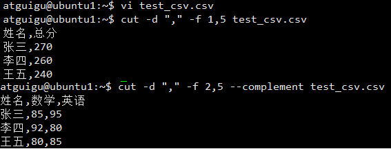

> 准备测试文件：test_space.txt

```txt
姓名  语文  数学  英语
张三  90    85    95
李四  88    92    80
```

```bash
#截取姓名和语文成绩
# 错误写法：直接用空格作为分隔符，无法正确截取（因为是多个空格）
cut -d " " -f 1,2 test_space.txt

# 正确写法：先压缩空格，再截取
cat test_space.txt | tr -s " " | cut -d " " -f 1,2
# 输出：
# 姓名 语文
# 张三 90
# 李四 88
```

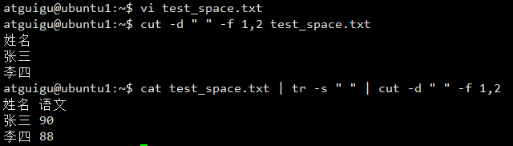

> 提取IP地址

```bash
ifconfig ens33 |grep netmask |cut -d "i" -f 2 |cut -d " " -f 2

#ens33 是 Linux 系统中网络接口的名称
```

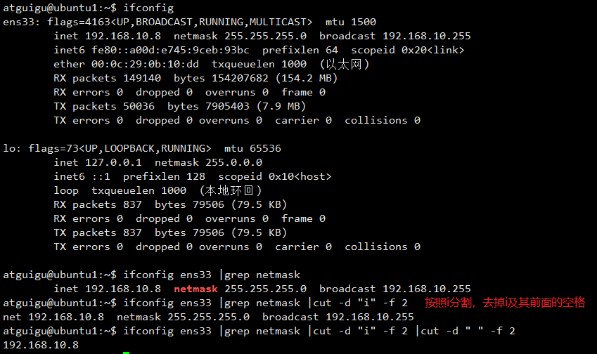

### 7.2 awk命令

✅`awk` 是一门**面向文本的编程语言**，也是一个独立的 Linux 命令，诞生于 1977 年，命名来自三位作者的首字母 `Aho + Weinberger + Kernighan`。它的核心设计目标就是：**处理结构化文本、按行按列灵活操作数据**。

✅`awk` 能完美解决你之前遇到的 `cut` 处理中文乱码的问题，**原生支持中文、支持多字符分隔、支持正则、支持逻辑判断 / 循环 / 运算 / 函数**，集 `cut`（截取）、`grep`（过滤）、`sed`（编辑）的功能于一身，还能实现统计、计算、格式化输出等复杂需求。

> 命令格式

```bash
awk [选项] '处理规则 {处理动作}' 文件名
其他命令 | awk [选项] '处理规则 {处理动作}'

# 关于正则请看下一章
awk [选项] '/正则表达式/{处理动作}' 文件名
其他命令 | awk [选项] '/正则表达式/{处理动作}'
```

- **[选项]** ：可选，最常用的有 `-F`（指定字段分隔符），极少数场景用 `-v`（定义自定义变量）；
- **处理规则** ：必须用 **单引号 `' '`** 包裹，这是 awk 的核心，所有的逻辑（截取、过滤、运算、循环）都写在这里；处理规则可以为空，此时 awk 会**原样输出所有行**
- **文件名** ：要处理的文本文件，支持多个文件，用空格分隔；
- **管道输入** ：awk 可以接收`grep/cat/cut/sort`等命令的输出

✅ 执行流程：逐行读取、循环处理，直到文件结束）

1. **读行**：awk 会**从文件 / 管道中，一次读取一行文本**，把这行文本加载到内存中，作为「当前处理行」；
2. **处理**：对内存中的「当前行」，执行我们写的 `处理规则`（截取、过滤、运算等）；
3. **输出**：处理完成后，按规则输出结果（默认输出到终端）；
4. **循环**：重复上述三步，直到所有行都读取处理完毕，自动退出。

✅awk 【内置变量】

- 第一类：字段相关变量。awk 会把**当前行的文本**，按照「指定的分隔符」拆分成**多个列 / 字段**，用以下变量表示：
  - `$0`  → 表示【当前行的完整内容】 `$n`  → 表示【当前行的第n列/第n个字段】
- 第二类：分隔符变量-F
  - 支持**单个字符**：`-F ":"`（冒号）、`-F ","`（逗号）、`-F " "`（空格）；
  - 支持**多个字符**：`-F "||"`（两个竖线）、`-F "--"`（两个横线），`cut`完全做不到；
  - 支持**正则表达式**：`-F "[ ,:]"`（匹配空格、逗号、冒号中的任意一个）、`-F "[0-9]"`（匹配任意数字）；
  - **默认分隔符**：如果不写 `-F`，awk 默认以「**任意空白符**」（单个空格、多个空格、Tab 键）作为分隔符，**自动压缩多个空格为一个**

- 第三类：行相关变量
  - NR  → 表示【当前处理的行号】（从1开始计数） 
  - NF  → 表示【当前行被分隔符拆分后的总字段数/总列数】

> 准备测试文本：test_awk.txt

```txt
张三,90,85,95
李四,88,92,80
王五,83,93,100
赵六,93,74,50
```

> 示例

```bash
# 案例1：过滤出第1列是「张三」的行，输出整行内容
awk -F "," '$1=="张三" {print $0}' test_awk.txt

# 案例2：假如第4列是英语成绩，过滤出英语成绩>90的行（逗号分隔），输出姓名和英语成绩
awk -F "," '$4>90 {print $1, $4}' test_awk.txt 

# 案例3：给截取的内容加表头，格式化输出
awk 'BEGIN{print "姓名, 语文, 数学, 英语"} {print $1,$2,$3,$4}' test_awk.txt
```


## 第八章 正则表达式

正则表达式使用单个字符串来描述、匹配一系列符合某个语法规则的字符串。在很多文本编辑器里，正则表达式通常被用来检索、替换那些符合某个模式的文本。在Linux中，grep，sed，awk等命令都支持通过正则表达式进行模式匹配。

### 8.1 正则表达式通用元字符

#### 🌐 基础匹配（纯字符 / 边界 / 空匹配）

1. `^` ：匹配行首，表示「以某个字符开头」。例：`^root` 匹配 以 `root` 开头的行
2. `$` ：匹配行尾，表示「以某个字符结尾」。例：`bash$` 匹配 以 `bash` 结尾的行
   - `^$` ：组合用法，匹配**空行**（行首直接接行尾，无任何字符）
3. `.`：匹配任意单个字符（注意：不匹配空字符，必须有 1 个字符）。例：`r..t` 匹配 `root`、`rest`、`r9*t` 等（r 和 t 之间 2 个任意字符）
4. `\` ：转义符，让「元字符变回普通字符」，或让「普通字符变特殊功能」。例：`\.` 匹配 小数点本身；`\$` 匹配 美元符号本身；BRE 中 `\+` 让 `+` 生效

#### 🌐 重复匹配（限定字符出现次数）

1. `*`：匹配前面的字符 0 次、1 次 或 多次（0 次就是 "可有可无"）。例：`ro*t` → 匹配 rt、rot、root、rooot...
2. `+`：匹配前面的字符1 次 或 多次。例：`ro+t` → 匹配 rot、root、rooot...，不匹配rt
3. `?`：匹配前面的字符 0 次、1 次（0 次就是 "可有可无"）。例如：`ro?t` → 匹配 rt、rot、不匹配root、rooot...
   - 当此字符紧随任何其他限定符（*、+、?、{*n*}、{*n*,}、{*n*,*m*}）之后时，匹配模式是"非贪心的"。"非贪心的"模式匹配搜索到的、尽可能短的字符串，而默认的"贪心的"模式匹配搜索到的、尽可能长的字符串。例如，在字符串"oooo"中，"o+?"只匹配单个"o"，而"o+"匹配所有"o"。  
4. `{n}` ：匹配前面的字符 恰好 n 次。例：`ro{2}t` → 只匹配 `root`（r 和 t 之间恰好 2 个 o）
5. `{n,}` ：匹配前面的字符 至少 n 次。例：`ro{2,}t` → 匹配 root、rooot、rooooot...
6. `{n,m}` ：匹配前面的字符 至少 n 次，最多 m 次。例：`ro{2,3}t` → 只匹配 root、rooot

#### 🌐 字符集匹配

1. `[abc]` ：匹配 方括号中任意单个字符（a、b、c 三选一）。例：`r[ao]t` → 匹配 rat、rot
2. `[a-z]` ：匹配 小写字母 a 到 z 任意单个字符（连续范围）
3. `[0-9]` ：匹配 数字 0 到 9 任意单个字符
4. `[a-zA-Z0-9]` ：匹配 大小写字母 + 数字 任意单个字符
5. `[^abc]`：匹配 「除了」a、b、c 之外的任意单个字符（^在字符集内是「取反」，和行首匹配区分开）。例：`r[^ao]t` → 匹配 rbt、r9t、r*t 等，不匹配 rat、rot

#### 🌐 特殊字符集

这些简写在 ERE 中完全生效，BRE 中部分生效（关于ERE和BRE请看下个小节）：

- `[[:digit:]]` → 等价于 `[0-9]` ：匹配任意数字
- `[[:alpha:]]` → 等价于 `[a-zA-Z]` ：匹配任意大小写字母
- `[[:alnum:]]` → 等价于 `[a-zA-Z0-9]` ：匹配任意字母 + 数字
- `[[:space:]]` → 匹配任意空白符（空格、Tab 键）
- `[[:upper:]]` → 匹配任意大写字母
- `[[:lower:]]` → 匹配任意小写字母

#### 🌐其他特殊字符

请看《正则表达式语法.docx》

### 8.2 Shell 环境下的正则表达式的2大体系

Shell 环境下的正则表达式，**不是一套规则通用所有场景**，核心分为两大体系：

✅ 1. 基础正则表达式 (BRE, Basic Regular Expression)

- **核心规则**：语法精简、基础，**部分元字符需要加 `\` 转义**才能生效（如 `+ ? ( ) { } |`），否则会被当作普通字符
- **支持的 Shell 命令**：`grep`（默认）、`sed`（默认）、`ed`、`vi/vim`等
- **记忆技巧**：基础命令默认都是 BRE，追求兼容性，语法偏 "保守"

✅ 2. 扩展正则表达式 (ERE, Extended Regular Expression)

- **核心规则**：语法更全面、更灵活，**所有元字符原生生效，无需加 `\` 转义**，写起来更简洁
- **支持的 Shell 命令**：`grep -E` / `egrep`、`sed -E` / `sed -r`、`awk`（**awk 默认原生支持 ERE，无需任何参数**）等
- **记忆技巧**：带 `-E` 参数的命令都是 ERE，功能更强，优先使用

> 示例
>

```bash
# 匹配13开头的11位手机号码
echo '13812345678 13456 15998765432' | grep -o '13[0-9]\{9\}'    #使用基础正则表达式，{}需要转义。-o表示只显示匹配的结果
echo '13812345678 13456 15998765432' | grep -Eo '13[0-9]{9}'     #使用扩展正则表达式

# 提取文本中所有数字
echo 'abc123def456ghi789' | grep -o '[0-9]\+'
echo 'abc123def456ghi789' | grep -Eo '[0-9]+'

# 查找cats和dogs
echo 'cats dogs birds cat' | grep '\(cat\|dog\)s'
echo 'cats dogs birds cat' | grep -E '(cat|dog)s'

# 匹配邮箱（简单版，通用场景足够用）
echo "test@abc.com abc@163.cn 123456" |  grep  '[a-zA-Z0-9_-]\+@[a-zA-Z0-9_-]\+\(\.[a-zA-Z0-9_-]\+\)\+'
echo "test@abc.com abc@163.cn 123456" |  grep -E '[a-zA-Z0-9_-]+@[a-zA-Z0-9_-]+(\.[a-zA-Z0-9_-]+)+'

# 查看~/.bashrc文件 不是#开头 且不是空行的有效行
cat ~/.bashrc | awk '!/^#/ && !/^$/'  #!表示取反
```
