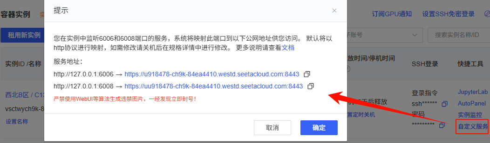

#  GPU 模型部署：vLLM + BGE 自定义服务版

## 1  本课程介绍

面向项目：`shopkeeper_brain` 掌柜智库  
部署目标：最终用 2 台 Linux GPU 服务器承载 3 个本地模型服务：

- `BGE-M3` 和 `bge-reranker-large` 部署在同一台机器上
- `Qwen3-8B` 通过 vLLM 部署在另一台机器上
- 业务项目通过 HTTP 远程调用三个模型服务

---

## 2.  最终架构

最终架构如下：

```text
shopkeeper_brain 业务项目
  ├─ 调用 Qwen3-8B:       http://192.168.11.122:8100/v1/chat/completions
  ├─ 调用 BGE-M3:         http://192.168.11.121:8101/v1/embeddings
  └─ 调用 reranker:       http://192.168.11.121:8102/v1/rerank
```

生产环境两台模型服务器：

```text
┌──────────────────────────────────────────────────────────────┐
│ 模型服务器 A：Embedding / Rerank 服务器，例如 192.168.11.121   │
│                                                              │
│  - BGE-M3 custom FastAPI:       :8101 /v1/embeddings          │
│  - bge-reranker custom FastAPI: :8102 /v1/rerank              │
└──────────────────────────────────────────────────────────────┘

┌──────────────────────────────────────────────────────────────┐
│ 模型服务器 B：LLM 服务器，例如 192.168.11.122                  │
│                                                              │
│  - Qwen3-8B vLLM:             :8100 /v1/chat/completions      │
└──────────────────────────────────────────────────────────────┘
```

业务项目、Milvus、Neo4j、MongoDB、MinIO 可以继续部署在业务服务器上。两台模型服务器只负责模型推理服务。


---

## 3. 当前项目和模型的关系

当前项目里和三类模型相关的关键文件如下：

| 模型 | 当前项目文件 | 当前调用方式 |
|---|---|---|
| LLM / Qwen | `knowledge/utils/llm_client_util.py` | 通过 `langchain_openai.ChatOpenAI` 调 OpenAI 兼容接口 |
| BGE-M3 | `knowledge/utils/bge_m3_embedding_util.py` | 默认使用 `pymilvus.model.hybrid.BGEM3EmbeddingFunction` 本地加载模型 |
| reranker | `knowledge/utils/bge_rerank_util.py` | 默认使用 `FlagEmbedding.FlagReranker` 本地加载模型 |

这意味着：

1. `Qwen3-8B` 只要使用 vLLM 暴露 OpenAI 兼容接口，业务项目配置 `OPENAI_API_BASE` 即可切换。
2. `BGE-M3` 不能只用普通 dense embedding 替换，因为当前 Milvus 混合检索依赖 `dense + sparse`。
3. `reranker` 适合封装成 HTTP 服务，输入 `query + documents`，返回每个候选文档的重排分数。

---

## 4. 服务器规划

### 4.1 模板机规划

先准备一台模板机：

```text
临时模板机 IP: 192.168.11.121
OS: Ubuntu 22.04 / Ubuntu 24.04
GPU: 1 张 NVIDIA GPU，建议 24GB 显存及以上
Python: 3.10 或 3.11
模型目录: /usr-data/models
模型服务目录: /usr-data/apps/model_services
虚拟环境目录: /usr-data/venvs/model_services
日志目录: /usr-data/log/model_services
```

模板机在验证阶段会安装并测试三个服务：

| 服务 | 端口 | 验证阶段机器 |
|---|---:|---|
| vLLM Qwen3-8B | 8100 | 模板机 |
| BGE-M3 服务 | 8101 | 模板机 |
| reranker 服务 | 8102 | 模板机 |

### 4.2 克隆后的生产规划

模板机验证通过后克隆一台新机器：

| 角色 | 示例 IP | 正式启动的服务 |
|---|---|---|
| 模型服务器 A | `192.168.11.121` | BGE-M3 `:6006`，reranker `:6008` |
| 模型服务器 B | `192.168.11.122` | Qwen3-8B vLLM `:6006` |

注意：

- 模型服务器 A 不再启动 Qwen3-8B。
- 模型服务器 B 不再启动 BGE-M3 和 reranker。
- 两台机器都保留完整模型文件没有问题，只是正式启动不同服务。
- 如果服务需要被其他机器访问，监听地址使用 `0.0.0.0`，并开放 `8100/8101/8102` 端口。

---

## 5. 模板机准备系统环境

### 5.1 检查 GPU

```bash
nvidia-smi
```

能看到 GPU、驱动版本和 CUDA Version 即可继续。

### 5.2 创建目录

```bash
sudo ln -s /root/autodl-tmp  /usr-data  # /root/autodl-tmp  为autodl的数据盘 模型较大无法安装到系统盘，为了操作数据盘方便进行软连接到/usr-data
mkdir -p /usr-data/apps/model_services
mkdir -p /usr-data/models
mkdir -p /usr-data/venvs
mkdir -p /usr-data/log/model_services
```

### 5.3 创建 Python 虚拟环境

```bash
cd /usr-data/apps/model_services
python3 -m venv /usr-data/venvs/model_services
source /usr-data/venvs/model_services/bin/activate
python -m pip install --upgrade pip
```

如果租用的 GPU 镜像已经预装 PyTorch，先验证当前环境：

```bash
python - <<'PY'
import torch
print("torch:", torch.__version__)
print("cuda available:", torch.cuda.is_available())
print("torch cuda:", torch.version.cuda)
print("gpu:", torch.cuda.get_device_name(0) if torch.cuda.is_available() else "none")
PY
```

只要 `cuda available` 是 `True`，并且能打印出 GPU 名称，就可以继续安装模型服务依赖。

如果镜像没有 PyTorch，或者 `torch.cuda.is_available()` 为 `False`，再根据服务器 CUDA 版本选择对应的 PyTorch wheel。下面命令只是示例，实际部署时要按服务器 CUDA 版本调整：

```bash
pip install torch torchvision --extra-index-url https://download.pytorch.org/whl/cu121
```

### 5.4 安装三类模型服务依赖

```bash
pip install \
  fastapi \
  uvicorn \
  python-dotenv \
  requests \
  pydantic \
  pymilvus \
  "pymilvus[model]" \
  FlagEmbedding \
  sentence-transformers \
  transformers \
  scipy \
  numpy \
  modelscope \
  vllm
```

安装完成后再次检查 PyTorch 是否仍然可用：

```bash
python - <<'PY'
import torch
print("torch:", torch.__version__)
print("cuda available:", torch.cuda.is_available())
print("gpu:", torch.cuda.get_device_name(0) if torch.cuda.is_available() else "none")
PY
```

如果这台机器只负责模型推理，不需要安装 `langchain`、`langgraph`、`neo4j`、`pymongo`、`minio`、`ragas`、`mineru` 等业务项目依赖。那些依赖只需要安装在运行 `shopkeeper_brain` 业务 API 的机器上。

---

## 6. 模板机准备模型文件

推荐模型目录：

```text
/usr-data/models/
  ├─ Qwen3-8B/
  ├─ bge-m3/
  └─ bge-reranker-large/
```

使用 ModelScope 下载：

```bash
source /usr-data/venvs/model_services/bin/activate

modelscope download --model Qwen/Qwen3-8B \
  --local_dir /usr-data/models/Qwen/Qwen3-8B

modelscope download --model BAAI/bge-m3 \
  --local_dir /usr-data/models/BAAI/bge-m3

nohup  modelscope download --model BAAI/bge-reranker-large \
  --local_dir /usr-data/models/BAAI/bge-reranker-large    >reranker_install.log 2>&1  &
```

下载完成后检查目录：

```bash
ls -lh /usr-data/models
ls -lh /usr-data/models/Qwen/Qwen3-8B
ls -lh /usr-data/models/BAAI/bge-m3
ls -lh /usr-data/models/BAAI/bge-reranker-large
```

---

## 7. 模板机部署 Qwen3-8B：vLLM 服务

### 7.1 启动 vLLM

验证阶段先在模板机启动 Qwen3-8B：

```bash
source /usr-data/venvs/model_services/bin/activate

CUDA_VISIBLE_DEVICES=0 \
nohup python -m vllm.entrypoints.openai.api_server \
  --host 127.0.0.1 \
  --port 6006 \
  --model /usr-data/models/Qwen/Qwen3-8B \
  --served-model-name qwen3-8b \
  --api-key sk-atguigu \
  --dtype auto \
  --gpu-memory-utilization 0.85 \
  --max-model-len 8192 \
  --trust-remote-code  >/usr-data/log/qwen.log 2>&1 & 
```

参数说明：

| 参数 | 说明 |
|---|---|
| `--served-model-name qwen3-8b` | 业务项目里配置的模型名建议使用这个值 |
| `--api-key sk-atguigu` | 开启 vLLM OpenAI 兼容接口鉴权，业务项目请求时要带同一个 key |
| `--gpu-memory-utilization 0.65` | 模板机验证阶段给 BGE-M3 和 reranker 预留显存，如果独占一台gpu服务器可以去掉 |
| `--max-model-len 8192` | RAG 场景先用 8k，上下文更长时再调大 |
| `--trust-remote-code` | Qwen 系模型通常建议开启 |

### 7.2 验证 vLLM

```bash
curl http://127.0.0.1:6006/v1/models \
  -H "Authorization: Bearer sk-atguigu"
```

```bash
curl http://127.0.0.1:6006/v1/chat/completions \
  -H "Content-Type: application/json" \
  -H "Authorization: Bearer sk-atguigu" \
  -d '{
    "model": "qwen3-8b",
    "messages": [
      {"role": "user", "content": "请用一句话介绍你自己"}
    ],
    "temperature": 0.1,
    "stream": false
  }'
```

验证通过后先停止 vLLM，继续部署 BGE-M3 和 reranker：

```bash
Ctrl + C
```

---

## 8. 模板机部署 BGE-M3：hybrid embedding 服务

### 8.1 为什么 BGE-M3 要自定义服务

​        目前gpu服务器下载的BGE-M3只是一堆参数文件，不可执行，也不可远程调用。必须用本地程序把参数文件变成可执行的内存对象，然后再发布为网络http服务，才可以被其他应用远程调用。

### 8.2 是否可以使用vllm把bgem3的模型发布为http服务。

如果是普通的单索引模型是vllm是可以的，但是当前项目的是需要 Milvus 混合检索依赖：

```text
dense_vector + sparse_vector
```

因此 BGE-M3 服务必须返回 dense 和 sparse 两类向量，不能只返回普通 dense embedding。

### 8.3 通过提示词生成模型服务发布程序

```text
【目标】 
   我想把bgem3 部署在云gpu服务器上，请帮我生成一个python程序。 把bgem3 模型发布为 模型http服务。 
【环境】 
   模型保存在linux服务器上/usr-data/models/BAAI/bge-m3位置 
【接口要求： 
   1 请参考knowledge\utils\bge_m3_embedding_util.py 中的对外提供的数据结构。 来设计模型服务接口的数据结构。 希望模型提供的数据能够更容易的对接到现有的项目中。 
   2 使用fastapi 来实现web服务。 
【代码要求】
    1 要求每个方法有详细的中文注释说明 。 
    2  把程序存放在deploy 目录下 bgem3_server.py 不要改动其他代码。
【请求格式】
   curl http://127.0.0.1:6006/embeddings \
  -H "Content-Type: application/json" \
  -d '{"embedding_documents":["RS12 万用表如何测量交流电压？","如何判断电阻量程？"]}'
【返回值格式】
    {
      "dense": [[...]],
      "sparse": [{"...": 0.123}]
    }
 
```


### 8.4   BGE-M3 服务文件代码参考

文件内容：

```python
"""BGE-M3 向量化 HTTP 服务。

本文件提供一个最小可部署的 FastAPI 服务，用于把已经下载好的本地
BGE-M3 模型发布为 HTTP 接口。
"""

import logging
import os
from typing import Dict, List, Optional

import uvicorn
from dotenv import load_dotenv
from fastapi import FastAPI, HTTPException
from pydantic import BaseModel, Field
from pymilvus.model.hybrid import BGEM3EmbeddingFunction

load_dotenv()

logger = logging.getLogger(__name__)
logging.basicConfig(level=logging.INFO)

# 全局模型对象：服务启动后只加载一次，避免每次请求重复加载模型。
bge_m3_ef: Optional[BGEM3EmbeddingFunction] = None


class HybridEmbeddingRequest(BaseModel):
    """混合向量生成请求体。

    字段保持和 knowledge.utils.bge_m3_embedding_util.generate_hybrid_embeddings
    的 embedding_documents 参数一致，传入需要生成向量的文本列表。
    """

    embedding_documents: List[str] = Field(..., description="需要生成向量的文本列表")


class HybridEmbeddingResponse(BaseModel):
    """混合向量生成响应体。

    dense 为稠密向量列表，sparse 为稀疏向量列表。
    sparse 中每个字典的 key 是 token_id，value 是对应权重。
    """

    dense: List[List[float]]
    sparse: List[Dict[int, float]]


def get_bge_m3_embedding_model() -> Optional[BGEM3EmbeddingFunction]:
    """获取 BGE-M3 嵌入模型实例。

    模型会被缓存在全局变量中，后续请求复用同一个模型对象。
    默认模型路径为 /usr-data/models/BAAI/bge-m3，可通过 BGE_M3_PATH 覆盖。
    默认使用 cuda 和 fp16，适合云 GPU 服务器；如需调整可设置环境变量：
    BGE_DEVICE=cpu 或 BGE_FP16=False。

    :return: BGEM3EmbeddingFunction 实例；加载失败时返回 None。
    """

    global bge_m3_ef

    if bge_m3_ef is not None:
        return bge_m3_ef

    model_name = os.getenv("BGE_M3_PATH", "/usr-data/models/BAAI/bge-m3")
    device = os.getenv("BGE_DEVICE", "cuda")
    use_fp16_str = os.getenv("BGE_FP16", "True")
    use_fp16 = use_fp16_str.lower() in ("true", "1", "yes")

    try:
        logger.info("开始加载 BGE-M3 模型，model_name=%s, device=%s, use_fp16=%s", model_name, device, use_fp16)
        bge_m3_ef = BGEM3EmbeddingFunction(
            model_name=model_name,
            device=device,
            use_fp16=use_fp16,
        )
        logger.info("BGE-M3 模型加载完成")
        return bge_m3_ef
    except Exception as e:
        logger.exception("BGE-M3 模型加载失败: %s", e)
        return None


def generate_hybrid_embeddings(
    embedding_model: BGEM3EmbeddingFunction,
    embedding_documents: List[str],
) -> Optional[Dict[str, List]]:
    """为文本列表生成 BGE-M3 混合向量。

    本函数参考 knowledge.utils.bge_m3_embedding_util.generate_hybrid_embeddings
    的处理逻辑，返回结构保持为：
    {
        "dense": [[...], ...],
        "sparse": [{token_id: weight, ...}, ...]
    }

    :param embedding_model: 已加载的 BGE-M3 嵌入模型。
    :param embedding_documents: 需要生成嵌入向量的文本列表。
    :return: 包含 dense 和 sparse 的字典；生成失败时返回 None。
    """

    try:
        embedding_result = embedding_model.encode_documents(embedding_documents)
        csr_array = embedding_result["sparse"]

        processed_sparse_result = []
        for index in range(len(embedding_documents)):
            # csr_array 使用 CSR 稀疏矩阵格式存储，这里按行取出每条文本的稀疏向量。
            start_ind_ptr = csr_array.indptr[index]
            end_ind_ptr = csr_array.indptr[index + 1]

            token_ids = csr_array.indices[start_ind_ptr:end_ind_ptr].tolist()
            weights = csr_array.data[start_ind_ptr:end_ind_ptr].tolist()
            sparse_vector = dict(zip(token_ids, weights))

            processed_sparse_result.append(sparse_vector)

        return {
            "dense": [dense_vector.tolist() for dense_vector in embedding_result["dense"]],
            "sparse": processed_sparse_result,
        }
    except Exception as e:
        logger.exception("BGE-M3 向量生成失败: %s", e)
        return None


def create_app() -> FastAPI:
    """创建 FastAPI 应用实例。"""

    app = FastAPI(title="BGE-M3 Embedding Service", description="BGE-M3 混合向量生成服务")

    @app.post("/v1/embeddings", response_model=HybridEmbeddingResponse)
    def generate_hybrid_embeddings_api(request: HybridEmbeddingRequest):
        """生成 BGE-M3 混合向量。

        请求示例：
        {
            "embedding_documents": ["我是中国人", "我喜欢自由"]
        }

        响应结构和 generate_hybrid_embeddings 函数保持一致，包含 dense 与 sparse。
        """

        if not request.embedding_documents:
            raise HTTPException(status_code=400, detail="embedding_documents 不能为空")

        embedding_model = get_bge_m3_embedding_model()
        if embedding_model is None:
            raise HTTPException(status_code=500, detail="BGE-M3 模型加载失败")

        embedding_result = generate_hybrid_embeddings(
            embedding_model=embedding_model,
            embedding_documents=request.embedding_documents,
        )
        if embedding_result is None:
            raise HTTPException(status_code=500, detail="BGE-M3 向量生成失败")

        return embedding_result

    return app


app = create_app()


if __name__ == "__main__":
    uvicorn.run(app=app, host="0.0.0.0", port=6006)
```

### 8.5 启动 BGE-M3 服务

```bash
source /usr-data/venvs/kb-ray/bin/activate
cd /usr-data/apps/model_services

export BGE_M3_PATH=/usr-data/models/BAAI/bge-m3
export BGE_DEVICE=cuda:0
export BGE_FP16=true

nohup uvicorn bge_m3_service:app --host 127.0.0.1 --port 6006 >/usr-data/log/bgem3.log 2>&1 &
```

### 8.6 验证 BGE-M3 服务

```bash
curl http://127.0.0.1:6006/health
```

```bash
curl http://127.0.0.1:6006/embeddings \
  -H "Content-Type: application/json" \
  -d '{"embedding_documents":["RS12 万用表如何测量交流电压？","如何判断电阻量程？"]}'
```

返回里必须同时包含：

```json
{
  "dense": [[...]],
  "sparse": [{"...": 0.123}]
}
```

---

## 9. 模板机部署 reranker：重排序服务

### 9.1 reranker 服务发布程序提示词

```text
【目标】 
   我想把bgem3 部署在云gpu服务器上，请帮我生成一个python程序。 把reranker 模型发布为 模型http服务。 
【环境】 
   模型保存在linux服务器上/usr-data/models/BAAI/bge-reranker-large位置 
【接口要求： 
   1 请参考knowledge\utils\bge_reranker_embedding_util.py 中的对外提供的数据结构。 来设计模型服务接口的数据结构。 希望模型提供的数据能够更容易的对接到现有的项目中。 
   2 使用fastapi 来实现web服务。 
【代码要求】
    1 要求每个方法有详细的中文注释说明 。 
    2  把程序存放在deploy 目录下 bge_reranker_server.py 不要改动其他代码。
    3 
【请求格式】
curl http://127.0.0.1:8102/v1/rerank \
  -H "Content-Type: application/json" \
  -d '{
    "query": "RS12 怎么测交流电压？",
    "documents": [
      "交流电压测量需要将旋钮置于 V AC，并把表笔接入对应端口。",
      "电阻测量前需要断电并释放电容。"
    ]
  }'
【返回值格式】
   {"scores":[0.87,0.12]}
```


### 9.2 reranker服务发布程序代码参考

```python
"""Reranker HTTP 服务。

本文件提供一个最小可部署的 FastAPI 服务，用于把本地已经下载好的
BGE Reranker 模型发布为 HTTP 接口。

接口路径：POST /v1/rerank
默认端口：6008
"""

import logging
import os
from typing import List, Optional, Tuple

import uvicorn
from dotenv import load_dotenv
from fastapi import FastAPI, HTTPException
from FlagEmbedding import FlagReranker
from pydantic import BaseModel, Field
from transformers import XLMRobertaTokenizer

load_dotenv()

logging.basicConfig(level=logging.INFO)
logger = logging.getLogger(__name__)

# 全局模型实例：服务进程内只加载一次，避免每次请求重复加载 GPU 模型。
_reranker_model: Optional[FlagReranker] = None


class RerankRequest(BaseModel):
    """Rerank 请求体。

    sentence_pairs 与 FlagEmbedding 的 reranker.compute_score 入参保持一致：
    每个元素都是一个二元组，格式为 (query, document_content)。

    请求示例：
    {
        "sentence_pairs": [
            ["用户问题", "候选文档内容1"],
            ["用户问题", "候选文档内容2"]
        ]
    }
    """

    sentence_pairs: List[Tuple[str, str]] = Field(
        ...,
        description="待打分的 query-document 成对列表，格式为 [[query, document], ...]",
    )


class RerankResponse(BaseModel):
    """Rerank 响应体。

    scores 与 reranker.compute_score 的返回结果保持同序：
    scores[i] 对应 sentence_pairs[i] 的相关性分数。
    """

    scores: List[float] = Field(..., description="每组 query-document pair 对应的 rerank 分数")


def _patch_xlm_roberta_tokenizer() -> None:
    """为 transformers 5.x 兼容 FlagEmbedding 的旧 tokenizer 调用。

    当前业务中的 knowledge.utils.bge_rerank_util.py 已包含相同兼容逻辑。
    FlagEmbedding 的部分版本仍会调用 XLMRobertaTokenizer.prepare_for_model，
    但该方法在 transformers 5.x 中可能不存在，因此这里按现有业务代码补齐。
    """

    if hasattr(XLMRobertaTokenizer, "prepare_for_model"):
        return

    def prepare_for_model(self, ids, pair_ids=None, **kwargs):
        truncation = kwargs.get("truncation")
        max_length = kwargs.get("max_length")
        pair_ids = pair_ids or []

        if max_length and truncation in (True, "only_second"):
            special_tokens_count = 4 if pair_ids else 2
            max_pair_length = max_length - len(ids) - special_tokens_count
            if max_pair_length < len(pair_ids):
                pair_ids = pair_ids[: max(0, max_pair_length)]

        cls_token_id = getattr(self, "cls_token_id", None) or 0
        sep_token_id = getattr(self, "sep_token_id", None) or 2

        if pair_ids:
            input_ids = [cls_token_id] + ids + [sep_token_id, sep_token_id] + pair_ids + [sep_token_id]
        else:
            input_ids = [cls_token_id] + ids + [sep_token_id]
        return {"input_ids": input_ids}

    XLMRobertaTokenizer.prepare_for_model = prepare_for_model


def get_reranker_model() -> Optional[FlagReranker]:
    """获取 Reranker 模型实例。

    模型使用单例方式缓存到全局变量中。第一次请求时加载模型，后续请求直接复用。

    环境变量：
    - BGE_RERANKER_LARGE：模型路径，默认 /usr-data/models/BAAI/bge-reranker-large
    - BGE_RERANKER_DEVICE：运行设备，默认 cuda
    - BGE_RERANKER_FP16：是否使用 fp16，默认 True

    :return: FlagReranker 实例；加载失败时返回 None。
    """

    global _reranker_model

    if _reranker_model is not None:
        return _reranker_model

    _patch_xlm_roberta_tokenizer()

    model_path = os.getenv("BGE_RERANKER_LARGE", "/usr-data/models/BAAI/bge-reranker-large")
    device = os.getenv("BGE_RERANKER_DEVICE", "cuda")
    use_fp16 = os.getenv("BGE_RERANKER_FP16", "True").lower() in ("true", "1", "yes")

    try:
        logger.info(
            "开始加载 Reranker 模型：model_path=%s, device=%s, use_fp16=%s",
            model_path,
            device,
            use_fp16,
        )
        _reranker_model = FlagReranker(
            model_name_or_path=model_path,
            device=device,
            use_fp16=use_fp16,
        )
        logger.info("Reranker 模型加载完成")
        return _reranker_model
    except Exception as exc:
        logger.exception("Reranker 模型加载失败：%s", exc)
        return None


def compute_rerank_scores(reranker: FlagReranker, sentence_pairs: List[Tuple[str, str]]) -> List[float]:
    """计算 query-document pair 的 rerank 分数。

    本函数直接对齐当前业务代码中的调用方式：
    reranker.compute_score(sentence_pairs=query_doc_content_pairs)

    :param reranker: 已加载的 FlagReranker 模型实例。
    :param sentence_pairs: 待打分的 (query, document_content) 列表。
    :return: 与 sentence_pairs 顺序一致的分数列表。
    """

    scores = reranker.compute_score(sentence_pairs=sentence_pairs)

    # compute_score 在单条输入或不同版本依赖下，可能返回单个数值、list 或 numpy array。
    if isinstance(scores, (int, float)):
        return [float(scores)]
    if hasattr(scores, "tolist"):
        scores = scores.tolist()

    return [float(score) for score in scores]


def create_app() -> FastAPI:
    """创建 FastAPI 应用实例。

    这里只注册 /v1/rerank 一个接口，保持部署实现最小化。
    """

    app = FastAPI(title="BGE Reranker Service", description="BGE Reranker 重排序打分服务")

    @app.post("/v1/rerank", response_model=RerankResponse)
    def rerank_api(request: RerankRequest) -> RerankResponse:
        """Rerank 打分接口。

        入参结构参考 reranker.compute_score：
        {
            "sentence_pairs": [["query", "document"], ...]
        }

        出参结构：
        {
            "scores": [0.1, 0.2, ...]
        }
        """

        if not request.sentence_pairs:
            raise HTTPException(status_code=400, detail="sentence_pairs 不能为空")

        reranker = get_reranker_model()
        if reranker is None:
            raise HTTPException(status_code=500, detail="Reranker 模型加载失败")

        try:
            scores = compute_rerank_scores(reranker=reranker, sentence_pairs=request.sentence_pairs)
            return RerankResponse(scores=scores)
        except Exception as exc:
            logger.exception("Rerank 打分失败：%s", exc)
            raise HTTPException(status_code=500, detail="Rerank 打分失败") from exc

    return app


app = create_app()


if __name__ == "__main__":
    uvicorn.run(app=app, host="0.0.0.0", port=6008)
```

### 9.2 启动 reranker 服务

``` 
source /usr-data/venvs/model_services/bin/activate
cd /usr-data/apps/model_services

export BGE_RERANKER_LARGE=/usr-data/models/BAAI/bge-reranker-large
export BGE_RERANKER_DEVICE=cuda:0
export BGE_RERANKER_FP16=true

nohup uvicorn bge_reranker_service:app  --host 127.0.0.1 --port 6008 >/usr-data/log/reranker.log 2>&1 &
```

### 9.3 验证 reranker 服务

```bash
curl http://127.0.0.1:6008/health
```

```bash
curl http://127.0.0.1:6008/v1/rerank \
  -H "Content-Type: application/json" \
  -d '{
    "query": "RS12 怎么测交流电压？",
    "documents": [
      "交流电压测量需要将旋钮置于 V AC，并把表笔接入对应端口。",
      "电阻测量前需要断电并释放电容。"
    ]
  }'
```

返回示例：

```json
{"scores":[0.9813994447597423,0.08018871579922002]}
```

---

## 10. 模板机完成三模型联调测试

前面是逐个服务验证。正式克隆前，建议在模板机做一次完整联调。

### 10.1 显存允许时同时启动三个服务

打开三个终端，分别执行：

终端 1：启动 Qwen3-8B。

```bash
source /usr-data/venvs/model_services/bin/activate

CUDA_VISIBLE_DEVICES=0 \
python -m vllm.entrypoints.openai.api_server \
  --host 0.0.0.0 \
  --port 8100 \
  --model /usr-data/models/Qwen3-8B \
  --served-model-name qwen3-8b \
  --api-key sk-atguigu \
  --dtype auto \
  --gpu-memory-utilization 0.55 \
  --max-model-len 8192 \
  --trust-remote-code
```

终端 2：启动 BGE-M3。

```bash
source /usr-data/venvs/model_services/bin/activate
cd /usr-data/apps/model_services

export BGE_M3_PATH=/usr-data/models/bge-m3
export BGE_DEVICE=cuda:0
export BGE_FP16=true

nohup uvicorn bge_m3_service:app --host 127.0.0.1 --port 6008 
```

终端 3：启动 reranker。

```bash
source /usr-data/venvs/model_services/bin/activate
cd /usr-data/apps/model_services

export BGE_RERANKER_LARGE=/usr-data/models/bge-reranker-large
export BGE_RERANKER_DEVICE=cuda:0
export BGE_RERANKER_FP16=true

nohup uvicorn bge_reranker_service:app --host 127.0.0.1 --port 6008 
```

### 10.2 如果显存不够

如果一台机器同时启动三个服务显存不够，可以按下面顺序验证：

```text
1. 启动 Qwen3-8B，测试 8100，通过后停止。
2. 启动 BGE-M3，测试 8101，通过后停止。
3. 启动 reranker，测试 8102，通过后停止。
4. BGE-M3 和 reranker 尽量一起启动测试，因为它们最终会运行在同一台机器。
```

模板机验证的核心目标不是长期承载三个模型，而是确认：

- Python 依赖可用
- 模型文件路径正确
- 服务脚本无语法错误
- 三个 HTTP 接口都能返回正确结构
- 端口和防火墙规则没有问题

---

## 11. 克隆第二台模型服务器

模板机完成验证后，关闭三个模型服务，然后克隆出新机器。

### 11.1 克隆前关闭服务

```bash
ps -ef | grep -E "vllm|uvicorn" | grep -v grep
```

如果还有测试进程，根据 PID 停止：

```bash
kill <PID>
```

### 11.2 克隆机器

在云平台、虚拟化平台或服务器管理平台里执行克隆：

```text
源机器：模板机 192.168.11.121
目标机器：新机器 192.168.11.122
克隆内容：系统盘 + 数据盘，至少要包含 /usr-data/models、/usr-data/apps/model_services、/usr-data/venvs/model_services
```

---

## 12. 正式启动模型服务器 A：BGE-M3 + reranker


这台机器正式只启动 BGE-M3 和 reranker，不启动 Qwen3-8B。

由于autodl发布外网只能使用6006和6008且已经做好了映射



所以只要占用6006和6008这两个端口即可

### 12.1 后台启动 BGE-M3

```bash
source /usr-data/venvs/model_services/bin/activate
cd /usr-data/apps/model_services

export BGE_M3_PATH=/usr-data/models/bge-m3
export BGE_DEVICE=cuda:0
export BGE_FP16=true

nohup uvicorn bge_m3_service:app \
  --host 0.0.0.0 \
  --port 8101 \
  >/usr-data/log/model_services/bge_m3.log 2>&1 &
```

### 12.2 后台启动 reranker

```bash
source /usr-data/venvs/model_services/bin/activate
cd /usr-data/apps/model_services

export BGE_RERANKER_LARGE=/usr-data/models/bge-reranker-large
export BGE_RERANKER_DEVICE=cuda:0
export BGE_RERANKER_FP16=true

nohup uvicorn reranker_service:app \
  --host 0.0.0.0 \
  --port 8102 \
  >/usr-data/log/model_services/reranker.log 2>&1 &
```

### 12.3 验证模型服务器 A

在模型服务器 A 本机测试：

```bash
curl http://127.0.0.1:6006/health
curl http://127.0.0.1:8102/health
```

 


---

## 13. 正式启动模型服务器 B：vLLM Qwen3-8B

模型服务器 B 示例 IP：`192.168.11.122`。  
这台机器正式只启动 Qwen3-8B，不启动 BGE-M3 和 reranker。

### 13.1 后台启动 vLLM

由于这台机器只跑 Qwen3-8B，可以把 `--gpu-memory-utilization` 调高一些：

```bash
source /usr-data/venvs/model_services/bin/activate

nohup bash -c '
CUDA_VISIBLE_DEVICES=0 python -m vllm.entrypoints.openai.api_server \
  --host 0.0.0.0 \
  --port 8100 \
  --model /usr-data/models/Qwen3-8B \
  --served-model-name qwen3-8b \
  --api-key sk-atguigu \
  --dtype auto \
  --gpu-memory-utilization 0.85 \
  --max-model-len 8192 \
  --trust-remote-code
' >/usr-data/log/model_services/qwen3_vllm.log 2>&1 &
```

如果显存更大，可以按业务需要提高 `--max-model-len`。如果启动报显存不足，优先降低：

```text
1. --max-model-len
2. --gpu-memory-utilization
3. 并发数和请求长度
```

### 13.2 验证模型服务器 B

在模型服务器 B 本机测试：

```bash
curl http://127.0.0.1:8100/v1/models \
  -H "Authorization: Bearer sk-atguigu"
```

在业务服务器或任意同网段机器测试：

```bash
curl http://192.168.11.122:8100/v1/chat/completions \
  -H "Content-Type: application/json" \
  -H "Authorization: Bearer sk-atguigu" \
  -d '{
    "model": "qwen3-8b",
    "messages": [
      {"role": "user", "content": "请用一句话说明什么是知识库问答"}
    ],
    "temperature": 0.1,
    "stream": false
  }'
```

---

## 14. 改造业务项目相关代码 

###  14.1  生成bgem3和reranker的远程调用工具及相关调用

提示词：

 ``````
 【背景】 
      我把bgem3 和reranker 模型部署在了远端gpu服务器，用deploy\bgem3_server.py 和deploy\reranker_server.py 发布为了模型的api服务 。 服务地址端口已经写在.env 文件中 环境变量名： BGE_M3_URL BGE_RERANKER_URL 
  【要求】 
     1 请帮我生成新的knowledge\utils\bge_m3_embedding_http_util.py和knowledge\utils\bge_rerank_http_util.py 工具 ，用于替换原有基于本地模型的工具 bge_m3_embedding_util 和bge_rerank_util 
     2 同时帮我把原来引用旧工具bge_m3_embedding_util、和bge_rerank_util 的import 代码部分改为引用新的工具bge_m3_embedding_http_util、bge_rerank_http_util 
     3 解决一下兼容性问题：knowledge\utils\milvus_util.py 中WeightedRanker 要支持兼容norm_score 参数和不兼容norm_score 参数的两种情况。 
     4 除以上3个代码要求外，不要额外修改其他的代码。 
 【其他】 1 要求改动的地方请加上中文注释
 ``````

### 14.2  生成qwen 相关远程调用工具及相关调用

提示词：

```text
【背景】 
	我把文本大语言模型部署在了远端gpu服务器，用vllm 发布为了模型的api服务 。 服务apikey、地址端口、服务名已经写在.env 文件中 环境变量名： TEXT_LLM_OPENAI_API_KEY TEXT_LLM_OPENAI_API_BASE TEXT_LLM_DEFAULT_MODEL 
【要求】 
	 1 请帮我生成新的knowledge\utils\llm_client_txt_util.py 工具 ，用于替换原有基于阿里云模型 knowledge\utils\llm_client_util.py中的文本模型      2 同时帮我把原来引用旧工具llm_client_util中文本模型的场景，替换引用新的工具llm_client_txt_util 特别注意：原有在llm_client_util 中用于vl模型的调用方式不要改变，只改变文本模型的调用场景。 
【代码要求】 
     1 要求改动的地方请加上中文注释 
【参考接口说明】 curl https://u918478-b7ac-55915841.bjb2.seetacloud.com:8443/v1/chat/completions
-H "Content-Type: application/json"
-H "Authorization: Bearer sk-atguigu"
-d '{ "model": "qwen3-8b", "messages": [ {"role": "user", "content": "请用一句话介绍你自己"} ], "temperature": 0.1, "stream": false }'
【返回值】
     { "id": "chatcmpl-8faec5d141836b75", "object": "chat.completion", "created": 1780708514, "model": "qwen3-8b", "choices": [ { "index": 0, "message": { "role": "assistant", "content": "\n好的，用户让我用一句话介绍自己。首先，我需要确定用户的需求是什么。他们可能是在测试我的能力，或者想快速了解我的功能。作为通义千问，我应该突出我的核心特点，比如多语言支持、知识库、应用场景等。\n\n接下来，我要确保这句话简洁明了，同时涵盖关键点。可能需要提到我的训练数据、语言能力、应用场景，以及能提供的帮助。比如，可以提到我是由通义实验室研发的超大规模语言模型，支持多种语言，能够回答问题、创作文字等。\n\n还要注意不要过于技术化，保持口语化。同时，要避免信息过载，只保留最重要的部分。可能需要检查是否有冗余的词汇，确保句子流畅自然。比如，是否需要提到具体的应用场景，如写作、编程、学习等，还是保持更通用的描述。\n\n另外，用户可能希望这句话能吸引不同领域的用户，所以需要兼顾广泛性和专业性。最后，确保没有使用复杂的术语，让所有用户都能轻松理解。现在把这些点整合成一句连贯的话。\n\n\n我是通义千问，由通义实验室研发的超大规模语言模型，支持多语言交互，能够回答问题、创作文字、编程、学习等，致力于为用户提供高效、智能的协助。", "refusal": null, "annotations": null, "audio": null, "function_call": null, "tool_calls": [], "reasoning": null }, "logprobs": null, "finish_reason": "stop", "stop_reason": null, "token_ids": null, "routed_experts": null } ], "service_tier": null, "system_fingerprint": "vllm-0.22.0-35f181a6", "usage": { "prompt_tokens": 13, "total_tokens": 283, "completion_tokens": 270, "prompt_tokens_details": null }, "prompt_logprobs": null, "prompt_token_ids": null, "prompt_text": null, "kv_transfer_params": null }
```


 ### 14.3  验证

​    此时在windows中启动服务，测试通过后，模型服务则表示部署完成。


---

##  
