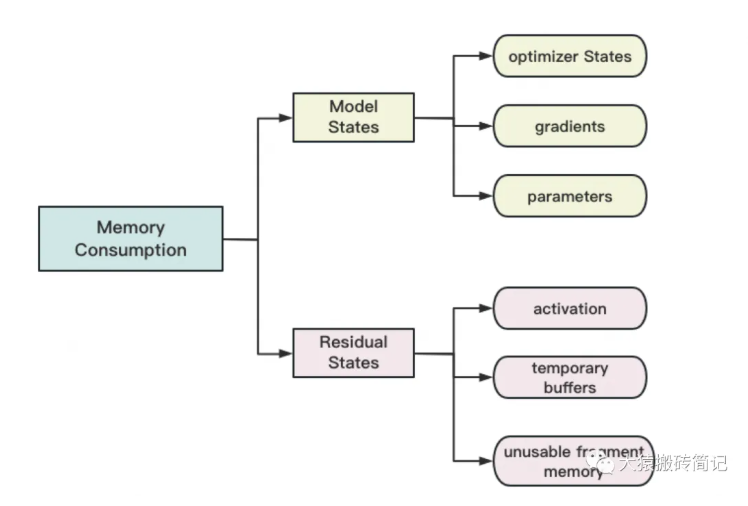
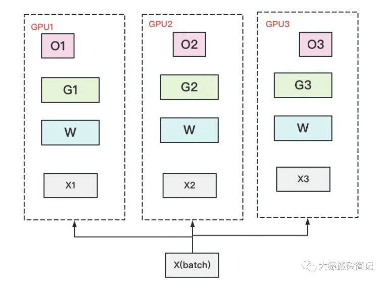
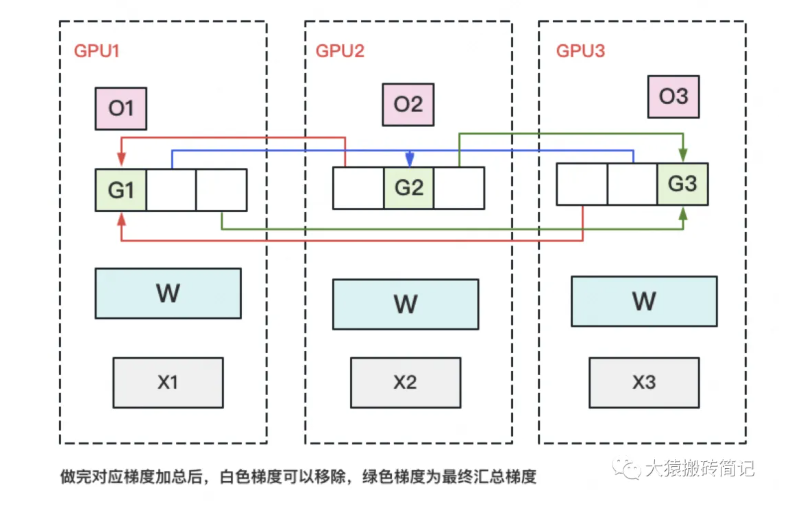
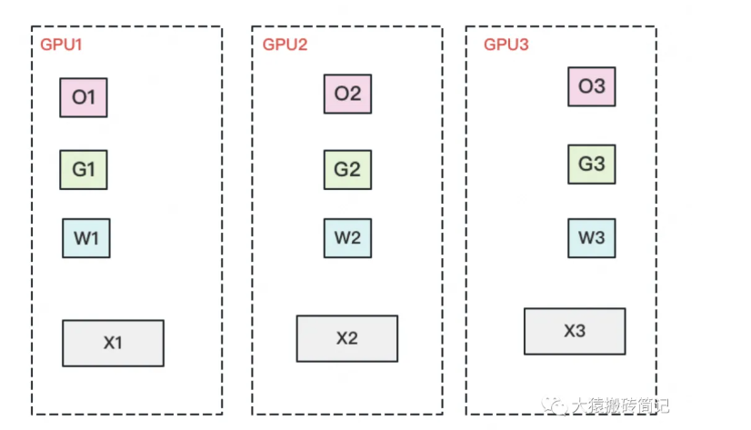
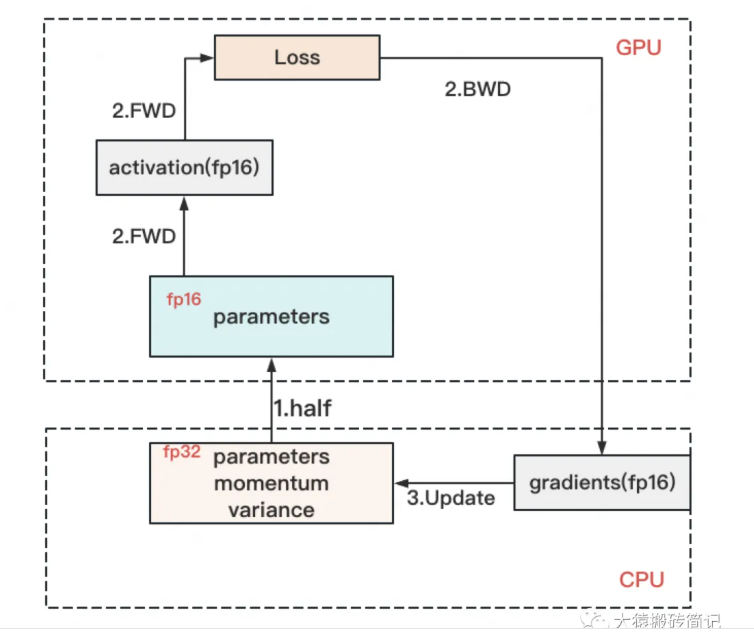

# DeepSpeed 实战

DeepSpeed 是微软开源的分布式训练优化库；DeepSeek 是模型家族，两者不是一回事。本篇对应本地资料中的“deepseeed”使用经验，按语义重点讲 **DeepSpeed**，DeepSeek 小模型示例见 [Unsloth 实战](./unsloth-practice.md)。

## 它解决什么问题

普通数据并行会让每张 GPU 各保存一份模型参数、梯度和优化器状态。以 Adam 混合精度训练粗略估算，每个参数可能需要：

- 2 字节的 FP16/BF16 参数；
- 2 字节梯度；
- 4 字节 FP32 主参数；
- 8 字节 Adam 一阶、二阶状态；
- 另加激活值、临时缓冲和碎片。

因此“7B × 2 字节约 14GB”远不是训练所需总显存。DeepSpeed ZeRO 的核心是把冗余训练状态分片到数据并行进程。



## ZeRO 三个阶段

| 阶段 | 分片内容 | 通信/复杂度 | 适合场景 |
| --- | --- | --- | --- |
| ZeRO-1 | 优化器状态 | 额外代价较低 | 模型能放下，但 Adam 状态太大 |
| ZeRO-2 | 优化器状态 + 梯度 | 通常是优先起点 | 大多数多卡 LoRA/全参训练 |
| ZeRO-3 | 再分片模型参数 | 通信更多、保存更复杂 | ZeRO-2 下模型仍放不进单卡 |







ZeRO-3 在某层计算前临时 all-gather 参数，算完后再释放或重新切分。它能省显存，但不必然更快。一个实用原则是：**先让 ZeRO-2 跑稳；只有仍然 OOM，才升 ZeRO-3；仍不够再 offload。**

## ZeRO-Offload

Offload 把优化器状态或参数搬到 CPU RAM，甚至 NVMe：



它节省 GPU 显存，却把压力转给主存容量、内存带宽、PCIe 和 SSD。能启动不代表有吞吐价值；必须对比 tokens/s、step time 与总训练成本。

## 安装和环境体检

推荐 Linux/WSL2 + NVIDIA NCCL 环境：

```bash
python -m pip install -U deepspeed
ds_report
# 等价命令
python -m deepspeed.env_report
```

`ds_report` 会显示 DeepSpeed 算子能否使用。系统 CUDA toolkit 与 PyTorch 编译所用 CUDA 主/次版本尽量一致。`DS_SKIP_CUDA_CHECK=1` 只是绕过检查，不是常规修复。

DeepSpeed 已提供原生 Windows 构建说明，但 NCCL、多机启动器、FlashAttention 和大模型训练教程仍以 Linux 为主。Windows 工作站优先用 WSL2 或 Linux 容器；若坚持原生 Windows，以 `ds_report` 和实际 smoke test 为准。

多机还要确保所有节点的：Python、PyTorch、CUDA、DeepSpeed、模型代码、自定义算子构建完全一致。建议把每个节点的 `ds_report` 随实验归档。

## 路线一：Transformers Trainer 接入

训练逻辑已经使用 Hugging Face Trainer 时，这是最省改动的入口。

### ZeRO-2 配置

保存为 `ds_zero2.json`：

```json
{
  "bf16": {"enabled": "auto"},
  "fp16": {"enabled": "auto"},
  "optimizer": {
    "type": "AdamW",
    "params": {
      "lr": "auto",
      "betas": "auto",
      "eps": "auto",
      "weight_decay": "auto"
    }
  },
  "scheduler": {
    "type": "WarmupDecayLR",
    "params": {
      "total_num_steps": "auto",
      "warmup_min_lr": "auto",
      "warmup_max_lr": "auto",
      "warmup_num_steps": "auto"
    }
  },
  "zero_optimization": {
    "stage": 2,
    "overlap_comm": true,
    "contiguous_gradients": true,
    "reduce_scatter": true,
    "reduce_bucket_size": 500000000,
    "allgather_bucket_size": 500000000
  },
  "gradient_accumulation_steps": "auto",
  "gradient_clipping": "auto",
  "train_micro_batch_size_per_gpu": "auto",
  "train_batch_size": "auto",
  "steps_per_print": 1000,
  "wall_clock_breakdown": false
}
```

与 Trainer 重复的 batch、累积、学习率和精度字段用 `"auto"`，避免两份配置悄悄不一致：

```python
from transformers import TrainingArguments

args = TrainingArguments(
    output_dir="outputs/run-zero2",
    per_device_train_batch_size=1,
    gradient_accumulation_steps=16,
    learning_rate=2e-4,
    bf16=True,
    gradient_checkpointing=True,
    deepspeed="ds_zero2.json",
    save_steps=200,
)
```

启动方式任选其一：

```bash
torchrun --nproc_per_node=4 train.py
deepspeed --num_gpus=4 train.py
accelerate launch --num_processes 4 train.py
```

### ZeRO-3 + CPU Offload

显存仍不足时再改为：

```json
{
  "bf16": {"enabled": "auto"},
  "zero_optimization": {
    "stage": 3,
    "offload_optimizer": {
      "device": "cpu",
      "pin_memory": true
    },
    "offload_param": {
      "device": "cpu",
      "pin_memory": true
    },
    "overlap_comm": true,
    "contiguous_gradients": true,
    "stage3_gather_16bit_weights_on_model_save": true,
    "stage3_prefetch_bucket_size": "auto",
    "stage3_param_persistence_threshold": "auto"
  },
  "gradient_accumulation_steps": "auto",
  "gradient_clipping": "auto",
  "train_micro_batch_size_per_gpu": "auto",
  "train_batch_size": "auto"
}
```

`stage3_gather_16bit_weights_on_model_save` 让 Trainer 保存可直接加载的 16-bit 权重，但会带来汇聚开销。不开时，目录主要是 ZeRO 分片，不能直接交给 `from_pretrained()`。

NVMe offload 还要指定设备与路径，例如：

```json
{
  "device": "nvme",
  "nvme_path": "/local_nvme/deepspeed",
  "pin_memory": true,
  "buffer_count": 5,
  "buffer_size": 100000000
}
```

路径应落在本机高速 NVMe，而不是网络盘或低速系统盘；训练前确认空间、写入寿命和 I/O 吞吐。

## 路线二：Accelerate 配置

`hello-agents` 使用 Accelerate 把同一训练代码切换到 DDP、ZeRO-2 或 ZeRO-3，这是一个很实用的模式。

一种简洁的 `accelerate-zero2.yaml`：

```yaml
compute_environment: LOCAL_MACHINE
distributed_type: DEEPSPEED
num_machines: 1
num_processes: 4
machine_rank: 0
gpu_ids: all
mixed_precision: bf16
deepspeed_config:
  zero_stage: 2
  gradient_accumulation_steps: 4
  gradient_clipping: 1.0
  offload_optimizer_device: none
  offload_param_device: none
  zero3_init_flag: false
```

```bash
accelerate launch --config_file accelerate-zero2.yaml train.py
```

Accelerate 有两种配置方式：

1. YAML 中直接写简单的 `deepspeed_config`；
2. YAML 只写 `deepspeed_config_file: ds_zero3.json`，复杂设置放 JSON。

选择第二种后，不要又在 YAML 重复 `zero_stage`、offload、累积步数等字段；当前 Accelerate 会把它们视为冲突。若 JSON 自己声明 optimizer/scheduler，原生 Accelerate 循环还需按官方说明配套使用 `DummyOptim` / `DummyScheduler`。

## 路线三：原生 DeepSpeed Engine

当项目不用 Trainer，核心调用关系是：

```text
initialize → engine(...) → engine.backward(loss) → engine.step()
```

保存为 `train_deepspeed.py`：

```python
import argparse
import torch
import deepspeed
from torch.utils.data import DataLoader, TensorDataset


class TinyLM(torch.nn.Module):
    def __init__(self, vocab_size=1024, hidden_size=256):
        super().__init__()
        self.embed = torch.nn.Embedding(vocab_size, hidden_size)
        self.head = torch.nn.Linear(hidden_size, vocab_size)

    def forward(self, input_ids, labels):
        logits = self.head(self.embed(input_ids))
        loss = torch.nn.functional.cross_entropy(
            logits.view(-1, logits.size(-1)), labels.view(-1)
        )
        return loss


def main():
    parser = argparse.ArgumentParser()
    parser.add_argument("--local_rank", type=int, default=-1)
    parser = deepspeed.add_config_arguments(parser)
    args = parser.parse_args()

    torch.manual_seed(42)
    x = torch.randint(0, 1024, (256, 64))
    y = torch.roll(x, shifts=-1, dims=1)
    loader = DataLoader(TensorDataset(x, y), batch_size=2, shuffle=True)

    model = TinyLM()
    trainable = [p for p in model.parameters() if p.requires_grad]
    engine, optimizer, _, scheduler = deepspeed.initialize(
        args=args,
        model=model,
        model_parameters=trainable,
    )

    engine.train()
    for epoch in range(2):
        for step, (input_ids, labels) in enumerate(loader):
            input_ids = input_ids.to(engine.device)
            labels = labels.to(engine.device)
            loss = engine(input_ids=input_ids, labels=labels)
            engine.backward(loss)
            engine.step()

            if engine.global_rank == 0 and step % 20 == 0:
                print(f"epoch={epoch} step={step} loss={loss.item():.4f}")

        # 必须所有 rank 都调用，不要放进 rank == 0 条件。
        engine.save_checkpoint(
            "checkpoints/tiny-lm",
            tag=f"epoch-{epoch}",
            client_state={"epoch": epoch + 1},
        )


if __name__ == "__main__":
    main()
```

配合前面的 `ds_zero2.json` 运行：

```bash
deepspeed --num_gpus=4 train_deepspeed.py --deepspeed --deepspeed_config ds_zero2.json
```

DeepSpeed 管理梯度累积时，每个 micro-batch 都正常调用 `engine.backward()` 和 `engine.step()`；只有到累积边界才真正更新。不要自己再按累积步数跳过 `step()`，否则会破坏 engine 的边界判断。

## Checkpoint：续训与部署是两件事

### 保存和恢复完整训练状态

```python
# 所有 rank 都必须执行
engine.save_checkpoint(
    "checkpoints/run-001",
    tag="step-1000",
    client_state={"epoch": 2, "data_cursor": 12345},
)

load_path, client_state = engine.load_checkpoint(
    "checkpoints/run-001",
    tag="step-1000",
    load_optimizer_states=True,
    load_lr_scheduler_states=True,
)
if load_path is None:
    raise RuntimeError("checkpoint 加载失败")
```

DeepSpeed 每个进程保存自己的分片，因此 `save_checkpoint()` 必须由所有 rank 调用；只让 rank 0 保存会在同步点卡住。真正续训要同时恢复 optimizer、scheduler、global step、数据游标和随机状态。

ZeRO-3 下不要在同一个已分片 engine 上刚保存完就直接加载。官方说明加载需要干净、未分片的模型；需要立即重载时重新初始化 engine。

### 导出普通 Hugging Face 权重

训练 checkpoint 是分片状态，不能直接用于 Transformers/vLLM。训练后可离线合并 FP32：

```bash
python checkpoints/run-001/zero_to_fp32.py \
  checkpoints/run-001 \
  exported/pytorch_model.bin
```

或在 Python 中：

```python
from deepspeed.utils.zero_to_fp32 import get_fp32_state_dict_from_zero_checkpoint

state_dict = get_fp32_state_dict_from_zero_checkpoint(
    "checkpoints/run-001",
    tag="step-1000",
)
model.load_state_dict(state_dict)
model.save_pretrained("exported/hf-model", safe_serialization=True)
tokenizer.save_pretrained("exported/hf-model")
```

合并可能需要约最终 checkpoint 两倍的 CPU RAM，并需要足够磁盘临时空间。导出后运行 `from_pretrained()` 和固定提示回归，才算得到可部署产物。

“换 GPU 数直接续训”也不能默认保证。DeepSpeed Universal Checkpoint 旨在支持 DP/TP/PP 拓扑变化，但官方仍标为持续开发能力，生产前必须演练目标拓扑的恢复。

## LoRA/QLoRA 与 DeepSpeed 怎么组合

它们优化不同维度：

- LoRA 减少可训练参数、梯度和优化器状态；
- QLoRA 压缩冻结基座权重；
- DeepSpeed 分摊剩余的参数、梯度、优化器状态，或把它们 offload。

小模型单卡 QLoRA 没必要为了“技术栈齐全”强上 ZeRO-3。多卡大模型 LoRA 常从 ZeRO-2 开始；当冻结基座仍放不下单卡时，ZeRO-3 才有意义。ZeRO-3 + 4-bit + Adapter 的保存、合并链路更复杂，必须先用小数据验证 checkpoint 和导出。

## 常见故障

- **启动了但显存没降**：检查启动日志里的 effective config、实际 ZeRO stage 与是否真的多进程。
- **配置重复且值不一致**：Trainer 字段用 `auto`，或者只保留一处真值。
- **保存时挂起**：通常是只有 rank 0 调了 `save_checkpoint()`。
- **`from_pretrained()` 找不到权重**：ZeRO-3 分片尚未汇聚，先生成 16-bit/FP32 权重。
- **CPU offload 反而很慢**：瓶颈已转移到 RAM/PCIe；比较 step time，不只看 GPU 显存。
- **NCCL timeout**：检查某一 rank 是否 OOM/异常、网络接口、节点版本、数据加载不对称和 barrier。
- **恢复后曲线跳变**：可能只加载了模型权重，没有恢复 optimizer/scheduler/数据游标。
- **阶段越高越慢**：这是正常可能性；ZeRO-3 的参数 all-gather 通信比 ZeRO-2 更多。

## 参考资料

- [DeepSpeed ZeRO-3 配置与 API](https://deepspeed.readthedocs.io/en/latest/zero3.html)
- [DeepSpeed Training API](https://deepspeed.readthedocs.io/en/stable/training.html)
- [DeepSpeed Checkpointing](https://deepspeed.readthedocs.io/en/stable/model-checkpointing.html)
- [DeepSpeed 安装与算子诊断](https://www.deepspeed.ai/tutorials/advanced-install/)
- [Transformers：DeepSpeed 集成](https://huggingface.co/docs/transformers/deepspeed)
- [Accelerate：DeepSpeed](https://huggingface.co/docs/accelerate/main/usage_guides/deepspeed)
- [PEFT + DeepSpeed](https://huggingface.co/docs/peft/main/accelerate/deepspeed)
