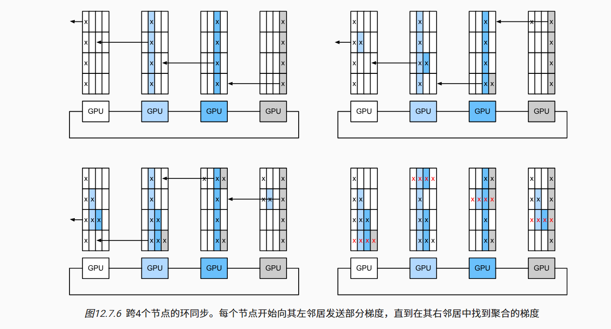
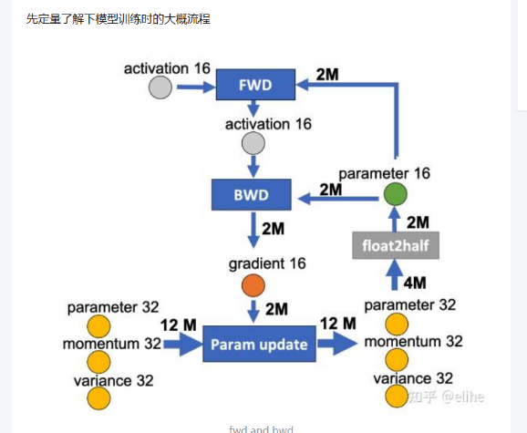
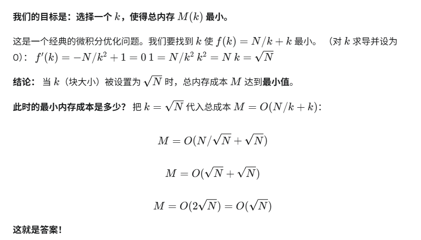

# 分布式训练

分布式训练的核心不是“多张卡一起跑”，而是决定**模型状态、计算和数据如何切分，以及何时通信**。不同并行策略解决的瓶颈不同。

## 先看通信原语

| 原语 | 作用 | 常见位置 |
| --- | --- | --- |
| Broadcast | 一个 rank 向所有 rank 发送同一数据 | 初始化参数、同步配置 |
| Scatter | 一份数据切开分给多个 rank | 分发输入或分片 |
| Gather / All-Gather | 收集到一个/所有 rank | 聚合输出、ZeRO-3 临时收集参数 |
| Reduce / All-Reduce | 聚合求和/均值到一个/所有 rank | DDP 同步梯度 |
| Reduce-Scatter | 聚合后把不同分片留给各 rank | ZeRO/FSDP 梯度分片 |
| Point-to-Point | 相邻 rank 发送/接收 | 流水线并行 stage 通信 |

Ring All-Reduce 将数据切成 $N$ 份，经过 reduce-scatter 和 all-gather 两阶段，让每个 rank 最终得到完整聚合结果：



它避免单个参数服务器成为中心瓶颈，但并没有消除通信。带宽、拓扑、消息分桶和计算通信重叠会直接影响多卡扩展效率。

## 数据并行：DP 与 DDP

### `DataParallel` 为什么不是首选

`torch.nn.DataParallel` 在单进程内把一个 batch 切到多卡，主卡负责聚合，Python 调度和主卡负担较重。PyTorch 官方长期推荐单机多卡也使用 `DistributedDataParallel`（DDP）。

### DDP 工作过程

1. 每张 GPU 对应一个进程，持有完整模型副本；
2. `DistributedSampler` 给每个 rank 不同的数据；
3. 每个进程独立前向、反向；
4. DDP 的 autograd hook 按 bucket 异步 all-reduce 梯度；
5. 每个进程用相同聚合梯度更新，因此参数继续保持一致。

DDP 分摊计算与数据，**不分摊模型、梯度和优化器状态**。模型单卡放不下时，要转向 FSDP/ZeRO、张量并行或流水线并行。

## 可运行的 DDP 示例

保存为 `train_ddp.py`：

```python
import os
import torch
import torch.distributed as dist
from torch.nn.parallel import DistributedDataParallel as DDP
from torch.utils.data import DataLoader, DistributedSampler, TensorDataset


def main():
    dist.init_process_group(backend="nccl")
    local_rank = int(os.environ["LOCAL_RANK"])
    torch.cuda.set_device(local_rank)
    device = torch.device("cuda", local_rank)

    torch.manual_seed(42)
    x = torch.randn(4096, 128)
    y = x.sum(dim=1, keepdim=True)
    dataset = TensorDataset(x, y)
    sampler = DistributedSampler(dataset, shuffle=True)
    loader = DataLoader(
        dataset,
        batch_size=32,
        sampler=sampler,
        pin_memory=True,
        num_workers=2,
    )

    model = torch.nn.Sequential(
        torch.nn.Linear(128, 256),
        torch.nn.GELU(),
        torch.nn.Linear(256, 1),
    ).to(device)
    model = DDP(model, device_ids=[local_rank])
    optimizer = torch.optim.AdamW(model.parameters(), lr=1e-3)

    for epoch in range(3):
        sampler.set_epoch(epoch)  # 否则每轮 shuffle 顺序相同
        model.train()
        for features, labels in loader:
            features = features.to(device, non_blocking=True)
            labels = labels.to(device, non_blocking=True)

            optimizer.zero_grad(set_to_none=True)
            prediction = model(features)
            loss = torch.nn.functional.mse_loss(prediction, labels)
            loss.backward()
            optimizer.step()

        if dist.get_rank() == 0:
            print(f"epoch={epoch} loss={loss.item():.6f}")

    # 只有普通模型文件需要 rank 0 保存；DDP 参数在各 rank 相同。
    if dist.get_rank() == 0:
        torch.save(model.module.state_dict(), "ddp-model.pt")

    dist.destroy_process_group()


if __name__ == "__main__":
    main()
```

```bash
torchrun --standalone --nproc_per_node=4 train_ddp.py
```

注意这里的 rank-0 保存规则仅适用于普通 DDP state dict；DeepSpeed 分片 checkpoint 必须所有 rank 参与。

## 有效 batch 和学习率

数据并行下：

$$
B_{\text{effective}}
=B_{\text{micro}}\times N_{\text{DP}}\times N_{\text{accumulation}}
$$

把单卡改成 8 卡，如果保持每卡 batch 与累积步数不变，有效 batch 会扩大 8 倍，优化轨迹也会变化。不要把由 batch 改变带来的差异误判为“多卡算法效果”。

学习率是否线性缩放没有万能答案；预训练大 batch 常采用 scaling rule，微调小数据更应保守，用验证集比较并记录 warmup。

## 混合精度训练



- FP16 范围较窄，通常需要 loss scaling 防止梯度下溢；
- BF16 指数范围与 FP32 接近，支持它的现代 GPU 上通常更稳；
- 优化器主状态常保留 FP32；
- 混合精度是否加速取决于 GPU 架构、算子和形状。

原生 PyTorch 自动混合精度：

```python
scaler = torch.amp.GradScaler("cuda")

for inputs, labels in loader:
    optimizer.zero_grad(set_to_none=True)
    with torch.autocast(device_type="cuda", dtype=torch.float16):
        logits = model(inputs)
        loss = criterion(logits, labels)

    scaler.scale(loss).backward()
    scaler.unscale_(optimizer)
    torch.nn.utils.clip_grad_norm_(model.parameters(), 1.0)
    scaler.step(optimizer)
    scaler.update()
```

BF16 通常不需要 GradScaler，但要先确认硬件支持：`torch.cuda.is_bf16_supported()`。

## 梯度检查点

普通反向传播保存大量中间激活；梯度检查点只保存部分边界，反向时重新执行缺失的前向：



它是“用算力换显存”，主要减少激活显存，不减少参数或优化器状态。长序列训练中收益明显，但 step time 会增加。Transformer 训练常同时设置：

```python
model.gradient_checkpointing_enable()
model.config.use_cache = False
```

`use_cache=False` 是因为训练时 KV cache 与梯度检查点通常冲突；推理时再打开。

## FSDP：在 PyTorch 内部分片模型状态

Fully Sharded Data Parallel（FSDP）与 ZeRO-3 思想接近：将参数、梯度和优化器状态分片，需要计算某层时收集参数。它更贴近 PyTorch 原生生态。

选择 FSDP 需要重点设计：

- auto-wrap policy：以 Transformer block 为边界包装，避免粒度过细；
- sharding strategy：全分片、梯度+优化器分片或 hybrid sharding；
- mixed precision：参数、reduce、buffer 的 dtype；
- activation checkpointing：与 FSDP wrap 的顺序；
- state dict 类型：full、sharded 或 distributed checkpoint；
- CPU offload：省显存但可能显著降低吞吐。

用 Accelerate 启动比手写完整包装更适合一般项目：

```bash
accelerate config
accelerate launch train.py
```

生产前必须演练“保存 → 新进程加载 → 推理/续训”，不能等长训练结束才第一次测试分片 checkpoint。

## 张量并行

张量并行（TP）把一个算子的矩阵乘分到多张卡，例如列并行或行并行线性层。每一层都会产生通信，适合模型单层/完整参数无法放入单卡、且 GPU 间高速互联的场景。

Transformer 常见切法：

- attention 头按 GPU 切分；
- MLP 中间维度切分；
- embedding / LM head 按词表维度切分；
- 通过 all-reduce 或 reduce-scatter 合并结果。

TP 对拓扑敏感，通常优先放在同一节点的 NVLink/NVSwitch 域；跨慢速网络盲目扩大 TP 会让通信淹没计算。

## 流水线并行

流水线并行（PP）把连续网络层分成 stages，把 mini-batch 切成 micro-batches 在流水线中流动。它减少每卡持有的层数，但有 pipeline bubble：某些 stage 等待输入或梯度时处于空闲。

| 调度 | 特点 |
| --- | --- |
| GPipe | 所有 micro-batch 先前向再反向，简单但激活占用较高 |
| 1F1B / PipeDream 类 | 稳态交替一次前向、一次反向，减少 bubble/激活 |

stage 切分要按计算量和激活通信平衡，不能简单平均分层数。Embedding、MoE、不同宽度 block 可能让相同层数的耗时差异很大。

## 组合并行

超大模型通常使用 3D/4D 并行：

```text
数据并行 DP × 张量并行 TP × 流水线并行 PP × 专家并行 EP
```

例如 64 张 GPU 可组成 `DP=8 × TP=4 × PP=2`。并行度乘积要等于 world size，但“数学上能整除”不等于性能好；还要让高频通信尽量留在高速互联域。

## Accelerate：统一启动入口

训练代码使用 `Accelerator` 后，可在不改主体逻辑的情况下切换单卡、DDP、FSDP 和 DeepSpeed：

```python
from accelerate import Accelerator

accelerator = Accelerator(gradient_accumulation_steps=4)
model, optimizer, loader, scheduler = accelerator.prepare(
    model, optimizer, loader, scheduler
)

for batch in loader:
    with accelerator.accumulate(model):
        loss = model(**batch).loss
        accelerator.backward(loss)
        optimizer.step()
        scheduler.step()
        optimizer.zero_grad(set_to_none=True)

accelerator.wait_for_everyone()
unwrapped = accelerator.unwrap_model(model)
unwrapped.save_pretrained(
    "outputs/model",
    is_main_process=accelerator.is_main_process,
    save_function=accelerator.save,
)
```

分布式训练时避免直接使用全局 `print()`、手写 `.cuda()` 和只在单进程正确的随机采样。用 `accelerator.print()`、`accelerator.device`、`gather_for_metrics()` 等封装。

## 多卡调试清单

### 正确性

- 每个 epoch 调用 `DistributedSampler.set_epoch(epoch)`；
- 只让主进程写普通日志和最终文件，但分片 checkpoint 遵守框架要求；
- 验证指标先跨 rank 聚合，避免只计算 rank 0 的数据；
- 随机种子要考虑 rank，同时保证需要一致的初始化保持一致；
- 数据长度不能让某些 rank 提前退出，导致其余 rank 卡在 collective。

### 性能

- 同时记录单卡和多卡 tokens/s、step time、scaling efficiency；
- 用 profiler 区分数据加载、计算、通信和同步等待；
- 检查 GPU 利用率、网络带宽、CPU 解码和存储吞吐；
- 调整梯度 bucket、micro-batch、累积与 sequence packing；
- 避免每步 `.item()`、打印或同步保存引入全局同步。

### OOM

依次处理：异常长样本 → 序列长度 → micro-batch → 梯度检查点 → 混合精度 → QLoRA → ZeRO/FSDP → offload。发生 OOM 的 rank 常会先退出，其他 rank 最终只显示 NCCL timeout；要回看所有 rank 最早的错误。

## 容器和共享内存

GPU 容器至少确认 NVIDIA Container Toolkit 和 GPU 可见性。多进程 DataLoader/NCCL 还可能受共享内存限制：

```bash
docker run --rm --gpus all --shm-size=8g \
  -v "$PWD:/workspace" -w /workspace \
  pytorch/pytorch:latest \
  python -c "import torch; print(torch.cuda.get_device_name(0))"
```

生产项目不要长期追随 `latest`；验证后固定镜像 digest 或明确 tag，并保存驱动与主机 GPU 信息。

## 参考资料

- [PyTorch：DistributedDataParallel](https://docs.pytorch.org/docs/stable/generated/torch.nn.parallel.DistributedDataParallel.html)
- [PyTorch：FSDP](https://docs.pytorch.org/docs/stable/fsdp.html)
- [PyTorch：Distributed Overview](https://docs.pytorch.org/tutorials/beginner/dist_overview.html)
- [Hugging Face Accelerate](https://huggingface.co/docs/accelerate/index)
- [DeepSpeed ZeRO](https://deepspeed.readthedocs.io/en/latest/zero3.html)
- 本地 `knowledge-center` 的分布式训练、DeepSpeed、FSDP 与注意事项笔记
