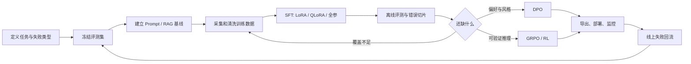

# 模型训练

模型训练不是“准备一份数据，跑一次 Trainer”这么简单。本专题把三个仓库中互相补充的内容合并成一条工程路线：先判断是否真的需要训练，再建立冻结评测集和数据协议，最后选择 LoRA、QLoRA、全参数微调或分布式训练，并把产物可靠地导出和部署。

## 先做正确的技术选择

| 需求 | 首选方法 | 原因 |
| --- | --- | --- |
| 改变回答格式、语气、工作流或特定行为 | SFT / LoRA | 这些是模型的行为模式 |
| 注入经常变化、必须可追溯的事实 | RAG | 知识可更新、可引用，不必重训 |
| 让模型偏好更好的答案 | DPO 等偏好优化 | 直接学习 chosen / rejected 的相对偏好 |
| 提升数学、代码等可验证任务的策略 | GRPO 等在线强化学习 | 奖励函数可以自动判定结果 |
| 只需要少量示例就能完成 | Prompt / Few-shot | 成本最低，应先验证上限 |

一个稳妥的升级顺序是：

```text
Prompt 基线 → RAG / 工具 → LoRA SFT → 偏好优化 → 全参数或大规模分布式训练
```

训练不能替代检索。把产品手册、价格、政策等时效知识硬塞进参数，既难更新，也无法可靠给出来源。反过来，要求固定 JSON 协议、稳定调用工具、形成特定推理习惯时，只堆检索文档通常也不够。

## 完整工程闭环



训练之前先冻结测试集。训练、选 checkpoint、调 Prompt 和规则时都不能把测试样本“回灌”进训练集；否则得到的是对评测集的记忆，而不是可泛化的能力。

## 本专题怎么读

1. [微调基础与数据工程](./fine-tuning-foundations.md)：SFT、偏好优化、数据格式、评测和嵌入模型训练。
2. [LoRA 与 QLoRA](./lora-qlora.md)：原理、选参、显存构成，以及 Hugging Face PEFT + TRL 的可运行代码。
3. [Unsloth 实战](./unsloth-practice.md)：单卡/小显存快速 QLoRA、训练、推理与导出。
4. [DeepSpeed 实战](./deepspeed-practice.md)：ZeRO-1/2/3、Offload、配置、启动和断点续训。
5. [分布式训练](./distributed-training.md)：DDP、FSDP、张量并行、流水线并行、混合精度与通信。
6. [后训练工程实战](./post-training-engineering.md)：从真实 Agent 项目提炼 SFT、Best-of-N、DPO、规则评测和重排经验。
7. [量化、合并与导出](./quantization-and-export.md)：分清训练量化与推理量化，正确处理 Adapter、合并权重和 GGUF。
8. [大模型微调](./large-model-fine-tuning-course.mdx)：尚硅谷 V1.1 的 29 页 PDF 原课件，带目录定位。

## 三个仓库分别贡献了什么

| 来源 | 保留的精华 | 在本专题中的位置 |
| --- | --- | --- |
| `knowledge-center` | 通信原语、混合精度、梯度检查点、DDP/FSDP、DeepSpeed ZeRO、Offload、checkpoint、量化 | DeepSpeed、分布式训练、量化 |
| `hello-agents` | LoRA/SFT/GRPO 示例、Accelerate 配置，以及旅行助手的多阶段后训练复盘 | LoRA、后训练工程、分布式启动 |
| `all-in-rag` | Prompt/RAG/微调的选择边界，Embedding 的对比学习与领域微调 | 本页、微调基础 |

文中的版本易变 API 以 Hugging Face PEFT/TRL、Unsloth、DeepSpeed 和 PyTorch 官方文档重新核对；仓库里的固定版本号和经验参数只作为历史实验参考，不当成通用结论。

## 一组必须持续记录的指标

不要只保存最终 loss。至少记录：

- 数据版本、去重规则、训练/验证/测试切分和随机种子；
- 基座模型、tokenizer、chat template、最大长度和截断率；
- 可训练参数比例、峰值显存、tokens/s、总 GPU-hours；
- 学习率、有效 batch、warmup、梯度裁剪和 checkpoint；
- 任务成功率、格式通过率、事实正确率、预算/安全约束通过率；
- 模型、Adapter、量化方式、推理引擎之间的兼容关系。

只有这些信息齐全，一次训练才是可复现的工程实验，而不是一个无法解释的模型目录。
