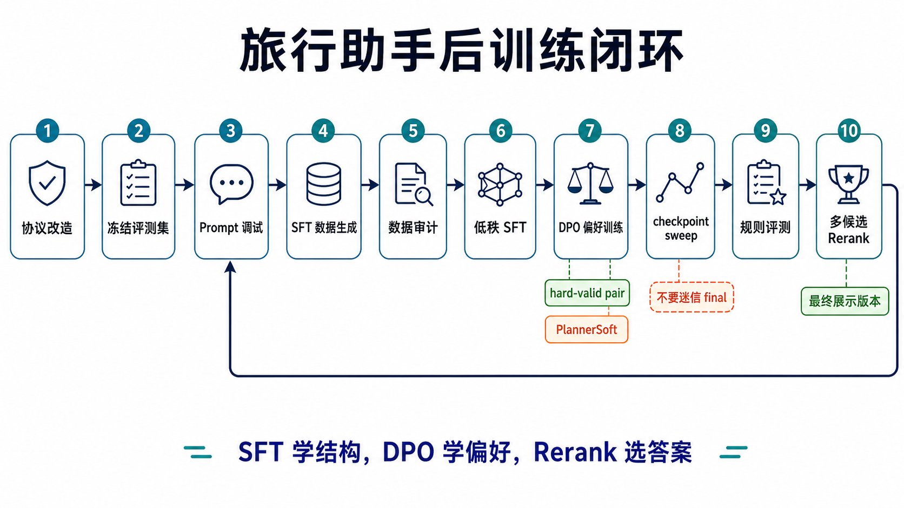
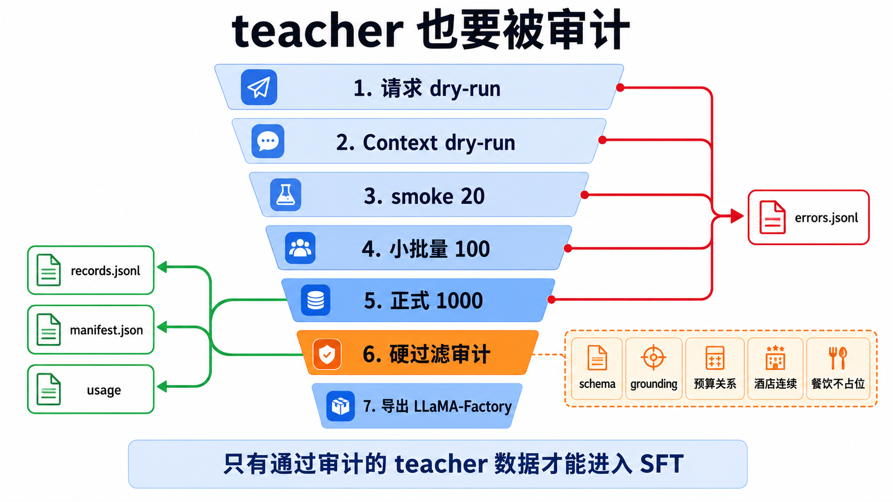
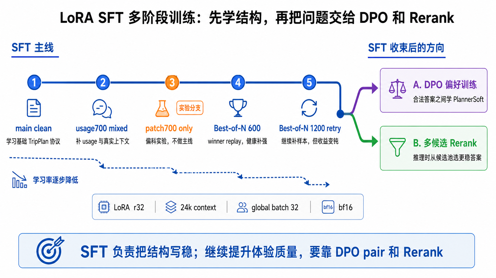
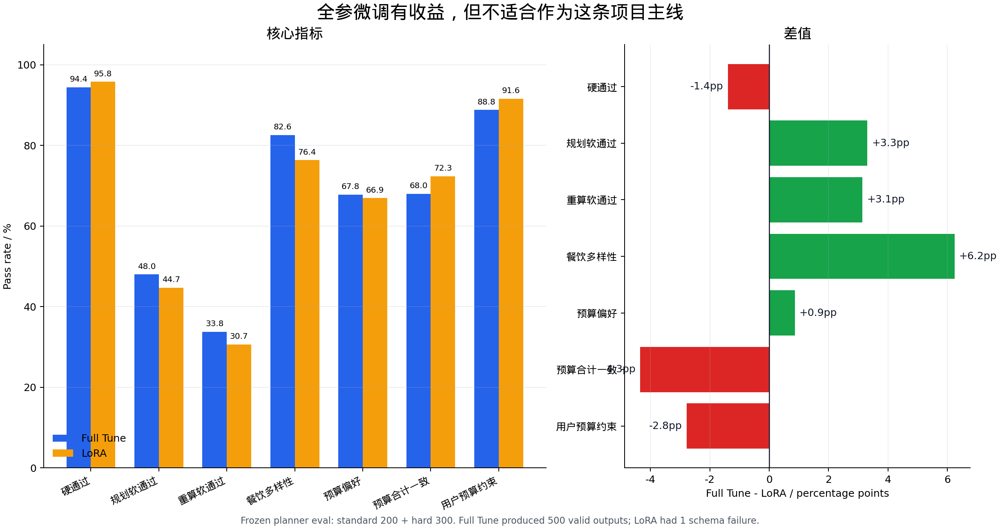
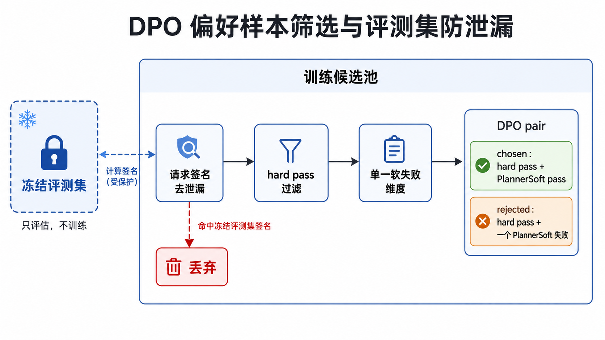
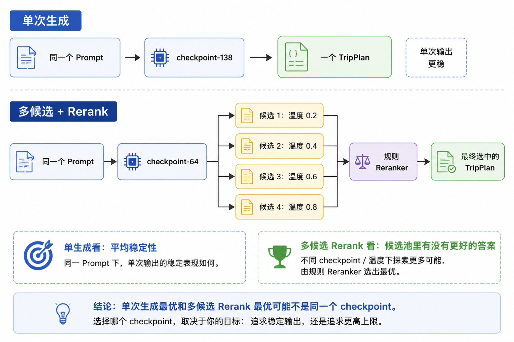

# 后训练工程实战

`hello-agents` 的旅行助手实验最有价值的地方，不是某个超参数，而是展示了一个真实产品如何把 Prompt、SFT、DPO、规则和推理时重排连成闭环。

一句话路线：**Prompt 固定协议，SFT 学会结构，DPO 学合法答案之间的偏好，Rerank 从候选池选出最稳结果。**



## 第一步：先定义产品协议

训练前先把输出变成稳定、可验证的数据结构。旅行计划不只是自然语言，还要包含：

- 日期、城市、景点、餐饮、酒店与交通；
- 各项预算、总预算和币种；
- 约束与用户偏好；
- 工具调用和信息来源；
- 无法满足时的明确降级策略。

如果 schema 每周变化，模型会学到互相冲突的目标。应先用 JSON Schema/Pydantic 等锁定协议，再写确定性校验器：

```python
from pydantic import BaseModel, Field, model_validator


class Cost(BaseModel):
    hotel: float = Field(ge=0)
    food: float = Field(ge=0)
    transport: float = Field(ge=0)
    tickets: float = Field(ge=0)
    total: float = Field(ge=0)

    @model_validator(mode="after")
    def total_must_match(self):
        computed = self.hotel + self.food + self.transport + self.tickets
        if abs(computed - self.total) > 0.01:
            raise ValueError(f"预算合计错误：字段和={computed}，total={self.total}")
        return self


class TripPlan(BaseModel):
    city: str
    days: list[dict]
    cost: Cost
```

能用程序验证的约束，不要全交给模型 Judge。规则更快、更稳定，也能直接指出错误位置。

## 第二步：冻结评测集

在生成训练数据之前就固定评测提示、规则和指标，至少保留：

- 常规请求；
- 预算极紧、天数较长、多人出行等 hard split；
- 真实线上失败；
- 输入缺失或约束冲突；
- 与训练数据同领域但不同实体的泛化题。

每条样本生成稳定签名，例如对规范化 prompt 做 SHA-256，在所有训练数据导入前检查重叠：

```python
import hashlib
import json


def signature(prompt: dict) -> str:
    canonical = json.dumps(prompt, ensure_ascii=False, sort_keys=True, separators=(",", ":"))
    return hashlib.sha256(canonical.encode("utf-8")).hexdigest()


eval_signatures = {signature(item["prompt"]) for item in eval_set}
train_signatures = {signature(item["prompt"]) for item in train_set}
overlap = eval_signatures & train_signatures
assert not overlap, f"评测泄漏：{len(overlap)} 条"
```

该实验最终确认 `selected_eval_signature_overlap = 0`。比“我应该没有混进去”可靠得多。

## 第三步：建立 Prompt 基线

Prompt 调试不是浪费时间，而是在确认边界：

- 仅凭协议和 few-shot，模型能到什么水平；
- 哪些问题能用确定性后处理修掉；
- 哪些是知识缺失，应交给检索/工具；
- 哪些是反复出现的行为错误，才值得进入训练。

若 Prompt + 工具已经达到目标，就没有必要为了“拥有微调模型”增加训练和维护成本。

## 第四步：生成并审计 SFT 数据



教师模型生成的数据至少经过四层：

1. schema 解析与必填字段；
2. 预算合计、晚数、天数、日期等确定性规则；
3. grounding：酒店/景点/交通是否来自工具候选；
4. 多样性与偏好：餐饮重复、景点重复、节奏和预算档位。

只保留通过规则的样本会让数据过于简单，也可能丢掉有价值的 hard case。更好的做法是保存原始候选、每条规则的分数和失败原因，用于后续：

- SFT clean 数据；
- 修复型 patch 数据；
- DPO chosen/rejected 对；
- 错误切片和回归集。

## 第五步：多阶段 LoRA SFT



该项目没有把所有数据混成一锅，而是按目标逐步训练：

| 阶段 | 起点 | 数据 | 实验学习率 | 目的 |
| --- | --- | --- | --- | --- |
| Main Clean | Qwen2.5-7B-Instruct | 干净主数据 | `6e-5` / `8e-5`，4 epochs | 学稳 TripPlan 协议 |
| usage700 | Main adapter | 主数据 + 真实预算混合 | `2e-5`，1 epoch | 改善预算使用 |
| patch700 | Main adapter | 预算利用补丁 | `1e-5`，2 epochs | 验证针对性补数上限 |
| Best-of-N 600/1200 | usage/前一阶段 adapter | replay + 规则选出的 winner | `1e-5`，半轮保存 | 把更好的候选回放给 SFT |
| DPO closing | 选定 SFT/DPO checkpoint | 高质量偏好对 | `1e-6`～`1.5e-6` 量级 | 小幅修正合法候选偏好 |

这些数值是该项目在特定模型、有效 batch 和数据上的实验记录，不是通用推荐。可迁移的规律是：

- 主阶段学协议，可以相对积极；
- patch 阶段数据窄，学习率应更小；
- DPO 已在较好策略上做偏好移动，通常更保守；
- 每一阶段都从多个 checkpoint 评测，不能默认 final 最好。

### Warm start 不等于 resume

从上阶段 Adapter 开始下一阶段是**权重 warm start**。若没有加载 optimizer、scheduler、global step 和 RNG，它不是无缝断点续训。二者都合理，但实验记录必须说清楚。

## 全参 SFT 为什么不是默认答案



该项目也做过全参数 SFT：约使用 6×40GB GPU、训练约 7 小时，产物约 28GB。全参确实改善了部分 planner soft 指标，但关键 hard budget 没有同步变好，且训练、存储、评测和回滚的迭代速度明显下降。

这不是“全参不如 LoRA”的普遍结论，而是一个重要工程判断：如果瓶颈在数据清洗、规则、bad case 和候选选择，增加可训练参数不会自动消除瓶颈。

## 第六步：Best-of-N Replay

Best-of-N Replay 是**训练数据构造**：对同一上下文采样多个答案，用规则评估器选 winner，再把 winner 加入下一轮 SFT。

```python
from dataclasses import dataclass
from typing import Callable


@dataclass
class ScoredCandidate:
    text: str
    hard_pass: bool
    planner_soft: float
    budget_score: float
    diversity_score: float


def choose_winner(candidates: list[ScoredCandidate]) -> ScoredCandidate | None:
    legal = [c for c in candidates if c.hard_pass]
    if not legal:
        return None
    return max(
        legal,
        key=lambda c: (
            c.planner_soft,
            c.budget_score,
            c.diversity_score,
        ),
    )


def best_of_n_replay(
    prompt: str,
    generate: Callable[[str, int], list[str]],
    evaluate: Callable[[str], ScoredCandidate],
    n: int = 4,
) -> dict | None:
    candidates = [evaluate(text) for text in generate(prompt, n)]
    winner = choose_winner(candidates)
    if winner is None:
        return None
    return {"prompt": prompt, "response": winner.text}
```

规则优先级非常重要：先过 JSON、预算、日期等 hard gate，再比较 soft score。否则一个文笔流畅但预算算错的回答可能胜出。

## 第七步：DPO 只学真正的偏好



无效 pair：合法 JSON 对非法 JSON。它主要教格式，而不是“哪份旅行计划更好”。

更有价值的 pair：chosen 和 rejected 都通过 schema 与 hard rules，但在预算利用、重复、grounding、节奏或偏好满足上有明确差异。

构造原则：

```text
同一个 prompt 的多候选
  → 先过滤 schema/hardpass
  → chosen：planner soft 更优
  → rejected：仍合法，但存在明确软质量差距
  → 去除差距不显著、只靠长度可区分的 pair
  → 检查与冻结评测集签名无重叠
```

不要跨不同 DPO 数据批次直接比较 loss。容易区分的 pair 会有很低 loss；后期两个候选都很好，只差预算贴合时，loss 更高并不代表模型更差。更应关注 reward accuracy 的走势，以及冻结评测集的业务指标。

## 第八步：推理时多候选 Rerank

Rerank 是**线上推理策略**：生成 N 个候选，在不改模型参数的情况下选最优答案。它与 Best-of-N Replay 的差别是：

| 方法 | 发生时间 | 结果去向 |
| --- | --- | --- |
| Best-of-N Replay | 构造下一轮训练数据时 | winner 写入 SFT 数据 |
| Rerank | 用户请求的推理时 | winner 直接返回用户 |



该实验的最终版本在 500 条冻结评测、项目自定义规则口径下，用 4 候选重排得到：hardpass `99.4%`、planner soft `80.6%`、重算预算 soft `68.2%`。这是该数据集和规则下的项目结果，不代表对其他旅行数据或模型的通用水平。

重要观察是：后期 DPO checkpoint 的**单次生成**未必继续提升，但候选池质量变好，Rerank 后反而得到最佳结果。评估生成模型时，应把“单次稳定性”和“候选上限”分开。

### 一个可执行的重排器

```python
def rerank(candidates: list[dict]) -> dict:
    """candidate 需由解析器补齐 rule_scores，禁止直接信任模型自报分数。"""
    legal = [c for c in candidates if c["rule_scores"]["hard_pass"]]
    pool = legal or candidates

    def score(c: dict) -> tuple[float, float, float, float]:
        r = c["rule_scores"]
        return (
            float(r["hard_pass"]),
            r["planner_soft"],
            r["budget_fit"],
            r["diversity"],
        )

    return max(pool, key=score)
```

线上 N 越大，延迟和 token 成本近似增长。应比较 `N=1/2/4/8` 的收益曲线，并设置超时、并发和降级策略。

## 三类最值钱的 bad case

### 预算合计错误

模型给出的分项合理，总数却加错。这类问题优先用程序重算和硬门槛，而不是只追加提示词。

### 餐饮与景点重复

文本看起来丰富，却反复安排同一餐厅/同类景点。把实体归一化、同族去重和工具 grounding 纳入规则与重排分数。

### 酒店晚数错误

行程天数不等于住宿晚数，跨午夜交通还会改变计算。由日期程序计算约束，并让模型只负责解释和选择。

这些错误说明一个原则：**能结构化的先结构化，能规则验证的先验证，剩下难以显式表达的偏好再交给训练。**

## 可迁移的方法论

1. 先把任务变成可验证协议，再训练。
2. 冻结评测和防泄漏必须早于数据生成。
3. 教师数据也要过规则、事实和多样性审计。
4. 多阶段数据混合与学习率应对应明确目标。
5. Adapter warm start 与完整 resume 必须区分。
6. 全参、LoRA 的选择要看迭代效率和关键指标，不看名义能力。
7. Best-of-N Replay 负责造数据，Rerank 负责线上选答案。
8. DPO 只在都合法的候选之间学偏好。
9. checkpoint 要逐个评测，final 不天然最好。
10. 指标拆开看，不把 hardpass、偏好、预算和事实揉成无法解释的总分。

## 参考资料

- 本地 `hello-agents/Extra-Chapter/Extra12-旅行助手后训练实战.md` 及其原始实验图
- [TRL：SFT Trainer](https://huggingface.co/docs/trl/main/sft_trainer)
- [TRL：DPO Trainer](https://huggingface.co/docs/trl/main/dpo_trainer)
- [Direct Preference Optimization](https://arxiv.org/abs/2305.18290)
