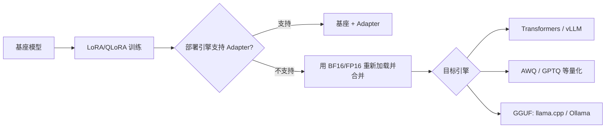

# 量化、合并与导出

量化不是一个单一开关。训练时用 4-bit 基座、训练后压缩权重、推理时使用低精度 KV cache，解决的是不同问题。先分清目标，才能选择工具。

## 数值映射的基本思想

把浮点值 $x$ 映射到整数 $q$，常见仿射量化为：

$$
q=\operatorname{clip}\left(\operatorname{round}\left(\frac{x}{s}\right)+z,q_{\min},q_{\max}\right)
$$

反量化近似恢复：

$$
\hat{x}=s(q-z)
$$

$s$ 是 scale，$z$ 是 zero point。量化必然引入舍入和截断误差；位宽越低，对异常值、校准数据和量化粒度越敏感。

常见粒度：

- per-tensor：整个张量一组 scale，简单但容易受异常通道影响；
- per-channel：每个输出通道一组 scale，精度通常更好；
- per-group：每组权重共享 scale，是 4-bit LLM 常见折中；
- 对称/非对称：是否需要 zero point，取决于分布与内核。

## 四类容易混淆的量化

| 名称 | 何时发生 | 是否训练基座 | 主要目的 |
| --- | --- | --- | --- |
| PTQ | 模型训练完成后 | 否 | 降低推理显存/存储、提升吞吐 |
| 动态量化 | 推理运行时动态统计部分激活 | 否 | CPU 线性/RNN 等场景易用 |
| 静态量化 | 用校准集预先确定激活范围 | 否 | 更稳定的整数推理，需要代表性校准集 |
| QAT | 训练中模拟量化误差 | 是 | 低位宽下恢复精度，训练成本更高 |
| QLoRA | 4-bit 冻结基座上训练 LoRA | 只训练 Adapter | 降低微调显存，不等于最终推理格式 |

尤其要记住：**QLoRA 训练得到的 Adapter 不是一个可直接部署的 4-bit 完整模型。** 最终可以继续以基座+Adapter 服务、合并为 BF16/FP16，或再用 AWQ/GPTQ/GGUF 等推理方案量化。

## PTQ、校准与误差修正

静态 PTQ 用一小批代表性数据统计激活/权重范围。校准数据不需要标签，但分布应覆盖真实输入的语言、长度和任务。如果全是短英文，部署却面对长中文对话，校准结果很可能失真。

低位宽常见修正思路：

- clipping：不让少量异常值撑大整个量化范围；
- per-channel/per-group：缩小共享 scale 的范围；
- bias correction：补偿量化前后输出均值偏移；
- AdaRound 类方法：学习更优的舍入方向，而非机械四舍五入；
- 混合精度：保留敏感层、embedding、LM head 或少数通道为高精度。

这些方法会改变速度、精度和内核兼容性，必须在最终推理引擎上测，而不是只比较模型文件大小。

## 从 Adapter 到部署产物



### 方案 A：基座 + Adapter

优点：产物小，可以为多个租户动态切换；缺点：引擎需支持 LoRA，且基座 revision 必须一致。

```python
from peft import PeftModel
from transformers import AutoModelForCausalLM, AutoTokenizer

base_id = "Qwen/Qwen2.5-0.5B-Instruct"
adapter_dir = "outputs/my-adapter"

base = AutoModelForCausalLM.from_pretrained(base_id, device_map="auto")
model = PeftModel.from_pretrained(base, adapter_dir)
tokenizer = AutoTokenizer.from_pretrained(adapter_dir)
```

### 方案 B：合并完整权重

```python
import torch
from peft import AutoPeftModelForCausalLM
from transformers import AutoTokenizer

adapter_dir = "outputs/my-adapter"
output_dir = "outputs/my-merged-bf16"

model = AutoPeftModelForCausalLM.from_pretrained(
    adapter_dir,
    dtype=torch.bfloat16,
    device_map="cpu",
    low_cpu_mem_usage=True,
)
model = model.merge_and_unload()
model.save_pretrained(output_dir, safe_serialization=True, max_shard_size="4GB")
AutoTokenizer.from_pretrained(adapter_dir).save_pretrained(output_dir)
```

不要直接在 bitsandbytes 4-bit 容器上随意合并后就宣称得到“无损 4-bit 模型”。稳妥流程是用足够 CPU RAM 以 BF16/FP16 加载基座和 Adapter、合并、验证，再按目标引擎单独量化。

### 方案 C：Unsloth 导出 GGUF

```python
model.save_pretrained_gguf(
    "outputs/my-model-gguf",
    tokenizer,
    quantization_method="q4_k_m",
)
```

GGUF 中的 `Q4_K_M` 等类型是 llama.cpp 生态的权重分块量化方案，不等同于 bitsandbytes NF4。相同“4-bit”标签下，格式、内核、精度和兼容性都可能不同。

## 推理量化选择

| 路线 | 常见引擎 | 优点 | 注意事项 |
| --- | --- | --- | --- |
| BF16/FP16 | Transformers、vLLM、SGLang | 行为最接近训练产物，兼容最好 | 显存较高 |
| bitsandbytes 8/4-bit | Transformers | 加载简单，适合实验 | 服务吞吐未必最佳，后端依赖明显 |
| AWQ | vLLM 等 | 常用于 GPU INT4 权重推理 | 模型/算子支持与校准质量 |
| GPTQ | 多种 GPU 引擎 | 成熟的权重量化生态 | 量化耗时、group size、兼容矩阵 |
| GGUF | llama.cpp、Ollama | CPU/混合卸载和本地部署方便 | 模板、量化类型和算子性能 |
| FP8 | 新一代 GPU/特定模型 | 高吞吐、显存低 | 硬件和引擎要求高；有些模型原始权重已是 FP8 |

不要只问“哪个最省显存”，还要问：目标硬件、并发、上下文长度、首 token 延迟、tokens/s、精度损失和运维复杂度。

## 一个最小导出验收脚本

同一组 prompts 比较合并/量化前后，不只靠肉眼：

```python
import json
import time
import torch
from transformers import AutoModelForCausalLM, AutoTokenizer

MODEL_DIR = "outputs/my-merged-bf16"
PROMPTS = [
    "严格输出 JSON：{\"answer\": ...}。解释 LoRA。",
    "计算 17 * 23，并给出结果。",
    "用一句话说明 ZeRO-2 和 ZeRO-3 的区别。",
]

tokenizer = AutoTokenizer.from_pretrained(MODEL_DIR)
model = AutoModelForCausalLM.from_pretrained(
    MODEL_DIR,
    dtype=torch.bfloat16,
    device_map="auto",
).eval()

records = []
for prompt in PROMPTS:
    inputs = tokenizer(prompt, return_tensors="pt").to(model.device)
    torch.cuda.synchronize()
    start = time.perf_counter()
    with torch.inference_mode():
        output = model.generate(**inputs, max_new_tokens=128, do_sample=False)
    torch.cuda.synchronize()
    elapsed = time.perf_counter() - start
    text = tokenizer.decode(output[0, inputs.input_ids.shape[-1]:], skip_special_tokens=True)
    records.append({"prompt": prompt, "output": text, "seconds": elapsed})

print(json.dumps(records, ensure_ascii=False, indent=2))
```

正式验收还要自动计算：

- 与未量化参考模型的任务指标差异；
- JSON/工具参数等结构通过率；
- 困难切片与长上下文退化；
- 峰值显存、首 token 延迟、生成吞吐和并发吞吐；
- 量化校准集、量化工具版本与命令；
- tokenizer、chat template、EOS/stop token 是否完整。

## KV Cache 也占显存

权重量化解决的是静态权重，长上下文/高并发时 KV cache 可能成为主角。其规模大致随：层数、KV 头数、head dimension、上下文长度、并发和 KV dtype 线性增长。

因此“4-bit 权重后还有很多空闲显存”不代表能无限提高并发。服务端还要联合调整：

- `max_model_len`；
- 最大并发序列；
- KV cache dtype/量化；
- prefix caching；
- tensor parallel；
- 显存利用率上限和批处理策略。

## 常见错误

- 把 Adapter 文件当完整模型上传，部署端缺基座。
- 合并了权重却漏掉 tokenizer、模板和 generation config。
- 只在几条简单提示上比较量化前后，没有冻结评测集。
- 校准集与真实输入分布完全不同。
- 认为位宽相同就可互换 NF4、GPTQ、AWQ、GGUF。
- 把文件缩小当成吞吐提升；没有目标内核支持时甚至可能更慢。
- DeepSpeed ZeRO 分片未汇聚，就直接交给推理引擎。

## 参考资料

- [Transformers：bitsandbytes 量化](https://huggingface.co/docs/transformers/main/quantization/bitsandbytes)
- [PEFT：量化模型训练](https://huggingface.co/docs/peft/developer_guides/quantization)
- [PEFT：Checkpoint 格式](https://huggingface.co/docs/peft/developer_guides/checkpoint)
- [Unsloth：保存模型](https://docs.unsloth.ai/basics/saving-and-using-models)
- [vLLM：Quantization](https://docs.vllm.ai/en/latest/features/quantization/)
- 本地 `knowledge-center/src/python/模型量化.md`
- 部署服务示例见 [GPU 模型部署](../deployment/01-gpu-deployment.md)
