# 棘手问题附录

## 一、Windows卸载MySQL不干净问题

### 1、手动清理残余文件

如果卸载后还有残余文件，先对残余文件进行清理后再安装。

（1）服务目录：mysql服务的安装目录

（2）数据目录：如果没有指定过默认在C:\ProgramData\MySQL

如果自己单独指定过，就找到自己的数据目录，例如安装时指定过如下目录：

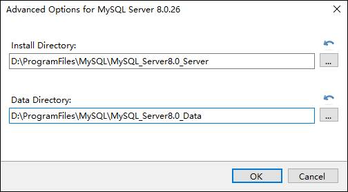

### 2、清理服务列表中的服务名

如果在windows操作系统，卸载后mysql后，服务没有卸载干净，可以通过系统管理员在cmd命令行删除服务。

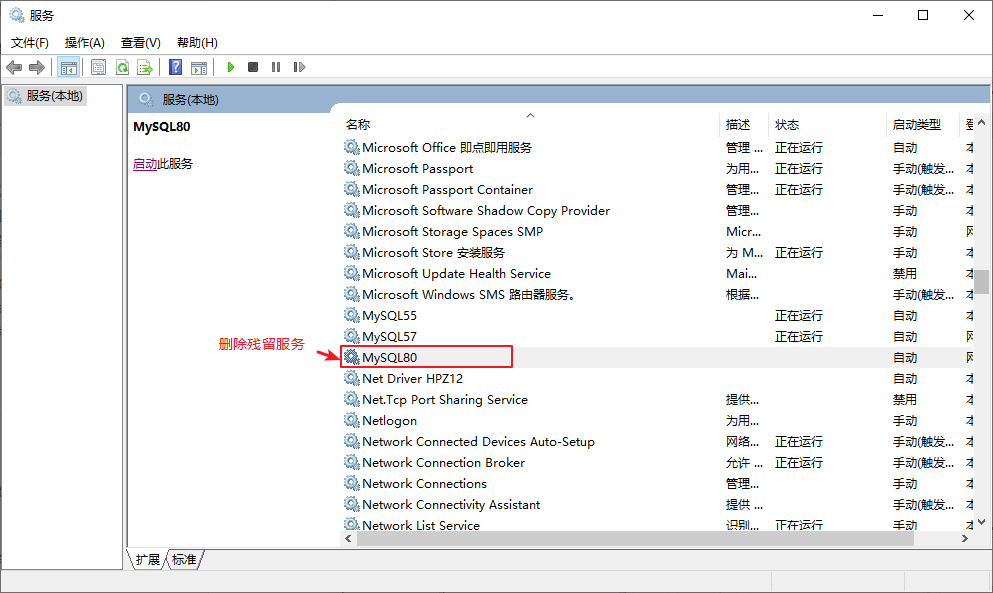

```
sc  delete  服务名
```

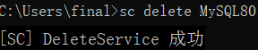

### 3、清理原来的环境变量


### 3、清理注册表

反复安装不成功的，可以尝试清理注册表。

如何打开注册表编辑器：在系统的搜索框中输入regedit

* HKEY_LOCAL_MACHINE\SYSTEM\ControlSet001\Services\Eventlog\Application\MySQL服务 目录删除

* HKEY_LOCAL_MACHINE\SYSTEM\ControlSet001\Services\MySQL服务 目录删除

* HKEY_LOCAL_MACHINE\SYSTEM\ControlSet002\Services\Eventlog\Application\MySQL服务 目录删除

* HKEY_LOCAL_MACHINE\SYSTEM\ControlSet002\Services\MySQL服务 目录删除

* HKEY_LOCAL_MACHINE\SYSTEM\CurrentControlSet\Services\Eventlog\Application\MySQL服务目录删除

* HKEY_LOCAL_MACHINE\SYSTEM\CurrentControlSet\Services\MySQL服务删除

> 注册表中的ControlSet001,ControlSet002,不一定是001和002,可能是ControlSet005、006之类

## 二、Windows安装MySQL失败问题

### 2.1 安装失败问题

#### 2.1.1 无法打开MySQL8.0软件安装包？

​    在运行MySQL8.0软件安装包之前，用户需要确保系统中已经安装了.Net Framework相关软件，如果缺少此软件，将不能正常地安装MySQL8.0软件

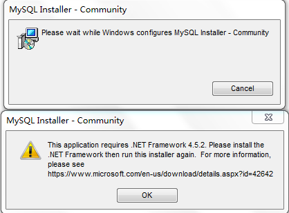

解决方案：到这个地址https://www.microsoft.com/en-us/download/details.aspx?id=42642下载Microsoft .NET Framework 4.5并安装后，再去安装MySQL。

#### 2.1.2 丢失MSVCP140.dll

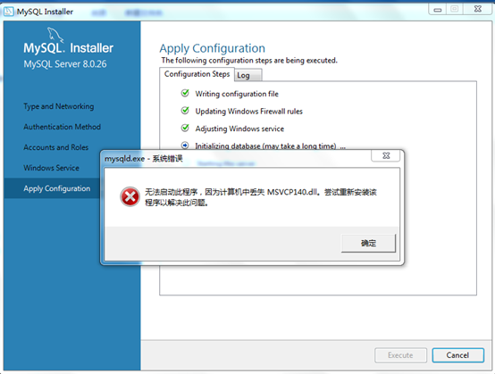

解决方案同样是，提前到微软官网https://support.microsoft.com/en-us/topic/the-latest-supported-visual-c-downloads-2647da03-1eea-4433-9aff-95f26a218cc0下载相应的环境。

如果电脑提示需要更新操作系统，请做好更新后再安装。

### 2.2 MySQL实例初始化失败问题

#### 2.2.1 初始化系统库失败

可能系统库无法写入，权限问题，用超级管理员或者换一个安装目录。

#### 2.2.2 初始化系统库失败之中文乱码问题

例如：

mysqld: File '.\绐︽枃褰?bin.index' not found (OS errno 2 - No such file or directory)

解决方法：【计算机】右键-->【属性】  重命名计算机设备名称

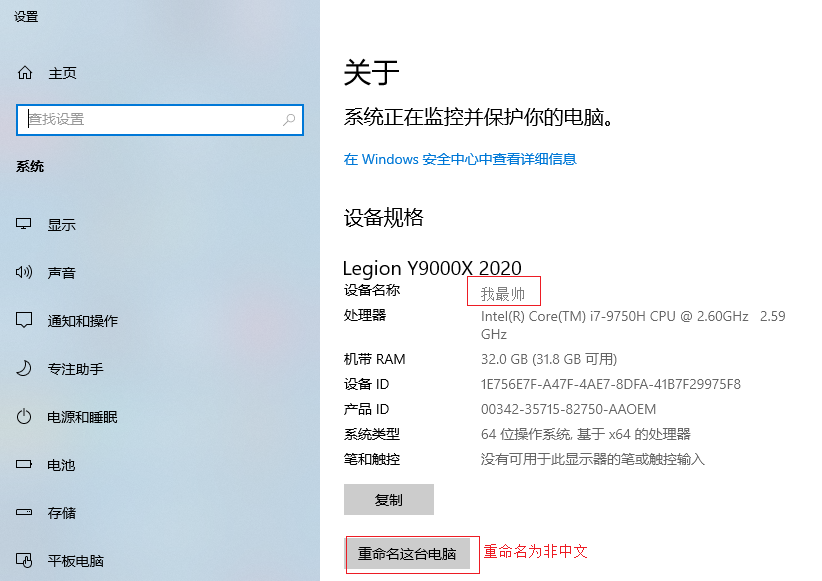

#### 2.2.3 mysql服务启动失败

MySQL error 1042: Unable to connect to any of the specified MySQL hosts.

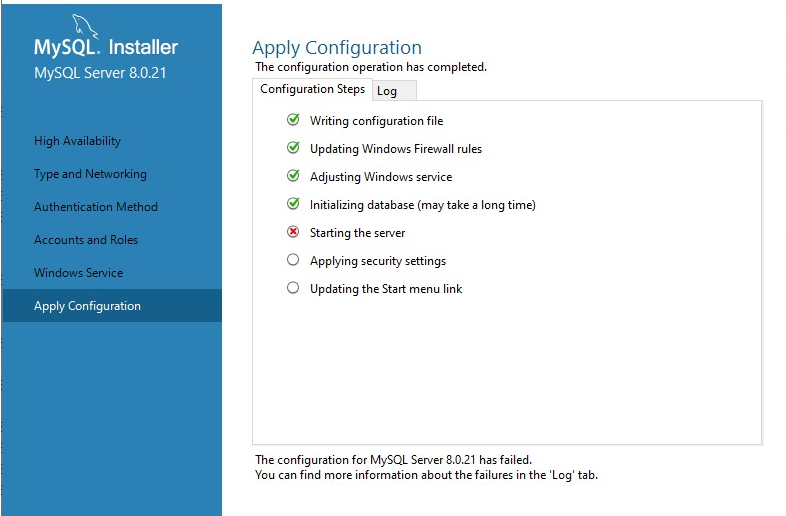

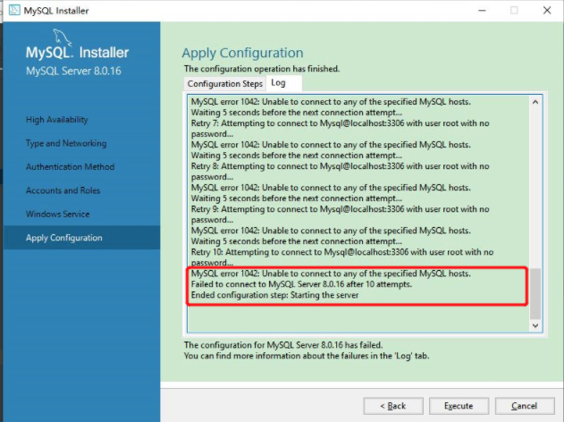

解决方案：

如果是专业版操作系统：

电脑–>管理–>本地用户和组–>组–>双击Administrators–>添加–>高级
把NETWORK SERVICE添加到Administrators组

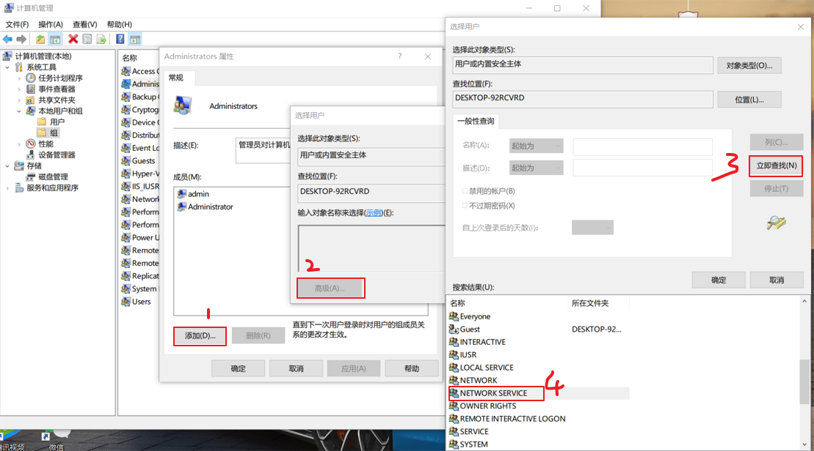

如果是家庭版操作系统：

计算机（点击鼠标右键）》管理（点击）》服务和应用程序（点击）》服务（点击）》MySQL80（点击鼠标右键）》属性》登录选项卡下将选择的此账户改为选择本地系统账户。之后重新执行excute

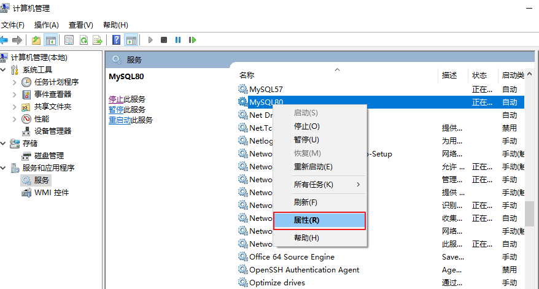

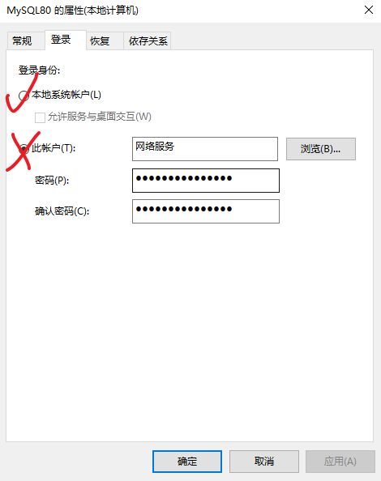

## 三、Windows版MySQL忘记密码

### 3.1 mysql8忘记root用户密码

当出现忘记root用户密码的情况时，如果此时有其他用户拥有系统库mysql的user表的UPDATE权限，可以由其他用户通过SET语句修改root用户密码。但是如果遇到一种特殊情况，此时没有其他用户，或者其他用户没有系统库mysql的user表的UPDATE权限，也没有GRANT（给用户授权）的权限，那么怎么处理呢？操作步骤如下：

1.首先停止mysql的服务
2.新建一个文本文件，文本文件中就写一条修改密码的语句

```sql
ALTER USER 'root'@'localhost' IDENTIFIED BY '123456';
```

例如在D盘根目录下新建一个文本文件“root_newpass.txt”，文件内容就上面一条语句。

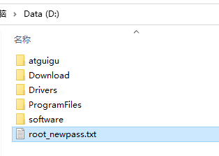

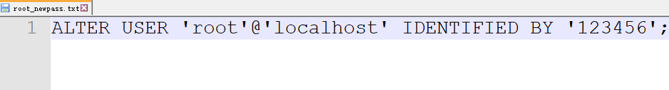

3.使用管理员权限运行cmd命令行，运行以下命令：

```sql
mysqld --defaults-file="D:\ProgramFiles\MySQL\MySQLServer8.0_Data\my.ini" --init-file="d:\password.txt"
```

注意：my.ini文件的路径看你自己的安装路径，找数据目录

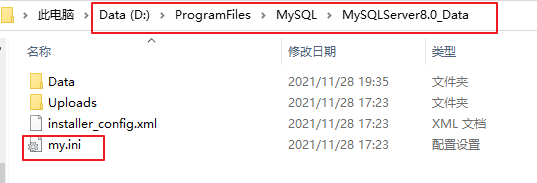

上面命令意思就是初始化启动一次数据库，并运行这个修改密码的文件。效果演示如下：

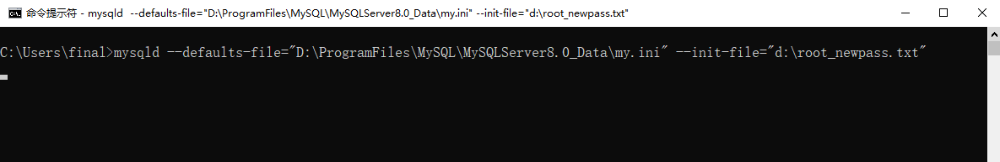

上面的命令执行后，就像卡住了一样，这就是启动MySQL服务了。

4.然后按CTRL+C结束上面的运行命令

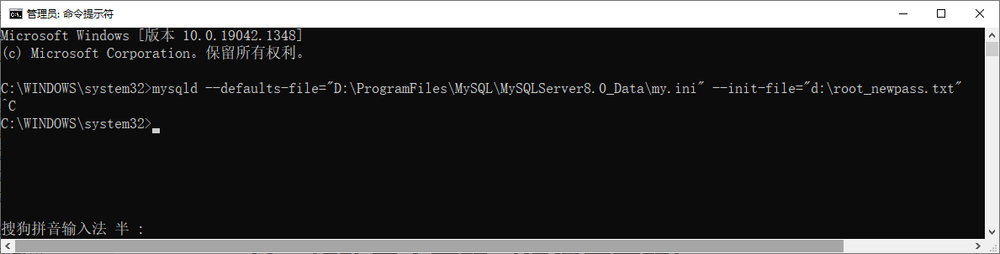

5.最后重新启动MySQL服务，用新密码登录即可

### 3.2 修改其他用户密码（记得原密码）

在命令行可以使用mysqladmin命令修改用户密码，命令格式如下：

```sql
mysqladmin -u 用户名 -h 主机名  -p password "新密码"
Enter password:输入旧密码
```

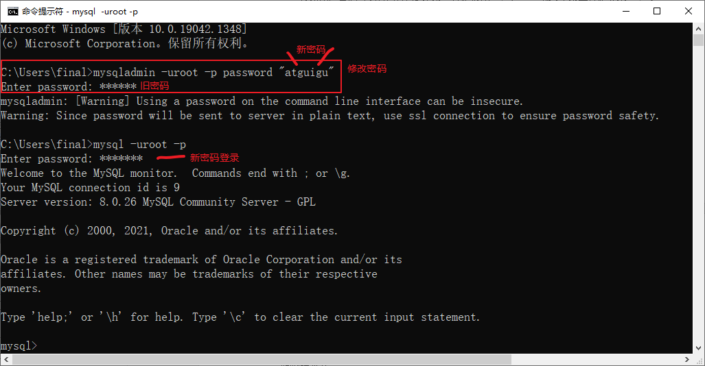

### 3.3 修改其他用户密码（不记得原密码）

例如：“root”用户登录后，修改用户名为“shangguigu1”，主机名为“localhost”的用户的密码为“atguigu”。

```sql
SET PASSWORD FOR 'shangguigu1'@'localhost' = '新密码';
```

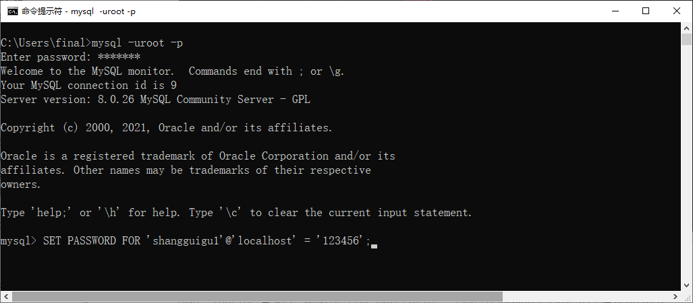

## 四、连接Windows版Mysql服务器失败问题

### 4.1 服务器拒绝连接

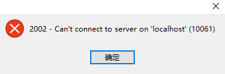

MySQL服务未启动或者端口号错误。

### 4.2 主机地址错误

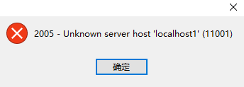

### 4.3 用户名或密码错误

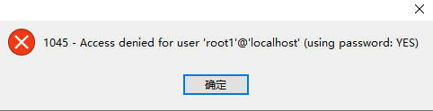

### 4.4 可视化工具版本太低

有些可视化工具，特别是旧版本的图形界面工具，在连接MySQL8时出现“Authentication plugin 'caching_sha2_password' cannot be loaded”错误。

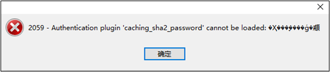

出现这个原因是MySQL8之前的版本中加密规则是mysql_native_password，而在MySQL8之后，加密规则是caching_sha2_password。

解决问题方法有两种：

第一种是升级图形界面工具版本。

第二种是把MySQL8用户登录密码加密规则还原成mysql_native_password。

第二种解决方案如下，用命令行登录MySQL数据库之后，执行如下命令修改用户密码加密规则并更新用户密码，这里修改用户名为“root@localhost”的用户密码规则为“mysql_native_password”，密码值为“123456”。

```sql
#修改'root'@'localhost'用户的密码规则和密码
ALTER USER 'root'@'localhost' IDENTIFIED WITH mysql_native_password BY '密码'; 
#刷新权限
FLUSH PRIVILEGES;
```

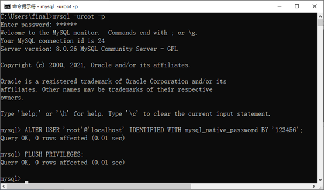


## 五、Windows连接Linux版Mysql服务器失败问题


### 5.1 排查步骤

#### 1、查看Windows与虚拟机是否联通

在`Windows`的命令行执行如下命令：

```bash
ping  虚拟机主机的IP地址 
```

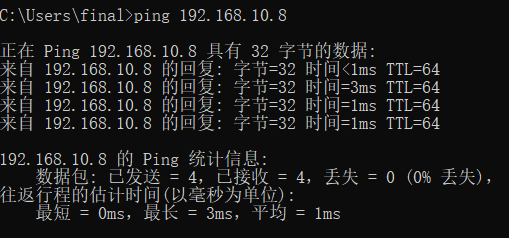

#### 2、查看Windows是否可以与mysql通信

在`Windows`的命令行执行如下命令：

```cmd
telnet 虚拟机主机的IP地址 3306
```


✅ 通：窗口变黑 / 出现一串乱码 → 网络层完全没问题，**问题 100% 在 MySQL 配置**；

提示：Windows 电脑上 开启「Telnet 客户端」：控制面板 → 程序 → 启用或关闭 Windows 功能 → 勾选「Telnet 客户端」→ 确定；

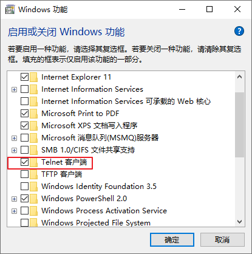

#### 3、虚拟机上的服务是否开启

在虚拟机上执行如下`Linux命令`：

```bash
# 在虚拟机上执行
# 检查MySQL服务状态
sudo systemctl status mysql

# 如果没有运行，启动它
sudo systemctl start mysql

# 检查是否在监听端口
sudo netstat -tlnp | grep :3306
```

#### 4、虚拟机防火墙是否阻止

在虚拟机上执行如下`Linux命令`：

```bash
# 在服务器上检查防火墙
sudo ufw status  # Ubuntu

# 如果防火墙开启，允许3306端口
sudo ufw allow 3306/tcp
sudo ufw reload
```


#### 5、检查虚拟机上MySQL绑定地址

在虚拟机上执行如下`Linux命令`：

```bash
# 在服务器上查看MySQL配置
sudo grep -r "bind-address" /etc/mysql/

# 查看my.cnf配置文件
sudo cat /etc/mysql/mysql.conf.d/mysqld.cnf | grep -i bind
```

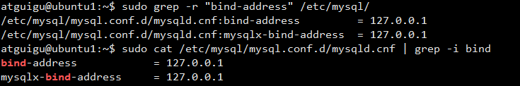

修改配置：

```bash
sudo vi /etc/mysql/mysql.conf.d/mysqld.cnf
```

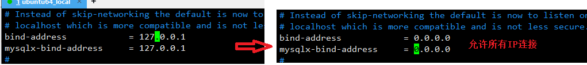

#### 6、重启虚拟机的MySQL服务

```bash
# 重启MySQL
sudo systemctl restart mysql

# 检查服务状态
sudo systemctl status mysql
```
