# 第2章 MySQL服务器端的安装与使用（Linux）

## 2.1 安装

在 Ubuntu 20.04/22.04、Debian10/11/12 这些主流系统中，**系统自带的官方软件源里，已经没有「MySQL 原版」了**，取而代之的是 `MariaDB`（MySQL 的分支版本）。

如果你直接执行：`sudo apt install mysql-server`，系统给你装的根本不是 Oracle 官方的 MySQL，而是 **MariaDB**，虽然用法相似，但版本、功能、兼容性都和原版 MySQL 有差异，生产环境中如果要求用纯 MySQL，这个方式就完全不行。

所以我们需要先从Oracle官网下载`mysql-apt-xxx.deb`文件（例如：`mysql-apt-config_0.8.34-1_all.deb`，`all`表示这个包适配所有 CPU 架构）。 这个文件**不是 MySQL 数据库本体、不是服务、不是插件**，它是一个「轻量化的配置包」，大小只有几十 KB，它的唯一功能就是：

1. 安装后，在你的系统目录 `/etc/apt/sources.list.d/` 下，新增一个 **MySQL 官方的源配置文件**；
2. 同时给系统导入 MySQL 官方的软件包公钥，让系统信任这个源下载的软件包，避免安装时报「签名验证失败」；
3. 弹出可视化交互界面，让你**选择要安装的 MySQL 版本（8.0/5.7）、MySQL 产品类型**。

简单理解：这个包就是一个「钥匙」，帮你打开「MySQL 官方软件仓库」的大门，之后你的`apt`命令就能从官方仓库下载正版 MySQL 了。

### 2.1.1 下载mysql-apt-xxx.deb源配置包

**deb** 是**Debian 系 Linux 系统**的**软件安装包格式**，后缀为 `.deb`，是 Linux 下最常用的安装包之一。主要用于Ubuntu、Debian、Linux Mint、树莓派系统 等 **Debian 家族** Linux。类似于Windows平台的`.exe` / `.msi` 安装包。

第一步：https://www.mysql.com/downloads/

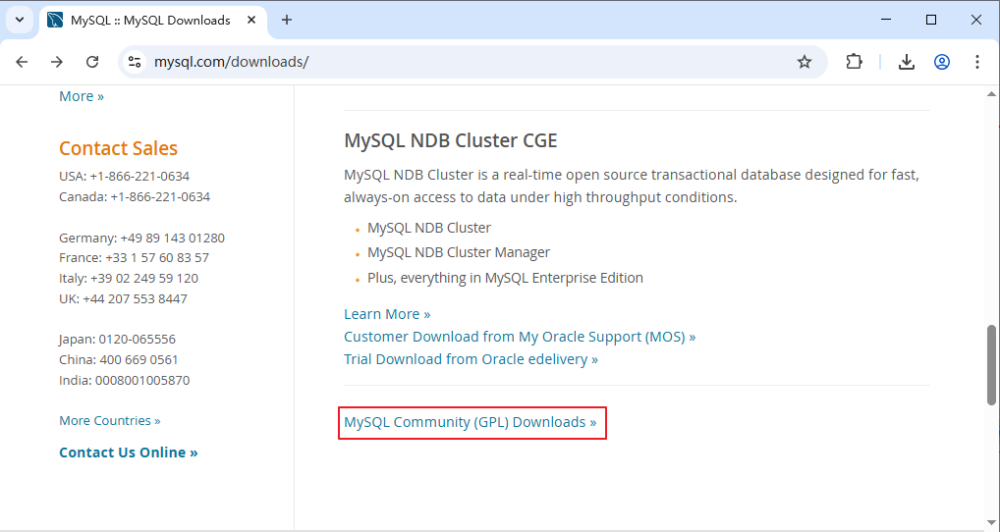

第二步：根据操作系统选择

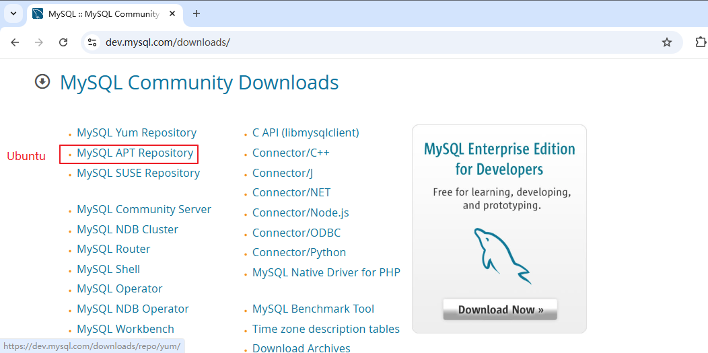

第三步：下载

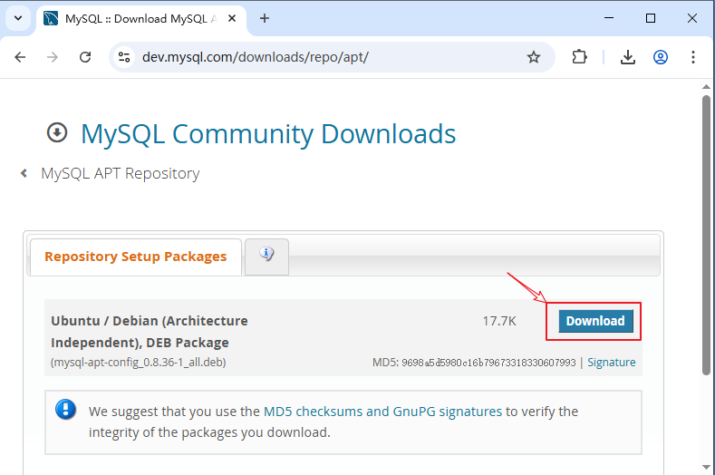

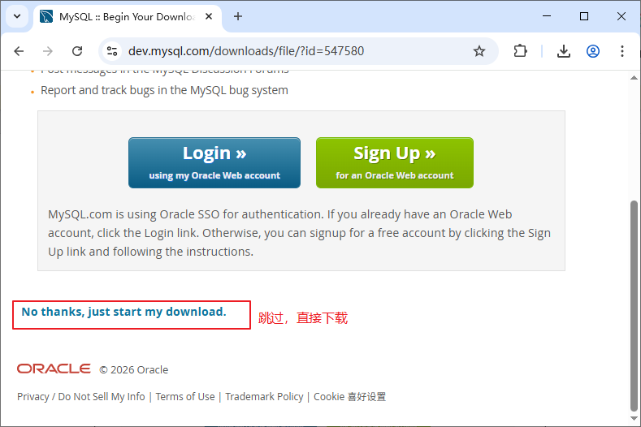

### 2.1.2 将mysql-apt-xxx.deb文件上传到虚拟机

第一步：创建software目录，用于存放各种软件的安装包

```bash
sudo mkdir /opt/software
```


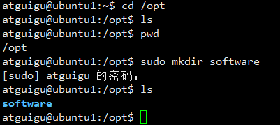


第二步：将MySQL安装文件mysql-apt-config_0.8.36-1_all.deb上传到/home/atguigu目录下

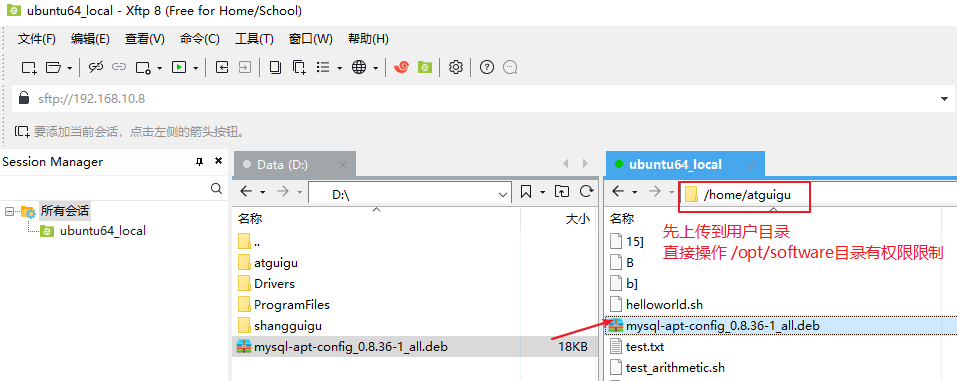

第三步：将mysql-apt-config_0.8.36-1_all.deb移动到/opt/software

```bash
sudo mv /home/用户名/mysql-apt-config_0.8.36-1_all.deb /opt/software
```

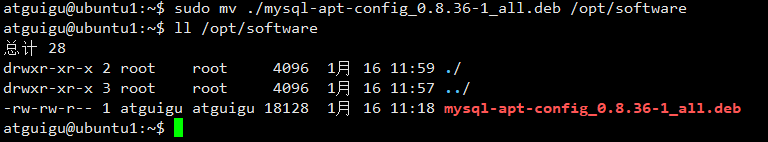

### 2.1.3 安装mysql-apt-xxx.deb源配置包

安装 **MySQL 官方的 APT 源配置包**，给你的 Linux 系统「添加 MySQL 官方的软件源地址」，让你的`apt`命令可以下载安装 **MySQL 官方原版的 MySQL-server/mysql-client**，而非系统默认的 MariaDB。

> 运行命令：

```bash
sudo dpkg -i /opt/software/mysql-apt-config_0.8.36-1_all.deb
```

- `dpkg` → Debian 系系统的底层包管理器，专门处理本地 `.deb` 格式的安装包；
- `-i` → `--install` 的简写，核心作用：**安装本地的 deb 包文件**；


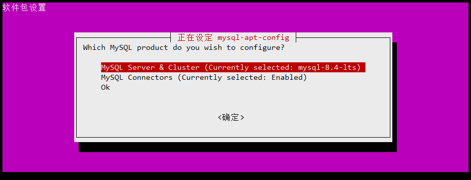

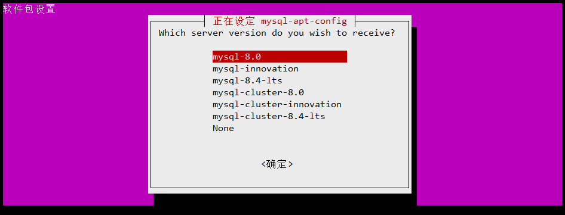

### 2.1.4 从MySQL APT 源更新包信息

```bash
sudo apt update
```

### 2.1.5 安装Mysql服务

```bash
sudo apt install mysql-server
```

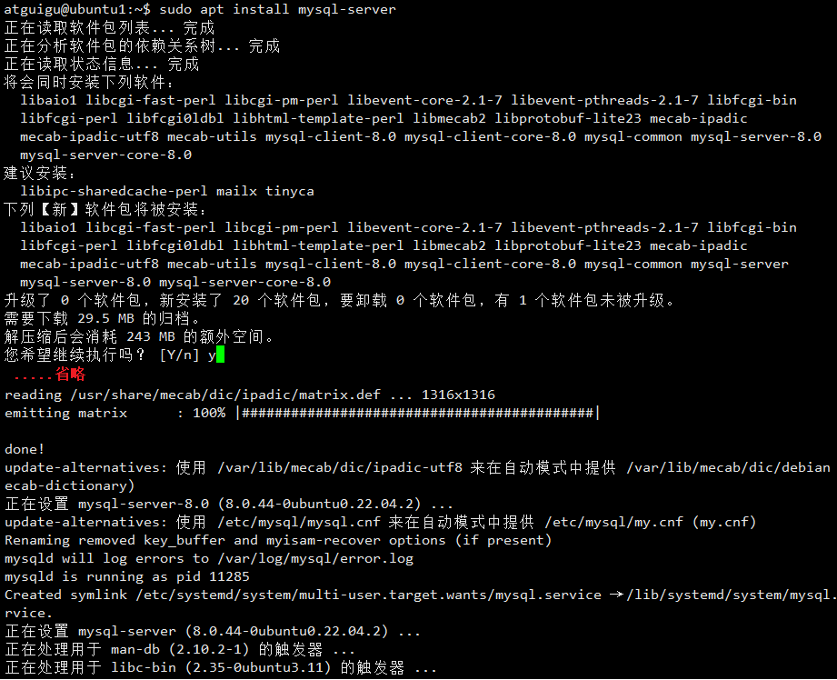

注意：用`apt install mysql-server`安装 MySQL，文件会被分散到这些固定路径：

- 可执行文件 → `/usr/bin`、`/usr/sbin`
- 配置文件 → `/etc/mysql`
- 数据库文件 → `/var/lib/mysql`
- 库文件 → `/usr/lib/x86_64-linux-gnu/mysql`

Linux 的 FHS 文件系统标准，就是让软件的「可执行、配置、数据、库」文件分类存放，保证系统稳定性，这也是包管理器的设计初衷。

### 2.1.6 设置root用户密码

#### 情况一：

没有先安装mysql-apt-xxx.deb，直接执行`sudo apt install mysql-server`安装过程中，弹出如下对话框，输入密码。此时实际安装的是Ubuntu系统自带的 MariaDB。

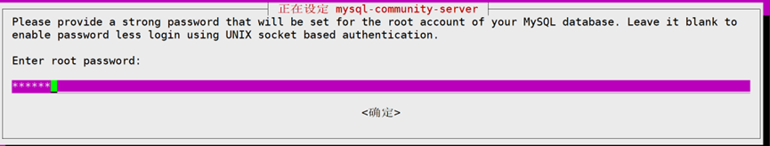

当出现Use Strong Password Encryption (RECOMMENDED)直接选ok就行

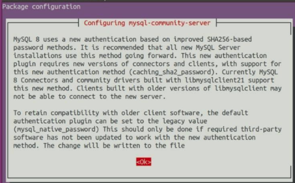

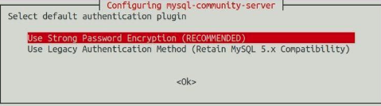

#### 情况二：

Oracle 官方原版 MySQL8.0彻底**取消了 `apt install` 过程中的「交互式密码设置弹窗」**，这是 Oracle 官方的刻意设计，目的是提升安全性。MySQL 会为 `root@localhost` 自动生成一个**临时随机密码**，并把这个密码写入到 **MySQL 的错误日志文件** 中，或直接是空密码。不再让用户手动设置简单密码，从根源避免弱密码风险。

通过如下命令查看是否有root临时密码：

```bash
sudo grep 'root@localhost' /var/log/mysql/error.log
```

- 有临时密码：
- 无临时密码：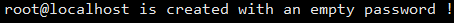


### 2.1.7 查看MySQL服务状态

#### 1、查看MySQL服务状态

```bash
sudo systemctl status mysql
```

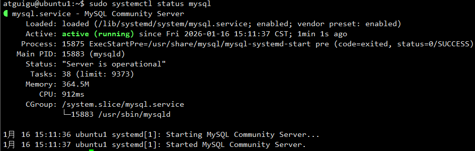


#### 2、使用systemctl查看报错（wsl问题）

```
atguigu@LAPTOP-AG8KORH9:~$sudo systemctl status mysql（报错）
System has not been booted with systemd as init system (PID 1). Can't operate.
Failed to connect to bus: Host is down
```

解决办法：WSL2 启用 systemd

步骤如下（全程在 Ubuntu 终端执行）：

步骤1：编辑 WSL 配置文件，开启 systemd

```bash
sudo vi /etc/wsl.conf
```

步骤2：写入以下配置（直接复制粘贴，覆盖原有内容即可）

```bash
[boot]
systemd=true
```

步骤3：保存退出 vi（按`ESC`，再输入`:wq!`，回车）

步骤4：关闭 WSL 并重启（关键步骤，必须执行）

**打开 Windows 的「管理员 PowerShell」**，执行以下命令关闭所有 WSL 发行版：

```powershell
wsl --shutdown
```

然后重新打开 Ubuntu 终端即可。


### 2.1.8 修改root用户密码

#### 第一步：安全模式启动MySQL

```bash
# 1.停止MySQL
sudo systemctl stop mysql

# 2.创建socket目录（确保存在）
sudo mkdir -p /var/run/mysqld
sudo chown mysql:mysql /var/run/mysqld

# 3.启动安全模式
sudo mysqld_safe --skip-grant-tables --skip-networking &
```

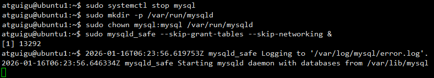

#### 第二步：修改root用户密码

🔴注意：新开一个终端窗口

```bash
# 4. 新开一个终端窗口，直接免密登录mysql（无需输入密码，回车即可）
mysql -uroot
```

登录后，执行如下SQL语句

```sql
# 5. 使用mysql系统库
use mysql

# 6.刷新权限表
FLUSH PRIVILEGES;

# 7.修改root密码（MySQL 8.0方法）
#ALTER USER 'root'@'localhost' IDENTIFIED BY '你的新密码';
ALTER USER 'root'@'localhost' IDENTIFIED BY '123456';

-- 如果上述失败（ERROR 1524 (HY000): Plugin 'auth_socket' is not loaded），尝试传统方法。
UPDATE mysql.user 
SET authentication_string='', 
    plugin='mysql_native_password'
WHERE user='root' AND host='localhost';

-- 然后设置密码
#ALTER USER 'root'@'localhost' IDENTIFIED WITH mysql_native_password BY '你的新密码';
ALTER USER 'root'@'localhost' IDENTIFIED WITH mysql_native_password BY '123456';

# 8.刷新权限表
FLUSH PRIVILEGES;

#退出
EXIT;
```

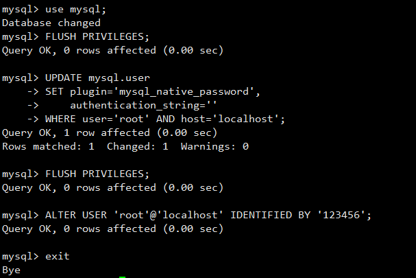

#### 第三步：重新启动

```bash
# 重新启动mysql
sudo systemctl start mysql
```

如果卡住请执行如下命令，再重启：

```bash
# 按 Ctrl+C 中断当前卡住的命令

# 强制停止MySQL服务
sudo systemctl stop mysql

# 确保所有MySQL进程都停止
sudo pkill -9 mysql
sudo pkill -9 mysqld
sudo pkill -9 mysqld_safe
```

## 2.2 连接Linux的MySQL服务

### 2.2.1 Linux本地登录

```bash
mysql -uroot -p
Enter password:输入密码
```

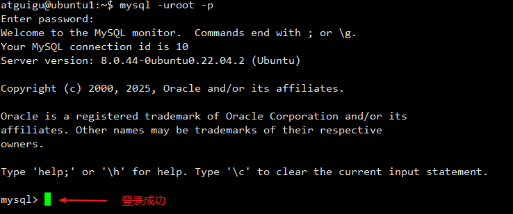

### 2.2.2 授权其它客户端服务器的权限

在虚拟机上打开终端，登录mysql

```bash
mysql -uroot -p
Enter password:输入密码
```

执行如下SQL语句：

```sql
# 更新用户表
update mysql.user set host='%' where user='root';
# 刷新权限表
FLUSH PRIVILEGES;
```

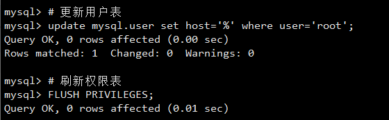

### 2.2.3 在windows上连接虚拟机的MySQL

```cmd
mysql -h虚拟机主机IP地址 -uroot -p
Enter password:输入密码
```

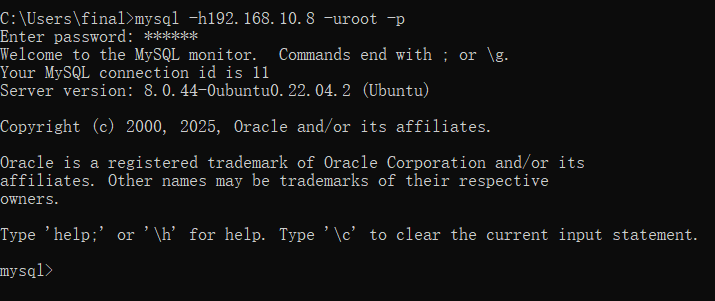

> 如果照着2.2.2和2.2.3的步骤完成了，仍然报11161错误，那么按照如下操作

那么说明你遇到了Ubuntu 上的 MySQL 安装后默认只允许本机连接 (`127.0.0.1`)。若要允许其他机器访问，需要修改配置。

1. 打开 MySQL 配置文件（常见路径）：

```bash
sudo vim /etc/mysql/mysql.conf.d/mysqld.cnf
```

2. 找到 `bind-address = 127.0.0.1` 这一行，将其注释掉或改为 `0.0.0.0`（监听所有网络接口）：

```bash
# bind-address = 127.0.0.1   # 注释掉这行
bind-address = 0.0.0.0       # 或修改为 0.0.0.0
```

3. 保存文件后，**必须重启 MySQL 服务**：

```bash
sudo systemctl restart mysql
```

4. **Ubuntu 防火墙 (UFW)**：检查是否放行了 `3306` 端口

```bash
sudo ufw status
# 如果没有放行，执行：
sudo ufw allow 3306/tcp
```


## 2.3 重新安装MySQL

```bash
# 停止服务
sudo systemctl stop mysql
sudo systemctl stop mysqld

# 确保进程停止
sudo pkill -9 mysql
sudo pkill -9 mysqld

# 备份配置和数据
# sudo cp -r /etc/mysql /etc/mysql_backup
# sudo cp -r /var/lib/mysql /var/lib/mysql_backup

# 重新安装MySQL（Ubuntu/Debian）
sudo apt-get purge mysql-server mysql-client mysql-common mysql-server-core-* mysql-client-core-*
sudo rm -rf /etc/mysql /var/lib/mysql
sudo apt-get autoremove
sudo apt-get autoclean

# 重新安装
sudo apt-get update
sudo apt-get install mysql-server

# 启动服务
sudo systemctl start mysql
```


## 2.4 卸载MySQL

```shell
#!/bin/bash
# MySQL完全卸载脚本（Ubuntu/Debian）

echo "=== 开始卸载MySQL ==="

# 备份提醒
echo "警告：这将删除所有MySQL数据！"
read -p "是否已备份重要数据？(y/n): " -n 1 -r
echo
if [[ ! $REPLY =~ ^[Yy]$ ]]; then
    echo "请先备份数据再执行卸载！"
    exit 1
fi

# 停止服务
echo "停止MySQL服务..."
sudo systemctl stop mysql 2>/dev/null
sudo systemctl stop mysqld 2>/dev/null
sudo pkill -9 mysql 2>/dev/null
sudo pkill -9 mysqld 2>/dev/null

# 卸载软件包
echo "卸载MySQL软件包..."
sudo apt-get remove --purge mysql-server mysql-client mysql-common mysql-community-server mysql-community-client -y
sudo apt-get autoremove --purge -y
sudo apt-get autoclean -y

# 删除目录
echo "删除MySQL文件和目录..."
sudo rm -rf /etc/mysql /etc/my.cnf /etc/my.cnf.d
sudo rm -rf /var/lib/mysql /var/lib/mysql-files /var/lib/mysql-keyring
sudo rm -rf /var/log/mysql /var/log/mysqld.log
sudo rm -rf /tmp/mysql* /tmp/.mysql*
sudo rm -rf /var/run/mysqld /run/mysqld
sudo rm -rf /usr/lib/mysql /usr/share/mysql /usr/share/doc/mysql*

# 清理用户
echo "清理MySQL用户..."
sudo userdel -r mysql 2>/dev/null
sudo groupdel mysql 2>/dev/null

# 最终清理
echo "最终清理..."
sudo apt-get update
sudo apt-get clean

echo "=== MySQL卸载完成 ==="
echo "建议重启系统: sudo reboot"
```
