# 第1章 客户端工具

## 1.1 命令行客户端

### 1.1.1 MySQL自带客户端

开始菜单==》所有程序==》MySQL==》MySQL Server 8.0==》MySQL 8.0 Command Line Client


> 说明：仅限于root用户

### 1.1.2 cmd命令行客户端

**mysql -h 主机名 -P 端口号 -u 用户名 -p密码**

```sql
例如：mysql -h localhost -P 3306 -u root -proot   

-h：host 主机名/IP地址
-P：port端口号
-u：user 用户名
-p：password密码
```

注意：

（1）-p与密码之间不能有空格，其他参数名与参数值之间可以有空格也可以没有空格

```sql
mysql -hlocalhost -P3306 -uroot -proot
```

（2）密码建议在下一行输入

```sql
mysql -h localhost -P 3306 -u root -p
Enter password:****
```

（3）如果是连本机：-hlocalhost就可以省略，如果端口号没有修改：-P3306也可以省略

  简写成：

```sql
mysql -u root -p
Enter password:******
```

（4）如果输入mysql命令报“不是内部或外部命令”，把mysql安装目录的bin目录配置到环境变量path中


## 1.2 可视化客户端

### 1.1.1 可视化工具Navicat

Navicat是一套可创建多个连接的数据库管理工具，用以方便管理 MySQL、Oracle、PostgreSQL、SQLite、SQL Server、MariaDB 和 MongoDB 等不同类型的数据库，它与阿里云、腾讯云、华为云、Amazon RDS、Amazon Aurora、Amazon Redshift、Microsoft Azure、Oracle Cloud 和 MongoDB Atlas等云数据库兼容。你可以创建、管理和维护数据库。Navicat 的功能足以满足专业开发人员的所有需求，但是对数据库服务器初学者来说又简单易操作。Navicat 的用户界面 (GUI) 设计良好，让你以安全且简单的方法创建、组织、访问和共享信息。


### 1.1.2 可视化工具SQLyog

SQLyog是一款简介高效且功能强大的图形化数据库管理工具。这款工具是使用C++语言开发的。用户可以使用这款软件来有效地管理MySQL数据库。该工具可以方便地创建数据库、表、视图和索引等，还可以方便地进行插入、更新和删除等操作，同时可以方便地进行数据库、数据表的备份和还原。该工具不仅可以通过SQL文件进行大量文件的导入和导出，还可以导入和导出XML、HTML和CSV等多种格式的数据。使用SQLyog中文社区版进行演示，下载地址为https://github.com/webyog/sqlyog-community/wiki/Downloads。

使用SQLyog图形化界面工具连接MySQL数据库的操作步骤如下。

步骤1：数据库菜单→点击“创建新连接”选项→打开连接管理窗口。在连接管理窗口可以选择“新建”按钮创建新的连接，也可以直接连接已保存的连接，然后进行参数设置，需要输入MySQL服务器IP地址、端口号、用户名、密码以及要连接的数据库名称等，其中数据库名称如果不写表示显示该用户有权限查看和操作的全部数据库。设置完成后，可以单击右侧的“测试连接”按钮，测试是否成功，如果没有问题，单击“连接”按钮连接数据库。

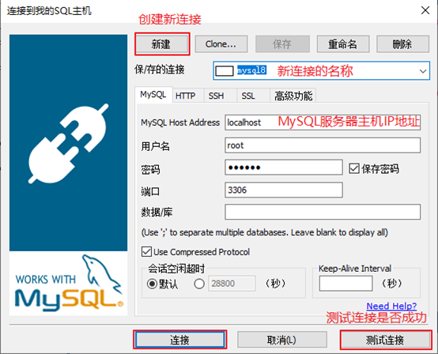

 步骤2：连接成功后，就可以对数据库进行管理和操作了。

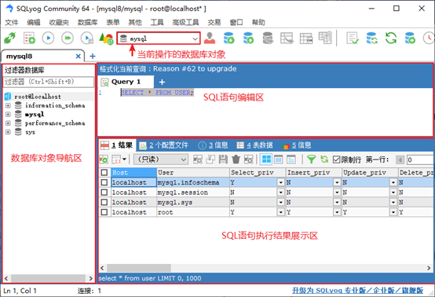

### 1.1.3 可视化工具Datagrip

DataGrip 是一款由 JetBrains 公司开发的跨平台数据库集成开发环境（IDE），专为数据库管理员和开发人员设计。它通过统一的图形化界面，支持主流关系型数据库（如 MySQL、PostgreSQL、Oracle）以及 NoSQL 数据库（如 MongoDB、Cassandra），让用户能够高效地进行数据库连接、查询编写、数据编辑与结构管理。

**核心功能亮点：**

- **智能代码补全**：根据上下文提供精准的 SQL 语法、表名和字段名建议，大幅提升编码效率。
- **可视化操作界面**：直接浏览和修改表结构、外键关系，并通过直观的图表呈现数据关联。
- **高效查询工具**：内置查询控制台支持多语句执行、结果集筛选导出，并提供执行计划分析以优化查询性能。
- **版本控制集成**：无缝兼容 Git 等版本控制系统，方便团队协作管理 SQL 脚本变更。
- **数据导入导出**：支持多种格式（CSV、JSON 等）的数据迁移与备份，简化数据处理流程。

**适用场景：**
无论是日常数据库维护、复杂业务逻辑查询开发，还是跨数据库数据迁移，DataGrip 都以高度集成的环境帮助用户减少工具切换成本，保障操作准确性与数据安全，成为现代数据驱动型项目中的高效生产力工具。

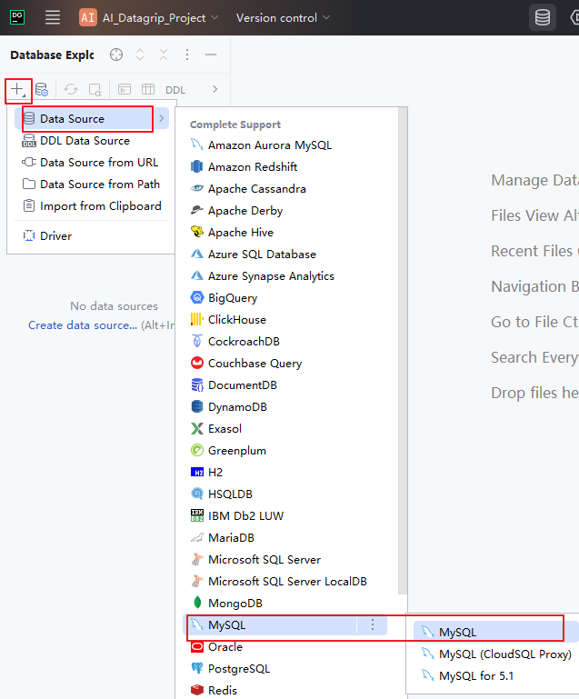

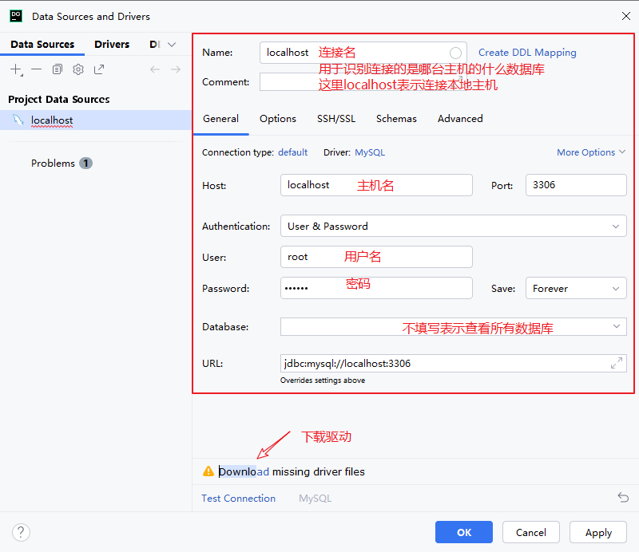

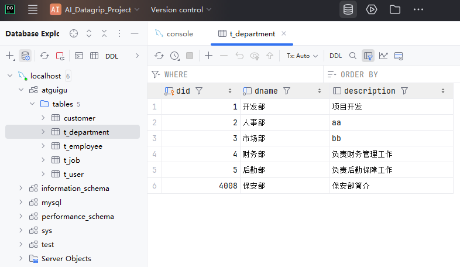

### 1.1.4 可视化工具DBeaver

DBeaver是一个通用的数据库管理工具和 SQL 客户端，支持所有流行的数据库：MySQL、PostgreSQL、SQLite、Oracle、DB2、SQL Server、 Sybase、MS Access、Teradata、 Firebird、Apache Hive、Phoenix、Presto等。DBeaver比大多数的SQL管理工具要轻量，而且支持中文界面。DBeaver社区版作为一个免费开源的产品，和其他类似的软件相比，在功能和易用性上都毫不逊色。下载地址：https://dbeaver.io/download/。DBeaver的下载安装都非常简单，唯一需要注意是DBeaver 是用Java编程语言开发的，所以需要拥有 JDK（Java Development ToolKit）环境。JDK是 Java 语言开发工具包，也是整个Java 的核心，包括运行环境、工具以及基础类库。如果电脑上没有JDK，在选择安装DBeaver组件时，勾选“Include Java”即可。

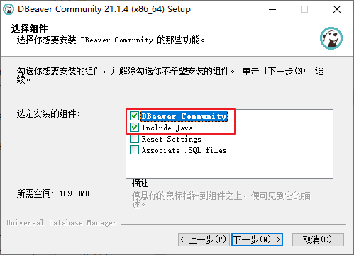

使用DBeaver图形化界面工具连接MySQL数据库也很简单，操作步骤如下。

步骤1：数据库菜单→单击“新建连接”选项→打开连接管理窗口。选择要连接的数据库类型，单击“下一步”按钮。注意，如果提示缺少相应的数据库驱动，则直接根据提示下载即可。

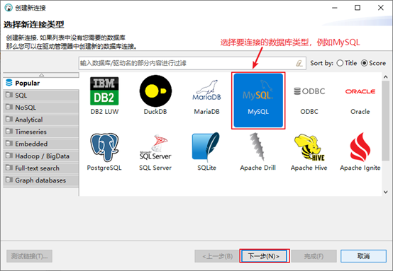

步骤2：填写连接参数，需要指定要连接的MySQL服务器的IP地址，端口号，用户名密码、MySQL服务器版本等，如图2-43所示。填写完成之后，可以单击“测试链接”按钮，查看是否连接成功。如果没问题，单击“完成”按钮即可。

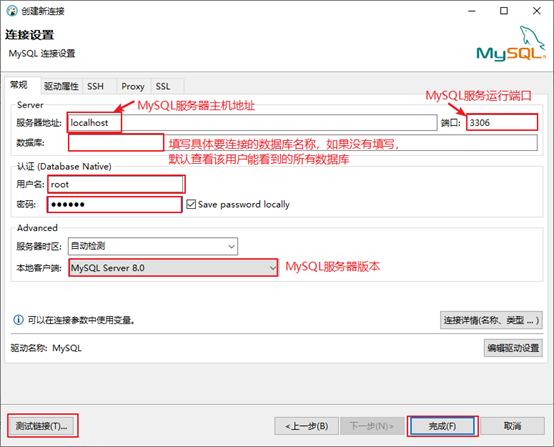

步骤3：连接成功后，就可以对数据库进行管理和操作了。

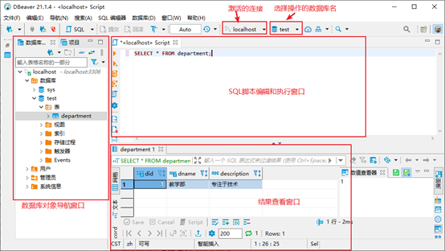

### 1.1.5 可视化工具MySQL Workbench

MySQL Workbench是MySQL官方提供的图形化界面管理工具，完全支持MySQL5.0以上的版本。它是著名的数据库设计工具DBDesigner4的继任者。MySQL Workbench 为数据库管理员、程序开发者和系统规划师提供可视化设计、模型建立、以及数据库管理功能。它包含了用于创建复杂的数据建模ER模型，正向和逆向数据库工程，也可以用于执行通常需要花费大量时间的、难以变更和管理的文档任务。MySQL工作台可在Windows、Linux和Mac上使用。随MySQL8一起发布的MySQL Workbench 8，可以直接连接MySQL8，不需要修改加密方式。当你创建、修改数据库及其表等数据库对象时，或针对表中的数据的添加、修改、删除操作时，可以提供生成SQL功能，对已经存在的表、函数等也可以提供生成SQL功能，这对于开发人员，或者初学者SQL的读者来说是个福音。下载地址：https://dev.mysql.com/downloads/workbench/。

​    使用MySQL Workbench图形化界面工具连接MySQL数据库的操作步骤如下。

步骤1：Database菜单→单击“Manage Server Connections”选项→打开连接管理窗口，如图2-37所示。在连接管理窗口中可以选择“New”按钮创建新的连接，也可以在左边“已有连接列表”中选择某个连接进行参数设置。需要指定要连接的MySQL服务器的IP地址，端口号，用户名和密码等。参数设置完成之后，可以单击“Test Connection”按钮测试某个连接是否可以连接成功。如果测试成功，可以看到“Successfully made the MySQL connection”的提示对话框。

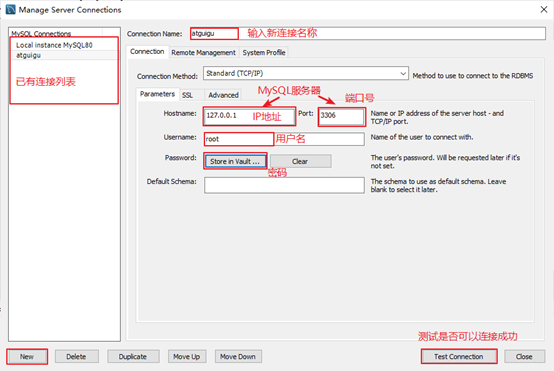

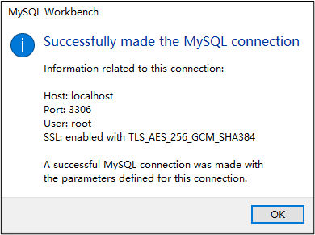

步骤2：Database菜单→单击“Connect to Database”选项→打开数据库连接窗口。选择之前创建并设置的某个连接后，单击“OK”按钮进行连接登录MySQL数据库。

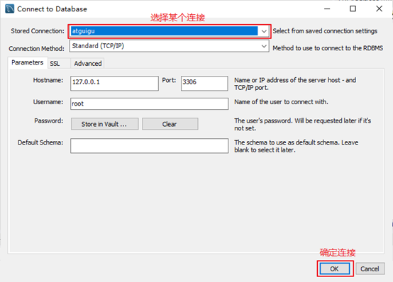

步骤3：连接成功后，就可以对MySQL数据库进行管理了。

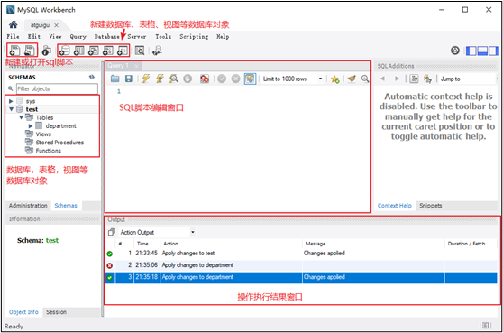
