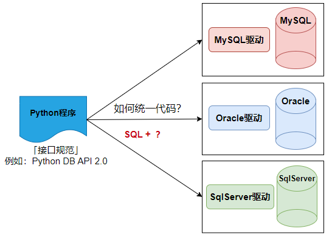

# Python 连接 MySQL

## 一、驱动



Python 生态中，有 2 个最常用的 MySQL 驱动库，**二选一安装即可**，都是生产环境常用的，推荐第一个：

✅ `mysql-connector-python`（MySQL 官方出品）

这是 **MySQL 官方为 Python 开发的驱动库**，功能强，性能好，大数据 / 复杂查询更快（C 优化）。带 C 扩展，在某些 Linux、macOS、ARM 环境可能编译失败或找不到预编译包。Oracle 亲儿子，对 MariaDB 适配一般，部分特性不兼容。MySQL 8.0 连接更省心，默认用 `caching_sha2_password`，很多旧环境连不上，要改用户认证插件。

安装命令如下（cmd / 终端直接执行）：

```bash
pip install mysql-connector-python
```

✅ `pymysql`（社区）

这是 Python 开发者社区最火的 MySQL 驱动，纯 Python，无编译、无依赖，MariaDB 兼容好，功能完善，**MIT 许可证，随便用、随便改，无法律风险**，Django、Flask、SQLAlchemy 默认常用。唯一小缺点：如果你的 Python 版本是 3.10+，偶尔会有微小的兼容告警。

安装命令如下：

```bash
pip install pymysql
```

## 二、Python DB API

## 2.1 使用 mysql-connector-python 连接 MySQL

```python
# 1. 导入官方驱动的核心模块
import mysql.connector

# 获取连接
def get_connection():
    # 数据库连接参数（替换成你的：主机、端口、用户名、密码、数据库名）
    conn_params = {
        "host": "localhost",  # 本地数据库写localhost，远程写服务器IP
        "port": 3306,  # MySQL默认端口3306
        "user": "root",  # 你的MySQL用户名
        "password": "123456",
        "database": "atguigu"  # 要连接的具体数据库
    }
    try:
        # 2. 建立数据库连接
        conn =  mysql.connector.connect(**conn_params)
        print("获取连接成功", conn)
        return conn
    except:
        print("获取连接的时候发生了异常")
        
if __name__ == '__main__':
    conn = get_connection()
    conn.close()
```


## 2.2 使用 pymysql 连接 MySQL

```python
"""
    该案例演示了python操作MySQL数据库
"""
import pymysql

# 获取连接
def get_connection():
    conn_params = {
        "host": "localhost",  # 本地数据库写localhost，远程写服务器IP
        "port": 3306,  # MySQL默认端口3306
        "user": "root",  # 你的MySQL用户名
        "password": "123456",
        "database": "atguigu"  # 要连接的具体数据库
    }
    try:
        conn = pymysql.connect(**conn_params)
        print("获取连接成功", conn)
        return conn
    except:
        print("获取连接的时候发生了异常")
    
    
if __name__ == '__main__':
    conn = get_connection()
    conn.close()
```


## 三、实现增删改查

```python
import pymysql

def get_connection():
    conn_params = {
        "host": "localhost",  # 本地数据库写localhost，远程写服务器IP。如果连接远程的，或者同桌，写对方的IP地址
        "port": 3306,  # MySQL默认端口3306，以连接目标mysql服务的端口号
        "user": "root",  # 通过哪个MySQL用户名进行登录
        "password": "123456",
        "database": "atguigu"  # 要连接的具体数据库，等价于 use 数据名
    } #这里的key是固定
    try:
        conn = pymysql.connect(**conn_params) # **解包传参，会把字典中的每一对(key,value)按照关键字传参的方式给connect方法
        if conn:
            print("pymysql连接成功")
            return conn
    except:
        print("pymysql连接失败")

def select_department(conn):
    my_cursor = conn.cursor()
    sql = "select * from t_department"
    row_number = my_cursor.execute(sql)  #pymysql的execute函数会返回记录数，标准库的execute函数返回None
    print(f"一共返回了{row_number}行记录")
    print("每一行的数据：")
    rows = my_cursor.fetchall()
    for row in rows:
        print(row) #row是一个元组

def insert_department(conn):
    try:
        my_cursor = conn.cursor()
        sql = "insert into t_department values (null, '保安部', '负责安保工作')"
        row_number = my_cursor.execute(sql)
        print(f"一共添加了{row_number}行记录")
        conn.commit()#提交事务
    except:
        print("添加失败")
        conn.rollback() #回滚事务


def update_department(conn):
    try:
        my_cursor = conn.cursor()
        sql = "update t_department set description='负责发工资' where dname='财务部'"
        row_number = my_cursor.execute(sql)
        print(f"一共修改了{row_number}行记录")
        conn.commit()  # 提交事务
    except:
        print("修改失败")
        conn.rollback()  # 回滚事务

def delete_department(conn):
    try:
        my_cursor = conn.cursor()
        sql = "delete from t_department where dname='财务部'"
        row_number = my_cursor.execute(sql)
        print(f"一共删除了{row_number}行记录")
        conn.commit()  # 提交事务
    except:
        print("删除失败")
        conn.rollback()  # 回滚事务

#测试
if __name__ == "__main__":
    conn = get_connection()
    select_department(conn) #查询
    # insert_department(conn) #添加
    # update_department(conn)#修改
    # delete_department(conn) #删除
    conn.close()
```

## 四、拓展（ORM)

```python
"""
    Object Relational Mapping对象关系映射，python对象与关系型数据库的表的映射关系。
"""
import traceback
import pymysql
class Department:
    def __init__(self, did=None,dname=None,description=None):
        self.did = did
        self.dname = dname
        self.description = description

    def __repr__(self):
        return f"{self.did}, {self.dname}, {self.description}"

class Job:
    def __init__(self, jid=None,jname=None,description=None):
        self.jid = jid
        self.jname = jname
        self.description = description

    def __repr__(self):
        return f"{self.jid}, {self.jname}, {self.description}"

def get_connection():
    conn_params = {
        "host": "localhost",  # 本地数据库写localhost，远程写服务器IP。如果连接远程的，或者同桌，写对方的IP地址
        "port": 3306,  # MySQL默认端口3306，以连接目标mysql服务的端口号
        "user": "root",  # 通过哪个MySQL用户名进行登录
        "password": "123456",
        "database": "atguigu"  # 要连接的具体数据库，等价于 use 数据名
    } #这里的key是固定
    try:
        conn = pymysql.connect(**conn_params) # **解包传参，会把字典中的每一对(key,value)按照关键字传参的方式给connect方法
        if conn:
            print("pymysql连接成功")
            return conn
    except:
        print("pymysql连接失败")


def update(conn,sql:str, params:dict=None): #增、删、改都是会更新表中的数据，通用的增删改方法
    my_cursor = conn.cursor()
    sql = sql.format_map(params)
    row_number = my_cursor.execute(sql)
    print(f"一共影响了{row_number}行记录")
    return row_number

def select(conn,classname, sql,params:dict=None):#通用的查询方法
    my_cursor = conn.cursor(pymysql.cursors.DictCursor)  #关键：开启字典映射（这样不依赖于属性和列顺序）
    sql = sql.format_map(params)
    row_number = my_cursor.execute(sql)
    print(f"一共返回了{row_number}行记录")
    rows = my_cursor.fetchall()  # 直接返回 字典列表：[{字段名:值}, {字段名:值}]
    results = [classname(**row) for row in rows]  # 字典解包用**
    return results

if __name__ == "__main__":
    # #添加一个部门对象
    # try:
    #     with get_connection() as conn:
    #         new_dept = Department(dname="财务部", description="钱钱钱")
    #         insert_dept_sql = "insert into t_department values(null,'{dname}','{description}')"
    #         update(conn, insert_dept_sql, vars(new_dept))
    #         conn.commit() #提交事务
    # except Exception as e:
    #     print("添加失败")
    #     traceback.print_exc()
    #     conn.rollback()  # 回滚事务

    # #添加一个职位部门
    # try:
    #     with get_connection() as conn:
    #         new_job = Job(jname="ai专员",description="让ai干活")
    #         insert_job_sql = "insert into t_job values(null,'{jname}','{description}')"
    #         update(conn, insert_job_sql, vars(new_job))
    #         conn.commit() #提交事务
    # except Exception as e:
    #     print("添加失败")
    #     traceback.print_exc()
    #     conn.rollback()  # 回滚事务

    # #删除一个部门
    # try:
    #     with get_connection() as conn:
    #         delete_dept_sql = "delete from t_department where did={did}"
    #         update(conn, delete_dept_sql, {"did":12})
    #         conn.commit() #提交事务
    # except Exception as e:
    #     print("删除失败")
    #     traceback.print_exc()
    #     conn.rollback()  # 回滚事务

    # #查询所有部门
    # try:
    #     with get_connection() as conn:
    #         sql = "select * from t_department"
    #         results = select(conn,Department, sql )
    #         for r in results:
    #             print(r)
    # except Exception as e:
    #     print("查询失败")
    #     traceback.print_exc()

    #下面通过演示同时修改2个部门，来演示事务的管理
    try:
        with get_connection() as conn:
            did_one = (int)(input("请输入你要修改的第一个部门编号："))
            select_one_sql = "select * from t_department where did={did}"
            results_one = select(conn,Department, select_one_sql ,{"did":did_one})
            if results_one:
                dept_one = results_one[0]
                dept_one.description = input("请输入新的部门简介：")
                update_one_sql = "update t_department set description='{description}' where did={did}"
                row_number_one = update(conn, update_one_sql, vars(dept_one))

            did_two = (int)(input("请输入你要修改的第二个部门编号："))
            select_two_sql = "select * from t_department where did={did}"
            results_two = select(conn, Department, select_two_sql,{"did":did_two})
            if results_two:
                dept_two = results_two[0]
                dept_two.description = input("请输入新的部门简介：")
                update_two_sql = "update t_department set description='{description}' where did={did}"
                # update_two_sql = "update t_department set description='{description}' what did={did}" #故意写错
                row_number_two = update(conn, update_two_sql, vars(dept_two))

            if row_number_one>0 and row_number_two>0:
                conn.commit()#提交事务
    except Exception as e:
        print("修改失败")
        traceback.print_exc()
        conn.rollback()  # 回滚事务


```
