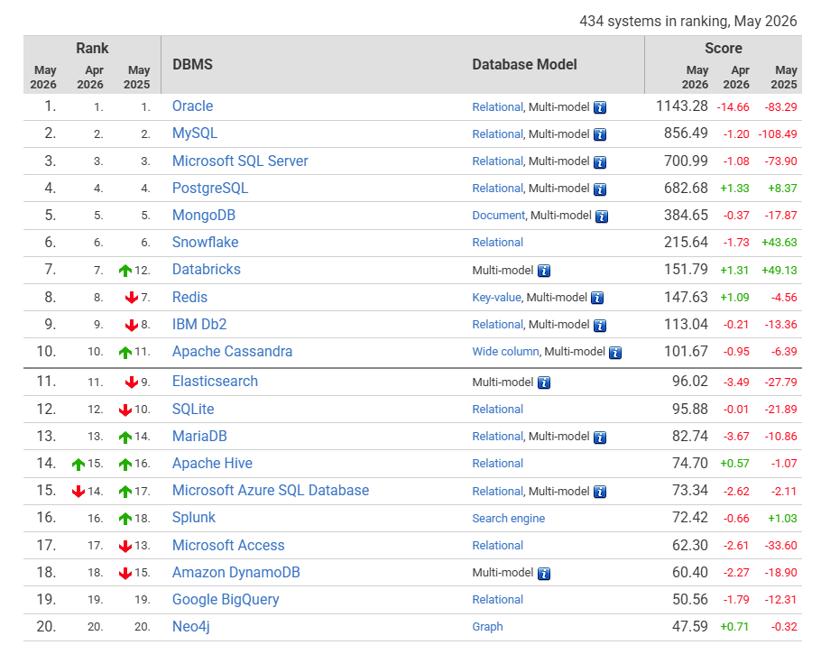
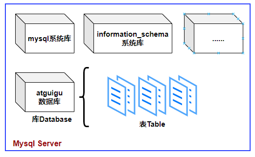
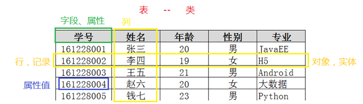
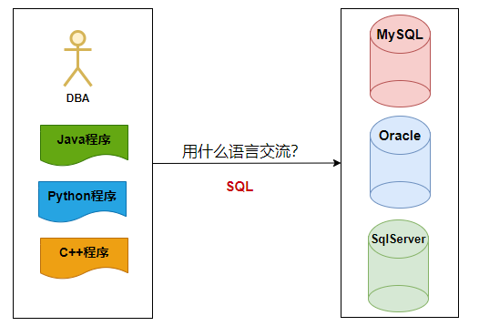
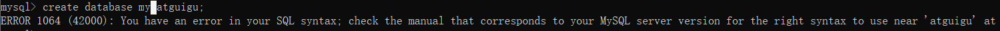
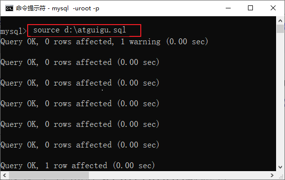
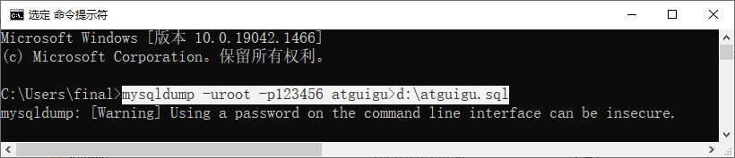

# 第1章 MySQL数据库概述

## 1.1 基本概念

### 1.1.1 为什么要用数据库？

- 数据库是什么？
  - 集合存储和管理数据的地方
  - DB：数据库（Database）
- 为什么要用数据库？
  - 集中存储和管理
  - 按照一定的结构组织和管理，便于检索和维护
- 数据的持久化？
  - 数据存储在内存中，虽然效率更高，但是一旦程序崩溃或断定，数据就会丢失
  - 将数据写到可掉电式设备中，通常按一定格式写到文件中，才能永久保存
- 用普通文件存储行不行？
  - 把数据写入到硬盘上的文件中，当然可以实现持久化的目标，但是不利于后期的检索和管理等。
- MySQL、Oracle、SqlServer是什么？
  - MySQL、Oracle、SqlServer都是数据库管理系统（DBMS，Database Management System）是一种操纵和管理数据库的大型软件，例如建立、使用和维护数据库。

### 1.1.2 MySQL数据库管理系统

在互联网行业，MySQL数据库毫无疑问已经是最常用的数据库。MySQL数据库由瑞典MySQL AB公司开发。公司名中的“AB”是瑞典语“aktiebolag”股份公司的首字母缩写。该公司于2008年1月16号被Sun（Stanford University Network）公司收购。然而2009年，SUN公司又被Oracle收购。因此，MySQL数据库现在隶属于Oracle（甲骨文）公司。MySQL中的“My”是其发明者（Michael Widenius，通常称为Monty）根据其女儿的名字来命名的。对这位发明者来说，MySQL数据库就仿佛是他可爱的女儿。

MySQL的优点有很多，其中主要的优势有如下几点：

- 可移植性：MySQL数据库几乎支持所有的操作系统，如Linux、Solaris、FreeBSD、Mac和Windows。
- 免费：MySQL的社区版完全免费，一般中小型网站的开发都选择 MySQL 作为网站数据库。
- 开源：2000 年，MySQL公布了自己的源代码，并采用GPL（GNU General Public License）许可协议，正式进入开源的世界。开源意味着可以让更多人审阅和贡献源代码，可以吸纳更多优秀人才的代码成果。
- 关系型数据库：MySQL可以利用标准SQL语法进行查询和操作。
- 速度快、体积小、容易使用：与其他大型数据库的设置和管理相比，其复杂程度较低，易于学习。MySQL的早期版本（主要使用的是MyISAM引擎）在高并发下显得有些力不从心，随着版本的升级优化（主要使用的是InnoDB引擎），在实践中也证明了高压力下的可用性。从2009年开始，阿里的“去IOE”备受关注，淘宝DBA团队再次从Oracle转向MySQL，其他使用MySQL数据库的公司还有Facebook、Twitter、YouTube、百度、腾讯、去哪儿、魅族等等，自此，MySQL在市场上占据了很大的份额。
- 安全性和连接性：十分灵活和安全的权限和密码系统，允许基于主机的验证。连接到服务器时，所有的密码传输均采用加密形式，从而保证了密码安全。由于MySQL是网络化的，因此可以在因特网上的任何地方访问，提高数据共享的效率。
- 丰富的接口：提供了用于C、C++、Java、PHP、Python、Ruby和Eiffel、Perl等语言的API。
- 灵活：MySQL并不完美，但是却足够灵活，能够适应高要求的环境。同时，MySQL既可以嵌入到应用程序中，也可以支持数据仓库、内容索引和部署软件、高可用的冗余系统、在线事务处理系统等各种应用类型。
- MySQL最重要、最与众不同的特性是它的存储引擎架构，这种架构的设计将查询处理（Query Processing）及其他系统任务（Server Task）和数据的存储/提取相分离。这种处理和存储分离的设计可以在使用时根据性能、特性，以及其他需求来选择数据存储的方式。MySQL中同一个数据库，不同的表格可以选择不同的存储引擎。其中使用最多的是InnoDB 和MyISAM，MySQL5.5之后InnoDB是默认的存储引擎。

针对不同用户，MySQL提供三个不同的版本。

（1）MySQL Enterprise Server（企业版）：能够以更高的性价比为企业提供数据仓库应用，该版本需要付费使用，官方提供电话技术支持。

（2）MySQL Cluster（集群版）：MySQL 集群是 MySQL 适合于分布式计算环境的高可用、高冗余版本。它采用了 NDB Cluster 存储引擎，允许在 1 个集群中运行多个 MySQL 服务器。它不能单独使用，需要在社区版或企业版基础上使用。

（3）MySQL Community Server（社区版）：在开源GPL许可证之下可以自由的使用。该版本完全免费，但是官方不提供技术支持。本书是基于社区版讲解和演示的。在MySQL 社区版开发过程中，同时存在多个发布系列，每个发布处在不同的成熟阶段。

- MySQL5.7（RC）是当前稳定的发布系列。RC（Release Candidate候选版本）版只针对严重漏洞修复和安全修复重新发布，没有增加会影响该系列的重要功能。从MySQL 5.0、5.1、5.5、5.6直到5.7都基于5这个大版本，升级的小版本。5.0版本中加入了存储过程、服务器端游标、触发器、视图、分布式事务、查询优化器的显著改进以及其他的一些特性。这也为MySQL 5.0之后的版本迈向高性能数据库的发展奠定了基础。
- MySQL8.1（GA）是最新开发的稳定发布系列。GA（General Availability正式发布的版本）是包含新功能的正式发布版本。这个版本是MySQL数据库又一个开拓时代的开始。

### 1.1.3 关系型数据库和非关系型数据库

以下是2026年《DB-Engines Ranking》对各数据库受欢迎程度进行调查后的统计结果（查看数据库最新排名：https://db-engines.com/en/ranking）



上面的数据库分为：关系型数据库和非关系数据库。

- MySQL、Oracle、SqlServer等是关系型数据库管理系统。
- MongoDB、Redis、Elasticsearch等是非关系型数据库管理系统。

1、关系型数据库

关系型数据库，采用关系模型来组织数据，简单来说，**关系模型指的就是二维表格模型**。类似于Excel工作表。





2、No-SQL

大数据时代的来临，数据不仅仅是文本格式，还有视频，音频，图片多媒体结构的数据。数据多样性的特点需要非关系型数据库来进行存储。NoSQL最常见的解释是“non-relational”， “Not Only SQL”也被很多人接受。NoSQL仅仅是一个概念，泛指非关系型的数据库，区别于关系数据库。

NoSQL数据库种类繁多，但是一个共同的特点都是去掉关系数据库的关系型特性。因为数据之间无关系性，数据库的结构简单，所以具有非常高的读写性能，尤其在大数据量下，同样表现优秀。因为数据之间无关系性，这样就非常容易扩展，无形之间也在架构的层面上带来了可扩展的能力。

非关系型数据库分为以下几类：

（1）键值存储——每个单独的项都存储为键值对。键值存储是所有NoSQL数据库中最简单的数据库。例如Redis, Riak等。

核心格式：`key = value` ，比如 `name = "张三"` 、`user:1001 = {id:1001,age:20}`

（2）文档数据库——文档存储是基于键值对存储的，其结构较之于键值对存储更为复杂，可以说在键值对的基础上更深入了一步，将每个键与称为文档的复杂数据结构配对。文档存储是假定一个特定文档的结构可以使用一种特定的模式来说明，文档存储不会去关心那些所谓的标准化，只要数据在该结构下是有意义的就可以。例如MongoDB、Apache CouchDB、Couchbase等。

（3）宽列存储——基于列的数据库会将每一列分开单独存放，这种设计看起来很像基于行的数据库在每一列上都加了索引一样。数据库索引这种数据结构以牺牲存储空间和更多的写文件（索引更新）为代价使查找速度得到提升。索引是将行号映射到数据上，而基于列数据库是将数据映射到行号上面，这样的方式用于计算是很简单的。例如查找有多少人的爱好包含archery（箭术）是很容易计算出来的。除此之外将每一列单独存放可以优化压缩因为每张表中只存一类数据。而且在基于列的数据库中要想增加一列新的数据是很容易的，因为现有的那些列是不会受新增列的影响的。但是要想增加一整条记录就需要适应所有的表，防止各个表的数据之间对应关系出现错误。因此这使得基于行的数据库在事务处理的时候要优胜于基于列的数据库，因为它很好的实现了数据的实时更新。例如：Cassandra，Hbase，Scylla。

（4）图形存储——这些存储关于图形、网络的信息，例如社会关系、路线图、交通链接。例如：Neo4j，AllegroGraph。图形或者网络数据有两部分组成：

Node：实体本身，在一个社会关系中可以认为是一个人。

Edge：实体之间的关系。这个关系可以用一条线来表示，这条线有它自己的属性、方向。

## 1.2 SQL

### 1.2.1 什么是SQL

SQL：结构化查询语言，（Structure Query Language），专门用来操作/访问关系型数据库的通用语言。



### 1.2.2 SQL演示

1、查看所有的数据库

```sql
show databases;
```

2、创建自己的数据库

```sql
create database 数据库名;

#创建atguigudb数据库
create database atguigudb;
```

3、使用自己的数据库

```sql
use 数据库名;

#使用atguigudb数据库
use atguigudb;
```

说明：如果没有使用use语句，后面针对数据库的操作也没有加“数据名”的限定，那么会报“ERROR 1046 (3D000): No database selected”（没有选择数据库）

使用完use语句之后，如果接下来的SQL都是针对一个数据库操作的，那就不用重复use了，如果要针对另一个数据库操作，那么要重新use。

4、创建新的表格

```sql
create table 【数据库名.】表名称( #如果新表是建在use的数据库中，可以省略表名前面的“数据库名.”
	字段名  数据类型,
	字段名 数据类型
);
```

说明：如果是最后一个字段，后面就用加逗号，因为逗号的作用是分割每个字段。

```sql
#创建学生表
create table student(
	id int,
    name varchar(20)  #要求名字最长不超过20个字符
);
```

5、查看定义好的表结构

```sql
desc 【数据库名.】表名称;
```

```sql
desc student; #如果要查看的表是在前面use的数据库中，可以省略表名前面的“数据库名.”
```

6、添加一条记录

```sql
insert into 【数据库名.】表名称 values(值列表);

#添加两条记录到student表中
#如果要添加记录的表是在前面use的数据库中，可以省略表名前面的“数据库名.”
insert into student values(1,'张三');
insert into student values(2,'李四');
```

7、查看一个表的数据

```sql
select * from 【数据库名.】表名称; #*表示查看所有列
```

```sql
select * from student;
```

### 1.2.3 SQL的分类

- DDL语句：数据定义语句（Data Define Language），例如：创建（create），修改（alter），删除（drop）等

- DML语句：数据操作语句（Data Manipulation Language），例如：增（insert)，删（delete），改（update），查（select）

  - 因为查询语句使用的非常的频繁，所以很多人把查询语句单拎出来一类，DQL（数据查询语言），DR（获取）L

- DCL语句：数据控制语句（Data Control Language），例如：grant，revoke等 
- TCL语句：事务控制语句（Transaction Control Language），例如：commit，rollback等
- 其他语句：USE语句，SHOW语句，SET语句等。这类的官方文档中一般称为命令。


### 1.2.4 SQL语法规范

（1）mysql的sql语法不区分大小写

A：数据库的表中的数据是否区分大小写。这个的话要看表格的字段的数据类型、编码方式以及校对规则。

ci（大小写不敏感），cs（大小写敏感），_bin（二元，即比较是基于字符编码的值而与language无关，区分大小写）

B：sql中的关键字，比如：create,insert等，不区分大小写。但是大家习惯上把关键字都“大写”。

（2）命名时：尽量使用26个英文字母大小写，数字0-9，下划线，不要使用其他符号，不要使用纯数字来命名

（3）建议不要使用mysql的关键字等来作为表名、字段名、数据库名等，

（4）习惯上在SQL语句中表名、字段名、数据库名等使用`（飘号，反引号）引起来

（5）同一个mysql软件中，数据库不能同名，同一个库中，表不能重名，同一个表中，字段不能重名

```sql
mysql> show databases;
+--------------------+
| Database           |
+--------------------+
| information_schema |
| atguigudb          |
| mysql              |
| performance_schema |
| sys                |
+--------------------+
5 rows in set (0.00 sec)

mysql> create database atguigudb;
ERROR 1007 (HY000): Can't create database 'atguigudb'; database exists
```

```sql
mysql> show tables;
+---------------------+
| Tables_in_atguigudb |
+---------------------+
| student             |
| temp                |
+---------------------+
2 rows in set (0.00 sec)

mysql> create table temp(id int);
ERROR 1050 (42S01): Table 'temp' already exists
```

```
mysql> create table tt(
    ->  id int,
    ->  id int
    -> );
ERROR 1060 (42S21): Duplicate（重复） column name 'id'
```

（6）数据库和表名、字段名等对象名中间不要包含空格

```sql
create database my atguigu;

ERROR 1064 (42000): You have an error in your SQL syntax; check the manual that corresponds to your MySQL server version for the right syntax to use near 'atguigu' at line 1
```



（7）给字段和表取别名时，as可以省略

- 表的别名不能包含空格，因为表的别名不能加双引号
- 如果给字段取别名，也尽量不包含空格，包含字段别名中包含空格，请用双引号


```sql
select 字段名1 as 别名1, 字段名2 as 别名2 from 表名称 as 别名;
```

```sql
mysql> select * from student;
+------+------+
| id   | name |
+------+------+
|    1 | 张三 |
|    2 | 李四 |
+------+------+
2 rows in set (0.00 sec)

mysql> select id "学号",name "姓名" from student 学生表;
+------+------+
| 学号 | 姓名 |
+------+------+
|    1 | 张三 |
|    2 | 李四 |
+------+------+
2 rows in set (0.00 sec)

mysql> select id 学号,name 姓名 from student;
+------+------+
| 学号 | 姓名 |
+------+------+
|    1 | 张三 |
|    2 | 李四 |
+------+------+
2 rows in set (0.00 sec)

mysql> select id 学 号,name 姓 名 from student; 
ERROR 1064 (42000): You have an error in your SQL syntax; check the manual that corresponds to your MySQL server version for the right syntax to use n
ear '号,name 姓 名 from student' at line 1
```


### 1.2.5 标点符号

mysql脚本中标点符号的要求如下：

- 本身成对的标点符号必须成对，例如：()，''，""。

- 所有标点符号必须英文状态下半角输入方式下输入。


几个特殊的标点符号：

- 小括号()：在创建表、添加数据、函数使用、子查询、计算表达式等等会用（）表示某个部分是一个整体结构。

- 单引号''：字符串和日期类型的数据值使用单引号''引起来，数值类型的不需要加标点符号。
- 双引号""：列的别名可以使用双引号""，给表名取别名==不要使用==双引号。


```sql
create table tt(
    id int
    ;
    
ERROR 1064 (42000): You have an error in your SQL syntax; check the manual that corresponds to your MySQL server version for the right syntax to use near '' at line 2
```

```sql
create table temp(
	c char
);
insert into temp values('尚) ; #缺一半单引号
                        
insert into temp values(‘尚’) ;  #标点符号是中文
```

```sql
mysql> select * from student;
+------+------+
| id   | name |
+------+------+
|    1 | 张三 |
|    2 | 李四 |
+------+------+
2 rows in set (0.00 sec)

mysql> select id "学号",name "姓名" from student;
+------+------+
| 学号 | 姓名 |
+------+------+
|    1 | 张三 |
|    2 | 李四 |
+------+------+
2 rows in set (0.00 sec)
```

### 1.2.6 SQL脚本中如何加注释

SQL脚本中如何加注释

- 单行注释：#注释内容（mysql特有的）

- 单行注释：--空格注释内容    其中--后面的空格必须有

- 多行注释：/* 注释内容 */

```sql
create table tt(
	id int, #编号
    `name` varchar(20), -- 姓名
    gender enum('男','女')
    /*
    性别只能从男或女中选择一个，
    不能两个都选，或者选择男和女之外的
    */
);
```

## 1.3 导入导出sql脚本

### 1.3.1 导入执行sql脚本命令

在命令行客户端==登录mysql==，使用source指令导入

```sql
mysql> source d:\练习脚本.sql
```

注意：

（1）在使用命令行导入SQL脚本之前，请使用记事本或NotePad++等文本编辑器打开SQL脚本查看SQL脚本中是否有USE语句，如果没有，那么在命令行中需要先使用USE语句指定具体的数据库，否则会报“No database selected”的错误。

（2）sql脚本的路径文件名尽量避免中文，空格，或者路径名太长等情况。



### 1.3.2 导出sql脚本命令

在命令行客户端不登录mysql，使用mysqldump命令。

```cmd
mysqldump -u用戶名 -p密码 数据库名 > 脚本名.sql
mysqldump -u用戶名 -p密码 数据库名 表名 > 脚本名.sql
```


