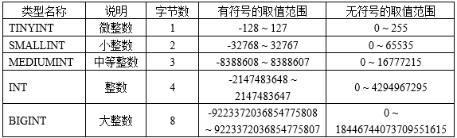
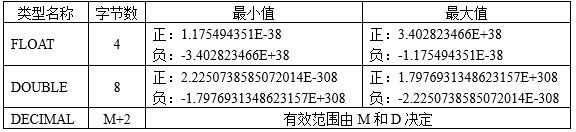
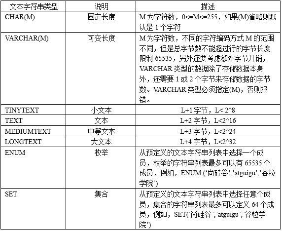
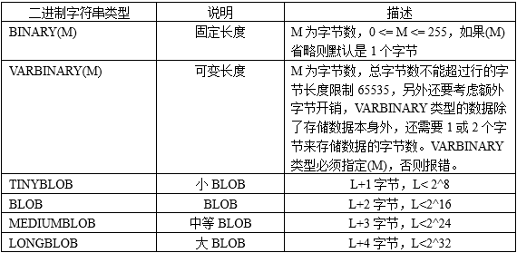
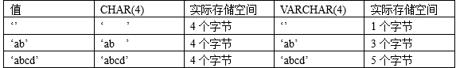
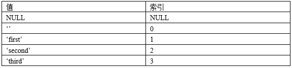
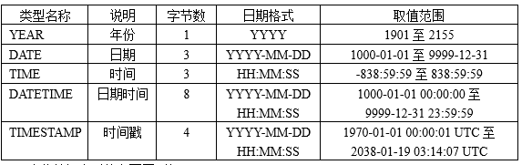

# 第2章 MySQL支持的数据类型

MySQL的数据类型很丰富，包括整数类型、小数类型、字符串类型、日期时间类型、JSON类型、空间类型等。

## 2.1 数值类型：包括整数和小数

数值类型主要用来存储数字，不同的数值类型提供不同的取值范围，可以存储的值范围越大，所需要的存储空间也越大。MySQL支持所有标准SQL中的数值类型，其中包括严格数据类型（INTEGER、SMALLINT、DECIMAL、NUMERIC）和近似数值类型（FLOAT、REAL、DOUBLE PRECISION）。MySQL还扩展了TINYINT、MEDIUMINT和BIGINT等3种不同长度的整数类型，并增加了BIT类型，用来存储位数据。

对于MySQL中的数值类型，还要做如下说明：

- 关键字INT是INTEGER的同义词。
- 关键字DEC和FIXED是DECIMAL的同义词。
- NUMERIC和DECIMAL类型被视为相同的数据类型。

- DOUBLE视为DOUBLE PRECISION的同义词，并在REAL_AS_FLOAT SQL模式未启用的情况下，将REAL也视为DOUBLE PRECISION的同义词。

### 2.1.1 整数类型



说明：

对于整数类型，MySQL还支持在类型名称后面加小括号(M)，而小括号中的M表示显示宽度，M的取值范围是(0, 255)。int(M)这个M在字段的属性中指定了unsigned（无符号）和zerofill（零填充）的情况下才有意义。表示当整数值不够M位时，用0填充。如果整数值超过M位但是没有超过当前数据类型的范围时，就按照实际位数存储。当M宽度超过当前数据类型可存储数值范围的最大宽度时，也是以实际存储范围为准。

MySQL8之前，int没有指定(M)，默认显示(11)。最多能存储和显示11位整数。从MySQL 8.0.17开始，整数数据类型没有zerofill的情况下不推荐使用显示宽度属性，默认显示int。

```sql
#演示整数类型
#创建一个表格，表格的名称“t_int”，
#包含两个字段i1和i2，分别是int和int(2)类型
#create table t_int(i1 int,i2 int(2));
create table t_int(
	i1 int,
	i2 int(2)  #没有unsigned zerofill，(2)没有意义
);

#查看当前数据库的所有表格
show tables;
show tables from 数据库名;

#查看表结构
desc 表名称;
desc t_int;

mysql> desc t_int;
+-------+------+------+-----+---------+-------+
| Field | Type | Null | Key | Default | Extra |
+-------+------+------+-----+---------+-------+
| i1    | int  | YES  |     | NULL    |       |
| i2    | int  | YES  |     | NULL    |       |
+-------+------+------+-----+---------+-------+
2 rows in set (0.01 sec)

#创建一个表格，表格的名称“t_int2”，
#包含两个字段i1和i2，分别是int和int(2)类型
create table t_int2(
	i1 int,
	i2 int(2) unsigned zerofill
);

mysql> desc t_int2;
+-------+--------------------------+------+-----+---------+-------+
| Field | Type                     | Null | Key | Default | Extra |
+-------+--------------------------+------+-----+---------+-------+
| i1    | int                      | YES  |     | NULL    |       |
| i2    | int(2) unsigned zerofill | YES  |     | NULL    |       |
+-------+--------------------------+------+-----+---------+-------+
2 rows in set (0.01 sec)

#添加数据到表格中
insert into 表名称 values(值列表);
insert into t_int values(1234,1234);
insert into t_int2 values(1234,1234);

#查询数据
select * from 表名称;
select * from t_int;
select * from t_int2;

#添加数据到表格中
insert into 表名称 values(值列表);
insert into t_int values(1,1);
insert into t_int2 values(1,1);

insert into t_int values(12222228854225548778455,12222228854225548778455);
mysql> insert into t_int values(12222228854225548778455,12222228854225548778455);
ERROR 1264 (22003): Out of range value for column 'i1' at row 

```


### 2.1.2 小数类型

MySQL中使用浮点数和定点数来表示小数。浮点数有两种类型：单精度浮点数（FLOAT）和双精度浮点数（DOUBLE），定点数只有DECIMAL。浮点数和定点数都可以用(M，D)来表示。

- M是精度，表示该值总共显示M位，包括整数位和小数位，对于FLOAT和DOUBLE类型来说，M取值范围为0~255，而对于DECIMAL来说，M取值范围为0~65。
- D是标度，表示小数的位数，取值范围为0~30，同时必须<=M。

浮点型FLOAT(M，D) 和DOUBLE(M，D)是非标准用法，如果考虑到数据库迁移，则最好不要使用，而且从MySQL 8.0.17开始，FLOAT(M，D) 和DOUBLE(M，D)用法在官方文档中已经明确不推荐使用，将来可能被移除。另外，关于浮点型FLOAT和DOUBLE的UNSIGNED也不推荐使用了，将来也可能被移除。FLOAT和DOUBLE类型在不指定（M，D）时，默认会按照实际的精度来显示。==DECIMAL类型在不指定（M，D）时，默认为（10，0），即只保留整数部分。==例如，定义DECIMAL（5,2）的类型，表示该列取值范围是-999.99~999.99。如果用户插入数据的小数部分位数超过D位，MySQL会四舍五入处理，但是如果用户插入数据的整数部分位数超过“M-D”位，则会报“Out of range”的错误。

DECIMAL实际是以字符串形式存放的，在对精度要求比较高的时候（如货币、科学数据等）使用DECIMAL类型会比较好。浮点数相对于定点数的优点是在长度一定的情况下，浮点数能够表示更大的数据范围，它的缺点是会引起精度问题。



```sql
#演示小数类型
#创建表格
create table t_double(
	d1 double,
	d2 double(5,2)  #-999.99~999.99
);

#查看表结构
desc t_double;

#添加数据
insert into t_double values(2.5,2.5);

#查看数据
select * from t_double;
mysql> select * from t_double;
+------+------+
| d1   | d2   |
+------+------+
|  2.5 | 2.50 |#d2字段小数点后不够2位用0补充
+------+------+
1 row in set (0.00 sec)

#添加数据
insert into t_double values(2.5526,2.5526);
insert into t_double values(2.5586,2.5586);

mysql> select * from t_double;
+--------+------+
| d1     | d2   |
+--------+------+
|    2.5 | 2.50 |
| 2.5526 | 2.55 |#小数点后有截断现象，并且会四舍五入
| 2.5586 | 2.56 |#小数点后有截断现象，并且会四舍五入
+--------+------+
3 rows in set (0.00 sec)


#添加数据
insert into t_double values(12852.5526,12852.5526);

#d2字段整数部分超过(5-2=3)位，添加失败
mysql> insert into t_double values(12852.5526,12852.5526); 
ERROR 1264 (22003): Out of range value for column 'd2' at row 1


#创建表格
create table t_decimal(
	d1 decimal,  #没有指定(M,D)默认是(10,0)
	d2 decimal(5,2)
);


#查看表结构
desc t_decimal;
mysql> desc t_decimal;
+-------+---------------+------+-----+---------+-------+
| Field | Type          | Null | Key | Default | Extra |
+-------+---------------+------+-----+---------+-------+
| d1    | decimal(10,0) | YES  |     | NULL    |       |
| d2    | decimal(5,2)  | YES  |     | NULL    |       |
+-------+---------------+------+-----+---------+-------+
2 rows in set (0.01 sec)

#添加数据
insert into t_decimal values(2.5,2.5);

#查看数据
select * from t_decimal;
mysql> select * from t_decimal;
+------+------+
| d1   | d2   |
+------+------+
|    3 | 2.50 |  #d1字段小数点后截断
+------+------+
1 row in set (0.00 sec)

insert into t_decimal values(12852.5526,12852.5526);

把小数赋值给整数类型的字段时，会截断小数部分，考虑四舍五入
insert into t_int2 values(1.5,1.5);
```

### 2.1.3 bit类型（了解）

bit类型，如果没有指定(M)，默认是1位。这个1位，那么表示只能存1位的二进制值。这里(M)是表示二进制的位数。M范围从1到64。

对于位类型字段，之前版本直接使用SELECT语句将不会看到结果，而在MySQL8版本中默认以“0X”开头的十六进制形式显示，可以通过BIN()函数显示为二进制格式。


```sql
#演示bit类型，存储二进制，只有0和1
#创建一个表格
create table t_bit(
	b1 bit,  #没有指定(M)，默认是1位二进制
	b2 bit(4) #能够存储4位二进制0000~1111
);

#查看表结构
desc t_bit;

mysql> desc t_bit;
+-------+--------+------+-----+---------+-------+
| Field | Type   | Null | Key | Default | Extra |
+-------+--------+------+-----+---------+-------+
| b1    | bit(1) | YES  |     | NULL    |       |
| b2    | bit(4) | YES  |     | NULL    |       |
+-------+--------+------+-----+---------+-------+
2 rows in set (0.01 sec)

#添加记录
insert into t_bit values(1,1);
insert into t_bit values(1,8);

#查看数据
select * from t_bit;

mysql> select * from t_bit;
+------------+------------+
| b1         | b2         |
+------------+------------+
| 0x01       | 0x01       |
| 0x01       | 0x08       |
+------------+------------+
2 rows in set (0.00 sec)


#显示二进制值，需要使用bin函数
select bin(b1),bin(b2) from t_bit;

mysql> select bin(b1),bin(b2) from t_bit;
+---------+---------+
| bin(b1) | bin(b2) |
+---------+---------+
| 1       | 1       |
| 1       | 1000    |
+---------+---------+
2 rows in set (0.00 sec)

#添加记录
insert into t_bit values(1,16); #16的二进制10000
mysql> insert into t_bit values(1,16);
ERROR 1406 (22001): Data too long for column 'b2' at row 1
```


## 2.2 字符串类型

MySQL的字符串类型有CHAR、VARCHAR、BINARY、VARBINARY、BLOB、TEXT、ENUM、SET等。MySQL的字符串类型可以用来存储文本字符串数据，还可以存储二进制字符串。

- 二进制字符串是存储客户端给服务器端传输的字符串的原始二进制值，而文本字符串则会按照表和字段的字符集编码方式对客户端给服务器传输的字符串进行转码处理。

- 二进制字符串严格区分大小写（因为大小写字符的编码值不同），文本字符串在大多数字符集和校对规则中不区分大小写。

文本字符串类型：



二进制字符串类型：



BINARY和VARBINARY类似于CHAR和VARCHAR，只是它们存储的是二进制字符串。

BLOB是一个二进制大对象，用来存储可变数量的二进制字符串，分为TINYBLOB、BLOB、MEDIUMBLOB、LONGBLOB四种类型。TINYTEXT、TEXT、MEDIUMTEXT和LONGTEXT四种文本类型，它们分别对应于以上四种BLOB类型，具有相同的最大长度和存储要求。

BLOB类型与TEXT类型的区别如下：

（1）BLOB类型存储的是二进制字符串，TEXT类型存储的是文本字符串。BLOB类型还可以存储图片和声音等二进制数据。

（2）BLOB类型没有字符集，并且排序和比较基于列值字节的数值，TEXT类型有一个字符集，并且根据字符集对值进行排序和比较。


### 2.2.1 char和varchar

CHAR(M)为固定长度的字符串， M表示最多能存储的字符数，取值范围是0~255个字符，如果未指定(M)表示只能存储1个字符。例如CHAR(4)定义了一个固定长度的字符串列，其包含的字符个数最大为4，如果存储的值少于4个字符，右侧将用空格填充以达到指定的长度，当查询显示CHAR值时，尾部的空格将被删掉。

```sql
create table temp(
	c1 char,
    c2 char(3)
);
```

```sql
insert into temp values('男','女');#成功

insert into temp values('尚硅谷','尚硅谷');#失败
ERROR 1406 (22001): Data too long for column 'c1' at row 1

insert into temp values('男','尚硅谷');#成功
```

VARCHAR(M)为可变长度的字符串，M表示最多能存储的字符数，M的范围由最长的行的大小（通常是65535）和使用的字符集确定。例如utf8mb4字符编码单个字符所需最长字节值为4个字节，所以M的范围是[0, 16383]。而VARCHAR类型的字段实际占用的空间为字符串的实际长度加1或2个字节，这1或2个字节用于描述字符串值的实际字节数，即字符串值在[0,255]个字节范围内，那么额外增加1个字节，否则需要额外增加2个字节。

```sql
create table temp(
	name varchar  #错误
);
```

```sql
create table temp(
	name varchar(3)  #最多不超过3个字符
);
```

```sql
insert into temp values('尚硅谷');

insert into temp values('尚硅谷真好');#ERROR 1406 (22001): Data too long for column 'name' at row 1

insert into temp values('好');
```

```sql
drop table temp;
create table temp(
	name varchar(65535)
);
#ERROR 1074 (42000): Column length too big for column 'name' (max = 21845); use BLOB or TEXT instead
因为当前的表是UTF8，一个汉字占3个字节
```



例如，身份证号、手机号码、QQ号、用户名username、密码password、银行卡号等固定长度的文本字符串适合使用CHAR类型，而评论、朋友圈、微博不定长度的文本字符串更适合使用VARCHAR类型。

另外，存储引擎对于选择CHAR和VARCHAR是有影响的。

- 对于MyISAM存储引擎，最好使用固定长度的数据列代替可变长度的数据列。这样可以使整个表静态化，从而使数据检索更快，用空间换时间。
- 对于InnoDB存储引擎，使用可变长度的数据列，因为InnoDB数据表的存储格式不分固定长度和可变长度，因此使用CHAR不一定比使用VARCHAR更好，但由于VARCHAR是按照实际的长度存储的，比较节省空间，所以对磁盘I/O和数据存储总量比较好。

### 2.2.2 Enum和Set类型

无论是数值类型、日期类型、普通的文本类型，可取值的范围都非常大，但是有时候我们指定在固定的几个值范围内选择一个或多个，那么就需要使用ENUM枚举类型和SET集合类型了。比如性别只有“男”或“女”；上下班交通方式可以有“地铁”、“公交”、“出租车”、“自行车”、“步行”等。枚举和集合类型字段声明的语法格式如下：

字段名ENUM（‘值1’，‘值2’，…‘值n’）

字段名 SET（‘值1’，‘值2’，…‘值n’）

ENUM类型的字段在赋值时，只能在指定的枚举列表中取值，而且一次只能取一个。枚举列表最多可以有65535个成员。ENUM值在内部用整数表示，每个枚举值均有一个索引值， MySQL存储的就是这个索引编号。例如，定义ENUM类型的列(‘first’, ‘second’, ‘third’)。



SET类型的字段在赋值时，可从定义的值列表中选择1个或多个值的组合。SET列最多可以有64个成员。SET值在内部也用整数表示，分别是1，2，4，8……，都是2的n次方值，因为这些整数值对应的二进制都是只有1位是1，其余是0。


演示枚举类型：

```sql
create table temp(
	gender enum('男','女'),
    hobby set('睡觉','打游戏','泡妞','写代码')
);
```

```sql
insert into temp values('男','睡觉,打游戏'); #成功

insert into temp values('男,女','睡觉,打游戏'); #失败
#ERROR 1265 (01000): Data truncated for column 'gender' at row 1

insert into temp values('妖','睡觉,打游戏');#失败
ERROR 1265 (01000): Data truncated for column 'gender' at row 1

insert into temp values('男','睡觉,打游戏,吃饭');
ERROR 1265 (01000): Data truncated for column 'hobby' at row 1
```

```sql
#文本类型中的枚举和集合
#枚举：固定的几个字符串值，从中选择一个
#集合：固定的几个字符串值，从中选择任意几个

create table t_enum_set(
	gender enum('男','女'),
	hobby set('游戏','睡觉','打代码','运动')
);

#查看表结构
desc t_enum_set;

mysql> desc t_enum_set;
+--------+------------------------------------+------+-----+---------+-------+
| Field  | Type                               | Null | Key | Default | Extra |
+--------+------------------------------------+------+-----+---------+-------+
| gender | enum('男','女')                    | YES  |     | NULL    |       |
| hobby  | set('游戏','睡觉','打代码','运动') | YES  |     | NULL    |       |
+--------+------------------------------------+------+-----+---------+-------+
2 rows in set (0.01 sec)


#添加数据
insert into t_enum_set
values('男','游戏');

#查看数据
select * from t_enum_set;

#添加数据
insert into t_enum_set
values('男,女','游戏,睡觉');

mysql> insert into t_enum_set
    -> values('男,女','游戏,睡觉');
ERROR 1265 (01000): Data truncated for column 'gender' at row 1

#添加数据
insert into t_enum_set
values('男','游戏,睡觉');

#添加数据
insert into t_enum_set
values('妖','游戏,睡觉');
mysql> insert into t_enum_set
    -> values('妖','游戏,睡觉');
ERROR 1265 (01000): Data truncated for column 'gender' at row 1

#添加数据
insert into t_enum_set
values('男','游戏,睡觉,做饭');
mysql> insert into t_enum_set
    -> values('男','游戏,睡觉,做饭');
ERROR 1265 (01000): Data truncated for column 'hobby' at row 1


insert into t_enum_set
values(2, 2);

mysql> select * from t_enum_set;
+--------+-----------+
| gender | hobby     |
+--------+-----------+
| 男     | 游戏      |
| 男     | 游戏,睡觉 |
| 女     | 睡觉      |
+--------+-----------+
3 rows in set (0.00 sec)


insert into t_enum_set
values(2, 5);
#5 可以看出 1和4的组合，00001 和 0100，0101


insert into t_enum_set
values(2, 7);
mysql> select * from t_enum_set;
+--------+------------------+
| gender | hobby            |
+--------+------------------+
| 男     | 游戏             |
| 男     | 游戏,睡觉        |
| 女     | 睡觉             |
| 女     | 游戏,打代码      |
| 女     | 游戏,睡觉,打代码 |
+--------+------------------+
5 rows in set (0.00 sec)

insert into t_enum_set
values(2, 15);
mysql> select * from t_enum_set;
+--------+-----------------------+
| gender | hobby                 |
+--------+-----------------------+
| 男     | 游戏                  |
| 男     | 游戏,睡觉             |
| 女     | 睡觉                  |
| 女     | 游戏,打代码           |
| 女     | 游戏,睡觉,打代码      |
| 女     | 游戏,睡觉,打代码,运动 |
+--------+-----------------------+
6 rows in set (0.00 sec)


insert into t_enum_set
values(2, 25);
mysql> insert into t_enum_set
    -> values(2, 25);
ERROR 1265 (01000): Data truncated for column 'hobby' at row 1
```

### 2.2.3 新特性之默认字符集

在8.0版本之前，MySQL默认的字符集为Latin1，而8.0版本默认字符集为utf8mb4。

Latin1是ISO-8859-1的别名，有些环境下写作Latin-1。ISO-8859-1编码是单字节编码，不支持中文等多字节字符，但向下兼容ASCII。

MySQL中utf8字符集，它是utf8mb3的别称，使用三个字节编码表示一个字符。自MySQL4.1版本被引入，能够支持绝大多数语言的字符，但依然有些字符不能正确编码，如emoji表情字符等，为此MySQL5.5引入了utf8mb4字符集。在MySQL5.7对utf8mb4进行了大幅优化，并丰富了校验字符集。mb4就是“most byte 4”的意思，专门用来兼容四字节的Unicode，utf8mb4编码是utf8编码的超集，兼容utf8，并且能存储4字节的表情字符。如果原来某些库和表的字符集是utf8，可以直接修改为utf8mb4，不需要做其他转换。但是从uft8mb4转回utf8就会有问题。

使用SHOW语句查看MySQL5.7版本数据库的默认编码。

```sql
mysql> #查看MySQL5.7数据库的默认编码
mysql> SHOW VARIABLES LIKE 'character_set_database';
+------------------------+--------+
| Variable_name            | Value  |
+------------------------+--------+
| character_set_database | latin1 |
+------------------------+--------+
1 row in set, 1 warning (0.00 sec)
```

使用SHOW语句查看MySQL8.0版本数据库的默认编码。

```sql
mysql> #查看MySQL8.0数据库的默认编码
mysql> SHOW VARIABLES LIKE 'character_set_database';
+------------------------+---------+
| Variable_name            | Value   |
+------------------------+---------+
| character_set_database | utf8mb4 |
+------------------------+---------+
1 row in set, 1 warning (0.00 sec)
```

字符集校对规则是在字符集内用于字符比较和排序的一套规则，比如有的规则区分大小写，有的则无视。校对规则特征：

- 两个不同的字符集不能有相同的校对规则。
- 每个字符集有一个默认校对规则。
- 校对规则存在命名约定，以其相关的字符集名开始，中间包括一个语言名，并且以_ci、_cs或_bin结尾。其中_ci表示大小写不敏感、_cs表示大小写敏感、bin表示直接比较字符的二进制编码，即区分大小写。

使用SHOW语句查看utf8mb4字符集的部分校对规则如下：

```sql
mysql> SHOW COLLATION LIKE 'utf8mb4_0900%';
+-----------+---------+-----+---------+----------+---------+--------------+
| Collation  | Charset | Id  | Default | Compiled | Sortlen | Pad_attribute|
+-------------------+---------+-----+---------+----------+-------+--------+
|utf8mb4_0900_ai_ci	| utf8mb4 | 255 | Yes    | Yes     |   0 | NO PAD        	|
|utf8mb4_0900_as_ci	| utf8mb4 | 305 |         | Yes     |   0 | NO PAD        	|
|utf8mb4_0900_as_cs	| utf8mb4 | 278 |         | Yes     |   0 | NO PAD        	|
|utf8mb4_0900_bin	| utf8mb4 | 309 |         | Yes     |   1 | NO PAD        	|
+-------------------+---------+-----+---------+----------+---------+------+
4 rows in set (0.00 sec)
```


## 2.3 日期时间类型



- 如果仅仅是表示年份信息，可以只使用YEAR类型，这样更节省空间，格式为“YYYY”，例如“2022”。YEAR允许的值范围是1901\~2155。YEAR还有格式为“YY”2位数字的形式，值是00\~69，表示2000\~2069年，值是70\~99，表示1970~1999年，从MySQL5.5.27开始，2位格式的YEAR已经不推荐使用。YEAR默认格式就是“YYYY”，没必要写成YEAR(4)，从MySQL 8.0.19开始，不推荐使用指定显示宽度的YEAR(4)数据类型。这个0年，如果是以整数的0添加的话，那么是0000年，如果是以日期/字符串的'0'添加的话，是2000年。
- 如果要表示年月日，可以使用DATE类型，格式为“YYYY-MM-DD”，例如“2022-02-04”。
- 如果要表示时分秒，可以使用TIME类型，格式为“HH:MM:SS”，例如“10:08:08”。
- 如果要表示年月日时分秒的完整日期时间，可以使用DATATIME类型，格式为“YYYY-MM-DD HH:MM:SS”，例如“2022-02-04 10:08:08”。
- 如果需要经常插入或更新日期时间为系统日期时间，则通常使用TIMESTAMP类型，格式为“YYYY-MM-DD HH:MM:SS”，例如“2022-02-04 10:08:08”。TIMESTAMP与DATETIME的区别在于TIMESTAMP的取值范围小，只支持1970-01-01 00:00:01 UTC至2038-01-19 03:14:07 UTC范围的日期时间值，其中UTC是世界标准时间，并且TIMESTAMP类型的日期时间值在存储时会将当前时区的日期时间值转换为时间标准时间值，检索时再转换回当前时区的日期时间值，这会更友好。而DATETIME则只能反映出插入时当地的时区，其他时区的人查看数据必然会有误差的。另外，TIMESTAMP的属性受MySQL版本和服务器SQLMode的影响很大。因为timestamp底层存储的是该日期时间距离“1970-01-01 00:00:01 UTC”的秒值，是int类型的，所以存储范围有限。

```sql
#修改当前的时区
set time_zone = '+9:00';
```


```java
   	@Test
	public void test1(){
		long time = Long.MAX_VALUE;
		Date d = new Date(time);
		System.out.println(d);
	}

	@Test
    public void test2(){
        long time = Integer.MAX_VALUE * 1000L; //注意类型，1000L，表示是long类型，相乘结果才能是long类型，否则相乘结果是int，就会被截断，数据丢失
        Date date = new Date(time);
        System.out.println(date);
        //Tue Jan 19 11:14:07 CST 2038
    }

	@Test
    public void test3() {
        int time = Integer.MAX_VALUE;
        System.out.println("time = " + time);//2147483647秒
        LocalDateTime d1 = LocalDateTime.of(1970, 1, 1, 0, 0, 0);
        LocalDateTime d2 = d1.plusSeconds(time);//plus：+ ，Second：秒
        System.out.println(d2);
    }
```

```sql
create table temp(
	d1 datetime,
	d2 timestamp
);
```

```sql
insert into temp values('2021-9-2 14:45:52','2021-9-2 14:45:52');
```

```sql
#修改当前的时区
set time_zone = '+9:00';
```

```sql
insert into temp values('202192144552','202192144552');
#ERROR 1292 (22007): Incorrect datetime value: '202192144552' for column 'd1' at row 1
```

```sql
insert into temp values('20210902144552','20210902144552');
```

```sql
insert into temp values('2021&9&2 14%45%52','2021#9#2 14@45@52');
```

```sql
create table temp(
	d year
);
```

```sql
insert into temp values(2021);
insert into temp values(85);
insert into temp values(22);
insert into temp values(69);
insert into temp values(0);
insert into temp values('0');
```

```sql
mysql> select * from temp;
+------+
| d    |
+------+
| 2021 |
| 1985 |
| 2022 |
+------+
3 rows in set (0.00 sec)
```
