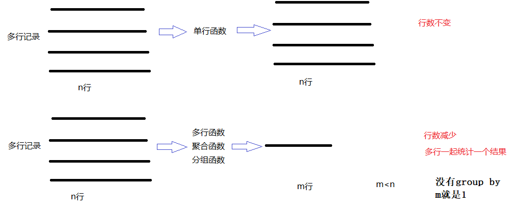
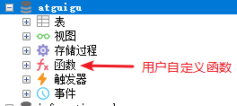

# 第4章 系统预定义函数

函数：代表一个独立的可复用的功能。

和Java中的方法有所不同，不同点在于：MySQL中的函数必须有返回值，参数可以有可以没有。

MySQL中函数分为：

（1）系统预定义函数：MySQL数据库管理软件给我提供好的函数，直接用就可以，任何数据库都可以用公共的函数。

- 分组函数：或者又称为聚合函数，多行函数，表示会对表中的多行记录一起做一个“运算”，得到一个结果。
  - 求平均值的avg，求最大值的max，求最小值的min，求总和sum，求个数的count等
- 单行函数：表示会对表中的每一行记录分别计算，有n行得到还是n行结果
  - 数学函数、字符串函数、日期时间函数、条件判断函数、窗口函数等



（2）用户自定义函数：由开发人员自己定义的，通过CREATE FUNCTION语句定义，是属于某个数据库的对象。



## 4.1 分组函数

调用完函数后，结果的行数变少了，可能得到一个值，可能得到少数几行。分组函数是合并计算。

**最基本分组函数类型**

* **AVG(x)** ：求平均值
* **SUM(x)**：求总和
* **MAX(x)** ：求最大值
* **MIN(x)** ：求最小值
* **COUNT(x) **：统计记录数

```sql
#演示分组函数，聚合函数，多行函数
#统计t_employee表的员工的数量
SELECT COUNT(*) FROM t_employee;
SELECT COUNT(1) FROM t_employee;
SELECT COUNT(eid) FROM t_employee;
SELECT COUNT(commission_pct) FROM t_employee;

/*
count(*)或count(常量值)：都是统计实际的行数。
count(字段/表达式)：只统计“字段/表达式”部分非NULL值的行数。
*/

#找出t_employee表中最高的薪资值
SELECT MAX(salary) FROM t_employee;

#找出t_employee表中最低的薪资值
SELECT MIN(salary) FROM t_employee;

#统计t_employee表中平均薪资值
SELECT AVG(salary) FROM t_employee;

#统计所有人的薪资总和，财务想看一下，一个月要准备多少钱发工资
SELECT SUM(salary) FROM t_employee; #没有考虑奖金
SELECT SUM(salary+salary*IFNULL(commission_pct,0)) FROM t_employee; 

#找出年龄最小、最大的员工的出生日期
SELECT MAX(birthday),MIN(birthday) FROM t_employee;

#查询最新入职的员工的入职日期
SELECT MAX(hiredate) FROM t_employee;
```

## 4.2 单行函数（简单了解）

调用完函数后，记录数不变，一行计算完之后还是一行。单行函数有很多，大致分为：

- 数学函数

- 字符串函数

- 日期时间函数

- 加密函数

- 系统信息函数

- 条件判断函数

- 其他函数

  - JSON函数：从5.7.8版本之后开始支持JSON数据类型，并提供了操作JSON类型的数据的相关函数。

  - 空间函数：MySQL提供了非常丰富的空间函数以支持各种空间数据的查询和处理。
  - 窗口函数：MySQL 从版本 8.0 开始正式支持窗口函数（Window Functions）。这个部分看新特性。

  

### 4.2.1 数学函数

以下表格中也只是列出了一部分

| 函数          | 用法                                                         |
| ------------- | ------------------------------------------------------------ |
| ABS(x)        | 返回x的绝对值                                                |
| CEIL(x)       | 返回大于x的最小整数值                                        |
| FLOOR(x)      | 返回小于x的最大整数值                                        |
| MOD(x,y)      | 返回x/y的模                                                  |
| RAND()        | 返回0~1的随机值                                              |
| ROUND(x,y)    | 返回参数x的四舍五入的有y位的小数的值                         |
| TRUNCATE(x,y) | 返回数字x截断为y位小数的结果                                 |
| FORMAT(x,y)   | 强制保留小数点后y位，整数部分超过三位的时候以逗号分割，并且返回的结果是文本类型的 |
| SQRT(x)       | 返回x的平方根                                                |
| POW(x,y)      | 返回x的y次方                                                 |

```sql
#单行函数
#演示数学函数
#在“t_employee”表中查询员工无故旷工一天扣多少钱，
#分别用CEIL、FLOOR、ROUND、TRUNCATE函数。
#假设本月工作日总天数是22天，
#旷工一天扣的钱=salary/22。
SELECT ename,salary/22,CEIL(salary/22),
FLOOR(salary/22),ROUND(salary/22,2),
TRUNCATE(salary/22,2) FROM t_employee; 


#查询公司平均薪资，并对平均薪资分别
#使用CEIL、FLOOR、ROUND、TRUNCATE函数
SELECT AVG(salary),CEIL(AVG(salary)),
FLOOR(AVG(salary)),ROUND(AVG(salary)),
TRUNCATE(AVG(salary),2) FROM t_employee;
```


### 4.2.2 字符串函数

下面列出部分字符串函数：

| 函数                                                         | 功能描述                                                     |
| ------------------------------------------------------------ | ------------------------------------------------------------ |
| CONCAT(S1,S2,……Sn)                                           | 连接S1,S2,……Sn为一个字符串                                   |
| CONCAT_WS(s,S1,S2,……Sn)                                      | 同CONCAT(S1,S2,…)函数，但每个字符串之间要加上s               |
| CHAR_LENGTH(s)                                               | 返回字符串s的字符数                                          |
| LENGTH(s)                                                    | 返回字符串s的字节数，和字符集有关                            |
| LOCATE(str1,str)或  POSITION(str1 in str)或  INSTR(str,str1) | 返回子字符串str1在str中的开始位置                            |
| UPPER(s)或UCASE(s)                                           | 将字符串s的所有字母转成大写字母                              |
| LOWER(s)或LCASE(s)                                           | 将字符串s的所有字母转成小写字母                              |
| LEFT(s,n)                                                    | 返回字符串s最左边的n个字符                                   |
| RIGHT(s,n)                                                   | 返回字符串s最右边的n个字符                                   |
| LPAD(str,len,pad)                                            | 用字符串pad对str最左边进行填充直到str的长度达到len           |
| RPAD(str,len,pad)                                            | 用字符串pad对str最右边进行填充直到str的长度达到len           |
| LTRIM(s)                                                     | 去掉字符串s左侧的空格                                        |
| RTRIM(s)                                                     | 去掉字符串s右侧的空格                                        |
| TRIM(s)                                                      | 去掉字符串s开始与结尾的空格                                  |
| TRIM([BOTH] s1 FROM s)                                       | 去掉字符串s开始与结尾的s1                                    |
| TRIM([LEADING] s1 FROM s)                                    | 去掉字符串s开始处的s1                                        |
| TRIM([TRAILING]s1 FROM s)                                    | 去掉字符串s结尾处的s1                                        |
| INSERT(str,index,len,instr)                                  | 将字符串str从index位置开始len个字符的替换为字符串instr       |
| REPLACE(str,a,b)                                             | 用字符串b替换字符串str中所有出现的字符串a                    |
| REPEAT(str,n)                                                | 返回str重复n次的结果                                         |
| REVERSE(s)                                                   | 将字符串反转                                                 |
| STRCMP(s1,s2)                                                | 比较字符串s1,s2                                              |
| SUBSTRING(s,index,len)                                       | 返回从字符串s的index位置截取len个字符                        |
| SUBSTRING_INDEX(str, 分隔符，count)                          | 如果count是正数，那么从左往右数，第n个分隔符的左边的全部内容。例如，substring_index("www.atguigu.com",".",1)是"www"。如果count是负数，那么从右边开始数，第n个分隔符右边的所有内容。例如，substring_index("www.atguigu.com",".",-1)是"com"。 |

```sql
#字符串函数
#mysql中不支持 + 拼接字符串，需要调用函数来拼接
#（1）在“t_employee”表中查询员工姓名ename和电话tel，
#并使用CONCAT函数，CONCAT_WS函数。
SELECT CONCAT(ename,tel),CONCAT_WS('-',ename,tel) FROM t_employee;


#（2）在“t_employee”表中查询薪资高于15000的男员工姓名，
#并把姓名处理成“张xx”的样式。
#LEFT（s，n）函数表示取字符串s最左边的n个字符，
#而RPAD（s，len，p）函数表示在字符串s的右边填充p使得字符串长度达到len。
SELECT  RPAD(LEFT(ename,1),3,'x'),salary
FROM t_employee
WHERE salary>15000 AND gender ='男';

#（3）在“t_employee”表中查询薪资高于10000的男员工姓名、
#姓名包含的字符数和占用的字节数。
SELECT ename,CHAR_LENGTH(ename) AS 占用字符数,LENGTH(ename) AS 占用字节数量
FROM t_employee
WHERE salary>10000 AND gender ='男';


#（4）在“t_employee”表中查询薪资高于10000的男员工姓名和邮箱email，
#并把邮箱名“@”字符之前的字符串截取出来。
SELECT ename,email,
SUBSTRING(email,1, POSITION('@' IN email)-1)
FROM t_employee
WHERE salary > 10000 AND gender ='男';

#mysql中 SUBSTRING截取字符串位置，下标从1开始，不是和Java一样从0开始。
#mysql中 position等指定字符串中某个字符，子串的位置也不是从0开始，都是从1开始。

SELECT TRIM('    hello   world   '); #默认是去掉前后空白符
SELECT CONCAT('[',TRIM('    hello   world   '),']'); #默认是去掉前后空白符
SELECT TRIM(BOTH '&' FROM '&&&&hello   world&&&&'); #去掉前后的&符号
SELECT TRIM(LEADING '&' FROM '&&&&hello   world&&&&'); #去掉开头的&符号
SELECT TRIM(TRAILING '&' FROM '&&&&hello   world&&&&'); #去掉结尾的&符号
```


### 4.2.3 日期时间函数


| 函数                                                         | 功能描述                                                     |
| ------------------------------------------------------------ | ------------------------------------------------------------ |
| CURDATE()  或  CURRENT_DATE()                                | 返回当前系统日期                                             |
| CURTIME()  或  CURRENT_TIME()                                | 返回当前系统时间                                             |
| NOW() 或 SYSDATE() 或 CURRENT_TIMESTAMP() 或LOCALTIME() 或 LOCALTIMESTAMP() | 返回当前系统日期时间                                         |
| UTC_DATE() 或 UTC_TIME()                                     | 返回当前UTC日期值/时间值                                     |
| UNIX_TIMESTAMP(date)                                         | 返回一个UNIX时间戳                                           |
| YEAR(date) 或 MONTH(date) 或 DAY(date) 或 HOUR(time) 或 MINUTE(time) 或 SECOND(time) | 返回具体的时间值                                             |
| EXTRACT(参数类型 FROM date)                                  | 从日期中提取一部分值，例如extract(YEAR_MONTH FROM '2023-1-1') |
| DAYOFMONTH(date) 或 DAYOFYEAR(date)                          | 返回一月/年中第几天                                          |
| WEEK(date) 或 WEEKOFYEAR(date)                               | 返回一年中的第几周                                           |
| DAYOFWEEK()                                                  | 返回周几，注意，周日是1，周一是2，…周六是7                   |
| WEEKDAY(date)                                                | 返回周几，注意，周一是0，周二是1，…周日是6                   |
| DAYNAME(date)                                                | 返回星期，MONDAY,TUESDAY,…SUNDAY                             |
| MONTHNAME(date)                                              | 返回月份，January,…                                          |
| DATEDIFF(date1,date2) 或 TIMEDIFF(time1,time2)               | 返回date1-date2的日期间隔/返回time1-time2的时间间隔          |
| DATE_ADD(date, INTERVAL  expr  参数类型)或ADDDATE 或 DATE_SUB 或 SUBDATE | 返回与给定日期相差INTERVAL时间段的日期，例如date_add('2023-1-1', interval  '2-3' YEAR_MONTH) |
| ADDTIME(time,expr) 或 SUBTIME(time,expr)                     | 返回给定时间加上/减去expr的时间值                            |
| DATE_FORMAT(date,fmt) 或   TIME_FORMAT(time,fmt)             | 按照字符串fmt格式化日期datetime值/时间time值，例如DATE_FORMAT('2023-09-11 13:45','%Y-%c-%e %p') |
| STR_TO_DATE(str,fmt)                                         | 按照字符串fmt对str进行解析，解析为一个日期，例如STR_TO_DATE('2023-09-11 13:45:45','%Y-%c-%e %H:%i:%s') |
| GET_FORMAT(val_type,format_type)                             | 返回日期时间字符串的显示格式，例如GET_FORMAT(DATE,'JIS')     |

函数中日期时间参数类型说明

| 参数类型 | 描述 | 参数类型      | 描述     |
| -------- | ---- | ------------- | -------- |
| YEAR     | 年   | YEAR_MONTH    | 年月     |
| MONTH    | 月   | DAY_HOUR      | 日时     |
| DAY      | 日   | DAY_MINUTE    | 日时分   |
| HOUR     | 时   | DAY_SECOND    | 日时分秒 |
| MINUTE   | 分   | HOUR_MINUTE   | 时分     |
| SECOND   | 秒   | HOUR_SECOND   | 时分秒   |
| WEEK     | 星期 | MINUTE_SECOND | 分秒     |
| QUARTER  | 一刻 |               |          |

函数中format参数说明

| 格式符 | 说明                                                      | 格式符 | 说明                                                    |
| ------ | --------------------------------------------------------- | ------ | ------------------------------------------------------- |
| %Y     | 4位数字表示年份                                           | %y     | 两位数字表示年份                                        |
| %M     | 月名表示月份（January,…）                                 | %m     | 两位数字表示月份（01,02,03，…）                         |
| %b     | 缩写的月名（Jan.,Feb.,…）                                 | %c     | 数字表示月份（1,2,3…）                                  |
| %D     | 英文后缀表示月中的天数（1st,2nd,3rd,…）                   | %d     | 两位数字表示表示月中的天数（01,02,…）                   |
| %e     | 数字形式表示月中的天数（1,2,3,…）                         | %p     | AM或PM                                                  |
| %H     | 两位数字表示小数，24小时制（01,02,03,…）                  | %h和%I | 两位数字表示小时，12小时制（01,02,03,…）                |
| %k     | 数字形式的小时，24小时制（1,2,3,…）                       | %l     | 数字表示小时，12小时制（1,2,3,…）                       |
| %i     | 两位数字表示分钟（00,01,02,…）                            | %S和%s | 两位数字表示秒（00,01,02,…）                            |
| %T     | 时间，24小时制（hh:mm:ss）                                | %r     | 时间，12小时制（hh:mm:ss）后加AM或PM                    |
| %W     | 一周中的星期名称（Sunday,…）                              | %a     | 一周中的星期缩写（Sun.,Mon.,Tues.,…）                   |
| %w     | 以数字表示周中的天数（0=Sunday,1=Monday,…）               | %j     | 以3位数字表示年中的天数（001,002,…）                    |
| %U     | 以数字表示的的第几周（1,2,3,…）  其中Sunday为周中的第一天 | %u     | 以数字表示年中的年份（1,2,3,…）  其中Monday为周中第一天 |
| %V     | 一年中第几周（01~53），周日为每周的第一天，和%X同时使用   | %X     | 4位数形式表示该周的年份，周日为每周第一天，和%V同时使用 |
| %v     | 一年中第几周（01~53），周一为每周的第一天，和%x同时使用   | %x     | 4位数形式表示该周的年份，周一为每周第一天，和%v同时使用 |
| %%     | 表示%                                                     |        |                                                         |

GET_FORMAT函数中val_type 和format_type参数说明

| 值类型   | 格式化类型 | 显示格式字符串    |
| -------- | ---------- | ----------------- |
| DATE     | EUR        | %d.%m.%Y          |
| DATE     | INTERVAL   | %Y%m%d            |
| DATE     | ISO        | %Y-%m-%d          |
| DATE     | JIS        | %Y-%m-%d          |
| DATE     | USA        | %m.%d.%Y          |
| TIME     | EUR        | %H.%i.%s          |
| TIME     | INTERVAL   | %H%i%s            |
| TIME     | ISO        | %H:%i:%s          |
| TIME     | JIS        | %H:%i:%s          |
| TIME     | USA        | %h:%i:%s %p       |
| DATETIME | EUR        | %Y-%m-%d %H.%i.%s |
| DATETIME | INTERVAL   | %Y%m%d %H%i%s     |
| DATETIME | ISO        | %Y-%m-%d %H:%i:%s |
| DATETIME | JIS        | %Y-%m-%d %H:%i:%s |
| DATETIME | USA        | %Y-%m-%d %H.%i.%s |


```sql
#日期时间函数
/*
获取系统日期时间值
获取某个日期或时间中的具体的年、月等值
获取星期、月份值，可以是当天的星期、当月的月份
获取一年中的第几个星期，一年的第几天
计算两个日期时间的间隔
获取一个日期或时间间隔一定时间后的另个日期或时间
和字符串之间的转换
*/
#（1）获取系统日期。CURDATE（）和CURRENT_DATE（）函数都可以获取当前系统日期。将日期值“+0”会怎么样？
SELECT CURDATE(),CURRENT_DATE();

#（2）获取系统时间。CURTIME（）和CURRENT_TIME（）函数都可以获取当前系统时间。将时间值“+0”会怎么样？
SELECT CURTIME(),CURRENT_TIME();

#（3）获取系统日期时间值。CURRENT_TIMESTAMP（）、LOCALTIME（）、SYSDATE（）和NOW（）
SELECT CURRENT_TIMESTAMP(),LOCALTIME(),SYSDATE(),NOW();

#（4）获取当前UTC（世界标准时间）日期或时间值。
#本地时间是根据地球上不同时区所处的位置调整 UTC 得来的，
#例如，北京时间比UTC时间晚8个小时。
#UTC_DATE(),CURDATE(),UTC_TIME(), CURTIME()
SELECT UTC_DATE(),CURDATE(),UTC_TIME(), CURTIME();


#（5）获取UNIX时间戳。
SELECT UNIX_TIMESTAMP(),UNIX_TIMESTAMP('2022-1-1');

#（6）获取具体的时间值，比如年、月、日、时、分、秒。
#分别是YEAR（date）、MONTH（date）、DAY（date）、HOUR（time）、MINUTE（time）、SECOND（time）。
SELECT YEAR(CURDATE()),MONTH(CURDATE()),DAY(CURDATE());
SELECT HOUR(CURTIME()),MINUTE(CURTIME()),SECOND(CURTIME());


#（7）获取日期时间的指定值。EXTRACT（type FROM date/time）函数
SELECT EXTRACT(YEAR_MONTH FROM CURDATE());

#（8）获取两个日期或时间之间的间隔。
#DATEDIFF（date1，date2）函数表示返回两个日期之间间隔的天数。
#TIMEDIFF（time1，time2）函数表示返回两个时间之间间隔的时分秒。

#查询今天距离员工入职的日期间隔天数
SELECT ename,DATEDIFF(CURDATE(),hiredate) FROM t_employee;

#查询现在距离中午放学还有多少时间
SELECT TIMEDIFF(CURTIME(),'12:0:0');

#（9）在“t_employee”表中查询本月生日的员工姓名、生日。
SELECT ename,birthday
FROM t_employee
WHERE MONTH(CURDATE()) = MONTH(birthday);


#(10)#查询入职时间超过5年的
SELECT ename,hiredate,DATEDIFF(CURDATE(),hiredate) 
FROM t_employee
WHERE DATEDIFF(CURDATE(),hiredate)  > 365*5;
```


### 4.2.4 加密函数

列出了部分的加密函数。

| 函数                  | 用法                                                         |
| --------------------- | ------------------------------------------------------------ |
| password(str)         | 返回字符串str的加密版本，41位长的字符串<font color='red'>（mysql8不再支持）</font> |
| md5(str)              | 返回字符串str的md5值(32位)，也是一种加密方式                 |
| SHA(str)              | 返回字符串str的sha算法加密字符串，40位十六进制值的密码字符串 |
| SHA2(str,hash_length) | 返回字符串str的sha算法加密字符串，密码字符串的长度是hash_length/4。hash_length可以是224、256、384、512、0，其中0等同于默认256。 |

```sql
#加密函数
/*
当用户需要对数据进行加密时，
比如做登录功能时，给用户的密码加密等。
*/
#password函数在mysql8已经移除了
SELECT PASSWORD('123456');

#使用md5加密
SELECT MD5('123456'),SHA('123456'),sha2('123456',0);

SELECT CHAR_LENGTH(MD5('123456')),SHA('123456'),sha2('123456',0);


CREATE TABLE t_user(
id INT PRIMARY KEY AUTO_INCREMENT,
username VARCHAR(20),
PASSWORD VARCHAR(100)
);

INSERT INTO t_user VALUES(NULL,'chai',MD5('123456'));

SELECT * FROM t_user 
WHERE username='chai' AND PASSWORD =MD5('123456');


SELECT * FROM t_user 
WHERE username='chai' AND PASSWORD ='123456';
```

### 4.2.5 系统信息函数

| 函数       | 用法               |
| ---------- | ------------------ |
| database() | 返回当前数据库名   |
| version()  | 返回当前数据库版本 |
| user()     | 返回当前登录用户名 |

```sql
#其他函数
SELECT USER();
SELECT VERSION();
SELECT DATABASE();
```

### 4.2.6 条件判断函数

| 函数                                                         | 功能                                                         |
| ------------------------------------------------------------ | ------------------------------------------------------------ |
| IF(value,t,f)                                                | 如果value是真，返回t,否则返回f                               |
| IFNULL(value1,value2)                                        | 如果value1不为空，返回value1,否则返回value2                  |
| CASE WHEN 条件1  THEN result1 WHEN 条件2  THEN result2 … ELSE resultn END | 依次判断条件，哪个条件满足了，就返回对应的result,所有条件都不满足就返回ELSE的result。如果没有单独的ELSE子句，当所有WHEN后面的条件都不满足时则返回NULL值结果。等价于Java中if...else if.... |
| CASE expr WHEN 常量值1  THEN 值1  WHEN 常量值2  THEN 值2 …  ELSE 值n END | 判断表达式expr与哪个常量值匹配，找到匹配的就返回对应值，都不匹配就返回ELSE的值。如果没有单独的ELSE子句，当所有WHEN后面的常量值都不匹配时则返回NULL值结果。等价于Java中switch....case |

```sql
#条件判断函数
/*
这个函数不是筛选记录的函数，
而是根据条件不同显示不同的结果的函数。
*/
#如果薪资大于20000，显示高薪，否则显示正常
SELECT ename,salary,IF(salary>20000,'高薪','正常')
FROM t_employee;

#计算实发工资
#实发工资 = 薪资 + 薪资 * 奖金比例
SELECT ename,salary,commission_pct,
salary + salary * commission_pct
FROM t_employee;
#如果commission_pct是，计算完结果是NULL

SELECT ename,salary,commission_pct,
salary + salary * IFNULL(commission_pct,0) AS 实发工资
FROM t_employee;


SELECT ename,salary,commission_pct,
ROUND(salary + salary * IFNULL(commission_pct,0),2) AS 实发工资
FROM t_employee;

#查询员工编号，姓名，薪资，等级，等级根据薪资判断，
#如果薪资大于20000，显示“羡慕级别”，
#如果薪资15000-20000，显示“努力级别”，
#如果薪资10000-15000，显示“平均级别”
#如果薪资10000以下，显示“保底级别”
/*mysql中没有if...elseif函数，有case 函数。
等价于if...elseif 
*/
SELECT eid,ename,salary,
CASE WHEN salary>20000 THEN '羡慕级别'
     WHEN salary>15000 THEN '努力级别'
     WHEN salary>10000 THEN '平均级别'
     ELSE '保底级别'
END AS "等级"
FROM t_employee;  

#在“t_employee”表中查询入职7年以上的
#员工姓名、工作地点、轮岗的工作地点数量情况。
/*
计算工作地点的数量，转换为求 work_place中逗号的数量+1。
 work_place中逗号的数量 = work_place的总字符数 -  work_place去掉,的字符数
 work_place去掉, ，使用replace函数
*/
SELECT work_place, 
CHAR_LENGTH(work_place)-CHAR_LENGTH(REPLACE(work_place,',',''))
FROM t_employee;
 
 #类似于Java中switch...case
SELECT ename,work_place,
CASE (CHAR_LENGTH(work_place)-CHAR_LENGTH(REPLACE(work_place,',',''))+1)
WHEN 1 THEN '只在一个地方工作'
WHEN 2 THEN '在两个地方来回奔波'
WHEN 3 THEN '在三个地方流动'
ELSE '频繁出差'
END AS "工作地点数量情况"
FROM t_employee
WHERE DATEDIFF(CURDATE(),hiredate)  > 365*7;
```
