# 第6章 关联查询

## 6.1 什么是关联查询

关联查询是指两个或更多个表一起查询，又称为联合查询，多表查询。


## 6.2 关联查询结果分为几种情况

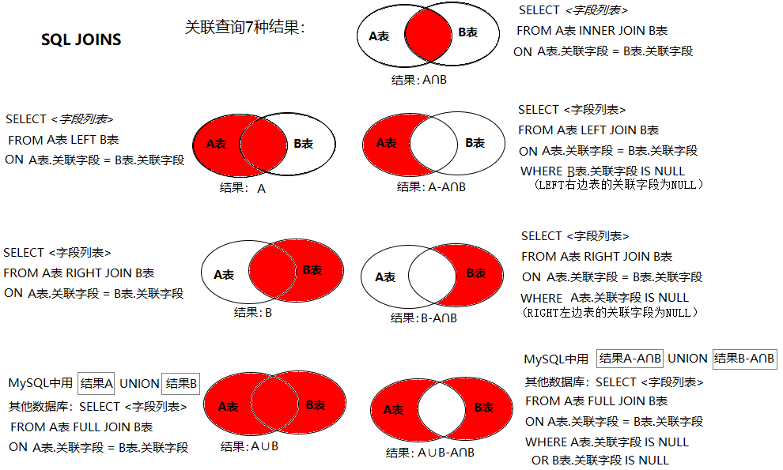

去

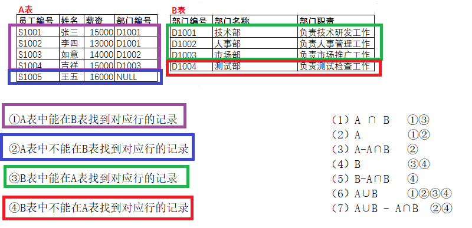

1、A∩B

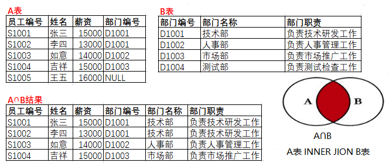

2、A

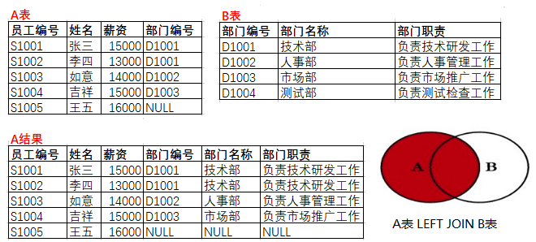

3、A-A∩B

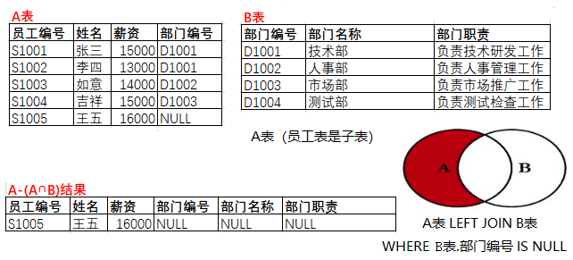

4、B


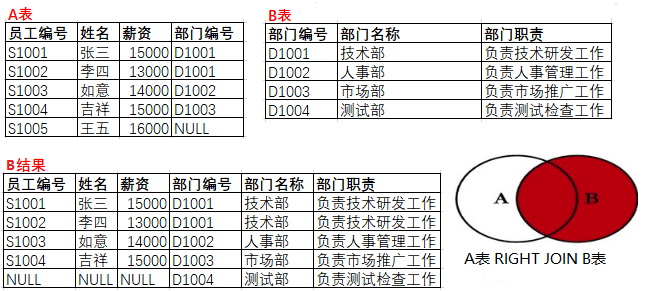

5、B-A∩B

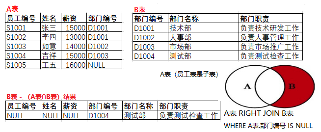

6、A∪B

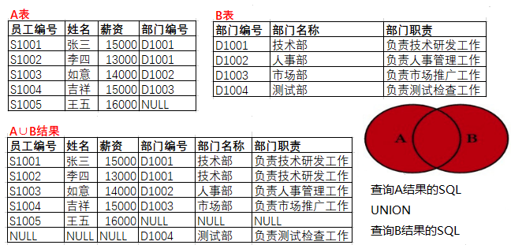

7、A∪B - A∩B


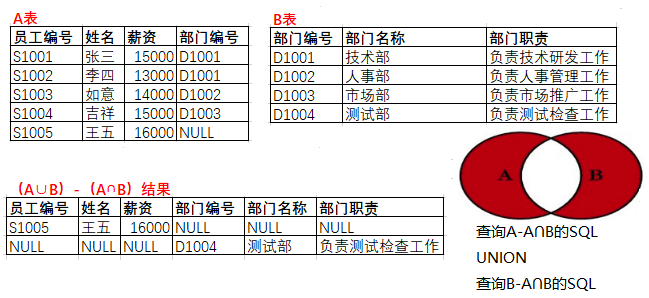


## 6.3  关联查询的SQL有几种情况

### 6.3.1 内连接（inner join)

结果：A表 ∩ B表

```sql
#标准写法
select 字段列表
from A表 inner join B表  #inner可以省略
on A表.关联字段 = B表.关联字段;

#另一种写法
select 字段列表
from A表 , B表 
where 关联条件;
```

```sql
#演示内连接，结果是A∩B
/*
观察数据：
t_employee  看成A表
t_department 看成B表
此时t_employee （A表）中有 李红和周洲的did是NULL，没有对应部门，
    t_department（B表）中有 测试部，在员工表中找不到对应记录的。
*/

#查询所有员工的姓名，部门编号，部门名称
#如果员工没有部门的，不要
#如果部门没有员工的，不要
/*
员工的姓名在t_employee （A表）中
部门的编号，在t_employee （A表）和t_department（B表）都有
部门名称在t_department（B表）中
所以需要联合两个表一起查询。
*/
SELECT ename,did,dname
FROM t_employee INNER JOIN t_department;
#错误Column 'did' in field list is ambiguous
#因为did在两个表中都有，名字相同，它不知道取哪个表中字段了
#有同学说，它俩都是部门编号，随便取一个不就可以吗？
#mysql不这么认为，有可能存在两个表都有did，但是did的意义不同的情况。
#为了避免这种情况，需要在编写sql的时候，明确指出是用哪个表的did

SELECT ename,t_department.did,dname
FROM t_employee INNER JOIN t_department;
#语法对，结果不太对
#结果出现“笛卡尔积”现象， A表记录 * B表记录
/*
（1）凡是联合查询的两个表，必须有“关联字段”，
关联字段是逻辑意义一样，数据类型一样，名字可以一样也可以不一样的两个字段。
比如：t_employee （A表）中did和t_department（B表）中的did。

发现关联字段其实就是可以建外键的字段。当然联合查询不要求一定建外键。

（2）联合查询必须写关联条件，关联条件的个数 = n - 1.
n是联合查询的表的数量。
如果2个表一起联合查询，关联条件数量是1，
如果3个表一起联合查询，关联条件数量是2，
如果4个表一起联合查询，关联条件数量是3，
。。。。
否则就会出现笛卡尔积现象，这是应该避免的。

（3）关联条件可以用on子句编写，也可以写到where中。
但是建议用on单独编写，这样呢，可读性更好。

每一个join后面都要加on子句
A inner|left|right join  B on 条件
A inner|left|right join  B on 条件 inner|left|right jon C on 条件
*/


SELECT ename,t_department.did,dname
FROM t_employee INNER JOIN t_department 
ON t_employee.did = t_department.did;

SELECT *
FROM t_employee INNER JOIN t_department 
ON t_employee.did = t_department.did;


#查询部门编号为1的女员工的姓名、部门编号、部门名称、薪资等情况
SELECT ename,gender,t_department.did,dname,salary
FROM t_employee INNER JOIN t_department 
ON t_employee.did = t_department.did
WHERE t_department.did = 1 AND gender = '女';

#查询部门编号为1的员工姓名、部门编号、部门名称、薪资、职位编号、职位名称等情况
SELECT ename,gender,t_department.did,dname,salary,job_id,jname
FROM t_employee INNER JOIN t_department ON t_employee.did = t_department.did
 INNER JOIN t_job ON t_employee.`job_id` = t_job.`jid`
WHERE t_department.did = 1;

```

### 6.3.2 左连接（left outer join）

查询结果：

- A表全部

- A表- A∩B

```sql
#A表全部
select 字段列表
from A表 left outer join B表 #outer通常省略
on A表.关联字段 = B表.关联字段;
```

```sql
#A- A∩B
select 字段列表
from A表 left outer join B表 #outer通常省略
on A表.关联字段 = B表.关联字段
where B表.关联字段 is null; #结果以A表为主，所以注意写left右边的B表.关联字段 is null
```

```sql
#演示左连接
/*
观察数据：
t_employee  看成A表
t_department 看成B表
此时t_employee （A表）中有 李红和周洲的did是NULL，没有对应部门，
    t_department（B表）中有 测试部，在员工表中找不到对应记录的。
*/
#查询所有员工，包括没有指定部门的员工，他们的姓名、薪资、部门编号、部门名称
SELECT ename,salary,t_department.did,dname
FROM t_employee LEFT JOIN t_department
ON t_employee.did = t_department.did;
#查询的是A结果  A left join B

#查询没有部门的员工信息
SELECT ename,salary,t_department.did,dname
FROM t_employee LEFT JOIN t_department
ON t_employee.did = t_department.did
WHERE t_department.did IS NULL;
#查询的结果是A - A∩B。
```

### 6.3.3 右连接（right outer join）

查询结果：

- B表全部

- B表-A∩B


```sql
#B表全部
select 字段列表
from A表 right join B表
on A表.关联字段 = B表.关联字段;
```

```sql
#B-A∩B
select 字段列表
from A表 right join B表
on A表.关联字段 = B表.关联字段
where A表.关联字段 is null; #结果以B表为主，所以注意写right左边的A表.关联字段 is null
```


```sql
#演示右连接
/*
观察数据：
t_employee  看成A表
t_department 看成B表
此时t_employee （A表）中有 李红和周洲的did是NULL，没有对应部门，
    t_department（B表）中有 测试部，在员工表中找不到对应记录的。
*/
#查询所有部门，包括没有对应员工的部门，他们的姓名、薪资、部门编号、部门名称
SELECT ename,salary,t_department.did,dname
FROM t_employee RIGHT JOIN t_department
ON t_employee.did = t_department.did;
#查询的是B结果

#查询没有员工部门的信息
SELECT ename,salary,t_department.did,dname
FROM t_employee RIGHT JOIN t_department
ON t_employee.did = t_department.did
WHERE t_employee.did IS NULL;
#查询的结果是B - A∩B


#查询所有员工，包括没有指定部门的员工，他们的姓名、薪资、部门编号、部门名称
SELECT ename,salary,t_department.did,dname
FROM t_department RIGHT JOIN t_employee
ON t_employee.did = t_department.did;
#查询的是B结果

#查询没有部门的员工信息
SELECT ename,salary,t_department.did,dname
FROM t_department RIGHT JOIN t_employee
ON t_employee.did = t_department.did
WHERE t_department.did IS NULL;
#查询的结果是B - A∩B  
```

### 6.3.4 union（合并结果）

想要实现A∪B，以及A∪B - A∩B结果，本来应该使用full outer join（全外连接），但是mysql不支持全外连接。mysql使用union（合并）结果的方式代替全外连接。

```sql
#A∪B的结果
查询A的select语句
union [all]
查询B的select语句;

例如：
#A表全部
select 字段列表
from A表 left outer join B表 #outer通常省略
on A表.关联字段 = B表.关联字段
union [all]
#B表全部
select 字段列表
from A表 right join B表
on A表.关联字段 = B表.关联字段;
```

```sql
#A∪B - A∩B结果

查询A-A∩B的select语句
union [all]
查询B-A∩B的select语句;

例如：
#A- A∩B
select 字段列表
from A表 left outer join B表 #outer通常省略
on A表.关联字段 = B表.关联字段
where B表.关联字段 is null #结果以A表为主，所以注意写left右边的B表.关联字段 is null
union [all]
#B-A∩B
select 字段列表
from A表 right join B表
on A表.关联字段 = B表.关联字段
where A表.关联字段 is null; #结果以B表为主，所以注意写right左边的A表.关联字段 is null
```


```sql
/*
union合并时要注意：
（1）两个select语句，select后面的字段列表必须是一样的
（2）UNION ALL表示直接合并结果，如果有重复的记录一并显示
   ALL去掉表示合并结果时，如果有重复记录，去掉。
*/

#查询所有员工和所有部门，包括没有指定部门的员工和没有分配员工的部门。
SELECT *
FROM t_employee LEFT JOIN t_department
ON t_employee.did = t_department.did

UNION 

SELECT *
FROM t_employee RIGHT JOIN t_department
ON t_employee.did = t_department.did;


#以下union会报错
SELECT * FROM t_employee
UNION
SELECT * FROM t_department;
/*
错误代码： 1222
The used SELECT statements have a different number of columns
两个Select语句的列数是不同的。

column：列，表中的字段。
columns：很多的字段，即字段列表
select 字段列表 from 表名称;
*/


#查询那些没有分配部门的员工和没有指定员工的部门，即A表和B表在对方那里找不到对应记录的数据。
SELECT *
FROM t_employee LEFT JOIN t_department
ON t_employee.did = t_department.did
WHERE t_department.did IS NULL

UNION 

SELECT *
FROM t_employee RIGHT JOIN t_department
ON t_employee.did = t_department.did
WHERE t_employee.did IS NULL;
```

## 6.4 自连接

```sql
#演示特殊的联合查询/关联查询/多表查询：自连接
#物理上，是一张表
#逻辑上，是两张表
/*
分析表结构：t_employee表
mid：是表示存储员工的领导编号。即该员工归谁管。领导编号其实就是“领导”作为员工身份的员工编号
   例如：eid为3的员工邓超远，他的mid是7，表示他的领导是员工编号为7的员工。
   eid为7的员工是贾宝玉。贾宝玉具有双重身份，本身是员工，又是别人的领导。
*/
#查询每一个员工自己的编号、名字、薪资和他的领导的编号、姓名、薪资。
SELECT emp.eid,emp.ename,emp.salary,  mgr.eid,mgr.ename,mgr.salary
FROM t_employee AS emp INNER JOIN t_employee AS mgr
ON emp.mid = mgr.eid; 
#把t_employee当成两张表，通过取别名的方式
#t_employee AS emp 把员工表 当成员工表
# t_employee AS mgr 把员工表  当成存储领导信息的领导表
#emp.mid = mgr.eid; 员工表的领导编号就是领导表的员工编号
```

## 6.5 更多表查询

```sql
/*
（1）凡是联合查询的两个表，必须有“关联字段”，
关联字段是逻辑意义一样，数据类型一样，名字可以一样也可以不一样的两个字段。
比如：t_employee （A表）中did和t_department（B表）中的did。

（2）联合查询必须写关联条件，关联条件的个数 = n - 1.
n是联合查询的表的数量。
如果2个表一起联合查询，关联条件数量是1，
如果3个表一起联合查询，关联条件数量是2，
如果4个表一起联合查询，关联条件数量是3，
。。。。

A inner|left|right join  B on 条件
A inner|left|right join  B on 条件 inner|left|right jon C on 条件
```

```sql
#查询所有员工姓名、部门编号、部门名称、薪资、职位编号、职位名称等情况
SELECT ename,gender,t_department.did,dname,salary,job_id,jname
FROM t_employee left JOIN t_department ON t_employee.did = t_department.did
 left JOIN t_job ON t_employee.job_id = t_job.jid;
 
 #查询所有员工姓名、部门编号、部门名称、薪资、职位编号、职位名称等情况，所有员工必须有职位
 SELECT ename,gender,t_department.did,dname,salary,job_id,jname
FROM t_employee left JOIN t_department ON t_employee.did = t_department.did
 inner JOIN t_job ON t_employee.job_id = t_job.jid;
```

## 6.6 关联条件与笛卡尔积

### 6.6.1 关联条件

通常一起查询的表之间是有关联字段，比如：员工表和部门表，这两个表依靠“部门编号”进行关联。通过关联字段，两个表的关系可以分为一对一关系、一对多关系和多对多关系。

1．一对一

该关系中第一个表中的一个行只可以与第二个表中的一个行相关，且第二个表中的一个行也只可以与第一个表中的一个行相关。

例如，“学生信息表”和“饭卡信息表”。“学生信息表”中的一条记录在“饭卡信息表”中只能找到唯一的一条对应记录，反过来也一样，即它们是一一对应关系。这两个表存在相同意义的“学号”字段，使它们建立了一对一关系。

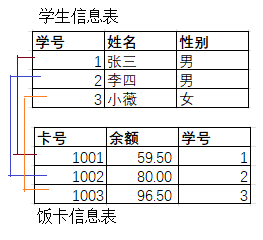

2．一对多

第一个表中的一个行可以与第二个表中的一个或多个行相关，但第二个表中的一个行只可以与第一个表中的一个行相关。

例如，“部门表”和“员工基本信息表”。“部门表”中的一条记录，在“员工基本信息表”中可以找到一条或多条记录对应，但反过来“员工基本信息表”中的一条记录在“部门表”中只能找到一条记录对应，即一个部门可以有多个员工，但是一个员工只能属于一个部门。这两个表存在相同意义的“部门编号”字段，使它们建立了一对多关系。

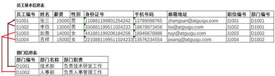

3．多对多

该关系中第一个表中的一个行可以与第二个表中的一个或多个行相关。第二个表中的一个行也可以与第一个表中的一个或多个行相关。通常两个表的多对多关系会借助第三张表，转换为两个一对多的关系。

例如，选课系统的“学生信息表”和“课程信息表”是多对多关系。一个学生可以选择多门课，一门课程可以被多个学生选择，即“学生信息表”中一条记录可以与“课程信息表”多条记录对应，反过来“课程信息表”的一条记录也可以与“学生信息表”中多条记录对应。它们之间借助第三张“选课信息表”实现关联关系，而“学生信息表”与“选课信息表”是一对多关系，“课程信息表”与“选课信息表”也是一对多关系。“选课信息表”中“学号”字段与“学生信息表”中“学号”字段意义相同。“课程信息表”中“课程编号”字段与“课程信息表”中“课程编号”字段意义相同。

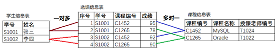

### 6.6.2 笛卡尔积

注意：

- 两个表left join或right join不紧跟on关联条件直接报错。
- 都是inner join的话，关联条件可以写到on中，也可以写到where中，但是建议用on，可读性更好，where用于编写其他筛选条件。
- n表关联查询一定要有n-1个关联条件
- 两个表inner join不紧跟关联条件，或者关联条件数量不对，会产生笛卡尔积。


```sql
drop table if exists student;
create table student(
	sid int primary key,
	sname varchar(255)
);

drop table if exists course;
create table course(
	cid int primary key,
	cname varchar(255)
);

drop table if exists score;
create table score(
	sid int,
	cid int,
	grade int
);

insert into student values(1,'张三'),(2,'李四'),(3,'王五');
insert into course values(1001,'java'),(1002,'mysql');
insert into score values(1,1001,59),(1,1002,96),(2,1001,85),(1,1001,95);
```

#### 1、没有正确处理笛卡尔积

（1）没写关联条件

```sql
select * 
from student inner join course #两个表没有直接关联关系，没有编写关联条件
order by student.sid; 

select *
from student inner join score #两个表有关联关系，但没有编写关联条件
order by student.sid; 
```

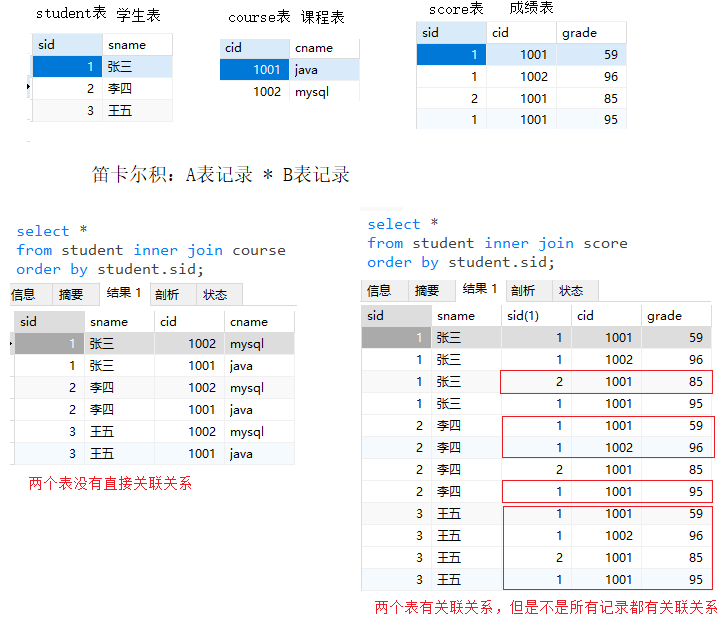

（2）少写关联条件

```sql
select *
from student inner join course inner join score
on course.cid = score.cid; #少了关联条件，3表关联应该编写2个关联条件
```

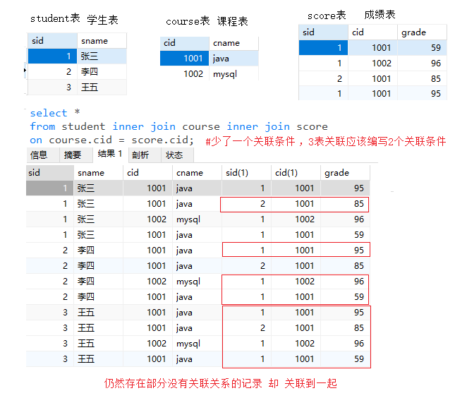

#### 2、完全去除笛卡尔积

```sql
#查询所有参加考试的学生成绩
select *
from student inner join score on student.sid = score.sid
left join course on course.cid = score.cid
order by student.sid;
```

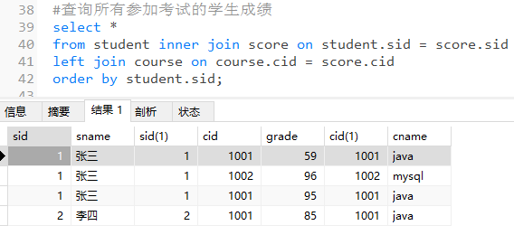

#### 3、利用笛卡尔积

```sql
#查询每个学生每门课的成绩
select *
from student inner join course
left join score on student.sid = score.sid and course.cid = score.cid
order by student.sid;
```

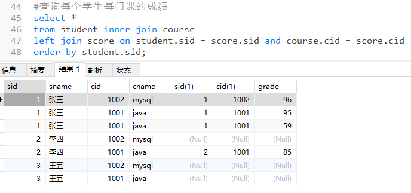
