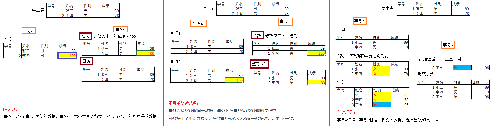
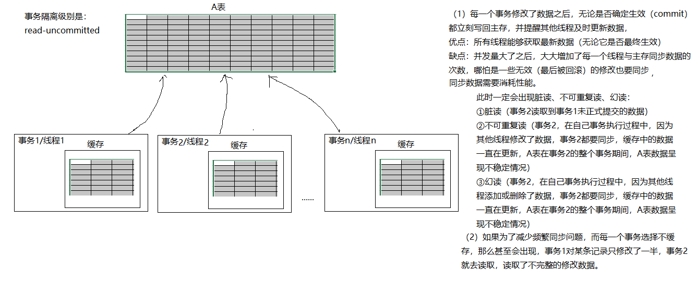
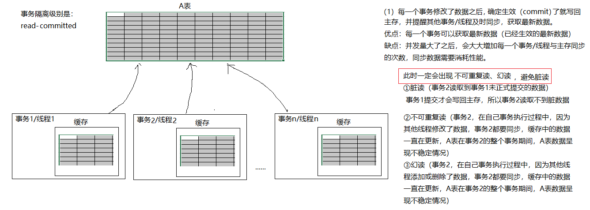
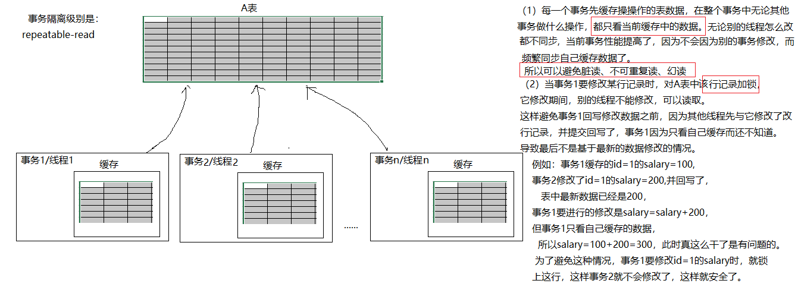
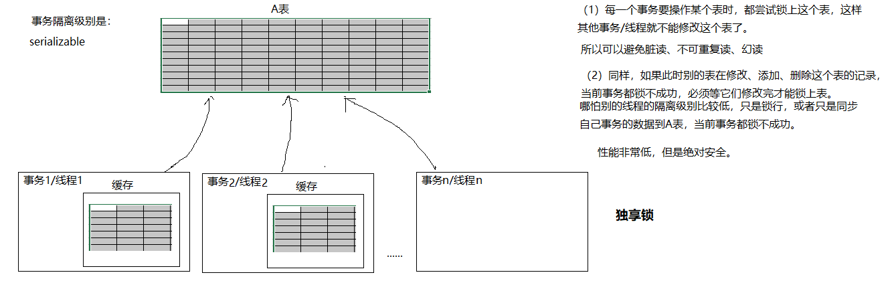

# 第11章 事务

## 11.1 事务的特点

**1、事务处理**（事务操作）：**保证所有事务都作为一个工作单元来执行，即使出现了故障，都不能改变这种执行方式。当在一个事务中执行多个操作时，要么所有的事务都被提交(commit)，那么这些修改就永久地保存下来；要么数据库管理系统将放弃所作的所有修改，整个事务回滚(rollback)到最初状态。**

2、事务的ACID属性：

（1）**原子性（Automicity）**
原子性是指事务是一个不可分割的工作单位，事务中的操作要么都发生，要么都不发生。 

（2）**一致性（Consistency）**
事务必须使数据库从一个一致性状态变换到另外一个一致性状态。

（3）**隔离性（Isolation）**
事务的隔离性是指一个事务的执行不能被其他事务干扰，即一个事务内部的操作及使用的数据对并发的其他事务是隔离的，并发执行的各个事务之间不能互相干扰。

（4）**持久性（Durability）**
持久性是指一个事务一旦被提交，它对数据库中数据的改变就是永久性的，接下来的其他操作和数据库故障不应该对其有任何影响

```sql
/*
原子性：
例如：
张三给李四转账500
张三转账之前余额是1000
李四转账之前余额是1000
成功：张三账号变为500，李四变为1500，
失败：张三账号是1000，李四还是1000.


#一致性
例如：
张三给李四转账500
张三转账之前余额是1000
李四转账之前余额是1000

要么他俩的余额不变， 还是1000，总和就是2000
要么他俩的余额有变化，张三500，李四1500，总和仍然是2000
错误：
张三500，李四1000，总和是1500，结果不对
张三1000，李四1500，总和是2500，结果不对

#隔离性
例如：张三要给李四转500，
      王五要给李四转500，
      张三转账是否成功，和王五是否转账成功无关。
      
      
#持久性：
例如：张三要给李四转500，一旦成功提交，就转账成功，撤不回来了。
      */
```

## 11.2  事务的开启、提交、回滚

MySQL默认情况下是自动提交事务。
每一条语句都是一个独立的事务，一旦成功就提交了。一条语句失败，单独一条语句不生效，其他语句是生效的。

### 11.2.1 手动提交模式

```sql
#开启手动提交事务模式
set autocommit = false;  或  set autocommit = 0;

上面语句执行之后，它之后的所有sql，都需要手动提交才能生效，直到恢复自动提交模式。

#恢复自动提交模式
set autocommit = true; 或 set autocommit = 1;
```

例如：

```sql
SET autocommit = FALSE;#设置当前连接为手动提交模式

UPDATE t_employee SET salary = 15000 
WHERE ename = '孙红雷';

COMMIT;#提交
```

例如：

```sql
SET autocommit = FALSE;#设置当前连接为手动提交模式

UPDATE t_employee SET salary = 15000 
WHERE ename = '孙红雷';

#后面没有提交，直接关了连接，那么这句修改没有生效
```

### 11.2.2 自动提交模式下开启事务

```sql
/*
也可以在自动提交模式下，开启一个事务。
(1)start transaction;

....

(3)commit; 或 rollback;   
在(1)和(3)之间的语句是属于手动提交模式，其他的仍然是自动提交模式。
*/

START TRANSACTION; #开始事务

UPDATE t_employee SET salary = 0 
WHERE ename = '李冰冰'; 

#下面没有写commit;那么上面这句update语句没有正式生效。
commit;#提交

START TRANSACTION;
DELETE FROM t_employee;
ROLLBACK; #回滚
```

### 11.2.3 DDL语句不支持事务

```sql
#说明：DDL不支持事务
#DDL：create,drop,alter等创建库、创建表、删除库、删除表、修改库、修改表结构等这些语句不支持事务。
#换句话只对insert,update,delete语句支持事务。
TRUNCATE 表名称; 清空整个表的数据，不支持事务。 把表drop掉，新建一张表。

START TRANSACTION;
TRUNCATE t_employee;
ROLLBACK; #回滚  无效
```

## 11.3 事务的隔离级别

```sql
修改隔离级别：
set transaction_isolation='隔离级别';  
#mysql8之前 transaction_isolation变量名是 tx_isolation

查看隔离级别：
select @@transaction_isolation;
```

**数据库事务的隔离性**：数据库系统必须具有隔离并发运行各个事务的能力, 使它们不会相互影响, 避免各种并发问题。**一个事务与其他事务隔离的程度称为隔离级别。**数据库规定了多种事务隔离级别, 不同隔离级别对应不同的干扰程度, 隔离级别越高, 数据一致性就越好, 但并发性越弱。

- 脏读：一个事务读取了另一个事务未提交数据；
- 不可重复读：同一个事务中前后两次读取同一条记录不一样。因为被其他事务修改了并且提交了。
- 幻读：一个事务读取了另一个事务新增、删除的记录情况，记录数不一样，像是出现幻觉。



**数据库提供的 4 种事务隔离级别：**

| 隔离级别         | 描述                                                         |
| ---------------- | ------------------------------------------------------------ |
| read-uncommitted | 允许A事务读取其他事务未提交和已提交的数据。会出现脏读、不可重复读、幻读问题 |
| read-committed   | 只允许A事务读取其他事务已提交的数据。可以避免脏读，但仍然会出现不可重复读、幻读问题 |
| repeatable-read  | 确保事务可以多次从一个字段中读取相同的值。在这个事务持续期间，禁止其他事务对这个字段进行更新。可以避免脏读和不可重复读。但是幻读问题仍然存在。注意：mysql中使用了MVCC多版本控制技术，在这个级别也可以避免幻读。 |
| serializable     | 确保事务可以从一个表中读取相同的行，相同的记录。在这个事务持续期间，禁止其他事务对该表执行插入、更新、删除操作。所有并发问题都可以避免，但性能十分低下。 |

* Oracle 支持的 2 种事务隔离级别：**READ-COMMITED**, SERIALIZABLE。 Oracle 默认的事务隔离级别为: READ COMMITED 。
* Mysql 支持 4 种事务隔离级别。 Mysql 默认的事务隔离级别为: **REPEATABLE-READ**。在mysql中REPEATABLE READ的隔离级别也可以避免幻读了。








