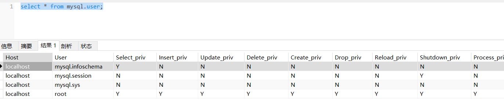

# 第12章 用户管理

## 12.1 查看用户

MySQL中的用户和权限都保存在mysql系统库相应的数据表中。MySQL服务器通过权限表来控制用户对数据库的访问，由MySQL_install_db脚本初始化。存储账户权限信息的表主要有user、db、host、tables_priv、columns_priv和procs_priv。

- user表：存储连接MySQL服务的账户信息，账户对全局有效；
- db表：存储用户对某个具体数据库的操作权限；
- tables_priv表：存储用户对某个数据表的操作权限；
- columns_priv表：存储用户对数据表的某一列的操作权限；
- procs_priv表：存储用户对存储过程和函数的操作权限。

```sql
select * from mysql.user;
```



## 12.2 用户管理

在MySQL 8.x中，默认的身份认证插件是“caching_sha2_password”，替代了之前的“mysql_native_password”。可以通过系统变量default_authentication_plugin和mysql数据库中的user表来看到这个变化。

在MySQL8之前默认的身份插件是“mysql_native_password”，即MySQL用户的密码使用PASSWORD函数进行加密。在MySQL 8.x中，默认的身份认证插件是“caching_sha2_password”，替代了之前的“mysql_native_password”，PASSWORD函数被弃用了。

在MySQL版本5.6.6版本起，在mysql.user表中添加了“password_expired”字段，它允许设置密码是否失效。如果“password_lifetime”字段值不为NULL，那么从MySQL服务启动时间开始，经过“password_lifetime”字段值的时间间隔之后，密码就过期了，即“password_expired”字段就为“Y”。任何密码超期的账号想要连接服务器端进行数据库操作都必须更改密码。MySQL8.0版本允许数据库管理员手动设置账户密码过期时间。

从MySQL 8.x版本开始允许限制重复使用以前的密码。

在MySQL8之前，如果要给多个用户授予相同的角色，需要为每个用户单独授权。在MySQL8之后，可以为多个用户赋予统一的角色，然后给角色授权即可，角色可以看成是一些权限的集合，这样就无须为每个用户单独授权。如果角色的权限修改，将会使得该角色下的所有用户的权限都跟着修改，这就非常方便。

mysql的密码字段有变化：

- mysql5.7之前mysql系统库的user表，密码字段名是password
- mysql5.7版本mysql系统库的user表，密码字段名是authentication_string

- mysql8.0版本mysql系统库的user表，密码字段名是authentication_string，另外用户管理还有角色概念，mysql系统库中有default_roles表。


创建、删除用户，以及为用户授权和撤销权限等请看可视化工具笔记（相关sql了解，不要求掌握）

```sql
-- 创建用户
create user '用户名'@'主机名' identified by '密码';

/*
create user 'shang'@'localhost' identified by '123456';
create user 'guigu'@'%' identified by '123456';
*/

-- 删除用户
drop user '用户名'@'主机名';

-- 修改密码
alter user '用户名'@'主机名' identified with caching_sha2_password by '新密码';
/*
alter user 'shang'@'localhost' identified with caching_sha2_password by '111111';
*/
```

```sql
-- 查看某个用户的权限
show grants for '用户名'@'主机名';

-- 授予权限
grant 权限列表 on 数据库名.表名 to '用户名'@'主机名';
/*
grant all on *.* to 'shang'@'localhost';
grant SELECT, INSERT, UPDATE, DELETE on *.* to 'shang'@'localhost';

grant SELECT, INSERT, UPDATE, DELETE on atguigu.* to 'shang'@'localhost';
*/


-- 撤销权限
revoke 权限列表 on 数据库名.表名 from '用户名'@'主机名';

/*
revoke SELECT, INSERT, UPDATE, DELETE on *.* from 'shang'@'localhost';
*/
```
